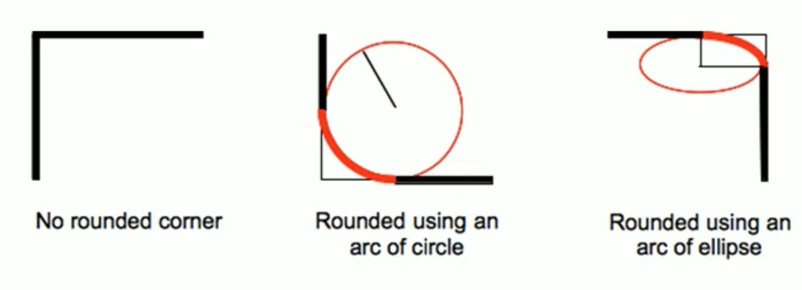
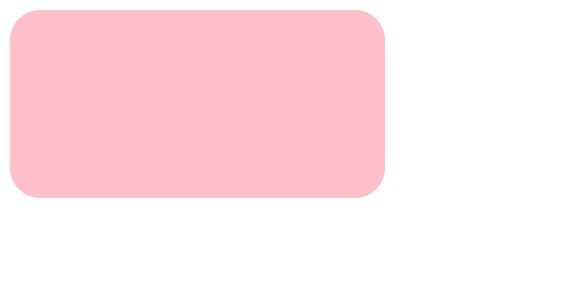
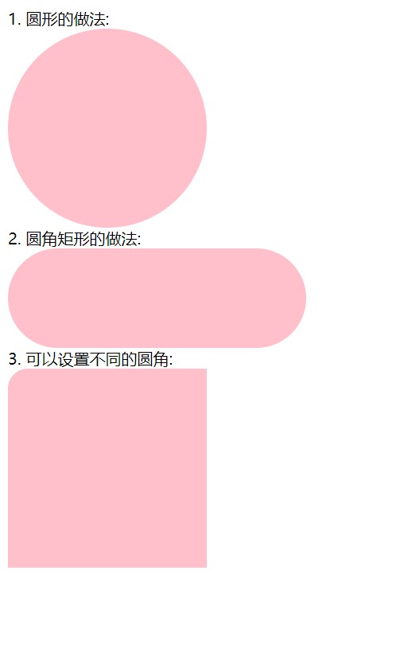
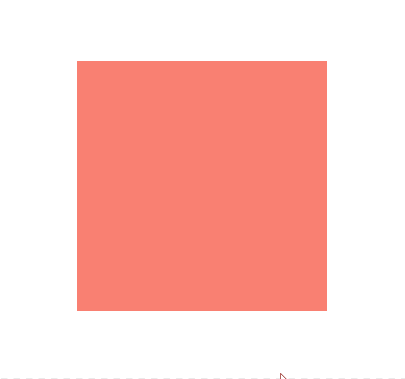

# 【圆角边框、盒子阴影、文字阴影】

> 本学习笔记是个人对 Pink 老师课程的总结归纳，转载请注明出处！ 

# 一、圆角边框

CSS 3 新增了圆角边框样式。

border-radius 属性用于设置元素的外边框圆角。

语法：

```css
border-radius: length;
```

原理：

border-radius 顾名思义：边框半径。

（椭）圆与边框的交集形成圆角效果。



```html
<!DOCTYPE html>
<html lang="en">

<head>
    <meta charset="UTF-8">
    <meta name="viewport" content="width=device-width, initial-scale=1.0">
    <meta http-equiv="X-UA-Compatible" content="ie=edge">
    <title>圆角边框</title>
    <style>
        div {
            width: 300px;
            height: 150px;
            background-color: pink;
            border-radius: 24px;
        }
    </style>
</head>

<body>
    <div></div>
</body>

</html>
```



注意：

- 参数值可以为数值或百分比的形式
- 如果是正方形，想要设置为圆形，那么只需要把数值修改为高度或者宽度的一半即可，或者直接写为 50%
- 如果是个矩形，设置为高度的一半就可以做 “胶囊” 效果了
- 该属性是一个简写属性，可以跟多个值
  - 四个值：左上角、右上角、右下角、左下角（从左上开始顺时针）
  - 三个值：左上、右上+左下、右下（对角为一组）
  - 两个值：左上+右下、右上+左下（对角为一组）
- 同时可以对特定角单独设置
  - 左上角：`border-top-left-radius`
  - 右上角：`border-top-right-radius`
  - 右下角：`border-bottom-right-radius`
  - 左下角：`border-bottom-left-radius`

```html
<!DOCTYPE html>
<html lang="en">

<head>
    <meta charset="UTF-8">
    <meta name="viewport" content="width=device-width, initial-scale=1.0">
    <meta http-equiv="X-UA-Compatible" content="ie=edge">
    <title>圆角边框常用写法</title>
    <style>
        .yuanxing {
            width: 200px;
            height: 200px;
            background-color: pink;
            /* border-radius: 100px; */
            /* 50% 就是宽度和高度的一半  等价于 100px */
            border-radius: 50%;
        }

        .juxing {
            width: 300px;
            height: 100px;
            background-color: pink;
            /* 圆角矩形设置为高度的一半 */
            border-radius: 50px;
        }

        .radius {
            width: 200px;
            height: 200px;
            /* border-radius: 10px 20px 30px 40px; */
            /* border-radius: 10px 40px; */
            border-top-left-radius: 20px;
            background-color: pink;
        }
    </style>
</head>

<body>
    1. 圆形的做法:
    <div class="yuanxing"></div>
    2. 圆角矩形的做法:
    <div class="juxing"></div>
    3. 可以设置不同的圆角:
    <div class="radius"></div>
</body>

</html>
```



# 二、盒子阴影

CSS 3 新增了盒子阴影。

box-shadow 属性用于为盒子添加阴影。

语法：

```css
box-shadow: h-shadow v-shadow blur spread color inset;
```

| 值         | 描述                                                         |
| ---------- | ------------------------------------------------------------ |
| `h-shadow` | 必须。水平阴影的位置，允许负值。                             |
| `v-shadow` | 必须。垂直阴影的位置，允许负值。                             |
| `blur`     | 可选。模糊距离（虚实程度）。                                 |
| `spread`   | 可选。阴影的尺寸（大小）。                                   |
| `color`    | 可选。阴影的颜色，请参阅 CSS 颜色值（阴影多为半透明颜色）。  |
| `inset`    | 可选。将外部阴影（outset）改为内部阴影（outset 不能指定，默认为空即可）。 |

```html
<!DOCTYPE html>
<html lang="en">

<head>
    <meta charset="UTF-8">
    <meta name="viewport" content="width=device-width, initial-scale=1.0">
    <meta http-equiv="X-UA-Compatible" content="ie=edge">
    <title>盒子阴影</title>
    <style>
        div {
            width: 200px;
            height: 200px;
            background-color: salmon;
            margin: 100px auto;
            /* box-shadow: 10px 10px; */
        }

        /* 伪类不仅仅可以用于 a 链接，还能用于其他标签 */
        /* 原先盒子没有影子,当我们鼠标经过盒子就添加阴影效果 */
        div:hover {
            box-shadow: 10px 10px 10px -4px rgba(0, 0, 0, .3);
        }
    </style>
</head>

<body>
    <div></div>
</body>

</html>
```



**三边阴影、双边阴影、单边阴影的设置方法：**

```html
<!DOCTYPE html>
<html lang="en">

<head>
    <meta charset="UTF-8">
    <meta http-equiv="X-UA-Compatible" content="IE=edge">
    <meta name="viewport" content="width=device-width, initial-scale=1.0">
    <title>盒子阴影 三边阴影、双边阴影、单边阴影</title>
    <style>
        div {
            width: 100px;
            height: 100px;
            background-color: #000;
            margin: 25px auto;
            color: white;
        }

        .a {
            box-shadow: 0 0 25px 5px red;
        }

        /* 三边阴影就是直接把整个阴影部分往下边移 */
        .b {
            box-shadow: 0 6px 10px 0 red;
        }

        /* 两边阴影要用盒子嵌套来解决 */
        .c1 {
            box-shadow: 0 10px 10px -5px red;
        }

        .c2 {
            width: 100%;
            box-shadow: 0 -10px 10px -5px red;
        }

        /* 单边阴影就是直接把整个阴影部分往下边移，并且减小阴影大小 */
        .d {
            box-shadow: 0 10px 10px -5px red;
        }
    </style>
</head>

<body>
    <div class="a">四边阴影</div>
    <div class="b">三边阴影</div>
    <div class="c1">
        <div class="c2">两边阴影</div>
    </div>
    <div class="d">一边阴影</div>
</body>

</html>
```


# 三、文字阴影

CSS 3 新增了文字阴影。

text-shadow 属性用于为文本添加阴影。

语法：

```css
text-shadow: h-shadow v-shadow blur color;
```

| 值         | 描述                                |
| ---------- | ----------------------------------- |
| `h-shadow` | 必须。水平阴影的位置。允许负值。    |
| `v-shadow` | 必须。垂直阴影的位置。允许负值。    |
| `blur`     | 可选。模糊的距离（虚实程度）。      |
| `color`    | 可选。阴影的颜色。参阅 CSS 颜色值。 |

```html
<!DOCTYPE html>
<html lang="en">

<head>
    <meta charset="UTF-8">
    <meta name="viewport" content="width=device-width, initial-scale=1.0">
    <meta http-equiv="X-UA-Compatible" content="ie=edge">
    <title>文字阴影</title>
    <style>
        div {
            font-size: 50px;
            color: salmon;
            font-weight: 700;
            text-shadow: 5px 5px 6px rgba(0, 0, 0, .3);
        }
    </style>
</head>

<body>
    <div>
        你是阴影,我是火影
    </div>
</body>

</html>
```

