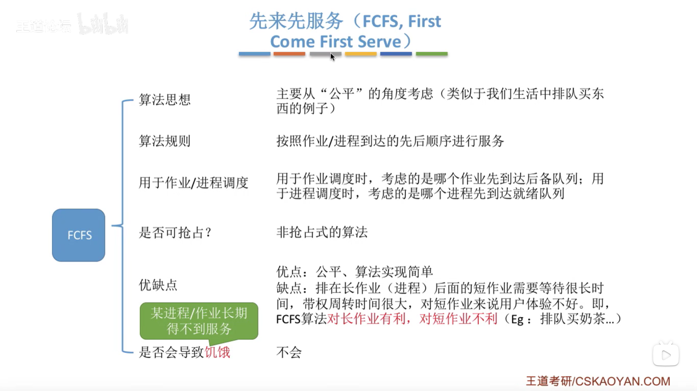
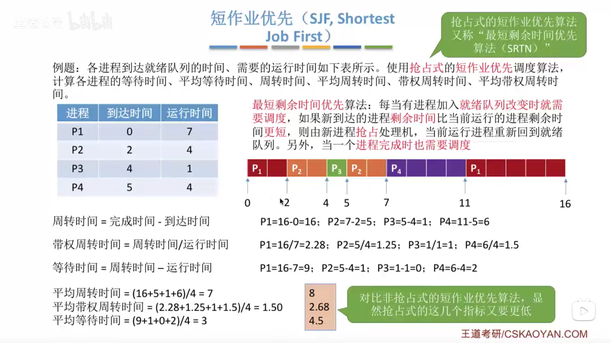
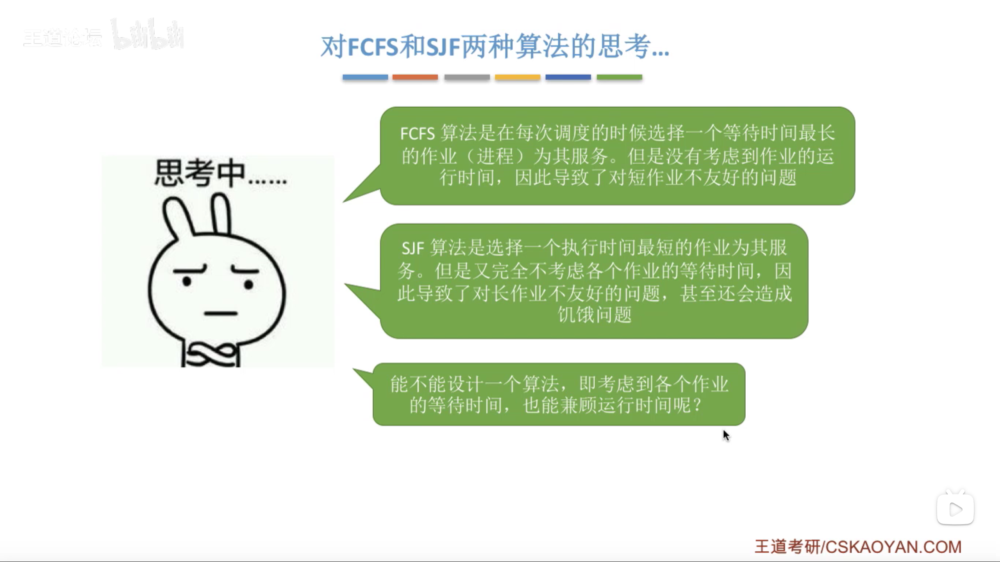
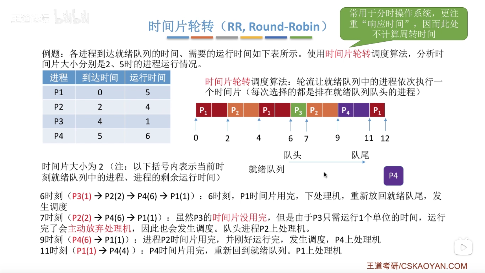
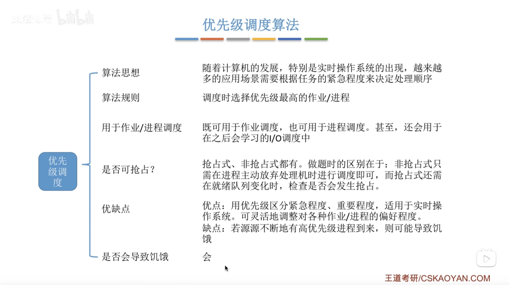
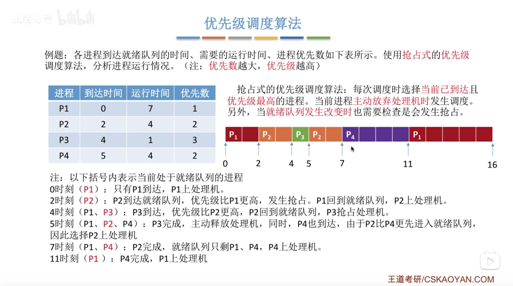
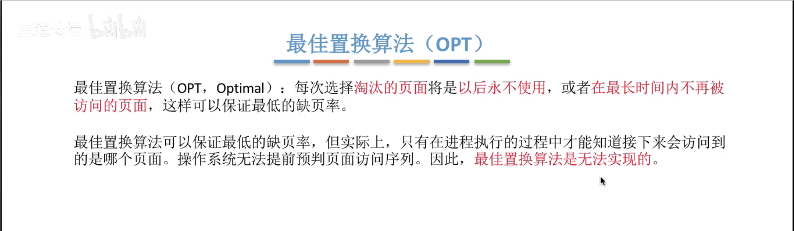
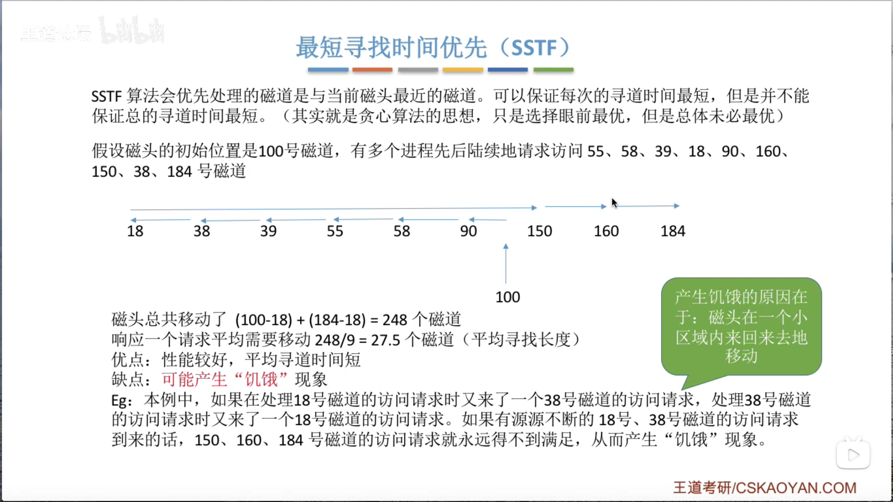
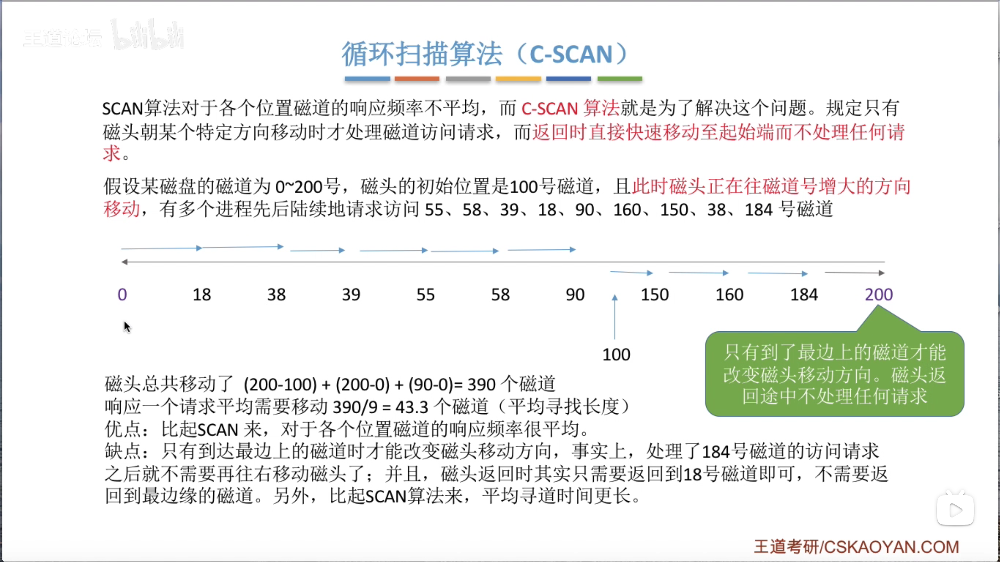
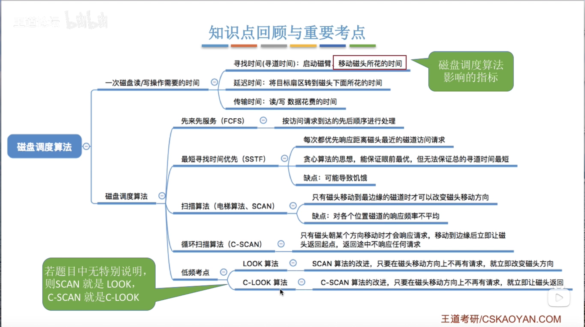

# 作业/进程调度算法

### 先来先服务（FCFS）【作业+进程】

### 短作业优先（SJF）【作业+进程】（非抢占式）

### 短作业优先（SJF）【作业+进程】（抢占式）

### 也叫“最短剩余时间优先（SRTN）”【进程】

### 思考

### 高响应比优先（HRRN）【作业+进程】

### 对比

### 时间片轮转法（RR）【进程】

##### 时间片大小为2

##### 时间片大小为5

##### 注意：

### 优先级调度算法【作业+进程】

##### 【非抢占式】

##### 【抢占式】

##### 附：

# 页面置换算法

### 最佳置换算法（OPT）

### 先进先出置换算法（FIFO）

### 最近最久未使用置换算法（LRU）

性能最接近最佳置换算法！

# 磁盘调度算法

### 先来先服务算法（FCFS）

### 最短寻找时间优先（SSTF）

### 扫描算法/电梯算法（SCAN）

### 循环扫描算法（C-SCAN）

### 总结

