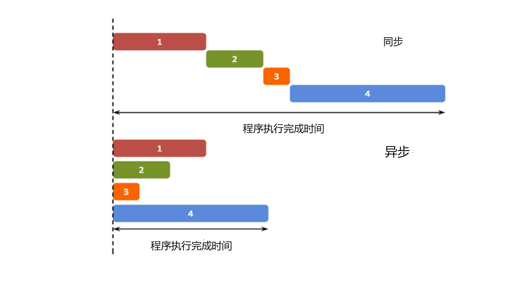
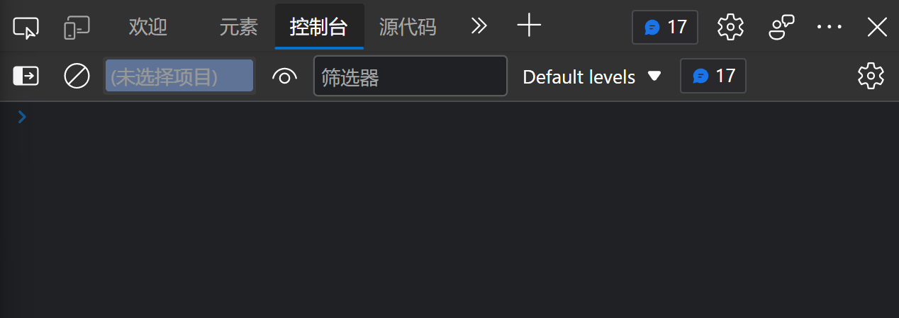

# 【ES6之Promise与Class类】

> 原创内容，转载请注明出处！

# 一、Promise

## 1.1 Promise 是什么？

Promise 是异步操作的一种解决方案。

> ### 异步的概念
>
> 异步（Asynchronous, async）是与同步（Synchronous, sync）相对的概念。
>
> 在我们学习的传统单线程编程中，程序的运行是同步的（同步不意味着所有步骤同时运行，而是指步骤在一个控制流序列中按顺序执行）。而异步的概念则是不保证同步的概念，也就是说，一个异步过程的执行将不再与原有的序列有顺序关系。
>
> 简单来理解就是：同步按你的代码顺序执行，异步不按照代码顺序执行，异步的执行效率更高。
>
> 以上是关于异步的概念的解释，接下来我们通俗地解释一下异步：异步就是从主线程发射一个子线程来完成任务。
>
> 
>
> ### 什么时候用异步编程
>
> 在前端编程中（甚至后端有时也是这样），我们在处理一些简短、快速的操作时，例如计算 1 + 1 的结果，往往在主线程中就可以完成。主线程作为一个线程，不能够同时接受多方面的请求。所以，当一个事件没有结束时，界面将无法处理其他请求。
>
> 现在有一个按钮，如果我们设置它的 onclick 事件为一个死循环，那么当这个按钮按下，整个网页将失去响应。
>
> 为了避免这种情况的发生，我们常常用子线程来完成一些可能消耗时间足够长以至于被用户察觉的事情，比如读取一个大文件或者发出一个网络请求。因为子线程独立于主线程，所以即使出现阻塞也不会影响主线程的运行。但是子线程有一个局限：一旦发射了以后就会与主线程失去同步，我们无法确定它的结束，如果结束之后需要处理一些事情，比如处理来自服务器的信息，我们是无法将它合并到主线程中去的。
>
> JavaScript 是单线程语言，为了解决多线程问题，JavaScript 中的异步操作函数往往通过回调函数来实现异步任务的结果处理。
>
> ### 回调函数
>
> 回调函数就是一个函数（作为函数参数的函数），它是在我们启动一个异步任务的时候就告诉它：等你完成了这个任务之后要干什么。这样一来主线程几乎不用关心异步任务的状态了，他自己会善始善终。
>
> ## 实例
>
> `setInterval()` 和 `setTimeout()` 是两个异步语句。
>
> 异步（asynchronous）：不会阻塞 CPU 继续执行其他语句，当异步完成时（包含回调函数的主函数的正常语句完成时），会执行 “回调函数”（callback）。
>
> ```html
> <!DOCTYPE html>
> <html>
> 
> <head>
>  <meta charset="utf-8">
>  <title>菜鸟教程(runoob.com)</title>
> </head>
> 
> <body>
> 
>  <p>回调函数等待 3 秒后执行。</p>
>  <p id="demo"></p>
>  <p>异步方式，不影响后续执行。</p>
>  <script>
>      function print() {
>          document.getElementById("demo").innerHTML = "RUNOOB!";
>      }
>      setTimeout(print, 3000);
>  </script>
> 
> </body>
> 
> </html>
> ```
>
> 
>
> 这段程序中的 setTimeout 就是一个消耗时间较长（3 秒）的过程，它的第一个参数是个回调函数，第二个参数是毫秒数，这个函数执行之后会产生一个子线程，子线程会等待 3 秒，然后执行回调函数 "print"，在命令行输出 "RUNOOB!"。
>
> 当然，JavaScript 语法十分友好，我们不必单独定义一个函数 print ，我们常常将上面的程序写成：
>
> ## 实例
>
> ```html
> <!DOCTYPE html>
> <html>
> 
> <head>
>  <meta charset="utf-8">
>  <title>菜鸟教程(runoob.com)</title>
> </head>
> 
> <body>
> 
>  <p>回调函数等待 3 秒后执行。</p>
>  <p id="demo"></p>
>  <p>异步方式，不影响后续执行。</p>
>  <script>
>      setTimeout(function () {
>          document.getElementById("demo").innerHTML = "RUNOOB!";
>      }, 3000);
>      /* ES6 箭头函数写法
>      setTimeout(() => {
>          document.getElementById("demo").innerHTML = "RUNOOB!";
>      }, 3000);
>      */
>  </script>
> 
> </body>
> 
> </html>
> ```
>
> **注意：**既然 setTimeout 会在子线程中等待 3 秒，在 setTimeout 函数执行之后主线程并没有停止，所以：
>
> ## 实例
>
> ```html
> <!DOCTYPE html>
> <html>
> 
> <head>
>  <meta charset="utf-8">
>  <title>菜鸟教程(runoob.com)</title>
> </head>
> 
> <body>
> 
>  <p>回调函数等待 3 秒后执行。</p>
>  <p id="demo1"></p>
>  <p id="demo2"></p>
>  <script>
>      setTimeout(function () {
>          document.getElementById("demo1").innerHTML = "RUNOOB-1!";
>      }, 3000);
>      document.getElementById("demo2").innerHTML = "RUNOOB-2!";
>  </script>
> 
> </body>
> 
> </html>
> ```
>
> 这段程序的执行结果是：
>
> 

（之前常用的异步操作解决方案是：回调函数）

```javascript
document.addEventListener(
    'click',
    () => {
        console.log('这里是异步的');
    },
    false
);
console.log('这里是同步的');
```

什么时候使用 Promise 呢？

Promise 一般用来解决层层嵌套的回调函数（回调地狱 callback hell）的问题。

例如下面展示两个回调地狱的例子：

例子1：分别间隔一秒打印省市县

```html
<!DOCTYPE html>
<html lang="zh">

<head>
    <meta charset="UTF-8">
    <meta http-equiv="X-UA-Compatible" content="IE=edge">
    <meta name="viewport" content="width=device-width, initial-scale=1.0">
    <title>回调举例</title>
</head>

<body>
    <script>
        /*
        // 此种方式，省市县都会在一秒后同时打印，没有实现要求
        setTimeout(() => {
            console.log("云南省");
        }, 1000);
        setTimeout(() => {
            console.log("玉溪市");
        }, 1000);
        setTimeout(() => {
            console.log("峨山县");
        }, 1000);
        */

        // 通过回调函数的方式，实现异步
        setTimeout(() => {
            console.log("云南省");
            setTimeout(() => {
                console.log("玉溪市");
                setTimeout(() => {
                    console.log("峨山县");
                }, 1000);
            }, 1000);
        }, 1000);
        console.log("通过回调函数的方式，实现异步");
    </script>
</body>

</html>
```



例子2：当我们点击窗口后，盒子依次 “右——>下——>左” 移动

```html
<!DOCTYPE html>
<html lang="en">
<head>
    <meta charset="UTF-8"/>
    <title>Promise</title>
    <style>
        * {
            padding: 0;
            margin: 0;
        }

        #box {
            width: 300px;
            height: 300px;
            background-color: red;
            transition: all 0.5s;
        }
    </style>
</head>
<body>
<div id="box"></div>
<script>    
    // 运动函数
    const move = (el, {x = 0, y = 0} = {}, end = () => {}) => {
        el.style.transform = `translate3d(${x}px, ${y}px, 0)`;
        el.addEventListener(
            // transitionend 事件在 CSS 完成过渡后触发。
            'transitionend',
            () => {
                end();
            },
            false
        );
    };

    const boxEl = document.getElementById('box');

    // 形成回调地狱
    document.addEventListener(
        'click',
        () => {
            move(boxEl, {x: 150}, () => {
                move(boxEl, {x: 150, y: 150}, () => {
                    move(boxEl, {y: 150}, () => {
                        move(boxEl, {x: 0, y: 0});
                    });
                });
            });
        },
        false
    );
</script>
</body>
</html>
```


## 1.2 Promise 的基本用法

### 1.2.1 实例化构造函数生成实例对象

Promise 实质上是一个构造函数。

### 1.2.2 Promise 的状态

### 1.2.3 then 方法

### 1.2.4 resolve 和 reject 函数的参数
