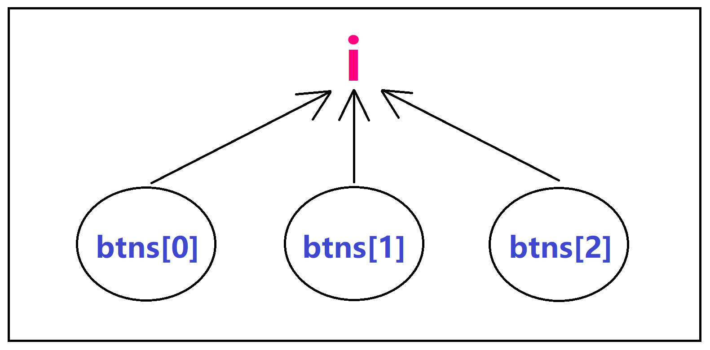
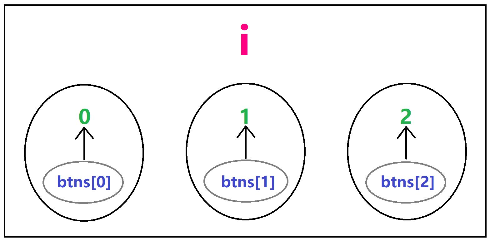
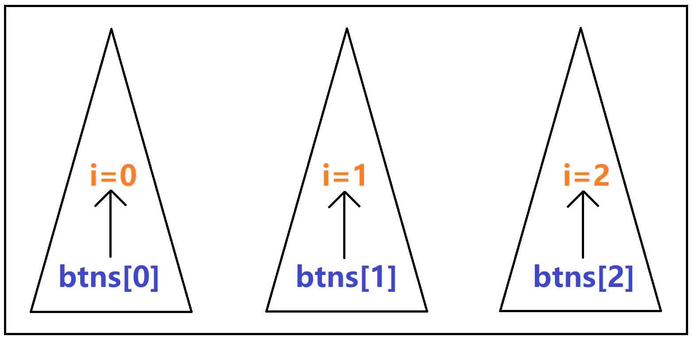

# 【ES6基础入门】

> 原创内容，转载请注明出处！

# 一、初始 ES6

## 1.1 ES6 简介

ES6 = ECMAScript 这门标准的第 6 代版本（2015）。

- ECMAScript 是语言的标准
- 6 是版本号

ECMA：欧洲计算机制造商协会

具体内容：语法 + API

历史版本：ES1——>3、ES5——>6（ES4 被废弃了）

我们目前使用 JS 的大部分内容都是 ES3 的部分。

ES 与 JS 的关系：`JavaScript(浏览器端) = ESMAScript(语法+API) + DOM + BOM`

 ES6 的兼容性：

- 主流浏览器的最新版本几乎都全部支持 ES6
- IE 老版本等不支持的浏览器，可以使用 Babel 转码
- **总之，请放心大胆地使用 ES6**

## 1.2 let 和 const

简单解释：

- `let` 用于声明变量（对应之前的 `var`）
- `const` 用于声明常量（之前没有常量的概念）

### 1.2.1 变量与常量

变量：初始化后可以重新赋值的量

常量：初始化后不可以重新赋值的量

### 1.2.2 const

 **（1）为什么需要 const**

因为某些量的值是一直固定的，不需要也不能被修改，如果被修改就会报错。

**（2）const 注意事项**

- 使用 const 声明常量，一但声明就**必须立即初始化**，不能分开赋值

  ```javascript
  const name = 'jerry'; √
  -------------------------
  const name;
  name = 'jerry'; ×
  ```

- const 声明的常量，允许在不重新赋值的情况下修改它的值

  ```javascript
  // 基本数据类型不适用
  -------------------
  // 引用数据类型
  const person = {
      username: 'jerry'
  }；
  
  person.username = 'zjr'; √
  ```

### 1.2.3 什么时候用 let，什么使用用 const

原则：如果不知道用什么的时候，就用 const

原因：如果应该是常量，那么刚好符号需求。如果应该是变量，那么后来报错时，再来改为变量也为时不晚。同时，一开始就设置为常量还会避免真的需要为常量时，该值在后来被意外修改的情况。

## 1.3 let、const 与 var 的区别

- 重复声明
- 变量提升
- 暂时性死区
- window 对象的属性和方法（全局作用域中）
- 块级作用域

> 下面以 let 与 var 的对比来说明，const 与 let 同理

### 1.3.1 重复声明

```javascript
var a = 10;
var a = 24;
console.log(a);		// 24
```

```javascript
let a = 10;
let a = 24;
console.log(a);		// 报错
```

```javascript
function func(a) {
    var a = 1;
    console.log(a);		// 1
}
func(24);
```

```javascript
function func(a) {
    let a = 1;
    console.log(a);		// 报错
}
func(24);
```

### 1.3.2 变量提升

```javascript
console.log(a);		// undefined
var a = 24;
```

```javascript
console.log(a);		// 报错
let a = 24;
```

> 对于所有的变量和常量来说都应该遵循：**先声明后使用**的原则！

### 1.3.3 暂时性死区

只要作用域内存在 let、const，它们所声明的变量或常量就自动 “绑定” 这个区域，不再受到外部作用域的影响。

```javascript
let a = 2;
function func() {
    console.log(a);		// 报错
    let a = 1;
}
func();
```

```javascript
let a = 2;
function func() {
    console.log(a);		// 2
}
func();
```

**即：只要作用域内出现了同名的 let 或 const，那么就会去找这个量（向前找），如果找不到也不会跳去外部找，只会直接报错！**

> 只要我们遵守 “**先声明后使用**”，那么其实就基本不会遇到变量提升及暂时性死区问题。

### 1.3.4 window 对象的属性和方法（全局作用域中）

全局作用域中，`var` 声明的变量，`function` 声明的函数，会自动变成 window 对象的属性或方法。

```javascript
var age = 18;
function add() {}
console.log(window.age);			// 18
console.log(window.add === add);	// true
```

```javascript
let age = 18;
const add = function() {}
console.log(window.age);			// undefined
console.log(window.add === add);	// false
```

### 1.3.5 块级作用域

- var 没有块级作用域

```javascript
for (var i = 0; i < 3; i++) {
}
console.log(i);		// 3
```

- let、const 有块级作用域

```javascript
for (let i = 0; i < 3; i++) {
}
console.log(i);		// 报错
```

- 作用域链：内层作用域 ——> 外层作用域 ——> 全局作用域

- 块级作用域：除了对象 `{}`，函数 `{}`（函数作用域）之外的一切 `{}` 都属于块级作用域。

## 1.4 let 和 const 的应用

要求：在页面上显示三个按钮（1、2、3），点击任何一个按钮便显示该按钮对应的数字。

- 使用 var

```html
<!DOCTYPE html>
<html lang="en">
<head>
    <meta charset="UTF-8"/>
    <meta content="width=device-width, initial-scale=1.0" name="viewport"/>
    <meta content="ie=edge" http-equiv="X-UA-Compatible"/>
    <title>let 和 const 的应用</title>
    <style>
        body {
            padding: 50px 0 0 150px;
        }

        .btn {
            width: 100px;
            height: 100px;
            margin-right: 20px;
            font-size: 80px;
            cursor: pointer;
        }
    </style>
</head>
<body>
<button class="btn">0</button>
<button class="btn">1</button>
<button class="btn">2</button>

<script>
     var btns = document.querySelectorAll('.btn');

     for (var i = 0; i < btns.length; i++) {
       btns[i].addEventListener(
         'click',
         function () {
           console.log(i);
         },
         false
       );
     }
</script>
</body>
</html>

```


无论点击谁都是 3，这是因为 var 没有块级作用域，三个点击事件函数中的 i 都是同一个全局变量，最终 i 都为 3 了，所以固然都输出 3。



- 使用 var，同时利用闭包

```html
<!DOCTYPE html>
<html lang="en">
<head>
    <meta charset="UTF-8"/>
    <meta content="width=device-width, initial-scale=1.0" name="viewport"/>
    <meta content="ie=edge" http-equiv="X-UA-Compatible"/>
    <title>let 和 const 的应用</title>
    <style>
        body {
            padding: 50px 0 0 150px;
        }

        .btn {
            width: 100px;
            height: 100px;
            margin-right: 20px;
            font-size: 80px;
            cursor: pointer;
        }
    </style>
</head>
<body>
<button class="btn">0</button>
<button class="btn">1</button>
<button class="btn">2</button>

<script>
    var btns = document.querySelectorAll('.btn');

    for (var i = 0; i < btns.length; i++) {
        (function (index) {
            btns[index].addEventListener(
                'click',
                function () {
                    console.log(index);
                },
                false
            );
        })(i);
    }
</script>
</body>
</html>
```


三个点击事件函数中的 i 对应到三个闭包上，且闭包的 i 为函数参数（局部变量），分别是 0、1、2。



- 使用 let

```html
<!DOCTYPE html>
<html lang="en">
<head>
    <meta charset="UTF-8"/>
    <meta content="width=device-width, initial-scale=1.0" name="viewport"/>
    <meta content="ie=edge" http-equiv="X-UA-Compatible"/>
    <title>let 和 const 的应用</title>
    <style>
        body {
            padding: 50px 0 0 150px;
        }

        .btn {
            width: 100px;
            height: 100px;
            margin-right: 20px;
            font-size: 80px;
            cursor: pointer;
        }
    </style>
</head>
<body>
<button class="btn">0</button>
<button class="btn">1</button>
<button class="btn">2</button>

<script>
    let btns = document.querySelectorAll('.btn');

    for (let i = 0; i < btns.length; i++) {
        btns[i].addEventListener(
            'click',
            function () {
                console.log(i);
            },
            false
        );
    }
</script>
</body>
</html>
```


