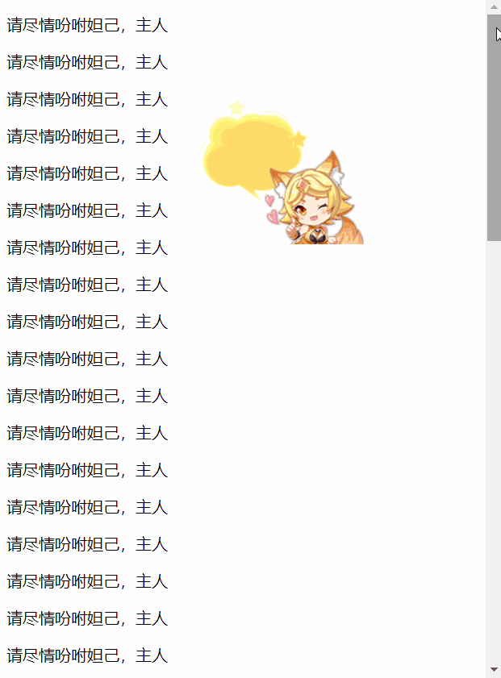
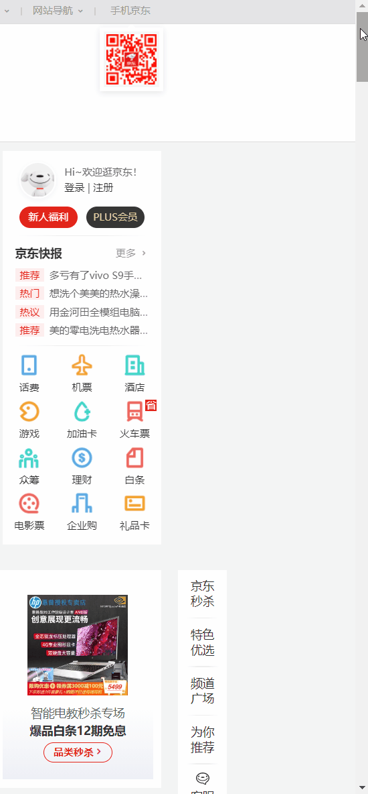
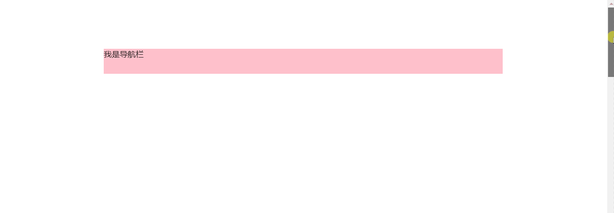
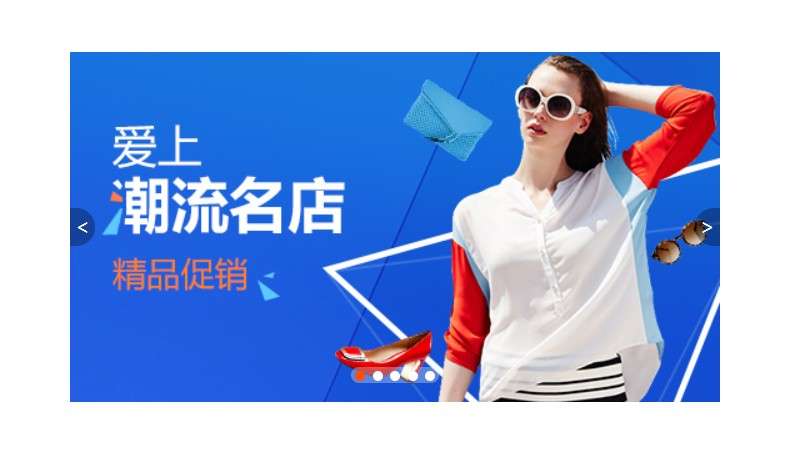
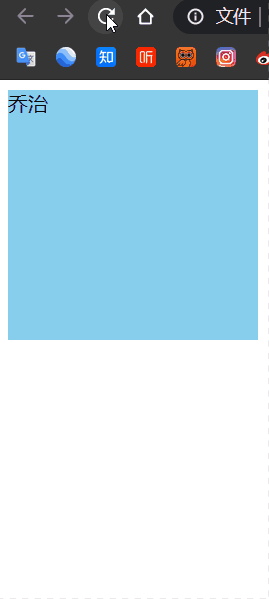
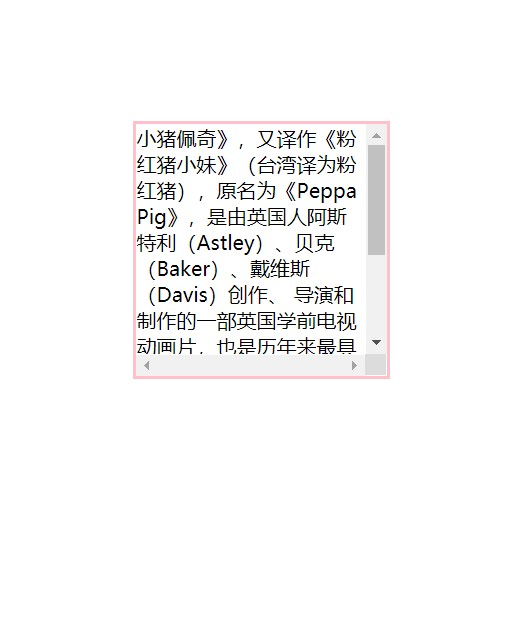

# 【CSS定位】

> 本文档是个人对 Pink 老师课程的总结归纳及补充，转载请注明出处！ 

# 一、定位

## 1.1 为什么需要定位？

提问： 以下情况使用标准流或者浮动能实现吗？

1. 某个元素可以**自由**的在一个盒子内移动位置，并且压住其他盒子。

2. 当我们滚动窗口的时候，盒子是**固定**屏幕某个位置的。

以上效果，标准流或浮动都无法快速实现，此时需要定位来实现。

所以：

1. 浮动可以让多个块级盒子一行没有缝隙排列显示， 经常用于横向排列盒子。
2. 定位则是可以让盒子自由的在某个盒子内移动位置或者固定屏幕中某个位置，并且可以压住其他盒子。

## 1.2 定位组成

定位：将盒子定在某一个位置，所以定位也是在摆放盒子， 按照定位的方式移动盒子。

`定位 = 定位模式 + 边偏移`

- 定位模式用于指定一个元素在文档中的定位方式
- 边偏移则决定了该元素的最终位置

**（1）定位模式**

定位模式决定元素的定位方式，它通过 CSS 的 `position` 属性来设置，其值可以分为四个。

| 值         | 语义     |
| ---------- | -------- |
| `static`   | 静态定位 |
| `relative` | 相对定位 |
| `absolute` | 绝对定位 |
| `fixed`    | 固定定位 |

**（2）边偏移**

边偏移就是定位的盒子移动的最终位置。有 `top`、`bottom`、`left` 和 `right` 4 个属性。

注意：可以为负值。

| 边偏移属性 | 实例           | 描述                                           |
| ---------- | -------------- | ---------------------------------------------- |
| `top`      | `top: 80px`    | 顶端偏移量，定义元素相对于其父元素上边线的距离 |
| `bottom`   | `bottom: 80px` | 底部偏移量，定义元素相对于其父元素下边线的距离 |
| `left`     | `left: 80px`   | 左侧偏移量，定义元素相对于其父元素左边线的距离 |
| `rigth`    | `right: 80px`  | 右侧偏移量，定义元素相对于其父元素右边线的距离 |

## 1.3 静态定位 static（了解）

静态定位是元素的默认定位方式，无定位的意思。

语法：

```css
选择器 { position: static; }
```

1. 静态定位按照标准流特性摆放位置，它没有边偏移

2. 静态定位在布局时很少用到

## 1.4 相对定位 relative（重要）

相对定位是元素在移动位置的时候**相对于它原来的位置**来说的定位（自恋型）。

语法：

```css
选择器 { position: relative; }
```

相对定位的特点：（务必记住）

1. 它是相对于自己原来的位置来移动的（移动位置的时候参照点是自己原来的位置点）
2. 原来在**标准流的位置继续占有**，后面的盒子仍然以标准流的方式对待它

因此，**相对定位并没有脱标**。它最典型的应用是给绝对定位当爹的。

```html
<!doctype html>
<html lang="en">

<head>
    <meta charset="UTF-8">
    <meta name="viewport" content="width=device-width, initial-scale=1.0">
    <meta http-equiv="X-UA-Compatible" content="ie=edge">
    <title>相对定位</title>
    <style>
        .box1 {
            position: relative;
            top: 100px;
            left: 100px;
            width: 200px;
            height: 200px;
            background-color: pink;
        }

        .box2 {
            width: 200px;
            height: 200px;
            background-color: deeppink;
        }
    </style>
</head>

<body>
    <div class="box1">

    </div>
    <div class="box2">

    </div>

</body>

</html>
```


## 1.5 绝对定位 absolute（重要）

绝对定位是元素在移动位置的时候**相对于它祖先元素**来说的定位（拼爹型）。

语法：

```css
选择器 { position: absolute; }
```

绝对定位的特点：（务必记住）

1. 如果没有祖先元素或者祖先元素没有定位，则以浏览器为准定位（Document 文档）
2. 如果祖先元素有定位（相对、绝对、固定定位），则以**最近一级的有定位祖先元素为参考点**移动位置
3. 绝对定位**不再占有原先的位置**（脱标），并且**脱标的程度大于浮动**（会压住浮动）

所以绝对定位是**脱离标准流**的。

```html
<!doctype html>
<html lang="en">

<head>
    <meta charset="UTF-8">
    <meta name="viewport" content="width=device-width, initial-scale=1.0">
    <meta http-equiv="X-UA-Compatible" content="ie=edge">
    <title>绝对定位-无父亲或者父亲无定位</title>
    <style>
        .father {
            width: 500px;
            height: 500px;
            background-color: skyblue;
        }

        .son {
            position: absolute;
            /* top: 10px;
            left: 10px; */
            /* top: 100px;
            right: 200px; */
            left: 0;
            bottom: 0;
            width: 200px;
            height: 200px;
            background-color: pink;
        }
    </style>
</head>

<body>
    <div class="father">
        <div class="son"></div>
    </div>
</body>

</html>
```


---

```html
<!doctype html>
<html lang="en">

<head>
    <meta charset="UTF-8">
    <meta name="viewport" content="width=device-width, initial-scale=1.0">
    <meta http-equiv="X-UA-Compatible" content="ie=edge">
    <title>绝对定位-父级有定位-一级父亲</title>
    <style>
        .father {
            position: relative;
            width: 500px;
            height: 500px;
            background-color: skyblue;
        }
        
        .son {
            position: absolute;
            /* top: 10px;
            left: 10px; */
            /* top: 100px;
            right: 200px; */
            left: 0;
            bottom: 0;
            width: 200px;
            height: 200px;
            background-color: pink;
        }
    </style>
</head>

<body>
    <div class="father">
        <div class="son"></div>
    </div>
</body>

</html>
```


---

```html
<!doctype html>
<html lang="en">

<head>
    <meta charset="UTF-8">
    <meta name="viewport" content="width=device-width, initial-scale=1.0">
    <meta http-equiv="X-UA-Compatible" content="ie=edge">
    <title>绝对定位-父级有定位-多级父亲</title>
    <style>
        /* 以最近一级的有定位祖先元素为参考点移动位置 */
        /* 即：谁带有定位并且离我最近，我就以谁为准！ */
        .yeye {
            position: relative;
            width: 800px;
            height: 800px;
            background-color: hotpink;
            padding: 50px;
        }

        .father {
            width: 500px;
            height: 500px;
            background-color: skyblue;
        }

        .son {
            position: absolute;
            left: 30px;
            bottom: 10px;
            width: 200px;
            height: 200px;
            background-color: pink;
        }
    </style>
</head>

<body>
    <div class="yeye">
        <div class="father">
            <div class="son"></div>
        </div>
    </div>
</body>

</html>
```


---

```html
<!doctype html>
<html lang="en">

<head>
    <meta charset="UTF-8">
    <meta name="viewport" content="width=device-width, initial-scale=1.0">
    <meta http-equiv="X-UA-Compatible" content="ie=edge">
    <title>绝对定位-脱标</title>
    <style>
        .father {
            position: relative;
            width: 500px;
            height: 500px;
            background-color: skyblue;
        }

        .son {
            position: absolute;
            left: 0;
            bottom: 0;
            width: 200px;
            height: 200px;
            background-color: pink;
        }

        .son2 {
            width: 200px;
            height: 200px;
            background-color: gray;
        }
    </style>
</head>

<body>
    <div class="father">
        <div class="son"></div>
        <div class="son2"></div>
    </div>

</body>

</html>
```


**问题：**

1. 绝对定位和相对定位到底有什么使用场景呢？
2. 为什么说相对定位给绝对定位当爹的呢？

## 1.6 子绝父相的由来

弄清楚这个口诀，就明白了绝对定位和相对定位的使用场景。

这个 “子绝父相” 太重要了，是我们学习定位的口诀，是定位中最常用的一种方式这句话的意思是：子级是绝对定位的话，父级要用相对定位。

1. **子级绝对定位，不会占有位置，可以放到父盒子里面的任何一个地方，不会影响其他的兄弟盒子**
2. **父盒子需要加定位限制子盒子在父盒子内显示**
3. **父盒子布局时，需要占有位置，因此父亲只能是相对定位**

这就是子绝父相的由来，所以相对定位经常用来作为绝对定位的父级。

总结： 因为父级需要占有位置，因此是相对定位， 子盒子不需要占有位置，则是绝对定位。

当然，子绝父相不是永远不变的，如果父元素不需要占有位置，“子绝父绝” 也会遇到。

**思考：为什么非要用定位？浮动不可以吗？**

答案：用浮动做某些布局远远没有定位简单和方便！例如，轮播图。


- 左右两边的图片切换按钮，利用浮动也可以做。但是，假如放置图片的盒子是在切换按钮之前添加的，那么根据浮动元素只能影响后面盒子的特性，切换按钮就只可能在图片底部之下，不可能浮于图片之上！
- 就算切换按钮用浮动实现了，但是左下角的轮播序号点图如果也用浮动实现，结果就是轮播序号点图会与切换按钮在一行并排浮动！

可见，浮动单纯用于左右排列盒子是非常适合的，但是用于空间层次上排列盒子就不适合了！应该用定位实现。

**重点：竖向上布局找标准流，横向上布局找浮动，空间上布局找定位！**

【案例：学成在线 hot new 模块】

```html
<div class="box-bd">
	<ul class="clearfix">	
    	<li>
            <!-- 
			<em> 不是单纯的倾斜文本，该标签本质上是告诉浏览器把其中的文本表示为强调的内容，
			所以，<em> 可以用来包含强调的元素。
			-->
        	<em>
            	
          	</em>
         	
          	<h4>
            Think PHP 5.0 博客系统实战项目演练
          	</h4>
          	<div class="info">
            	<span>高级</span> • 1125人在学习
          	</div>
    	</li>
        ...
    </ul>
</div>
```

```css
.box-bd ul {
    width: 1225px;
}
.box-bd ul li {
    /* 子绝父相 */
    position: relative;
    float: left;
    width: 228px;
    height: 270px;
    background-color: #fff;
    margin-right: 15px;
    margin-bottom: 15px;
   
}
.box-bd ul li > img {
    width: 100%;
}
.box-bd ul li h4 {
    margin: 20px 20px 20px 25px;
    font-size: 14px;
    color: #050505;
    font-weight: 400;
}
.box-bd ul li em {
    /* 子绝父相 */
    position: absolute;
    top: 4px;
    right: -4px;
}
.box-bd .info {
    margin: 0 20px 0 25px;
    font-size: 12px;
    color: #999;
}
.box-bd .info span {
    color: #ff7c2d;
}
```


## 1.7 固定定位 fixed （重要）

固定定位是元素固定于浏览器可视区的位置。

主要使用场景： 可以在浏览器页面滚动时元素的位置不会改变。

语法：

```css
选择器 { position: fixed; }
```

固定定位的特点（务必记住）：

1. 以**浏览器的可视窗口为参照点**移动元素
   - 跟父元素没有任何关系
   - 不随滚动条滚动
2. 固定定位不再占有原先的位置
   - 固定定位也是**脱标**的，其实固定定位也可以看做是一种**特殊的绝对定位**。

应用举例：


```html
<!doctype html>
<html lang="en">

<head>
    <meta charset="UTF-8">
    <meta name="viewport" content="width=device-width, initial-scale=1.0">
    <meta http-equiv="X-UA-Compatible" content="ie=edge">
    <title>固定定位</title>
    <style>
        .dj {
            position: fixed;
            top: 100px;
            left: 200px;
        }
    </style>
</head>

<body>
    <div class="dj">
        
    </div>
    <p>请尽情吩咐妲己，主人</p>
    <p>请尽情吩咐妲己，主人</p>
    <p>请尽情吩咐妲己，主人</p>
    <p>请尽情吩咐妲己，主人</p>
    <p>请尽情吩咐妲己，主人</p>
    <p>请尽情吩咐妲己，主人</p>
    <p>请尽情吩咐妲己，主人</p>
    <p>请尽情吩咐妲己，主人</p>
    <p>请尽情吩咐妲己，主人</p>
    <p>请尽情吩咐妲己，主人</p>
    <p>请尽情吩咐妲己，主人</p>
    <p>请尽情吩咐妲己，主人</p>
    <p>请尽情吩咐妲己，主人</p>
    <p>请尽情吩咐妲己，主人</p>
    <p>请尽情吩咐妲己，主人</p>
    <p>请尽情吩咐妲己，主人</p>
    <p>请尽情吩咐妲己，主人</p>
    <p>请尽情吩咐妲己，主人</p>
    <p>请尽情吩咐妲己，主人</p>
    <p>请尽情吩咐妲己，主人</p>
    <p>请尽情吩咐妲己，主人</p>
    <p>请尽情吩咐妲己，主人</p>
    <p>请尽情吩咐妲己，主人</p>
    <p>请尽情吩咐妲己，主人</p>
    <p>请尽情吩咐妲己，主人</p>
    <p>请尽情吩咐妲己，主人</p>
    <p>请尽情吩咐妲己，主人</p>
    <p>请尽情吩咐妲己，主人</p>
    <p>请尽情吩咐妲己，主人</p>
    <p>请尽情吩咐妲己，主人</p>
    <p>请尽情吩咐妲己，主人</p>
    <p>请尽情吩咐妲己，主人</p>
    <p>请尽情吩咐妲己，主人</p>
    <p>请尽情吩咐妲己，主人</p>
    <p>请尽情吩咐妲己，主人</p>
    <p>请尽情吩咐妲己，主人</p>
    <p>请尽情吩咐妲己，主人</p>
    <p>请尽情吩咐妲己，主人</p>
    <p>请尽情吩咐妲己，主人</p>
    <p>请尽情吩咐妲己，主人</p>
    <p>请尽情吩咐妲己，主人</p>
    <p>请尽情吩咐妲己，主人</p>
    <p>请尽情吩咐妲己，主人</p>
    <p>请尽情吩咐妲己，主人</p>
    <p>请尽情吩咐妲己，主人</p>
    <p>请尽情吩咐妲己，主人</p>
    <p>请尽情吩咐妲己，主人</p>
    <p>请尽情吩咐妲己，主人</p>
    <p>请尽情吩咐妲己，主人</p>
    <p>请尽情吩咐妲己，主人</p>
    <p>请尽情吩咐妲己，主人</p>
    <p>请尽情吩咐妲己，主人</p>

</body>

</html>
```



## 1.8 固定定位小技巧：固定在版心右侧位置

**小算法：**

1. 让固定定位的盒子 `left: 50%`，走到浏览器可视区（也可以看做版心） 一半的位置
2. 让固定定位的盒子 `margin-left: 版心宽度的一半距离`，多走版心宽度的一半位置

就可以让固定定位的盒子贴着版心右侧对齐了。

```html
<!doctype html>
<html lang="en">

<head>
    <meta charset="UTF-8">
    <meta name="viewport" content="width=device-width, initial-scale=1.0">
    <meta http-equiv="X-UA-Compatible" content="ie=edge">
    <title>固定定位小技巧-固定到版心右侧</title>
    <style>
        .w {
            width: 800px;
            height: 1400px;
            background-color: pink;
            margin: 0 auto;
        }

        .fixed {
            position: fixed;
            /* 1. 走浏览器宽度的一半 */
            left: 50%;
            /* 2. 利用 margin 走版心盒子宽度的一半距离（为了美观多加了 5px）*/
            margin-left: 405px;
            width: 50px;
            height: 150px;
            background-color: skyblue;
        }
    </style>
</head>

<body>
    <div class="fixed"></div>
    <div class="w">版心盒子 800像素</div>

</body>

</html>
```


## 1.9 粘性定位 sticky（了解）

粘性定位可以被认为是相对定位和固定定位的混合。

Sticky 粘性的。

语法：

```css
选择器 { position: sticky; top: 10px; }
```

粘性定位的特点：

1. 以浏览器的**可视窗口为参照点**移动元素（固定定位特点）
2. 粘性定位**占有原先的位置**（相对定位特点）
3. 必须添加 top 、left、right、bottom 其中一个才有效

跟页面滚动搭配使用。 兼容性较差，IE 不支持。

未来开发的趋势，但目前并不常用（目前用 javascript 来实现粘性定位效果）。

应用举例：



```html
<!doctype html>
<html lang="en">

<head>
    <meta charset="UTF-8">
    <meta name="viewport" content="width=device-width, initial-scale=1.0">
    <meta http-equiv="X-UA-Compatible" content="ie=edge">
    <title>粘性定位</title>
    <style>
        body {
            height: 3000px;
        }

        .nav {
            /* 粘性定位 */
            position: sticky;
            top: 0;
            width: 800px;
            height: 50px;
            background-color: pink;
            margin: 100px auto;
        }
    </style>
</head>

<body>
    <div class="nav">我是导航栏</div>
</body>

</html>
```




## 1.10 定位的总结

| 定位模式          | 是否脱标         | 移动位置           | 是否常用   |
| ----------------- | ---------------- | ------------------ | ---------- |
| static 静态定位   | 否               | 不能使用边偏移     | 很少       |
| relative 相对定位 | 否（占有位置）   | 相对于自身位置移动 | 常用       |
| absolute 绝对定位 | 是（不占有位置） | 带有定位的父级     | 常用       |
| fixed 固定定位    | 是（不占有位置） | 浏览器可视区       | 常用       |
| sticky 粘性定位   | 否（占有位置）   | 浏览器可视区       | 当前阶段少 |

1. 一定记住，相对定位、固定定位、绝对定位 两个大的特点： 1. 是否占有位置（脱标否） 2. 以谁为基准点移动位置。
2. 学习定位重点学会子绝父相。

## 1.11 定位叠放次序 z-index

在使用定位布局时，可能会出现盒子重叠的情况。此时，可以使用 z-index 来控制盒子的前后次序（z轴）。

语法：

```css
选择器 { z-index: 1; }
```

- 数值可以是正整数、负整数或 0，默认是 auto，数值越大，盒子越靠上
- 如果属性值相同，则按照书写顺序，后来居上
- 数字后面不能加单位
- 只有定位的盒子才有 z-index 属性

## 1.12 定位的拓展

**（1）绝对定位的盒子居中**

加了绝对定位的盒子不能通过 `margin: 0 auto` 水平居中，但是可以通过以下计算方法实现水平和垂直居中。

1. `left: 50%;`：让盒子的左侧移动到父级元素的水平中心位置。
2. `margin-left: -0.5widthpx;`：让盒子向左移动自身宽度的一半。

```html
<!doctype html>
<html lang="en">

<head>
    <meta charset="UTF-8">
    <meta name="viewport" content="width=device-width, initial-scale=1.0">
    <meta http-equiv="X-UA-Compatible" content="ie=edge">
    <title>绝对定位水平垂直居中</title>
    <style>
        .box {
            position: absolute;
            /* 1. left 走 50%  父容器宽度的一半 */
            left: 50%;
            /* 2. margin 负值 往左边走 自己盒子宽度的一半 */
            margin-left: -100px;
            /* 垂直居中同理 */
            top: 50%;
            margin-top: -100px;
            width: 200px;
            height: 200px;
            background-color: pink;
            /* margin: auto; */
        }
    </style>
</head>

<body>
    <div class="box"></div>
</body>

</html>
```


**（2）定位特殊特性**

**绝对定位和固定定位也和浮动类似。**

1. 行内元素添加绝对或者固定定位，可以直接设置高度和宽度。
2. 块级元素添加绝对或者固定定位，如果不给宽度或者高度，默认大小是内容的大小。

```html
<!doctype html>
<html lang="en">

<head>
    <meta charset="UTF-8">
    <meta name="viewport" content="width=device-width, initial-scale=1.0">
    <meta http-equiv="X-UA-Compatible" content="ie=edge">
    <title>定位的特殊特性</title>
    <style>
        span {
            position: absolute;
            top: 100px;
            width: 200px;
            height: 150px;
            background-color: pink;
        }

        div {
            position: absolute;
            background-color: skyblue;
        }
    </style>
</head>

<body>
    <span>123</span>

    <div>abcd</div>
</body>

</html>
```


**（3）脱标的盒子不会触发外边距塌陷**

浮动元素、绝对定位（固定定位）元素的都不会触发外边距合并的问题。

**（4）绝对定位（固定定位）会完全压住盒子**

浮动元素不同，只会压住它下面标准流的盒子，但是不会压住下面标准流盒子里面的文字（图片）。

但是绝对定位（固定定位） 会压住下面标准流所有的内容。

浮动之所以不会压住文字，因为浮动产生的目的最初是为了做文字环绕效果的。 文字会围绕浮动元素。

```html
<!doctype html>
<html lang="en">

<head>
    <meta charset="UTF-8">
    <meta name="viewport" content="width=device-width, initial-scale=1.0">
    <meta http-equiv="X-UA-Compatible" content="ie=edge">
    <title>浮动产生原来的目的是做文字环绕效果</title>
    <style>
        img {
            float: left;
        }
    </style>
</head>

<body>
    1993年，在古装片《战神传说》中扮演一个武功超群的渔民；同年，主演动作喜剧片《至尊三十六计之偷天换日》，在片中饰演赌术高明的千门高手钱文迪；此外，他还主演了爱情片《天长地久》，在片中塑造了一个风流不羁的江湖浪子形象。
    1994年，刘德华投资并主演了剧情片《天与地》，在片中饰演面对恶势力却毫不退缩的禁毒专员张一鹏。1995年，主演赛车励志片《烈火战车》，在片中饰演叛逆、倔强的阿祖，并凭借该片获得第15届香港电影金像奖最佳男主角提名；同年在动作片《大冒险家》中演绎了立仁从小时候父母双亡到长大后进入泰国空军的故事。
    1996年，主演黑帮题材的电影《新上海滩》，在片中饰演对冯程程痴情一片的丁力。1997年，担任剧情片《香港制造》的制作人；同年，主演爱情片《天若有情之烽火佳人》，在片中饰演家世显赫的空军少尉刘天伟；12月，与梁家辉联袂主演警匪动作片《黑金》，在片中饰演精明干练、嫉恶如仇的调查局机动组组长方国辉。1998年，主演动作片《龙在江湖》
    
    ，饰演重义气的黑帮成员韦吉祥；同年，出演喜剧片《赌侠1999》；此外，他还担任剧情片《去年烟花特别多》的制作人。
    1993年，在古装片《战神传说》中扮演一个武功超群的渔民；同年，主演动作喜剧片《至尊三十六计之偷天换日》，在片中饰演赌术高明的千门高手钱文迪；此外，他还主演了爱情片《天长地久》，在片中塑造了一个风流不羁的江湖浪子形象。
    1994年，刘德华投资并主演了剧情片《天与地》，在片中饰演面对恶势力却毫不退缩的禁毒专员张一鹏。1995年，主演赛车励志片《烈火战车》，在片中饰演叛逆、倔强的阿祖，并凭借该片获得第15届香港电影金像奖最佳男主角提名；同年在动作片《大冒险家》中演绎了立仁从小时候父母双亡到长大后进入泰国空军的故事。
    1996年，主演黑帮题材的电影《新上海滩》，在片中饰演对冯程程痴情一片的丁力。1997年，担任剧情片《香港制造》的制作人；同年，主演爱情片《天若有情之烽火佳人》，在片中饰演家世显赫的空军少尉刘天伟；12月，与梁家辉联袂主演警匪动作片《黑金》，在片中饰演精明干练、嫉恶如仇的调查局机动组组长方国辉。1998年，主演动作片《龙在江湖》，饰演重义气的黑帮成员韦吉祥；同年，出演喜剧片《赌侠1999》；此外，他还担任剧情片《去年烟花特别多》的制作人。
</body>

</html>
```


---

```html
<!doctype html>
<html lang="en">

<head>
    <meta charset="UTF-8">
    <meta name="viewport" content="width=device-width, initial-scale=1.0">
    <meta http-equiv="X-UA-Compatible" content="ie=edge">
    <title>定位会完全压住标准流盒子内容</title>
    <style>
        .box {
            /* 1.浮动的元素不会压住下面标准流的文字 */
            /* float: left; */
            /* 2. 绝对定位（固定定位） 会压住下面标准流所有的内容。 */
            position: absolute;
            width: 150px;
            height: 150px;
            background-color: pink;
        }
    </style>
</head>

<body>
    <div class="box"></div>
    <p>阁下何不同风起，扶摇直上九万里</p>
</body>

</html>
```


# 二、综合案例

**【案例：淘宝焦点图布局】**


布局分析：


制作：

1. 大盒子我们类名为： tb-promo 淘宝广告
2. 里面先放一张图片
3. 左右两个按钮用链接就好了，左箭头 prev 右箭头 next
4. 底侧小圆点 ul 继续做，类名为 promo-nav

```html
<!doctype html>
<html lang="en">

<head>
    <meta charset="UTF-8">
    <meta name="viewport" content="width=device-width, initial-scale=1.0">
    <meta http-equiv="X-UA-Compatible" content="ie=edge">
    <title>淘宝轮播图做法</title>
    <style>
        * {
            margin: 0;
            padding: 0;
        }

        li {
            list-style: none;
        }

        .tb-promo {
            position: relative;
            width: 520px;
            height: 280px;
            background-color: pink;
            margin: 100px auto;
        }

        .tb-promo img {
            width: 520px;
            height: 280px;
        }

        /* 并集选择器可以集体声明相同的样式 */
        .prev,
        .next {
            position: absolute;
            /* 绝对定位的盒子垂直居中 */
            top: 50%;
            margin-top: -15px;
            /* 加了绝对定位的盒子可以直接设置高度和宽度 */
            width: 20px;
            height: 30px;
            background: rgba(0, 0, 0, .3);
            text-align: center;
            line-height: 30px;
            color: #fff;
            text-decoration: none;
        }

        .prev {
            left: 0;
            /* border-radius: 15px; */
            border-top-right-radius: 15px;
            border-bottom-right-radius: 15px;
        }

        .next {
            /* 如果一个盒子既有 left 属性也有 right 属性，则默认会执行 left 属性 
            同理 top bottom 会执行 top */
            right: 0;
            /* border-radius: 15px; */
            border-top-left-radius: 15px;
            border-bottom-left-radius: 15px;
        }

        .promo-nav {
            position: absolute;
            bottom: 15px;
            left: 50%;
            margin-left: -35px;
            width: 70px;
            height: 13px;
            /* background-color: pink; */
            background: rgba(255, 255, 255, .3);
            border-radius: 7px;
        }

        .promo-nav li {
            float: left;
            width: 8px;
            height: 8px;
            background-color: #fff;
            border-radius: 50%;
            margin: 3px;
        }

        /* 不要忘记选择器权重的问题 */
        .promo-nav .selected {
            background-color: #ff5000;
        }
    </style>
</head>

<body>
    <div class="tb-promo">
        
        <!-- 左侧按钮箭头 -->
        <a href="#" class="prev"> &lt; </a>
        <!-- 右侧按钮箭头 -->
        <a href="#" class="next"> &gt; </a>
        <!-- 小圆点 -->
        <ul class="promo-nav">
            <li class="selected"></li>
            <li></li>
            <li></li>
            <li></li>
            <li></li>
        </ul>
    </div>
</body>

</html>
```



# 三、网页布局总结

通过盒子模型，清楚知道大部分 html 标签是一个盒子。

通过 CSS 浮动、定位可以让每个盒子排列成为网页。

一个完整的网页，是标准流、浮动、定位一起完成布局的，每个都有自己的专门用法。

1. 标准流

可以让盒子上下排列或者左右排列，垂直的块级盒子显示就用标准流布局。

2. 浮动

可以让多个块级元素一行显示或者左右对齐盒子，多个块级盒子水平显示就用浮动布局。

3. 定位

定位最大的特点是有层叠的概念，就是可以让多个盒子前后叠压来显示。如果元素自由在某个盒子内移动就用定位布局。

**重点：竖向上布局找标准流，横向上布局找浮动，空间上布局找定位！**

# 四、元素的显示与隐藏

类似网站广告，当我们点击关闭就不见了，但是我们重新刷新页面，会重新出现！

本质：让一个元素在页面中隐藏或者显示出来。

注意：是隐藏，不是删除！

1. display 显示隐藏（脱标）
2. visibility 显示隐藏（不脱标）
3. overflow 溢出显示隐藏

## 4.1 display 属性

display 属性用于设置一个元素应如何显示。

- `display: none`：隐藏对象
- `display：block`：除了转换为块级元素之外，同时还有显示元素的意思

display 隐藏元素后，不再占有原来的位置（**脱标**）。

后面应用及其广泛，搭配 JS 可以做很多的网页特效。

```html
<!doctype html>
<html lang="en">

<head>
    <meta charset="UTF-8">
    <meta name="viewport" content="width=device-width, initial-scale=1.0">
    <meta http-equiv="X-UA-Compatible" content="ie=edge">
    <title>显示隐藏元素之display</title>
    <style>
        .peppa {
            display: none;
            /* display: block; */
            width: 200px;
            height: 200px;
            background-color: pink;

        }

        .george {
            width: 200px;
            height: 200px;
            background-color: skyblue;
        }
    </style>
</head>

<body>
    <div class="peppa">佩奇</div>		<!-- 佩奇被隐藏 -->
    <div class="george">乔治</div>
</body>

</html>
```


---

```html
<!doctype html>
<html lang="en">

<head>
    <meta charset="UTF-8">
    <meta name="viewport" content="width=device-width, initial-scale=1.0">
    <meta http-equiv="X-UA-Compatible" content="ie=edge">
    <title>显示隐藏元素之display</title>
    <style>
        .peppa {
            /* display: none; */
            display: block;
            width: 200px;
            height: 200px;
            background-color: pink;

        }

        .george {
            width: 200px;
            height: 200px;
            background-color: skyblue;
        }
    </style>
</head>

<body>
    <div class="peppa">佩奇</div>		<!-- 佩奇被显示 -->
    <div class="george">乔治</div>
</body>

</html>
```



## 4.2 visibility 可见性

visibility 属性用于指定一个元素应可见还是隐藏。

- `visibility：visible`：元素可视
- `visibility：hidden`：元素隐藏

visibility **隐藏元素后，继续占有原来的位置**。

如果隐藏元素想要原来位置， 就用 visibility：hidden。

如果隐藏元素不想要原来位置， 就用 display：none（用处更多，重点）。

```html
<!doctype html>
<html lang="en">

<head>
    <meta charset="UTF-8">
    <meta name="viewport" content="width=device-width, initial-scale=1.0">
    <meta http-equiv="X-UA-Compatible" content="ie=edge">
    <title>显示隐藏元素之display</title>
    <style>
        .baba {
            visibility: hidden;
            width: 200px;
            height: 200px;
            background-color: pink;

        }

        .mama {
            width: 200px;
            height: 200px;
            background-color: skyblue;
        }
    </style>
</head>

<body>
    <div class="baba">猪爸爸</div>
    <div class="mama">猪妈妈</div>
</body>

</html>
```


## 4.3 overflow 溢出

overflow 属性指定了如果内容溢出一个元素的框（**超过其指定高度及宽度**）时，会发生什么。

| 属性值    | 描述                                                   |
| --------- | ------------------------------------------------------ |
| `visible` | 不剪切内容也不添加滚动条（默认方式）                   |
| `hidden`  | 不显示超过对象尺寸的内容，超出的部分隐藏掉（并非删除） |
| `scroll`  | 不管超出的内容否，总是显示滚动条                       |
| `auto`    | 超出自动显示滚动条，不超出不显示滚动条                 |

一般情况下，我们都不想让溢出的内容显示出来，因为溢出的部分会影响布局。

但是如果有定位的盒子， 请慎用 overflow: hidden 因为它会隐藏多余的部分（例如：学成在线 hot new 模块，右上角有故意超出的部分，此时就不能使用 overflow: hidden）。

```html
<!doctype html>
<html lang="en">

<head>
    <meta charset="UTF-8">
    <meta name="viewport" content="width=device-width, initial-scale=1.0">
    <meta http-equiv="X-UA-Compatible" content="ie=edge">
    <title>显示隐藏元素之overflow</title>
    <style>
        .peppa {
            /* overflow: visible; */
            /* overflow: hidden; */
            /* scroll 溢出的部分显示滚动条  不溢出也显示滚动条 */
            /* overflow: scroll; */
            /* auto 溢出的时候才显示滚动条 不溢出不显示滚动条 */
            /* overflow: auto; */
            width: 200px;
            height: 200px;
            border: 3px solid pink;
            margin: 100px auto;
        }
    </style>
</head>

<body>
    <div class="peppa">
        小猪佩奇》，又译作《粉红猪小妹》（台湾译为粉红猪），原名为《Peppa
        Pig》，是由英国人阿斯特利（Astley）、贝克（Baker）、戴维斯（Davis）创作、
        导演和制作的一部英国学前电视动画片，也是历年来最具潜力的学前儿童品牌。
        故事围绕小猪佩奇与家人的愉快经历，幽默而有趣，
        藉此宣扬传统家庭观念与友情，鼓励小朋友们体验生活。
    </div>

</body>

</html>
```


---

```html
<!doctype html>
<html lang="en">

<head>
    <meta charset="UTF-8">
    <meta name="viewport" content="width=device-width, initial-scale=1.0">
    <meta http-equiv="X-UA-Compatible" content="ie=edge">
    <title>显示隐藏元素之overflow</title>
    <style>
        .peppa {
            overflow: visible;
            /* overflow: hidden; */
            /* scroll 溢出的部分显示滚动条  不溢出也显示滚动条 */
            /* overflow: scroll; */
            /* auto 溢出的时候才显示滚动条 不溢出不显示滚动条 */
            /* overflow: auto; */
            width: 200px;
            height: 200px;
            border: 3px solid pink;
            margin: 100px auto;
        }
    </style>
</head>

<body>
    <div class="peppa">
        小猪佩奇》，又译作《粉红猪小妹》（台湾译为粉红猪），原名为《Peppa
        Pig》，是由英国人阿斯特利（Astley）、贝克（Baker）、戴维斯（Davis）创作、
        导演和制作的一部英国学前电视动画片，也是历年来最具潜力的学前儿童品牌。
        故事围绕小猪佩奇与家人的愉快经历，幽默而有趣，
        藉此宣扬传统家庭观念与友情，鼓励小朋友们体验生活。
    </div>

</body>

</html>
```


---

```html
<!doctype html>
<html lang="en">

<head>
    <meta charset="UTF-8">
    <meta name="viewport" content="width=device-width, initial-scale=1.0">
    <meta http-equiv="X-UA-Compatible" content="ie=edge">
    <title>显示隐藏元素之overflow</title>
    <style>
        .peppa {
            /* overflow: visible; */
            overflow: hidden;
            /* scroll 溢出的部分显示滚动条  不溢出也显示滚动条 */
            /* overflow: scroll; */
            /* auto 溢出的时候才显示滚动条 不溢出不显示滚动条 */
            /* overflow: auto; */
            width: 200px;
            height: 200px;
            border: 3px solid pink;
            margin: 100px auto;
        }
    </style>
</head>

<body>
    <div class="peppa">
        小猪佩奇》，又译作《粉红猪小妹》（台湾译为粉红猪），原名为《Peppa
        Pig》，是由英国人阿斯特利（Astley）、贝克（Baker）、戴维斯（Davis）创作、
        导演和制作的一部英国学前电视动画片，也是历年来最具潜力的学前儿童品牌。
        故事围绕小猪佩奇与家人的愉快经历，幽默而有趣，
        藉此宣扬传统家庭观念与友情，鼓励小朋友们体验生活。
    </div>

</body>

</html>
```


---

```html
<!doctype html>
<html lang="en">

<head>
    <meta charset="UTF-8">
    <meta name="viewport" content="width=device-width, initial-scale=1.0">
    <meta http-equiv="X-UA-Compatible" content="ie=edge">
    <title>显示隐藏元素之overflow</title>
    <style>
        .peppa {
            /* overflow: visible; */
            /* overflow: hidden; */
            /* scroll 溢出的部分显示滚动条  不溢出也显示滚动条 */
            overflow: scroll;
            /* auto 溢出的时候才显示滚动条 不溢出不显示滚动条 */
            /* overflow: auto; */
            width: 200px;
            height: 200px;
            border: 3px solid pink;
            margin: 100px auto;
        }
    </style>
</head>

<body>
    <div class="peppa">
        小猪佩奇》，又译作《粉红猪小妹》（台湾译为粉红猪），原名为《Peppa
        Pig》，是由英国人阿斯特利（Astley）、贝克（Baker）、戴维斯（Davis）创作、
        导演和制作的一部英国学前电视动画片，也是历年来最具潜力的学前儿童品牌。
        故事围绕小猪佩奇与家人的愉快经历，幽默而有趣，
        藉此宣扬传统家庭观念与友情，鼓励小朋友们体验生活。
    </div>

</body>

</html>
```



---

```html
<!doctype html>
<html lang="en">

<head>
    <meta charset="UTF-8">
    <meta name="viewport" content="width=device-width, initial-scale=1.0">
    <meta http-equiv="X-UA-Compatible" content="ie=edge">
    <title>显示隐藏元素之overflow</title>
    <style>
        .peppa {
            /* overflow: visible; */
            /* overflow: hidden; */
            /* scroll 溢出的部分显示滚动条  不溢出也显示滚动条 */
            overflow: scroll;
            /* auto 溢出的时候才显示滚动条 不溢出不显示滚动条 */
            /* overflow: auto; */
            width: 200px;
            height: 200px;
            border: 3px solid pink;
            margin: 100px auto;
        }
    </style>
</head>

<body>
    <div class="peppa">
        小猪佩奇》，又译作《粉红猪小妹》（台湾译为粉红猪），原名为《Peppa
        Pig》
    </div>

</body>

</html>
```


---

```html
<!doctype html>
<html lang="en">

<head>
    <meta charset="UTF-8">
    <meta name="viewport" content="width=device-width, initial-scale=1.0">
    <meta http-equiv="X-UA-Compatible" content="ie=edge">
    <title>显示隐藏元素之overflow</title>
    <style>
        .peppa {
            /* overflow: visible; */
            /* overflow: hidden; */
            /* scroll 溢出的部分显示滚动条  不溢出也显示滚动条 */
            /* overflow: scroll; */
            /* auto 溢出的时候才显示滚动条 不溢出不显示滚动条 */
            overflow: auto;
            width: 200px;
            height: 200px;
            border: 3px solid pink;
            margin: 100px auto;
        }
    </style>
</head>

<body>
    <div class="peppa">
        小猪佩奇》，又译作《粉红猪小妹》（台湾译为粉红猪），原名为《Peppa
        Pig》，是由英国人阿斯特利（Astley）、贝克（Baker）、戴维斯（Davis）创作、
        导演和制作的一部英国学前电视动画片，也是历年来最具潜力的学前儿童品牌。
        故事围绕小猪佩奇与家人的愉快经历，幽默而有趣，
        藉此宣扬传统家庭观念与友情，鼓励小朋友们体验生活。
    </div>

</body>

</html>
```


---

```html
<!doctype html>
<html lang="en">

<head>
    <meta charset="UTF-8">
    <meta name="viewport" content="width=device-width, initial-scale=1.0">
    <meta http-equiv="X-UA-Compatible" content="ie=edge">
    <title>显示隐藏元素之overflow</title>
    <style>
        .peppa {
            /* overflow: visible; */
            /* overflow: hidden; */
            /* scroll 溢出的部分显示滚动条  不溢出也显示滚动条 */
            /* overflow: scroll; */
            /* auto 溢出的时候才显示滚动条 不溢出不显示滚动条 */
            overflow: auto;
            width: 200px;
            height: 200px;
            border: 3px solid pink;
            margin: 100px auto;
        }
    </style>
</head>

<body>
    <div class="peppa">
        小猪佩奇》，又译作《粉红猪小妹》（台湾译为粉红猪），原名为《Peppa
        Pig》
    </div>

</body>

</html>
```


## 4.4 总结

1. display 显示隐藏元素 但是不保留位置
2. visibility 显示隐藏元素 但是保留原来的位置
3. overflow 溢出显示隐藏 但是只是对于溢出的部分处理

# 五、综合案例

**【案例：土豆网鼠标经过显示遮罩】**

1. 练习元素的显示与隐藏
2. 练习元素的定位

核心原理：原先半透明的黑色遮罩看不见， 鼠标经过大盒子，就显示出来。

遮罩的盒子不占有位置，就需要用绝对定位 和 display 配合使用。

```html
<!doctype html>
<html lang="en">

<head>
    <meta charset="UTF-8">
    <meta name="viewport" content="width=device-width, initial-scale=1.0">
    <meta http-equiv="X-UA-Compatible" content="ie=edge">
    <title>仿土豆网显示隐藏遮罩案例</title>
    <style>
        .tudou {
            position: relative;
            width: 444px;
            height: 320px;
            background-color: pink;
            margin: 30px auto;
        }

        .tudou img {
            width: 100%;
            height: 100%;
        }

        .mask {
            /* 隐藏遮罩层 */
            display: none;
            /* 添加定位使其能够浮与其他盒子上方 */
            position: absolute;
            top: 0;
            left: 0;
            width: 100%;
            height: 100%;
            background: rgba(0, 0, 0, .4) url(images/arr.png) no-repeat center;
        }

        /* 当我们鼠标经过了 土豆这个盒子，就让里面遮罩层显示出来 */
        .tudou:hover .mask {
            /* 而是显示元素 */
            display: block;
        }
    </style>
</head>

<body>
    <div class="tudou">
        <div class="mask"></div>
        
    </div>
</body>

</html>
```

