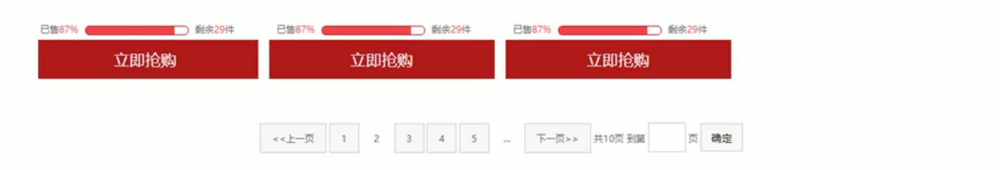

# 【布局技巧：margin负值、文字围绕浮动、行内快、CSS三角、CSS初始化】

> 本学习笔记是个人对 Pink 老师课程的总结归纳，转载请注明出处！ 

# 一、margin负值的运用

如何实现以下效果呢？

多个盒子紧挨在一起，当鼠标放在其中一个盒子上时该盒子的边框自动变色。


1. 让每个盒子 margin 往左侧移动 -1px 正好压住相邻盒子边框（否则边框会发生叠加 * 2）
2. 鼠标经过某个盒子的时候，提高当前盒子的层级即可（如果周围盒子没有定位，则对当前盒子加相对定位（保留位置并显示在其他盒子之上）；如果周围有定位，则提高当前盒子的 z-index）

```html
<!doctype html>
<html lang="en">

<head>
    <meta charset="UTF-8">
    <meta name="viewport" content="width=device-width, initial-scale=1.0">
    <meta http-equiv="X-UA-Compatible" content="ie=edge">
    <title>margin负值的巧妙运用</title>
    <style>
        ul li {
            position: relative;
            float: left;
            list-style: none;
            width: 150px;
            height: 200px;
            border: 1px solid red;
            margin-left: -1px;
        }

        /* ul li:hover {
           1. 如果盒子没有定位，则鼠标经过添加相对定位即可
        position: relative;
        border: 1px solid blue;

       } */
        ul li:hover {
            /* 2.如果li都有定位，则利用 z-index提高层级 */
            z-index: 1;
            border: 1px solid blue;
        }
    </style>
</head>

<body>
<ul>
    <li>1</li>
    <li>2</li>
    <li>3</li>
    <li>4</li>
    <li>5</li>
</ul>
</body>

</html>
```


# 二、文字围绕浮动元素


在制作文字位于图片周围的效果时，可以巧妙运用浮动元素不会压住文字的特性。

```html
<!doctype html>
<html lang="en">
<head>
    <meta charset="UTF-8">
    <meta name="viewport" content="width=device-width, initial-scale=1.0">
    <meta http-equiv="X-UA-Compatible" content="ie=edge">
    <title>文字围绕浮动元素的妙用</title>
    <style>
        * {
            margin: 0;
            padding: 0;
        }

        .box {
            width: 300px;
            height: 70px;
            background-color: #d4d4d4;
            margin: 0 auto;
            padding: 5px;
        }

        .pic {
            float: left;
            width: 120px;
            height: 60px;
            margin-right: 5px;
        }

        .pic img {
            width: 100%;
        }
    </style>
</head>
<body>
<div class="box">
    <div class="pic">
        
    </div>
    <p>【集锦】热身赛-巴西0-1秘鲁 内马尔替补两人血染赛场</p>
</div>
</body>
</html>
```


# 三、行内块的巧妙运用



页码在页面中间显示：

1. 把这些链接盒子转换为行内块， 之后给父级指定 `text-align: center;`
2. 利用行内块元素中间有缝隙，并且给父级添加 `text-align: center;` 行内块元素会水平会居中

```html
<!doctype html>
<html lang="en">
<head>
    <meta charset="UTF-8">
    <meta name="viewport" content="width=device-width, initial-scale=1.0">
    <meta http-equiv="X-UA-Compatible" content="ie=edge">
    <title>行内块的巧妙运用</title>
    <style>
        * {
            margin: 0;
            padding: 0;
        }

        .box {
            text-align: center;
        }

        .box a {
            display: inline-block;
            width: 36px;
            height: 36px;
            background-color: #f7f7f7;
            border: 1px solid #ccc;
            line-height: 36px;
            text-decoration: none;
            color: #333;
            font-size: 14px;
        }

        .box .prev,
        .box .next {
            width: 85px;
        }

        .box .current,
        .box .elp {
            background-color: #fff;
            border: none;
        }

        .box input {
            height: 36px;
            width: 45px;
            border: 1px solid #ccc;
            outline: none;
        }

        .box button {
            width: 60px;
            height: 36px;
            background-color: #f7f7f7;
            border: 1px solid #ccc;

        }
    </style>
</head>
<body>
<div class="box">
    <a href="#" class="prev">&lt;&lt;上一页</a>
    <a href="#" class="current">2</a>
    <a href="#">3</a>
    <a href="#">4</a>
    <a href="#">5</a>
    <a href="#">6</a>
    <a href="#" class="elp">...</a>
    <a href="#" class="next">&gt;&gt;下一页</a>
    到第
    <input type="text">
    页
    <button>确定</button>
</div>
</body>
</html>
```


# 四、CSS三角强化


代码：

```css
width: 0;
height: 0;
border-color: transparent red transparent transparent;
border-style: solid;
border-width: 22px 8px 0 0;
```

案例：

```html
<!doctype html>
<html lang="en">
<head>
    <meta charset="UTF-8">
    <meta name="viewport" content="width=device-width, initial-scale=1.0">
    <meta http-equiv="X-UA-Compatible" content="ie=edge">
    <title>CSS三角强化的巧妙运用</title>
    <style>
        .box1 {
            width: 0;
            height: 0;
            /* 把上边框宽度调大 */
            /* border-top: 100px solid transparent;
            border-right: 50px solid skyblue; */
            /* 左边和下边的边框宽度设置为0 */
            /* border-bottom: 0 solid blue;
            border-left: 0 solid green; */
            /* 1.只保留右边的边框有颜色 */
            border-color: transparent red transparent transparent;
            /* 2. 样式都是solid */
            border-style: solid;
            /* 3. 上边框宽度要大， 右边框 宽度稍小， 其余的边框该为 0 */
            border-width: 100px 50px 0 0;

        }

        .price {
            width: 160px;
            height: 24px;
            line-height: 24px;
            border: 1px solid red;
            margin: 0 auto;
        }

        .miaosha {
            position: relative;
            float: left;
            width: 90px;
            height: 100%;
            background-color: red;
            text-align: center;
            color: #fff;
            font-weight: 700;
            margin-right: 8px;

        }

        .miaosha i {
            position: absolute;
            right: 0;
            top: 0;
            width: 0;
            height: 0;
            border-color: transparent #fff transparent transparent;
            border-style: solid;
            border-width: 24px 10px 0 0;
        }

        .origin {
            font-size: 12px;
            color: gray;
            text-decoration: line-through;
        }
    </style>
</head>
<body>
<div class="box1"></div>
<div class="price">
            <span class="miaosha">
                ¥1650
                <i></i>
            </span>
    <span class="origin">¥5650</span>
</div>
</body>
</html>
```


# 五、CSS初始化

不同浏览器对有些标签的默认值是不同的，为了消除不同浏览器对 HTML 文本呈现的差异，照顾浏览器的兼容，我们需要对 CSS 初始化。

简单理解：CSS 初始化是指重设浏览器的样式。(也称为 CSS reset）

每个网页都必须首先进行 CSS 初始化。

这里我们以 京东 CSS 初始化代码为例。

**Unicode 编码字体：**

把中文字体的名称用相应的 Unicode 编码来代替，这样就可以有效的避免浏览器解释 CSS 代码时候出现乱码的问题。

比如：

黑体 \9ED1\4F53

宋体 \5B8B\4F53

微软雅黑 \5FAE\8F6F\96C5\9ED1

```css
/* 把我们所有标签的内外边距清零 */
* {
    margin: 0;
    padding: 0
}

/* em 和 i 斜体的文字不倾斜 */
em,
i {
    font-style: normal
}

/* 去掉 li 的小圆点 */
li {
    list-style: none
}

img {
    /* border 0 照顾低版本浏览器，如果图片外面包含了链接会有边框的问题 */
    border: 0;
    /* 取消图片底侧有空白缝隙的问题 */
    vertical-align: middle
}

button {
    /* 当我们鼠标经过 button 按钮的时候，鼠标变成小手 */
    cursor: pointer
}

a {
    color: #666;
    text-decoration: none
}

a:hover {
    color: #c81623
}

button,
input {
    /* "\5B8B\4F53" 就是宋体的意思，这样浏览器兼容性比较好 */
    font-family: Microsoft YaHei, Heiti SC, tahoma, arial, Hiragino Sans GB, "\5B8B\4F53", sans-serif
}

body {
    /* CSS3 抗锯齿形，让文字显示的更加清晰 */
    -webkit-font-smoothing: antialiased;
    background-color: #fff;
    font: 12px/1.5 Microsoft YaHei, Heiti SC, tahoma, arial, Hiragino Sans GB, "\5B8B\4F53", sans-serif;
    color: #666
}

.hide,
.none {
    display: none
}

/* 清除浮动 */
.clearfix:after {
    visibility: hidden;
    clear: both;
    display: block;
    content: ".";
    height: 0
}

.clearfix {
    *zoom: 1
}
```

