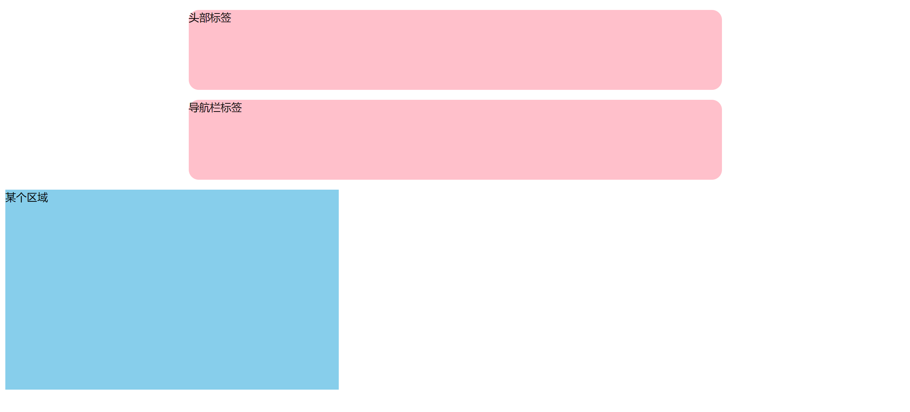
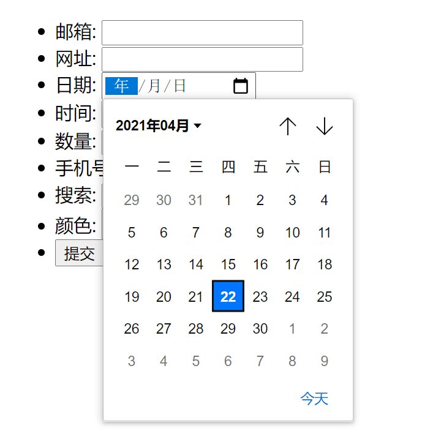
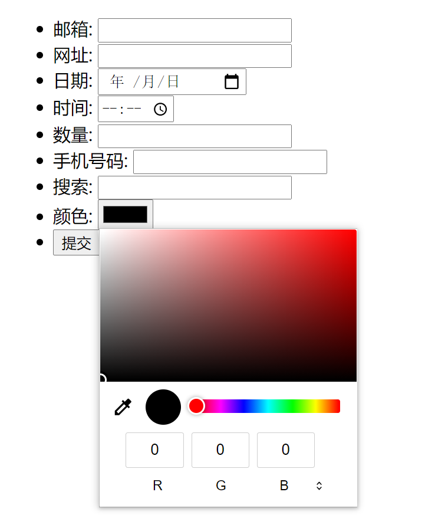
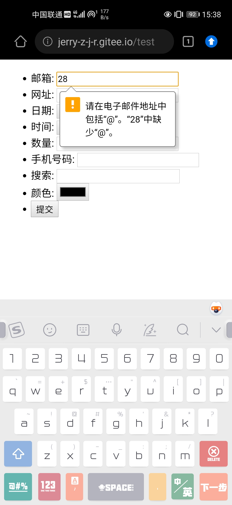
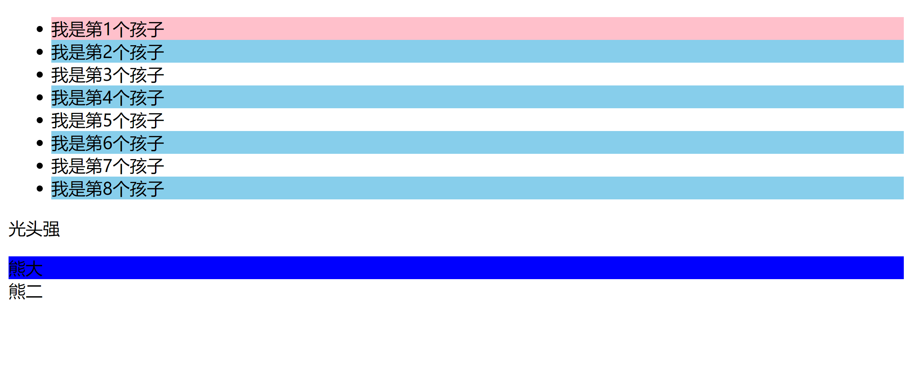
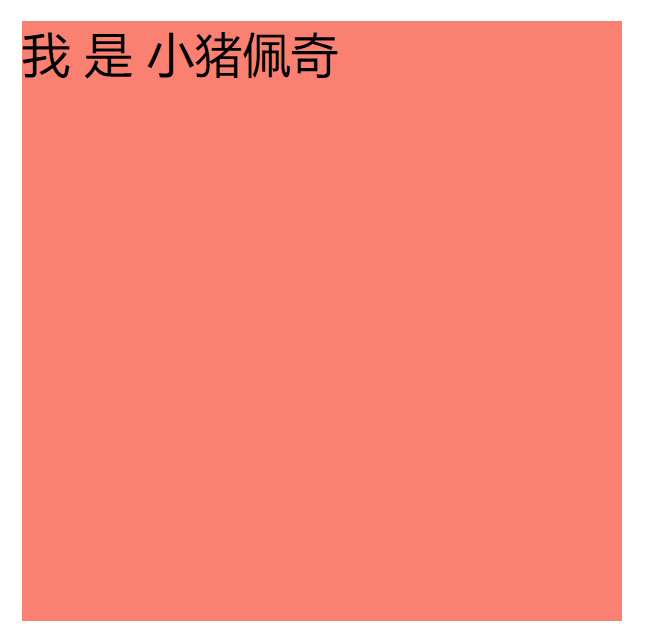
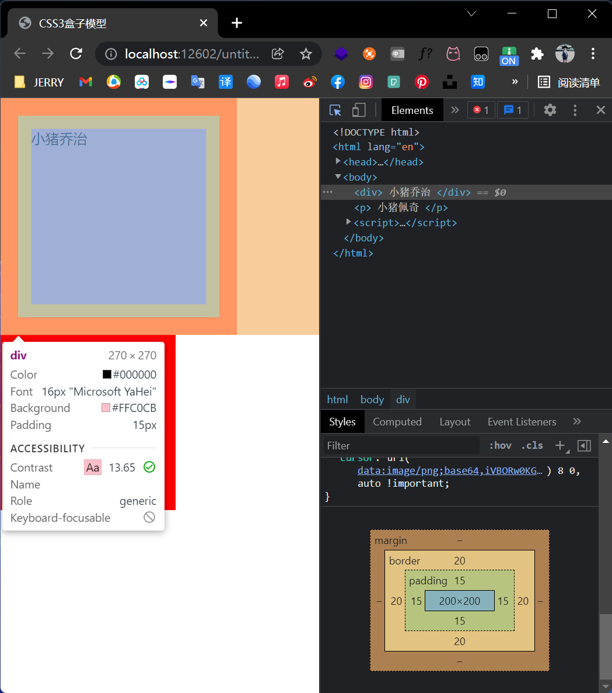
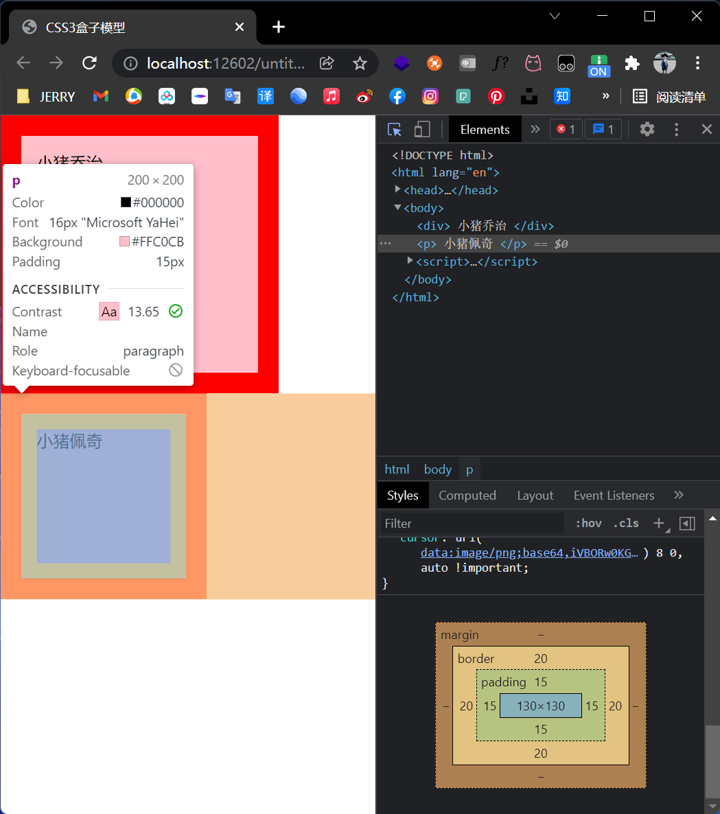
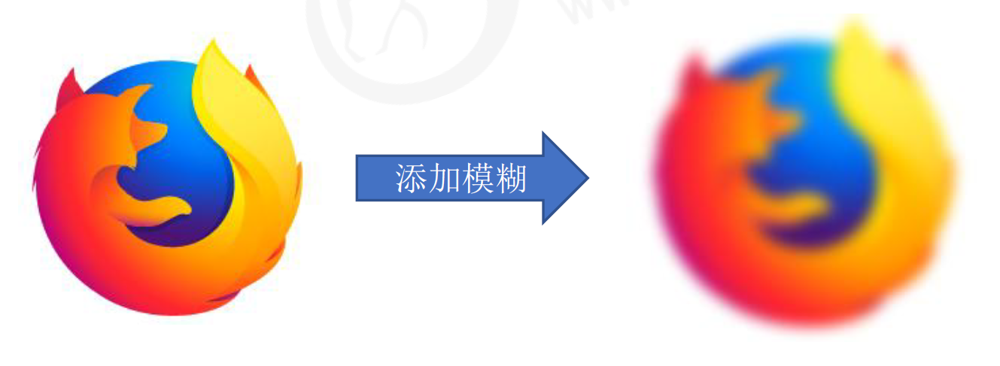
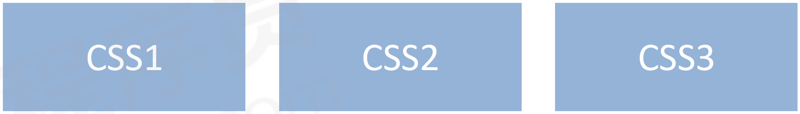

# 【HTML5&CSS3提高】

> 本学习笔记是个人对 Pink 老师课程的总结归纳，转载请注明出处！ 

# 一、HTML5的新特性

HTML5 的新增特性主要是针对于以前的不足，增加了一些新的标签、新的表单和新的表单属性等。

这些新特性都有兼容性问题，基本是 IE9+ 以上版本的浏览器才支持，如果不考虑兼容性问题（例如：移动端），便可以大量使用这些新特性。

> 声明：新特性增加了很多，但是我们只需专注于开发常用的新特性即可

## 1.1 HTML5新增的语义化标签

以前布局，我们基本用 div 来做。div 对于搜索引擎来说，是没有语义的。

```html
<div class=“header”> </div>
<div class=“nav”> </div>
<div class=“content”> </div>
<div class=“footer”> </div>
```


- `<header>`：头部标签
- `<nav>`：导航标签
- `<article>`：内容标签
- `<section>`：定义文档的某个区域
- `<aside>`：侧边栏标签
- `<footer>`：尾部标签

注意：

- 这种语义化标准主要是针对搜索引擎的
- 这些新标签页面中可以使用多次
- 在 IE9 中，需要把这些元素转换为块级元素
- 其实，我们移动端更喜欢使用这些标签
- HTML5 还增加了很多其他标签，我们后面再慢慢学

```html
<!DOCTYPE html>
<html lang="en">
<head>
    <meta charset="UTF-8">
    <meta name="viewport" content="width=device-width, initial-scale=1.0">
    <meta http-equiv="X-UA-Compatible" content="ie=edge">
    <title>HTML5新增语义化标签</title>
    <style>
        header, nav {
            height: 120px;
            background-color: pink;
            border-radius: 15px;
            width: 800px;
            margin: 15px auto;
        }

        section {
            width: 500px;
            height: 300px;
            background-color: skyblue;
        }
    </style>
</head>
<body>
<header>头部标签</header>
<nav>导航栏标签</nav>
<section>某个区域</section>
</body>
</html>
```



## 1.2 HTML5新增的多媒体标签

新增的多媒体标签主要包含两个：

1. 音频：`<audio>`
2. 视频：`<video>`

使用它们可以很方便的在页面中嵌入音频和视频，而不再去使用 flash 和其他浏览器插件。

### 1.2.1 视频

HTML5 在不使用插件的情况下，也可以原生的支持视频格式文件的播放。当然，支持的格式是有限的。

当前 `<video>` 元素支持三种视频格式：尽量使用 mp4 格式。


语法：

```html
<video src="文件地址" controls="controls"></video>
```

```html
<video controls="controls" width="300"> 
    <source src="move.ogg" type="video/ogg"> 
    <source src="move.mp4" type="video/mp4"> 
    您的浏览器暂不支持 <video> 标签播放视频
</ video >
```

常见属性：


```html
<!DOCTYPE html>
<html lang="en">
<head>
    <meta charset="UTF-8">
    <meta name="viewport" content="width=device-width, initial-scale=1.0">
    <meta http-equiv="X-UA-Compatible" content="ie=edge">
    <title>HTML5新增视频标签</title>
    <style>
        video {
            width: 100%;
        }
    </style>
</head>
<body>
<video src="media/mi.mp4" autoplay="autoplay" muted="muted" loop="loop" poster="media/mi9.jpg"></video>
</body>
</html>
```


以上视频会自动播放。

### 1.2.2 音频

HTML5 在不使用插件的情况下，也可以原生的支持音频格式文件的播放。当然，支持的格式是有限的。

当前 `<audio>` 元素支持三种音频格式：尽量使用 mp3 格式。


语法：

```html
<audio src="文件地址" controls="controls"></audio>
```

```html
<audio controls="controls">
	<source src="happy.mp3" type="audio/mpeg">
	<source src="happy.ogg" type="audio/ogg">
	您的浏览器暂不支持 <audio> 标签。
</audio>
```

常见属性：


```html
<!DOCTYPE html>
<html lang="en">
<head>
    <meta charset="UTF-8">
    <meta name="viewport" content="width=device-width, initial-scale=1.0">
    <meta http-equiv="X-UA-Compatible" content="ie=edge">
    <title>HTML5新增音频标签</title>
</head>
<body>
<audio src="media/music.mp3" autoplay="autoplay" controls="controls"></audio>
</body>
</html>
```


### 1.2.3 多媒体标签总结

- 音频标签和视频标签使用方式基本一致
- 浏览器支持情况不同
- 谷歌浏览器把音频和视频自动播放禁止了
- 我们可以给视频标签添加 muted 属性来静音播放视频，音频不可以（可以通过 JavaScript 解决）
- 视频标签是重点，我们经常设置自动播放，不使用 controls 控件，循环和设置大小属性

## 1.3 HTML5新增的input类型


```html
<!DOCTYPE html>
<html lang="en">

<head>
    <meta charset="UTF-8">
    <meta name="viewport" content="width=device-width, initial-scale=1.0">
    <meta http-equiv="X-UA-Compatible" content="ie=edge">
    <title>Document</title>
</head>

<body>
<!-- 我们验证的时候必须添加form表单域 -->
<form action="">
    <ul>
        <li>邮箱: <input type="email"/></li>
        <li>网址: <input type="url"/></li>
        <li>日期: <input type="date"/></li>
        <li>时间: <input type="time"/></li>
        <li>数量: <input type="number"/></li>
        <li>手机号码: <input type="tel"/></li>
        <li>搜索: <input type="search"/></li>
        <li>颜色: <input type="color"/></li>
        <!-- 当我们点击提交按钮就可以验证表单了 -->
        <li><input type="submit" value="提交"></li>
    </ul>
</form>
</body>

</html>
```







注意：HTML5 所提供的 input 类型可以依据具体的系统环境适配界面样式。


当为数值框时，输入法自动打开数字键盘！



## 1.4 HTML5新增的表单属性


```html
<!DOCTYPE html>
<html lang="en">
<head>
    <meta charset="UTF-8">
    <meta name="viewport" content="width=device-width, initial-scale=1.0">
    <meta http-equiv="X-UA-Compatible" content="ie=edge">
    <title>HTML5新增表单属性</title>
    <style>
        input::placeholder {
            color: hotpink;
        }
    </style>
</head>
<body>
<form action="">
    <input type="search" name="sear" id="one" required="required" placeholder="pink老师" autofocus="autofocus"
           autocomplete="off">
    <input type="file" name="" id="two" multiple="multiple">
    <input type="submit" value="提交">
</form>

</body>
</html>
```


```html
<!DOCTYPE html>
<html lang="en">

<head>
    <meta charset="UTF-8">
    <meta name="viewport" content="width=device-width, initial-scale=1.0">
    <meta http-equiv="X-UA-Compatible" content="ie=edge">
    <title>HTML5新增表单属性</title>
    <style>
        input::placeholder {
            color: hotpink;
        }
    </style>
</head>

<body>
    <form action="">
        <input type="search" name="sear" id="one" required="required" placeholder="pink老师" autofocus="autofocus"
            autocomplete="on">
        <input type="submit" value="提交">
    </form>

</body>

</html>
```


```html
<!DOCTYPE html>
<html lang="en">

<head>
    <meta charset="UTF-8">
    <meta name="viewport" content="width=device-width, initial-scale=1.0">
    <meta http-equiv="X-UA-Compatible" content="ie=edge">
    <title>HTML5新增表单属性</title>
    <style>
        input::placeholder {
            color: hotpink;
        }
    </style>
</head>

<body>
    <form action="">
        <input type="search" name="sear" id="one" required="required" placeholder="pink老师" autofocus="autofocus"
            autofocus="autofocus">
        <input type="submit" value="提交">
    </form>

</body>

</html>
```

自动聚焦：


# 二、CSS3的新特性

## 2.1 CSS3的现状

- 新增的 CSS3 特性有兼容性问题，IE9+ 才支持
- 移动端支持优于 PC 端
- 不断改进中
- 应用相对广泛
- 现阶段主要学习：新增选择器、盒子模型 以及 其他特性

## 2.2 CSS3新增选择器

CSS3 给我们新增了选择器，可以更加便捷，更加自由的选择目标元素。

1. 属性选择器
2. 结构伪类选择器
3. 伪元素选择器

### 2.2.1 属性选择器

属性选择器可以根据元素特定属性来选择元素。这样就可以不用借助于类或者 id 选择器。

| 选择符          | 简介                                        |
| --------------- | ------------------------------------------- |
| `E[att]`        | 选择具有 att 属性的 E 元素                  |
| `E[att="val"]`  | 选择具有 att 属性且属性值等于 val 的 E 元素 |
| `E[att^="val"]` | 匹配具有 att 属性且值以 val 开头的 E 元素   |
| `E[arr$="val"]` | 匹配具有 att 属性且值以 val 结尾的 E 元素   |
| `E[att*="val"]` | 匹配具有 att 属性且值中含有 val 的 E 元素   |

注意：类选择器、属性选择器、伪类选择器，权重为 10。

```html
<!DOCTYPE html>
<html lang="en">
<head>
    <meta charset="UTF-8">
    <meta name="viewport" content="width=device-width, initial-scale=1.0">
    <meta http-equiv="X-UA-Compatible" content="ie=edge">
    <title>CSS3新增属性选择器</title>
    <style>
        /* 必须是 input 同时具有 value 这个属性选择这个元素[] */
        /*input[value] {*/
        /*    color: hotpink;*/
        /*}*/

        /* 只选择 type=text 文本框的 input 选取出来 */
        input[type=text] {
            color: hotpink;
        }

        /* 选择首先是 div 然后具有 class 属性，并且属性值必须是 icon 开头的这些元素 */
        div[class^=icon] {
            color: red;
        }

        /* 选择首先是 section 然后具有 class 属性，并且属性值必须是 data 结尾的这些元素 */
        section[class$=data] {
            color: blue;
        }

        /* 类选择器 属性选择器 伪类选择器 权重都是 10 */
        div.icon1 {
            color: skyblue;
        }
    </style>
</head>
<body>
<!-- 1. 利用属性选择器就可以不用借助于类或者 id 选择器 -->
<!--<input type="text" value="请输入用户名">-->
<!--<input type="text">-->
<!-- 2. 属性选择器还可以选择属性=值的某些元素 重点务必掌握 -->
<input type="text" name="" id="one">
<input type="password" name="" id="two">
<!-- 3. 属性选择器可以选择属性值开头的某些元素 -->
<div class="icon1">小图标1</div>
<div class="icon2">小图标2</div>
<div class="icon3">小图标3</div>
<div class="icon4">小图标4</div>
<div>我是打酱油的</div>
<!-- 4. 属性选择器可以选择属性值结尾的某些元素 -->
<section class="icon1-data">我是安其拉</section>
<section class="icon2-data">我是哥斯拉</section>
<section class="icon3-ico">哪我是谁</section>

</body>
</html>
```


### 2.2.2 结构伪类选择器

`nth-child(n)` 选择某个父元素的一个或多个特定的子元素（重点）。

- n 可以是数字，关键字和公式
- n 如果是数字，就是选择第 n 个子元素，里面数字从 1 开始……
- n 可以是关键字：even 偶数，odd 奇数
- n 可以是公式：常见的公式如下（如果 n 是公式，则从 n = 0 开始计算，但是第 0 个元素和超出了元素的个数会被忽略）

| 公式   | 取值                               |
| ------ | ---------------------------------- |
| `2n`   | 偶数（2、4、6、……）                |
| `2n+1` | 奇数（1、3、5、……）                |
| `5n`   | 5   10   15...                     |
| `n+5`  | 从第 5 个开始（包含第 5 个）到最后 |
| `-n+5` | 前 5 个（包含第 5 个）             |

结构伪类选择器主要根据文档结构来选择元素，常用于根据父级来选择其子元素。

| 选择器             | 简介                          |
| ------------------ | ----------------------------- |
| `E:first-child`    | 匹配父元素中的第一个子元素 E  |
| `E:last-child`     | 匹配父元素中最后一个 E 元素   |
| `E:nth-child(n)`   | 匹配父元素中的第 n 个子元素 E |
| `E:first-of-type`  | 指定类型 E 的第一个           |
| `E:last-of-type`   | 指定类型 E 的最后一个         |
| `E:nth-of-type(n)` | 指定类型 E 的第 n 个          |

区别：

1. nth-child 对父元素里面所有孩子排序选择（序号是固定的） 先找到第 n 个孩子，然后看看是否和 E 匹配
2. nth-of-type 对父元素里面指定子元素进行排序选择。 先去匹配 E，然后再根据 E 找第 n 个孩子

小结：

- 结构伪类选择器一般用于选择父级里面的第几个孩子
- nth-child 对父元素里面所有孩子排序选择（序号是固定的） 先找到第 n 个孩子，然后看看是否和 E 匹配
- nth-of-type 对父元素里面指定子元素进行排序选择。 先去匹配 E，然后再根据 E 找第 n 个孩子
- 如果是无序列表，我们肯定用 nth-child 更多
- 类选择器、属性选择器、伪类选择器，权重为 10

```html
<!DOCTYPE html>
<html lang="en">
<head>
    <meta charset="UTF-8">
    <meta name="viewport" content="width=device-width, initial-scale=1.0">
    <meta http-equiv="X-UA-Compatible" content="ie=edge">
    <title>CSS3新增结构伪类选择器</title>
    <style>
        /* 1. 选择 ul 里面的第一个孩子 小 li */
        ul li:first-child {
            background-color: pink;
        }

        /* 2. 选择 ul 里面的最后一个孩子 小 li */
        ul li:last-child {
            background-color: pink;
        }

        /* 3. 选择 ul 里面的第 2 个孩子 小 li */
        ul li:nth-child(2) {
            background-color: skyblue;
        }

        /* 3. 选择 ul 里面的第 6 个孩子 小 li */
        ul li:nth-child(6) {
            background-color: skyblue;
        }
    </style>
</head>
<body>
<ul>
    <li>我是第1个孩子</li>
    <li>我是第2个孩子</li>
    <li>我是第3个孩子</li>
    <li>我是第4个孩子</li>
    <li>我是第5个孩子</li>
    <li>我是第6个孩子</li>
    <li>我是第7个孩子</li>
    <li>我是第8个孩子</li>
</ul>
</body>
</html>
```


```html
<!DOCTYPE html>
<html lang="en">

<head>
    <meta charset="UTF-8">
    <meta name="viewport" content="width=device-width, initial-scale=1.0">
    <meta http-equiv="X-UA-Compatible" content="ie=edge">
    <title>CSS3新增结构伪类选择器-nth-child</title>
    <style>
        /* 1.把所有的偶数 even 的孩子选出来 */
        ul li:nth-child(even) {
            background-color: #ccc;
        }

        /* 2.把所有的奇数 odd 的孩子选出来 */
        ul li:nth-child(odd) {
            background-color: gray;
        }

        /* 3.nth-child(n) 从 0 开始每次加 1 往后面计算，这里面必须是 n，不能是其他的字母，此处选择了所有的孩子 */
        /* ol li:nth-child(n) {*/
        /*    background-color: pink;*/
        /*}*/
        /* 4.nth-child(2n) 母选择了所有的偶数孩子 等价于 even */
        /*ol li:nth-child(2n) {*/
        /*    background-color: pink;*/
        /*}*/
        /* 5.nth-child(2n+1) 母选择了所有的奇数孩子 等价于 odd */
        /*ol li:nth-child(2n+1) {*/
        /*    background-color: skyblue;*/
        /*} */
        /* 6.从第 3 个开始（包含第 3 个）到最后 */
        /*ol li:nth-child(n+3) {*/
        /*    background-color: pink;*/
        /*} */
        /*7.前 3 个（包含第 3 个）*/
        ol li:nth-child(-n+3) {
            background-color: pink;
        }
    </style>
</head>

<body>
<ul>
    <li>我是第1个孩子</li>
    <li>我是第2个孩子</li>
    <li>我是第3个孩子</li>
    <li>我是第4个孩子</li>
    <li>我是第5个孩子</li>
    <li>我是第6个孩子</li>
    <li>我是第7个孩子</li>
    <li>我是第8个孩子</li>
</ul>
<ol>
    <li>我是第1个孩子</li>
    <li>我是第2个孩子</li>
    <li>我是第3个孩子</li>
    <li>我是第4个孩子</li>
    <li>我是第5个孩子</li>
    <li>我是第6个孩子</li>
    <li>我是第7个孩子</li>
    <li>我是第8个孩子</li>
</ol>
</body>

</html>
```


```html
<!DOCTYPE html>
<html lang="en">

<head>
    <meta charset="UTF-8">
    <meta name="viewport" content="width=device-width, initial-scale=1.0">
    <meta http-equiv="X-UA-Compatible" content="ie=edge">
    <title>CSS3新增选择器nth-type-of</title>
    <style>
        ul li:first-of-type {
            background-color: pink;
        }

        ul li:last-of-type {
            background-color: pink;
        }

        ul li:nth-of-type(even) {
            background-color: skyblue;
        }

        /* nth-child 会把所有的盒子都排列序号 */
        /* 执行的时候首先看 :nth-child(1) 之后回去看 前面 div */
        /* 所以此处先排序：*/
        /* 1号：<p>光头强</p> */
        /* 2号：<div>熊大</div> */
        /* 3号：<div>熊二</div> */
        /* 再回过头看，此时会发现，1号并不是 div，所以不生效！*/

        section div:nth-child(1) {
            background-color: red;	/* 不生效 */
        }

        /* nth-of-type 会把指定元素的盒子排列序号 */
        /* 执行的时候首先看 div 指定的元素 之后回去看 :nth-of-type(1) 第几个孩子 */
        section div:nth-of-type(1) {
            background-color: blue;
        }
    </style>
</head>

<body>
<ul>
    <li>我是第1个孩子</li>
    <li>我是第2个孩子</li>
    <li>我是第3个孩子</li>
    <li>我是第4个孩子</li>
    <li>我是第5个孩子</li>
    <li>我是第6个孩子</li>
    <li>我是第7个孩子</li>
    <li>我是第8个孩子</li>
</ul>
<!-- 区别 -->
<section>
    <p>光头强</p>
    <div>熊大</div>
    <div>熊二</div>
</section>
</body>

</html>
```



### 2.2.3 伪元素选择器（重点）

伪元素选择器可以帮助我们利用 CSS 创建新标签元素，而不需要 HTML 标签，从而简化 HTML 结构。

| 选择器     | 简介                     |
| ---------- | ------------------------ |
| `::before` | 在元素内容的前面插入内容 |
| `::after`  | 在元素内容的后面插入内容 |

注意：

- before 和 after 创建一个元素，属于行内元素
- 新创建的这个元素在文档树中是找不到的，所以我们称为伪元素
- 语法：`element::before{}`
- before 和 after 必须有 content 属性
- before 在父元素内容的前面创建元素，after 在父元素内容的后面创建元素
- 伪元素选择器和标签选择器一样，权重为 1

**（1）伪元素选择器使用场景1：伪元素字体图标**

```css
p::before {
	position: absolute;
	right: 20px;
	top: 10px;
	content: '\e91e';
	font-size: 20px;
}
```

**（2）伪元素选择器使用场景2：仿土豆效果**

```css
/* 当我们鼠标经过了 土豆这个盒子，就让里面 before 遮罩层显示出来 */
.tudou:hover::before {
	/* 而是显示元素 */
    display: block;
}
```

**（3）伪元素选择器使用场景3：伪元素清除浮动**

1. 额外标签法也称为隔墙法，是 W3C 推荐的做法
2. 父级添加 overflow 属性
3. 父级添加 after 伪元素
4. 父级添加双伪元素

额外标签法也称为隔墙法，是 W3C 推荐的做法。


注意：要求这个新的空标签必须是块级元素。

后面两种伪元素清除浮动算是第一种额外标签法的一个升级和优化。

```css
.clearfix:after {
	content: "";			/* 伪元素必须写的属性 */
	display: block;			/* 插入的元素必须是块级 */
	height: 0;				/* 不要看见这个元素 */
	clear: both;			/* 核心代码清除浮动 */
	visibility: hidden;		/* 不要看见这个元素 */
}
```

```css
.clearfix:before,
.clearfix:after {
	content: "";
	display: table;			/* 转换为块级元素并且一行显示 */
}

.clearfix:after {
	clear: both;
}
```

案例：

```html
<!DOCTYPE html>
<html lang="en">
<head>
    <meta charset="UTF-8">
    <meta name="viewport" content="width=device-width, initial-scale=1.0">
    <meta http-equiv="X-UA-Compatible" content="ie=edge">
    <title>伪元素选择器before和after</title>
    <style>
        div {
            width: 200px;
            height: 200px;
            background-color: salmon;
        }

        /* div::before 权重是 2 */
        div::before {
            /* 这个 content 是必须要写的 */
            /* display: inline-block; */
            content: '我';
            /* width: 30px;
            height: 40px;
            background-color: purple; */
        }

        div::after {
            content: '小猪佩奇';
        }
    </style>
</head>
<body>
<div>
    是
</div>
</body>
</html>
```



```html
<!DOCTYPE html>
<html lang="en">

<head>
    <meta charset="UTF-8">
    <meta name="viewport" content="width=device-width, initial-scale=1.0">
    <meta http-equiv="X-UA-Compatible" content="ie=edge">
    <title>伪元素选择器使用场景-字体图标</title>
    <style>
        @font-face {
            font-family: 'icomoon';
            src: url('fonts/icomoon.eot?1lv3na');
            src: url('fonts/icomoon.eot?1lv3na#iefix') format('embedded-opentype'),
            url('fonts/icomoon.ttf?1lv3na') format('truetype'),
            url('fonts/icomoon.woff?1lv3na') format('woff'),
            url('fonts/icomoon.svg?1lv3na#icomoon') format('svg');
            font-weight: normal;
            font-style: normal;
            font-display: block;
        }

        div {
            position: relative;
            width: 200px;
            height: 35px;
            border: 1px solid red;
        }

        div::after {
            position: absolute;
            top: 10px;
            right: 10px;
            font-family: 'icomoon';
            /* content: ''; */
            content: '\e91e';
            color: red;
            font-size: 18px;
        }
    </style>
</head>

<body>
<div></div>
</body>

</html>
```


```html
<!DOCTYPE html>
<html lang="en">

<head>
    <meta charset="UTF-8">
    <meta name="viewport" content="width=device-width, initial-scale=1.0">
    <meta http-equiv="X-UA-Compatible" content="ie=edge">
    <title>伪元素选择器使用场景2-仿土豆网显示隐藏遮罩案例</title>
    <style>
        .tudou {
            position: relative;
            width: 444px;
            height: 320px;
            background-color: pink;
            margin: 30px auto;
        }

        .tudou img {
            width: 100%;
            height: 100%;
        }

        .tudou::before {
            content: '';
            /* 隐藏遮罩层 */
            display: none;
            position: absolute;
            top: 0;
            left: 0;
            width: 100%;
            height: 100%;
            background: rgba(0, 0, 0, .4) url(images/arr.png) no-repeat center;
        }

        /* 当我们鼠标经过了土豆这个盒子，就让里面 before 遮罩层显示出来 */
        .tudou:hover::before {
            /* 而是显示元素 */
            display: block;
        }
    </style>
</head>

<body>
<div class="tudou">
    
</div>
</body>

</html>
```


## 2.3 CSS3盒子模型

CSS3 中可以通过 box-sizing 来指定盒模型，有 2 个值：即可指定为 content-box、border-box，这样我们计算盒子大小的方式就发生了改变。

可以分成两种情况：

1. box-sizing: content-box 盒子大小为 width + padding + border （以前默认的）
2. box-sizing: border-box 盒子大小为 width

如果盒子模型我们改为了 box-sizing: border-box， 那 padding 和 border 就不会撑大盒子了（前提 padding 和 border 不会超过 width 宽度）

```html
<!DOCTYPE html>
<html lang="en">
<head>
    <meta charset="UTF-8">
    <meta name="viewport" content="width=device-width, initial-scale=1.0">
    <meta http-equiv="X-UA-Compatible" content="ie=edge">
    <title>CSS3盒子模型</title>
    <style>
        * {
            margin: 0;
            padding: 0;
            box-sizing: border-box;
        }

        div {
            width: 200px;
            height: 200px;
            background-color: pink;
            border: 20px solid red;
            padding: 15px;
            box-sizing: content-box;
        }

        p {
            width: 200px;
            height: 200px;
            background-color: pink;
            border: 20px solid red;
            padding: 15px;
            /* css3 盒子模型 盒子最终的大小就是 width 200 的大小 */
            box-sizing: border-box;
        }
    </style>
</head>
<body>
<div>
    小猪乔治
</div>
<p>
    小猪佩奇
</p>
</body>
</html>
```






## 2.4 CSS3其他特性（了解）

1. 图片变模糊
2. 计算盒子宽度 width:calc 函数

```html
<!DOCTYPE html>
<html lang="en">
<head>
    <meta charset="UTF-8">
    <meta name="viewport" content="width=device-width, initial-scale=1.0">
    <meta http-equiv="X-UA-Compatible" content="ie=edge">
    <title>图片模糊处理filter</title>
    <style>
        img {
            /* blur 是一个函数 小括号里面数值越大，图片越模糊 注意数值要加 px 单位 */
            filter: blur(15px);
        }

        img:hover {
            filter: blur(0);
        }
    </style>
</head>
<body>

</body>
</html>
```


```html
<!DOCTYPE html>
<html lang="en">
<head>
    <meta charset="UTF-8">
    <meta name="viewport" content="width=device-width, initial-scale=1.0">
    <meta http-equiv="X-UA-Compatible" content="ie=edge">
    <title>CSS3属性calc函数</title>
    <style>
        .father {
            width: 500px;
            height: 500px;
            background-color: black;
        }

        .son {
            /* width: 300px; */
            /* width: calc(500px - 100px); */
            width: calc(100% - 100px);
            height: 200px;
            background-color: salmon;
        }
    </style>
</head>
<body>
<!-- 需求：我们的子盒子宽度永远比父盒子小 100 像素 -->
<div class="father">
    <div class="son"></div>
</div>
</body>
</html>
```


### 2.4.1 CSS3滤镜 filter

filter CSS 属性将模糊或颜色偏移等图形效果应用于元素。

```css
filter: 函数(); 例如：filter: blur(5px); blur 模糊处理，数值越大越模糊
```



### 2.4.2 CSS3 calc 函数

calc() 此 CSS 函数让你在声明 CSS 属性值时执行一些计算。

```css
width: calc(100% - 80px);
```

括号里面可以使用 `+` `-` `*` `/` 来进行计算。

## 2.5 CSS3过渡（重点）

### 2.5.1 过渡

过渡（transition）是 CSS3 中具有颠覆性的特征之一，我们可以在不使用 Flash 动画或 JavaScript 的情况下，当元素从一种样式变换为另一种样式时为元素添加效果。

过渡动画：是从一个状态渐渐的过渡到另外一个状态。

可以让我们页面更好看，更动感十足，虽然低版本浏览器不支持（IE9 以下版本） 但是不会影响页面布局。

我们现在经常和 `:hover` 一起搭配使用。

语法：

```css
transition: 要过渡的属性 花费时间 运动曲线 何时开始;
```

1. 属性：想要变化的 css 属性，宽度高度、背景颜色、内外边距都可以 。如果想要所有的属性都变化过渡，写一个 all 就可以
2. 花费时间：单位是秒（必须写单位）比如 0.5s
3. 运动曲线：默认是 ease（可以省略）
4. 何时开始：单位是秒（必须写单位）可以设置延迟触发时间默认是 0s（可以省略）


记住过渡的使用口诀：**谁做过渡给谁加！**

```html
<!DOCTYPE html>
<html lang="en">
<head>
    <meta charset="UTF-8">
    <meta name="viewport" content="width=device-width, initial-scale=1.0">
    <meta http-equiv="X-UA-Compatible" content="ie=edge">
    <title>CSS3过渡效果</title>
    <style>
        div {
            width: 200px;
            height: 100px;
            background-color: black;
            /* transition: 变化的属性 花费时间 运动曲线 何时开始; */
            /* transition: width .5s ease 0s, height .5s ease 1s; */
            /* 如果想要写多个属性，利用逗号进行分割 */
            /* transition: width .5s, height .5s; */
            /* 如果想要多个属性都变化，属性写 all 就可以了 */
            /* transition: height .5s ease 1s; */
            /* 谁做过渡，给谁加 */
            transition: all 0.5s;
        }

        div:hover {
            width: 400px;
            height: 200px;
            background-color: gray;
        }
    </style>
</head>
<body>
<div></div>
</body>
</html>
```


### 2.5.2 进度条案例

```html
<!DOCTYPE html>
<html lang="en">
<head>
    <meta charset="UTF-8">
    <meta name="viewport" content="width=device-width, initial-scale=1.0">
    <meta http-equiv="X-UA-Compatible" content="ie=edge">
    <title>CSS3过渡练习-进度条</title>
    <style>
        .bar {
            width: 150px;
            height: 15px;
            border: 1px solid red;
            border-radius: 7px;
            padding: 1px;
        }

        .bar_in {
            width: 50%;
            height: 100%;
            border-radius: 7px;
            background-color: red;
            /* 谁做过渡给谁加 */
            transition: all .7s;
        }

        .bar:hover .bar_in {
            width: 100%;
        }
    </style>
</head>
<body>
<div class="bar">
    <div class="bar_in"></div>
</div>
</body>
</html>
```


# 三、狭义的 HTML5 CSS3

1. HTML5 结构本身

   

2. CSS3 相关样式

   

# 四、广义的 HTML5

1. 广义的 HTML5 是 HTML5 本身 + CSS3 + JavaScript
2. 这个集合有时称为 HTML5 和朋友，通常缩写为 HTML5
3. 虽然 HTML5 的一些特性仍然不被某些浏览器支持，但是它是一种发展趋势

