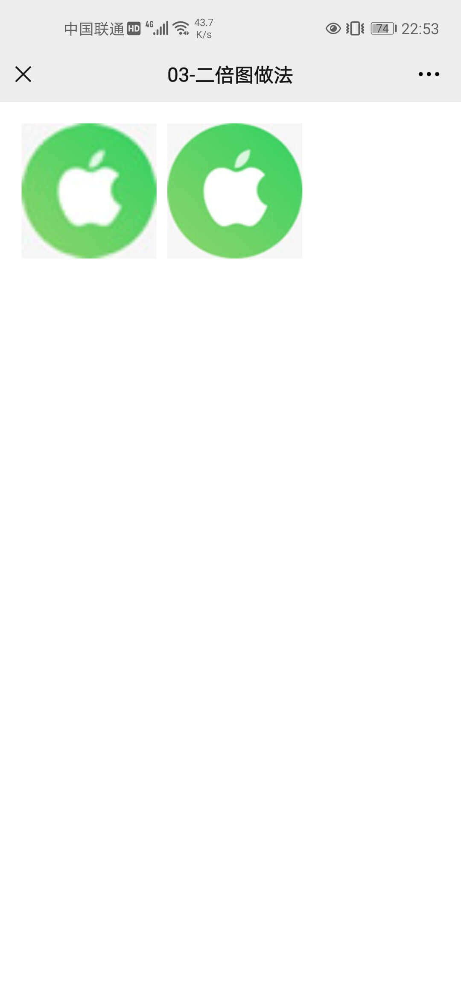
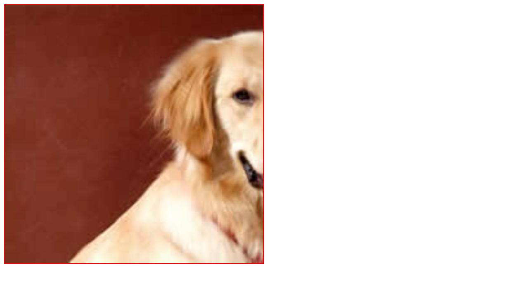
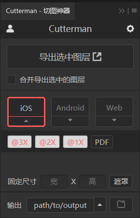
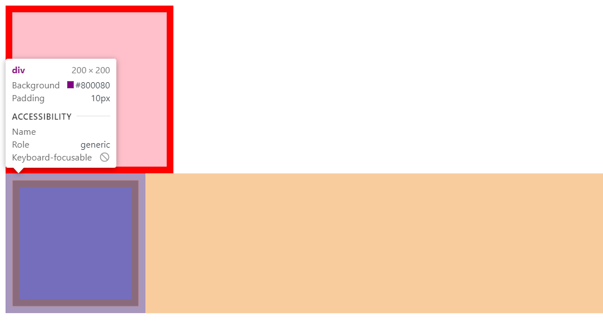
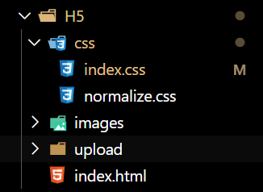
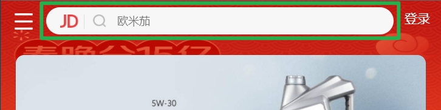
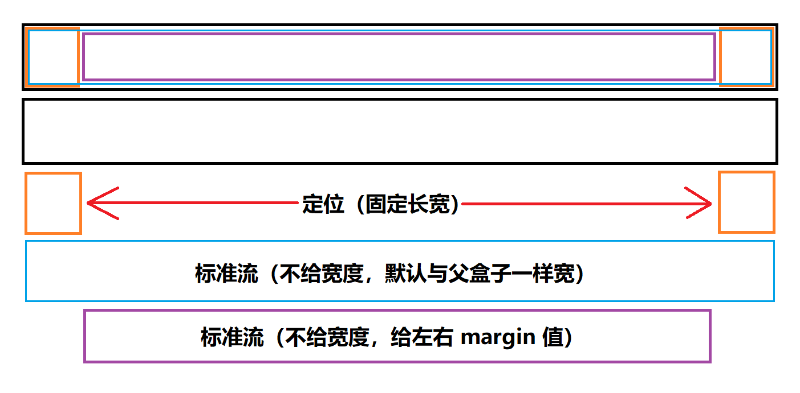

# 1920 x 1080【移动Web开发之流式布局】

> 本文档是个人对 Pink 老师课程的总结归纳及补充，转载请注明出处！ 

# 一、移动端基础

## 1.1 浏览器现状

由于移动端浏览器的发展比较晚，所以主流移动端浏览器的内核都是基于 `Webkit` 内核打造的。

我们在进行移动端的页面开发时，兼容性主要考虑 `Webkit` 内核。

## 1.2 手机屏幕现状

目前无论是 安卓 还是 IOS，移动端设备的屏幕尺寸非常多，碎片化非常严重。

但是，前端页面开发者无需关注这些分辨率，因为我们常用的尺寸单位是 `px`。

## 1.3 常见移动端屏幕尺寸

目前移动端的屏幕尺寸非常多，并且随着发展还会越来越多。

但是，对于移动端的 Web 开发来说，我们不用考虑太多。

对于专门的 安卓 和 IOS 开发，才需要特别关注 `dp`、`dpi`、`pt`、`ppi` 等单位。

## 1.4 移动端调试方法

- Chrome DevTools（谷歌浏览器）的模拟手机调试
- 搭建本地 Web 服务器，手机和服务器一个局域网内，通过手机访问服务器
- 使用外网服务器，直接 IP 或 域名 访问

## 1.5 总结

- 移动端浏览器我们主要对 Webkit 内核进行兼容
- 我们现在开发的移动端主要针对手机端开发
- 现在移动端碎片化比较严重，分辨率和屏幕尺寸大小不一
- 学会用谷歌浏览器模拟手机界面以及调试

# 二、视口

视口（viewport）：浏览器显示页面内容的**屏幕区域**。

视口的分类：布局视口、视觉视口、理想视口。

## 2.1 布局视口

- 为了解决早期 PC 端网页在手机上显示的问题，移动端浏览器都默认设置了一个布局视口。
- IOS、Android 基本都将布局视口分辨率设置为 980px，所以 PC 上的网页大多也能在手机上呈现，但是网页元素看上去会非常小，一般可以通过手动缩放网页。


## 2.2 视觉视口

- 字面意思，它是用户正在看到的网站的区域。注意：是网站的区域。
- 我们可以通过缩放去操作视觉视口，但不会影响布局视口，布局视口仍保持原来的宽度。


## 2.3 理想视口

> 发明者：史蒂夫·乔布斯

- 为了使网站在移动端有最理想的浏览和阅读宽度而设定
- 理想视口，对设备来讲，是最理想的视口尺寸
- 需要手动添写 `meta` 视口标签通知浏览器操作
- `meta` 视口标签的主要目的：**布局视口的宽度应该与理想视口的宽度一致，简单理解就是设备有多宽，我们布局的视口就有多宽。**

> 移动端 web 开发就是开发理想视口！

## 2.4 总结

- 视口就是浏览器显示页面内容的屏幕区域
- 视口分为布局视口、视觉视口和理想视口
- **我们移动端布局想要的是理想视口就是手机屏幕有多宽，我们的布局视口就有多宽**
- **想要理想视口，我们需要给我们的移动端页面添加 `meta` 视口标签**

## 2.5 meta视口标签

```html
 <meta name="viewport" content="width=device-width, initial-scale=1.0, maximum-scale=1.0, minimum-scale=1.0, user-scalable=no">
```

name="视口"

content="内容中包含若干个属性，用逗号隔开"

| 属性            | 解释说明                                                     |
| --------------- | ------------------------------------------------------------ |
| `width`         | 宽度设置的是 viewport 宽度，我们设置为 `device-width` “设备宽度” 特殊值 |
| `initial-scale` | 初始缩放比，大于 0 的数字，一般来说是设置为 1:1 即：`1.0`    |
| `maximum-scale` | 最大缩放比，大于 0 的数字                                    |
| `minimum-scale` | 最小缩放比，大于 0 的数字                                    |
| `user-scalable` | 用户是否可以缩放，yes 或 no（1或0），一般来说是 no           |

## 2.6 标准的viewport设置

- 视口宽度和设备保存一致 `device-width`
- 视口默认缩放比例 `1.0`
- 不允许用户自行缩放 `no`
- 最大允许的缩放比例 `1.0`
- 最小允许的缩放比例 `1.0`

# 三、二倍图

## 3.1 物理像素&物理像素比

- 物理像素点指的是屏幕显示的最小颗粒，是物理真实存在的
- 在 PC 端页面，1px 等于 1 个物理像素，但是移动端就不尽相同
- 移动端 1px 能实际显示的物理像素点的个数就称为物理像素比或屏幕像素比

`物理像素比 = 物理像素（分辨率） / 独立像素（CSS像素）`

例如：iPhone X 的物理像素比为 3

| 屏幕尺寸 | 独立像素（CSS像素） | 物理像素（分辨率） | ppi/dpi（像素密度） | dpr（倍图） |
| -------- | ------------------- | ------------------ | ------------------- | ----------- |
| 5.8英寸  | 812×375             | 2436×1125          | 458                 | 3           |

物理像素比提出的原因：

- 在早期，PC及移动端都是：1CSS像素 = 1物理像素
- 随着 Retina（视网膜屏幕）显示技术的普及，可以将更多的物理像素点压缩至一块屏幕里，从而达到更高的分辨率，并提高屏幕显示的细腻程度。


常见 iPhone 设备屏幕参数：

| 设备                         | 物理分辨率  | 开发分辨率 | 物理像素比（dpr） |
| ---------------------------- | ----------- | ---------- | ----------------- |
| iPhone13 Pro Max、12 Pro Max | 1284 * 2778 | 428 * 926  | 3                 |
| iPhone 13\13 Pro、12\12 Pro  | 1170 * 2532 | 390 * 844  | 3                 |
| iPhone 13 mini、12 mini      | 1080 * 2340 | 375 * 812  | 2.88（3）         |
| iPhone 11 Pro Max、XS Max    | 1242 * 2688 | 414 * 896  | 3                 |
| iPhone X、XS、11 Pro         | 1125 * 2436 | 375 * 812  | 3                 |
| iPhone XR、11                | 828 * 1792  | 414 * 896  | 2                 |
| iPhone 8 Plus                | 1080 * 1920 | 414 * 736  | 2.6（3）          |
| iPhone 8、SE                 | 750 * 1334  | 375 * 667  | 2                 |

常见 iPad 设备屏幕参数：

| 设备          | 物理分辨率  | 开发分辨率  | 物理像素比（dpr） |
| ------------- | ----------- | ----------- | ----------------- |
| iPad Pro 12.9 | 2048 * 2732 | 1024 * 1366 | 2                 |
| iPad Pro 11   | 1668 * 2388 | 834 * 1194  | 2                 |
| iPad mini 8.3 | 1488 * 2266 | 744 * 1133  | 2                 |

> 随着移动智能设备屏幕素质的不断提高，目前手机一般都统一使用 3 倍图，平板电脑使用 2 倍图。

> **电脑-显示器多倍图说明**
>
> 目前由于电脑显示器的素质也越来越高（尤其是笔记本电脑），2K屏、3K屏、4K屏、5K屏、6K屏 已经在不断普及，所以其实电脑端的也已经存在多倍图的应用了。
>
> 比如 Macbook Pro 16 M1 Pro/Max：物理分辨率（3456 * 2234）开发分辨率（1728 * 1117）2倍图
>
> 当然电脑端用户都能够方便的设置屏幕显示的缩放比，当缩放比为100%时就为1倍图，但目前的电脑端显示器大多已经默认为 125%、150%、175%、200% 缩放比。
>
> 故，在未来多倍图的运用将会越来越必要！
>
> > 认识了缩放，就能合理的解释：为什么在电脑上设置了一个 100 * 100 的 div 盒子，而在浏览器上用测量工具测量像素长度时，却为 150 * 150，因为此时电脑显示器为 150% 的缩放比，只要我们将其改为 100%，就能得到我们想要的效果了。

## 3.2 多倍图

- 对于一张 `50px * 50px` 的图片，在手机 Retina 屏中打开，按照刚才的物理像素比会放大倍数，这样会造成图片模糊（比如：3倍图手机中，50 * 50 实际上是 150 * 150 个像素在显示）
- 在标准的 viewport 设置中，使用多倍图来提高图片质量，解决在高清设备中的模糊问题
- 通常使用二倍体，是因为 iPhone 6\7\8 的影响，但是现在 3倍图 4倍图 也逐渐普及了，这个要看实际开发需求
- 背景图片也同样要注意缩放问题
- 字体不用考虑缩放问题，因为字体是矢量的，不会失真

```css
  /* 在 iphone8 下面 */
  img {
      /* 原始图片100*100px */
      width: 50px;
      height: 50px;
  }

  .box {
      /* 原始背景图片100*100px */
      background-size: 50px 50px;
  }
```

案例：

```html
<!doctype html>
<html lang="en">

<head>
    <meta charset="UTF-8">
    <meta name="viewport" content="width=device-width, initial-scale=1.0">
    <meta http-equiv="X-UA-Compatible" content="ie=edge">
    <title>03-二倍图做法</title>
    <style>
        /* 我们需要一个50*50像素（css像素）的图片，直接放到我们的iphone8里面会放大2倍100*100就会模糊 */
        /* 我们采取的是放一个100*100图片，然后手动的把这个图片缩小为50*50（css像素）*/
        /* 我们准备的图片比我们实际需要的大小大2倍，这就方式就是2倍图 */
        img:nth-child(2) {
            width: 50px;
            height: 50px;
        }
    </style>
</head>

<body>
    <!-- 模糊的 -->
    
    <!-- 我们采取2倍图 -->
    
</body>

</html>
```

手机模拟效果：



【附：二倍精灵图做法】

- 在 PS 中将精灵图等比例缩放为原来的一半
- 之后根据大小测量坐标
- 注意代码里面 background-size 也要写：精灵图原来宽度的一半

## 3.3 背景缩放

`background-size` 属性规定**背景图像**的尺寸

```css
background-size: 背景图片宽度 背景图片高度;
```

- 单位：长度 | 百分比 | cover | contain
- cover 把背景图像扩展至足够大，以使背景图像完全覆盖背景区域
- contain 把图像扩展至最大尺寸，以使其宽度和高度完全适应内容区域

注意：

1. 以长度为单位时，只写其中一个参数，另一个参数会自动适配
2. 以百分比为单位时，其参照对象为父盒子，只写其中一个参数，另一个参数会自动适配

【cover & contain 案例】


cover 案例：

```css
background-size: cover;
```



contain 案例：

```css
background-size: contain;
```


当图片是竖直放置时：


【背景缩放案例】

```html
<!doctype html>
<html lang="en">

<head>
    <meta charset="UTF-8">
    <meta name="viewport" content="width=device-width, initial-scale=1.0">
    <meta http-equiv="X-UA-Compatible" content="ie=edge">
    <title>05-背景图片2倍图</title>

    <style>
        /* 1. 我们有一个50*50的盒子需要一个背景图片，但是根据分析这个图片还是要准备2倍，100*100 */
        /* 2. 我们需要把这个图片缩放一半，也就是 50*50 background-size*/
        div {
            width: 50px;
            height: 50px;
            border: 1px solid red;
            background: url(images/apple100.jpg) no-repeat;
            background-size: 50px 50px;
        }
    </style>
</head>

<body>
    <div></div>
</body>

</html>
```

## 3.4 多倍图切工具 cutterman



一次性导出多种倍数的图片。

# 四、移动端开发选择

## 4.1 移动端主流方案

（1）单独制作移动端页面【主流】

- 京东 https://m.jd.com/
- 淘宝 https://m.taobao.com/
- 苏宁 https://m.suning.com/
- ……

（2）响应式页面兼容移动端【其次】

- https://www.samsungeshop.com.cn/
- ……

## 4.2 单独移动端页面（主流）

通常情况下，网址域名前面加 `m(mobile)` 可以打开移动端。通过判断设备，如果是移动设备打开，则跳到移动端页面。

## 4.3 响应式兼容移动端（其次）

通过判断浏览器窗口宽度来改变样式，以适应不同终端。

缺点：制作麻烦，需要花很大精力去调兼容性问题。

## 4.4 总结

现在市场常见的移动端开发有单独制作移动端页面和相应式页面两种方案。

现在市场主流的选择还是单独制作移动端页面。

# 五、移动端技术解决方案

## 5.1 移动端浏览器

- 移动端浏览器基本以 `webkit` 内核为主，因此我们就考虑 `webkit` 兼容性问题
- 我们可以放心使用 H5标签 和 CSS3样式
- 同时我们浏览器的私有前缀我们只要考虑添加 `webkit` 即可

## 5.2 CSS初始化 normalize.css

移动端 CSS 初始化推荐使用 `normalize.css/`

- Normalize.css：保护了有价值的默认值
- Normalize.css：修复了浏览器的漏洞
- Normalize.css：是模块化的
- Normalize.css：拥有详细的文档

官网地址：http://necolas.github.io/normalize.css/

## 	5.3 CSS3盒子模型 box-sizing

- 传统模式宽度计算：盒子的宽度 = CSS中设置的 width + border + padding
- CSS3盒子模型：盒子的宽度 = CSS中设置的宽度 width，里面包含了 border 和 padding

也就是说，我们的 CSS3 中的盒子模型，padding 和 border 不会撑大盒子了

```css
/* CSS3盒子模型 */
box-sizing: border-box;
/* 传统盒子模型 */
box-sizing: content-box;
```

传统 or CSS3盒子模型？

- 移动端可以全部使用 CSS3 盒子模型
- PC 端如果完全需要兼容，我们就用传统模式，如果不考虑兼容性，我们就选择 CSS3 盒子模型

案例：

```html
<!doctype html>
<html lang="en">

<head>
    <meta charset="UTF-8">
    <meta name="viewport" content="width=device-width, initial-scale=1.0">
    <meta http-equiv="X-UA-Compatible" content="ie=edge">
    <title>06-CSS3盒子模型</title>
    <style>
        div:nth-child(1) {
            /* 传统盒子模型= width + border + padding */
            width: 200px;
            height: 200px;
            background-color: pink;
            padding: 10px;
            border: 10px solid red;
            box-sizing: content-box;
        }

        div:nth-child(2) {
            /* 有了这句话就让盒子变成CSS3盒子模型 */
            /* padding 和 border 不会再撑大盒子了 */
            box-sizing: border-box;
            width: 200px;
            height: 200px;
            background-color: purple;
            padding: 10px;
            border: 10px solid blue;
        }
    </style>
</head>

<body>
    <div></div>
    <div></div>
</body>

</html>
```




## 5.4 移动端特殊样式

```css
/* CSS3盒子模型 */
box-sizing: border-box;
-webkit-box-sizing: border-box;	/* 浏览器前缀兼容老版本浏览器 */

/* 移动端中某些地方点击会高亮，我们一般需要清除，设置 transparent 完成透明 */
/* 说明：比如 a链接 在移动端默认点击时会有一个背景颜色高亮 */
-webkit-tap-highlight-color: transparent;
/* 比如可以这样： */
* {
    -webkit-tap-highlight-color: transparent;
}

/* 移动端浏览器默认的外观在 iOS 上加上这个属性才能给按钮和输入框自定义样式 */
-webkit-appearance: none;
/* 比如可以这样： */
input  {
    -webkit-appearance: none;
}

/* 禁用长按页面时的弹出菜单 */
-webkit-touch-callout: none;
/* 此处以 img 及 a 为例子 */
img, a { -webkit-touch-callout: none; }
```

# 六、移动端常见布局

【移动端技术选型】

移动端布局和以前我们学习的PC端有所区别：

（1）单独制作移动端页面【主流】

- 流式布局（百分比布局）
- flex 弹性布局（强烈推荐）
- less + rem + 媒体查询布局
- 混合布局

（2）响应式页面兼容移动端【其次】

- 媒体查询
- bootstrap

## 6.1 流式布局（百分比布局）

- 流式布局，就是百分比布局，也称非固定像素布局
- 通过盒子的宽度设置成百分比来根据屏幕的宽度来进行伸缩，不受固定像素的限时，内容向两侧填充
- 流式布局方式是移动Web开发使用的比较常见的布局方式
- `max-width` 最大宽度（`max-height` 最大高度）
- `min-width` 最小宽度（`min-height` 最小高度）

案例：

```html
<!doctype html>
<html lang="en">

<head>
    <meta charset="UTF-8">
    <meta name="viewport" content="width=device-width, initial-scale=1.0, user-scalable=no, maximum-scale=1.0, minimum-scale=1.0">
    <meta http-equiv="X-UA-Compatible" content="ie=edge">
    <title>08-流式布局</title>
    <style>
        * {
            margin: 0;
            padding: 0;
        }

        section {
            width: 100%;
            max-width: 980px;
            min-width: 320px;
            margin: 0 auto;
        }

        section div {
            float: left;
            width: 50%;
            height: 400px;
        }

        section div:nth-child(1) {
            background-color: pink;
        }

        section div:nth-child(2) {
            background-color: rgb(0, 0, 0);
        }
    </style>
</head>

<body>
    <section>
        <div></div>
        <div></div>
    </section>
</body>

</html>
```


## 6.2 案例：京东移动端首页

【项目结构】



【HTML】

```html
<!doctype html>
<html lang="en">

<head>
    <meta charset="UTF-8">
    <meta name="viewport"
        content="width=device-width, initial-scale=1.0, user-scalable=no,maximum-scale=1.0,minimum-scale=1.0">
    <meta http-equiv="X-UA-Compatible" content="ie=edge">
    <!-- 引入我们的css初始化文件 -->
    <link rel="stylesheet" href="css/normalize.css">
    <!-- 引入我们首页的css -->
    <link rel="stylesheet" href="css/index.css">
    <title>Document</title>
</head>

<body>
    <!-- 顶部 -->
    <header class="app">
        <ul>
            <li>
                
            </li>
            <li>
                
            </li>
            <li>打开京东App，购物更轻松</li>
            <li>立即打开</li>
        </ul>
    </header>
    <!-- 搜索 -->
    <div class="search-wrap">
        <div class="search-btn"></div>
        <div class="search">
            <div class="jd-icon"></div>
            <div class="sou"></div>
        </div>
        <div class="search-login">登陆</div>
    </div>
    <!-- 主体内容部分 -->
    <div class="main-content">
        <!-- 滑动图 -->
        <div class="slider">
            
        </div>

        <!-- 小家电品牌日 -->
        <div class="brand">
            <div>
                <a href="#">
                    
                </a>
            </div>
            <div>
                <a href="#">
                    
                </a>

            </div>
            <div>
                <a href="#">
                    
                </a>

            </div>
        </div>
        <!-- nav部分 -->
        <nav class="clearfix">
            <a href="">
                
                <span>京东超市</span>
            </a>

            <a href="">
                
                <span>京东超市</span>
            </a>

            <a href="">
                
                <span>京东超市</span>
            </a>

            <a href="">
                
                <span>京东超市</span>
            </a>

            <a href="">
                
                <span>京东超市</span>
            </a>

            <a href="">
                
                <span>京东超市</span>
            </a>

            <a href="">
                
                <span>京东超市</span>
            </a>

            <a href="">
                
                <span>京东超市</span>
            </a>

            <a href="">
                
                <span>京东超市</span>
            </a>

            <a href="">
                
                <span>京东超市</span>
            </a>

        </nav>
        <!-- 新闻模块 -->
        <div class="news">
            <a href="#">
                
            </a>
            <a href="#">
                

            </a>
            <a href="#">
                

            </a>
        </div>
    </div>
</body>

</html>
```

【CSS】

```css
body {
  width: 100%;
  /* 目前智能手机最小物理像素宽度一般为 320px */
  min-width: 320px;
  /* 此处的宽度为物理像素 */
  max-width: 640px;
  margin: 0 auto;
  font-size: 14px;
  font-family: -apple-system, Helvetica, sans-serif;
  color: #666;
  line-height: 1.5;
}

/*点击高亮我们需要清除清除  设置为transparent 完成透明*/

* {
  -webkit-tap-highlight-color: transparent;
}

/*在移动端浏览器默认的外观在iOS上加上这个属性才能给按钮和输入框自定义样式*/

input {
  -webkit-appearance: none;
}

/*禁用长按页面时的弹出菜单*/

img,
a {
  -webkit-touch-callout: none;
}

a {
  color: #666;
  text-decoration: none;
}

ul {
  margin: 0;
  padding: 0;
  list-style: none;
}

img {
  vertical-align: middle;
}

div {
  /* css3 盒子模型 */
  box-sizing: border-box;
}

.clearfix:after {
  content: "";
  display: block;
  line-height: 0;
  visibility: hidden;
  height: 0;
  clear: both;
}

.app {
  height: 45px;
}

.app ul li {
  float: left;
  height: 45px;
  line-height: 45px;
  background-color: #333333;
  text-align: center;
  color: #fff;
}

.app ul li:nth-child(1) {
  width: 8%;
}

.app ul li:nth-child(1) img {
  width: 10px;
}

.app ul li:nth-child(2) {
  width: 10%;
}

.app ul li:nth-child(2) img {
  width: 30px;
  /* 图片默认和文字的底线对齐，此处设置图片与文字居中对齐 */
  /* 这样的话，通过对文字设置行高的方式，就也可以实现图片的垂直居中对齐 */
  vertical-align: middle;
}

.app ul li:nth-child(3) {
  width: 57%;
}

.app ul li:nth-child(4) {
  width: 25%;
  background-color: #f63515;
}

/* 搜索 */

.search-wrap {
  position: fixed;
  overflow: hidden;
  width: 100%;
  height: 44px;
  min-width: 320px;
  max-width: 640px;
}

.search-btn {
  position: absolute;
  top: 0;
  left: 0;
  width: 40px;
  height: 44px;
}

.search-btn::before {
  content: "";
  display: block;
  width: 20px;
  height: 18px;
  background: url(../images/s-btn.png) no-repeat;
  background-size: 20px 18px;
  margin: 14px 0 0 15px;
}

.search-login {
  position: absolute;
  right: 0;
  top: 0;
  width: 40px;
  height: 44px;
  color: #fff;
  line-height: 44px;
}

.search {
  position: relative;
  height: 30px;
  background-color: #fff;
  margin: 0 50px;
  border-radius: 15px;
  margin-top: 7px;
}

.jd-icon {
  width: 20px;
  height: 15px;
  position: absolute;
  top: 8px;
  left: 13px;
  background: url(../images/jd.png) no-repeat;
  background-size: 20px 15px;
}

.jd-icon::after {
  content: "";
  position: absolute;
  right: -8px;
  top: 0;
  display: block;
  width: 1px;
  height: 15px;
  background-color: #ccc;
}

.sou {
  position: absolute;
  top: 8px;
  left: 50px;
  width: 18px;
  height: 15px;
  background: url(../images/jd-sprites.png) no-repeat -81px 0;
  background-size: 200px auto;
}

.slider img {
  width: 100%; 
}

/* 品牌日 */

.brand {
  overflow: hidden;
  border-radius: 10px 10px 0 0;
}

.brand div {
  float: left;
  width: 33.33%;
}

.brand div img {
  width: 100%;
}

/* nav */

nav {
  padding-top: 5px;
}

nav a {
  float: left;
  width: 20%;
  text-align: center;
}

nav a img {
  width: 40px;
  margin: 10px 0;
}

nav a span {
  display: block;
}

/* news */

.news {
  margin-top: 20px;
}

.news img {
  width: 100%;
}

.news a {
  float: left;
  box-sizing: border-box;
}

.news a:nth-child(1) {
  width: 50%;
}

/* .news a:nth-child(2),
.news a:nth-child(3),
{
    width: 25%;
} */

/* n+2 就是从从2个往后面选 */

.news a:nth-child(n + 2) {
  width: 25%;
  border-left: 1px solid #ccc;
}

/* .news a:nth-child(3) {
    width: 25%;
} */
```

【效果图】


## 6.3 京东移动端案例重点强调

### 6.3.1 搜索框




可以看到，当页面宽度变化时，搜索框会同步变宽，但是左右两边的按钮是不会变化的，实现这个功能的原理是：



代码：

```html
 <div class="search-wrap">
        <div class="search-btn"></div>
        <div class="search">
            <div class="jd-icon"></div>
            <div class="sou"></div>
        </div>
        <div class="search-login">登陆</div>
 </div>
```

```css
.search-wrap {
  position: fixed;
  overflow: hidden;
  width: 100%;
  height: 44px;
  min-width: 320px;
  max-width: 640px;
}

.search-btn {
  position: absolute;
  top: 0;
  left: 0;
  width: 40px;
  height: 44px;
}

.search-btn::before {
  content: "";
  display: block;
  width: 20px;
  height: 18px;
  background: url(../images/s-btn.png) no-repeat;
  background-size: 20px 18px;
  margin: 14px 0 0 15px;
}

.search-login {
  position: absolute;
  right: 0;
  top: 0;
  width: 40px;
  height: 44px;
  color: #fff;
  line-height: 44px;
}

.search {
  position: relative;
  height: 30px;
  background-color: #fff;
  margin: 0 50px;
  border-radius: 15px;
  margin-top: 7px;
}

.jd-icon {
  width: 20px;
  height: 15px;
  position: absolute;
  top: 8px;
  left: 13px;
  background: url(../images/jd.png) no-repeat;
  background-size: 20px 15px;
}

.jd-icon::after {
  content: "";
  position: absolute;
  right: -8px;
  top: 0;
  display: block;
  width: 1px;
  height: 15px;
  background-color: #ccc;
}

.sou {
  position: absolute;
  top: 8px;
  left: 50px;
  width: 18px;
  height: 15px;
  background: url(../images/jd-sprites.png) no-repeat -81px 0;
  background-size: 200px auto;
}
```

### 6.3.2 图片底部空白


图片底部默认会带有一个空白，所以通常在开发中会设置：

```css
img {
    vertical-align: top;	/* 去掉图片底部空白 */
}
```

### 6.3.3 二倍精灵图做法

- 在 `firework` 里面把精灵图等比例缩放为原来的一半
- 之后根据大小测量坐标
- 注意代码里面 background-size 也要写：精灵图原来宽度的一半

### 6.3.4 竖线的选型

**情况一**


这里 JD 与 搜索按钮之间有一个 `|`，之前我们使用盒子模型的右边框来实现，但是这里使用边框并不是一个好的选择，原因有二：

1. 边框的长度不能控制
2. 内容与边框的距离不好控制，需要额外设置边距（打破了结构的科学性）

解决方法：利用伪元素法

```css
.jd-icon::after {
  content: "";
  position: absolute;
  right: -8px;
  top: 0;
  display: block;
  width: 1px;
  height: 15px;
  background-color: #ccc;
}
```

**情况二**


这里的一排盒子用百分比布局，所以如果我们利用伪元素法加竖线的话，整体的大小加起来就大于 100% 了，所以最优的解法为直接给盒子加边框，但是加边框后盒子就变大了，所以正确的做法是先设置 CSS3 盒子模型，然后再设置边框就可以了。

附：CSS3 盒子模型 `box-sizing: border-box;`
