# 【移动Web开发之flex布局】

> 本文档是个人对 Pink 老师课程的总结归纳及补充，转载请注明出处！ 

# 一、flex布局体验

## 1.1 传统布局与flex布局

【传统布局】

- 兼容性好
- 布局繁琐

- 局限性，不能在移动端很好的布局

【flex布局】

- 操作方便，布局极为简单，移动端应用很广泛
- PC 端浏览器支持情况较差
- IE11 或更低版本不支持或仅部分支持

建议：

1. 如果是 PC 端页面布局，我们还是建议使用传统布局
2. 如果是移动端或者不考虑兼容性问题的 PC 端页面布局，推荐使用 flex 弹性布局

## 1.2 初体验

```html
<!doctype html>
<html lang="en">

<head>
    <meta charset="UTF-8">
    <meta name="viewport" content="width=device-width, initial-scale=1.0">
    <meta http-equiv="X-UA-Compatible" content="ie=edge">
    <title>01-flex布局体验</title>
    <style>
        div {
            display: flex;
            width: 80%;
            height: 300px;
            background-color: pink;
        }

        div span {
            /* 弹性布局中：行内盒子的宽高可直接设置了，这也是优于百分比布局的地方之一 */
            /* 免去了浮动的设置，以及对父盒子清除浮动的麻烦 */
            width: 150px;
            height: 100px;
            background-color: black;
            margin-right: 5px;
        }
    </style>
</head>

<body>
    <div>
        <span>1</span>
        <span>2</span>
        <span>3</span>
    </div>
</body>

</html>
```

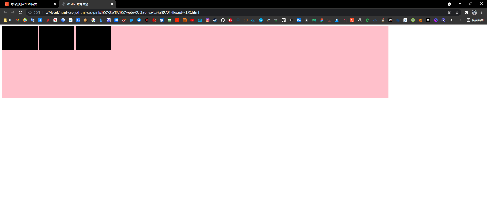

**等间距分布**

```html
<!doctype html>
<html lang="en">

<head>
    <meta charset="UTF-8">
    <meta name="viewport" content="width=device-width, initial-scale=1.0">
    <meta http-equiv="X-UA-Compatible" content="ie=edge">
    <title>01-flex布局体验</title>
    <style>
        div {
            display: flex;
            width: 80%;
            height: 300px;
            background-color: pink;
            justify-content: space-around;
        }

        div span {
            /* 弹性布局中：行内盒子的宽高可直接设置了 */
            width: 150px;
            height: 100px;
            background-color: black;
            margin-right: 5px;
        }
    </style>
</head>

<body>
    <div>
        <span>1</span>
        <span>2</span>
        <span>3</span>
    </div>
</body>

</html>
```


**平均分为三等分**

```html
<!doctype html>
<html lang="en">

<head>
    <meta charset="UTF-8">
    <meta name="viewport" content="width=device-width, initial-scale=1.0">
    <meta http-equiv="X-UA-Compatible" content="ie=edge">
    <title>01-flex布局体验</title>
    <style>
        div {
            display: flex;
            width: 80%;
            height: 300px;
            background-color: pink;
            justify-content: space-around;
        }

        div span {
            /* 弹性布局中：行内盒子的宽高可直接设置了 */
            /* width: 150px; */
            height: 100px;
            background-color: black;
            margin-right: 5px;
            flex: 1;
        }
    </style>
</head>

<body>
    <div>
        <span>1</span>
        <span>2</span>
        <span>3</span>
    </div>
</body>

</html>
```


# 二、flex布局原理

## 2.1 布局原理

flex 是 flexible Box 的缩写，意为 “弹性布局”，用来为盒状模型**提供最大的灵活性**，**任何一个容器都可以指定为 flex 布局**。

- 当我们为父盒子设为 flex 布局以后，子元素的 float（浮动功能）、clear（清除浮动功能）和 vertical-align（垂直居中功能）属性将失效。
- 伸缩布局 = 弹性布局 = 伸缩盒布局 = 弹性盒布局 = flex 布局

采用 flex 布局的元素，称为 flex 容器（flex container），简称 “容器”。它的所有子元素自动成为容器成员，称为 flex 项目（flex item），简称 “项目”。

- 上面的体验中 div 就是 flex 父容器
- 上面的体验中 span 就是子容器 flex 项目
- 子容器可以横向排列也可以纵向排列

【子容器横向排列时的图示】


【总结 flex 布局原理】

**就是通过给父盒子添加 flex 属性，来控制子盒子的位置和排列方式。**

# 三、flex布局父项常见属性

## 3.1 常见父项属性

以下由 6 个属性是对父元素设置的

- `flex-direction`：设置主轴的方向
- `justify-content`：设置主轴上的子元素排列方式
- `flex-wrap`：设置子元素是否换行
- `align-content`：设置侧轴上的子元素的排列方式（多行）
- `align-items`：设置侧轴上的子元素排列方式（单行）
- `flex-flow`：复合属性，相当于同时设置了 flex-direction 和 flex-wrap

## 3.2 flex-direction设置主轴的方向

**（1）主轴与侧轴**

在 flex 布局中，是分为主轴和侧轴两个方向，同样的叫法有：行 和 列、x轴 和 y轴

- 默认主轴方向就是 x轴 方向，水平向右
- 默认侧轴方向就是 y轴 方向，水平向下


**（2）属性值**

`flex-direction` 属性决定主轴的方向（即：项目的排列方向）

注意：主轴和侧轴是会变化的，就看 flex-direction 设置谁为主轴，剩下的就是侧轴。而我们的子元素是跟着主轴来排列的。

| 属性值           | 说明               |
| ---------------- | ------------------ |
| `row`            | 从左到右（默认值） |
| `row-reverse`    | 从右到左           |
| `column`         | 从上到下           |
| `column-reverse` | 从下到上           |

【案例】

```html
<!doctype html>
<html lang="en">

<head>
    <meta charset="UTF-8">
    <meta name="viewport" content="width=device-width, initial-scale=1.0">
    <meta http-equiv="X-UA-Compatible" content="ie=edge">
    <title>02-flex主轴方向</title>
    <style>
        div {
            /* 给父级添加flex属性 */
            display: flex;
            width: 800px;
            height: 300px;
            background-color: pink;
            /* 默认的主轴是 x 轴,那么 y 轴就是侧轴喽 */
            /* 我们的元素是跟着主轴来排列的 */
            flex-direction: row;
            /* 简单了解翻转即可 */
            /* flex-direction: row-reverse; */
            /* 我们可以把我们的主轴设置为 y 轴 那么 x 轴就成了侧轴 */
            /* flex-direction: column; */
        }

        div span {
            width: 150px;
            height: 100px;
            background-color: purple;
        }
    </style>
</head>

<body>
    <div>
        <span>1</span>
        <span>2</span>
        <span>3</span>
    </div>
</body>

</html>
```

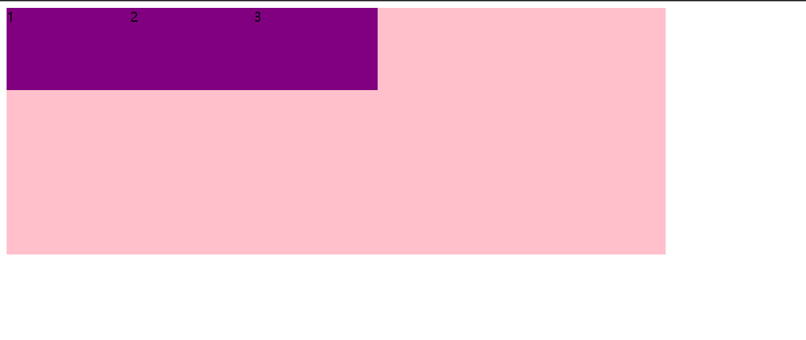

```html
<!doctype html>
<html lang="en">

<head>
    <meta charset="UTF-8">
    <meta name="viewport" content="width=device-width, initial-scale=1.0">
    <meta http-equiv="X-UA-Compatible" content="ie=edge">
    <title>02-flex主轴方向</title>
    <style>
        div {
            /* 给父级添加flex属性 */
            display: flex;
            width: 800px;
            height: 300px;
            background-color: pink;
            /* 默认的主轴是 x 轴,那么 y 轴就是侧轴喽 */
            /* 我们的元素是跟着主轴来排列的 */
            /* flex-direction: row; */
            /* 简单了解翻转即可 */
            flex-direction: row-reverse;
            /* 我们可以把我们的主轴设置为 y 轴 那么 x 轴就成了侧轴 */
            /* flex-direction: column; */
        }

        div span {
            width: 150px;
            height: 100px;
            background-color: purple;
        }
    </style>
</head>

<body>
    <div>
        <span>1</span>
        <span>2</span>
        <span>3</span>
    </div>
</body>

</html>
```


```html
<!doctype html>
<html lang="en">

<head>
    <meta charset="UTF-8">
    <meta name="viewport" content="width=device-width, initial-scale=1.0">
    <meta http-equiv="X-UA-Compatible" content="ie=edge">
    <title>02-flex主轴方向</title>
    <style>
        div {
            /* 给父级添加flex属性 */
            display: flex;
            width: 800px;
            height: 300px;
            background-color: pink;
            /* 默认的主轴是 x 轴,那么 y 轴就是侧轴喽 */
            /* 我们的元素是跟着主轴来排列的 */
            /* flex-direction: row; */
            /* 简单了解翻转即可 */
            /* flex-direction: row-reverse; */
            /* 我们可以把我们的主轴设置为 y 轴 那么 x 轴就成了侧轴 */
            flex-direction: column;
        }

        div span {
            width: 150px;
            height: 100px;
            background-color: purple;
        }
    </style>
</head>

<body>
    <div>
        <span>1</span>
        <span>2</span>
        <span>3</span>
    </div>
</body>

</html>
```


## 3.3 justify-content设置主轴上的子元素排列方式

`justify-content` 属性定义了项目在主轴上的对齐方式

注意：使用这个属性之前一定要确定好主轴是哪个！

| 属性值          | 说明                                             |
| --------------- | ------------------------------------------------ |
| `flex-start`    | 从头部开始，如果主轴是 x轴，则从左到右（默认值） |
| `flex-end`      | 从尾部开始排列                                   |
| `center`        | 在主轴居中对齐（如果主轴是 x轴 则 水平居中）     |
| `space-around`  | 平分剩余空间                                     |
| `space-between` | 先两边贴边再平方剩余空间（重要）                 |

【案例】

```html
<!doctype html>
<html lang="en">

<head>
    <meta charset="UTF-8">
    <meta name="viewport" content="width=device-width, initial-scale=1.0">
    <meta http-equiv="X-UA-Compatible" content="ie=edge">
    <title>03-flex设置主轴上的子元素排列方式1</title>
    <style>
        div {
            display: flex;
            width: 800px;
            height: 300px;
            background-color: pink;
            /* 默认的主轴是 x轴 row */
            flex-direction: row;
            /* justify-content: 是设置主轴上子元素的排列方式 */
            /* 从头部开始，如果主轴是 x轴，则从左到右（默认值） */
            justify-content: flex-start;
            /* 从尾部开始排列 */
            /* justify-content: flex-end; */
            /* 让我们子元素居中对齐 */
            /* justify-content: center; */
            /* 平分剩余空间 */
            /* justify-content: space-around; */
            /* 先两边贴边，在分配剩余的空间 */
            /* justify-content: space-between; */
        }

        div span {
            width: 150px;
            height: 100px;
            background-color: gray;
        }
    </style>
</head>

<body>
    <div>
        <span>1</span>
        <span>2</span>
        <span>3</span>
        <span>4</span>
    </div>
</body>

</html>
```

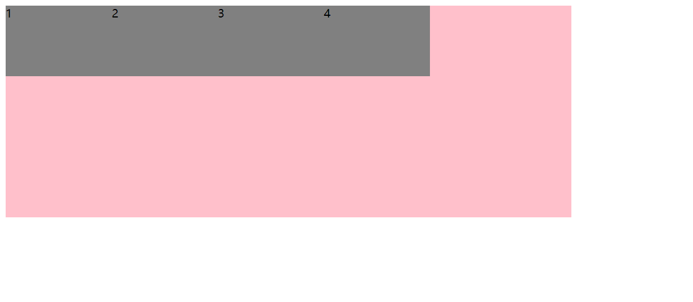

```html
<!doctype html>
<html lang="en">

<head>
    <meta charset="UTF-8">
    <meta name="viewport" content="width=device-width, initial-scale=1.0">
    <meta http-equiv="X-UA-Compatible" content="ie=edge">
    <title>03-flex设置主轴上的子元素排列方式1</title>
    <style>
        div {
            display: flex;
            width: 800px;
            height: 300px;
            background-color: pink;
            /* 默认的主轴是 x轴 row */
            flex-direction: row;
            /* justify-content: 是设置主轴上子元素的排列方式 */
            /* 从头部开始，如果主轴是 x轴，则从左到右（默认值） */
            /* justify-content: flex-start; */
            /* 从尾部开始排列 */
            justify-content: flex-end;
            /* 让我们子元素居中对齐 */
            /* justify-content: center; */
            /* 平分剩余空间 */
            /* justify-content: space-around; */
            /* 先两边贴边，在分配剩余的空间 */
            /* justify-content: space-between; */
        }

        div span {
            width: 150px;
            height: 100px;
            background-color: gray;
        }
    </style>
</head>

<body>
    <div>
        <span>1</span>
        <span>2</span>
        <span>3</span>
        <span>4</span>
    </div>
</body>

</html>
```


```html
<!doctype html>
<html lang="en">

<head>
    <meta charset="UTF-8">
    <meta name="viewport" content="width=device-width, initial-scale=1.0">
    <meta http-equiv="X-UA-Compatible" content="ie=edge">
    <title>03-flex设置主轴上的子元素排列方式1</title>
    <style>
        div {
            display: flex;
            width: 800px;
            height: 300px;
            background-color: pink;
            /* 默认的主轴是 x轴 row */
            flex-direction: row;
            /* justify-content: 是设置主轴上子元素的排列方式 */
            /* 从头部开始，如果主轴是 x轴，则从左到右（默认值） */
            /* justify-content: flex-start; */
            /* 从尾部开始排列 */
            /* justify-content: flex-end; */
            /* 让我们子元素居中对齐 */
            justify-content: center;
            /* 平分剩余空间 */
            /* justify-content: space-around; */
            /* 先两边贴边，在分配剩余的空间 */
            /* justify-content: space-between; */
        }

        div span {
            width: 150px;
            height: 100px;
            background-color: gray;
        }
    </style>
</head>

<body>
    <div>
        <span>1</span>
        <span>2</span>
        <span>3</span>
        <span>4</span>
    </div>
</body>

</html>
```


```html
<!doctype html>
<html lang="en">

<head>
    <meta charset="UTF-8">
    <meta name="viewport" content="width=device-width, initial-scale=1.0">
    <meta http-equiv="X-UA-Compatible" content="ie=edge">
    <title>03-flex设置主轴上的子元素排列方式1</title>
    <style>
        div {
            display: flex;
            width: 800px;
            height: 300px;
            background-color: pink;
            /* 默认的主轴是 x轴 row */
            flex-direction: row;
            /* justify-content: 是设置主轴上子元素的排列方式 */
            /* 从头部开始，如果主轴是 x轴，则从左到右（默认值） */
            /* justify-content: flex-start; */
            /* 从尾部开始排列 */
            /* justify-content: flex-end; */
            /* 让我们子元素居中对齐 */
            /* justify-content: center; */
            /* 平分剩余空间 */
            justify-content: space-around;
            /* 先两边贴边，在分配剩余的空间 */
            /* justify-content: space-between; */
        }

        div span {
            width: 150px;
            height: 100px;
            background-color: gray;
        }
    </style>
</head>

<body>
    <div>
        <span>1</span>
        <span>2</span>
        <span>3</span>
        <span>4</span>
    </div>
</body>

</html>
```


```html
<!doctype html>
<html lang="en">

<head>
    <meta charset="UTF-8">
    <meta name="viewport" content="width=device-width, initial-scale=1.0">
    <meta http-equiv="X-UA-Compatible" content="ie=edge">
    <title>03-flex设置主轴上的子元素排列方式1</title>
    <style>
        div {
            display: flex;
            width: 800px;
            height: 300px;
            background-color: pink;
            /* 默认的主轴是 x轴 row */
            flex-direction: row;
            /* justify-content: 是设置主轴上子元素的排列方式 */
            /* 从头部开始，如果主轴是 x轴，则从左到右（默认值） */
            /* justify-content: flex-start; */
            /* 从尾部开始排列 */
            /* justify-content: flex-end; */
            /* 让我们子元素居中对齐 */
            /* justify-content: center; */
            /* 平分剩余空间 */
            /* justify-content: space-around; */
            /* 先两边贴边，在分配剩余的空间 */
            justify-content: space-between;
        }

        div span {
            width: 150px;
            height: 100px;
            background-color: gray;
        }
    </style>
</head>

<body>
    <div>
        <span>1</span>
        <span>2</span>
        <span>3</span>
        <span>4</span>
    </div>
</body>

</html>
```


> 注意：以上例子并不能根据浏览器窗口大小自动调整子项之间的间距，因为父盒子的宽度是固定死 800px 的，假如我们把父盒子宽度设为 80%，那么就可以有效果了。

`div {width: 800px;}`


`div {width: 80%;}`


`div {width: 80%;}`

`div span {width: 80%;}`


【以上到下为主轴的案例】

```html
<!doctype html>
<html lang="en">

<head>
    <meta charset="UTF-8">
    <meta name="viewport" content="width=device-width, initial-scale=1.0">
    <meta http-equiv="X-UA-Compatible" content="ie=edge">
    <title>04-flex设置主轴上的子元素排列方式2</title>
    <style>
        div {
            display: flex;
            width: 800px;
            height: 400px;
            background-color: pink;
            /* 我们现在的主轴是 y轴 */
            flex-direction: column;
            /* justify-content: 是设置主轴上子元素的排列方式 */
            /* 从头部开始，则从上到下（默认值） */
            justify-content: flex-start;
            /* 从下开始排列 */
            /* justify-content: flex-end; */
            /* 让我们子元素垂直居中对齐 */
            /* justify-content: center; */
            /* 平分剩余空间 */
            /* justify-content: space-around; */
            /* 先上下两边贴边，在分配剩余的空间 */
            /* justify-content: space-between; */
        }

        div span {
            width: 150px;
            height: 100px;
            background-color: gray;
        }
    </style>
</head>

<body>
    <div>
        <span>1</span>
        <span>2</span>
        <span>3</span>
    </div>
</body>

</html>
```


```html
<!doctype html>
<html lang="en">

<head>
    <meta charset="UTF-8">
    <meta name="viewport" content="width=device-width, initial-scale=1.0">
    <meta http-equiv="X-UA-Compatible" content="ie=edge">
    <title>04-flex设置主轴上的子元素排列方式2</title>
    <style>
        div {
            display: flex;
            width: 800px;
            height: 400px;
            background-color: pink;
            /* 我们现在的主轴是 y轴 */
            flex-direction: column;
            /* justify-content: 是设置主轴上子元素的排列方式 */
            /* 从头部开始，则从上到下（默认值） */
            /* justify-content: flex-start; */
            /* 从下开始排列 */
            justify-content: flex-end;
            /* 让我们子元素垂直居中对齐 */
            /* justify-content: center; */
            /* 平分剩余空间 */
            /* justify-content: space-around; */
            /* 先上下两边贴边，在分配剩余的空间 */
            /* justify-content: space-between; */
        }

        div span {
            width: 150px;
            height: 100px;
            background-color: gray;
        }
    </style>
</head>

<body>
    <div>
        <span>1</span>
        <span>2</span>
        <span>3</span>
    </div>
</body>

</html>
```


```html
<!doctype html>
<html lang="en">

<head>
    <meta charset="UTF-8">
    <meta name="viewport" content="width=device-width, initial-scale=1.0">
    <meta http-equiv="X-UA-Compatible" content="ie=edge">
    <title>04-flex设置主轴上的子元素排列方式2</title>
    <style>
        div {
            display: flex;
            width: 800px;
            height: 400px;
            background-color: pink;
            /* 我们现在的主轴是 y轴 */
            flex-direction: column;
            /* justify-content: 是设置主轴上子元素的排列方式 */
            /* 从头部开始，则从上到下（默认值） */
            /* justify-content: flex-start; */
            /* 从下开始排列 */
            /* justify-content: flex-end; */
            /* 让我们子元素垂直居中对齐 */
            justify-content: center;
            /* 平分剩余空间 */
            /* justify-content: space-around; */
            /* 先上下两边贴边，在分配剩余的空间 */
            /* justify-content: space-between; */
        }

        div span {
            width: 150px;
            height: 100px;
            background-color: gray;
        }
    </style>
</head>

<body>
    <div>
        <span>1</span>
        <span>2</span>
        <span>3</span>
    </div>
</body>

</html>
```

盒子自动垂直居中的困扰终于解决啦！！！


```html
<!doctype html>
<html lang="en">

<head>
    <meta charset="UTF-8">
    <meta name="viewport" content="width=device-width, initial-scale=1.0">
    <meta http-equiv="X-UA-Compatible" content="ie=edge">
    <title>04-flex设置主轴上的子元素排列方式2</title>
    <style>
        div {
            display: flex;
            width: 800px;
            height: 400px;
            background-color: pink;
            /* 我们现在的主轴是 y轴 */
            flex-direction: column;
            /* justify-content: 是设置主轴上子元素的排列方式 */
            /* 从头部开始，则从上到下（默认值） */
            /* justify-content: flex-start; */
            /* 从下开始排列 */
            /* justify-content: flex-end; */
            /* 让我们子元素垂直居中对齐 */
            /* justify-content: center; */
            /* 平分剩余空间 */
            justify-content: space-around;
            /* 先上下两边贴边，在分配剩余的空间 */
            /* justify-content: space-between; */
        }

        div span {
            width: 150px;
            height: 100px;
            background-color: gray;
        }
    </style>
</head>

<body>
    <div>
        <span>1</span>
        <span>2</span>
        <span>3</span>
    </div>
</body>

</html>
```


```html
<!doctype html>
<html lang="en">

<head>
    <meta charset="UTF-8">
    <meta name="viewport" content="width=device-width, initial-scale=1.0">
    <meta http-equiv="X-UA-Compatible" content="ie=edge">
    <title>04-flex设置主轴上的子元素排列方式2</title>
    <style>
        div {
            display: flex;
            width: 800px;
            height: 400px;
            background-color: pink;
            /* 我们现在的主轴是 y轴 */
            flex-direction: column;
            /* justify-content: 是设置主轴上子元素的排列方式 */
            /* 从头部开始，则从上到下（默认值） */
            /* justify-content: flex-start; */
            /* 从下开始排列 */
            /* justify-content: flex-end; */
            /* 让我们子元素垂直居中对齐 */
            /* justify-content: center; */
            /* 平分剩余空间 */
            /* justify-content: space-around; */
            /* 先上下两边贴边，在分配剩余的空间 */
            justify-content: space-between;
        }

        div span {
            width: 150px;
            height: 100px;
            background-color: gray;
        }
    </style>
</head>

<body>
    <div>
        <span>1</span>
        <span>2</span>
        <span>3</span>
    </div>
</body>

</html>
```


## 3.4 flex-wrap设置子元素是否换行

默认情况下，项目都排在一条线（又称 “轴线”）上。flex-wrap 属性定义，flex 布局中默认是不换行的。

| 属性值   | 说明             |
| -------- | ---------------- |
| `nowrap` | 不换行（默认值） |
| `wrap`   | 换行             |

【案例】

```html
<!doctype html>
<html lang="en">

<head>
    <meta charset="UTF-8">
    <meta name="viewport" content="width=device-width, initial-scale=1.0">
    <meta http-equiv="X-UA-Compatible" content="ie=edge">
    <title>05-flex-wrap子元素是否换行</title>
    <style>
        div {
            display: flex;
            width: 600px;
            height: 400px;
            background-color: pink;
            /* flex布局中，默认的子元素是不换行的， 如果装不开，会缩小子元素的宽度，放到父元素里面  */
            /* flex-wrap: nowrap; */
            /* 自动换行 */
            /* flex-wrap: wrap; */
        }

        div span {
            width: 150px;
            height: 100px;
            background-color: gray;
            color: #fff;
            margin: 10px;
        }
    </style>
</head>

<body>
    <div>
        <span>1</span>
        <span>2</span>
        <span>3</span>
        <span>4</span>
        <span>5</span>
        <span>6</span>
    </div>
</body>

</html>
```


```html
<!doctype html>
<html lang="en">

<head>
    <meta charset="UTF-8">
    <meta name="viewport" content="width=device-width, initial-scale=1.0">
    <meta http-equiv="X-UA-Compatible" content="ie=edge">
    <title>05-flex-wrap子元素是否换行</title>
    <style>
        div {
            display: flex;
            width: 600px;
            height: 400px;
            background-color: pink;
            /* flex布局中，默认的子元素是不换行的， 如果装不开，会缩小子元素的宽度，放到父元素里面  */
            /* flex-wrap: nowrap; */
            /* 自动换行 */
            flex-wrap: wrap;
        }

        div span {
            width: 150px;
            height: 100px;
            background-color: gray;
            color: #fff;
            margin: 10px;
        }
    </style>
</head>

<body>
    <div>
        <span>1</span>
        <span>2</span>
        <span>3</span>
        <span>4</span>
        <span>5</span>
        <span>6</span>
    </div>
</body>

</html>
```


## 3.5 align-items设置侧轴上的子元素排列方式（单行）

该属性是控制子项在侧轴（默认是 y轴）上的排列方式，在子项为单项（单行）的时候使用。

| 属性值       | 说明                                                       |
| ------------ | ---------------------------------------------------------- |
| `flex-start` | 从上到下                                                   |
| `flex-end`   | 从下到上                                                   |
| `center`     | 挤在一起居中                                               |
| `stretch`    | 拉伸（默认值）注：前提是子盒子没有指定高度，否则没有效果！ |

【案例】

```html
<!doctype html>
<html lang="en">

<head>
    <meta charset="UTF-8">
    <meta name="viewport" content="width=device-width, initial-scale=1.0">
    <meta http-equiv="X-UA-Compatible" content="ie=edge">
    <title>06-flex设置侧轴上的子元素排列方式</title>
    <style>
        div {
            display: flex;
            width: 800px;
            height: 400px;
            background-color: pink;
            /* 默认的主轴是 x轴 row */
            flex-direction: row;
            justify-content: center;
            /* 设置侧轴：从上到下 */
            align-items: flex-start;
        }

        div span {
            width: 150px;
            height: 100px;
            background-color: gray;
            color: #fff;
            margin: 10px;
        }
    </style>
</head>

<body>
    <div>
        <span>1</span>
        <span>2</span>
        <span>3</span>
    </div>
</body>

</html>
```


```html
<!doctype html>
<html lang="en">

<head>
    <meta charset="UTF-8">
    <meta name="viewport" content="width=device-width, initial-scale=1.0">
    <meta http-equiv="X-UA-Compatible" content="ie=edge">
    <title>06-flex设置侧轴上的子元素排列方式</title>
    <style>
        div {
            display: flex;
            width: 800px;
            height: 400px;
            background-color: pink;
            /* 默认的主轴是 x轴 row */
            flex-direction: row;
            justify-content: center;
            /* 设置侧轴：从下到上 */
            align-items: flex-end;
        }

        div span {
            width: 150px;
            height: 100px;
            background-color: gray;
            color: #fff;
            margin: 10px;
        }
    </style>
</head>

<body>
    <div>
        <span>1</span>
        <span>2</span>
        <span>3</span>
    </div>
</body>

</html>
```

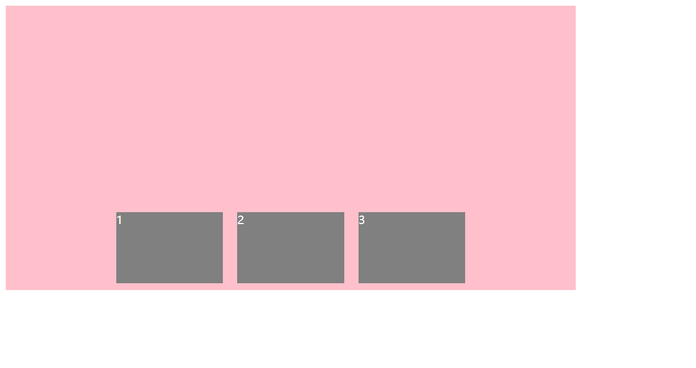

```html
<!doctype html>
<html lang="en">

<head>
    <meta charset="UTF-8">
    <meta name="viewport" content="width=device-width, initial-scale=1.0">
    <meta http-equiv="X-UA-Compatible" content="ie=edge">
    <title>06-flex设置侧轴上的子元素排列方式</title>
    <style>
        div {
            display: flex;
            width: 800px;
            height: 400px;
            background-color: pink;
            /* 默认的主轴是 x轴 row */
            flex-direction: row;
            justify-content: center;
            /* 设置侧轴：挤在一起居中 */
            align-items: center;
        }

        div span {
            width: 150px;
            height: 100px;
            background-color: gray;
            color: #fff;
            margin: 10px;
        }
    </style>
</head>

<body>
    <div>
        <span>1</span>
        <span>2</span>
        <span>3</span>
    </div>
</body>

</html>
```

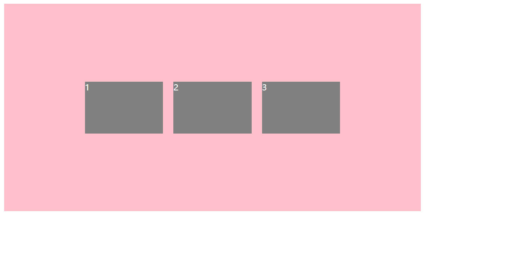

```html
<!doctype html>
<html lang="en">

<head>
    <meta charset="UTF-8">
    <meta name="viewport" content="width=device-width, initial-scale=1.0">
    <meta http-equiv="X-UA-Compatible" content="ie=edge">
    <title>06-flex设置侧轴上的子元素排列方式</title>
    <style>
        div {
            display: flex;
            width: 800px;
            height: 400px;
            background-color: pink;
            /* 默认的主轴是 x轴 row */
            flex-direction: row;
            justify-content: center;
            /* 设置侧轴：拉伸（默认） */
            align-items: stretch;
        }

        div span {
            width: 150px;
            /* 拉伸的前提是没有指定高度 */
            /* height: 100px; */
            background-color: gray;
            color: #fff;
            margin: 10px;
        }
    </style>
</head>

<body>
    <div>
        <span>1</span>
        <span>2</span>
        <span>3</span>
    </div>
</body>

</html>
```


> align-items 只能统一对侧轴上的子元素排列方式，假如有多行子元素，要分别对不同的行设置不同的排列方式，那么此种方式就无法做了。

## 3.6 align-content 设置侧轴上的子元素的排列方式（多行）

设置子项在侧轴上的排列方式并且只能用于子项出现 **换行** 的情况（多行），在单行下是没有效果的。

| 属性值          | 说明                                   |
| --------------- | -------------------------------------- |
| `flex-start`    | 在侧轴的头部开始排列                   |
| `flex-end`      | 在侧轴的尾部开始排列                   |
| `center`        | 在侧轴中间显示                         |
| `space-around`  | 子项在侧轴平方剩余空间                 |
| `space-between` | 子项在侧轴先分布在两头，再平分剩余空间 |
| `stretch`       | 行拉伸以占据剩余空间（默认值）         |

【案例】

```html
<!doctype html>
<html lang="en">

<head>
    <meta charset="UTF-8">
    <meta name="viewport" content="width=device-width, initial-scale=1.0">
    <meta http-equiv="X-UA-Compatible" content="ie=edge">
    <title>07-flex设置侧轴上的子元素排列方式（多行）</title>
    <style>
        div {
            display: flex;
            width: 800px;
            height: 400px;
            background-color: pink;
            /* 换行 */
            flex-wrap: wrap;
            /* 因为有了换行，此时我们侧轴上控制子元素的对齐方式我们用 align-content */
            align-content: flex-start;
            /* align-content: center; */
            /* align-content: space-around; */
            /* align-content: space-between; */
            /* align-content: stretch; */
        }

        div span {
            width: 150px;
            height: 100px;
            background-color: gray;
            color: #fff;
            margin: 10px;
        }
    </style>
</head>

<body>
    <div>
        <span>1</span>
        <span>2</span>
        <span>3</span>
        <span>4</span>
        <span>5</span>
        <span>6</span>
        <span>7</span>
        <span>8</span>
    </div>
</body>

</html>
```


```html
<!doctype html>
<html lang="en">

<head>
    <meta charset="UTF-8">
    <meta name="viewport" content="width=device-width, initial-scale=1.0">
    <meta http-equiv="X-UA-Compatible" content="ie=edge">
    <title>07-flex设置侧轴上的子元素排列方式（多行）</title>
    <style>
        div {
            display: flex;
            width: 800px;
            height: 400px;
            background-color: pink;
            /* 换行 */
            flex-wrap: wrap;
            /* 因为有了换行，此时我们侧轴上控制子元素的对齐方式我们用 align-content */
            /* align-content: flex-start; */
            align-content: center;
            /* align-content: space-around; */
            /* align-content: space-between; */
            /* align-content: stretch; */
        }

        div span {
            width: 150px;
            height: 100px;
            background-color: gray;
            color: #fff;
            margin: 10px;
        }
    </style>
</head>

<body>
    <div>
        <span>1</span>
        <span>2</span>
        <span>3</span>
        <span>4</span>
        <span>5</span>
        <span>6</span>
        <span>7</span>
        <span>8</span>
    </div>
</body>

</html>
```


```html
<!doctype html>
<html lang="en">

<head>
    <meta charset="UTF-8">
    <meta name="viewport" content="width=device-width, initial-scale=1.0">
    <meta http-equiv="X-UA-Compatible" content="ie=edge">
    <title>07-flex设置侧轴上的子元素排列方式（多行）</title>
    <style>
        div {
            display: flex;
            width: 800px;
            height: 400px;
            background-color: pink;
            /* 换行 */
            flex-wrap: wrap;
            /* 因为有了换行，此时我们侧轴上控制子元素的对齐方式我们用 align-content */
            /* align-content: flex-start; */
            /* align-content: center; */
            align-content: space-around;
            /* align-content: space-between; */
            /* align-content: stretch; */
        }

        div span {
            width: 150px;
            height: 100px;
            background-color: gray;
            color: #fff;
            margin: 10px;
        }
    </style>
</head>

<body>
    <div>
        <span>1</span>
        <span>2</span>
        <span>3</span>
        <span>4</span>
        <span>5</span>
        <span>6</span>
        <span>7</span>
        <span>8</span>
    </div>
</body>

</html>
```

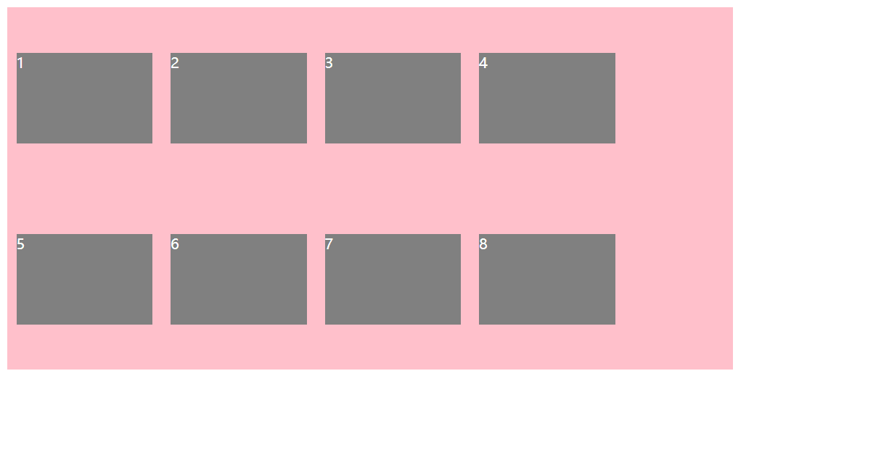

```html
<!doctype html>
<html lang="en">

<head>
    <meta charset="UTF-8">
    <meta name="viewport" content="width=device-width, initial-scale=1.0">
    <meta http-equiv="X-UA-Compatible" content="ie=edge">
    <title>07-flex设置侧轴上的子元素排列方式（多行）</title>
    <style>
        div {
            display: flex;
            width: 800px;
            height: 400px;
            background-color: pink;
            /* 换行 */
            flex-wrap: wrap;
            /* 因为有了换行，此时我们侧轴上控制子元素的对齐方式我们用 align-content */
            /* align-content: flex-start; */
            /* align-content: center; */
            /* align-content: space-around; */
            align-content: space-between;
            /* align-content: stretch; */
        }

        div span {
            width: 150px;
            height: 100px;
            background-color: gray;
            color: #fff;
            margin: 10px;
        }
    </style>
</head>

<body>
    <div>
        <span>1</span>
        <span>2</span>
        <span>3</span>
        <span>4</span>
        <span>5</span>
        <span>6</span>
        <span>7</span>
        <span>8</span>
    </div>
</body>

</html>
```


```html
<!doctype html>
<html lang="en">

<head>
    <meta charset="UTF-8">
    <meta name="viewport" content="width=device-width, initial-scale=1.0">
    <meta http-equiv="X-UA-Compatible" content="ie=edge">
    <title>07-flex设置侧轴上的子元素排列方式（多行）</title>
    <style>
        div {
            display: flex;
            width: 800px;
            height: 400px;
            background-color: pink;
            /* 换行 */
            flex-wrap: wrap;
            /* 因为有了换行，此时我们侧轴上控制子元素的对齐方式我们用 align-content */
            /* align-content: flex-start; */
            /* align-content: center; */
            /* align-content: space-around; */
            /* align-content: space-between; */
            align-content: stretch;
        }

        div span {
            width: 150px;
            height: 100px;
            background-color: gray;
            color: #fff;
            margin: 10px;
        }
    </style>
</head>

<body>
    <div>
        <span>1</span>
        <span>2</span>
        <span>3</span>
        <span>4</span>
        <span>5</span>
        <span>6</span>
        <span>7</span>
        <span>8</span>
    </div>
</body>

</html>
```


## 3.7 align-content和align-items区别

- align-items 适用于单行情况下，只有上对齐、下对齐、居中和拉伸
- align-content 适应于换行（多行）的情况下（单行情况下无效），可以设置上对齐、下对齐、居中、拉伸以及平均分配剩余空间等属性值
- 总结就是单行找 align-items 多行找 align-content


## 3.8 flex-flow

`flex-flow` 属性是 flex-direction 和 flex-wrap 属性的复合属性

`flex-flow: row wrap;`

- `flex-direction`：设置主轴的方向
- `justify-content`：设置主轴上的子元素排列方式
- `flex-wrap`：设置子元素是否换行
- `align-content`：设置侧轴上的子元素的排列方式（多行）
- `align-items`：设置侧轴上的子元素排列方式（单行）
- `flex-flow`：复合属性，相当于同时设置了 flex-direction 和 flex-wrap

【案例】

```html
<!doctype html>
<html lang="en">

<head>
    <meta charset="UTF-8">
    <meta name="viewport" content="width=device-width, initial-scale=1.0">
    <meta http-equiv="X-UA-Compatible" content="ie=edge">
    <title>08-flex-flow复合属性</title>
    <style>
        div {
            display: flex;
            width: 600px;
            height: 300px;
            background-color: pink;
            /* flex-direction: column;
            flex-wrap: wrap; */
            /* 把设置主轴方向和是否换行（换列）简写 */
            flex-flow: column wrap;
        }

        div span {
            width: 150px;
            height: 100px;
            background-color: gray;
        }
    </style>
</head>

<body>
    <div>
        <span>1</span>
        <span>2</span>
        <span>3</span>
        <span>4</span>
        <span>5</span>
    </div>
</body>

</html>
```


# 四、flex布局子项常见属性

- flex 子项目占的份数
- align-self 控制子项自己在侧轴的排列方式
- order 属性定义子项的排列顺序（前后顺序）

## 4.1 flex属性

flex 属性定义子项目分配剩余空间，用 flex 来表示占多少份数。

```css
.item {
    flex: <number>; /* default 0 */
}
```

【案例】

```html
<!doctype html>
<html lang="en">

<head>
    <meta charset="UTF-8">
    <meta name="viewport" content="width=device-width, initial-scale=1.0">
    <meta http-equiv="X-UA-Compatible" content="ie=edge">
    <title>09-flex子项flex份数</title>
    <style>
        section {
            display: flex;
            width: 60%;
            height: 150px;
            background-color: pink;
            margin: 0 auto;
        }

        section div:nth-child(1) {
            width: 100px;
            height: 150px;
            background-color: rgb(166, 255, 139);
        }

        section div:nth-child(2) {
            flex: 1;
            background-color: rgb(0, 0, 0);
        }

        section div:nth-child(3) {
            width: 100px;
            height: 150px;
            background-color: rgb(124, 185, 255);
        }

        /* --------------------------------- */

        p {
            display: flex;
            width: 60%;
            height: 150px;
            background-color: pink;
            margin: 100px auto;
        }

        p span {
            flex: 1;
        }

        p span:nth-child(2) {
            flex: 2;
            background-color: gray;
        }
    </style>
</head>

<body>
    <section>
        <div></div>
        <div></div>
        <div></div>
    </section>
    <p>
        <span>1</span>
        <span>2</span>
        <span>3</span>
    </p>
</body>

</html>
```


## 4.2 align-self控制子项自己在侧轴上的排列方式

`align-self` 属性允许单个项目有与其他项目不一样的对齐方式，可覆盖 align-items 属性。

默认值 auto，表示继承父元素 align-items 属性，如果没有父元素，则等同于 stretch。

```css
span:nth-child(2) {
    /* 设置自己在侧轴上的排列方式 */
    align-self: flex-end;
}
```

```html
<!doctype html>
<html lang="en">

<head>
    <meta charset="UTF-8">
    <meta name="viewport" content="width=device-width, initial-scale=1.0">
    <meta http-equiv="X-UA-Compatible" content="ie=edge">
    <title>align-self控制子项自己在侧轴上的排列方式</title>
    <style>
        div {
            display: flex;
            width: 800px;
            height: 400px;
            background-color: pink;
            /* 默认的主轴是 x轴 row */
            flex-direction: row;
            justify-content: center;
            /* 设置侧轴：从下到上 */
            align-items: flex-end;
        }

        div span {
            width: 150px;
            height: 100px;
            background-color: gray;
            color: #fff;
            margin: 10px;
        }

        div span:nth-child(2) {
            align-self: center;
        }
    </style>
</head>

<body>
<div>
    <span>1</span>
    <span>2</span>
    <span>3</span>
</div>
</body>

</html>
```


## 4.3 order属性定义项目的排列顺序

数值越小，排列越靠前，默认为 0。

注意：和 z-index 不一样。

```css
.item {
    order: <number>;
}
```

【案例】

```html
<!doctype html>
<html lang="en">

<head>
    <meta charset="UTF-8">
    <meta name="viewport" content="width=device-width, initial-scale=1.0">
    <meta http-equiv="X-UA-Compatible" content="ie=edge">
    <title>10-align-self和order</title>
    <style>
        div {
            display: flex;
            width: 80%;
            height: 300px;
            background-color: pink;
            /* 让三个子盒子沿着侧轴底侧对齐 */
            /* align-items: flex-end; */
            /* 我们想只让3号盒子下来底侧 */
        }

        div span {
            width: 150px;
            height: 100px;
            background-color: gray;
            margin-right: 5px;
        }

        div span:nth-child(2) {
            /* 排列顺序 */
            /* 默认是0，-1比0小所以在前面 */
            order: -1;
        }

        div span:nth-child(3) {
            /* 单独设置 */
            align-self: flex-end;
        }
    </style>
</head>

<body>
    <div>
        <span>1</span>
        <span>2</span>
        <span>3</span>
    </div>
</body>

</html>
```


# 五、携程网首页案例制作

**【案例：携程网移动端首页】**

访问地址：https://m.ctrip.com/

**（1）技术选型**

方案：我们采取单独制作移动页面方案

技术：布局采取 flex 布局

**（2）搭建相关文件夹结构**


**（3）设置视口标签以及引入初始化样式**

```html
<meta name="viewport" content="width=device-width, user-scalable=no,
initial-scale=1.0, maximum-scale=1.0, minimum-scale=1.0">
<link rel="stylesheet" href="css/normalize.css">
<link rel="stylesheet" href="css/index.css">
```

**（4）常用初始化样式**

```css
/* 放在 index.css 中 */
body {
	max-width: 540px;
	min-width: 320px;
	margin: 0 auto;
	font: normal 14px/1.5 Tahoma, "Lucida Grande", Verdana, "Microsoft Yahei", STXihei, hei;
	color: #000;
	background: #f2f2f2;
	overflow-x: hidden;
	-webkit-tap-highlight-color: transparent;
}
```

**（5）常见模块命名**


**（6）常见 flex 布局思路**


【完整代码】

```html
<!doctype html>
<html lang="en">

<head>
    <meta charset="UTF-8">
    <meta name="viewport" content="width=device-width, initial-scale=1.0">
    <meta http-equiv="X-UA-Compatible" content="ie=edge">
    <link rel="stylesheet" href="css/normalize.css">
    <link rel="stylesheet" href="css/index.css">
    <title>携程在手，说走就走</title>
</head>

<body>
    <!-- 顶部搜索 -->
    <div class="search-index">
        <div class="search">搜索:目的地/酒店/景点/航班号</div>
        <a href="#" class="user">我 的</a>
    </div>
    <!-- 焦点图模块 -->
    <div class="focus">
        
    </div>
    <!-- 局部导航栏 -->
    <ul class="local-nav">
        <li>
            <a href="#" title="景点·玩乐">
                <span class="local-nav-icon-icon1"></span>
                <span>景点·玩乐</span>
            </a>
        </li>
        <li>
            <a href="#" title="景点·玩乐">
                <span class="local-nav-icon-icon2"></span>
                <span>景点·玩乐</span>
            </a>
        </li>
        <li>
            <a href="#" title="景点·玩乐">
                <span class="local-nav-icon-icon3"></span>
                <span>景点·玩乐</span>
            </a>
        </li>
        <li>
            <a href="#" title="景点·玩乐">
                <span class="local-nav-icon-icon4"></span>
                <span>景点·玩乐</span>
            </a>
        </li>
        <li>
            <a href="#" title="景点·玩乐">
                <span class="local-nav-icon-icon5"></span>
                <span>景点·玩乐</span>
            </a>
        </li>

    </ul>

    <!-- 主导航栏 -->
    <nav>
        <div class="nav-common">
            <div class="nav-items">
                <a href="#">海外酒店</a>
            </div>
            <div class="nav-items">
                <a href="#">海外酒店</a>
                <a href="#">特价酒店</a>
            </div>
            <div class="nav-items">
                <a href="#">海外酒店</a>
                <a href="#">特价酒店</a>
            </div>
        </div>
        <div class="nav-common">
            <div class="nav-items">
                <a href="#">海外酒店</a>
            </div>
            <div class="nav-items">
                <a href="#">海外酒店</a>
                <a href="#">特价酒店</a>
            </div>
            <div class="nav-items">
                <a href="#">海外酒店</a>
                <a href="#">特价酒店</a>
            </div>
        </div>
        <div class="nav-common">
            <div class="nav-items">
                <a href="#">海外酒店</a>
            </div>
            <div class="nav-items">
                <a href="#">海外酒店</a>
                <a href="#">特价酒店</a>
            </div>
            <div class="nav-items">
                <a href="#">海外酒店</a>
                <a href="#">特价酒店</a>
            </div>
        </div>

    </nav>
    <!-- 侧导航栏 -->
    <ul class="subnav-entry">
        <li>
            <a href="#">
                <span class="subnav-entry-icon"></span>
                <span>电话费</span>
            </a>
        </li>
        <li>
            <a href="#">
                <span class="subnav-entry-icon"></span>
                <span>电话费</span>
            </a>
        </li>
        <li>
            <a href="#">
                <span class="subnav-entry-icon"></span>
                <span>电话费</span>
            </a>
        </li>
        <li>
            <a href="#">
                <span class="subnav-entry-icon"></span>
                <span>电话费</span>
            </a>
        </li>
        <li>
            <a href="#">
                <span class="subnav-entry-icon"></span>
                <span>电话费</span>
            </a>
        </li>
        <li>
            <a href="#">
                <span class="subnav-entry-icon"></span>
                <span>电话费</span>
            </a>
        </li>
        <li>
            <a href="#">
                <span class="subnav-entry-icon"></span>
                <span>电话费</span>
            </a>
        </li>
        <li>
            <a href="#">
                <span class="subnav-entry-icon"></span>
                <span>电话费</span>
            </a>
        </li>
        <li>
            <a href="#">
                <span class="subnav-entry-icon"></span>
                <span>电话费</span>
            </a>
        </li>
        <li>
            <a href="#">
                <span class="subnav-entry-icon"></span>
                <span>电话费</span>
            </a>
        </li>

    </ul>

    <!-- 销售模块 -->
    <div class="sales-box">
        <div class="sales-hd">
            <h2>热门活动</h2>
            <a href="#" class="more">获取更多福利</a>
        </div>
        <div class="sales-bd">
            <div class="row">
                <a href="#">
                    
                </a>
                <a href="#">
                    

                </a>
            </div>
            <div class="row">
                <a href="#">
                    
                </a>
                <a href="#">
                    

                </a>
            </div>
            <div class="row">
                <a href="#">
                    
                </a>
                <a href="#">
                    

                </a>
            </div>

        </div>
    </div>
</body>

</html>
```

```css
body {
  max-width: 540px;
  min-width: 320px;
  margin: 0 auto;
  font: normal 14px/1.5 Tahoma, "Lucida Grande", Verdana, "Microsoft Yahei",
    STXihei, hei;
  color: #000;
  background: #f2f2f2;
  overflow-x: hidden;
  -webkit-tap-highlight-color: transparent;
}

ul {
  list-style: none;
  margin: 0;
  padding: 0;
}

a {
  text-decoration: none;
  color: #222;
}

div {
  box-sizing: border-box;
}

/* 搜索模块 */

.search-index {
  display: flex;
  /* 固定定位跟父级没有关系 它以屏幕为准 */
  position: fixed;
  top: 0;
  left: 50%;
  /* 固定的盒子应该有宽度 */
  -webkit-transform: translateX(-50%);
  transform: translateX(-50%);
  width: 100%;
  min-width: 320px;
  max-width: 540px;
  height: 44px;
  background-color: #f6f6f6;
  border-top: 1px solid #ccc;
  border-bottom: 1px solid #ccc;
}

.search {
  position: relative;
  height: 26px;
  line-height: 24px;
  border: 1px solid #ccc;
  flex: 1;
  font-size: 12px;
  color: #666;
  margin: 7px 10px;
  padding-left: 25px;
  border-radius: 5px;
  box-shadow: 0 2px 4px rgba(0, 0, 0, 0.2);
}

.search::before {
  content: "";
  position: absolute;
  top: 5px;
  left: 5px;
  width: 15px;
  height: 15px;
  background: url(../images/sprite.png) no-repeat -59px -279px;
  background-size: 104px auto;
}

.user {
  width: 44px;
  height: 44px;
  font-size: 12px;
  text-align: center;
  color: #2eaae0;
}

.user::before {
  content: "";
  display: block;
  width: 23px;
  height: 23px;
  background: url(../images/sprite.png) no-repeat -59px -194px;
  background-size: 104px auto;
  margin: 4px auto -2px;
}

/* focus */

.focus {
  padding-top: 44px;
}

.focus img {
  width: 100%;
}

/* local-nav */

.local-nav {
  display: flex;
  height: 64px;
  margin: 3px 4px;
  background-color: #fff;
  border-radius: 8px;
}

.local-nav li {
  flex: 1;
}

.local-nav a {
  display: flex;
  flex-direction: column;
  /* 侧轴居中对齐 因为是单行 */
  align-items: center;
  font-size: 12px;
}

.local-nav li [class^="local-nav-icon"] {
  width: 32px;
  height: 32px;
  background-color: pink;
  margin-top: 8px;
  background: url(../images/localnav_bg.png) no-repeat 0 0;
  background-size: 32px auto;
}

.local-nav li .local-nav-icon-icon2 {
  background-position: 0 -32px;
}

.local-nav li .local-nav-icon-icon3 {
  background-position: 0 -64px;
}

.local-nav li .local-nav-icon-icon4 {
  background-position: 0 -96px;
}

.local-nav li .local-nav-icon-icon5 {
  background-position: 0 -128px;
}

/* nav */

nav {
  overflow: hidden;
  border-radius: 8px;
  margin: 0 4px 3px;
}

.nav-common {
  display: flex;
  height: 88px;
  background-color: pink;
}

.nav-common:nth-child(2) {
  margin: 3px 0;
}

.nav-items {
  /* 不冲突的 */
  flex: 1;
  display: flex;
  flex-direction: column;
}

.nav-items a {
  flex: 1;
  text-align: center;
  line-height: 44px;
  color: #fff;
  font-size: 14px;
  /* 文字阴影 */
  text-shadow: 1px 1px rgba(0, 0, 0, 0.2);
}

.nav-items a:nth-child(1) {
  border-bottom: 1px solid #fff;
}

.nav-items:nth-child(1) a {
  border: 0;
  background: url(../images/hotel.png) no-repeat bottom center;
  background-size: 121px auto;
}

/* -n+2就是选择前面两个元素 */

.nav-items:nth-child(-n + 2) {
  border-right: 1px solid #fff;
}

.nav-common:nth-child(1) {
  background: -webkit-linear-gradient(left, #fa5a55, #fa994d);
}

.nav-common:nth-child(2) {
  background: -webkit-linear-gradient(left, #4b90ed, #53bced);
}

.nav-common:nth-child(3) {
  background: -webkit-linear-gradient(left, #34c2a9, #6cd559);
}

/* subnav-entry */

.subnav-entry {
  display: flex;
  border-radius: 8px;
  background-color: #fff;
  margin: 0 4px;
  flex-wrap: wrap;
  padding: 5px 0;
}

.subnav-entry li {
  /* 里面的子盒子可以写 % 相对于父级来说的 */
  flex: 20%;
}

.subnav-entry a {
  display: flex;
  flex-direction: column;
  align-items: center;
}

.subnav-entry-icon {
  width: 28px;
  height: 28px;
  background-color: pink;
  margin-top: 4px;
  background: url(../images/subnav-bg.png) no-repeat;
  background-size: 28px auto;
}

/* sales-box */

.sales-box {
  border-top: 1px solid #bbb;
  background-color: #fff;
  margin: 4px;
}

.sales-hd {
  position: relative;
  height: 44px;
  border-bottom: 1px solid #ccc;
}

.sales-hd h2 {
  position: relative;
  text-indent: -999px;
  overflow: hidden;
}

.sales-hd h2::after {
  position: absolute;
  top: 5px;
  left: 8px;
  content: "";
  width: 79px;
  height: 15px;
  background: url(../images/hot.png) no-repeat 0 -20px;
  background-size: 79px auto;
}

.more {
  position: absolute;
  right: 5px;
  top: 0px;
  background: -webkit-linear-gradient(left, #ff506c, #ff6bc6);
  border-radius: 15px;
  padding: 3px 20px 3px 10px;
  color: #fff;
}

.more::after {
  content: "";
  position: absolute;
  top: 9px;
  right: 9px;
  width: 7px;
  height: 7px;
  border-top: 2px solid #fff;
  border-right: 2px solid #fff;
  transform: rotate(45deg);
}

.row {
  display: flex;
}

.row a {
  flex: 1;
  border-bottom: 1px solid #eee;
}

.row a:nth-child(1) {
  border-right: 1px solid #eee;
}

.row a img {
  width: 100%;
}
```

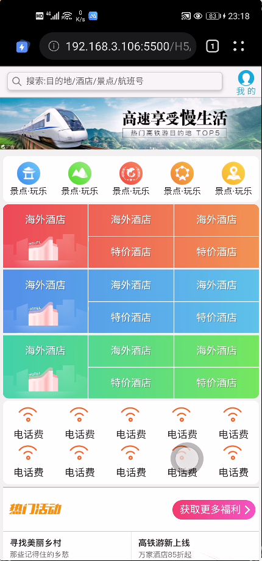


# 六、携程网首页案例重点强调

## 6.1 搜索模块

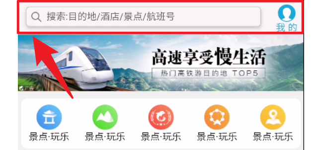

```html
<!-- 顶部搜索 -->
<div class="search-index">
    <div class="search">搜索:目的地/酒店/景点/航班号</div>
	<a href="#" class="user">我 的</a>
</div>
```

最上方的搜索模块整体是利用固定定位来实现的，里面的内容布局则是通过弹性布局实现。

**（1）整体部分的定位**

```css
.search-index {
  /* 固定定位跟父级没有关系 它以屏幕为准 */
  position: fixed;
  top: 0;
  /* 重点：利用 translateX 实现移动自身宽度的一半！*/
  left: 50%;
  /* 固定的盒子应该有宽度 */
  -webkit-transform: translateX(-50%);
  transform: translateX(-50%);
  /* 搜索框宽度与显示宽度一样 */
  width: 100%;
  min-width: 320px;
  max-width: 540px;
  height: 44px;
  background-color: #f6f6f6;
}
```

**（2）搜索栏与我的部分布局**

- 【对 search-index 设置弹性布局】

```css
display: flex;
```

- 【对 serch 设置占满1份区域】

```css
.search {
  height: 26px;
  line-height: 24px;
  border: 1px solid #ccc;
  /* 设置为占据 1份 */
  flex: 1;
  font-size: 12px;
  color: #666;
  margin: 7px 10px;
  padding-left: 25px;
}
```

- 【user 单独设置一个宽度，占据自己那部分】

```css
.user {
  width: 44px;
  height: 44px;
  font-size: 12px;
  text-align: center;
  color: #2eaae0;
}
```

最终实现的结构：

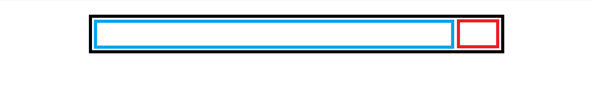

## 6.2 渐变

### 6.2.1 背景渐变

**（1）背景线性渐变**

语法：

`background: linear-gradient(起始方向, 颜色1, 颜色2, 颜色3, ...);`

```css
background: -webkit-linear-gradient(left, red, blue);
background: -webkit-linear-gradient(left top, red, blue, deeppink);
background: -webkit-linear-gradient(45deg, red, blue);
```

- 背景渐变**必须**添加浏览器私有前缀

- 起始方向可以是：**方位名词** 或 **度数**，如果省略默认就是 top（从上到下）

- 方位名词：`top`、`bottom`、`left`、`right`、`两两组合`

- 度数：角度是指水平线和渐变线之间的角度，逆时针方向计算。换句话说，0deg 将创建一个从下到上的渐变，90deg 将创建一个从左到右的渐变。

  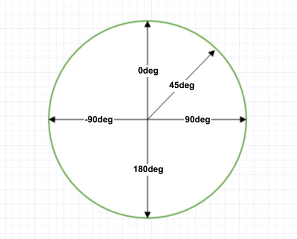

  > 注意很多浏览器（Chrome、Safari、firefox等）的使用了旧的标准，即 0deg 将创建一个从左到右的渐变，90deg 将创建一个从下到上的渐变。换算公式 **90 - x = y** 其中 x 为标准角度，y为非标准角度。

【案例】

```html
<!doctype html>
<html lang="en">

<head>
    <meta charset="UTF-8">
    <meta name="viewport" content="width=device-width, initial-scale=1.0">
    <meta http-equiv="X-UA-Compatible" content="ie=edge">
    <title>背景线性渐变</title>
    <style>
        div {
            width: 600px;
            height: 200px;
            background-color: red; /* 浏览器不支持的时候显示 */
            /* 背景渐变必须添加浏览器私有前缀 */
            /* 由于此处是移动端，所以我们写 webkit 就够了 */
            background: -webkit-linear-gradient(left, red, blue);
        }
    </style>
</head>

<body>
    <div></div>
</body>

</html>
```


```html
<!doctype html>
<html lang="en">

<head>
    <meta charset="UTF-8">
    <meta name="viewport" content="width=device-width, initial-scale=1.0">
    <meta http-equiv="X-UA-Compatible" content="ie=edge">
    <title>背景线性渐变</title>
    <style>
        div {
            width: 600px;
            height: 200px;
            background-color: red; /* 浏览器不支持的时候显示 */
            /* 背景渐变必须添加浏览器私有前缀 */
            /* 默认从上到下 top */
            background: -webkit-linear-gradient(red, blue);
        }
    </style>
</head>

<body>
    <div></div>
</body>

</html>
```


```html
<!doctype html>
<html lang="en">

<head>
    <meta charset="UTF-8">
    <meta name="viewport" content="width=device-width, initial-scale=1.0">
    <meta http-equiv="X-UA-Compatible" content="ie=edge">
    <title>背景线性渐变</title>
    <style>
        div {
            width: 600px;
            height: 200px;
            background-color: red; /* 浏览器不支持的时候显示 */
            /* 背景渐变必须添加浏览器私有前缀 */
            /* left top 与 top left 都可以 */
            background: -webkit-linear-gradient(left top, red, blue);
        }
    </style>
</head>

<body>
    <div></div>
</body>

</html>
```

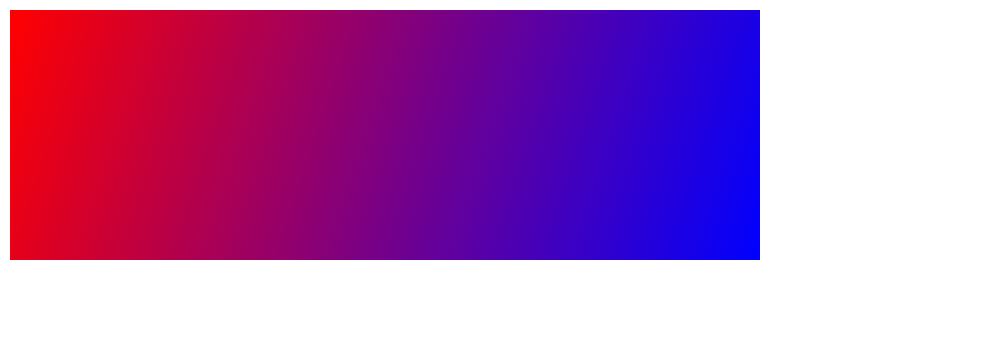

【使用透明度】

CSS3 渐变也支持透明度（transparent），可用于创建减弱变淡的效果。

为了添加透明度，我们使用 `rgba()` 函数来定义颜色节点。rgba() 函数中的最后一个参数可以是从 0 到 1 的值，它定义了颜色的透明度：0 表示完全透明，1 表示完全不透明。

下面的实例演示了从左边开始的线性渐变。起点是完全透明，慢慢过渡到完全不透明的红色：

```html
<!doctype html>
<html lang="en">

<head>
    <meta charset="UTF-8">
    <meta name="viewport" content="width=device-width, initial-scale=1.0">
    <meta http-equiv="X-UA-Compatible" content="ie=edge">
    <title>背景线性渐变</title>
    <style>
        div {
            width: 600px;
            height: 200px;
            /* 背景渐变必须添加浏览器私有前缀 */
            /* 前面的 red 为浏览器不支持时显示 */
            background: red -webkit-linear-gradient(left, rgba(0,0,255,.2), rgba(255,0,0,1));
        }
    </style>
</head>

<body>
<div></div>
</body>

</html>
```


**（2）径向渐变**

径向渐变由它的中心定义。

为了创建一个径向渐变，你也必须至少定义两种颜色节点。颜色节点即你想要呈现平稳过渡的颜色。同时，你也可以指定渐变的中心、形状（圆形或椭圆形）、大小。默认情况下，渐变的中心是 center（表示在中心点），渐变的形状是 ellipse（表示椭圆形），渐变的大小是 farthest-corner（表示到最远的角落）。

> 径向渐变不要加浏览器前缀！

**径向渐变 - 颜色节点均匀分布（默认情况下）**

```css
width: 300px;
height: 300px;
background: radial-gradient(red, green, blue);
```

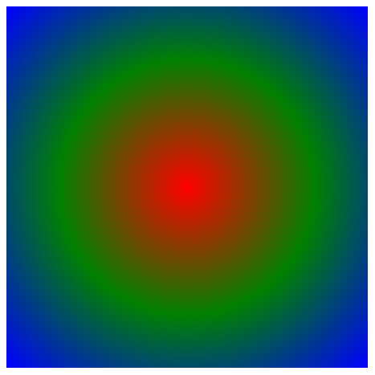

**径向渐变 - 颜色节点不均匀分布**

```css
width: 300px;
height: 300px;
background: radial-gradient(red 5%, green 15%, blue 60%);
```


**设置形状**

`shape` 参数定义了形状。它可以是值 `circle` 或 `ellipse`。其中，`circle` 表示圆形，`ellipse` 表示椭圆形。默认值是 `ellipse`。

```css
height: 150px;
width: 200px;
background: radial-gradient(red, yellow, green); 
background: radial-gradient(circle, red, yellow, green); 
```

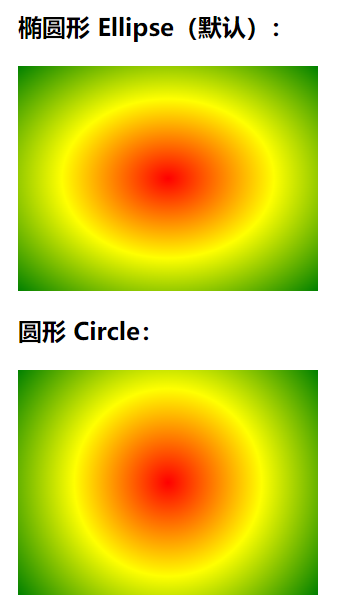

**不同尺寸大小关键字的使用**

`size` 参数定义了渐变的大小。它可以是以下四个值：

- `closest-side`
- `farthest-side`
- `closest-corner`
- `farthest-corner`

```html
<!doctype html>
<html>
<head>
<meta charset="utf-8"> 
<title></title> 
<style>
#grad1 {
  height: 150px;
  width: 150px;
  background-color: red; /* 浏览器不支持的时候显示 */
  background: radial-gradient(closest-side at 60% 55%, red, yellow, black); 
}

#grad2 {
  height: 150px;
  width: 150px;
  background-color: red; /* 浏览器不支持的时候显示 */
  background: radial-gradient(farthest-side at 60% 55%, red, yellow, black); 
}

#grad3 {
  height: 150px;
  width: 150px;
  background-color: red; /* 浏览器不支持的时候显示 */
  background: radial-gradient(closest-corner at 60% 55%, red, yellow, black);
}

#grad4 {
  height: 150px;
  width: 150px;
  background-color: red; /* 浏览器不支持的时候显示 */
  background: radial-gradient(farthest-corner at 60% 55%, red, yellow, black); 
}
</style>
</head>
<body>

<h3>径向渐变 - 不同尺寸大小关键字的使用</h3>

<p><strong>closest-side：</strong></p>
<div id="grad1"></div>

<p><strong>farthest-side：</strong></p>
<div id="grad2"></div>

<p><strong>closest-corner：</strong></p>
<div id="grad3"></div>

<p><strong>farthest-corner（默认）：</strong></p>
<div id="grad4"></div>

</body>
</html>
```


### 6.2.2 文字渐变

```html
<!doctype html>
<html lang="en">
<head>
    <meta charset="UTF-8">
    <title>Title</title>
    <style>
        p{
            font-size: 60px;
            background: linear-gradient(0deg,red,blue);
            background-clip:text;
            -webkit-background-clip: text;
            color: transparent;
        }
    </style>
</head>
<body>
<p>
    我是渐变文字
</p>
</body>
</html>
```


**核心内容说明**

background 属性：设置背景图片为线性渐变色。

background-clip 属性：规定背景的绘制区域（我们注意到该属性上的-webkit-，说明该属性还存在兼容问题，并不是所有浏览器都支持，在 W3C 是没有 text 这个值的，这里的 text 是背景被裁剪到文字）。


color 属性：设置文字颜色为透明，然后面的背景色显示出来。
