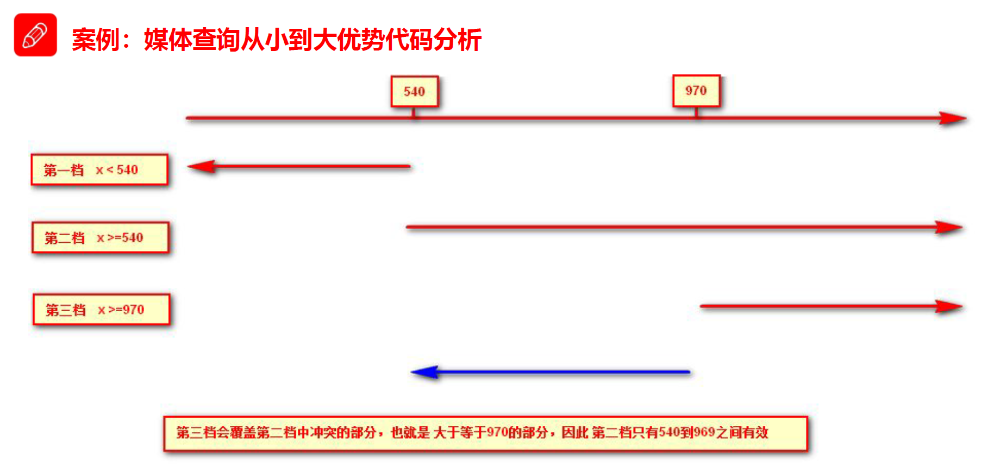
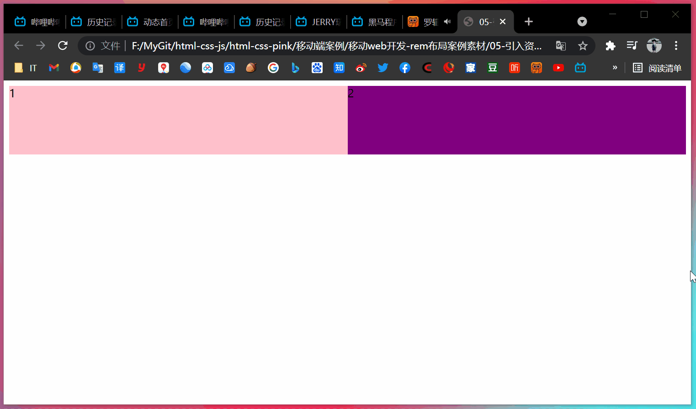
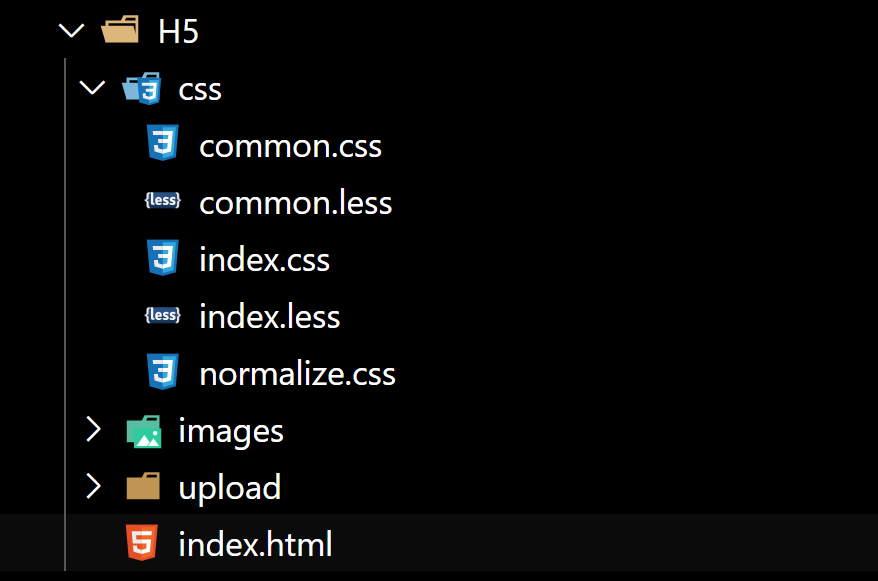
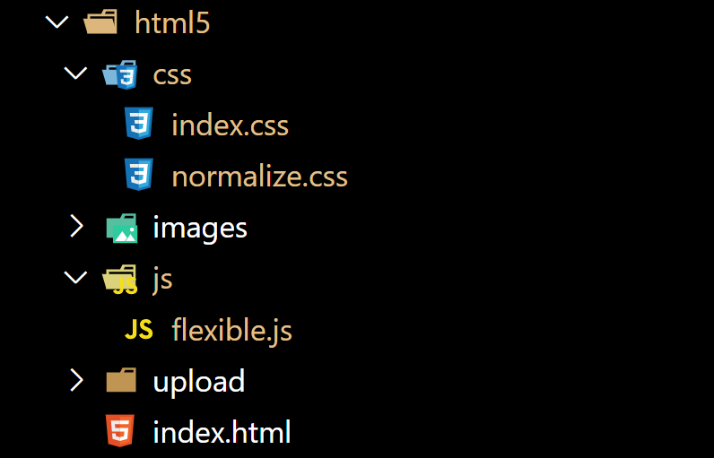

# 【移动Web开发之rem适配布局】

> 本学习笔记是个人对 Pink 老师课程的总结归纳，转载请注明出处！

【思考】

1. 页面布局文字能否随着屏幕大小变化而变化？
2. 流式布局和 flex 布局主要针对于宽度布局，那高度如何设置？
3. 怎么样让屏幕发生变化的时候元素高度和宽度等比例缩放？

# 一、rem单位 

## 1.1 rem 单位

`rem`（root em）是一个相对单位，类似于 `em`，em 是父元素字体大小。

不同的是 rem 的基准是**相对于 html 元素的字体大小**。

比如，根元素（html）设置 `font-size=12px`，非根元素设置 `width: 2rem;` 则换成 px 表示就是 24px。

rem 的优势：父元素文字大小可能不一致，但是整个页面只有一个 `html`，可以很好来控制整个页面的元素大小。（即：达到统一控制全局字体大小的效果！）

> 注意：rem 控制的不仅仅是字体大小，还能控制其他元素的大小。

```css
/* 根 html 为 12px */
html {
    font-size: 12px;
}
/* 此时 div 的字体大小就是 24px */
div {
    font-size: 2rem；
}
```

【案例】

```html
<!DOCTYPE html>
<html lang="en">

<head>
    <meta charset="UTF-8">
    <meta name="viewport" content="width=device-width, initial-scale=1.0">
    <meta http-equiv="X-UA-Compatible" content="ie=edge">
    <title>01-rem单位</title>
    <style>
        html {
            font-size: 12px;
        }

        div {
            font-size: 12px;
            width: 15rem;
            height: 15rem;
            background-color: purple;
        }

        p {
            /* 1. em 相对于父元素的字体大小来说的 */
            /* 
            width: 10em;
            height: 10em;
            */
            /* 2. rem 相对于 html 元素字体大小来说的 */
            width: 10rem;
            height: 10rem;
            background-color: pink;
            /* 3.rem 的优点就是可以通过修改 html 里面的文字大小来改变页面中元素的大小可以整体控制 */
        }
    </style>
</head>

<body>
    <div>
        <p></p>
    </div>
</body>

</html>
```

注：虽然使用 rem 之后实现了全局字体大小的统一控制，但是依旧不能根据窗口大小自动适配，所以我们还要学习媒体查询。

# 二、媒体查询

## 2.1 什么是媒体查询

媒体查询（Media Query）是 CSS3 新语法。

- 使用 `@media` 查询，可以争对不同的媒体类型定义不同的样式
- `@media` 可以争对不同的屏幕尺寸设置不同的样式
- 当你重置浏览器大小的过程中，页面也会根据浏览器的宽度和高度重新渲染页面
- 目前针对很多苹果手机、Android 手机、平板等设备都用得到媒体查询

## 2.2 语法规范

```css
@media mediatype and|not|only (media feature) {
    CSS-Code;
}
```

- 用 @media 开头 注意 `@` 符号
- mediatype 媒体类型
- 关键字 and not only
- media feature 媒体特性 必须有小括号包含

### 2.2.1 mediatype 查询类型

将不同的终端设备划分成不同的类型，称为媒体类型

| 值      | 解释说明                           |
| ------- | ---------------------------------- |
| `all`   | 用于所有设备                       |
| `print` | 用于打印机和打印预览               |
| `scree` | 用于电脑屏幕、平板电脑、智能手机等 |

### 2.2.2 关键字

关键字将媒体类型或多个媒体特性连接到一起做为媒体查询的条件。

- and：可以将多个媒体特性连接到一起，相当于 “且” 的意思。
- not：排除某个媒体类型，相当于“非”的意思，可以省略。
- only：指定某个特定的媒体类型，可以省略。

### 2.2.3 媒体特性

每种媒体类型都具有各自不同的特性，根据不同媒体类型的媒体特性设置不同的展示风格。我们暂且了解三个。注意他们要加小括号包含。

| 值          | 解释说明                           |
| ----------- | ---------------------------------- |
| `width`     | 定义输出设备中页面可见区域的宽度   |
| `min-width` | 定义输出设备中页面最小可见区域宽度 |
| `max-width` | 定义输出设备中页面最大可见区域宽度 |

【案例】

根据页面宽度改变背景颜色。

实现思路：

- 按照 从大到小 的或者 从小到大 的思路
- 注意我们有最大值 `max-width` 和最小值 `min-width` 都是包含等于的
- 当屏幕小于 540 像素，背景颜色变为蓝色（x <= 539）
- 当屏幕大于等于 540 像素并且小于等于 969 像素的时候背景颜色为绿色（540 <= x <= 969）
- 当屏幕大于等于 970 像素的时候，背景颜色为红色（x >= 970）

注意：为了防止混乱，媒体查询我们要按照从小到大或者从大到小的顺序来写，但是我们最喜欢的还是从小到大来写，这样代码更简洁。

举例：

```html
<!DOCTYPE html>
<html lang="en">

<head>
    <meta charset="UTF-8">
    <meta name="viewport" content="width=device-width, initial-scale=1.0">
    <meta http-equiv="X-UA-Compatible" content="ie=edge">
    <title>03-媒体查询案例修改背景颜色</title>
    <style>
        /* 1. 媒体查询一般按照从大到小或者从小到大的顺序来 */
        /* 2. 小于 540px 页面的背景颜色变为蓝色 */
        @media screen and (max-width: 539px) {
            body {
                background-color: blue;
            }
        }

        /* 3. 540 ~ 970 我们的页面颜色改为绿色 */
        /* @media screen and (min-width: 540px) and (max-width: 969px) {
            body {
                background-color: green;
            }
        } */
        /* 从小到大（层叠性） */
        @media screen and (min-width: 540px) {
            body {
                background-color: green;
            }
        }

        /* 4. 大于等于 970px 我们页面的颜色改为红色 */
        @media screen and (min-width: 970px) {
            body {
                background-color: red;
            }
        }

        /* 5. screen 还有 and 必须带上不能省略的 */
        /* 6. 我们的数字后面必须跟单位 970px 这个 px 不能省略的 */
    </style>
</head>

<body>

</body>

</html>
```

效果图：


媒体查询从小到大优势代码分析：



## 2.3 媒体查询+rem实现元素动态大小变化

`rem` 单位是跟着 html 来走的，有了 rem 页面元素可以设置不同大小尺寸。

媒体查询可以根据不同设备宽度来修改样式。

`媒体查询 + rem` 就可以实现不同设备宽度，实现页面元素大小的动态变化。

【案例】

```html
<!DOCTYPE html>
<html lang="en">

<head>
    <meta charset="UTF-8">
    <meta name="viewport" content="width=device-width, initial-scale=1.0">
    <meta http-equiv="X-UA-Compatible" content="ie=edge">
    <title>04-媒体查询+rem实现元素动态变化</title>
    <style>
        * {
            margin: 0;
            padding: 0;
        }

        /* html {
            font-size: 100px;
        } */
        /* 从小到大的顺序 */

        @media screen and (min-width: 320px) {
            html {
                font-size: 50px;
            }
        }

        @media screen and (min-width: 640px) {
            html {
                font-size: 100px;
            }
        }

        .top {
            height: 1rem;
            font-size: .5rem;
            background-color: green;
            color: #fff;
            text-align: center;
            line-height: 1rem;
        }
    </style>
</head>

<body>
    <div class="top">购物车</div>
</body>

</html>
```


## 2.4 引入资源（理解）

当样式比较繁多的时候，我们可以针对不同的媒体使用不同 stylesheet（样式表）。

> 比如：从 PC 端样式变移动端样式时，最好分开写样式表

原理，就是直接在 link 中判断设备的设备的尺寸，然后引用不同的 CSS 文件。

（1）语法规范

```html
<link rel="stylesheet" media="mediatype and|not|only (media feature)" href="mystylesheet.css">
```

（2）实例

```html
<link rel="stylesheet" media="screen and (min-width: 400px)" href="styleA.css">
```

【案例】

- html

```html
<!DOCTYPE html>
<html lang="en">

<head>
    <meta charset="UTF-8">
    <meta name="viewport" content="width=device-width, initial-scale=1.0">
    <meta http-equiv="X-UA-Compatible" content="ie=edge">
    <title>05-引入资源</title>
    <style>
        /* 当我们屏幕大于等于 640px 以上的，我们让 div 一行显示 2 个 */
        /* 当我们屏幕小于 640px 我们让 div 一行显示一个 */
        /* 一个建议：我们媒体查询最好的方法是从小到大 */
        /* 引入资源就是针对于不同的屏幕尺寸调用不同的 css 文件 */
    </style>
    <link rel="stylesheet" href="style320.css" media="screen and (min-width: 320px)">
    <link rel="stylesheet" href="style640.css" media="screen and (min-width: 640px)">
</head>

<body>
    <div>1</div>
    <div>2</div>
</body>

</html>
```

- style320.css

```css
div {
  width: 100%;
  height: 100px;
}

div:nth-child(1) {
  background-color: pink;
}

div:nth-child(2) {
  background-color: purple;
}
```

- style640.css

```css
div {
  float: left;
  width: 50%;
  height: 100px;
}

div:nth-child(1) {
  background-color: pink;
}

div:nth-child(2) {
  background-color: purple;
}
```

- 效果



# 三、Less基础

## 3.1 维护CSS的弊端

CSS 是一门非程序式语言，没有变量、函数、SCOPE（作用域）等概念。

- CSS 需要书写大量看似没有逻辑的代码，CSS 冗余度是比较高的
- 不方便维护及扩展，不利于复用
- CSS 没有很好的计算能力
- 非前端开发工程师来讲，往往会因为缺少 CSS 编写经验而很难写出组织良好且易于维护的 CSS 代码项目

## 3.2 Less介绍

Less（Leaner Style Sheets 的缩写）是一门 CSS 扩展语言，也称为 CSS 预处理器。

做为 CSS 的一种形式的扩展，它并没有减少 CSS 的功能，而是在现有的 CSS 语法上，为 CSS 加入程序式语言的特性。

它在 CSS 的语法基础上，引入了变量，Mixin（混入），运算以及函数等功能，大大简化了 CSS 的编写，并且降低了 CSS 的维护成本，就像它的名称所说的那样，Less 可以让我们用更少的代码做更多的事情。

Less 中文网址：http://lesscss.cn/

常见的 CSS 预处理器：Sass、Less、Stylus

一句话：Less 是一门 CSS 预处理语言，它扩展了 CSS 的动态特性。

## 3.3 Less安装（注意如果使用VSCode无需安装Less）

1. 安装 node.js，可选择版本（8.0），网址：http://nodejs.cn/download/
2. 检查是否安装成功，使用 cmd 命令输入 `node -v` 查看版本即可
3. 基于 node.js 在线安装 Less，使用 cmd 命令输入 `npm install -g less` 即可
4. 检查是否安装成功，使用 cmd 命令 `lessc -v` 查看版本即可

【Less 使用】

我们首先新建一个后缀为 `.less` 的文件，在这个文件里面书写 less 语句

- Less 变量
- Less 编译
- Less 嵌套
- Less 运算

## 3.4 Less变量

变量是指没有固定值，可以改变的。因为我们 CSS 中的一些颜色和数值等经常使用。

`@变量名: 值;`

### 3.4.1 变量命名规范

- 必须有 `@` 为前缀
- 不能包含特殊字符
- 不能以数字开头
- 大小写敏感

`@color: pink;`

### 3.4.2 变量使用规范

```less
// 直接使用
body {
    color: @color;
}

a:hover {
    color: @color;
}
```

## 3.5 Less编译

本质上，Less 包含一套自定义的语法及一个解析器，用户根据这些语法定义自己的样式规则，这些规则最终会通过解析器，编译生成对应的 CSS 文件。

所以，我们需要把我们的 Less 文件，编译生成为 CSS 文件，这样我们的 HTML 页面才能使用。

【VSCode Less 插件】

`Easy LESS` 插件用来把 less 文件编译为 css 文件。

安装完毕插件，重新加载下 VSCode。只要保存一下 less 文件，会自动生成 CSS 文件。

## 3.6 Less嵌套

【我们经常用到选择器的嵌套】

```css
#header .logo {
    width: 300px;
}
```

【less 嵌套写法】

```less
#header {
    .logo {
        width: 300px;
    }
}
```

如果遇见（交集 | 伪类 | 伪元素选择器）

- 内层选择器的前面没有 `&` 符号，则它被解析为父选择器的后代
- 如果有 `&` 符号，它就被解析为父元素自身或父元素的伪类

```css
a:hover {
    color: red;
}
```

【less 嵌套写法】

```less
a {
    &:hover {
        color: red;
    }
}
```

## 3.7 Less运算

任何数字、颜色或者变量都可以参与运算。就是 Less 提供了加（+）、减（-）、乘（*）、除（/）算术运算。

```less
/* Less 里面写 */
@width: 10px + 5;

div {
    border: @width solid red;
}

/* Less 甚至还可以这样 */
width: (@width + 5) * 2;
```

【生成的 css】

```css
div {
    border: 15px solid red;
}
```

注意：

- 乘号（*）和除号（/）的写法要牢记
- 运算符中间左右必须有个空格隔开 `1px + 5`
- 在新版本的 Less 中，除法有变动，应将 `100px / 10` 改为 `(100px / 10)`，否则没有效果
- 对于两个不同的单位的值之间的运算，运算结果的值取第一个值的单位
- 如果两个值之间只有一个值有单位，则运算结果就取该单位

【案例】

- my.less

```less
// 定义一个粉色的变量
@color: pink;
// 错误的变量名 @1color @color~@#
// 变量名区分大小写 @color 和 @Color 是两个不同的变量
// 定义了一个字体为 14 像素的变量
@font14: 14px;

body {
  background-color: @color;
}

div {
  color: @color;
  font-size: @font14;
}

a {
  font-size: @font14;
}
```

- 编译后得到的 my.css

```css
body {
  background-color: pink;
}

div {
  color: pink;
  font-size: 14px;
}

a {
  font-size: 14px;
}
```

- nest.less

```less
.header {
  width: 200px;
  height: 200px;
  background-color: pink;

  // 1. less嵌套 子元素的样式直接写到父元素里面就好了
  a {
    color: red;

    // 2. 如果有伪类、交集选择器、伪元素选择器 我们内层选择器的前面需要加 &
    &:hover {
      color: blue;
    }
  }
}

.nav {
  .logo {
    color: green;
  }

  &::before {
    content: "";
  }
}
```

- 编译得到的 nest.css

```css
.header {
  width: 200px;
  height: 200px;
  background-color: pink;
}

.header a {
  color: red;
}

.header a:hover {
  color: blue;
}

.nav .logo {
  color: green;
}

.nav::before {
  content: "";
}
```

- count.less

```less
@baseFont: 50px;

html {
  font-size: @baseFont;
}

@border: 5px + 5;

div {
  width: 200px - 50;
  height: (200px + 50px) * 2;
  border: @border solid red;
  background-color: #666 - #222;
}

img {
  width: 82rem / @baseFont;
  height: 82rem / @baseFont;
}

// 1. 我们运算符的左右两侧必须敲一个空格隔开
// 2. 两个数参与运算，如果只有一个数有单位，则最后的结果就以这个单位为准
// 3. 两个数参与运算，如果两个数都有单位，而且不一样的单位，最后的结果以第一个单位为准
```

- 编译后得到的 count.css

```css
html {
  font-size: 50px;
}

div {
  width: 150px;
  height: 500px;
  border: 10px solid red;
  background-color: #444444;
}

img {
  width: 82rem / 50px;
  height: 82rem / 50px;
}
```

# 四、rem适配方案

【思考】

1. 我们适配的目标是什么？
2. 怎么去达到这个目标的？
3. 在实际的开发如何实现？

【答案】

1. 让一些不能等比自适应的元素，达到当设备尺寸发生改变的时候，等比例适配当前设备。
2. 使用媒体查询根据不同的设备按比例设置 html 的字体大小，然后页面元素使用 rem 做尺寸单位，当 html 做尺寸单位，当 html 字体大小变化元素尺寸也会发生变化，从而达到等比缩放的适配。

## 4.1 rem实际开发适配方案

（1）按照设计稿与设备宽度的比例，动态计算并设置 html 根标签的 font-size 大小（媒体查询）。

（2）CSS 中，设计稿元素的宽、高、相对位置等取值，按照同等比例换算为 rem 为单位的值。


## 4.2 rem适配方案技术使用（市场主流）

（1）技术方案1

- less
- 媒体查询
- rem

（2）技术方案2

- flexible.js
- rem

总结：

1. 两种方案的底层原理都是一样的
2. 两种方案目前都在使用
3. 方案2 更简单，现阶段大家无需了解里面的 js 代码

## 4.3 rem实际开发适配方案1

rem + 媒体查询 + less

**（1）设计稿常见尺寸宽度**

| 设备           | 常见宽度                                                     |
| -------------- | ------------------------------------------------------------ |
| iphone 4 5     | 640px                                                        |
| iphone 6 7 8   | 750px                                                        |
| iphone x 11 12 | 1170px                                                       |
| Android        | 常见 320px、360px、375px、384px、400px、414px、500px、720px、1080px |

一般情况下，我们以一套或两套效果图适应大部分的屏幕，放弃极端屏或对其优雅降级，牺牲一些效果，现在基本以 750px 为准。（目前应该是 1080px 2021年）

**（2）动态设置 html 标签 font-size 大小**

1. 假设设计稿是 750px
2. 假设我们把整个屏幕划分为 15 等份（划分标准不一，可以是 20 份，也可以是 10 等份）
3. 每一份作为 html 字体大小，这里就是 750/15 = 50px
4. 那么在 320px 设备的时候，字体大小为 320/15 = 21.33px
5. 用我们页面元素的大小除以不同的 html 字体大小会发现他们比例还是相同的
6. 比如我们以 750px 设计稿
7. 此时便实现了不同屏幕下页面元素盒子等比例缩放的效果

**（3）元素大小取值方法**

1. 最后的公式：`页面元素的 rem 值 = 页面元素值（px） / （屏幕跨度 / 划分份数）`
2. `屏幕宽度 / 划分份数 = html font-size 的大小`
3. 或者：`页面元素的 rem 值 = 页面元素值（px） / html font-size 字体大小`

【案例】

```html
<!DOCTYPE html>
<html lang="en">

<head>
    <meta charset="UTF-8">
    <meta name="viewport" content="width=device-width, initial-scale=1.0">
    <meta http-equiv="X-UA-Compatible" content="ie=edge">
    <title>10-rem适配方案</title>
    <style>
        @media screen and (min-width: 320px) {
            html {
                font-size: 21.33px;
            }
        }

        @media screen and (min-width: 750px) {
            html {
                font-size: 50px;
            }
        }

        div {
            width: 2rem;
            height: 2rem;
            background-color: pink;
        }

        /* 1. 首先我们选一套标准尺寸 750px 为准 
           2. 我们用屏幕尺寸 除以 我们划分的份数 得到了 html 里面的文字大小 但是我们知道不同屏幕下得到的文字大小是不一样的 */
        /* 3. 页面元素的 rem值 =  页面元素在 750 像素的下px值 / html 里面的文字大小 */
    </style>
</head>

<body>
    <div></div>
</body>

</html>
```


# 五、苏宁网首页案例制作

【案例：苏宁网移动端首页】

访问地址：https://m.suning.com/

【技术选型】

方案：我们采取单独制作移动页面方案

技术：布局采取 rem 适配布局（less + rem + 媒体查询）

设计图：本设计图采用 750px 设计尺寸

【搭建相关文件夹结构】



【设置视口标签以及引入初始化样式】

```html
<meta name="viewport" content="width=device-width, user-scalable=no,
initial-scale=1.0, maximum-scale=1.0, minimum-scale=1.0">
<link rel="stylesheet" href="css/normalize.css">
```

【设置公共 common.less 文件】

1. 新建 common.less 设置好最常见的屏幕尺寸，利用媒体查询设置不同的 html 字体大小，因为除了首页其他页面也需要
2. 我们关心的尺寸有 320px、360px、375px、384px、400px、414px、424px、480px、540px、720px、750px、1080px
3. 划分的份数我们定位 15 等份
4. 因为我们 PC 端也可以打开我们苏宁移动端首页，我们默认 html 字体大小为 50px（注意这句话写到最上面）

【新建 index.less 文件】

1. 新建 index.less，这里面写首页的样式

2. 将刚才设置好的 common.less 引入到 index.less 里面，语法如下：

   ```less
   // 在 index.less 中导入 common.less 文件
   @inport "common";
   ```

3. 生成 index.css 引入到 index.html 里面

【body 样式】

```css
body {
	min-width: 320px;
	width: 15rem;
	margin: 0 auto;
	line-height: 1.5;
	font-family: Arial, Helvetica;
	background: #F2F2F2;
}
```

【案例代码】

- common.less

```less
// 设置常见的屏幕尺寸 修改里面的html文字大小
a {
    text-decoration: none;
}

// 一定要写到最上面
html {
    font-size: 50px;
}

// 我们此次定义的划分的份数 为 15
@no: 15;

// 320
@media screen and (min-width: 320px) {
    html {
        font-size: (320px / @no);
    }
}

// 360
@media screen and (min-width: 360px) {
    html {
        font-size: (360px / @no);
    }
}

// 375 iphone 678
@media screen and (min-width: 375px) {
    html {
        font-size: (375px / @no);
    }
}

// 384
@media screen and (min-width: 384px) {
    html {
        font-size: (384px / @no);
    }
}

// 400
@media screen and (min-width: 400px) {
    html {
        font-size: (400px / @no);
    }
}

// 414
@media screen and (min-width: 414px) {
    html {
        font-size: (414px / @no);
    }
}

// 424
@media screen and (min-width: 424px) {
    html {
        font-size: (424px / @no);
    }
}

// 480
@media screen and (min-width: 480px) {
    html {
        font-size: (480px / @no);
    }
}

// 540
@media screen and (min-width: 540px) {
    html {
        font-size: (540px / @no);
    }
}

// 720
@media screen and (min-width: 720px) {
    html {
        font-size: (720px / @no);
    }
}

// 750
@media screen and (min-width: 750px) {
    html {
        font-size: (750px / @no);
    }
}
```

- index.less

```less
// 首页的样式less文件
@import "common";

// @import 导入的意思 可以把一个样式文件导入到另外一个样式文件里面
// link 是把一个 样式文件引入到 html页面里面
body {
    min-width: 320px;
    width: 15rem;
    margin: 0 auto;
    line-height: 1.5;
    font-family: Arial, Helvetica;
    background: #F2F2F2;
}

// 页面元素rem计算公式： 页面元素的px / html 字体大小 50
// search-content
@baseFont: 50;

.search-content {
    display: flex;
    position: fixed;
    top: 0;
    left: 50%;
    transform: translateX(-50%);
    width: 15rem;
    height: (88rem / @baseFont);
    background-color: #FFC001;

    .classify {
        width: (44rem / @baseFont);
        height: (70rem / @baseFont);
        margin: (11rem / @baseFont) (25rem / @baseFont) (7rem / @baseFont) (24rem / @baseFont);
        background: url(../images/classify.png) no-repeat;
        // 背景缩放
        background-size: (44rem / @baseFont) (70rem / @baseFont);
    }

    .search {
        flex: 1;

        input {
            outline: none;
            width: 100%;
            border: 0;
            height: (66rem / @baseFont);
            border-radius: (33rem / @baseFont);
            background-color: #FFF2CC;
            margin-top: (12rem / @baseFont);
            font-size: (25rem / @baseFont);
            padding-left: (55rem / @baseFont);
            color: #757575;
        }
    }

    .login {
        width: (75rem / @baseFont);
        height: (70rem / @baseFont);
        line-height: (70rem / @baseFont);
        margin: (10rem / @baseFont);
        font-size: (25rem / @baseFont);
        text-align: center;
        color: #fff;
    }
}

// banner
.banner {
    width: (750rem / @baseFont);
    height: (368rem / @baseFont);

    img {
        width: 100%;
        height: 100%;
    }
}

// ad
.ad {
    display: flex;

    a {
        flex: 1;

        img {
            width: 100%;
        }
    }
}

// nav
nav {
    width: (750rem / @baseFont);

    a {
        float: left;
        width: (150rem / @baseFont);
        height: (140rem / @baseFont);
        text-align: center;

        img {
            display: block;
            width: (82rem / @baseFont);
            height: (82rem / @baseFont);
            margin: (10rem / @baseFont) auto 0;
        }

        span {
            font-size: (25rem / @baseFont);
            color: #333;
        }
    }
}
```

- normalize.css

```css
/*! normalize.css v5.0.0 | MIT License | github.com/necolas/normalize.css */

/**
 * 1. Change the default font family in all browsers (opinionated).
 * 2. Correct the line height in all browsers.
 * 3. Prevent adjustments of font size after orientation changes in
 *    IE on Windows Phone and in iOS.
 */

/* Document
   ========================================================================== */

html {
  font-family: sans-serif;
  /* 1 */
  line-height: 1.15;
  /* 2 */
  -ms-text-size-adjust: 100%;
  /* 3 */
  -webkit-text-size-adjust: 100%;
  /* 3 */
}

/* Sections
   ========================================================================== */

/**
 * Remove the margin in all browsers (opinionated).
 */

body {
  margin: 0;
}

/**
 * Add the correct display in IE 9-.
 */

article,
aside,
footer,
header,
nav,
section {
  display: block;
}

/**
 * Correct the font size and margin on `h1` elements within `section` and
 * `article` contexts in Chrome, Firefox, and Safari.
 */

h1 {
  font-size: 2em;
  margin: 0.67em 0;
}

/* Grouping content
   ========================================================================== */

/**
 * Add the correct display in IE 9-.
 * 1. Add the correct display in IE.
 */

figcaption,
figure,
main {
  /* 1 */
  display: block;
}

/**
 * Add the correct margin in IE 8.
 */

figure {
  margin: 1em 40px;
}

/**
 * 1. Add the correct box sizing in Firefox.
 * 2. Show the overflow in Edge and IE.
 */

hr {
  box-sizing: content-box;
  /* 1 */
  height: 0;
  /* 1 */
  overflow: visible;
  /* 2 */
}

/**
 * 1. Correct the inheritance and scaling of font size in all browsers.
 * 2. Correct the odd `em` font sizing in all browsers.
 */

pre {
  font-family: monospace, monospace;
  /* 1 */
  font-size: 1em;
  /* 2 */
}

/* Text-level semantics
   ========================================================================== */

/**
 * 1. Remove the gray background on active links in IE 10.
 * 2. Remove gaps in links underline in iOS 8+ and Safari 8+.
 */

a {
  background-color: transparent;
  /* 1 */
  -webkit-text-decoration-skip: objects;
  /* 2 */
}

/**
 * Remove the outline on focused links when they are also active or hovered
 * in all browsers (opinionated).
 */

a:active,
a:hover {
  outline-width: 0;
}

/**
 * 1. Remove the bottom border in Firefox 39-.
 * 2. Add the correct text decoration in Chrome, Edge, IE, Opera, and Safari.
 */

abbr[title] {
  border-bottom: none;
  /* 1 */
  text-decoration: underline;
  /* 2 */
  text-decoration: underline dotted;
  /* 2 */
}

/**
 * Prevent the duplicate application of `bolder` by the next rule in Safari 6.
 */

b,
strong {
  font-weight: inherit;
}

/**
 * Add the correct font weight in Chrome, Edge, and Safari.
 */

b,
strong {
  font-weight: bolder;
}

/**
 * 1. Correct the inheritance and scaling of font size in all browsers.
 * 2. Correct the odd `em` font sizing in all browsers.
 */

code,
kbd,
samp {
  font-family: monospace, monospace;
  /* 1 */
  font-size: 1em;
  /* 2 */
}

/**
 * Add the correct font style in Android 4.3-.
 */

dfn {
  font-style: italic;
}

/**
 * Add the correct background and color in IE 9-.
 */

mark {
  background-color: #ff0;
  color: #000;
}

/**
 * Add the correct font size in all browsers.
 */

small {
  font-size: 80%;
}

/**
 * Prevent `sub` and `sup` elements from affecting the line height in
 * all browsers.
 */

sub,
sup {
  font-size: 75%;
  line-height: 0;
  position: relative;
  vertical-align: baseline;
}

sub {
  bottom: -0.25em;
}

sup {
  top: -0.5em;
}

/* Embedded content
   ========================================================================== */

/**
 * Add the correct display in IE 9-.
 */

audio,
video {
  display: inline-block;
}

/**
 * Add the correct display in iOS 4-7.
 */

audio:not([controls]) {
  display: none;
  height: 0;
}

/**
 * Remove the border on images inside links in IE 10-.
 */

img {
  border-style: none;
}

/**
 * Hide the overflow in IE.
 */

svg:not(:root) {
  overflow: hidden;
}

/* Forms
   ========================================================================== */

/**
 * 1. Change the font styles in all browsers (opinionated).
 * 2. Remove the margin in Firefox and Safari.
 */

button,
input,
optgroup,
select,
textarea {
  font-family: sans-serif;
  /* 1 */
  font-size: 100%;
  /* 1 */
  line-height: 1.15;
  /* 1 */
  margin: 0;
  /* 2 */
}

/**
 * Show the overflow in IE.
 * 1. Show the overflow in Edge.
 */

button,
input {
  /* 1 */
  overflow: visible;
}

/**
 * Remove the inheritance of text transform in Edge, Firefox, and IE.
 * 1. Remove the inheritance of text transform in Firefox.
 */

button,
select {
  /* 1 */
  text-transform: none;
}

/**
 * 1. Prevent a WebKit bug where (2) destroys native `audio` and `video`
 *    controls in Android 4.
 * 2. Correct the inability to style clickable types in iOS and Safari.
 */

button,
html [type="button"],
/* 1 */
[type="reset"],
[type="submit"] {
  -webkit-appearance: button;
  /* 2 */
}

/**
 * Remove the inner border and padding in Firefox.
 */

button::-moz-focus-inner,
[type="button"]::-moz-focus-inner,
[type="reset"]::-moz-focus-inner,
[type="submit"]::-moz-focus-inner {
  border-style: none;
  padding: 0;
}

/**
 * Restore the focus styles unset by the previous rule.
 */

button:-moz-focusring,
[type="button"]:-moz-focusring,
[type="reset"]:-moz-focusring,
[type="submit"]:-moz-focusring {
  outline: 1px dotted ButtonText;
}

/**
 * Change the border, margin, and padding in all browsers (opinionated).
 */

fieldset {
  border: 1px solid #c0c0c0;
  margin: 0 2px;
  padding: 0.35em 0.625em 0.75em;
}

/**
 * 1. Correct the text wrapping in Edge and IE.
 * 2. Correct the color inheritance from `fieldset` elements in IE.
 * 3. Remove the padding so developers are not caught out when they zero out
 *    `fieldset` elements in all browsers.
 */

legend {
  box-sizing: border-box;
  /* 1 */
  color: inherit;
  /* 2 */
  display: table;
  /* 1 */
  max-width: 100%;
  /* 1 */
  padding: 0;
  /* 3 */
  white-space: normal;
  /* 1 */
}

/**
 * 1. Add the correct display in IE 9-.
 * 2. Add the correct vertical alignment in Chrome, Firefox, and Opera.
 */

progress {
  display: inline-block;
  /* 1 */
  vertical-align: baseline;
  /* 2 */
}

/**
 * Remove the default vertical scrollbar in IE.
 */

textarea {
  overflow: auto;
}

/**
 * 1. Add the correct box sizing in IE 10-.
 * 2. Remove the padding in IE 10-.
 */

[type="checkbox"],
[type="radio"] {
  box-sizing: border-box;
  /* 1 */
  padding: 0;
  /* 2 */
}

/**
 * Correct the cursor style of increment and decrement buttons in Chrome.
 */

[type="number"]::-webkit-inner-spin-button,
[type="number"]::-webkit-outer-spin-button {
  height: auto;
}

/**
 * 1. Correct the odd appearance in Chrome and Safari.
 * 2. Correct the outline style in Safari.
 */

[type="search"] {
  -webkit-appearance: textfield;
  /* 1 */
  outline-offset: -2px;
  /* 2 */
}

/**
 * Remove the inner padding and cancel buttons in Chrome and Safari on macOS.
 */

[type="search"]::-webkit-search-cancel-button,
[type="search"]::-webkit-search-decoration {
  -webkit-appearance: none;
}

/**
 * 1. Correct the inability to style clickable types in iOS and Safari.
 * 2. Change font properties to `inherit` in Safari.
 */

::-webkit-file-upload-button {
  -webkit-appearance: button;
  /* 1 */
  font: inherit;
  /* 2 */
}

/* Interactive
   ========================================================================== */

/*
 * Add the correct display in IE 9-.
 * 1. Add the correct display in Edge, IE, and Firefox.
 */

details,
/* 1 */
menu {
  display: block;
}

/*
 * Add the correct display in all browsers.
 */

summary {
  display: list-item;
}

/* Scripting
   ========================================================================== */

/**
 * Add the correct display in IE 9-.
 */

canvas {
  display: inline-block;
}

/**
 * Add the correct display in IE.
 */

template {
  display: none;
}

/* Hidden
   ========================================================================== */

/**
 * Add the correct display in IE 10-.
 */

[hidden] {
  display: none;
}
```

- index.html

```html
<!DOCTYPE html>
<html lang="en">

<head>
    <meta charset="UTF-8">
    <meta name="viewport" content="width=device-width, initial-scale=1.0, maximum-scale=1.0, user-scalable=0" />
    <meta http-equiv="X-UA-Compatible" content="ie=edge">
    <link rel="stylesheet" href="css/normalize.css">
    <link rel="stylesheet" href="css/index.css">
    <title>Document</title>
</head>

<body>
    <!-- 顶部搜索框 -->
    <div class="search-content">
        <a href="#" class="classify"></a>
        <div class="search">
            <form action="">
                <input type="search" value="厨卫保暖季 哒哒哒">
            </form>
        </div>
        <a href="#" class="login">登录</a>
    </div>
    <!-- banner部分 -->
    <div class="banner">
        
    </div>
    <!-- 广告部分 -->
    <div class="ad">
        <a href="#"></a>
        <a href="#"></a>
        <a href="#"></a>
    </div>
    <!-- nav模块 -->
    <nav>
        <a href="#">
            
            <span>爆款手机</span>
        </a>
        <a href="#">
            
            <span>爆款手机</span>
        </a>
        <a href="#">
            
            <span>爆款手机</span>
        </a>
        <a href="#">
            
            <span>爆款手机</span>
        </a>
        <a href="#">
            
            <span>爆款手机</span>
        </a>
        <a href="#">
            
            <span>爆款手机</span>
        </a>
        <a href="#">
            
            <span>爆款手机</span>
        </a>
        <a href="#">
            
            <span>爆款手机</span>
        </a>
        <a href="#">
            
            <span>爆款手机</span>
        </a>
        <a href="#">
            
            <span>爆款手机</span>
        </a>

    </nav>
</body>

</html>
```

- 效果图


# 六、rem适配方案2

## 6.1 简洁高效的rem适配方案flexible.js

手机淘宝团队出的简洁高效的移动端适配库

我们再也不需要在写不同屏幕的媒体查询，因为里面 js 做了处理

它的原理是把当前设备划分为 10 等份，但是不同设备下，比例还是一致的

我们要做的，就是确定好我们当前设备的 html 文字大小就可以了

比如当前设计稿是 750px，那么我们只需要把 html 文字大小设置为 75px（750 / 10）就可以

里面页面元素 rem 值：页面元素的 px 值 / 75

剩余的，让 flexible.js 来去算

github 地址：https://github.com/amfe/lib-flexible/

## 6.2 使用适配方案2制作苏宁移动端首页

【技术选型】

方案：我们采取单独制作移动页面方案

技术：布局采取 rem 适配布局2（flexible.js + rem）

设计图：本设计图采用 750px 设计尺寸

【搭建相关文件夹结构】



【设置视口标签以及引入初始化样式还有 js 文件】

```html
<meta name="viewport" content="width=device-width, user-scalable=no,
initial-scale=1.0, maximum-scale=1.0, minimum-scale=1.0">
<link rel="stylesheet" href="css/normalize.css">
<link rel="stylesheet" href="css/index.css">
```

【我们页面需要引入这个 js 文件】

```html
<!-- 在 index.html 中 引入 flexible.js 这个文件 -->
<script src=“js/flexible.js”> </script>
```

【body 样式】

```css
body {
	min-width: 320px;
    max-width: 750px;
    /* flexible 给我们划分了 10 等份 */
	width: 10rem;
	margin: 0 auto;
	line-height: 1.5;
	font-family: Arial,Helvetica;
	background: #F2F2F2;
}
```

【VSCode px 转 rem 插件 cssrem】

cssrem 插件默认的 html 文字大小（cssroot）为 `16px`，即：`16px = 1rem`。

所以，我们需要根据具体情况修改 html 字体大小基准值。

比如：750px 分 10 等份时 `750px / 10 = 75px`，我们就需要将其基准值设置为 `75px`。

1. 打开插件的设置按钮
2. 找到基准
3. 修改值
4. 重启 VSCode

【案例代码】

- index.css

```css
body {
  min-width: 320px;
  /* flexible 默认以浏览器窗口为 10 等份的划分区域，所以我们要先设置一个最大宽度 */
  max-width: 750px;
  /* flexible 给我们划分了 10 等份 */
  width: 10rem;
  margin: 0 auto;
  line-height: 1.5;
  font-family: Arial, Helvetica;
  background: #f2f2f2;
}

a {
  text-decoration: none;
  font-size: 0.333333rem;
}

/* cssrem 插件默认的 html 文字大小 cssroot 16px */

/* 
img {
    width: 5.125rem;
    height: 4rem;
    width: 1rem;
    width: 1.093333rem;
    height: 1rem;
} */

/* 如果我们的屏幕超过了 750px 那么我们就按照 750 设计稿来走 不会让我们页面超过 750px */

@media screen and (min-width: 750px) {
  html {
    font-size: 75px !important;
  }
}

/* search-content */

.search-content {
  display: flex;
  position: fixed;
  top: 0;
  left: 50%;
  transform: translateX(-50%);
  width: 10rem;
  height: 1.173333rem;
  background-color: #ffc001;
}

.classify {
  width: 0.586667rem;
  height: 0.933333rem;
  margin: 0.146667rem 0.333333rem 0.133333rem;
  background: url(../images/classify.png) no-repeat;
  background-size: 0.586667rem 0.933333rem;
}

.search {
  flex: 1;
}

.search input {
  outline: none;
  border: 0;
  width: 100%;
  height: 0.88rem;
  font-size: 0.333333rem;
  background-color: #fff2cc;
  margin-top: 0.133333rem;
  border-radius: 0.44rem;
  color: #757575;
  padding-left: 0.733333rem;
}

.login {
  width: 1rem;
  height: 0.933333rem;
  margin: 0.133333rem;
  color: #fff;
  text-align: center;
  line-height: 0.933333rem;
  font-size: 0.333333rem;
}
```

- flexible.js（注意：分为几等份是可以在 js 中修改的）

```javascript
(function flexible(window, document) {
  var docEl = document.documentElement;
  var dpr = window.devicePixelRatio || 1;

  // adjust body font size
  function setBodyFontSize() {
    if (document.body) {
      document.body.style.fontSize = 12 * dpr + "px";
    } else {
      document.addEventListener("DOMContentLoaded", setBodyFontSize);
    }
  }
  setBodyFontSize();

  // set 1rem = viewWidth / 10
  function setRemUnit() {
    var rem = docEl.clientWidth / 10;
    docEl.style.fontSize = rem + "px";
  }

  setRemUnit();

  // reset rem unit on page resize
  window.addEventListener("resize", setRemUnit);
  window.addEventListener("pageshow", function (e) {
    if (e.persisted) {
      setRemUnit();
    }
  });

  // detect 0.5px supports
  if (dpr >= 2) {
    var fakeBody = document.createElement("body");
    var testElement = document.createElement("div");
    testElement.style.border = ".5px solid transparent";
    fakeBody.appendChild(testElement);
    docEl.appendChild(fakeBody);
    if (testElement.offsetHeight === 1) {
      docEl.classList.add("hairlines");
    }
    docEl.removeChild(fakeBody);
  }
})(window, document);
```

- index.html

```html
<!DOCTYPE html>
<html lang="en">

<head>
    <meta charset="UTF-8">
    <meta name="viewport"
        content="width=device-width, user-scalable=no,initial-scale=1.0, maximum-scale=1.0, minimum-scale=1.0">
    <meta http-equiv="X-UA-Compatible" content="ie=edge">
    <link rel="stylesheet" href="css/normalize.css">
    <link rel="stylesheet" href="css/index.css">
    <!-- 引入我们的 flexible.js 文件 -->
    <script src="js/flexible.js"></script>
    <title>Document</title>
</head>

<body>
    <div class="search-content">
        <a href="#" class="classify"></a>
        <div class="search">
            <form action="">
                <input type="search" value="rem适配方案2很开心哦">
            </form>
        </div>
        <a href="#" class="login">登录</a>
    </div>
</body>

</html>
```

- 效果图


