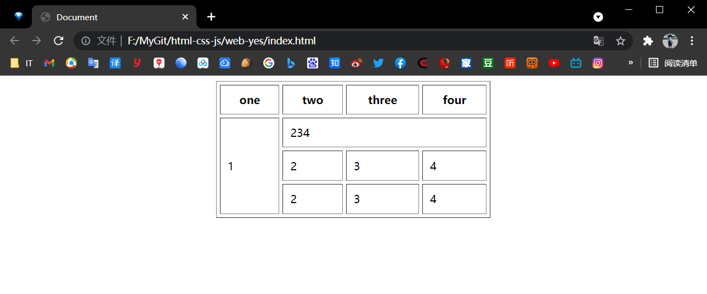
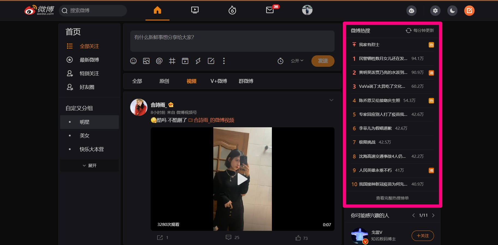
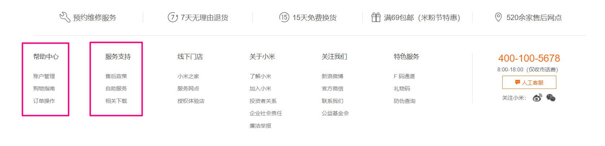
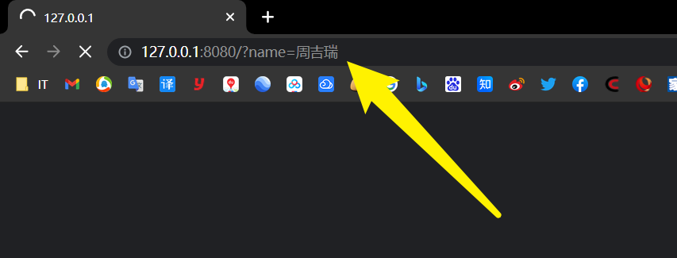
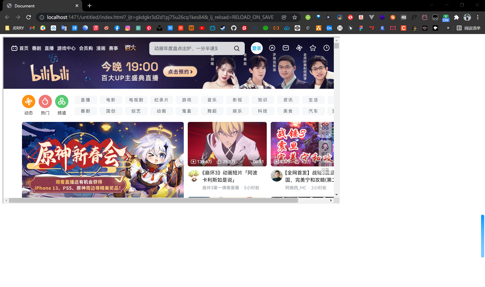

# 【HTML基础】

> 本学习笔记是个人对 Pink 老师课程的总结归纳，转载请注明出处！

# 一、HTML简介

## 1.1 网页

### 1.1.1 什么是网页？

**网站：**互联网上根据一定的规则，使用前端技术（包括：HTML） 制作的用于展示特定内容相关的网页集合。

**网页：**网站中的一 “页”，是构成网站的基本元素，通常是 HTML 格式的文件（.htm 或 .html）它必须通过浏览器来阅读。

### 1.1.2 什么是HTML?

**超文本：**超级文本（图片 + 声音 + 动画 + 视频 + ……），具备从一个文件跳转到另一个文件，与世界各地主机里的文件链接的能力（超级链接文本）。

**HTML：**超文本标记语言（HTML 不是一种编程语言，而是一种标记语言，标记语言是由一套标记标签构成的）。

### 1.1.3 网页的形成

前端代码开发 ——> 浏览器解析、渲染代码 ——> 呈现 Web 页面。

## 1.2 浏览器

### 1.2.1 常用浏览器

**PC 端五大浏览器：** `IE`、`Chrome`、`Firefox`、`Safari`、`Opera`、（目前 IE 已经被 `Edge` 取代）。

### 1.2.2 浏览器内核

**四大浏览器内核：**IE（`Trident`）、Firefox（`Gecko`）、Safari（`Webkit`）、Chrome / Opera / Edge（`Blink` 属于 Webkit 的分支，Blink 兼容 Webkit）

注：目前国内浏览器一般都采用 Webkit / Blink 内核（追随 Chrome）。

## 1.3 Web标准

**W3C：** `万维网联盟`，国际最著名的标准化组织之一。

**Web 标准：**W3C 组织和其他标准化组织为 Web 开发制定的一系列标准的集合。

### 1.3.1 为什么需要Web标准？

浏览器不同，解析渲染显示页面的效果就有些许差异，通过 Web 标准可以统一最终显示效果，大大减少开发者的工作量（一套代码，多种浏览器平台运行）。

遵循 Web 标准除了可以让不同的开发人员写出的页面更标准、更统一外，还有以下优点：

- 让 Web 开发前景更广阔

- 网页能被更广泛的设备访问

- 更容易被搜索引擎搜索（排名靠前）

- 降低网站的流量费用

- 使网站更易于维护

- 提高页面的加载速度

### 1.3.2 Web标准的构成

**主要包括三个方面：** `结构`、`表现`、`行为`。

- **结构：**用于对网页元素进行整理和分类，现阶段主要指的是 `HTML`
- **表现：**用于设置网页元素的版式、大小、颜色等外观样式，主要指 `CSS`
- **行为：**网页模型的定义及交互方式的编写，现阶段主要指的是 `JavaScript`

**Web 标准提出的最佳体验方案：** `结构`、`样式`、`行为` 相互分离。

- **简单的理解：**结构写到 HTML 文件中、表现写到 CSS 文件中、行为写到 JavaScript 文件中
- **一句话解释：**结构类似身体、表现类似衣服、行为类似动作（结构始终是一切的基础！）

# 二、HTML标签

> 特别提醒：以下内容中，HTML 标签内会出现若干 “标签样式属性”，此处只需要了解即可，因为实际开发中都是使用 CSS 来对 HTML 进行样式的设置。

## 2.1 HTML语法规范

### 2.1.1 基本语法概述

HTML 标签是由**尖括号**包围的关键字词，例如：`<html>`。

HTML 标签通常是成对出现的，例如：`<html>` 和 `</html>`，我们称为**双标签**。标签对中的第一个标签是**开始标签**，第二个标签是**结束标签**。

有些特殊的标签必须是单个标签（极少情况），例如：`<br />`，我们称为**单标签**。注意：`/` 之前有一个空格（Coding Style 编码风格）。每个标签原则上都应该有**结束符**，即：` /`。所以单标签的最后要加 `/` 以表示结束，当然即便不加 `/` 也是可以被浏览器正常解析的。

> HTML5 规范中明确说明单标签 `/` 是可以忽略的，**实际开发中建议不要给单标签添加斜线**。

> 任何标签都建议不要大写，即便是 `<!doctype html>` 标签。

### 2.1.2 标签关系

1. **包含关系**

```html
<head>
    <title></title>
</head>
```

2. **并列关系**

```html
<head>
</head>
<body> 
</body>
```

## 2.2 HTML基础结构标签

### 2.2.1 第一个HTML网页

每个网页都会有一个基础的结构标签（骨架标签：4组），页面内容也是在这些基础标签上书写的。

> HTML 页面也称为 HTML 文档。

【HTML 基础结构】

```html
<html>
    <head>
        <title></title>
    </head>
    <body>
    </body>
</html>
```

| 标签名               | 定义     | 说明                                    |
| -------------------- | -------- | --------------------------------------- |
| `<html>` `</html>`   | 根标签   | 页面中最大的标签（最基础的标签）        |
| `<head>` `</head>`   | 头部标签 | 在 head 标签中我们必须要设置 title 标签 |
| `<title>` `</title>` | 标题标签 | 页面自己的网页标题                      |
| `<body>` `</body>`   | 主体标签 | 包含文档的所有内容                      |

**网页 title 示例：**


## 2.3 网页开发工具

- `WebStorm`（生态、智能、收费）
- `VSCode`（免费、插件、轻量）
- `HBuilderX`（国产、跨端开发）
- `Sublime Text`（插件、轻量、收费）
- `Atom`（免费、插件、轻量）
- `Dreamweaver`（可视化、智能、收费）
- `Notepad++`（免费、轻量）
- `Windows 记事本`（坑爹）
- ……

### 2.3.1 文档类型声明标签

`<!doctype>` 文档类型声明，作用是告诉浏览器应该使用哪种 HTML 版本来解析渲染网页。

```html
<!doctype html>
<!-- 当前页面采用 HTML5 版本 -->
```

**注意：**

- `<!doctype>` 声明位于文档最前面的位置，处于 \<html> 标签之前
- `<!doctype>` 文档类型声明标签，不属于 HTML 标签
- 请默认统一指定 HTML5 版本 `<!doctype html>`

### 2.3.2 lang语言种类

用来定义当前网页显示的主语言，书写在 `<html>` 标签内。

- `en` 定义语言为英语
- `zh` 定义语言为中文

简单来说：定义为 `en` 就是面向英文用户的网页，定义为 `zh` 就是面向中国大陆用户的网页。

> `en-GB` 英文（英国）
>
> `en-US` 英文（美国）
>
> `zh-CN` 中文（简体，中国大陆）
>
> `zh-SG` 中文（简体，新加坡）
>
> `zh-HK` 中文（繁体，香港）
>
> `zh-MO` 中文（繁体，澳门）
>
> `zh-TW` 中文（繁体，台湾）

```html
<html lang="zh-CN"> 
</html>
```

> 语言的设置是为了方便 `浏览器搜索推荐` 以及触发 `浏览器翻译功能`，并不是说设置了某类主语言后网页中就不能存在其他类型的语言了。

### 2.3.3 字符集

**字符集：**多个字符的集合，以便计算机能够识别和储存各种文字。

在 `<head>` 标签内，可以通过 `<meta>` 标签的 `charset` 属性来规定 HTML 文档应该使用哪种字符编码。

```html
<meta charset="UTF-8">
```

`charset` 常用的值有：`GB2312`、`BIG5`、`GBK`、`UTF-8`，其中 `UTF-8` 也被称为：万国码，基本包含了全世界所有国家需要用到的字符。

**注意：**字符设置是必须的，否则极大可能引起网页乱码。一般情况下，统一使用 "UTF-8" 编码，尽量统一写成标准的 `UTF-8`，不要写成 "utf8" 或 "UTF8"。

**标准骨架：**

```html
<!doctype html>
<html lang="en">

<head>
    <meta charset="UTF-8">
    <title>Title</title>
</head>

<body>
</body>

</html>
```

### 2.3.4 IE 兼容模式

IE 支持通过特定的 `<meta>` 标签来确定绘制当前页面所应该采用的 IE 版本。除非有强烈的特殊需求，否则最好是设置为 **edge mode**，从而通知 IE 采用其所支持的最新的绘制模式。

```html
<!doctype html>
<html lang="en">

<head>
    <meta charset="UTF-8">
    <meta http-equiv="x-ua-compatible" content="ie=edge">
    <title>Title</title>
</head>

<body>
</body>

</html>
```

## 2.4 HTML常用标签

### 2.4.1 标签语义

**简单的理解：**标签的含义，即：这个标签是用来干嘛的。

### 2.4.2 标题标签 

为了使网页更具有语义化，我们经常会在页面中用到标题标签。

HTML 提供了 6 个等级的网页标题，即：`<h1>` 到 `<h6>`。

```html
<h1>一级标题</h1>
<h2>二级标题</h2>
<h3>三级标题</h3>
<h4>四级标题</h4>
<h5>五级标题</h5>
<h6>六级标题</h6>
```


> 单词 head 的缩写，意为：头部、标题。

**标签语义：**作为标题使用，并且依据重要性递减。

**特点：**

- 加了标题的文字会自动加粗，字号也会依次变大
- 一个标题就独占一行，同一行标题后不会再放置其他任何内容（后期可以通过 CSS 修改）

> 级别越大的标题标签，对网页元素的强调性越强，同时也和浏览器 SEO 优化有关。
>
> 故：标题标签不得滥用，要用在合适的地方！

### 2.4.3 段落和换行标签

在网页中，要把文字有条理地显示出来，就需要将这些文字分段显示，在 HTML 标签中，`<p>` 标签用于定义段落，它可以将整个网页分为若干个段落。

```html
<p>我是一个段落标签</p>
```

> 单词 paragraph 的缩写，意为：段落。

**便签语义：**可以把 HTML 文档分割为若干段落。

**特点：**

- 文本在一个段落中会根据浏览器窗口的大小自动换行
- 段落和段落之间保有空隙（段间距）
- 同一段落里的不同行文字之间也有一定的空隙（行间距）


在 HTML 中，一个段落中的文字会从左到右依次排列，直到浏览器窗口的右端，然后才自动换行。

如果希望某段文本强制换行显示，就需要使用换行标签  `<br>`。

```html
<br>
```

> 单词 break 的缩写，意为：打断、换行。

**标签语义：**强制换行。

**特点：**

- `<br>` 是个单标签
- `<br>` 标签只是简单地开始新的一行，跟段落不一样，所以不会产生段间距

分割线标签：`<hr>`。

```html
<hr>
<!-- 某些时候需要对内容块进行分割时会用到分割线标签 -->
```


> 注意：实际开发中并不常用 hr 作为分割线，而是使用 CSS 盒子模型中的边框来实现分割线效果，或是利用一个空盒子设置长宽高及背景颜色来实现分割线。

### 2.4.4 文本格式化标签

在网页中，有时需要为文字设置粗体、斜体或下划线等效果，这时就需要用到 HTML 中的文本格式化标签，使文字以特殊的方式显示。

**标签语义：**突出重要性，比普通文字更重要。

| 语义   | 标签                                   | 说明                                                 |
| ------ | -------------------------------------- | ---------------------------------------------------- |
| 加粗   | `<strong>` `</strong>` 或 `<b>` `</b>` | 介于可读性、搜索引擎优化及屏幕阅读器适配推荐使用前者 |
| 倾斜   | `<em>` `</em>` 或 `<i>` `</i>`         | 介于可读性、搜索引擎优化及屏幕阅读器适配推荐使用前者 |
| 删除线 | `<del>` `</del>` 或 `<s>` `</s>`       | 介于可读性、搜索引擎优化及屏幕阅读器适配推荐使用前者 |
| 下划线 | `<ins>` `</ins>` 或 `<u>` `</u>`       | 介于可读性、搜索引擎优化及屏幕阅读器适配推荐使用前者 |

> 注意：`<em></em>` 标签不只是单纯的用于倾斜文本，其核心的意义在于对元素进行**强调！**所以在后期的开发中可以把一些**特殊性、强调性**的元素放在 em 标签中，然后再对 em 这个盒子进行样式设置，这比把其放入其他盒子（如：span）中要更合理。

### 2.4.5 \<div>和\<span>标签

`<div>` 和 `<span>` 是没有语义的，它们就是两种盒子，用来对网页进行布局和装其他内容。

```html
<div>这是头部</div>
<span>今日价格</span>
```

> div 是 division 的缩写表示：分割、分区。

> span 意为：跨度、跨距。

**特点：**

- `<div>` 标签用来布局，一行只能放一个 `<div>`，**大盒子**
- `<span>` 标签用来布局，一行上可以放多个 `<span>`，**小盒子**

**说明：**后期可以通过 CSS 将 div 与 span 之间的特性相互转换。

**拓展：** `span` 标签不单单是用于布局，对于一些需要单独修饰和设置的元素，可以将其用 `span` 标签嵌套起来，然后就可以单独对其进行设置（比如：在一个 p 标签的段落中要对其中某一句话单独设置样式，那么就可以用 span 将这句话单独嵌套起来，这样就方便对其单独设置样式还不会影响段落中的其他内容，这其实也是利用了 span 一行可以放置多个盒子的特性），不过对于特殊且具有强调性的元素建议使用 `em`。

### 2.4.6 图像标签和路径

**（1）图像标签**

在 HTML 标签中，`` 标签用于定义 HTML 页面中的图像。

```html

```

> 单词 image 的缩写，意为图像。

`src` 是 `` 标签的必须属性，它用于指定图像文件的路径和文件名。

`URL` 是 `统一资源定位符`（通俗理解：地址、网址）。

所谓属性：简单理解就是属于这个图像标签的特性。

**图像标签的其他属性：**

| 属性     | 属性值   | 说明                                                         |
| -------- | -------- | ------------------------------------------------------------ |
| `src`    | 图片路径 | 必须属性                                                     |
| `alt`    | 文本     | 替换文本，图像显示失败时显示（为了提高 SEO 及适配屏幕阅读器，建议都把 alt 写上） |
| `title`  | 文本     | 提示文本，鼠标放到图片上，显示的提示文字                     |
| `width`  | 像素     | 设置图像的宽度                                               |
| `height` | 像素     | 设置图像的高度                                               |
| `border` | 像素     | 设置图像的边框粗细                                           |

**图像标签的注意点：**

- 图像标签**可以同时拥有多个属性**（其它标签也是同理）
- 属性之间不分先后顺序，标签名与属性、属性与属性之间均以**空格**分开（其它标签也是同理）
- **属性均采取键值对**的格式，即：`key="value"` 的格式，`属性="属性值"`
- 设置图像的宽度与高度时：一般设置其中之一便可，另外一个会自动按比例适配
- 设置宽高时，可以使用**百分数**作为值，此时图片大小会以当前父元素的大小为基础进行比例缩放，这样做的好处在于当父元素改变大小时，图片也会随比例同等缩放

**（2）路径**

- 相对路径

相对路径：以引用文件所在位置为参考基础，而建立出目录路径。

| 相对路径分类 | 符号  | 说明                                   |
| ------------ | ----- | -------------------------------------- |
| 同一级路径   | `.`   | 如：``          |
| 下一级路径   | `/`   | 如：``    |
| 上一级路径   | `../` | 如：`` |


- 绝对路径

绝对路径：指目录下的绝对位置，直接到达目的位置，通常是从盘符开始的路径。

如 Windows 系统的绝对路径：`D:\web\img\logo.png` 

- 网络地址

   `https://github.com/JERRY-Z-J-R/JERRY-Z-J-R/blob/main/mark-img/readme.gif`

**注意：**

- 相对路径为 `/`（正斜杆），绝对路径为 `\`（反斜杆）
- 实际开发中建议使用相对路径或网络地址（都是 `/` 正斜杆）

> 这里所说的绝对路径为 `/`（正斜杠）指的是在 Windows 环境中，而 Linux 系统依旧是反斜杠。

### 2.4.7 超链接标签

在 HTML 标签中，`<a>` 标签用于定义超链接，作用是从一个页面链接到另一个页面。

**（1）链接的语法格式**

```html
<a href="跳转目标" target="目标窗口的弹出方式">文本、图像或其他内容</a>
```

> 单词 **anchor** 的缩写，意为：锚。

**两个属性的作用如下：**

| 属性     | 作用                                                         |
| -------- | ------------------------------------------------------------ |
| `href`   | 用于指定链接目标的 url 地址，（必须属性）当标签应用 href 属性时，它就具有了超链接的功能 |
| `target` | 用于指定链接页面的打开方式，其中 `_self` 在当前页面打开的方式（为默认值），`_blank` 在新窗口中打开的方式 |

**（2）链接分类**

- **外部链接：**例如：`<a href="http://www.baidu.com">百度</a>` 
- **内部链接：**网站内部页面之间相互链接，直接链接内部页面名称即可，例如： `<a href="index.html">首页</a>`
- **空链接：**如果当时没有确定链接目标时， `<a href="javascript:void(0)">首页</a>"`，当用户点击链接时，void(0) 计算为 0，但 Javascript 上没有任何效果
- **下载链接：**如果 href 里面地址是一个文件或者压缩包（前提：路径包含文件类型后缀名，如：`.exe`、`.zip` 等），便会下载这个文件
- **网页元素链接：**在网页中的各种网页元素，如：文本、图像、表格、音频、视频等都可以添加超链接
- **锚点链接：**点击链接，可以快速定位到当前页面中的某个位置
  - 在链接文本的 href 属性中，设置属性值的 `#名字` 的形式，如：`<a href="#two">第2集</a>`
  - 找到目标位置标签（此处以 h3 标签为例），里面添加一个 `id属性="刚才的名字"`，如：`<h3 id="two">第2集介绍</h3>`
  - `<a href="#"></a>` 默认定位到页面顶部

## 2.5 HTML中的注释和特殊字符

### 2.5.1 注释

如果需要在 HTML 文档中添加一些便于阅读和理解但又不需要显示在页面中的文字，就需要使用注释标签。

HTML 中的注释以：`<!--` 开头，以 `-->` 结束。

```html
<!-- 注释语句 -->
```

一句话：注释标签里面的内容是给程序员看的，这个代码是不执行不显示到页面中的。

> 注释是为了更好地解释代码功能，便于相关开发人员理解和阅读代码，程序是不会执行注释内容的。

### 2.5.2 特殊字符

在 HTML 页面中，一些特殊的符号很难或者不方便直接使用，此时我们就可以使用下面的字符来替代。

| 特殊字符 | 描述   | 字符的代码 |
| :------- | :----- | :--------- |
| ` `      | 空格符 | `&nbsp;`   |
| `<`      | 小于号 | `&lt;`     |
| `>`      | 大于号 | `&gt;`     |
| `&`      | 和号   | `&amp;`    |
| `±`      | 正负号 | `&plusmn;` |
| `×`      | 乘号   | `&times;`  |
| `÷`      | 除号   | `&divide;` |
| `²`      | 上标   | `&sup2;`   |

注意：下标请使用：`<sub>2</sub>`，同时上标也建议使用：`<sup>2</sup>`。

## 2.6 表格标签


### 2.6.1 表格的主要作用

表格主要用于显示、展示数据。因为它可以让数据显示得非常的规整，可读性非常好。特别是后台展示数据的时候，能够熟练运用表格就显得很重要。一个清爽简约的表格能够把繁杂的数据表现得很有条理（合理的使用表格也能够有效提高 SEO）。

**注意：**表格不是用来布局页面的，而是用来展示数据的。**表格常用于表单数据的 “布局”**。

> 特别强调，表格是用于表单数据的 “布局”，而不是页面的布局！

### 2.6.2 表格的基本语法

```html
<table>
    <tr>
        <td>单元格</td>
        ...
    </tr>
    ...
</table>
```

- `<table>` `</table>` 是用于定义表格的标签
- `<tr>` `</tr>` 用于定义表格中的行，必须嵌套在 `<table>` `</table>` 标签中
- `<td>` `</td>` 用于定义表格中的单元格，必须嵌套在 `<tr>` `</tr>` 标签中
- 字母 td 指表格数据（table data），即：数据单元格的内容
- 单元格 td 里面可以放任何的元素

### 2.6.3 表头单元格标签

一般表头单元格位于表格的第一行或第一列，作用是：突出重要性，表头单元格里面的文本内容**默认加粗居中**显示。

`<th>` 标签表示 HTML 表格的表头部分（table head 的缩写）。

```html
<table>
    <tr>
    	<th>姓名</th>
        <th>性别</th>
        <th>年龄</th>
        ...
    </tr>
    ...
</table>
```

### 2.6.4 表格属性

**注意：**表格标签的属性在实际开发中并不常用，而是通过后面的 CSS 来设置，这里了解即可。

以下属性都写在 table 开始标签内，多个属性之间用空格隔开。

```html
<table align="center" border="1" cellpadding="0" cellspacing="0" width="500" height="240">
    ...
</table>
```

| 属性名        | 属性值                    | 描述                                                         |
| :------------ | :------------------------ | :----------------------------------------------------------- |
| `align`       | `left`、`center`、`right` | 规定表格相对周围元素的对齐方式（默认 left），注意指的是整个表格的对齐方式（表格是在父盒子中默认往左靠，还是居中或是往右靠），而不是指单元格内容的对齐方式（单元格内容对齐可以通过：`style="text-align: center;"` 设置） |
| `border`      | `1` 或 `""`               | 规定表格单元是否拥有边框，默认为 ""，表示没有边框            |
| `cellpadding` | 像素值                    | 规定单元边沿与其内容之间的空白，默认 1 像素                  |
| `cellspacing` | 像素值                    | 规定单元格之间的空白，默认 2 像素                            |
| `width`       | 像素值 或 百分比          | 规定表格的宽度                                               |
| `height`      | 像素值 或 百分比          | 规定表格的高度                                               |

### 2.6.5 表格结构标签

**使用场景：**因为表格可能很长，为了更好的表示表格的语义，可以将表格分割成：`表格头部` 和 `表格主体` 两大部分。

在表格标签中，分别用：`<thead>` 标签表示表格的头部区域，`<tbody>` 标签表示表格的主体区域，这样可以更好的分清表格结构。

- `<thead>` `</thead>`：用于定义表格的头部，`<thead>` 内部必须拥有 `<tr>` 标签，一般是位于第一行，且一般 `<tr>` 标签中推荐放置 `<th>` 标签
- `<tbody>` `</tbody>`：用于定义表格的主体，主要用于放数据本体
- 以上标签都是放在 `<table>` `</table>` 标签中

```html
<table>
    <!-- 头部区域 -->
    <thead>
    	<tr>
    		<th>姓名</th>
            <th>性别</th>
            <th>年龄</th>
        	...
    	</tr>
    </thead>
    <!-- 主体区域 -->
    <tbody>
        <tr>
            <td>周吉瑞</td>
            <td>男</td>
            <td>18</td>
            ...
        </tr>
        ...
    </tbody>
</table>
```

### 2.6.6 合并单元格

特殊情况下，可以把多个单元格合并为一个单元格，这里会最简单的合并单元格即可。

**合并单元格的方式：**

- 跨行合并（上下合并）：`rowspan="合并单元格的个数"`
- 跨列合并（左右合并）：`colspan="合并单元格的个数"`

**目标单元格：（写合并代码）**

- 跨行：最上侧单元格为目标单元格，写合并代码
- 跨列：最左侧单元格为目标单元格，写合并代码

**合并单元格三步曲：**

- 先确定是跨行还是跨列合并
- 找到目标单元格，写上 `合并方式=合并的单元格数量`，比如：`<td colspan="2">` `</td>`
- 删除多余单元格

```html
<!doctype html>
<html lang="en">

<head>
    <meta charset="UTF-8">
    <meta http-equiv="X-UA-Compatible" content="IE=edge">
    <meta name="viewport" content="width=device-width, initial-scale=1.0">
    <title>Document</title>
</head>

<body>
    <table width="500" height="249" border="1" cellspacing="0">
        <tr>
            <td></td>
            <td colspan="2"></td>
            <!-- <td></td> -->
        </tr>
        <tr>
            <td rowspan="2"></td>
            <td></td>
            <td></td>
        </tr>
        <tr>
            <!-- <td></td> -->
            <td></td>
            <td></td>
        </tr>
    </table>
</body>

</html>
```


【综合案例】

```html
<!doctype html>
<html lang="en">

<head>
    <meta charset="UTF-8">
    <meta http-equiv="X-UA-Compatible" content="IE=edge">
    <meta name="viewport" content="width=device-width, initial-scale=1.0">
    <title>Document</title>
</head>

<body>
    <table width="400px" height="200px" align="center" border="1" cellpadding="10" cellspacing="5">
        <thead>
            <tr>
                <th>one</th>
                <th>two</th>
                <th>three</th>
                <th>four</th>
            </tr>
        </thead>

        <tbody>
            <tr>
                <td rowspan="3">1</td>
                <td colspan="3">234</td>
                <!-- <td>3</td> -->
                <!-- <td>4</td> -->
            </tr>
            <tr>
                <!-- <td>1</td> -->
                <td>2</td>
                <td>3</td>
                <td>4</td>
            </tr>
            <tr>
                <!-- <td>1</td> -->
                <td>2</td>
                <td>3</td>
                <td>4</td>
            </tr>
        </tbody>
    </table>
</body>

</html>
```



## 2.7 列表标签

表格是用来显示数据的，那么**列表就是用来布局的**。

列表最大的特点就是：整齐、整洁、有序、它作为布局会更加自由和方便。

在实际开发中凡是遇到排列整齐的简洁内容，都可以使用列表来进行布局。

合理的使用列表布局可以有效提高 SEO。

根据使用情景不同，列表可以分为三大类：`无序列表`、`有序列表` 和 `自定义列表`。

| 标签名         | 定义       | 说明                                                         |
| -------------- | ---------- | ------------------------------------------------------------ |
| `<ul>` `</ul>` | 无序标签   | 里面**只包含 li**，没有顺序，使用较多，li 里面可以包含任何标签 |
| `<ol>` `</ol>` | 有序标签   | 里面**只包含 li**，有顺序，使用相对较少，li 里面可以包含任何标签 |
| `<dl>` `</dl>` | 自定义标签 | 里面**只能包含 dt 和 dd**，dt 和 dd 里面可以放任何标签，dd 一般作为对 dt 的细分描述 |

**常见应用：**

- 无序列表


- 有序列表

> 注意：微博热搜是为方便理解举例，实际上此处并非使用有序列表！



- 自定义列表



### 2.7.1 无序列表

`<ul>` 标签表示 HTML 页面中项目的无序列表，一般会以项目符号呈现列表项，而列表项使用 `<li>` 标签定义（开发中经常使用）。

**无序列表的基本语法格式如下：**

```html
<ul>
    <li>列表项1</li>
    <li>列表项2</li>
    <li>列表项3</li>
    ...
</ul>
```

- 无序列表的各个列表项之间没有顺序级别之分，是并列的
- `<ul>` `</ul>` 中只能嵌套 `<li>` `</li>`，直接在 `<ul>` `</ul>` 标签中输入其他标签或者文字的做法是不被允许的，列表中的任何内容都应该放在 `li` 中
- `<li>` 与 `</li>` 之间相当于一个容器，可以容纳所有的元素
- 无序列表会带有自己的样式属性（比如圆点），但在实际开发中，我们会使用 CSS 来设置


> 附：去除 li 前符号的方法：`style="list-style: none;"`

### 2.7.2 有序列表

有序列表即为有序排列顺序的列表，其各个列表项会按照一定的顺序排列定义（开发中不太常用）。

在 HTML 标签中，`<ol>` 标签用于定义有序列表，列表排序以数字来显示，并且使用 `<li>` 标签来定义列表项。

**有序列表的基本语法格式如下：**

```html
<ol>
    <li>列表项1</li>
    <li>列表项2</li>
    <li>列表项3</li>
    ...
</ol>
```

- `<ol>` `</ol>` 中只能嵌套 `<li>` `</li>`，直接在 `<ol>` `</ol>` 标签中输入其他标签或者文字的做法是不被允许的
- `<li>` 与 `</li>` 之间相当于一个容器，可以容纳所有的元素
- 有序列表会带有自己样式属性（比如序号），但在实际使用时，我们会使用 CSS 来设置


> 附：去除 li 前符号的方法：`style="list-style: none;"`

### 2.7.3 自定义列表

**自定义列表的使用场景：**

自定义列表常用于对术语或名词进行解释、描述和展开，定义列表的列表项前没有任何项目符号（开发中常用）。

在 HTML 标签中，`<dl>` 标签用于定义描述列表（或定义列表），该标签会与 `<dt>`（定义项目/名字）和 `<dd>`（描述每一个项目/名字）一起使用。

其基本语法如下：

```html
<dl>
    <dt>名词1</dt>
    <dd>名词1解释1</dd>
    <dd>名词1解释2</dd>
</dl>
```

- `<dl>` `</dl>` 里面只包含 `<dt>`、`<dd>`
- `<dt>` 和 `<dd>` 个数没有限制，经常是一个 `<dt>` 对应多个 `<dd>`


## 2.8 表单标签

### 2.8.1 为什么需要表单

使用表单的目的是收集用户信息。

在网页中，需要跟用户进行交互，收集用户资料，此时就需要表单。

### 2.8.2 表单的组成

在 HTML 中，一个完整的表单通常由 `表单域`、`表单控件`（也称为表单元素）和 `提示信息`  3 个部分构成。

### 2.8.3 表单域

**表单域是一个包含表单元素的区域。**

在 HTML 标签中，`<form>` 标签用于定义表单域，以实现用户信息的收集和传递。

`<form>` 会把它范围内的表单元素信息提交给服务器。

```html
<form action="url地址" method="提交方式" name="表单域名称">
    <!-- 各种表单元素控件 -->
</form>
```

**常用属性：**

| 属性名   | 属性值         | 作用                                               |
| -------- | -------------- | -------------------------------------------------- |
| `action` | `url` 地址     | 用于指定接收并处理表单数据的服务器程序的 url 地址  |
| `method` | `get` / `post` | 用于设置表单数据的提交方式，其取值为 get 或 post   |
| `name`   | 名称           | 用于指定表单的名称，以区分同一个页面中的多个表单域 |

注意：对于 HTML 基础的学习来说，暂时不用考虑提交数据，只需写上 form 标签即可，后面学习服务端编程阶段会重新讲解。

**form 表单中 method 的 get 和 post 区别：**

> method 方法规定如何发送表单数据（form-data）（表单数据会被发送到在 action 属性中规定的页面中）。
>
> 表单数据可被作为 URL 变量的形式来发送（method="get"）或者作为 HTTP post 事务的形式来发送（method="post"）。
>
> **关于 GET 的注释：**
>
> - 将表单数据以名称/值对的形式附加到 URL 中
> - URL 的长度是有限的（大约 3000 字符）
> - 绝不要使用 GET 来发送敏感数据！（在 URL 中是可见的，且浏览器会记录 URL）
> - 对于用户希望加入书签的表单提交很有用（因为信息记录在 URL 中，直接保存 URL 即可）
> - GET 更适用于非安全数据，比如在 Google 中查询字符串
>
> **关于 POST 的注释：**
>
> - 将表单数据附加到 HTTP 请求的 body 内（数据不显示在 URL 中）
> - 没有长度限制
> - 通过 POST 提交的表单不能加入书签

【GET案例】

```html
<!doctype html>
<html lang="en">

<head>
    <meta charset="UTF-8">
    <meta http-equiv="X-UA-Compatible" content="IE=edge">
    <meta name="viewport" content="width=device-width, initial-scale=1.0">
    <title>Document</title>
</head>

<body>
    <form action="http://127.0.0.1:8080/" method="GET">
        姓名：<input type="text" name="name">
        <input type="submit">
    </form>
</body>

</html>
```




【POST案例】

```html
<!doctype html>
<html lang="en">

<head>
    <meta charset="UTF-8">
    <meta http-equiv="X-UA-Compatible" content="IE=edge">
    <meta name="viewport" content="width=device-width, initial-scale=1.0">
    <title>Document</title>
</head>

<body>
    <form action="http://127.0.0.1:8080/" method="POST">
        姓名：<input type="text" name="name">
        <input type="submit">
    </form>
</body>

</html>
```


### 2.8.4 表单控件（表单元素）

在表单域中可以定义各种表单元素，这些表单元素就是允许用户在表单中输入或者选择的内容控件。

**（1）\<input>  表单元素**

在英文单词中，input 是输入的意思，而在表单元素中 `<input>` 标签用于收集用户信息。

在 `<input>` 标签中，包含一个 type 属性，根据不同的 type 属性值，输入字段拥有很多种形式（可以是文本、字段、复选框、掩码后的文本控件、单选按钮、按钮等）。

```html
<input type="属性值" />
```

- `<input />` 标签为单标签

- type 属性设置不同的属性值用来指定不同的控件类型

**type 属性的属性值及其描述如下：**

| 属性值     | 描述                                                         |
| ---------- | ------------------------------------------------------------ |
| `button`   | 定义可点击按钮（多数情况下，用于通过 JavaScript 启动脚本）   |
| `checkbox` | 定义复选框，即：多选框，在一组多选中，要求它们必须拥有相同的 name |
| `file`     | 定义输入字段和 “浏览” 按钮，供文件上传                       |
| `hidden`   | 定义隐藏的输入字段                                           |
| `image`    | 定义图像形式的提交按钮                                       |
| `password` | 定义密码字段，该字段中的字符被掩码                           |
| `radio`    | 定义单选按钮，在一组单选按钮中，要求它们必须拥有相同的 name  |
| `reset`    | 定义重置按钮，重置按钮会清除表单中的所有数据                 |
| `submit`   | 定义提交按钮，提交按钮会把表单数据发送到服务器               |
| `text`     | 定义单行的输入字段，用户可在其中输入文本，默认宽度为 20 个字符 |

【hidden解释】

> `<input type="hidden" name="..." value="...">`
> 上面是 html 中的隐藏域。主要作用为：
>
> 1. 隐藏域在页面中对于用户是不可见的，在表单中插入隐藏域的目的在于收集或发送信息，以利于被处理表单的程序所使用。浏览者单击发送按钮发送表单的时候，隐藏域的信息也被一起发送到服务器。
> 2. 有些时候我们要给用户一信息，让他在提交表单时提交上来以确定用户身份，如 sessionkey，等等。当然这些东西也能用 cookie 实现，但使用隐藏域就简单的多了。而且不会有浏览器不支持，也避免了用户禁用 cookie 后的烦恼。
> 3. 有些时候一个 form 里有多个提交按钮，怎样使程序能够分清楚到底用户是按那一个按钮提交上来的呢？我们就可以写一个隐藏域，然后在每一个按钮处加上   onclick="document.form.command.value="xx"" 然后我们接到数据后先检查 command 的值就会知道用户是按的那个按钮提交上来的。
> 4. 有时候一个网页中有多个 form，我们知道多个 form 是不能同时提交的，但有时这些 form 确实相互作用，我们就可以在 form 中添加隐藏域来使它们联系起来。
> 5. javascript 不支持全局变量，但有时我们必须用全局变量，我们就可以把值先存在隐藏域里，它的值就不会丢失了。
> 6. 定义隐藏输入字段，隐藏字段对于用户是不可见的。隐藏字段常常存储默认值。
> 7. 通常是提交一些表格的时候，有些变量是预先定了其值的，而且不想客户再改变其值，所以用 hidden 隐藏，但提交表单的时候还是会把其值上交上去的。
>
> 以上为基本用法，其实和文本框差不多的作用，唯一的区别就是用户界面是不可见的。
>
> 在使有中要注意，不要将敏感信息存放在隐藏域里！尽管一般用户看不到它。
>
> 【案例】
>
> ```html
> <!doctype html>
> <html lang="en">
> 
> <head>
>     <meta charset="UTF-8">
>     <meta http-equiv="X-UA-Compatible" content="IE=edge">
>     <meta name="viewport" content="width=device-width, initial-scale=1.0">
>     <title>Document</title>
> </head>
> 
> <body>
> <form action="http://127.0.0.1:8080/" method="get">
>     <input type="hidden" name="name" value="周吉瑞">
>     <input type="submit">
> </form>
> 
> </body>
> 
> </html>
> ```
>
> 
>
> 

**除 type 属性外，`<input>` 标签还有很多其他属性，其常用属性如下：**

| 属性名      | 属性值       | 描述                                        |
| ----------- | ------------ | ------------------------------------------- |
| `name`      | 由用户自定义 | 定义 input 元素的名称                       |
| `value`     | 由用户自定义 | 规定 input 元素的值，也就是提交到服务器的值 |
| `checked`   | checked      | 规定此 input 元素首次加载时应当被选中       |
| `maxlength` | 正整数       | 规定输入字段中的字符的最大长度              |

- `name` 和 `value` 是每个表单元素都有的属性值，主要给后台人员使用
- `name` 表单元素的名字，要求：单选按钮和复选框要有相同的 name 值
- `checked` 属性主要针对于单选按钮和复选框，主要作用：打开页面时默认选中某个表单元素
- `maxlength` 是用户可以在表单元素输入的最大字符数，一般很少使用

**<1>、有些表单元素刚打开页面就须要默认显示几个文字怎么做？**

答：可以给这些表单元素设置 `value属性="值"`。

```html
用户名：<iuput type="text" value="请输入用户名" />
```

**<2>、页面中的表单元素很多，如何区别不同的表单元素？**

答：name 属性：当前 input 表单的名字，后台可以通过这个 name 属性找到这个表单，页面中的表单很多，name 的主要作用就是用于区别不同的表单。

```html
用户名：<input type="text" value="请输入用户名" name="username" />
```

- name 属性后面的值是自定义的
- radio（或者 checkbox）如果是一组，我们必须给他们命名相同的名字

```html
<input type="radio" name="sex" />男
<input type="radio" name="sex" />女
```

**<3>、如果页面一打开就让某个单选按钮或者复选框是选中状态？**

答：checked 属性：表示默认选中状态，用于单选按钮和复选按钮。

```html
性 别：
<input type="radio" name="sex" value="男" checked="checked" />男
<input type="radio" name="sex" value="女" >女
```

- \<label\> 标签

`<label>` 标签为 input 元素定义标注（标签）。

`<label>` 标签用于绑定一个表单元素，当点击 `<label>` 标签内的文本时，浏览器就会自动将焦点（光标）转到或者选择对应的表单元素上，用来增加用户体验。

**语法：**

```html
<label for="sex">
	男<input type="radio" name="sex" id="sex" />
</label>
```

**核心：** `<label>` 标签的 for 属性应当与相关元素的 id 属性相同。


**（2）\<select> 表单元素**

**使用场景：**在页面中，如果有多个选项让用户选择，并且想要节约页面空间时，我们可以使用 `<select>` 标签控件定义下拉列表。

**语法：**

```html
<select>
    <option>选项1</option>
    <option>选项2</option>
    <option>选项3</option>
    ...
</select>
```

- `<select>` 中至少包含一对 `<option>`
- 在 `<option>` 中定义 `selected="selected"` 时，当前项即为默认选中项

每个 `<option>` 元素都应该有一个 value 属性，其中包含选择该选项时要提交给服务器的数据值。如果不包含 value 属性，则 value 默认为元素内包含的文本。可以在 `<option>` 元素上包含 selected 属性，以使其在页面首次加载时默认选中。

**（3）\<textarea> 表单元素**

**使用场景：**当用户输入内容较多的情况下，我们就不能使用文本框表单了，此时我们可以使用 `<textarea>` 标签

在表单元素中，`<textarea>` 标签是用于定义多行文本输入的控件。

使用多行文本输入控件，可以输入更多的文字，该控件常用于留言板、评论。

**语法：**

```html
<textarea rows="3" cols="20">
	文本内容
</textarea>
```

- 通过 `<textarea>` 标签可以轻松地创建多行文本输入框
- `cols="每行中的字符数"`，`rows="显示的行数"`，我们在实际开发中不会使用，都是用 CSS 来改变大小

- 如果要禁止拉伸文本框大小，则：`style="resize: none" `

### 2.8.5 表单元素几个总结

（1）表单元素我们学习了三大组 `input 输入表单元素`、`select 下拉表单元素`、`textarea 文本域表单元素`

（2）这三组表单元素都应该包含在 `form 表单域` 里面，并且有 `name 属性`

```html
<form>
    <input type="text" name="username">
    <select name="jiguan">
        <option>北京</option>
    </select>
    <textarea name="message"></textarea>
</form>
```

（3）有三个名字非常相似的标签：

- 表单域 form 使用场景：提交区域内表单元素给后台服务器
- 文件域 file 是 input type 属性值 使用场景：上传文件
- 文本域 textarea 使用场景：可以输入多行文字，比如：留言板、网站介绍等……

## 2.9 案例

```html
<!doctype html>
<html lang="zh-CN">

<head>
    <meta charset="UTF-8">
    <meta content="IE=edge" http-equiv="X-UA-Compatible">
    <meta content="width=device-width, initial-scale=1.0" name="viewport">
    <title>恋爱小窝-注册页面</title>
</head>

<body>
<!-- 标题 -->
<h2>青春不常在，抓紧谈恋爱</h2>

<!-- 表单域 -->
<!-- <form action="" method="" name="lovetable"> -->

<!-- 注册表 -->
<table width="600">

    <!-- 第一行 -->
    <tr>
        <td>性别</td>
        <td>
            <label for="man">
                <input id="man" name="sex" type="radio"/>男
            </label>
            <label for="women">
                <input id="women" name="sex" type="radio"/>女
            </label>
        </td>
    </tr>

    <!-- 第二行 -->
    <tr>
        <td>生日</td>
        <td>
            <select>
                <option>--请选择年--</option>
                <option selected="selected">2021</option>
                <option>2020</option>
                <option>2019</option>
                <option>2018</option>
            </select>
            <select>
                <option>--请选择月--</option>
                <option>1</option>
                <option>2</option>
                <option>3</option>
                <option>4</option>
            </select>
            <select>
                <option>--请选择日--</option>
                <option>1</option>
                <option>2</option>
                <option>3</option>
                <option>4</option>
            </select>
        </td>
    </tr>

    <!-- 第三行 -->
    <tr>
        <td>所在地区</td>
        <td>
            <input type="text" value="云南玉溪"/>
        </td>
    </tr>

    <!-- 第四行 -->
    <tr>
        <td>婚姻状况</td>
        <td>
            <label for="weihun">
                <input checked="checked" id="weihun" name="marry" type="radio"/>未婚
            </label>
            <label for="yihun">
                <input id="yihun" name="marry" type="radio"/>已婚
            </label>
            <label for="lihun">
                <input id="lihun" name="marry" type="radio"/>离婚
            </label>
        </td>
    </tr>

    <!-- 第五行 -->
    <tr>
        <td>学历</td>
        <td>
            <input type="text" value="幼儿园"/>
        </td>
    </tr>

    <!-- 第六行 -->
    <tr>
        <td>喜欢的类型</td>
        <td>
            <input name="love" type="checkbox"/>妩媚的
            <input name="love" type="checkbox"/>可爱的
            <input name="love" type="checkbox"/>小鲜肉
            <input name="love" type="checkbox"/>老腊肉
            <input checked="checked" name="love" type="checkbox"/>都喜欢
        </td>
    </tr>

    <!-- 第七行 -->
    <tr>
        <td>自我介绍</td>
        <td>
            <textarea>自我介绍</textarea>
        </td>
    </tr>

    <!-- 第八行 -->
    <tr>
        <td></td>
        <td>
            <input type="submit" value="免费注册"/>
        </td>
    </tr>

    <!-- 第九行 -->
    <tr>
        <td></td>
        <td>
            <input checked="checked" type="checkbox"/>我同意注册条款和会员加入标准
        </td>
    </tr>

    <!-- 第十行 -->
    <tr>
        <td></td>
        <td>
            <a href="#">我是会员，立即登录</a>
        </td>
    </tr>

    <!-- 第十一行 -->
    <tr>
        <td></td>
        <td>
            <h4>我承诺</h4>
            <ul>
                <li>年满18岁、单身</li>
                <li>抱着严肃的态度</li>
                <li>真诚寻找另一半</li>
            </ul>
        </td>
    </tr>
</table>
<!-- </form> -->
</body>

</html>
```

**效果：**


**本质：**


## 2.10 内联框架

`<iframe>` 标签规定一个内联框架。

一个内联框架被用来在当前 HTML 文档中嵌入另一个文档。

通过使用框架，你可以在同一个浏览器窗口中显示不止一个页面。

### 2.10.1 iframe 语法

```html
<iframe src="URL"></iframe>
```

该 URL 指向不同的网页。

### 2.10.2 iframe - 设置高度与宽度

`height` 和 `width` 属性用来定义 iframe 标签的高度与宽度。

属性默认以像素为单位，但是你可以指定其按比例显示（如："70%"）。

```html
<iframe height="500px" src="https://www.bilibili.com/" width="70%"></iframe>
```



> **提示：**您可以把需要的文本放置在 `<iframe>` 和 `</iframe>` 之间，这样就可以应对不支持 `<iframe>` 的浏览器。
>
> **提示：**使用 CSS 为 `<iframe>`（包括滚动条）定义样式。

使用 CSS 隐藏 `<iframe>` 滚动条

- 遮掉 iframe 滚动条：

```html
<div style="width: 400px; overflow: hidden">
    <iframe height="480" src="https://www.runoob.com" width="415">您的浏览器不支持</iframe>
</div>
```

- 新选择器原生移除滚动条：

```css
<!-- 此方法目前暂不推荐使用 -->
<head>
  <style>
    iframe::-webkit-scrollbar { 
      display: none;
    }
  </style>
</head>
```

# 三、SEO优化

> SEO 优化是个复杂长期的过程，此处只是简单的介绍 SEO 优化，目的是提高前端开发者的认知。

SEO（Search Engine Optimization）：汉译为搜索引擎优化。是一种方式：利用[搜索引擎](https://baike.baidu.com/item/搜索引擎/104812)的规则提高网站在有关搜索引擎内的[自然排名](https://baike.baidu.com/item/自然排名/2092669)。目的是让其在行业内占据领先地位，获得[品牌](https://baike.baidu.com/item/品牌/235720)收益。很大程度上是网站经营者的一种商业行为，将自己或自己公司的排名前移。（百度百科）


【用户体验优化】

网站体验也可称为网站用户体验，如何做好这一步优化！ 首先得确定你的目标用户群体，了解他们的上网习惯，分析他们的心理。然后顺着用户的特征来一步步优化网站，从而获得用户的青睐，通过用户体验优化来提高转换率。

**UEO（用户体验优化）=PV/OR**

- PV：即页面浏览量或点击量

- OR：跳出率，跳出率指那些访问该网站，仅浏览了一个页面就离开的用户所占的比例

从上述可以看出，用户跳出率低，页面浏览量就越高，用户体验就越好！
