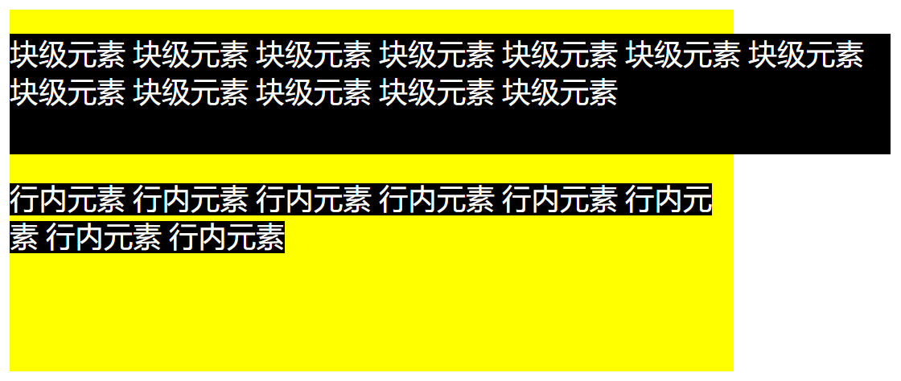
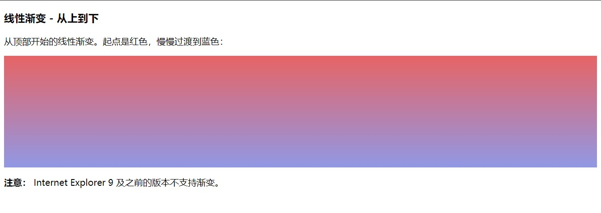

# 【CSS复合选择器、元素显示模式、背景】

> 本文档是个人对 Pink 老师课程的总结归纳及补充，转载请注明出处！ 


# 一、CSS的复合选择器

## 1.1 什么是复合选择器

在 CSS 中，可以根据选择器的类型把选择器分为：`基础选择器` 和 `复合选择器`，复合选择器是建立在基础选择器之上，对基础选择器进行**组合形成**的。

- 复合选择器可以更准确、更高效的选择目标元素（标签）
- 复合选择器是由两个或多个基础选择器，通过不同的方式组合而成的
- 常用的复合选择器包括：**后代选择器**、**子选择器**、**并集选择器**、**伪类选择器**等

## 1.2 后代选择器

`后代选择器` 又称为 `包含选择器`，可以选择父元素里面子元素。其写法就是把外层标签写在前面，内层标签写在后面，中间用空格分隔。当标签发生嵌套时，内层标签就成为外层标签的后代。

**语法：**

```css
元素1 元素2 { 样式声明 }
```

上述语法表示选择 元素 1 里面的**所有**元素 2 （后代元素）。 

**例如：**

```css
ul li { 样式声明 } 		/* 选择 ul 里面所有的 li 标签元素 */
```

- 元素1 和 元素2 中间用 **空格** 隔开
- 元素1 是父级，元素2 是子级，最终选择的是 元素2，即：元素1 是不会生效样式的
- 元素2 可以是儿子，也可以是孙子等，只要是 元素1 的后代即可
- 元素1 和 元素2 **可以是任意基础选择器**

```html
<!doctype html>
<html lang="en">

<head>
    <meta charset="UTF-8">
    <meta http-equiv="X-UA-Compatible" content="IE=edge">
    <meta name="viewport" content="width=device-width, initial-scale=1.0">
    <title>复合选择器之后代选择器</title>
    <style>
        /* 把 ol 里面的小 li 选出来改为 pink */
        ol li {
            color: pink;
        }

        /* 把 ol 里面的小 a 选出来改为 red */
        ol a {
            color: red;
        }

        /* 把 ul 里面的小 li 选出来改为 green */
        ul li {
            color: green;
        }

        /* 把 nav 类中的 li 里面的 a 选出来改为 yellow */
        .nav li a {
            color: yellow;
        }
    </style>
</head>

<body>
    <ol>
        <li>我是 ol 的孩子</li>
        <li>我是 ol 的孩子</li>
        <li>我是 ol 的孩子</li>
        <li><a href="#">我是 ol 的孙子</a></li>
    </ol>
    <ul>
        <li>我是 ul 的孩子</li>
        <li>我是 ul 的孩子</li>
        <li>我是 ul 的孩子</li>
        <li><a href="#">我是 ul 的孙子，但是我不会变化</a></li>
    </ul>
    <ul class="nav">
        <li><a href="#">我偏要变色！并且只能我一个人色……</a></li>
    </ul>
</body>

</html>
```

## 1.3 子选择器

子元素选择器（子选择器）只能选择作为某元素的**最近一级子元素**，简单理解就是选亲儿子元素。

注意：是**最近一级而并非最近一个**！

**语法：**

```css
元素1>元素2 { 样式声明 }
```

上述语法表示选择元素1 里面的所有直接后代（子元素）元素2。

**例如：**

```css
div>p { 样式声明 } 	/* 选择 div 里面所有最近一级 p 标签元素 */
```

- 元素1 和 元素2 中间用 **大于号** 隔开
- 元素1 是父级，元素2 是子级，最终选择的是元素2，即元素1 是不会生效样式的
- 元素2 **必须是亲儿子，其孙子、重孙之类都不归他管**，你也可以叫：亲儿子选择器

```html
<!doctype html>
<html lang="en">

<head>
    <meta charset="UTF-8">
    <meta http-equiv="X-UA-Compatible" content="IE=edge">
    <meta name="viewport" content="width=device-width, initial-scale=1.0">
    <title>复合选择器之子元素选择器</title>
    <style>
        .nav>a {
            color: red;
        }
    </style>
</head>

<body>
    <div class="nav">
        <a href="#">我是儿子1</a>
        <p>
            <a href="#">我是孙子1</a>
            <a href="#">我是孙子2</a>
        </p>
        <a href="#">我是儿子2</a>
    </div>
</body>

</html>
```

## 1.4 并集选择器

`并集选择器` 可以选择多组标签，同时为他们定义相同的样式，通常用于**集体声明**。
`并集选择器` 是各选择器通过**英文逗号** `,` 连接而成，任何形式的选择器都可以作为并集选择器的一部分。

**语法：**

```css
元素1, 元素2, 元素3 { 样式声明 }
```

```css
元素1,
元素2,
元素3 {
    样式声明
}
/* 推荐写法，编码风格 */
```

上述语法表示选择元素1、元素2 和 元素3。

**例如：**

```css
ul, div { 样式声明 }		 /* 选择 ul 和 div标签元素 */
```

- 元素1 和 元素2 中间用逗号隔开（最后一个不加逗号）
- 逗号可以理解为和的意思
- 并集选择器通常用于集体声明

```html
<!doctype html>
<html lang="en">

<head>
    <meta charset="UTF-8">
    <meta http-equiv="X-UA-Compatible" content="IE=edge">
    <meta name="viewport" content="width=device-width, initial-scale=1.0">
    <title>复合选择器之并集选择器</title>
    <style>
        /* 要求1：请把熊大和熊二改为粉色 */
        /* div,
        p {
            color: pink;
        } */

        /* 要求2：请把熊大和熊二改为红色，还有小猪一家改为粉色 */
        div,
        p,
        .pig li {
            color: pink;
        }
        /* 语法规范：并集选择器通常竖着写 */
    </style>
</head>

<body>
    <div>熊大</div>
    <p>熊二</p>
    <span>光头强</span>
    <ul class="pig">
        <li>小猪佩奇</li>
        <li>猪爸爸</li>
        <li>猪妈妈</li>
    </ul>
</body>

</html>
```

## 1.5 伪类选择器

`伪类选择器` 用于**向某些选择器添加特殊的效果**，比如：给链接添加特殊效果（链接伪类），或选择第 n 个元素（结构伪类）。
`伪类选择器` 书写最大的特点是用**冒号** `:` 表示，比如：`:hover`、`:first-child`。 
因为伪类选择器很多，比如：`链接伪类`、`结构伪类` 等，所以这里先讲解常用的链接伪类选择器。

> 伪类的由来：因为在页面中并没有这个真实存在的类，所以称为 “伪类”。

## 1.6 链接伪类选择器

**链接伪类选择器注意事项：**

- 为了确保生效且不冲突，请按照 `LVHA` 的顺序声明 `:link` `:visited` `:hover` `:active`

- 记忆法：love hate 或者 lv 包包 hao 

- 因为 a 链接在浏览器中具有默认样式，所以我们实际工作中都需要给链接单独指定样式

**链接伪类选择器实际工作开发中的写法：**

```css
/* a 是标签选择器 所有的链接 */
a {
	color: gray;
}

/* :hover 是链接伪类选择器 鼠标经过 */
a:hover {
	color: red; 	/* 鼠标经过的时候，由原来的 灰色 变成了红色 */
}
```

```html
<!doctype html>
<html lang="en">

<head>
    <meta charset="UTF-8">
    <meta http-equiv="X-UA-Compatible" content="IE=edge">
    <meta name="viewport" content="width=device-width, initial-scale=1.0">
    <title>复合选择器之链接伪类选择器</title>
    <style>
        /* 注意：要学会触类旁通，这里不只是可以改变颜色，当链接为图片时还可以改图片 */
        /* 1、a:link 把没有点击过的（访问过的）链接选出来 */
        a:link {
            color: #333;
            text-decoration: none;
        }

        /* 2、a:visited 选择点击过的（访问过的）链接选出来 */
        a:visited {
            color: orange;
        }

        /* 3、a:hover 选择鼠标经过（停留）的那个链接 */
        a:hover {
            color: skyblue;
        }

        /* 4、a:active 选择的是我们鼠标正在按下还没有弹起鼠标的那个链接 */
        a:active {
            color: green;
        }
    </style>
</head>

<body>
    <a href="#">小猪佩奇</a>
</body>

</html>
```


> 注意：`:hover` `:active` 也适用于其他标签元素。

## 1.7 :focus伪类选择器

`:focus` 伪类选择器用于选取获得焦点的表单元素。

焦点就是光标，一般情况 `<input>` 类表单元素才能获取，因此这个选择器也主要针对于表单元素来说。

```css
input:focus {
	background-color: yellow;
}
```

```html
<!doctype html>
<html lang="en">

<head>
    <meta charset="UTF-8">
    <meta http-equiv="X-UA-Compatible" content="IE=edge">
    <meta name="viewport" content="width=device-width, initial-scale=1.0">
    <title>复合选择器之focus伪类选择器</title>
    <style>
        /* 把获得光标的 input 表单元素选区出来 */
        input:focus {
            background-color: pink;
            color: red;
        }
    </style>
</head>

<body>
    <input type="text">
    <input type="text">
    <input type="text">
</body>

</html>
```


## 1.8 复合选择器总结

| 选择器          | 作用                   | 特征             | 使用情况 | 隔开符号及用法                             |
| --------------- | ---------------------- | ---------------- | -------- | ------------------------------------------ |
| 后代选择器      | 用来选择后代元素       | 可以是子孙后代   | 较多     | 符号是空格 `.nav a`                        |
| 子代选择器      | 选择最近一级元素       | 只选亲儿子       | 较少     | 符号是大于 `.nav>p`                        |
| 并集选择器      | 选择某些相同样式的元素 | 可以用于集体声明 | 较多     | 符号是逗号 `.nav`, `.header`               |
| 链接伪类选择器  | 选择不同状态的链接     | 跟链接相关       | 较多     | 重点记住 `a{}` 和 `a:hover` 实际开发的写法 |
| `:focus` 选择器 | 选择获得光标的表单     | 跟表单相关       | 较少     | `input:focus` 记住这个写法                 |

强调：复合选择器的层级写得越细越好（可读性，可维护性，安全性），同时将复合选择器的层级写得越细，可以提前避免大部分的选择器优先级混乱！

# 二、CSS 的元素显示模式

## 2.1 什么是元素显示模式

**作用：**网页的标签非常多，在不同地方会用到不同类型的标签，了解他们的特点可以更好的布局我们的网页。

`元素显示模式` 就是元素（标签）以什么方式进行显示，比如 `<div>` 自己占一行，比如一行可以放多个 `<span>`。

HTML 元素一般分为 `块元素` 和 `行内元素` 两种类型。

## 2.2 块元素

常见的块元素有 `<h1> ~ <h6>`、`<p>`、`<div>`、`<ul>`、`<ol>`、`<li>`、`<dl>`、`<dt>`、`<dd>`、`<table>`、`<tr>`、`<form>` 等，其中  `<div>` 标签是最典型的块元素。

**块级元素的特点：**

- 比较霸道，自己独占一行
- 高度，宽度、外边距以及内边距都可以控制
- 宽度默认是容器（父级宽度）的 100%
- 是一个容器及盒子，里面可以放行内或者块级元素

**注意：**

- 文字类的块级元素内不能放置块级元素，会发生语法错误
- `<p>` 标签主要用于存放文字，因此 `<p>` 里面不能放块级元素，特别是不能放 `<div>`
- 同理， `<h1> ~ <h6>` 等都是文字类块级标签，里面也不能放其他块级元素

## 2.3 行内元素

常见的行内元素有 `<a>`、`<span>`、`<em>`、`<strong>` 等，其中 `<span>` 标签是最典型的行内元素，有的地方也将行内元素称为内联元素。

**行内元素的特点：**

- 相邻行内元素在一行上，一行可以显示多个

- 高、宽直接设置是无效的

- 默认宽度就是它本身内容的宽度

- 行内元素只能容纳文本或其他行内元素（a 除外）

**注意：**

- 链接里面不能再放链接
- 特殊情况链接 `<a>` 里面可以放块级元素，但是给 `<a>` 转换一下块级模式最安全

## 2.4 行内块元素

在行内元素中有几个特殊的标签：``、`<input>`、`<th>`、`<td>`，它们同时具有 `块元素` 和 `行内元素` 的特点，有些资料称它们为 `行内块元素`。

**行内块元素的特点：**

- 和相邻行内元素（行内块）在一行上，但是他们之间会有空白缝隙。一行可以显示多个（行内元素特点）
- 默认宽度就是它本身内容的宽度（行内元素特点）
- 高度，行高、外边距以及内边距都可以控制（块级元素特点）

## 2.5 元素显示模式总结

| 元素模式   | 元素排列               | 设置样式                 | 默认宽度         | 包含                   |
| ---------- | ---------------------- | ------------------------ | ---------------- | ---------------------- |
| 块级元素   | 一行只能放一个块级元素 | 可以设置宽度和高度       | 容器的 100%      | 容量级可以包含任何标签 |
| 行内元素   | 一行可以放多个行内元素 | 不可以直接设置宽度和高度 | 它本身内容的宽度 | 容纳文本或其他行内元素 |
| 行内快元素 | 一行放多个行内块元素   | 可以设置宽度和高度       | 它本身内容的宽度 |                        |

学习元素显示模式的主要目的是分清它们各自的特点，当我们网页布局的时候，在合适的地方用合适的标签元素。

## 2.6 元素显示模式转换

特殊情况下，我们需要元素模式的转换，简单理解: 一个模式的元素需要另外一种模式的特性
比如：想要增加链接 `<a>` 的触发范围。

- 转换为块元素：`display: block;`（由于经常需要设置宽高，所以通常会将行内元素转换为块元素）
- 转换为行内元素：`display: inline;`
- 转换为行内块：`display: inline-block;`（常用）

```html
<!doctype html>
<html lang="en">

<head>
    <meta charset="UTF-8">
    <meta http-equiv="X-UA-Compatible" content="IE=edge">
    <meta name="viewport" content="width=device-width, initial-scale=1.0">
    <title>元素显示模式之显示模式的转换</title>
    <style>
        a {
            width: 150px;
            height: 50px;
            background-color: orange;
            /* 把行内元素 a 转换为 块级元素 */
            display: block;
        }

        div {
            width: 300px;
            height: 100px;
            background-color: black;
            color: white;
            /* 把 div 块级元素转化为行内元素 */
            display: inline;
        }

        span {
            width: 300px;
            height: 30px;
            background-color: skyblue;
            /* 行内元素转化为行内块元素 */
            display: inline-block;
        }
    </style>
</head>

<body>
    <a href="#">我是行内元素</a>
    <a href="#">我是行内元素</a>
    <div>我是块级元素</div>
    <div>我是块级元素</div>
    <span>行内元素转化为行内块元素</span>
    <span>行内元素转化为行内块元素</span>
</body>

</html>
```


## 2.7 简洁版小米侧边栏案例

```html
<!doctype html>
<html lang="zh-CN">

<head>
    <meta charset="UTF-8">
    <meta http-equiv="X-UA-Compatible" content="IE=edge">
    <meta name="viewport" content="width=device-width, initial-scale=1.0">
    <title>简洁版小米侧边栏案例</title>
    <style>
        /* 1、把 a 转换为块级元素 */
        a {
            display: block;
            width: 230px;
            height: 40px;
            background-color: #55585a;
            font-size: 14px;
            color: #fff;
            text-decoration: none;
            text-indent: 2em;
            /* 一个小技巧：单行文字垂直居中的代码，让文字的行高等于盒子的高度 */
            line-height: 40px;
        }

        /* 2、鼠标经过链接变换背景颜色 */
        a:hover {
            background-color: #ff6700;
        }
    </style>
</head>

<body>
    <!--
    说明：在实际开发中，为了避免链接堆叠，从而降低浏览器排名
    开发中一般都将这些链接放在无序列表中，这里只是为了方便演示才这样使用
	-->
    <a href="#">手机 电话卡</a>
    <a href="#">电视 盒子</a>
    <a href="#">笔记本 平板</a>
    <a href="#">出行 穿戴</a>
    <a href="#">智能 路由器</a>
    <a href="#">健康 儿童</a>
    <a href="#">耳机 音响</a>
</body>

</html>
```


## 2.8 小技巧：单行文字垂直居中

CSS 没有给我们提供文字垂直居中的代码，这里我们可以使用一个小技巧来实现。

**解决方案：**让 `文字的行高` 等于 `盒子的高度` 就可以让文字在当前盒子内垂直居中。

**简单理解：**行高的上空隙和下空隙把文字挤到中间了，如果行高小于盒子高度，文字会偏上，如果行高大于盒子高度，则文字偏下。

## 2.9 一个注意点：块级元素不会自动换行

当块级元素的宽度超过其父元素宽度时，其不会发生换行。

```html
<!doctype html>
<html lang="en">
<head>
    <meta charset="UTF-8">
    <meta content="width=device-width, user-scalable=no, initial-scale=1.0, maximum-scale=1.0, minimum-scale=1.0"
          name="viewport">
    <meta content="ie=edge" http-equiv="X-UA-Compatible">
    <title>块级元素不会自动换行</title>
    <style>
        .clearfix:before,
        .clearfix:after {
            content: "";
            display: table;
        }

        .clearfix:after {
            clear: both;
        }

        .clearfix {
            *zoom: 1;
        }

        div {
            background-color: #FFFF00;
            width: 600px;
            height: 300px;
            color: #FFFFFF;
            font-size: 24px;
        }

        .div {
            background-color: #000;
            width: 730px;
            height: 100px;
            margin: 20px 0;
        }

        span {
            background-color: #000;
            width: 700px;
            height: 100px;
            margin: 20px 0;
        }
    </style>
</head>
<body>
<div class="clearfix">
    <div class="div">块级元素 块级元素 块级元素 块级元素 块级元素 块级元素 块级元素 块级元素 块级元素 块级元素 块级元素 块级元素</div>
    <span>行内元素 行内元素 行内元素 行内元素 行内元素 行内元素 行内元素 行内元素</span>
</div>
</body>
</html>
```



# 三、CSS 的背景

通过 CSS 背景属性，可以给页面元素添加背景样式。
背景属性可以设置 `背景颜色`、`背景图片`、`背景平铺`、`背景图片位置`、`背景图像固定` 等。

## 3.1 背景颜色

`background-color` 属性定义了元素的背景颜色。

```css
background-color: 颜色值;
```

一般情况下元素背景颜色默认值是 `transparent`（透明），我们也可以手动指定背景颜色为透明色。

```css
background-color: transparent;
```

目前 CSS 还支持丰富的渐变色，但是某些浏览器不支持，这里了解即可，具体内容请查阅资料。

```html
<!doctype html>
<html lang="zh-CN">

<head>
    <meta charset="UTF-8">
    <meta http-equiv="X-UA-Compatible" content="IE=edge">
    <meta name="viewport" content="width=device-width, initial-scale=1.0">
    <title>渐变</title>
    <style>
        #grad1 {
            height: 200px;
            /* 浏览器不支持时显示 */
            background-color: red;
            /* 线性渐变 - 从上到下（默认情况下）*/
            background-image: linear-gradient(#e66465, #9198e5);
        }
    </style>
</head>

<body>
    <h3>线性渐变 - 从上到下</h3>
    <p>从顶部开始的线性渐变。起点是红色，慢慢过渡到蓝色：</p>

    <div id="grad1"></div>

    <p><strong>注意：</strong> Internet Explorer 9 及之前的版本不支持渐变。</p>
</body>

</html>
```



## 3.2 背景图片

`background-image` 属性描述了元素的背景图像，实际开发常用于 **logo** 或者一些**装饰性的小图片**或者是**超大的背景图片**, 优点是非常便于控制位置（精灵图也是一种运用场景）。

```css
background-image : none | url(url)
```

| 参数值 | 作用                           |
| ------ | ------------------------------ |
| `none` | 无背景图（默认的）             |
| `url`  | 使用绝对或相对地址指定背景图像 |

注意：背景图片后面的地址，千万不要忘记加 URL， 同时里面的路径不要加引号。

```css
background-color: pink;
background-image: url(../images/logo.png);
/* 1、背景图片不平铺 */
/* background-repeat: no-repeat; */
/* 2、默认情况下，背景图片是平铺的 */
/* background-repeat: repeat; */ /* 页面元素既可以添加背景颜色也可以添加背景图片，只不过背景图片区域会覆盖背景颜色 */
```

## 3.3 背景平铺

如果需要在 HTML 页面上对背景图像进行平铺，可以使用 `background-repeat` 属性。

注：平铺可以简单的理解为“重复”。

```css
background-repeat: repeat | no-repeat | repeat-x | repeat-y
```

| 参数值      | 作用                                 |
| ----------- | ------------------------------------ |
| `repeat`    | 背景图像在纵向和横向上平铺（默认的） |
| `no-repeat` | 背景图像不平铺                       |
| `repeat-x`  | 背景图像在横向上平铺                 |
| `repeat-y`  | 背景图像在纵向上平铺                 |

## 3.4 背景图片位置

利用 `background-position` 属性可以改变图片在背景中的位置。

```css
background-position: x y;
```

参数代表的意思是：x 坐标 和 y 坐标，可以使用 `方位名词` 或者 `精确单位`。

| 参数值     | 说明                                              |
| ---------- | ------------------------------------------------- |
| `length`   | 百分数 \| 由浮点数字和单位标识符组成的长度值      |
| `position` | top \| center \| bottom \| left \| rigth 方位名词 |

- 参数是方位名词
  - 如果指定的两个值都是方位名词，则两个值前后顺序无关，比如 left top 和 top left 效果一致
  - 如果只指定了一个方位名词，另一个值省略，则**第二个值默认居中对齐**


- 参数是精确单位
  - 如果参数值是精确坐标，那么第一个肯定是 x 坐标，第二个一定是 y 坐标
  - 如果只指定一个数值，那该数值一定是 x 坐标，**另一个默认垂直居中**


- 参数是混合单位
  - 如果指定的两个值是精确单位和方位名词混合使用，则第一个值是 x 坐标，第二个值是 y 坐标

## 3.5 背景图像固定（背景附着）

`background-attachment` 属性设置背景图像是否固定或者随着页面的其余部分滚动。

`background-attachment` 后期可以制作 `视差滚动` 的效果。

```css
background-attachment : scroll | fixed
```

| 参数     | 作用                                                       |
| -------- | ---------------------------------------------------------- |
| `scroll` | 背景图像是随对象内容滚动的（可见区域取决于背景图像的高度） |
| `fixed`  | 背景图像固定                                               |

```html
<!doctype html>
<html lang="en">

<head>
    <meta charset="UTF-8">
    <meta http-equiv="X-UA-Compatible" content="IE=edge">
    <meta name="viewport" content="width=device-width, initial-scale=1.0">
    <title>超大背景图片</title>
    <style>
        body {
            background-image: url(images/bg.jpg);
            background-repeat: no-repeat;
            background-position: center top;
            /* 把背景图片固定住 */
            background-attachment: fixed;
            color: #fff;
            font-size: 20px;
        }
    </style>
</head>

<body>
    <p>天王盖地虎, pink老师一米五</p>
    <p>天王盖地虎, pink老师一米五</p>
    <p>天王盖地虎, pink老师一米五</p>
    <p>天王盖地虎, pink老师一米五</p>
    <p>天王盖地虎, pink老师一米五</p>
    <p>天王盖地虎, pink老师一米五</p>
    <p>天王盖地虎, pink老师一米五</p>
    <p>天王盖地虎, pink老师一米五</p>
    <p>天王盖地虎, pink老师一米五</p>
    <p>天王盖地虎, pink老师一米五</p>
    <p>天王盖地虎, pink老师一米五</p>
    <p>天王盖地虎, pink老师一米五</p>
    <p>天王盖地虎, pink老师一米五</p>
    <p>天王盖地虎, pink老师一米五</p>
    <p>天王盖地虎, pink老师一米五</p>
    <p>天王盖地虎, pink老师一米五</p>
    <p>天王盖地虎, pink老师一米五</p>
    <p>天王盖地虎, pink老师一米五</p>
    <p>天王盖地虎, pink老师一米五</p>
    <p>天王盖地虎, pink老师一米五</p>
    <p>天王盖地虎, pink老师一米五</p>
    <p>天王盖地虎, pink老师一米五</p>
    <p>天王盖地虎, pink老师一米五</p>
    <p>天王盖地虎, pink老师一米五</p>
    <p>天王盖地虎, pink老师一米五</p>
    <p>天王盖地虎, pink老师一米五</p>
    <p>天王盖地虎, pink老师一米五</p>
    <p>天王盖地虎, pink老师一米五</p>
    <p>天王盖地虎, pink老师一米五</p>
    <p>天王盖地虎, pink老师一米五</p>
    <p>天王盖地虎, pink老师一米五</p>
    <p>天王盖地虎, pink老师一米五</p>
    <p>天王盖地虎, pink老师一米五</p>
    <p>天王盖地虎, pink老师一米五</p>
    <p>天王盖地虎, pink老师一米五</p>
    <p>天王盖地虎, pink老师一米五</p>
    <p>天王盖地虎, pink老师一米五</p>
    <p>天王盖地虎, pink老师一米五</p>
    <p>天王盖地虎, pink老师一米五</p>
    <p>天王盖地虎, pink老师一米五</p>
    <p>天王盖地虎, pink老师一米五</p>
    <p>天王盖地虎, pink老师一米五</p>
    <p>天王盖地虎, pink老师一米五</p>
    <p>天王盖地虎, pink老师一米五</p>
    <p>天王盖地虎, pink老师一米五</p>
    <p>天王盖地虎, pink老师一米五</p>
    <p>天王盖地虎, pink老师一米五</p>
</body>

</html>
```


## 3.6 背景复合写法

为了简化背景属性的代码，我们可以将这些属性合并简写在同一个属性 `background` 中，从而节约代码量。
当使用简写属性时，没有特定的书写顺序，一般习惯约定顺序为：
`background`: `背景颜色` `背景图片地址` `背景平铺` `背景图像滚动` `背景图片位置`

```css
background: transparent url(image.jpg) no-repeat fixed top;
```

这是实际开发中，我们更提倡的写法。

## 3.7 背景色半透明

CSS3 为我们提供了背景颜色半透明的效果。

```css
background: rgba(0, 0, 0, 0.3);
```

- 最后一个参数是 `alpha` 透明度，取值范围在 `0~1` 之间
- 习惯把 0.3 的 0 省略掉，写为 `background: rgba(0, 0, 0, .3);`
- 注意：背景半透明是指盒子背景半透明，盒子里面的内容不受影响
- CSS3 新增属性，是 IE9+ 版本浏览器才支持的
- 但是现在实际开发，我们不太关注兼容性写法了，可以放心使用

```html
<!doctype html>
<html lang="en">

<head>
    <meta charset="UTF-8">
    <meta http-equiv="X-UA-Compatible" content="IE=edge">
    <meta name="viewport" content="width=device-width, initial-scale=1.0">
    <title>背景色透明写法</title>
    <style>
        div {
            width: 300px;
            height: 300px;
            /* background-color: black; */
            background: rgba(0, 0, 0, .3);
        }
    </style>
</head>

<body>
    <!-- 只是让背景颜色半透明，盒子里的内容并不受影响 -->
    <div>zhoujirui</div>
</body>

</html>
```

## 3.8 背景总结

| 属性                   | 作用           | 值                                               |
| ---------------------- | -------------- | ------------------------------------------------ |
| `backgroud-color`      | 背景颜色       | 预定义的颜色值 / 十六进制 / RGB代码              |
| `backgroud-image`      | 背景图片       | url（图片路径）                                  |
| `backgroud-repeat`     | 是否平铺       | repeat / no-repeat / repeat-x / repeat-y         |
| `backgroud-position`   | 背景位置       | length / position 分别是 x 和 y 坐标             |
| `backgroud-attachment` | 背景附着       | scroll（背景滚动）/ fixed（背景固定）            |
| `背景简写`             | 书写更简单     | 背景颜色 背景图片地址 背景平铺 背景滚动 背景位置 |
| `背景色半透明`         | 背景颜色半透明 | background: rgba(0, 0, 0, 0.3); 后面必须是4个值  |

背景图片：实际开发常见于 logo 或者一些装饰性的小图片或者是超大的背景图片，优点是非常便于控制位置（精灵图也是一种运用场景）。

## 3.9 王者荣耀案例

```html
<!doctype html>
<html lang="en">

<head>
    <meta charset="UTF-8">
    <meta http-equiv="X-UA-Compatible" content="IE=edge">
    <meta name="viewport" content="width=device-width, initial-scale=1.0">
    <title>背景位置案例一之王者荣耀点击选项</title>
    <style>
        /* 对于 logo 图片来说，最常用的方法便是利用背景来设置，而并非直接插入图片 */
        h3 {
            width: 118px;
            height: 40px;
            font-size: 14px;
            font-weight: 400;
            line-height: 40px;
            background-image: url(../image/icon.png);
            background-repeat: no-repeat;
            background-position: left center;
            text-indent: 2em;
        }

        h3 a {
            color: #000;
            text-decoration: none;
        }
    </style>
</head>

<body>
    <h3><a href="#">成长守护平台</a></h3>
</body>

</html>
```


```html
<!doctype html>
<html lang="en">

<head>
    <meta charset="UTF-8">
    <meta http-equiv="X-UA-Compatible" content="IE=edge">
    <meta name="viewport" content="width=device-width, initial-scale=1.0">
    <title>背景位置案例二之王者荣耀背景图片</title>
    <style>
        body {
            background-image: url(../image/b.jpg);
            background-repeat: no-repeat;
            background-position: center top;
        }
    </style>
</head>

<body>
    <!-- 对于网页中的大面积图片而言，一般不采用直接插入图片的方式来做，
    因为图片的分辨率及尺寸是固定的但是显示器或网页窗口的大小分辨率则是会改变的，
    直接插入图片的话不方便控制图片大小及位置 -->
    <!--  -->
</body>

</html>
```

