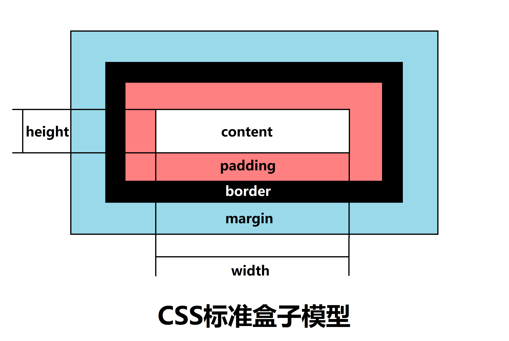
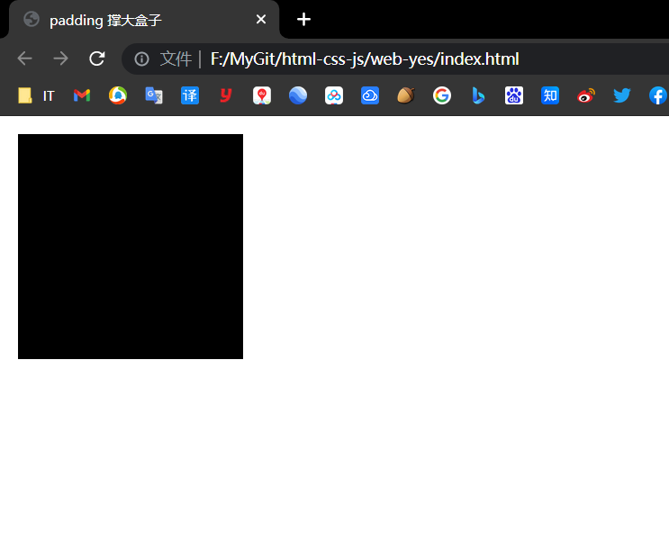
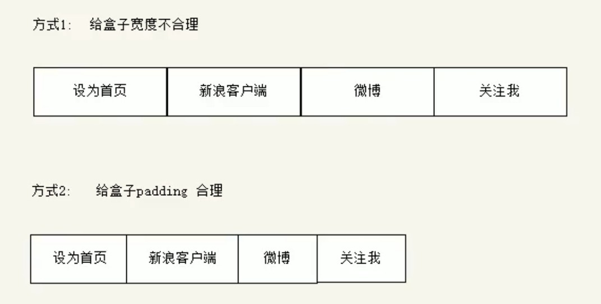
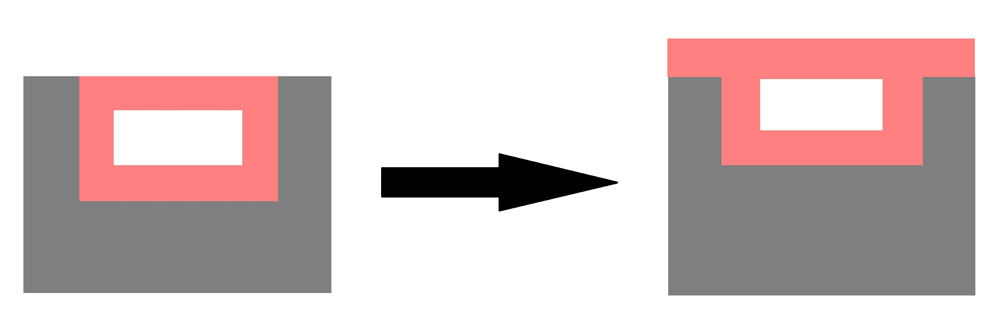
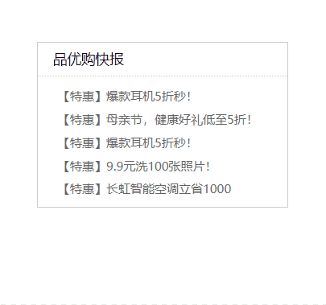

# 【CSS盒子模型】

> 本学习笔记是个人对 Pink 老师课程的总结归纳，转载请注明出处！ 

页面布局要学习**三大核心**：**盒子模型**、**浮动**和**定位**。

学习好盒子模型能非常好的帮助我们布局页面。

# 一、看透网页布局的本质

网页布局过程：

- 先准备好相关的网页元素，网页元素基本都是盒子

- 利用 CSS 设置好盒子样式，然后摆放到相应位置

- 往盒子里面装内容

网页**布局的核心**本质： 就是**利用 CSS 摆盒子！**

# 二、盒子模型（Box Model）组成

所谓盒子模型：就是把 HTML 页面中的布局元素看作是一个矩形的盒子，也就是一个盛**装内容的容器**。
CSS 盒子模型本质上是一个盒子，封装周围的 HTML 元素，它包括：`边框`、`外边距`、`内边距`、和 `内容`。



# 三、边框（border）

`border` 可以设置元素的边框。

边框有三部分组成：`边框宽度（粗细）`、`边框样式`、`边框颜色`。

**语法：**

```css
border: border-width || border-style || border-color
```

| 属性           | 作用                      |
| -------------- | ------------------------- |
| `border-width` | 定义边框粗细，单位是 `px` |
| `border-style` | 边框的样式                |
| `border-color` | 边框颜色                  |


边框样式 border-style 可以设置如下值：

- `none`：没有边框，即忽略所有边框的宽度（默认值）
- `solid`：边框为单实线（最为常用的）
- `dashed`：边框为虚线
- `dotted`：边框为点线

**边框简写：**

```css
border: 1px solid red; 	/* 没有顺序 */
```

**边框分开写法：**

```css
border-top: 1px solid red; 		/* 只设定上边框，其余同理 */
```

**案例：**

```html
<!DOCTYPE html>
<html lang="en">

<head>
    <meta charset="UTF-8">
    <meta http-equiv="X-UA-Compatible" content="IE=edge">
    <meta name="viewport" content="width=device-width, initial-scale=1.0">
    <title>盒子模型之边框的复合写法</title>
    <style>
        div {
            width: 300px;
            height: 200px;
            /* 
            -- border-width 边框的粗细，一般情况下使用 px --
            border-width: 5px;
            -- border-width 边框的样式 solid 实线边框 dashed 虚线边框 dotted 点线边框 --
            border-style: solid;
            background-color: pink;
            */
            /* 边框的复合写法 简写： */
            border: 10px dotted skyblue;
            /* 利用 CSS 层叠性将上边框单独覆盖 */
            border-top: 10px dotted pink;
            background-color: black;
        }
    </style>
</head>

<body>
    <div></div>
</body>

</html>
```


## 3.1 表格的细线边框

表格中两个单元格相邻的边框会重叠在一起，呈现出加粗的效果。

```html
<!DOCTYPE html>
<html lang="en">

<head>
    <meta charset="UTF-8">
    <meta http-equiv="X-UA-Compatible" content="IE=edge">
    <meta name="viewport" content="width=device-width, initial-scale=1.0">
    <title>表格边框——今日小说排行榜</title>
    <style>
        table {
            width: 500px;
            height: 249px;
        }

        th {
            height: 35px;
        }

        table,
        td,
        th {
            border: 1px solid black;
            /* 合并相邻的边框 */
            /* border-collapse: collapse; */
            font-size: 14px;
            text-align: center;
        }
    </style>
</head>

<body>
    <table align="center" cellspacing="0">
        <thead>
            <tr>
                <th>排名</th>
                <th>关键词</th>
                <th>趋势</th>
                <th>进入搜索</th>
                <th>最近七日</th>
                <th>相关链接</th>
            </tr>
        </thead>
        <tbody>
            <tr>
                <td>1</td>
                <td>鬼吹灯</td>
                <td></td>
                <td>456</td>
                <td>123</td>
                <td> <a href="#">贴吧</a> <a href="#">图片</a> <a href="#">百科</a> </td>
            </tr>

            <tr>
                <td>1</td>
                <td>鬼吹灯</td>
                <td></td>
                <td>456</td>
                <td>123</td>
                <td> <a href="#">贴吧</a> <a href="#">图片</a> <a href="#">百科</a> </td>
            </tr>
            <tr>
                <td>3</td>
                <td>西游记</td>
                <td></td>
                <td>456</td>
                <td>123</td>
                <td> <a href="#">贴吧</a> <a href="#">图片</a> <a href="#">百科</a> </td>
            </tr>
            <tr>
                <td>1</td>
                <td>鬼吹灯</td>
                <td></td>
                <td>456</td>
                <td>123</td>
                <td> <a href="#">贴吧</a> <a href="#">图片</a> <a href="#">百科</a> </td>
            </tr>
            <tr>
                <td>1</td>
                <td>鬼吹灯</td>
                <td></td>
                <td>456</td>
                <td>123</td>
                <td> <a href="#">贴吧</a> <a href="#">图片</a> <a href="#">百科</a> </td>
            </tr>
            <tr>
                <td>1</td>
                <td>鬼吹灯</td>
                <td></td>
                <td>456</td>
                <td>123</td>
                <td> <a href="#">贴吧</a> <a href="#">图片</a> <a href="#">百科</a> </td>
            </tr>
        </tbody>
    </table>
</body>

</html>
```


border-collapse 属性控制浏览器绘制表格边框的方式。

它控制相邻单元格的边框。

**语法：**

```css
border-collapse: collapse;
```

- `collapse` 单词是合并的意思
- `border-collapse: collapse;` 表示相邻边框合并在一起

```css
	table,
	td,
	th {
	    border: 1px solid black;
	    /* 合并相邻的边框 */
	    border-collapse: collapse;
	    font-size: 14px;
	    text-align: center;
	}
```


## 3.2 边框会影响盒子实际大小

边框会额外增加盒子的实际大小。因此我们有两种方案解决：

- 测量盒子大小的时候，不量边框
- 如果测量的时候包含了边框，则需要 width、height 减去边框宽度（注意减单边还是双边）

> 注意：盒子实际大小 = 内容区大小 + 内边距大小 + 边框大小 + 外边距大小

案例：

```html
<!DOCTYPE html>
<html lang="en">

<head>
    <meta charset="UTF-8">
    <meta http-equiv="X-UA-Compatible" content="IE=edge">
    <meta name="viewport" content="width=device-width, initial-scale=1.0">
    <title>边框会影响盒子的实际大小</title>
    <style>
        /* 我们需要一个 200*200 的盒子, 但是这个盒子有 10 像素的红色边框 */
        div {
            width: 180px;
            height: 180px;
            background-color: pink;
            border: 10px solid black;
        }
    </style>
</head>

<body>
    <div></div>
</body>

</html>
```


# 四、内边距（padding）

padding 属性用于设置**内边距**，即**边框与内容之间的距离**。

| 属性             | 作用     |
| ---------------- | -------- |
| `padding-left`   | 左内边距 |
| `padding-rigth`  | 右内边距 |
| `padding-top`    | 上内边距 |
| `padding-bottom` | 下内边距 |

padding 属性（简写属性）可以有一到四个值。

| 值的个数                       | 表达意思                                                     |
| ------------------------------ | ------------------------------------------------------------ |
| `padding: 5px;`                | 1 个值，代表上下左右都有 5 像素内边距                        |
| `padding: 5px 10px;`           | 2 个值，代表上下内边距是 5 像素，左右内边距是 10 像素        |
| `padding: 5px 10px 20px;`      | 3 个值，代码上内边距 5 像素，左右内边距 10 像素，下内边距 20 像素 |
| `padding: 5px 10px 20px 30px;` | 4 个值，上是 5 像素，右 10 像素，下 20 像素，左是 30 像素（顺时针） |

以上 4 种情况，我们实际开发都会遇到。

当我们给盒子指定 `padding` 值之后，发生了 2 件事情：

- 内容和边框有了距离，添加了内边距
- `padding` 影响了盒子实际大小

也就是说，如果盒子已经有了宽度和高度，此时再指定内边距，会撑大盒子！

解决方案：

- 如果保证盒子跟效果图大小保持一致，则让 width、height 减去多出来的内边距大小即可
- 如何盒子本身没有指定 width、height 属性，则此时 padding 不会撑开盒子大小

【padding 撑大盒子】

```html
<!DOCTYPE html>
<html lang="en">

<head>
    <meta charset="UTF-8">
    <meta http-equiv="X-UA-Compatible" content="IE=edge">
    <meta name="viewport" content="width=device-width, initial-scale=1.0">
    <title>padding 撑大盒子</title>
    <style>
        div {
            background-color: #000;
            width: 100px;
            height: 100px;
            /* padding: 30px; */
        }
    </style>
</head>

<body>
    <div></div>
</body>

</html>
```



```html
<!DOCTYPE html>
<html lang="en">

<head>
    <meta charset="UTF-8">
    <meta http-equiv="X-UA-Compatible" content="IE=edge">
    <meta name="viewport" content="width=device-width, initial-scale=1.0">
    <title>padding 撑大盒子</title>
    <style>
        div {
            background-color: #000;
            width: 100px;
            height: 100px;
            padding: 30px;
        }
    </style>
</head>

<body>
    <div></div>
</body>

</html>
```


案例：

```html
<!DOCTYPE html>
<html lang="en">

<head>
    <meta charset="UTF-8">
    <meta http-equiv="X-UA-Compatible" content="IE=edge">
    <meta name="viewport" content="width=device-width, initial-scale=1.0">
    <title>盒子模型之内边距</title>
    <style>
        div {
            width: 200px;
            height: 200px;
            background-color: pink;
            /*
            padding-top: 5px;
            padding-rigth: 10px;
            padding-bottom: 20px;
            padding-rigth: 30px;
             */
            /* 内边距复合写法（简写） 上、右、下、左 */
            padding: 5px 10px 20px 30px;
            /* 由于在对盒子指定高宽后，padding 会撑大盒子 */
            /* 所以，此时盒子大小为：240*225 */
            /* 注意：这里的“盒子大小”指的是盒子所占据的大小，盒子真实的 width 和 height 依旧是 200px */
        }
    </style>
</head>

<body>
    <div>
        盒子内容是 content，盒子内容是 content，盒子内容是 content
    </div>
</body>

</html>
```

padding 的使用技巧：



```html
<!DOCTYPE html>
<html lang="en">

<head>
    <meta charset="UTF-8">
    <meta http-equiv="X-UA-Compatible" content="IE=edge">
    <meta name="viewport" content="width=device-width, initial-scale=1.0">
    <title>新浪导航案例-padding影响盒子的好处</title>
    <style>
        .nav {
            height: 41px;
            border-top: 3px solid #ff8500;
            border-bottom: 1px solid #edeef0;
            background-color: #fcfcfc;
            line-height: 41px;
        }

        .nav a {
            /* a 属于行内元素，要指定高度，必须要转换为行内块元素 */
            display: inline-block;
            height: 41px;
            /* 没有指定宽度，此时设置 padding 会使盒子内容之间的距离相同 */
            padding: 0 20px;
            font-size: 12px;
            color: #4c4c4c;
            text-decoration: none;
        }

        .nav a:hover {
            background-color: #eee;
            color: #ff8500;
        }
    </style>
</head>

<body>
    <div class="nav">
        <a href="#">设为首页</a>
        <a href="#">手机新浪网</a>
        <a href="#">移动客户端</a>
        <a href="#">登录</a>
        <a href="#">微博</a>
        <a href="#">博客</a>
        <a href="#">邮箱</a>
        <a href="#">网站导航</a>
    </div>
</body>

</html>
```


```html
<!DOCTYPE html>
<html lang="zh-CN">

<head>
    <meta charset="UTF-8">
    <meta http-equiv="X-UA-Compatible" content="IE=edge">
    <meta name="viewport" content="width=device-width, initial-scale=1.0">
    <title>简洁版小米侧边栏案例-padding影响盒子大小计算</title>
    <style>
        a {
            /* 1、把 a 转换为块级元素 */
            display: block;
            /* 230 - 30（padding-left）= 200 */
            width: 200px;
            height: 40px;
            background-color: #55585a;
            font-size: 14px;
            color: #fff;
            text-decoration: none;
            padding-left: 30px;
            /* 一个小技巧：单行文字垂直居中的代码，让文字的行高等于盒子的高度 */
            line-height: 40px;
        }

        /* 2、鼠标经过链接变换背景颜色 */
        a:hover {
            background-color: #ff6700;
        }
    </style>
</head>

<body>
    <a href="#">手机 电话卡</a>
    <a href="#">电视 盒子</a>
    <a href="#">笔记本 平板</a>
    <a href="#">出行 穿戴</a>
    <a href="#">智能 路由器</a>
    <a href="#">健康 儿童</a>
    <a href="#">耳机 音响</a>
</body>

</html>
```


# 五、外边距（margin）

`margin` 属性用于设置**外边距**，即控制**盒子和盒子之间的距离**。

| 属性            | 作用     |
| --------------- | -------- |
| `margin-left`   | 左外边距 |
| `margin-right`  | 右外边距 |
| `margin-top`    | 上外边距 |
| `margin-bottom` | 下外边距 |

`margin` 简写方式代表的意义跟 `padding` 完全一致。

外边距典型应用：

外边距可以让**块级盒子水平居中**，但是必须满足两个条件：

- 盒子必须指定了宽度 `width`
- 盒子左右的外边距都设置为 `auto`

```css
.header { width: 960px; margin: 0 auto;}
```

常见的写法，以下三种都可以：

- `margin-left: auto; margin-right: auto;`
- `margin: auto;`
- `margin: 0 auto;`

注意：以上方法是让块级元素水平居中，行内元素或者行内块元素水平居中给其父元素添加 `text-align: center` 即可。

案例：

```html
<!DOCTYPE html>
<html lang="en">

<head>
    <meta charset="UTF-8">
    <meta http-equiv="X-UA-Compatible" content="IE=edge">
    <meta name="viewport" content="width=device-width, initial-scale=1.0">
    <title>盒子模型之外边距margin</title>
    <style>
        div {
            width: 200px;
            height: 200px;
            background-color: pink;
        }

        /* 
        .one {
            margin-bottom: 20px;
        } 
        */

        .two {
            margin-top: 20px;
        }
    </style>
</head>

<body>
    <div class="one">1</div>
    <div class="two">2</div>
</body>

</html>
```


```html
<!DOCTYPE html>
<html lang="en">

<head>
    <meta charset="UTF-8">
    <meta http-equiv="X-UA-Compatible" content="IE=edge">
    <meta name="viewport" content="width=device-width, initial-scale=1.0">
    <title>块级盒子水平居中对齐</title>
    <style>
        .header {
            width: 900px;
            height: 200px;
            background-color: pink;
            /* 上下 100 左右 auto */
            margin: 100px auto;
        }
    </style>
</head>

<body>
    <div class="header"></div>
</body>

</html>
```


```html
<!DOCTYPE html>
<html lang="en">

<head>
    <meta charset="UTF-8">
    <meta http-equiv="X-UA-Compatible" content="IE=edge">
    <meta name="viewport" content="width=device-width, initial-scale=1.0">
    <title>行内元素、行内块元素水平居中对齐</title>
    <style>
        .header {
            width: 900px;
            height: 200px;
            background-color: pink;
            margin: 100px auto;
            /* 行内元素或者行内块元素水平居中给其父元素添加 text-align: center 即可 */
            text-align: center;
        }

        /* 这样是不起作用的 */
        /* 
        span {
            margin: 0 auto;
        } 
        */
    </style>
</head>

<body>
    <div class="header">
        <span>里面的文字</span>
    </div>
    <div class="header">
        
    </div>
</body>

</html>
```


## 5.1 外边距合并

使用 `margin` 定义块元素的垂直外边距时，可能会出现外边距的合并。

注意：**内边距没有合并一说！浮动的盒子不会发生外边距合并！**

主要有两种情况:

- **相邻块元素垂直外边距的合并**
- **嵌套块元素垂直外边距的塌陷**

### 5.1.1 相邻块元素垂直外边距的合并

当上下相邻的两个块元素（兄弟关系）相遇时，如果上面的元素有下外边距 `margin-bottom`，下面的元素有上外边距 `margin-top` ，则他们之间的垂直间距不是 `margin-bottom` 与 `margin-top` 之和。而是取两个值中的**较大者**，这种现象被称为相邻块元素垂直外边距的合并（准确的描述应该是：**大的外边距覆盖小的**）。


**解决方案：**

尽量只给一个盒子添加 `margin` 值。

```html
<!DOCTYPE html>
<html lang="en">

<head>
    <meta charset="UTF-8">
    <meta http-equiv="X-UA-Compatible" content="IE=edge">
    <meta name="viewport" content="width=device-width, initial-scale=1.0">
    <title>相邻块元素垂直外边距的合并</title>
    <style>
        .one {
            width: 200px;
            height: 200px;
            background-color: hotpink;
            margin-bottom: 100px;
        }

        .two {
            width: 200px;
            height: 200px;
            background-color: skyblue;
            margin-top: 100px;
        }
    </style>
</head>

<body>
    <div class="one">one</div>
    <div class="two">two</div>
</body>

</html>
```


### 5.1.2 嵌套块元素垂直外边距的塌陷

对于两个嵌套关系（父子关系）的块元素，当子元素有上外边距，此时父元素会塌陷较大的外边距值（**外边距效果显示在父元素之上**）。




**解决方案：**

- 可以为父元素定义上边框（比如：可以给一个透明 transparent 边框）
- 可以为父元素定义上内边距
- 可以为父元素添加 `overflow: hidden`

还有其他方法，比如浮动、固定，绝对定位的盒子不会有塌陷问题，后面咱们再总结。

案例：

```html
<!DOCTYPE html>
<html lang="en">

<head>
    <meta charset="UTF-8">
    <meta http-equiv="X-UA-Compatible" content="IE=edge">
    <meta name="viewport" content="width=device-width, initial-scale=1.0">
    <title>外边距合并-嵌套块级元素垂直外边距塌陷</title>
    <style>
        .father {
            width: 400px;
            height: 400px;
            background-color: black;
            margin-top: 50px;
        }

        .son {
            width: 200px;
            height: 200px;
            background-color: pink;
            margin-top: 100px;
        }
    </style>
</head>

<body>
    <div class="father">
        <div class="son"></div>
    </div>
</body>

</html>
```


---

```html
<!DOCTYPE html>
<html lang="en">

<head>
    <meta charset="UTF-8">
    <meta http-equiv="X-UA-Compatible" content="IE=edge">
    <meta name="viewport" content="width=device-width, initial-scale=1.0">
    <title>外边距合并-嵌套块级元素垂直外边距塌陷</title>
    <style>
        .father {
            width: 400px;
            height: 400px;
            background-color: black;
            margin-top: 50px;
            /* border: 1px solid transparent; */
            overflow: hidden;
        }

        .son {
            width: 200px;
            height: 200px;
            background-color: pink;
            margin-top: 100px;
        }
    </style>
</head>

<body>
    <div class="father">
        <div class="son"></div>
    </div>
</body>

</html>
```


**注意：外边距的合并在利用盒子布局页面的时候是经常发生的！**

# 六、清除内外边距

网页元素很多都带有默认的内外边距，而且不同浏览器默认的也不一致。因此我们在布局前，首先要清除下网页元素的内外边距。

```css
* {
	padding:0; 	/* 清除内边距 */
	margin:0; 	/* 清除外边距 */
}
```

注意：行内元素为了照顾兼容性，尽量只设置左右内外边距，不要设置上下内外边距（某些时候，行内元素对上下内外边距不生效）。但是转换为块级和行内块元素就可以了。

# 七、案例


```html
<!DOCTYPE html>
<html lang="en">

<head>
    <meta charset="UTF-8">
    <meta http-equiv="X-UA-Compatible" content="IE=edge">
    <meta name="viewport" content="width=device-width, initial-scale=1.0">
    <title>综合案例-MI产品模块</title>
    <style>
        * {
            margin: 0;
            padding: 0;
        }

        body {
            background-color: #f5f5f5;
        }

        a {
            color: #333;
            text-decoration: none;
        }

        .box {
            width: 298px;
            height: 415px;
            background-color: #fff;
            /* 让块级的盒子水平居中对齐 */
            margin: 100px auto;
        }

        .box img {
            /* 图片的宽度和父亲一样宽 */
            width: 100%;
        }

        .review {
            height: 70px;
            font-size: 14px;
            /* 因为这个段落没有 width 属性，所以 padding 不会撑开盒子的宽度 */
            padding: 0 28px;
            /* 因为这个段落有 height 属性，所以 padding-top 会撑大盒子，所以我们用 margin-top */
            /* 其实用 padding-top 也可以，但是需要手动减去 top 值，麻烦且不规范 */
            margin-top: 30px;
        }

        .appraise {
            font-size: 12px;
            color: #b0b0b0;
            padding: 0 28px;
            margin-top: 20px;
        }

        .info {
            font-size: 14px;
            padding: 0 28px;
            margin-top: 15px;
        }

        .info h4 {
            display: inline-block;
            font-weight: 400;

        }

        .info span {
            color: #ff6700;
        }

        .info em {
            /* 不倾斜 */
            font-style: normal;
            color: #ebe4e0;
            margin: 0 6px 0 15px;
        }
    </style>
</head>

<body>
    <div class="box">
        
        <p class="review">快递牛，整体不错蓝牙可以说秒连。红米给力</p>
        <div class="appraise">来自于 117384232 的评价</div>
        <div class="info">
            <h4> <a href="#">Redmi AirDots真无线蓝...</a></h4>
            <!-- 特殊元素可以用 em 包裹 -->
            <em>|</em>
            <span> 99.9元</span>
        </div>
    </div>
</body>

</html>
```


```html
<!DOCTYPE html>
<html lang="zh-CN">

<head>
    <meta charset="UTF-8">
    <meta http-equiv="X-UA-Compatible" content="IE=edge">
    <meta name="viewport" content="width=device-width, initial-scale=1.0">
    <title>综合案例-快报模板</title>
    <style>
        * {
            margin: 0;
            padding: 0;
        }

        li {
            /* 去除列表前的圆点 */
            /* 之所以把这条语句单独写，是因为整个页面都需要把 li 的圆点去除 */
            list-style: none;
        }

        .box {
            width: 248px;
            height: 163px;
            border: 1px solid #ccc;
            margin: 100px auto;
        }

        .box h3 {
            height: 32px;
            border-bottom: 1px dotted #ccc;
            font-size: 14px;
            font-weight: 400;
            line-height: 32px;
            /* 由于该盒子带有一个下边框，所以缩进不能使用 margin，否则下边框也会一同缩进，
            此处就用 padding。并且此处没有设置 width，所以 padding-left 也不会撑大盒子 */
            padding-left: 15px;
        }

        .box ul li a {
            font-size: 12px;
            color: #666;
            text-decoration: none;
        }

        .box ul li a:hover {
            text-decoration: underline;
        }

        .box ul li {
            height: 23px;
            line-height: 23px;
            padding-left: 20px;
        }

        .box ul {
            margin-top: 7px;
        }
    </style>
</head>

<body>
    <div class="box">
        <h3>品优购快报</h3>
        <ul>
            <li><a href="#">【特惠】爆款耳机5折秒！</a></li>
            <li><a href="#">【特惠】母亲节，健康好礼低至5折！</a></li>
            <li><a href="#">【特惠】语音折叠台灯99元！</a></li>
            <li><a href="#">【特惠】9.9元3D打印！</a></li>
            <li><a href="#">【特惠】格力智能空调立省1000元！</a></li>
        </ul>
    </div>
</body>

</html>
```



# 八、总结

### a、布局为啥用不同盒子，我只想用 div？

标签都是有语义的，合理的地方用合理的标签。比如产品标题就用 `h`，大量文字段落就用 `p`。

### b、为啥用辣么多类名？

类名就是给每个盒子起了一个名字，可以更好的找到这个盒子，选取盒子更容易，后期维护也更方便。

### c、到底用 margin 还是 padding？

大部分情况两个可以混用，两者各有优缺点，但是根据实际情况，总是有更简单的方法实现。

一般来说，盒子与盒子之间统一用 margin，内容与边框之间用 padding。

### d、自己做没有思路？

布局有很多种实现方式，可以开始先模仿大牛的写法，然后再做出自己的风格。

最后一定多运用辅助工具，比如屏幕画笔，PS 等等。
