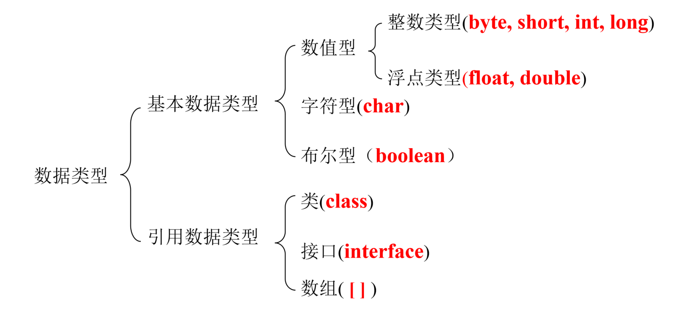
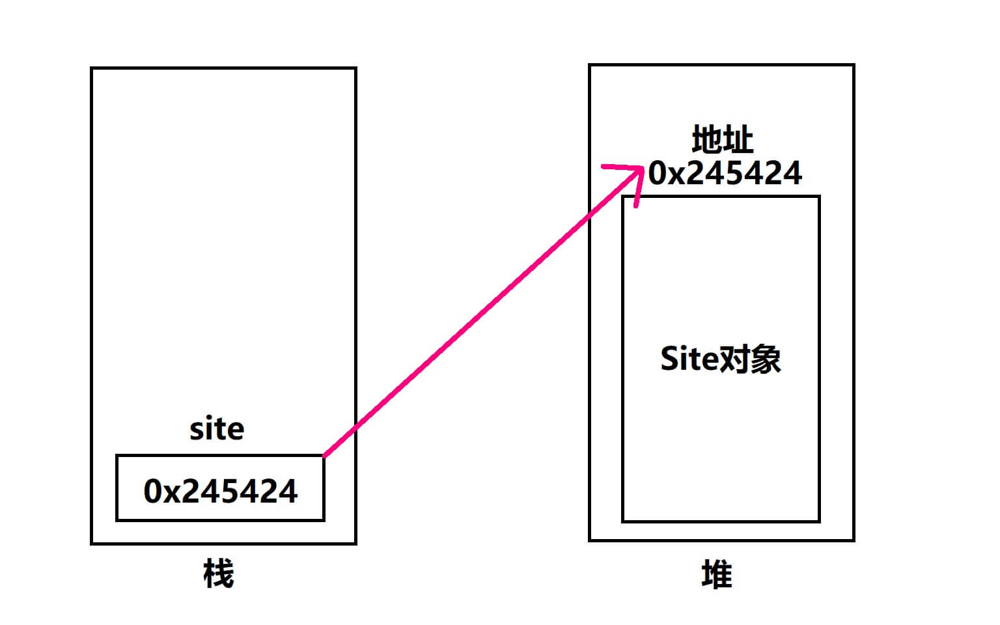
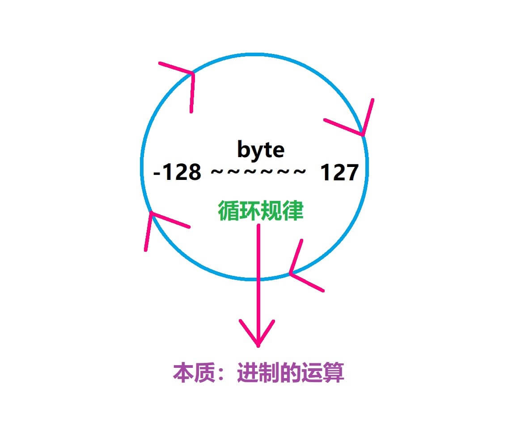

# 【Java数据类型及其转换】

> 原创内容，转载请注明出处！

**Java 两大类数据类型**



# 一、内置数据类型（基本数据类型）

> 基本类型一定要赋值过之后才能用，否则会报错！（除非是类的成员变量）
>
> String 不是基本数据类型！

Java语言提供了 八种基本类型：

- 四种整数类型
- 两种浮点类型
- 一种字符类型
- 一种布尔型

## 1.1 整型

**byte**

- `byte` 数据类型是 8 位（1字节）、有符号的以二进制补码表示的整数
- 最小值是 `-128`（-2<sup>7</sup>）
- 最大值是 `127`（2<sup>7</sup>-1）
- 默认值是 `0`
- byte 类型用在大型数组中节约空间，主要代替整数，因为 byte 变量占用的空间只有 int 类型的四分之一
- 例子

```java
byte a = 100;
byte b = -50;
```


**short**

- `short` 数据类型是 16 位（2字节）、有符号的以二进制补码表示的整数
- 最小值是 `-32768`（-2<sup>15</sup>）
- 最大值是 `32767`（2<sup>15</sup>-1）
- short 数据类型也可以像 byte 那样节省空间。一个 short 变量是 int 型变量所占空间的二分之一
- 默认值是 `0`
- 例子 

```java
short s = 1000;
short r = -20000;
```


**int**

- `int` 数据类型是 32 位（4字节）、有符号的以二进制补码表示的整数
- 最小值是 `-2,147,483,648`（-2<sup>31</sup>）
- 最大值是 `2,147,483,647`（2<sup>31</sup>-1）
- 一般地整型变量默认为 int 类型
- 默认值是 `0`
- 例子

```java
int a = 100000;
int b = -200000;
```


**long**

- `long` 数据类型是 64 位（8字节）、有符号的以二进制补码表示的整数
- 最小值是 `-9,223,372,036,854,775,808`（-2<sup>63</sup>）
- 最大值是 `9,223,372,036,854,775,807`（2<sup>63</sup>-1）
- 这种类型主要使用在需要比较大整数的系统上
- 默认值是 `0L`
- 例子

```java
long a = 100000L;
long b = -200000L;
// 不一定要加后缀，但建议加（因为不叫后缀时默认将一个int型转型后赋给一个long型）
// "L"理论上不分大小写，但是若写成"l"容易与数字"1"混淆，不容易分辩。所以最好大写。
```

## 1.2 浮点型

**float**

- `float` 数据类型是单精度、32位（4字节）、符合 IEEE 754 标准的浮点数
- float 在储存大型浮点数组的时候可节省内存空间
- 表示数范围：`-3.403E38~3.403E38`
- 默认值是 `0.0f`
- 浮点数不能用来表示精确的值，如货币
- 例子

```java
float f1 = 234.5F;
float f2 = -231.6f;
// 必须加后缀，否则报错，优选F
```


**double**

`double` 数据类型是双精度、64 位（8字节）、符合 IEEE 754 标准的浮点数
浮点数的默认类型为 double 类型
表示数范围：`-1.798E308~1.798E308`
double 类型同样不能表示精确的值，如货币
默认值是 `0.0d`
例子

```java
double d1 = 123.4;
double d2 = 234.3D;
double d3 = 32D;
double d4 = 23d;
// 浮点数Java默认为double型，但是如果遇到将整型赋值给double型时，可以加一个D\d（优选D）后缀以明确为double型
```

> **浮点数为什么不精确？**
>
> 其实这句话本身就不精确， 相对精确一点的说法是： 我们码农在程序里写的十进制小数，计算机内部无法用二进制的小数来精确的表达。
>
> 我们知道，计算机的数字的存储和运算都是通过二进制进行的，对于十进制整数转换为二进制整数采用"除2取余，逆序排列"，而这种方法对于所有的十进制都是能精确转为二进制的。
>
> 而十进制小数转换成二进制小数采用"乘2取整，顺序排列"，这种方法很多时候会出现无限循环的情况，所以就无法精确转换了。
>
> 所以，为了解决部分小数无法使用二进制精确表示的问题，于是就有了 IEEE 754 规范。
>
> IEEE 二进制浮点数算术标准（IEEE 754）是 20 世纪 80 年代以来最广泛使用的浮点数运算标准，为许多 CPU 与浮点运算器所采用。
>
> > 浮点数和小数并不是完全一样的，计算机中小数的表示法，其实有定点和浮点两种。因为在位数相同的情况下，定点数的表示范围要比浮点数小。所以在计算机科学中，使用浮点数来表示实数的近似值。
>
> IEEE 754 规定了四种表示浮点数值的方式：单精确度（32 位）、双精确度（64 位）、延伸单精确度（43 比特以上，很少使用）与延伸双精确度（79 比特以上，通常以 80 位实现）。
>
> 其中最常用的就是 32 位单精度浮点数和 64 位双精度浮点数。
>
> > 单精度浮点数在计算机存储器中占用 4 个字节（32 bits），利用“浮点”（浮动小数点）的方法，可以表示一个范围很大的数值。
> > 比起单精度浮点数，双精度浮点数（double）使用 64 位（8字节） 来存储一个浮点数。
>
> IEEE 并没有解决小数无法精确表示的问题，只是提出了一种使用近似值表示小数的方式，并且引入了精度的概念。
>
> 提示：需要用 BigDecimal 进行精确计算。

## 1.3 字符型

**char**

- `char` 类型是一个单一的 16 位（2字节） Unicode 字符
- 表示数范围：`0~65535`（0~2<sup>16-1</sup>）
- 最小值是 `\u0000`（即为 0）
- 最大值是 `\uffff`（即为 65、535）
- char 数据类型可以储存任何字符
- 例子

```java
char letter = 'A';
char letter = 'ABC';	// 编译报错！char型只能存放一个字符！
```


## 1.4 布尔型：

**boolean**

- `boolean` 数据类型表示一位的信息
- boolean 型不可与其他数据类型互相转换，也没有指定的大小，交由 JVM 具体根据系统及硬件环境实现
- 只有两个取值：`true` 和 `false`
- 这种类型只作为一种标志来记录 true/false 情况
- 默认值是 `false`
- 例子

```java
boolean one = true;
boolean two = false;
boolean three = 1;	// 编译报错！Java与C类语言不通，非0不能代表true！
boolean four = 0;	// 编译报错！Java与C类语言不通，0不能代表false！
```


## 1.5 实例

对于数值类型的基本类型的取值范围，我们无需强制去记忆，因为它们的值都已经以常量的形式定义在对应的包装类中了。请看下面的例子：

```java
public class PrimitiveTypeTest {  
    public static void main(String[] args) {  
        // byte  
        System.out.println("基本类型：byte 二进制位数：" + Byte.SIZE);  
        System.out.println("包装类：java.lang.Byte");  
        System.out.println("最小值：Byte.MIN_VALUE=" + Byte.MIN_VALUE);  
        System.out.println("最大值：Byte.MAX_VALUE=" + Byte.MAX_VALUE);  
        System.out.println();  
  
        // short  
        System.out.println("基本类型：short 二进制位数：" + Short.SIZE);  
        System.out.println("包装类：java.lang.Short");  
        System.out.println("最小值：Short.MIN_VALUE=" + Short.MIN_VALUE);  
        System.out.println("最大值：Short.MAX_VALUE=" + Short.MAX_VALUE);  
        System.out.println();  
  
        // int  
        System.out.println("基本类型：int 二进制位数：" + Integer.SIZE);  
        System.out.println("包装类：java.lang.Integer");  
        System.out.println("最小值：Integer.MIN_VALUE=" + Integer.MIN_VALUE);  
        System.out.println("最大值：Integer.MAX_VALUE=" + Integer.MAX_VALUE);  
        System.out.println();  
  
        // long  
        System.out.println("基本类型：long 二进制位数：" + Long.SIZE);  
        System.out.println("包装类：java.lang.Long");  
        System.out.println("最小值：Long.MIN_VALUE=" + Long.MIN_VALUE);  
        System.out.println("最大值：Long.MAX_VALUE=" + Long.MAX_VALUE);  
        System.out.println();  
  
        // float  
        System.out.println("基本类型：float 二进制位数：" + Float.SIZE);  
        System.out.println("包装类：java.lang.Float");  
        System.out.println("最小值：Float.MIN_VALUE=" + Float.MIN_VALUE);  
        System.out.println("最大值：Float.MAX_VALUE=" + Float.MAX_VALUE);  
        System.out.println();  
  
        // double  
        System.out.println("基本类型：double 二进制位数：" + Double.SIZE);  
        System.out.println("包装类：java.lang.Double");  
        System.out.println("最小值：Double.MIN_VALUE=" + Double.MIN_VALUE);  
        System.out.println("最大值：Double.MAX_VALUE=" + Double.MAX_VALUE);  
        System.out.println();  
  
        // char  
        System.out.println("基本类型：char 二进制位数：" + Character.SIZE);  
        System.out.println("包装类：java.lang.Character");  
        // 以数值形式而不是字符形式将 Character.MIN_VALUE 输出到控制台  
        System.out.println("最小值：Character.MIN_VALUE=" + (int) Character.MIN_VALUE);  
        // 以数值形式而不是字符形式将 Character.MAX_VALUE 输出到控制台  
        System.out.println("最大值：Character.MAX_VALUE=" + (int) Character.MAX_VALUE);  
    }
}
```

**编译运行结果：**

```text
基本类型：byte 二进制位数：8
包装类：java.lang.Byte
最小值：Byte.MIN_VALUE=-128
最大值：Byte.MAX_VALUE=127

基本类型：short 二进制位数：16
包装类：java.lang.Short
最小值：Short.MIN_VALUE=-32768
最大值：Short.MAX_VALUE=32767

基本类型：int 二进制位数：32
包装类：java.lang.Integer
最小值：Integer.MIN_VALUE=-2147483648
最大值：Integer.MAX_VALUE=2147483647

基本类型：long 二进制位数：64
包装类：java.lang.Long
最小值：Long.MIN_VALUE=-9223372036854775808
最大值：Long.MAX_VALUE=9223372036854775807

基本类型：float 二进制位数：32
包装类：java.lang.Float
最小值：Float.MIN_VALUE=1.4E-45
最大值：Float.MAX_VALUE=3.4028235E38

基本类型：double 二进制位数：64
包装类：java.lang.Double
最小值：Double.MIN_VALUE=4.9E-324
最大值：Double.MAX_VALUE=1.7976931348623157E308

基本类型：char 二进制位数：16
包装类：java.lang.Character
最小值：Character.MIN_VALUE=0
最大值：Character.MAX_VALUE=65535
```

**说明：**

float 和 double 的 最小值 和 最大值 都是以 科学记数法 的形式输出的，结尾的 "E+数字" 表示 E 之前的数字要乘以 10 的多少次方。比如 `3.14E3` 就是 `3.14 × 10^3 = 3140`，`3.14E-3` 就是 `3.14 x 10^-3 = 0.00314`。

实际上，Java 中还存在另外一种基本类型 `void`，它也有对应的包装类 java.lang.Void，不过我们无法直接对它们进行操作。

## 1.6 注意

**为什么要设置变量？**

提高内存利用率。

**使用变量的一个核心注意点：**

整数默认 int 类型，小数默认 double 类型。

**使用变量注意事项：**

- 作用域	

  - 普通变量定义在哪一级大括号中，哪个大括号的范围就是这个变量的作用域（一般情况）。相同的作用域中不能定义两个同名变量

- 初始化值
  - 没有初始值的变量不能直接使用，编译会报错！（不包括：成员变量系统会默认初始化的情况）
- 在一行上建议只定义一个变量

# 二、引用数据类型

- 在 Java 中，引用类型的变量非常类似于 C/C++ 的指针。引用类型指向一个对象，指向对象的变量是引用变量。这些变量在声明时被指定为一个特定的类型，比如 Employee、Puppy 等。变量一旦声明后，类型就不能被改变了
- 对象、字符串、数组都是引用数据类型
- 所有引用类型的默认值都是 `null`
- 一个引用变量可以用来引用任何与之兼容的类型
- 例子

```java
Site site = new Site("Runoob");
```

内存图示：



# 三、Java类型默认值

|       **数据类型**       | **默认值** |
| :----------------------: | :--------: |
|          `byte`          |     0      |
|         `short`          |     0      |
|          `int`           |     0      |
|          `long`          |     0L     |
|         `float`          |    0.0f    |
|         `double`         |    0.0d    |
|          `char`          |  'u0000'   |
| `String (or any object)` |    null    |
|        `boolean`         |   false    |

## 3.1 实例

```java
public class Test {
    static boolean bool;
    static byte by;
    static char ch;
    static double d;
    static float f;
    static int i;
    static long l;
    static short sh;
    static String str;
 
    public static void main(String[] args) {
        System.out.println("Bool :" + bool);
        System.out.println("Byte :" + by);
        System.out.println("Character:" + ch);
        System.out.println("Double :" + d);
        System.out.println("Float :" + f);
        System.out.println("Integer :" + i);
        System.out.println("Long :" + l);
        System.out.println("Short :" + sh);
        System.out.println("String :" + str);
    }
}
```

**编译运行结果：**

```text
Bool     :false
Byte     :0
Character:
Double   :0.0
Float    :0.0
Integer  :0
Long     :0
Short    :0
String   :null
```

# 四、类型转换

## 4.1 自动类型转换

**整型、实型（常量）、字符型数据可以混合运算。运算中，不同类型的数据先转化为同一类型，然后进行运算。**

转换从低级到高级。

```java
低  ------------------------------------>  高

byte,short,char —> int —> long —> float —> double 
```

数据类型转换必须满足如下规则：

- byte、short、char 相互之间不转换，它们参与运算首先转换为 int 类型

- 不能对 boolean 类型进行类型转换

- 不能把对象类型转换成不相关类的对象

- 在把容量大的类型转换为容量小的类型时必须使用强制类型转换

- 转换过程中可能导致溢出或损失精度，例如：

```java
int i = 128;   
byte b = (byte)i;		// b == -128

byte c = (byte)130;		// c == -126
byte d = (byte)-210;	// b == 46
```

- 因为 byte 类型是 8 位，最大值为 127，所以当 int 强制转换为 byte 类型时，值 128 时候就会导致溢出。

解释：

1. 循环规律：



2. 本质，进制：

```text
byte 一个字节，范围：-128 ~ 127

byte a = (byte)130;		// a = -126

本质：
130二进制真值：10000010
int类型原码表示130：00000000 00000000 00000000 10000010
（正数的原码和补码一致）
int类型补码表示130：00000000 00000000 00000000 10000010

byte类型的补码表示：10000010
（原码转补码转原码方法一致：最高位符号位保持不变，其余各位按位取反，最后末位加1）
byte类型的原码为：11111110（即：-126(10)）

byte b = (byte)-210		//b = 46（同理）

-210：11010010
int原码：10000000 00000000 00000000 11010010
int补码：11111111 11111111 11111111 00101110
byte补码：00101110 ——> byte原码：00101110（即：46(10)）
```

- 浮点数到整数的转换是通过舍弃小数得到，而不是四舍五入，例如：

```java
(int)23.7 == 23;        
(int)-45.89f == -45
```

### 4.1.1 默认类型转换

必须满足转换前的数据类型的位数要低于转换后的数据类型，例如：short 数据类型的位数为 16 位，就可以自动转换位数为 32 的 int 类型，同样 float 数据类型的位数为 32，可以自动转换为 64 位的 double 类型。

### 4.1.2 实例

```java 
public class ZiDongLeiZhuan{
        public static void main(String[] args){
            char c1 = 'a';		// 定义一个char类型
            int i1 = c1;		// char自动类型转换为int
            System.out.println("char自动类型转换为int后的值等于" + i1);
            char c2 = 'A';		// 定义一个char类型
            int i2 = c2 + 1;	// char 类型和 int 类型计算
            System.out.println("char类型和int计算后的值等于" + i2);
        }
}
```

运行结果为:

```txt
char自动类型转换为int后的值等于97
char类型和int计算后的值等于66
// 解析：c1的值为字符a，查ASCII码表可知对应的int类型值为97，A对应值为65，所以i2=65+1=66
```


## 4.2 强制类型转换

- 条件是转换的数据类型必须是兼容的
- 格式：`(type)value`  type 是要强制类型转换后的数据类型，即：`目标类型 变量名 = (目标类型)(被转换的数据);` 
### 4.2.1 实例

```java
public class QiangZhiZhuanHuan{
    public static void main(String[] args){
        int i1 = 123;
        byte b = (byte)i1;	// 强制类型转换为byte
        System.out.println("int强制类型转换为byte后的值等于" + b);
    }
}
```

运行结果：

```text
int强制类型转换为byte后的值等于123
```


### 4.2.2 隐含强制类型转换

- 整数的默认类型是 int
- 浮点型不存在这种情况，因为在定义 float 类型时必须在数字后面跟上 F 或者 f


## 4.3 重点实例

```java
int i = 1000000000000;		// Error! 原因：超出int范围
long j = 1000000000000;  	// Error! 原因：虽然1000000000000没有超出long范围，但是1000000000000默认先认定为int型再自动转换为long型，而1000000000000超出了int范围

long x = 1000000000000L;	// True!

float y = 12.132;			// Error! 原因：12.132默认为double型，float型装不下
float yy = 12.132F;			// True!

boolean flag1 = true;		// True!
boolean flag1 = false;		// True!
boolean flag11 = 1;			// Error! 原因：Java不是C
boolean flag22 = 0;			// Error! 原因：Java不是C

byte a = 50;				// True! 解释：50默认为int型，但是由于50介于byte(-128~127)之间，所以是可以自动转换的（注意！所有大—>小的自动转换中，只有int转byte\short\char有这种特性，而比如double->float\long->int\float->int...无论数据大小介不介于目的数据的范围内都不能自动转换！）
byte b = 130;				// Error! 原因：130的int值不属于byte(-128~127)之间
byte c = (byte)130;			// True! c == -126 循环规律！

//------重点说明1-------
int m = 50;
byte n = m;					// Error! 解释：当出现具体的变量时，与字面值常量的情况不同！在编译时并不会自动确定变量的大小是否介于范围之内，所以会报错！

byte mm = 50;
byte nn = mm;				// True! 当然，这样是可行的！

//------重点说明2-------
short s = 1;
s = s + 1;					// Error! 解释：byte\short\char参与数值计算时先转为int，而此处又出现了具体的变量，编译时编译器并不知道s的具体值是多少，所以无法判断s+1是否介于允许范围之内，故会报错！
s = (short)(s + 1);			 // True!
s += 1;						// True! 解释：s+=1;的本质是：s = (short)(s + 1);
```

## 4.4 总结

- 整数默认 int 型，小数默认 double 型
- 整数常量赋值给 byte、short、char 类型变量，先看该整数常量是否超出 int 范围，超出则报错；然后再看是否超出所赋值的变量类型的范围，超出则报错
- 整数常量赋值给 long 类型变量，先看该整数常量是否超出 int 范围，超出则整数后需跟 L 字母，表示是 long 型常量，否则报错
- 小数常量赋值给 float 类型报错，需要在小数后跟 F 字母。
- byte、short、char 类型相互之间不转换，它们参与运算首先转换为 int 类型
- 变量相加，首先看类型问题，类型不匹配则报错
- 常量相加，首先做加法，然后看结果是否在赋值的数据类型范围内，如果不是，才报错
