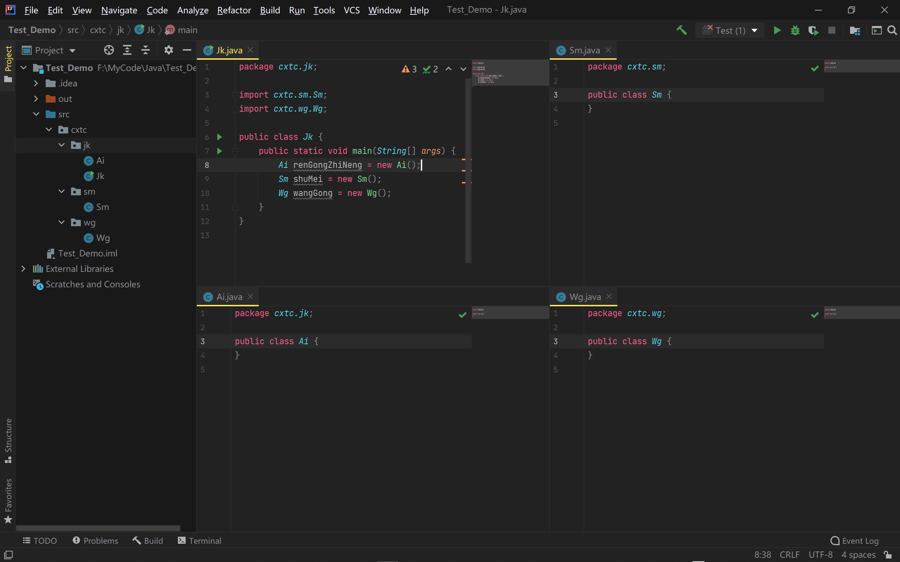
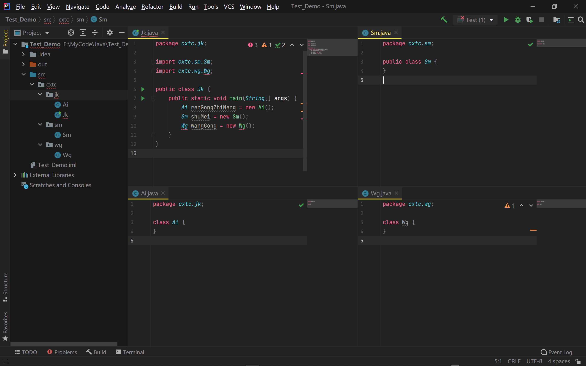

# 【Java包管理模式总结归纳】

> 原创内容，转载请注明出处！

# 一、包

## 1、包的概述

- 其实就是文件夹
- 作用：对类进行分类管理
- 包的划分：
  - 举例：
    - 学生的增加，删除，修改，查询
    - 老师的增加，删除，修改，查询
    - 以及以后可能出现的其他的类的增加，删除，修改，查询
    - 基本的划分“按照模块和功能划分”

# 二、包的定义及注意事项

## 1、定义包的格式

- package 包名;

  
  - 多级包用 . 分开即可
  - package cn.cxtc.jk03
  - 原则：域名反写
  
- 注意事项：
  - package语句必须是程序的第一条可执行的代码(import放在package后)
  - package语句在一个java文件中只能有一个
  - 如果没有package，默认表示无包名

# 三、带包的类的编译和运行

## 1、手动式

- a：java编译当前类文件
- b：手动建立包对应的文件夹
- c：把a步骤的class文件放到步骤的最终文件夹下
- d：通过java命令执行，注意：需要带包名称的执行
  
  - java cn.cxtc.jk03.HelloWorld

## 2、自动式

- a：javac编译的时候带上 -d 即可
  
  - javac -d . HelloWorld.java
  
- b：通过java命令执行，和手动式一样

## 3、说明

- 1、对于 .java 文件中没有package语句时：
  - 编译：.java文件所在路径下：javac Xx.java（生成 Xx.class 文件）
  - 运行：.class文件所在路径下：java Xx
- 2、对于 .java 文件中有package语句，但是 .java 文件不在包结构中时：
  - 编译：.java文件所在路径下：javac Xx.java（能够成功编译，并成功生成 Xx.class 文件）
  - 运行：.class文件所在路径下：java Xx（运行报错！错误: 找不到或无法加载主类 Xx）
- 3、对于 .java 文件中有package语句，但是 .java 文件不在包结构中时：
  - 编译：.java文件所在路径下：javac Xx.java（能够成功编译，并成功生成 .class 文件）
  - 移动：将 Xx.class 文件放到对应的包结构目录下
  - 运行：.java文件所在路径下：java Xx（运行报错！错误: 找不到或无法加载主类 Xx）
  - 再次运行：.java文件所在路径下：java cn.cxtc.jk03.Xx（运行成功！）
  - 运行：.class文件所在路径下：java Xx（运行成功！）
- 4、对于 .java 文件中有package语句，但是 .java 文件不在包结构中时：
  - 编译：.java文件所在路径下：javac -d . Xx.java（能够成功编译，并成功生成 .class 文件）
  - 自动构建包结构：当上一步完成后，编译器会自动根据package语句中的包结构路径创建文件夹结构（已有时便直接用）并将生成的 .class 文件放入指定位置
  - 运行：.java文件所在路径下：java Xx（运行报错！错误: 找不到或无法加载主类 Xx）
  - 再次运行：.java文件所在路径下：java cn.cxtc.jk03.Xx（运行成功！）
  - 运行：.class文件所在路径下：java Xx（运行成功！）

# 四、类之间的访问

## 1、定义两个类：Method, Test

- Method
  - 求和方法(sum)
- Test
  - 测试方法(main)

## 2、测试两个类不同位置的访问方式

- 无包时的访问
- 同一个包内的访问
  - 不用导包
- 不同包间的访问
  - 必须指明包（或：导入包）

# 五、导包

## 1、导包概述

- 不同包下的类之间的访问，我们发现，每次使用不同包下的类的时候，都需要加包的全路径（eg: java.util.Scanner sc = new java.util.Scanner(System.in);    cn.cxtc.jk03.Jerry zjr = new cn.cxtc.jk03.Jerry(); ），比较麻烦，这个时候java就提供了导包的功能。

## 2、导包格式

- import 包名;
- 注意：
  - 这种方式导入是到类的名称（单类型导入：import cn.cxtc.jk03.Jerry;）
  - 虽然可以最后写 * ，但是不建议（按需导入：import cn.cxtc.jk03.\*;     // 不允许出现多个*）   
- package, import, class有没有顺序关系?
  - package——>import——>class
- 补充说明：
  - package只能出现一次
  - import可以出现多次
  - 一个.java文件中可以放多个class，但是实际开发中只建议一个.java文件内放一个class

# 六、权限修饰符

|                    | public | protected | 缺省 | private |
| :----------------: | :----: | :-------: | :--: | :-----: |
|      同一类中      |   Y    |     Y     |  Y   |    Y    |
| 同一包子类，其他类 |   Y    |     Y     |  Y   |         |
|     不同包子类     |   Y    |     Y     |      |         |
|    不同包其他类    |   Y    |           |      |         |

## 附：class修饰符实例

- 四种访问控制修饰符中，对于外部类只可以使用：public 或 默认
- public class：所有地方都可以使用该类
- class：只有同一包中才能使用该类

# 七、补充

## 1、类及其组成可以用的修饰符

- 修饰符：
- 权限修饰符：private，缺省，protected，public
- 状态修饰符：static，final
- 抽象修饰符：abstract

## 2、类及其组成可以用的修饰符

- 类：
   - 默认，public，final，abstract
   - 我们自己定义：public居多
- 成员变量：
   - 四种权限修饰符均可,final,static
   - 我们自己定义：private居多
- 构造方法：
   - 四种权限修饰符均可,其他不可
   - 我们自己定义：public 居多
- 成员方法：
   - 四种权限修饰符均可，final,static,abstract
   - 我们自己定义：public居多

