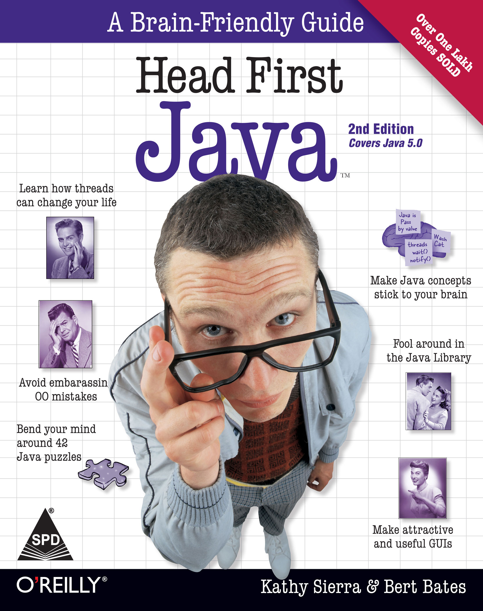

# 《Head First Java》读书笔记

> 原创内容，转载请注明出处！
> 致谢 《Head First Java》!



# 前言：学习需求

## 一、所需工具

- 一个文本编辑器（目前不推荐使用 `IDE` “集成开发环境”，推荐 `Notepad++` 或 `VSCode`）
- 一个终端命令行（使用命令行有利于真正地理解内部运作）
- 一个浏览器（推荐 `Chrome` 不要问为什么）
- 一个音乐播放器（不关书的事，是我推荐的！）
- JDK API 文档（非常重要！！！）

## 二、Java 的安装与配置

1. 需要 `1.5` 版本以上的 `Java SDK` 即：`JDK` （推荐 `1.8` 版本，不要问为什么），请从 [Oracle 官网](https://www.oracle.com/cn/index.html) 获取。（Java 原本属于 Sun 公司，后来被 Oracle 收购）
2. 找到 `jdk/bin` 目录，并将其 `绝对路径` 添加到 `PATH` 系统环境变量中。原因是：该目录下存放有 `javac.exe` `java.exe` 及其他重要工具，放到 PATH 中后，在终端输入 `javac` `java` 等指令时，系统便会知道要去哪里找到并运行对应的工具。

## 三、说明

- 书中的首要目标是让读者学习 Java 的基本概念，然后才是开发 Java 过程的组织与管理动作的细节，这些细节在真实环境中非常重要，所以我们会很深入地讨论，但是组织管理细节被安排在后面的章节中。
- 本书的主要内容较为基础，距离实际的开发还有很大的距离，我在归纳本书的内容时会省略一些基本的概念及原理的介绍，有关 Java 基本语法的内容请参考我另外的文章，此篇的主要目的在于归纳《Head First Java》中所出现的一些有意思的概念，同时在阅读《Head First Java》后推荐您阅读《Java 核心技术 卷1》及《Java 编程思想》这两本 Java 圣经，有空的话请再阅读下《Head First 设计模式》不要问为什么……

# 第一章：进入 Java 的世界【基本概念】

## 一、Java 的工作方式

### 1.1 基本步骤

1. 编写 `.java` 源代码。

2. 执行 `javac` 命令 运行 `javac.exe` Java 编译器 对 `.java` 源文件进行编译并生成同名 `.class` 字节码文件。 
3. 执行 `java` 命令 运行 `java.exe` Java 解释器 启动 `JVM` Java 虚拟机 来运行 `.class` 文件，JVM 会将字节码文件转换成当前平台能够理解的形式来运行，这也是 Java 语言跨平台特性的基础。

### 1.2 案例

1. 编写 `Hello.java` 源代码。

```java
public class Hello {
    public static void main(String[] args) {
        System.out.println("Hello World!");
    }
}
```

2. 终端当前路径下执行 `javac` 命令。

``` bash
$ javac Hello.java	
#（若执行成功，则会在当前目录下生成一个 Hello.class 文件）
```

3. 终端当前路径下执行 `java` 命令。

```bash
$ java Hello				
#（若执行成功，则会在终端窗口打印 Hello World!）
```

## 二、Java 简史

（1）Java 1.02

- 250 个类
- 龟速
- bug 较多
- applet 是重点

（2）Java 1.1

- 500 个类
- 狗速
- 开始受到欢迎
- 适合于开发图形界面

（3）Java 2（版本 1.2 ~ 1.4）

- 2300 个类
- 马速
- 企业级开发
- 移动应用开发
- 三种版本 ME（微型、移动）、SE（桌面、标准）、EE（企业、Web）

（4）Java 5.0（版本 1.5 及以上）

- 3500个类
- 飞速
- 重大更新
- 易用
- 安全

（5）Java 5.0 以上

- 性能不断强大
- 类库不断丰富
- 安全不断提高
- 生态不断完善

说明：在写该文的时候，实际开发中最普遍的版本是 JDK 1.8 版本。

## 三、Java 的程序结构

### 3.1 基本结构

- 类存放于源文件中
- 方法存放于类中
- 语句存放于方法中

### 3.2 什么是源文件？

- 扩展名为 `.java`
- 带有类的定义
- 一个源文件必须至少有一个类（即：主类）
- 主类的名称必须与源文件名相同

### 3.3 什么是类？

- 带有一个或多个方法
- 方法必须在类的内部声明

### 3.4 什么是方法？

- 在方法的花括号中编写方法应该执行的指令
- 方法代码是由一组语句所组成的（函数或方法）