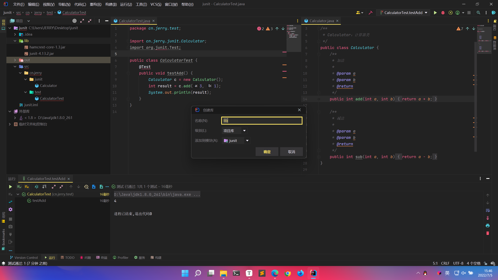
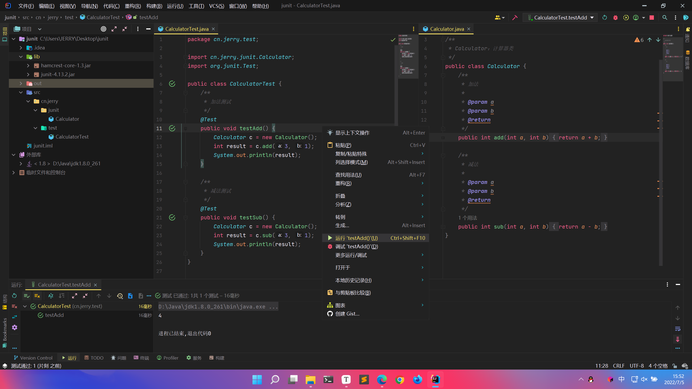

# JUnit

> JUnit 是一个 Java 语言的单元测试框架。它由 Kent Beck 和 Erich Gamma 建立，逐渐成为源于 Kent Beck 的 sUnit 的 xUnit 家族中最为成功的一个。JUnit 有它自己的 JUnit 扩展生态圈。多数 Java 的开发环境都已经集成了 JUnit 作为单元测试的工具。
>
> JUnit 促进了“先测试后编码”的理念，强调建立测试数据的一段代码，可以先测试，然后再应用。这个方法就好比“测试一点，编码一点，测试一点，编码一点……”，增加了程序员的产量和程序的稳定性，可以减少程序员的压力和花费在排错上的时间。

[JUnit 官网](https://junit.org)

[JUnit 教程 W3Cschool](https://www.w3cschool.cn/junit/)

[使用JUnit进行单元测试 - 简书 (jianshu.com)](https://www.jianshu.com/p/a3fa5d208c93)（推荐阅读）

## 测试分类：

1. 黑盒测试：不需要写代码，输入值后看程序是否能够输出期望的值。
2. 白盒测试：需要写代码测试，关注程序具体的执行流程。


> 单元测试属于白盒测试，JUnit 就是一个单元测试的 Java 框架。

## JUnit的基本使用：

> 下面以 JUnit4 为例，讲解一些基础使用。

### 一、使用步骤

1. 导入 JUnit 依赖环境

   [Download and Install · junit-team/junit4 Wiki (github.com)](https://github.com/junit-team/junit4/wiki/Download-and-Install)

2. 定义一个测试类（测试用例）

   ```
   建议：
   1、测试包名：xxx.xxx.xxx.test
   	例如：cn.itcast.test
   2、测试类名：被测试的类名Test
   	例如：CalculatorTest
   ```

3. 定义测试的方法（可以独立运行）

   ```
   建议：
   1、方法名：test测试的方法名
   	例如：testAdd()
   2、返回值：void
   3、参数列表：空参
   ```

4. 给测试方法加上 `@Test` 注解

【举例】

导入 JUnit 依赖环境。

- `junit-4.13.2.jar`
- `hamcrest-core-1.3.jar`

> 注意：由于 JUnit 是基于 Hamcrest 这个测试框架，所以引入 `junit-4.13.2.jar` 的同时也要引入 `hamcrest-core-1.3.jar`。

在项目中创建 `lib` 目录，同时将 `junit-4.13.2.jar`、`hamcrest-core-1.3.jar` 放入其中，并将 `lib` 目录添加为库。

> 对于 IDEA 来说，也可以直接在 `@Test` 注解上直接点击提示下载引入。




JUnit 引入后，便可编写单元测试代码进行测试。



### 二、判定结果

- 红色：失败
- 绿色：成功

> 一般我们会使用断言操作来处理结果：
>
> `Assert.assertEquals(期望的结果, 运算的结果);`
>
> - 成功举例：
>
> `Assert.assertEquals(4, result);`
>
> 
>
> - 失败举例：
>
> `Assert.assertEquals(2, result);`
>
> 

### 三、补充

- `@Before`：修饰的方法会在测试方法执行之前被自动执行
  - 可以解决测试代码开始前的重复性操作，比如：申请某资源
- `@After`：修饰的方法会在测试方法执行之后自动被执行
  - 可以解决测试代码结束后的重复性操作，比如：释放某资源

```java
package cn.jerry.test;

import org.junit.After;
import org.junit.Before;
import org.junit.Test;

public class CalculatorTest {
    /**
     * 初始化方法
     */
    @Before
    public void init() {
        System.out.println("init...");
    }

    /**
     * 结束后方法
     */
    @After
    public void close() {
        System.out.println("close...");
    }

    /**
     * 测试方法
     */
    @Test
    public void test() {
        System.out.println("test...");
    }
}
```

`test()` 测试方法执行结果：

```
init...
test...
close...
```

## JUnit的一些注意事项：

- 测试方法必须使用 @Test 修饰
- 测试方法必须使用 public void 进行修饰，不能带参数
- 一般使用单元测试会新建一个 test 目录存放测试代码，在生产部署的时候只需要将 test 目录下代码删除即可
- 测试代码的包应该和被测试代码包结构保持一致
- 测试单元中的每个方法必须可以独立测试，方法间不能有任何依赖
- 测试类一般使用 Test 作为类名的后缀
- 测试方法使一般用 test 作为方法名的前缀

## 测试失败说明：

- Failure：一般是由于测试结果和预期结果不一致引发的，表示测试的这个点发现了问题
- error：是由代码异常引起的，它可以产生于测试代码本身的错误，也可以是被测试代码中隐藏的 bug

## 一些常用注解：

`@Test`：这个注释说明依附在 JUnit 的 public void 方法可以作为一个测试案例

`@Before`：有些测试在运行前需要创造几个相似的对象。在 public void 方法加该注释是因为该方法需要在 test 方法前运行

`@After`：如果你将外部资源在 Before 方法中分配，那么你需要在测试运行后释放他们。在 public void 方法加该注释是因为该方法需要在 test 方法后运行

`@BeforeClass`：在 public void 方法加该注释是因为该方法需要在类中所有方法前运行

`@AfterClass`：它将会使方法在所有测试结束后执行。这个可以用来进行清理活动

`@Ignore`：这个注释是用来忽略有关不需要执行的测试的

### JUnit 加注解执行过程

- `beforeClass()`：方法首先执行，并且只执行一次
- `afterClass()`：方法最后执行，并且只执行一次
- `before()`：方法针对每一个测试用例执行，但是是在执行测试用例之前
- `after()`：方法针对每一个测试用例执行，但是是在执行测试用例之后
- 在 before() 方法和 after() 方法之间，执行每一个测试用例

## JUnit 断言

什么是断言？刚开始我也很困惑，后来搞了大半天才明白断言就是“判断”。

JUnit 所有的断言都包含在 Assert 类中。

这个类提供了很多有用的断言方法来编写测试用例。只有失败的断言才会被记录。Assert 类中的一些有用的方法列式如下：

1. `void assertEquals(boolean expected, boolean actual)`：检查两个变量或者等式是否平衡
2. `void assertTrue(boolean expected, boolean actual)`：检查条件为真
3. `void assertFalse(boolean condition)`：检查条件为假
4. `void assertNotNull(Object object)`：检查对象不为空
5. `void assertNull(Object object)`：检查对象为空
6. `void assertSame(boolean condition)`：assertSame() 方法检查两个相关对象是否指向同一个对象
7. `void assertNotSame(boolean condition)`：assertNotSame() 方法检查两个相关对象是否不指向同一个对象
8. `void assertArrayEquals(expectedArray, resultArray)`：assertArrayEquals() 方法检查两个数组是否相等
