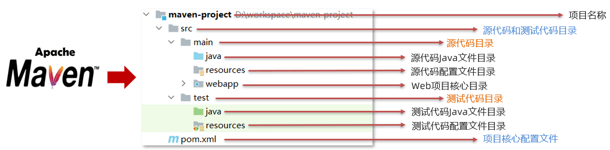
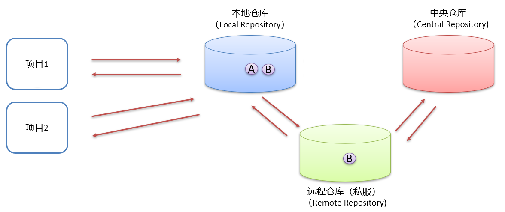
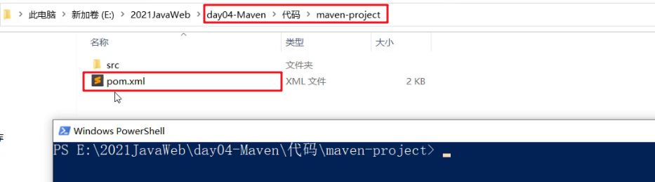
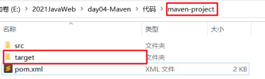
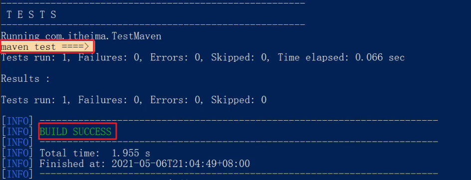
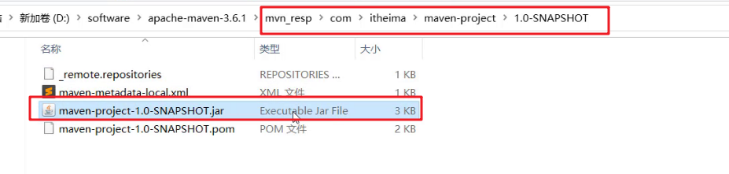
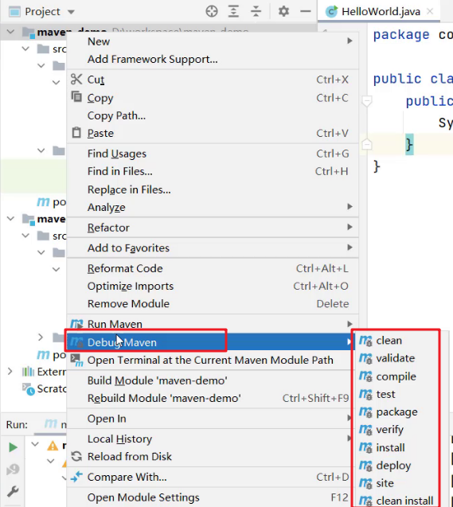
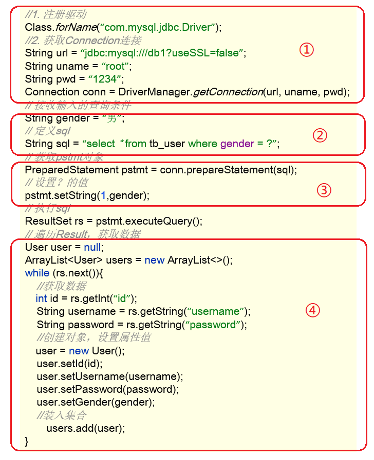

## Maven&MyBatis

**目标**

> * 能够使用 Maven 进行项目的管理
> * 能够完成 Mybatis 代理方式查询数据
> * 能够理解 Mybatis 核心配置文件的配置

## 1，Maven

Maven 是专门用于管理和构建 Java 项目的工具，它的主要功能有：

* 提供了一套标准化的项目结构

* 提供了一套标准化的构建流程（编译，测试，打包，发布……）

* 提供了一套依赖管理机制

**标准化的项目结构：**

项目结构我们都知道，每一个开发工具（IDE）都有自己不同的项目结构，它们互相之间不通用。我再 eclipse 中创建的目录，无法在 idea 中进行使用，这就造成了很大的不方便，如下图：前两个是以后开发经常使用的开发工具


而 Maven 提供了一套标准化的项目结构，所有的 IDE 使用 Maven 构建的项目完全一样，所以 IDE 创建的 Maven 项目可以通用。如下图右边就是 Maven 构建的项目结构。




非 Web 项目可以没有 webapp 目录。

**标准化的构建流程：**


如上图所示我们开发了一套系统，代码需要进行编译、测试、打包、发布，这些操作如果需要反复进行就显得特别麻烦，而 Maven 提供了一套简单的命令来完成项目构建。

**依赖管理：**

依赖管理其实就是管理你项目所依赖的第三方资源（jar 包、插件）。如之前我们项目中需要使用 JDBC 和 Druid 的话，就需要去网上下载对应的依赖包（这个步骤非常繁琐还易错），复制到项目中，还要将 jar 包加入工作环境这一系列的操作。如下图所示：


而 Maven 使用标准的 ==坐标== 配置来管理各种依赖，只需要简单的配置就可以完成依赖管理。


如上图右边所示就是 mysql 驱动包的坐标，在项目中只需要写这段配置，其他都不需要我们担心，Maven 都帮我们进行操作了。

市面上有很多构建工具，而 Maven 依旧还是主流构建工具，如下图是常用构建工具的使用占比：


### 1.1  Maven简介

> ==Apache Maven== 是一个项目管理和构建==工具==，它基于项目对象模型（POM）的概念，通过一小段描述信息来管理项目的构建、报告和文档。
>
> 官网 ：http://maven.apache.org/ 

通过上面的描述大家只需要知道 Maven 是一个工具即可。Apache 是一个开源组织，将来我们会学习很多 Apache 提供的项目。

#### 1.1.1  Maven模型

* 项目对象模型（Project Object Model）
* 依赖管理模型（Dependency）
* 插件（Plugin）


如上图所示就是 Maven 的模型，而我们先看紫色框框起来的部分，他就是用来完成 `标准化构建流程` 。如我们需要编译，Maven 提供了一个编译插件供我们使用，我们需要打包，Maven 就提供了一个打包插件提供我们使用等。


上图中紫色框起来的部分，项目对象模型就是将我们自己抽象成一个对象模型，有自己专属的坐标，如下图所示是一个 Maven 项目：


依赖管理模型则是使用坐标来描述当前项目依赖哪儿些第三方 jar 包，如下图所示：


上述 Maven 模型图中还有一部分是仓库。如何理解仓库呢？

#### 1.1.2  仓库

大家想想这样的场景，我们创建 Maven 项目，在项目中使用坐标来指定项目的依赖，那么依赖的 jar 包到底存储在什么地方呢？其实依赖 jar 包是存储在我们的本地仓库中。而项目运行时从本地仓库中拿需要的依赖 jar 包。

**仓库分类：**

* 本地仓库：自己计算机上的一个目录

* 中央仓库：由 Maven 团队维护的全球唯一的仓库

  * 地址： https://repo1.maven.org/maven2/

* 远程仓库（私服）：一般由公司团队搭建的私有仓库

  今天我们只学习中央仓库的使用，并不会搭建。

当项目中使用坐标引入对应依赖 jar 包后，首先会查找本地仓库中是否有对应的 jar 包：

* 如果有，则在项目直接引用

* 如果没有，则去中央仓库中下载对应的 jar 包到本地仓库


如果还可以搭建远程仓库，将来 jar 包的查找顺序则变为：

> 本地仓库 --> 远程仓库--> 中央仓库



### 1.2  Maven安装配置

* 解压 apache-maven-3.6.1.rar 既安装完成

  

  > 建议解压缩到没有中文、特殊字符的路径下。如解压缩到 `D:\software` 下。

  解压缩后的目录结构如下：

  

  * bin 目录 ： 存放的是可执行命令。mvn 命令重点关注
  * conf 目录 ：存放 Maven 的配置文件。`settings.xml` 配置文件后期需要修改
  * lib 目录 ：存放 Maven 依赖的 jar 包。Maven 也是使用 java 开发的，所以它也依赖其他的 jar 包

* 配置环境变量 MAVEN_HOME 为安装路径的 bin 目录

  `此电脑` 右键  -->  `高级系统设置`  -->  `高级`  -->  `环境变量`

  在系统变量处新建一个变量 `MAVEN_HOME`

  

  在 `Path` 中进行配置

  

  打开命令提示符进行验证，出现如图所示表示安装成功

  

* 配置本地仓库

  修改 conf/settings.xml 中的 `<localRepository>` 为一个指定目录作为本地仓库，用来存储 jar 包。

  

* 配置阿里云私服

  中央仓库在国外，所以下载 jar 包速度可能比较慢，而阿里公司提供了一个远程仓库，里面基本也都有开源项目的 jar 包。

  修改 conf/settings.xml 中的 `<mirrors>` 标签，为其添加如下子标签：

  ```xml
  <mirror>  
      <id>alimaven</id>  
      <name>aliyun maven</name>  
      <url>http://maven.aliyun.com/nexus/content/groups/public/</url>
      <mirrorOf>central</mirrorOf>          
  </mirror>
  ```

### 1.3  Maven基本使用

#### 1.3.1  Maven常用命令

> * compile：编译
>
> * clean：清理
>
> * test：测试
>
> * package：打包
>
> * install：安装

**命令演示：**

在 `资料\代码\maven-project` 提供了一个使用 Maven 构建的项目，项目结构如下：


而我们使用上面命令需要在磁盘上进入到项目的 `pom.xml` 目录下，打开命令提示符



**编译命令演示：**

```
mvn compile
```

执行上述命令可以看到：

* 从阿里云下载编译需要的插件的 jar 包，在本地仓库也能看到下载好的插件
* 在项目下会生成一个 `target` 目录


同时在项目下会出现一个 `target` 目录，编译后的字节码文件就放在该目录下



**清理命令演示：**

```
mvn clean
```

执行上述命令可以看到

* 从阿里云下载清理需要的插件 jar 包
* 删除项目下的 `target` 目录


**打包命令演示：**

```
mvn package
```

执行上述命令可以看到：

* 从阿里云下载打包需要的插件 jar 包
* 在项目的 `terget` 目录下有一个 jar 包（将当前项目打成的 jar 包）


**测试命令演示：**

```
mvn test  
```

该命令会执行所有的测试代码。执行上述命令效果如下：



**安装命令演示：**

```
mvn install
```

该命令会将当前项目打成 jar 包，并安装到本地仓库。执行完上述命令后到本地仓库查看结果如下：



#### 1.3.2  Maven生命周期

Maven 构建项目生命周期描述的是一次构建过程经历经历了多少个事件

Maven 对项目构建的生命周期划分为 3 套：

* clean：清理工作。
* default：核心工作，例如编译，测试，打包，安装等。
* site：产生报告，发布站点等。这套声明周期一般不会使用。

同一套生命周期内，执行后边的命令，前面的所有命令会自动执行。例如默认（default）生命周期如下：


当我们执行 `install`（安装）命令时，它会先执行 `compile`命令，再执行 `test ` 命令，再执行 `package` 命令，最后执行 `install` 命令。

当我们执行 `package` （打包）命令时，它会先执行 `compile` 命令，再执行 `test` 命令，最后执行 `package` 命令。

默认的生命周期也有对应的很多命令，其他的一般都不会使用，我们只关注常用的：


### 1.4  IDEA使用Maven

以后开发中我们肯定会在高级开发工具中使用 Maven 管理项目，而我们常用的高级开发工具是 IDEA，所以接下来我们会讲解 Maven 在 IDEA 中的使用。

#### 1.4.1  IDEA配置Maven环境（非常重要）

我们需要先在 IDEA 中配置 Maven 环境：

* 选择 IDEA中 File --> Settings

  

* 搜索 Maven 

  

* 设置 IDEA 使用本地安装的 Maven，并修改配置文件路径

  

#### 1.4.2  Maven坐标详解

**什么是坐标？**

* Maven 中的坐标是==资源的唯一标识==
* 使用坐标来定义项目或引入项目中需要的依赖

**Maven 坐标主要组成**

* groupId：定义当前 Maven 项目隶属组织名称（通常是域名反写，例如：com.itheima）
* artifactId：定义当前 Maven 项目名称（通常是模块名称，例如 order-service、goods-service）
* version：定义当前项目版本号

如下图就是使用坐标表示一个项目：


> ==注意：==
>
> * 上面所说的资源可以是插件、依赖、其它项目
> * 我们的项目如果被其他的项目依赖时，也是需要坐标来引入的

#### 1.4.3  IDEA创建Maven项目

* 创建模块，选择 Maven，点击 Next

  

* 填写模块名称，坐标信息，点击 finish，创建完成

  

  创建好的项目目录结构如下：

  

* 编写 HelloWorld，并运行

#### 1.4.4  IDEA导入Maven项目

大家在学习时可能需要看老师的代码，当然也就需要将老师的代码导入到自己的 IDEA 中。我们可以通过以下步骤进行项目的导入：

* 选择右侧 Maven 面板，点击 + 号

  

* 选中对应项目的 pom.xml 文件，双击即可

  

* 如果没有 Maven 面板，选择

  View --> Appearance --> Tool Window Bars

  


可以通过下图所示进行命令的操作：


**配置 Maven-Helper 插件** 

* 选择 IDEA中 File --> Settings

  

* 选择 Plugins

  

* 搜索 Maven，选择第一个 Maven Helper，点击 Install 安装，弹出面板中点击 Accept

  

* 重启 IDEA

安装完该插件后可以通过 选中项目右键进行相关命令操作，如下图所示：



### 1.5  依赖管理

#### 1.5.1  使用坐标引入jar包

**使用坐标引入 jar 包的步骤：**

* 在项目的 pom.xml 中编写 `<dependencies>` 标签（依赖标签）

* 在 `<dependencies>` 标签中 使用 `<dependency>` 引入坐标（依赖）

* 定义坐标的 groupId（组织），artifactId（项目），version（版本）

  

* 点击刷新按钮，使坐标生效

  

>  注意：
>
> * 具体的坐标我们可以到如下网站进行搜索
> * https://mvnrepository.com/

**快捷方式导入 jar 包的坐标：**

每次需要引入 jar 包，都去对应的网站进行搜索是比较麻烦的，接下来给大家介绍一种快捷引入坐标的方式

* 在 pom.xml 中 按 alt + insert，选择 Dependency

  

* 在弹出的面板中搜索对应坐标，然后双击选中对应坐标

  

* 点击刷新按钮，使坐标生效

  

**自动导入设置：**

上面每次操作都需要点击刷新按钮，让引入的坐标生效。当然我们也可以通过设置让其自动完成

* 选择 IDEA中 File --> Settings

  

* 在弹出的面板中找到 Build Tools

  

* 选择 Any changes，点击 ok 即可生效

#### 1.5.2  依赖范围

通过设置坐标的依赖范围（scope），可以设置 对应 jar 包的作用范围：编译环境、测试环境、运行环境。

如下图所示给 `junit` 依赖通过 `scope` 标签指定依赖的作用范围。 那么这个依赖就只能作用在测试环境，其他环境下不能使用。


那么 `scope` 都可以有哪些取值呢？

| **依赖范围** | 编译classpath | 测试classpath | 运行classpath | 例子                |
| ------------ | ------------- | ------------- | ------------- | ------------------- |
| **compile**  | Y             | Y             | Y             | logback             |
| **test**     | -             | Y             | -             | Junit               |
| **provided** | Y             | Y             | -             | servlet-api         |
| **runtime**  | -             | Y             | Y             | jdbc 驱动           |
| **system**   | Y             | Y             | -             | 存储在本地的 jar 包 |

* compile：作用于编译环境、测试环境、运行环境
* test： 作用于测试环境。典型的就是 Junit 坐标，以后使用 Junit 时，都会将 scope 指定为该值
* provided：作用于编译环境、测试环境。我们后面会学习 `servlet-api` ，在使用它时，必须将 `scope` 设置为该值，不然运行时就会报错
* runtime ： 作用于测试环境、运行环境。jdbc驱动一般将 `scope` 设置为该值，当然不设置也没有任何问题 

> 注意：
>
> * 如果引入坐标不指定 `scope` 标签时，默认就是 compile  值。以后大部分 jar 包都是使用默认值。

## 2，Mybatis

### 2.1  Mybatis概述

#### 2.1.1  Mybatis概念

> * MyBatis 是一款优秀的==持久层框架==，用于简化 JDBC 开发
>
> * MyBatis 本是 Apache 的一个开源项目 iBatis, 2010 年这个项目由 apache software foundation 迁移到了 google code，并且改名为 MyBatis 。2013年11月迁移到 Github
>
> * 官网：https://mybatis.org/mybatis-3/zh/index.html 

**持久层：**

* 负责将数据保存到数据库的那一层代码

  以后开发我们会将操作数据库的 Java 代码作为持久层。而 Mybatis 就是对 jdbc 代码进行了封装。

* JavaEE 三层架构：表现层、业务层、持久层

  三层架构在后期会给大家进行讲解，今天先简单的了解下即可。

**框架：**

* 框架就是一个半成品软件，是一套可重用的、通用的、软件基础代码模型
* 在框架的基础之上构建软件编写更加高效、规范、通用、可扩展

举例给大家简单的解释一下什么是半成品软件。大家小时候应该在公园见过给石膏娃娃涂鸦。


如下图所示有一个石膏娃娃，这个就是一个半成品。你可以在这个半成品的基础上进行不同颜色的涂鸦。


了解了什么是 Mybatis 后，接下来说说以前 `JDBC代码` 的缺点以及 Mybatis 又是如何解决的。

#### 2.1.2  JDBC 缺点

下面是 JDBC 代码，我们通过该代码分析都存在什么缺点：



* 硬编码

  * 注册驱动、获取连接

    上图标 1 的代码有很多字符串，而这些是连接数据库的四个基本信息，以后如果要将 Mysql 数据库换成其他的关系型数据库的话，这四个地方都需要修改，如果放在此处就意味着要修改我们的源代码。

  * SQL语句

    上图标 2 的代码。如果表结构发生变化，SQL 语句就要进行更改。这也不方便后期的维护。

* 操作繁琐

  * 手动设置参数

  * 手动封装结果集

    上图标 4 的代码是对查询到的数据进行封装，而这部分代码是没有什么技术含量，而且特别耗费时间的。

#### 2.1.3  Mybatis 优化

* 硬编码可以配置到==配置文件==
* 操作繁琐的地方 mybatis 都==自动完成==

如图所示


下图是持久层框架的使用占比。


### 2.2  Mybatis快速入门

**需求：查询 user 表中所有的数据**

* 创建 user 表，添加数据

  ```sql
  create database mybatis;
  use mybatis;
  
  drop table if exists tb_user;
  
  create table tb_user(
  	id int primary key auto_increment,
  	username varchar(20),
  	password varchar(20),
  	gender char(1),
  	addr varchar(30)
  );
  
  INSERT INTO tb_user VALUES (1, 'zhangsan', '123', '男', '北京');
  INSERT INTO tb_user VALUES (2, '李四', '234', '女', '天津');
  INSERT INTO tb_user VALUES (3, '王五', '11', '男', '西安');
  ```

* 创建模块，导入坐标

  在创建好的模块中的 pom.xml 配置文件中添加依赖的坐标

  ```xml
  <dependencies>
      <!-- mybatis 依赖 -->
      <dependency>
          <groupId>org.mybatis</groupId>
          <artifactId>mybatis</artifactId>
          <version>3.5.5</version>
      </dependency>
  
      <!-- mysql 驱动 -->
      <dependency>
          <groupId>mysql</groupId>
          <artifactId>mysql-connector-java</artifactId>
          <version>5.1.46</version>
      </dependency>
  
      <!-- junit 单元测试 -->
      <dependency>
          <groupId>junit</groupId>
          <artifactId>junit</artifactId>
          <version>4.13</version>
          <scope>test</scope>
      </dependency>
  
      <!-- 添加 slf4j 日志 api -->
      <dependency>
          <groupId>org.slf4j</groupId>
          <artifactId>slf4j-api</artifactId>
          <version>1.7.20</version>
      </dependency>
      
      <!-- 添加 logback-classic 依赖 -->
      <dependency>
          <groupId>ch.qos.logback</groupId>
          <artifactId>logback-classic</artifactId>
          <version>1.2.3</version>
      </dependency>
      
      <!-- 添加 logback-core 依赖 -->
      <dependency>
          <groupId>ch.qos.logback</groupId>
          <artifactId>logback-core</artifactId>
          <version>1.2.3</version>
      </dependency>
  </dependencies>
  ```

  注意：需要在项目的 resources 目录下创建 logback 的配置文件

  ```xml
  <?xml version="1.0" encoding="UTF-8"?>
  <configuration>
      <!--
          CONSOLE：表示当前的日志信息是可以输出到控制台的。
      -->
      <appender name="Console" class="ch.qos.logback.core.ConsoleAppender">
          <encoder>
              <pattern>[%level] %cyan([%thread]) %boldGreen(%logger{15}) - %msg %n</pattern>
          </encoder>
      </appender>
  
      <logger name="com.itheima" level="DEBUG" additivity="false">
          <appender-ref ref="Console"/>
      </logger>
  
      <!--
        level：用来设置打印级别，大小写无关：TRACE, DEBUG, INFO, WARN, ERROR, ALL 和 OFF，默认 debug
        <root> 可以包含零个或多个 <appender-ref> 元素，标识这个输出位置将会被本日志级别控制。
        -->
      <root level="DEBUG">
          <appender-ref ref="Console"/>
      </root>
  </configuration>
  ```

* 编写 MyBatis 核心配置文件 -- > 替换连接信息 解决硬编码问题

  在模块下的 resources 目录下创建 mybatis 的配置文件 `mybatis-config.xml`，内容如下：

  ```xml
  <?xml version="1.0" encoding="UTF-8" ?>
  <!DOCTYPE configuration
          PUBLIC "-//mybatis.org//DTD Config 3.0//EN"
          "http://mybatis.org/dtd/mybatis-3-config.dtd">
  <configuration>
      <!-- 类型别名 -->
      <typeAliases>
          <package name="com.itheima.pojo"/>
      </typeAliases>
      
      <!--
      environments：配置数据库连接环境信息。可以配置多个 environment，通过 default 属性切换不同的 environment
      -->
      <environments default="development">
          <environment id="development">
              <transactionManager type="JDBC"/>
              <dataSource type="POOLED">
                  <!-- 数据库连接信息 -->
                  <property name="driver" value="com.mysql.jdbc.Driver"/>
                  <property name="url" value="jdbc:mysql:///mybatis?useSSL=false"/>
                  <property name="username" value="root"/>
                  <property name="password" value="1234"/>
              </dataSource>
          </environment>
  
          <environment id="test">
              <transactionManager type="JDBC"/>
              <dataSource type="POOLED">
                  <!-- 数据库连接信息 -->
                  <property name="driver" value="com.mysql.jdbc.Driver"/>
                  <property name="url" value="jdbc:mysql:///mybatis?useSSL=false"/>
                  <property name="username" value="root"/>
                  <property name="password" value="1234"/>
              </dataSource>
          </environment>
      </environments>
      
      <mappers>
         <!-- 加载 sql 映射文件 -->
         <mapper resource="UserMapper.xml"/>
      </mappers>
  </configuration>
  ```

* 编写 SQL 映射文件 --> 统一管理 sql 语句，解决硬编码问题

  在模块的 `resources` 目录下创建映射配置文件 `UserMapper.xml`，内容如下：

  ```xml
  <?xml version="1.0" encoding="UTF-8" ?>
  <!DOCTYPE mapper PUBLIC "-//mybatis.org//DTD Mapper 3.0//EN" "http://mybatis.org/dtd/mybatis-3-mapper.dtd">
  <!-- namespace 暂时随便取，目前还用不到 -->
  <mapper namespace="test">
      <!-- id 一般取描述该功能的名称，resultType 必须指定为该 SQL 操作所返回的结果的类型所对应的实体类（此处是 User 类） -->
      <select id="selectAll" resultType="com.itheima.pojo.User">
          SELECT * FROM tb_user;
      </select>
  </mapper>
  ```

* 编码

  * 在 `com.itheima.pojo` 包下创建 User 类

    ```java
    public class User {
        private int id;
        private String username;
        private String password;
        private String gender;
        private String addr;
    
        public int getId() {
            return id;
        }
    
        public void setId(int id) {
            this.id = id;
        }
    
        public String getUsername() {
            return username;
        }
    
        public void setUsername(String username) {
            this.username = username;
        }
    
        public String getPassword() {
            return password;
        }
    
        public void setPassword(String password) {
            this.password = password;
        }
    
        public String getGender() {
            return gender;
        }
    
        public void setGender(String gender) {
            this.gender = gender;
        }
    
        public String getAddr() {
            return addr;
        }
    
        public void setAddr(String addr) {
            this.addr = addr;
        }
    
        @Override
        public String toString() {
            return "User{" +
                    "id=" + id +
                    ", username='" + username + '\'' +
                    ", password='" + password + '\'' +
                    ", gender='" + gender + '\'' +
                    ", addr='" + addr + '\'' +
                    '}';
        }
    }
    ```
  
  * 在 `com.itheima` 包下编写 MybatisDemo 测试类
  
    ```java
    public class MyBatisDemo {
    
        public static void main(String[] args) throws IOException {
            // 1、加载 mybatis 的核心配置文件，获取 SqlSessionFactory
            String resource = "mybatis-config.xml";
            InputStream inputStream = Resources.getResourceAsStream(resource);
            SqlSessionFactory sqlSessionFactory = new SqlSessionFactoryBuilder().build(inputStream);
    
            // 2、获取 SqlSession 对象，用它来执行 sql
            SqlSession sqlSession = sqlSessionFactory.openSession();
            // 3、执行 sql
            // selectList：查询所有
            // selectOne：查询一个
            // 参数是一个字符串，该字符串必须是映射配置文件的 namespace.id
            // 自动封装结果集（此处是一个 User 类的列表集合）
            List<User> users = sqlSession.selectList("test.selectAll"); 
            System.out.println(users);
            // 4、释放资源
            sqlSession.close();
        }
    }
    ```

**解决 SQL 映射文件的警告提示：**

在入门案例映射配置文件中存在报红的情况。问题如下：


* 产生的原因：idea 和数据库没有建立连接，不识别表信息。但是它并不影响程序的执行。
* 解决方式：在 idea 中配置 MySQL 数据库连接。

IDEA 中配置 MySQL 数据库连接：

* 点击 IDEA 右边框的 `Database` ，在展开的界面点击 `+` 选择 `Data Source` ，再选择 `MySQL`

  

* 在弹出的界面进行基本信息的填写

  

* 点击完成后就能看到如下界面

  

  而此界面就和 `navicat` 工具一样可以进行数据库的操作。也可以编写 SQL 语句等。


### 2.3  Mapper代理开发

#### 2.3.1  Mapper代理开发概述

之前我们写的代码是基本使用方式，它也存在硬编码的问题，如下：


这里调用 `selectList()` 方法传递的参数是映射配置文件中的 namespace.id 值。这样写也不便于后期的维护，如果 SQL 映射文件中的 namespace.id 修改了，那么就需要同步去修改该代码中对应的 `selectList()` 部分，如果使用 Mapper 代理方式（如下图）则不存在硬编码问题。


通过上面的描述可以看出 Mapper 代理方式的目的：

* 解决原生方式中的硬编码
* 简化后期执行 SQL

Mybatis 官网也是推荐使用 Mapper 代理的方式。下图是截止官网的图片：


#### 2.3.2  使用Mapper代理要求

使用 Mapper 代理方式，必须满足以下要求：

* 定义与 SQL 映射文件同名的 Mapper 接口，并且将 Mapper 接口和 SQL 映射文件放置在同一目录下。如下图：

  > 注意：虽然在文件结构中，放置的并不是真正的同一目录下（一个是：java.com.itheima.mapper，一个是：resources.com.itheima.mapper），但是在 Maven 编译后，resources 中的目录是会合并到 java 目录中的对应路径下的。 

  

* 设置 SQL 映射文件的 namespace 属性为 Mapper 接口全限定名

  

* 在 Mapper 接口中定义方法，方法名就是 SQL 映射文件中 sql 语句的 id，并保持参数类型和返回值类型一致

  

#### 2.3.3  案例代码实现

* 在 `com.itheima.mapper` 包下创建 UserMapper 接口

  ```java
  public interface UserMapper {
      List<User> selectAll();
      User selectById(int id);
  }
  ```

* 在 `resources` 下创建 `com/itheima/mapper` 目录，并在该目录下创建 UserMapper.xml 映射配置文件

  ```xml
  <!--
      namespace：名称空间（必须是对应接口的全限定名）
  -->
  <mapper namespace="com.itheima.mapper.UserMapper">
      <select id="selectAll" resultType="com.itheima.pojo.User">
          SELECT *
          FROM tb_user;
      </select>
  </mapper>
  ```

* 在 `com.itheima` 包下创建 MybatisDemo2 测试类

  ```java
  /**
   * Mybatis 代理开发
   */
  public class MyBatisDemo2 {
  
      public static void main(String[] args) throws IOException {
  
          // 1、加载 mybatis 的核心配置文件，获取 SqlSessionFactory
          String resource = "mybatis-config.xml";
          InputStream inputStream = Resources.getResourceAsStream(resource);
          SqlSessionFactory sqlSessionFactory = new SqlSessionFactoryBuilder().build(inputStream);
  
          // 2、获取 SqlSession 对象，用它来执行 sql
          SqlSession sqlSession = sqlSessionFactory.openSession();
          // 3、执行 sql
          // 3.1 获取 UserMapper 接口的代理对象
          UserMapper userMapper = sqlSession.getMapper(UserMapper.class);
          List<User> users = userMapper.selectAll();
  
          System.out.println(users);
          // 4、释放资源
          sqlSession.close();
      }
  }
  ```

==注意：==

如果 Mapper 接口名称和 SQL 映射文件名称相同，并在同一目录下，则可以使用包扫描的方式简化 SQL 映射文件的加载。也就是将核心配置文件的加载映射配置文件的配置修改为：

```xml
<mappers>
    <!-- 加载 sql 映射文件 -->
    <!-- <mapper resource="com/itheima/mapper/UserMapper.xml"/> -->
    <!-- Mapper 代理方式 -->
    <package name="com.itheima.mapper"/>
</mappers>
```

通过上述这样的方式，就不需要依次指定 mapper 的每一个 resource 了，因为他们都在 `com.itheima.mapper` 路径下。

### 2.4  核心配置文件

核心配置文件中现有的配置之前已经给大家进行了解释，而核心配置文件中还可以配置很多内容。我们可以通过查询官网看可以配置的内容：


接下来我们先对里面的一些配置进行讲解。

#### 2.4.1  多环境配置

在核心配置文件的 `environments` 标签中其实是可以配置多个 `environment` ，每个 environment 可以连接不同的数据库，使用 `id` 给每段环境起名，在 `environments` 中使用 `default='环境id'` 来指定使用哪儿段配置。我们一般就配置一个 `environment` 即可。

```xml
<environments default="development">
    <environment id="development">
        <!-- 事务管理方式，默认用 JDBC 的管理方式 -->
        <transactionManager type="JDBC"/>
        <!-- MyBatis 数据库连接池，默认为 POOLED -->
        <dataSource type="POOLED">
            <!-- 数据库连接信息 -->
            <property name="driver" value="com.mysql.jdbc.Driver"/>
            <property name="url" value="jdbc:mysql:///mybatis?useSSL=false"/>
            <property name="username" value="root"/>
            <property name="password" value="1234"/>
        </dataSource>
    </environment>

    <environment id="test">
        <transactionManager type="JDBC"/>
        <dataSource type="POOLED">
            <!-- 数据库连接信息 -->
            <property name="driver" value="com.mysql.jdbc.Driver"/>
            <property name="url" value="jdbc:mysql:///mybatis?useSSL=false"/>
            <property name="username" value="root"/>
            <property name="password" value="1234"/>
        </dataSource>
    </environment>
</environments>
```

#### 2.4.2  类型别名

在映射配置文件中的 `resultType` 属性需要配置数据封装的类型（类的全限定名）。而每次这样写是特别麻烦的，Mybatis 提供了 `类型别名`（typeAliases）可以简化这部分的书写。

首先需要现在核心配置文件中配置类型别名，也就意味着给 pojo 包下所有的类起了别名（别名就是类名），不区分大小写。内容如下：

```xml
<!-- 配置类型别名 -->
<typeAliases>
    <!-- name 属性的值是实体类所在包 -->
    <!-- 这样做，相当于 com.itheima.pojo 下的所有实体类都默认在前面加上了 com.itheima.pojo -->
    <package name="com.itheima.pojo"/> 
</typeAliases>

<environments default="development">
    <environment id="development">
        <!-- 事务管理方式，默认用 JDBC 的管理方式 -->
        <transactionManager type="JDBC"/>
        <!-- MyBatis 数据库连接池，默认为 POOLED -->
        <dataSource type="POOLED">
            <!-- 数据库连接信息 -->
            <property name="driver" value="com.mysql.jdbc.Driver"/>
            <property name="url" value="jdbc:mysql:///mybatis?useSSL=false"/>
            <property name="username" value="root"/>
            <property name="password" value="1234"/>
        </dataSource>
    </environment>

    <environment id="test">
        <transactionManager type="JDBC"/>
        <dataSource type="POOLED">
            <!-- 数据库连接信息 -->
            <property name="driver" value="com.mysql.jdbc.Driver"/>
            <property name="url" value="jdbc:mysql:///mybatis?useSSL=false"/>
            <property name="username" value="root"/>
            <property name="password" value="1234"/>
        </dataSource>
    </environment>
</environments>
```

通过上述的配置，我们就可以简化映射配置文件中 `resultType` 属性值的编写：

```xml
<mapper namespace="com.itheima.mapper.UserMapper">
    <!-- 当配置了 类型别名 后，就可以简化 resultType 的书写 -->
    <select id="selectAll" resultType="User">
        SELECT * 
        FROM tb_user;
    </select>
</mapper>
```

#### 2.4.3 配置文件要遵守层次顺序（先后顺序）

- properties 属性
- settings 属性
- typeAliases 类型别名
- typeHandlers 类型处理器
- objectFactory 工厂对象
- plugins 插件
- environments 环境配置
  - environment 环境变量
    - transactionManager 事务管理器
    - dataSource 数据源
- databaseIdProvider 数据库厂商标识
- mappers 映射器

