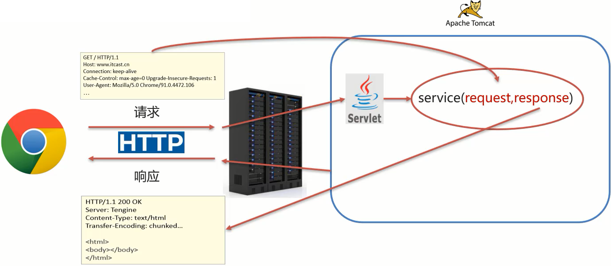
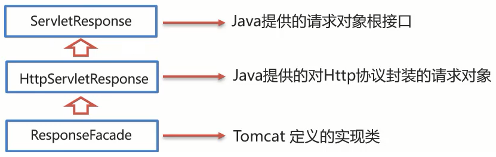
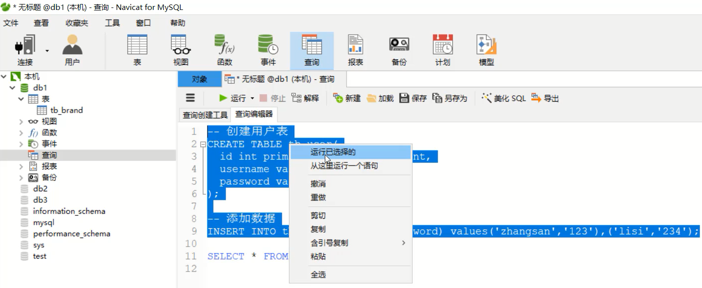
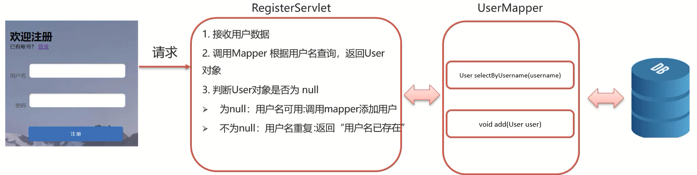

## Request&Response

>* 掌握 Request 对象的概念与使用
>* 掌握 Response 对象的概念与使用
>* 能够完成用户登录注册案例的实现
>* 能够完成 SqlSessionFactory 工具类的抽取

## 1、Request和Response的概述

==Request是请求对象，Response是响应对象。==这两个对象在我们使用Servlet的时候有看到：

此时，我们就需要思考一个问题 request 和 response 这两个参数的作用是什么？



* request:==获取==请求数据
  * 浏览器会发送 HTTP 请求到后台服务器 [Tomcat]
  * HTTP 的请求中会包含很多请求数据 [请求行+请求头+请求体]
  * 后台服务器 [Tomcat] 会对 HTTP 请求中的数据进行解析并把解析结果存入到一个对象中
  * 所存入的对象即为 request 对象，所以我们可以从 request 对象中获取请求的相关参数
  * 获取到数据后就可以继续后续的业务，比如获取用户名和密码就可以实现登录操作的相关业务
* response:==设置==响应数据
  * 业务处理完后，后台就需要给前端返回业务处理的结果即响应数据
  * 把响应数据封装到 response 对象中
  * 后台服务器 [Tomcat] 会解析 response 对象，按照 [响应行+响应头+响应体] 格式拼接结果
  * 浏览器最终解析结果，把内容展示在浏览器给用户浏览

对于上述所讲的内容，我们通过一个案例来初步体验下 request 和 response 对象的使用。

```java
@WebServlet("/demo3")
public class ServletDemo3 extends HttpServlet {
    @Override
    protected void doGet(HttpServletRequest request, HttpServletResponse response) throws ServletException, IOException {
        //使用request对象 获取请求数据
        String name = request.getParameter("name");//url?name=zhangsan

        //使用response对象 设置响应数据
        response.setHeader("content-type","text/html;charset=utf-8");
        response.getWriter().write("<h1>"+name+",欢迎您！</h1>");
    }

    @Override
    protected void doPost(HttpServletRequest request, HttpServletResponse response) throws ServletException, IOException {
        System.out.println("Post...");
    }
}
```

启动成功后就可以通过浏览器来访问，并且根据传入参数的不同就可以在页面上展示不同的内容：


**小结**

在这节中，我们主要认识了下 request 对象和 reponse 对象：

* request 对象是用来封装请求数据的对象
* response 对象是用来封装响应数据的对象

目前我们只知道这两个对象是用来干什么的，那么它们具体是如何实现的，就需要我们继续深入的学习。接下来，就先从 Request 对象来学习，主要学习下面这些内容：

* request 继承体系

* request 获取请求参数
* request 请求转发

## 2、Request对象

### 2.1 Request继承体系

在学习这节内容之前，我们先思考一个问题，前面在介绍 Request 和 Reponse 对象的时候，比较细心的同学可能已经发现：

* 当我们的 Servlet 类实现的是 Servlet 接口的时候，service 方法中的参数是 ServletRequest 和 ServletResponse
* 当我们的 Servlet 类继承的 HttpServlet 类的时候，doGet 和 doPost 方法中的参数就变成 HttpServletRequest 和 HttpServletReponse

那么，

* ServletRequest 和 HttpServletRequest 的关系是什么？
* request 对象是有谁来创建的？
* request 提供了哪些 API，这些 API 从哪里查？

首先，我们先来看下 Request 的继承体系：


从上图中可以看出，ServletRequest 和 HttpServletRequest 都是 Java 提供的，所以我们可以打开 JavaEE 提供的 API 文档[参考: 资料/JavaEE7-api.chm]，打开后可以看到：


所以 ServletRequest 和 HttpServletRequest 是继承关系，并且两个都是接口，接口是无法创建对象，这个时候就引发了下面这个问题：


这个时候，我们就需要用到 Request 继承体系中的`RequestFacade`:

* 该类实现了 HttpServletRequest 接口，也间接实现了 ServletRequest 接口。
* Servlet 类中的 service 方法、doGet 方法或者是 doPost 方法最终都是由 Web 服务器 [Tomcat] 来调用的，所以 Tomcat 提供了方法参数接口的具体实现类，并完成了对象的创建
* 要想了解 RequestFacade 中都提供了哪些方法，我们可以直接查看 JavaEE 的 API 文档中关于 ServletRequest 和 HttpServletRequest 的接口文档，因为 RequestFacade 实现了其接口就需要重写接口中的方法

对于上述结论，要想验证，可以编写一个 Servlet，在方法中把 request 对象打印下，就能看到最终的对象是不是 RequestFacade，代码如下：

```java
@WebServlet("/demo2")
public class ServletDemo2 extends HttpServlet {
    @Override
    protected void doGet(HttpServletRequest request, HttpServletResponse response) throws ServletException, IOException {
        System.out.println(request);
    }

    @Override
    protected void doPost(HttpServletRequest request, HttpServletResponse response) throws ServletException, IOException {
    }
}
```

启动服务器，运行访问`http://localhost:8080/request-demo/demo2`，得到运行结果：


**小结**

* Request 的继承体系为 ServletRequest-->HttpServletRequest-->RequestFacade
* Tomcat 需要解析请求数据，封装为 request 对象，并且创建 request 对象传递到 service 方法
* 使用 request 对象，可以查阅 JavaEE API 文档的 HttpServletRequest 接口中方法说明

### 2.2 Request获取请求数据

HTTP 请求数据总共分为三部分内容，分别是==请求行、请求头、请求体==，对于这三部分内容的数据，分别该如何获取，首先我们先来学习请求行数据如何获取？

#### 2.2.1 获取请求行数据

请求行包含三块内容，分别是`请求方式`、`请求资源路径`、`HTTP协议及版本`


对于这三部分内容，request 对象都提供了对应的 API 方法来获取，具体如下：

* 获取请求方式：`GET`

```
String getMethod()
```

* 获取虚拟目录（项目访问路径）：`/request-demo`

```
String getContextPath()
```

* 获取 URL（统一资源定位符）：`http://localhost:8080/request-demo/req1`

```
StringBuffer getRequestURL()
```

* 获取 URI（统一资源标识符）：`/request-demo/req1`

```
String getRequestURI()
```

* 获取请求参数（GET 方式）：`username=zhangsan&password=123`

```
String getQueryString()
```

介绍完上述方法后，咱们通过代码把上述方法都使用下：

```java
/**
 * request 获取请求数据
 */
@WebServlet("/req1")
public class RequestDemo1 extends HttpServlet {
    @Override
    protected void doGet(HttpServletRequest req, HttpServletResponse resp) throws ServletException, IOException {
        // String getMethod()：获取请求方式： GET
        String method = req.getMethod();
        System.out.println(method);//GET
        // String getContextPath()：获取虚拟目录(项目访问路径)：/request-demo
        String contextPath = req.getContextPath();
        System.out.println(contextPath);
        // StringBuffer getRequestURL(): 获取URL(统一资源定位符)：http://localhost:8080/request-demo/req1
        StringBuffer url = req.getRequestURL();
        System.out.println(url.toString());
        // String getRequestURI()：获取URI(统一资源标识符)： /request-demo/req1
        String uri = req.getRequestURI();
        System.out.println(uri);
        // String getQueryString()：获取请求参数（GET方式）： username=zhangsan
        String queryString = req.getQueryString();
        System.out.println(queryString);
    }
    @Override
    protected void doPost(HttpServletRequest req, HttpServletResponse resp) throws ServletException, IOException {
    }
}
```

启动服务器，访问`http://localhost:8080/request-demo/req1?username=zhangsan&passwrod=123`，获取的结果如下：


#### 2.2.2 获取请求头数据

对于请求头的数据，格式为`key: value`如下：


所以根据请求头名称获取对应值的方法为：

```
String getHeader(String name)
```

接下来，在代码中如果想要获取客户端浏览器的版本信息，则可以使用

```java
/**
 * request 获取请求数据
 */
@WebServlet("/req1")
public class RequestDemo1 extends HttpServlet {
    @Override
    protected void doGet(HttpServletRequest req, HttpServletResponse resp) throws ServletException, IOException {
        //获取请求头: user-agent: 浏览器的版本信息
        String agent = req.getHeader("user-agent");
		System.out.println(agent);
    }
    @Override
    protected void doPost(HttpServletRequest req, HttpServletResponse resp) throws ServletException, IOException {
    }
}

```

重新启动服务器后，`http://localhost:8080/request-demo/req1?username=zhangsan&passwrod=123`，获取的结果如下：


#### 2.2.3 获取请求体数据

浏览器在发送 GET 请求的时候是没有请求体的，所以需要把请求方式变更为 POST，请求体中的数据格式如下：


对于请求体中的数据，Request 对象提供了如下两种方式来获取其中的数据，分别是：

* 获取**字节输入流**，如果前端发送的是字节数据，比如传递的是文件数据，则使用该方法

```
ServletInputStream getInputStream()
该方法可以获取字节
```

* 获取**字符输入流**，如果前端发送的是纯文本数据，则使用该方法

```
BufferedReader getReader()
```

接下来，大家需要思考，要想获取到请求体的内容该如何实现？

>具体实现的步骤如下:
>
>1.准备一个页面，在页面中添加 form 表单，用来发送 post 请求
>
>2.在 Servlet 的 doPost 方法中获取请求体数据
>
>3.在 doPost 方法中使用 request 的 getReader() 或者 getInputStream() 来获取
>
>4.访问测试

1. 在项目的 webapp 目录下添加一个 html 页面，名称为：`req.html`

```html
<!DOCTYPE html>
<html lang="en">
<head>
    <meta charset="UTF-8">
    <title>Title</title>
</head>
<body>
<!-- 
    action:form表单提交的请求地址
    method:请求方式，指定为post
-->
<form action="/request-demo/req1" method="post">
    <input type="text" name="username">
    <input type="password" name="password">
    <input type="submit">
</form>
</body>
</html>
```

2. 在 Servlet 的 doPost 方法中获取数据

```java
/**
 * request 获取请求数据
 */
@WebServlet("/req1")
public class RequestDemo1 extends HttpServlet {
    @Override
    protected void doGet(HttpServletRequest req, HttpServletResponse resp) throws ServletException, IOException {
    }
    @Override
    protected void doPost(HttpServletRequest req, HttpServletResponse resp) throws ServletException, IOException {
        //在此处获取请求体中的数据
    }
}
```

3. 调用 getReader() 或者 getInputStream() 方法，因为目前前端传递的是纯文本数据，所以我们采用 getReader() 方法来获取

```java
/**
 * request 获取请求数据
 */
@WebServlet("/req1")
public class RequestDemo1 extends HttpServlet {
    @Override
    protected void doGet(HttpServletRequest req, HttpServletResponse resp) throws ServletException, IOException {
    }
    @Override
    protected void doPost(HttpServletRequest req, HttpServletResponse resp) throws ServletException, IOException {
        //获取post 请求体：请求参数
        //1. 获取字符输入流
        BufferedReader br = req.getReader();
        //2. 读取数据
        String line = br.readLine();
        System.out.println(line);
    }
}
```

==注意==

BufferedReader 流是通过 request 对象来获取的，当请求完成后 request 对象就会被销毁，request 对象被销毁后，BufferedReader 流就会自动关闭，所以此处就不需要手动关闭流了。

4. 启动服务器，通过浏览器访问`http://localhost:8080/request-demo/req.html`


点击`提交`按钮后，就可以在控制台看到前端所发送的请求数据


**小结**

HTTP 请求数据中包含了`请求行`、`请求头`和`请求体`，针对这三部分内容，Request 对象都提供了对应的 API 方法来获取对应的值：

* 请求行
  * getMethod() 获取请求方式
  * getContextPath() 获取项目访问路径
  * getRequestURL() 获取请求 URL
  * getRequestURI() 获取请求 URI
  * getQueryString() 获取 GET 请求方式的请求参数
* 请求头
  * getHeader(String name) 根据请求头名称获取其对应的值
* 请求体
  * 注意: ==浏览器发送的POST请求才有请求体==
  * 如果是纯文本数据：getReader()
  * 如果是字节数据如文件数据：getInputStream()

#### 2.2.4 获取请求参数的通用方式

在学习下面内容之前，我们先提出两个问题：

* 什么是请求参数？
* 请求参数和请求数据的关系是什么？

1.什么是请求参数？

为了能更好的回答上述两个问题，我们拿用户登录的例子来说明

1.1 想要登录网址，需要进入登录页面

1.2 在登录页面输入用户名和密码

1.3 将用户名和密码提交到后台

1.4 后台校验用户名和密码是否正确

1.5 如果正确，则正常登录，如果不正确，则提示用户名或密码错误

上述例子中，用户名和密码其实就是我们所说的请求参数。

2.什么是请求数据？

请求数据则是包含请求行、请求头和请求体的所有数据

3.请求参数和请求数据的关系是什么？

3.1 请求参数是请求数据中的部分内容

3.2 如果是 GET 请求，请求参数在请求行中

3.3 如果是 POST 请求，请求参数一般在请求体中

对于请求参数的获取,常用的有以下两种：

* GET方式:

```
String getQueryString()
```

* POST方式:

```
BufferedReader getReader();
```

有了上述的知识储备，我们来实现一个案例需求：

（1）发送一个 GET 请求并携带用户名，后台接收后打印到控制台

（2）发送一个 POST 请求并携带用户名，后台接收后打印到控制台

此处大家需要注意的是 GET 请求和 POST 请求接收参数的方式不一样，具体实现的代码如下：

```java
@WebServlet("/req1")
public class RequestDemo1 extends HttpServlet {
    @Override
    protected void doGet(HttpServletRequest req, HttpServletResponse resp) throws ServletException, IOException {

        String result = req.getQueryString();
        System.out.println(result);

    }
    @Override
    protected void doPost(HttpServletRequest req, HttpServletResponse resp) throws ServletException, IOException {
        BufferedReader br = req.getReader();
        String result = br.readLine();
        System.out.println(result);
    }
}
```

* 对于上述的代码，会存在什么问题呢？


* 如何解决上述重复代码的问题呢?


当然，也可以在 doGet 中调用 doPost，在 doPost 中完成参数的获取和打印,另外需要注意的是，doGet 和 doPost 方法都必须存在，不能删除任意一个。

==GET请求和POST请求获取请求参数的方式不一样，在获取请求参数这块该如何实现呢?==

要想实现，我们就需要==思考==：

GET 请求方式和 POST 请求方式区别主要在于获取请求参数的方式不一样，是否可以提供一种==统一==获取请求参数的方式，从而==统一==doGet 和 doPost 方法内的代码？

解决方案一：

```java
@WebServlet("/req1")
public class RequestDemo1 extends HttpServlet {
    @Override
    protected void doGet(HttpServletRequest req, HttpServletResponse resp) throws ServletException, IOException {
        //获取请求方式
        String method = req.getMethod();
        //获取请求参数
        String params = "";
        if("GET".equals(method)){
            params = req.getQueryString();
        }else if("POST".equals(method)){
            BufferedReader reader = req.getReader();
            params = reader.readLine();
        }
        //将请求参数进行打印控制台
        System.out.println(params);
      
    }
    @Override
    protected void doPost(HttpServletRequest req, HttpServletResponse resp) throws ServletException, IOException {
        this.doGet(req,resp);
    }
}
```

使用 request 的 getMethod() 来获取请求方式，根据请求方式的不同分别获取请求参数值，这样就可以解决上述问题，但是以后每个 Servlet 都需要这样写代码，实现起来比较麻烦，这种方案我们不采用

解决方案二：

request 对象已经将上述获取请求参数的方法进行了封装，并且 request 提供的方法实现的功能更强大，以后只需要调用 request 提供的方法即可，在 request 的方法中都实现了哪些操作？

(1) 根据不同的请求方式获取请求参数，获取的内容如下：


(2) 把获取到的内容进行分割，内容如下：


(3) 把分割后端数据，存入到一个 Map 集合中：


**注意**：因为参数的值可能是一个，也可能有多个，所以 Map 的值的类型为 String 数组。

基于上述理论，request 对象为我们提供了如下方法：

* 获取所有参数 Map 集合

```
Map<String, String[]> getParameterMap()
```

* 根据名称获取参数值（数组）

```
String[] getParameterValues(String name)
```

* 根据名称获取参数值（单个值）

```
String getParameter(String name)
```

接下来，我们通过案例来把上述的三个方法进行实例演示：

1.修改 req.html 页面，添加爱好选项，爱好可以同时选多个

```html
<!DOCTYPE html>
<html lang="en">
<head>
    <meta charset="UTF-8">
    <title>Title</title>
</head>
<body>
<form action="/request-demo/req2" method="get">
    <input type="text" name="username"><br>
    <input type="password" name="password"><br>
    <input type="checkbox" name="hobby" value="1"> 游泳
    <input type="checkbox" name="hobby" value="2"> 爬山 <br>
    <input type="submit">
</form>
</body>
</html>
```


2.在 Servlet 代码中获取页面传递 GET 请求的参数值

 2.1获取 GET 方式的所有请求参数

```java
/**
 * request 通用方式获取请求参数
 */
@WebServlet("/req2")
public class RequestDemo2 extends HttpServlet {
    @Override
    protected void doGet(HttpServletRequest req, HttpServletResponse resp) throws ServletException, IOException {
        //GET请求逻辑
        System.out.println("get....");
        //1. 获取所有参数的Map集合
        Map<String, String[]> map = req.getParameterMap();
        for (String key : map.keySet()) {
            // username:zhangsan lisi
            System.out.print(key+":");

            //获取值
            String[] values = map.get(key);
            for (String value : values) {
                System.out.print(value + " ");
            }

            System.out.println();
        }
    }

    @Override
    protected void doPost(HttpServletRequest req, HttpServletResponse resp) throws ServletException, IOException {
    }
}
```

获取的结果为：


 2.2获取 GET 请求参数中的爱好，结果是数组值

```java
/**
 * request 通用方式获取请求参数
 */
@WebServlet("/req2")
public class RequestDemo2 extends HttpServlet {
    @Override
    protected void doGet(HttpServletRequest req, HttpServletResponse resp) throws ServletException, IOException {
        //GET请求逻辑
        //...
        System.out.println("------------");
        String[] hobbies = req.getParameterValues("hobby");
        for (String hobby : hobbies) {
            System.out.println(hobby);
        }
    }

    @Override
    protected void doPost(HttpServletRequest req, HttpServletResponse resp) throws ServletException, IOException {
    }
}
```

获取的结果为：


 2.3获取 GET 请求参数中的用户名和密码，结果是单个值

```java
/**
 * request 通用方式获取请求参数
 */
@WebServlet("/req2")
public class RequestDemo2 extends HttpServlet {
    @Override
    protected void doGet(HttpServletRequest req, HttpServletResponse resp) throws ServletException, IOException {
        //GET请求逻辑
        //...
        String username = req.getParameter("username");
        String password = req.getParameter("password");
        System.out.println(username);
        System.out.println(password);
    }

    @Override
    protected void doPost(HttpServletRequest req, HttpServletResponse resp) throws ServletException, IOException {
    }
}
```

获取的结果为：


3.在 Servlet 代码中获取页面传递 POST 请求的参数值

 3.1将 req.html 页面 form 表单的提交方式改成 post

 3.2将 doGet 方法中的内容复制到 doPost 方法中即可

**小结**

* req.getParameter() 方法使用的频率会比较高

* 以后我们再写代码的时候，就只需要按照如下格式来编写：

```java
public class RequestDemo1 extends HttpServlet {
    @Override
    protected void doGet(HttpServletRequest req, HttpServletResponse resp) throws ServletException, IOException {
       //采用request提供的获取请求参数的通用方式来获取请求参数
       //编写其他的业务代码...
    }
    @Override
    protected void doPost(HttpServletRequest req, HttpServletResponse resp) throws ServletException, IOException {
        this.doGet(req,resp);
    }
}
```

### 2.3 IDEA快速创建Servlet

使用通用方式获取请求参数后，屏蔽了GET和POST的请求方式代码的不同，则代码可以定义如下格式:


由于格式固定，所以我们可以使用 IDEA 提供的模板来制作一个 Servlet 的模板，这样我们后期在创建 Servlet 的时候就会更高效，具体如何实现：

(1) 按照自己的需求，修改 Servlet 创建的模板内容


（2）使用 servlet 模板创建 Servlet 类


### 2.4 请求参数中文乱码问题

问题展示：

(1)将 req.html 页面的请求方式修改为 get

```html
<!DOCTYPE html>
<html lang="en">
<head>
    <meta charset="UTF-8">
    <title>Title</title>
</head>
<body>
<form action="/request-demo/req2" method="get">
    <input type="text" name="username"><br>
    <input type="password" name="password"><br>
    <input type="checkbox" name="hobby" value="1"> 游泳
    <input type="checkbox" name="hobby" value="2"> 爬山 <br>
    <input type="submit">

</form>
</body>
</html>
```

(2)在 Servlet 方法中获取参数，并打印

```java
/**
 * 中文乱码问题解决方案
 */
@WebServlet("/req4")
public class RequestDemo4 extends HttpServlet {
    @Override
    protected void doGet(HttpServletRequest request, HttpServletResponse response) throws ServletException, IOException {
       //1. 获取username
       String username = request.getParameter("username");
       System.out.println(username);
    }

    @Override
    protected void doPost(HttpServletRequest request, HttpServletResponse response) throws ServletException, IOException {
        this.doGet(request, response);
    }
}
```

（3）启动服务器，页面上输入中文参数


（4）查看控制台打印内容


（5）把 req.html 页面的请求方式改成 post，再次发送请求和中文参数


（6）查看控制台打印内容，依然为乱码


通过上面的案例，会发现，不管是 GET 还是 POST 请求，在发送的请求参数中如果有中文，在后台接收的时候，都会出现中文乱码的问题。具体该如何解决呢？

#### 2.4.1 POST请求解决方案

* 分析出现中文乱码的原因：
  * POST 的请求参数是通过 request 的 getReader() 来获取流中的数据
  * TOMCAT 在获取流的时候采用的编码是 ISO-8859-1
  * ISO-8859-1 编码是不支持中文的，所以会出现乱码
* 解决方案：
  * 页面设置的编码格式为 UTF-8
  * 把 TOMCAT 在获取流数据之前的编码设置为 UTF-8
  * 通过 request.setCharacterEncoding("UTF-8") 设置编码，UTF-8 也可以写成小写

修改后的代码为：

```java
/**
 * 中文乱码问题解决方案
 */
@WebServlet("/req4")
public class RequestDemo4 extends HttpServlet {
    @Override
    protected void doGet(HttpServletRequest request, HttpServletResponse response) throws ServletException, IOException {
        //1. 解决乱码: POST getReader()
        //设置字符输入流的编码，设置的字符集要和页面保持一致
        request.setCharacterEncoding("UTF-8");
       //2. 获取username
       String username = request.getParameter("username");
       System.out.println(username);
    }

    @Override
    protected void doPost(HttpServletRequest request, HttpServletResponse response) throws ServletException, IOException {
        this.doGet(request, response);
    }
}
```

重新发送 POST 请求，就会在控制台看到正常展示的中文结果。

至此 POST 请求中文乱码的问题就已经解决，但是这种方案不适用于 GET 请求，这个原因是什么呢，咱们下面再分析。

#### 2.4.2 GET请求解决方案

刚才提到一个问题是`POST请求的中文乱码解决方案为什么不适用GET请求？`

* GET 请求获取请求参数的方式是`request.getQueryString()`
* POS T请求获取请求参数的方式是`request.getReader()`
* request.setCharacterEncoding("utf-8") 是设置 request 处理流的编码
* getQueryString 方法并没有通过流的方式获取数据

所以 GET 请求不能用设置编码的方式来解决中文乱码问题，那问题又来了，如何解决 GET 请求的中文乱码呢？

1. 首先我们需要先分析下 GET 请求出现乱码的原因：

 

(1)浏览器通过 HTTP 协议发送请求和数据给后台服务器（Tomcat)

(2)浏览器在发送 HTTP 的过程中会对中文数据进行 URL==编码==

(3)在进行 URL 编码的时候会采用页面`<meta>`标签指定的 UTF-8 的方式进行编码，`张三`编码后的结果为`%E5%BC%A0%E4%B8%89`

(4)后台服务器(Tomcat)接收到`%E5%BC%A0%E4%B8%89`后会默认按照`ISO-8859-1`进行 URL==解码==

(5)由于前后编码与解码采用的格式不一样，就会导致后台获取到的数据为乱码。

思考: 如果把`req.html`页面的`<meta>`标签的 charset 属性改成`ISO-8859-1`，后台不做操作，能解决中文乱码问题么？

答案是否定的，因为`ISO-8859-1`本身是不支持中文展示的，所以改了 `<meta>` 标签的 charset 属性后，会导致页面上的中文内容都无法正常展示。

分析完上面的问题后，我们会发现，其中有两个我们不熟悉的内容就是==URL编码==和==URL解码==，什么是 URL 编码，什么又是 URL 解码呢?

**URL编码**

这块知识我们只需要了解下即可,具体编码过程分两步，分别是：

(1)将字符串按照编码方式转为二进制

(2)每个字节转为2个16进制数并在前边加上%

`张三`按照UTF-8的方式转换成二进制的结果为：

```
1110 0101 1011 1100 1010 0000 1110 0100 1011 1000 1000 1001
```

这个结果是如何计算的？

使用`http://www.mytju.com/classcode/tools/encode_utf8.asp`，输入`张三`


就可以获取张和三分别对应的 10 进制，然后在使用计算器，选择程序员模式，计算出对应的二进制数据结果：


在计算的十六进制结果中，每两位前面加一个%，就可以获取到`%E5%BC%A0%E4%B8%89`。

当然你从上面所提供的网站中就已经能看到编码16进制的结果了：


但是对于上面的计算过程，如果没有工具，纯手工计算的话，相对来说还是比较复杂的，我们也不需要进行手动计算，在 Java 中已经为我们提供了编码和解码的 API 工具类可以让我们更快速的进行编码和解码：

编码：

```java
java.net.URLEncoder.encode("需要被编码的内容", "字符集(UTF-8)")
```

解码：

```java
java.net.URLDecoder.decode("需要被解码的内容", "字符集(UTF-8)")
```

接下来咱们对`张三`来进行编码和解码

```java
public class URLDemo {

  public static void main(String[] args) throws UnsupportedEncodingException {
        String username = "张三";
        //1. URL编码
        String encode = URLEncoder.encode(username, "utf-8");
        System.out.println(encode); //打印:%E5%BC%A0%E4%B8%89

       //2. URL解码
       //String decode = URLDecoder.decode(encode, "utf-8");//打印:张三
       String decode = URLDecoder.decode(encode, "ISO-8859-1");//打印:`å¼ ä¸ `
       System.out.println(decode);
    }
}
```

到这，我们就可以分析出 GET 请求中文参数出现乱码的原因了，

* 浏览器把中文参数按照`UTF-8`进行 URL 编码
* Tomcat 对获取到的内容进行了`ISO-8859-1`的 URL 解码
* 在控制台就会出现类上`å¼ ä¸‰`的乱码，最后一位是个空格

2. 清楚了出现乱码的原因，接下来我们就需要想办法进行解决


从上图可以看住，

* 在进行编码和解码的时候，不管使用的是哪个字符集，他们对应的`%E5%BC%A0%E4%B8%89`是一致的

* 那他们对应的二进制值也是一样的，为：

  * ```
    1110 0101 1011 1100 1010 0000 1110 0100 1011 1000 1000 1001
    ```

* 为所以我们可以考虑把`å¼ ä¸‰`转换成字节，在把字节转换成`张三`，在转换的过程中是它们的编码一致，就可以解决中文乱码问题。

具体的实现步骤为：

>1.按照 ISO-8859-1 编码获取乱码`å¼ ä¸‰`对应的字节数组
>
>2.按照 UTF-8 编码获取字节数组对应的字符串

实现代码如下：

```java
public class URLDemo {

  public static void main(String[] args) throws UnsupportedEncodingException {
        String username = "张三";
        //1. URL编码
        String encode = URLEncoder.encode(username, "utf-8");
        System.out.println(encode);
        //2. URL解码
        String decode = URLDecoder.decode(encode, "ISO-8859-1");

        System.out.println(decode); //此处打印的是对应的乱码数据

        //3. 转换为字节数据,编码
        byte[] bytes = decode.getBytes("ISO-8859-1");
        for (byte b : bytes) {
            System.out.print(b + " ");
        }
		//此处打印的是:-27 -68 -96 -28 -72 -119
        //4. 将字节数组转为字符串，解码
        String s = new String(bytes, "utf-8");
        System.out.println(s); //此处打印的是张三
    }
}
```

**说明**:在第18行中打印的数据是`-27 -68 -96 -28 -72 -119`和`张三`转换成的二进制数据`1110 0101 1011 1100 1010 0000 1110 0100 1011 1000 1000 1001`为什么不一样呢？

其实打印出来的是十进制数据，我们只需要使用计算机换算下就能得到他们的对应关系，如下图：


至此对于 GET 请求中文乱码的解决方案，我们就已经分析完了，最后在代码中去实现下：

```java
/**
 * 中文乱码问题解决方案
 */
@WebServlet("/req4")
public class RequestDemo4 extends HttpServlet {
    @Override
    protected void doGet(HttpServletRequest request, HttpServletResponse response) throws ServletException, IOException {
        //1. 解决乱码：POST，getReader()
        //request.setCharacterEncoding("UTF-8");//设置字符输入流的编码

        //2. 获取username
        String username = request.getParameter("username");
        System.out.println("解决乱码前："+username);

        //3. GET,获取参数的方式：getQueryString
        // 乱码原因：tomcat进行URL解码，默认的字符集ISO-8859-1
       /* //3.1 先对乱码数据进行编码：转为字节数组
        byte[] bytes = username.getBytes(StandardCharsets.ISO_8859_1);
        //3.2 字节数组解码
        username = new String(bytes, StandardCharsets.UTF_8);*/

        username  = new String(username.getBytes(StandardCharsets.ISO_8859_1), StandardCharsets.UTF_8);

        System.out.println("解决乱码后："+username);

    }

    @Override
    protected void doPost(HttpServletRequest request, HttpServletResponse response) throws ServletException, IOException {
        this.doGet(request, response);
    }
}
```

**注意**

* 把`request.setCharacterEncoding("UTF-8")`代码注释掉后，会发现 GET 请求参数乱码解决方案同时也可也把 POST 请求参数乱码的问题也解决了
* 只不过对于 POST 请求参数一般都会比较多，采用这种方式解决乱码起来比较麻烦，所以对于 POST 请求还是建议使用设置编码的方式进行。

另外需要说明一点的是==Tomcat8.0之后，已将GET请求乱码问题解决，设置默认的解码方式为UTF-8==

**小结**

1. 中文乱码解决方案

* POST 请求和 GET 请求的参数中如果有中文，后台接收数据就会出现中文乱码问题

  GET 请求在 Tomcat8.0 以后的版本就不会出现了

* POST 请求解决方案是：设置输入流的编码

  ```
  request.setCharacterEncoding("UTF-8");
  注意:设置的字符集要和页面保持一致
  ```

* 通用方式（GET/POST）：需要先解码，再编码

  ```
  new String(username.getBytes("ISO-8859-1"), "UTF-8");
  ```

2. URL 编码实现方式：

* 编码：

  ```
  URLEncoder.encode(str,"UTF-8");
  ```

* 解码：

  ```
  URLDecoder.decode(s,"ISO-8859-1");
  ```

### 2.5 Request请求转发

1. ==请求转发(forward)：一种在服务器内部的资源跳转方式。==


(1)浏览器发送请求给服务器，服务器中对应的资源A接收到请求

(2)资源A处理完请求后将请求发给资源B

(3)资源B处理完后将结果响应给浏览器

(4)请求从资源A到资源B的过程就叫==请求转发==

2. 请求转发的实现方式：

```
req.getRequestDispatcher("资源B路径").forward(req,resp);
```

具体如何来使用，我们先来看下需求：


针对上述需求，具体的实现步骤为:

>1.创建一个 RequestDemo5 类，接收 /req5 的请求，在 doGet 方法中打印`demo5`
>
>2.创建一个 RequestDemo6 类，接收 /req6 的请求，在 doGet 方法中打印`demo6`
>
>3.在 RequestDemo5 的方法中使用
>
>​	req.getRequestDispatcher("/req6").forward(req, resp) 进行请求转发
>
>4.启动测试

(1)创建 RequestDemo5 类

```java
/**
 * 请求转发
 */
@WebServlet("/req5")
public class RequestDemo5 extends HttpServlet {
    @Override
    protected void doGet(HttpServletRequest request, HttpServletResponse response) throws ServletException, IOException {
        System.out.println("demo5...");
    }

    @Override
    protected void doPost(HttpServletRequest request, HttpServletResponse response) throws ServletException, IOException {
        this.doGet(request, response);
    }
}
```

(2)创建 RequestDemo6 类

```java
/**
 * 请求转发
 */
@WebServlet("/req6")
public class RequestDemo6 extends HttpServlet {
    @Override
    protected void doGet(HttpServletRequest request, HttpServletResponse response) throws ServletException, IOException {
        System.out.println("demo6...");
    }

    @Override
    protected void doPost(HttpServletRequest request, HttpServletResponse response) throws ServletException, IOException {
        this.doGet(request, response);
    }
}
```

(3)在 RequestDemo5 的 doGet 方法中进行请求转发

```java
/**
 * 请求转发
 */
@WebServlet("/req5")
public class RequestDemo5 extends HttpServlet {
    @Override
    protected void doGet(HttpServletRequest request, HttpServletResponse response) throws ServletException, IOException {
        System.out.println("demo5...");
        //请求转发
        request.getRequestDispatcher("/req6").forward(request,response);
    }

    @Override
    protected void doPost(HttpServletRequest request, HttpServletResponse response) throws ServletException, IOException {
        this.doGet(request, response);
    }
}
```

(4)启动测试

访问`http://localhost:8080/request-demo/req5`,就可以在控制台看到如下内容:


说明请求已经转发到了`/req6`

#### 2.5.1 请求转发资源间共享数据：使用Request对象

此处主要解决的问题是把请求从`/req5`转发到`/req6`的时候，如何传递数据给`/req6`。

需要使用 request 对象提供的三个方法：

* 存储数据到 request 域[范围数据是存储在request对象]中

```
void setAttribute(String name, Object o);
```

* 根据 key 获取值

```
Object getAttribute(String name);
```

* 根据 key 删除该键值对

```
void removeAttribute(String name);
```

接着上个需求来：


> 1.在 RequestDemo5 的 doGet 方法中转发请求之前，将数据存入 request 域对象中
>
> 2.在 RequestDemo6 的 doGet 方法从 request 域对象中获取数据，并将数据打印到控制台
>
> 3.启动访问测试

(1)修改 RequestDemo5 中的方法

```java
@WebServlet("/req5")
public class RequestDemo5 extends HttpServlet {
    @Override
    protected void doGet(HttpServletRequest request, HttpServletResponse response) throws ServletException, IOException {
        System.out.println("demo5...");
        //存储数据
        request.setAttribute("msg","hello");
        //请求转发
        request.getRequestDispatcher("/req6").forward(request,response);

    }

    @Override
    protected void doPost(HttpServletRequest request, HttpServletResponse response) throws ServletException, IOException {
        this.doGet(request, response);
    }
}
```

(2)修改 RequestDemo6 中的方法

```java
/**
 * 请求转发
 */
@WebServlet("/req6")
public class RequestDemo6 extends HttpServlet {
    @Override
    protected void doGet(HttpServletRequest request, HttpServletResponse response) throws ServletException, IOException {
        System.out.println("demo6...");
        //获取数据
        Object msg = request.getAttribute("msg");
        System.out.println(msg);

    }

    @Override
    protected void doPost(HttpServletRequest request, HttpServletResponse response) throws ServletException, IOException {
        this.doGet(request, response);
    }
}
```

(3)启动测试

访问`http://localhost:8080/request-demo/req5`，就可以在控制台看到如下内容：


此时就可以实现在转发多个资源之间共享数据。

#### 2.5.2 请求转发的特点

* 浏览器地址栏路径不发生变化

  虽然后台从`/req5`转发到`/req6`,但是浏览器的地址一直是`/req5`，未发生变化

  

* 只能转发到当前服务器的内部资源

  不能从一个服务器通过转发访问另一台服务器

* 一次请求，可以在转发资源间使用 request 共享数据

  虽然后台从`/req5`转发到`/req6`，但是这个==只有一次请求==

## 3、Response对象

前面讲解完 Request 对象，接下来我们回到刚开始的那张图：


* Request：使用 request 对象来==获取==请求数据
* Response：使用 response 对象来==设置==响应数据

Reponse 的继承体系和 Request 的继承体系也非常相似：



 介绍完 Response 的相关体系结构后，接下来对于 Response 我们需要学习如下内容：

* Response 设置响应数据的功能介绍
* Response 完成重定向
* Response 响应字符数据
* Response 响应字节数据

### 3.1 Response设置响应数据功能介绍

HTTP 响应数据总共分为三部分内容，分别是==响应行、响应头、响应体==，对于这三部分内容的数据，respone 对象都提供了哪些方法来进行设置?

1. 响应行


对于响应头，比较常用的就是设置响应状态码：

```
void setStatus(int sc);
```

2. 响应头


设置响应头键值对：

```
void setHeader(String name, String value);
```

3. 响应体


对于响应体，是通过字符、字节输出流的方式往浏览器写，

获取字符输出流：

```
PrintWriter getWriter();
```

获取字节输出流：

```
ServletOutputStream getOutputStream();
```

介绍完这些方法后，后面我们会通过案例把这些方法都用一用，首先先来完成下重定向的功能开发。

### 3.2 Respones请求重定向

1. ==Response重定向(redirect)：一种资源跳转方式。==


(1)浏览器发送请求给服务器，服务器中对应的资源A接收到请求

(2)资源A现在无法处理该请求，就会给浏览器响应一个 302 的状态码 + location 的一个访问资源 B 的路径

(3)浏览器接收到响应状态码为 302 就会重新发送请求到 location 对应的访问地址去访问资源 B

(4)资源 B 接收到请求后进行处理并最终给浏览器响应结果，这整个过程就叫==重定向==

2. 重定向的实现方式：

```
resp.setStatus(302);
resp.setHeader("location","资源B的访问路径");
```

具体如何来使用，我们先来看下需求：


针对上述需求，具体的实现步骤为：

> 1.创建一个 ResponseDemo1 类，接收 /resp1 的请求，在 doGet 方法中打印`resp1....`
>
> 2.创建一个 ResponseDemo2 类，接收 /resp2 的请求，在 doGet 方法中打印`resp2....`
>
> 3.在 ResponseDemo1 的方法中使用
>
> ​	response.setStatus(302);
>
> ​	response.setHeader("Location","/request-demo/resp2") 来给前端响应结果数据
>
> 4.启动测试

(1)创建 ResponseDemo1 类

```java
@WebServlet("/resp1")
public class ResponseDemo1 extends HttpServlet {
    @Override
    protected void doGet(HttpServletRequest request, HttpServletResponse response) throws ServletException, IOException {
        System.out.println("resp1....");
    }

    @Override
    protected void doPost(HttpServletRequest request, HttpServletResponse response) throws ServletException, IOException {
        this.doGet(request, response);
    }
}
```

(2)创建 ResponseDemo2 类

```java
@WebServlet("/resp2")
public class ResponseDemo2 extends HttpServlet {
    @Override
    protected void doGet(HttpServletRequest request, HttpServletResponse response) throws ServletException, IOException {
        System.out.println("resp2....");
    }

    @Override
    protected void doPost(HttpServletRequest request, HttpServletResponse response) throws ServletException, IOException {
        this.doGet(request, response);
    }
}
```

(3)在 ResponseDemo1 的 doGet 方法中给前端响应数据

```java
@WebServlet("/resp1")
public class ResponseDemo1 extends HttpServlet {
    @Override
    protected void doGet(HttpServletRequest request, HttpServletResponse response) throws ServletException, IOException {
        System.out.println("resp1....");
        //重定向
        //1.设置响应状态码 302
        response.setStatus(302);
        //2. 设置响应头 Location
        response.setHeader("Location","/request-demo/resp2");
    }

    @Override
    protected void doPost(HttpServletRequest request, HttpServletResponse response) throws ServletException, IOException {
        this.doGet(request, response);
    }
}
```

(4)启动测试

访问`http://localhost:8080/request-demo/resp1`，就可以在控制台看到如下内容：


说明`/resp1`和`/resp2`都被访问到了。到这重定向就已经完成了。

虽然功能已经实现，但是从设置重定向的两行代码来看，会发现除了重定向的地址不一样，其他的内容都是一模一样，所以 request 对象给我们提供了简化的编写方式为：

```
resposne.sendRedirect("/request-demo/resp2")
```

所以第3步中的代码就可以简化为：

```java
@WebServlet("/resp1")
public class ResponseDemo1 extends HttpServlet {
    @Override
    protected void doGet(HttpServletRequest request, HttpServletResponse response) throws ServletException, IOException {
        System.out.println("resp1....");
        //重定向
        resposne.sendRedirect("/request-demo/resp2")；
    }

    @Override
    protected void doPost(HttpServletRequest request, HttpServletResponse response) throws ServletException, IOException {
        this.doGet(request, response);
    }
}
```

3. 重定向的特点

* 浏览器地址栏路径发送变化

  当进行重定向访问的时候，由于是由浏览器发送的两次请求，所以地址会发生变化

  

* 可以重定向到任何位置的资源（服务内、外部均可）

  因为第一次响应结果中包含了浏览器下次要跳转的路径，所以这个路径是可以任意位置资源。

* 两次请求，不能在多个资源使用 request 共享数据

  因为浏览器发送了两次请求，是两个不同的 request 对象，就无法通过 request 对象进行共享数据

介绍完==请求重定向==和==请求转发==以后，接下来需要把这两个放在一块对比下：


以后到底用哪个，还是需要根据具体的业务来决定。

### 3.3 路径问题

1. 问题1：转发的时候路径上没有加`/request-demo`而重定向加了，那么到底什么时候需要加，什么时候不需要加呢？


其实判断的依据很简单，只需要记住下面的规则即可:

* 浏览器使用：需要加虚拟目录(项目访问路径)
* 服务端使用：不需要加虚拟目录

对于转发来说，因为是在服务端进行的，所以不需要加虚拟目录

对于重定向来说，路径最终是由浏览器来发送请求，就需要添加虚拟目录。

掌握了这个规则，接下来就通过一些练习来强化下知识的学习：

* `<a href='路劲'>`
* `<form action='路径'>`
* `req.getRequestDispatcher("路径")`
* `resp.sendRedirect("路径")`

答案：

```
1.超链接，从浏览器发送，需要加
2.表单，从浏览器发送，需要加
3.转发，是从服务器内部跳转，不需要加
4.重定向，是由浏览器进行跳转，需要加。
```

2. 问题2：在重定向的代码中，`/request-demo`是固定编码的，如果后期通过 Tomcat 插件配置了项目的访问路径，那么所有需要重定向的地方都需要重新修改，该如何优化？


答案也比较简单，我们可以在代码中动态去获取项目访问的虚拟目录，具体如何获取，我们可以借助前面咱们所学习的 request 对象中的 getContextPath() 方法，修改后的代码如下：

```java
@WebServlet("/resp1")
public class ResponseDemo1 extends HttpServlet {
    @Override
    protected void doGet(HttpServletRequest request, HttpServletResponse response) throws ServletException, IOException {
        System.out.println("resp1....");

        //简化方式完成重定向
        //动态获取虚拟目录
        String contextPath = request.getContextPath();
        response.sendRedirect(contextPath+"/resp2");
    }

    @Override
    protected void doPost(HttpServletRequest request, HttpServletResponse response) throws ServletException, IOException {
        this.doGet(request, response);
    }
}
```

重新启动访问测试，功能依然能够实现，此时就可以动态获取项目访问的虚拟路径，从而降低代码的耦合度。

### 3.4 Response响应字符数据

要想将字符数据写回到浏览器，我们需要两个步骤：

* 通过 Response 对象获取字符输出流：PrintWriter writer = resp.getWriter();

* 通过字符输出流写数据：writer.write("aaa");

接下来，我们实现通过些案例把响应字符数据给实际应用下：

1. 返回一个简单的字符串`aaa`

```java
/**
 * 响应字符数据：设置字符数据的响应体
 */
@WebServlet("/resp3")
public class ResponseDemo3 extends HttpServlet {
    @Override
    protected void doGet(HttpServletRequest request, HttpServletResponse response) throws ServletException, IOException {
        response.setContentType("text/html;charset=utf-8");
        //1. 获取字符输出流
        PrintWriter writer = response.getWriter();
	    writer.write("aaa");
    }
    @Override
    protected void doPost(HttpServletRequest request, HttpServletResponse response) throws ServletException, IOException {
        this.doGet(request, response);
    }
}
```


2. 返回一串 html 字符串，并且能被浏览器解析

```
PrintWriter writer = response.getWriter();
//content-type，告诉浏览器返回的数据类型是HTML类型数据，这样浏览器才会解析HTML标签
response.setHeader("content-type","text/html");
writer.write("<h1>aaa</h1>");
```


==注意:==一次请求响应结束后，response 对象就会被销毁掉，所以不要手动关闭流。

3. 返回一个中文的字符串`你好`，需要注意设置响应数据的编码为`utf-8`

```
//设置响应的数据格式及数据的编码
response.setContentType("text/html;charset=utf-8");
writer.write("你好");
```


### 3.3 Response响应字节数据

要想将字节数据写回到浏览器，我们需要两个步骤：

- 通过 Response 对象获取字节输出流：ServletOutputStream outputStream = resp.getOutputStream();

- 通过字节输出流写数据：outputStream.write(字节数据);

接下来，我们实现通过些案例把响应字符数据给实际应用下：

1. 返回一个图片文件到浏览器

```java
/**
 * 响应字节数据：设置字节数据的响应体
 */
@WebServlet("/resp4")
public class ResponseDemo4 extends HttpServlet {
    @Override
    protected void doGet(HttpServletRequest request, HttpServletResponse response) throws ServletException, IOException {
        //1. 读取文件
        FileInputStream fis = new FileInputStream("d://a.jpg");
        //2. 获取response字节输出流
        ServletOutputStream os = response.getOutputStream();
        //3. 完成流的copy
        byte[] buff = new byte[1024];
        int len = 0;
        while ((len = fis.read(buff))!= -1){
            os.write(buff,0,len);
        }
        fis.close();
    }

    @Override
    protected void doPost(HttpServletRequest request, HttpServletResponse response) throws ServletException, IOException {
        this.doGet(request, response);
    }
}
```


上述代码中，对于流的 copy 的代码还是比较复杂的，所以我们可以使用别人提供好的方法来简化代码的开发，具体的步骤是：

(1) pom.xml 添加依赖

```xml
<dependency>
    <groupId>commons-io</groupId>
    <artifactId>commons-io</artifactId>
    <version>2.6</version>
</dependency>
```

(2)调用工具类方法

```
//fis:输入流
//os:输出流
IOUtils.copy(fis, os);
```

优化后的代码：

```java
/**
 * 响应字节数据：设置字节数据的响应体
 */
@WebServlet("/resp4")
public class ResponseDemo4 extends HttpServlet {
    @Override
    protected void doGet(HttpServletRequest request, HttpServletResponse response) throws ServletException, IOException {
        //1. 读取文件
        FileInputStream fis = new FileInputStream("d://a.jpg");
        //2. 获取response字节输出流
        ServletOutputStream os = response.getOutputStream();
        //3. 完成流的copy
      	IOUtils.copy(fis,os);
        fis.close();
    }

    @Override
    protected void doPost(HttpServletRequest request, HttpServletResponse response) throws ServletException, IOException {
        this.doGet(request, response);
    }
}
```

如果是响应图片，还可以这样做：

```java
FileInputStream fis = new FileInputStream("d://a.jpg");
int size = fis.available(); // 得到文件大小
byte data[] = new byte[size];
fis.read(data);  // 读数据
fis.close();
response.setContentType("image/gif"); // 设置返回的文件类型
OutputStream os = response.getOutputStream();
os.write(data);
os.flush();
os.close();
```

## 4、用户注册登录案例

接下来我们通过两个比较常见的案例，一个是==注册==，一个是==登录==来对今天学习的内容进行一个实战演练，首先来实现用户登录。

### 4.1 用户登录

#### 4.1.1 需求分析


1. 用户在登录页面输入用户名和密码，提交请求给 LoginServlet
2. 在 LoginServlet 中接收请求和数据[用户名和密码]
3. 在 LoginServlt 中通过 Mybatis 实现调用 UserMapper 来根据用户名和密码查询数据库表
4. 将查询的结果封装到 User 对象中进行返回
5. 在 LoginServlet 中判断返回的 User 对象是否为 null
6. 如果为 nul，说明根据用户名和密码没有查询到用户，则登录失败，返回"登录失败"数据给前端
7. 如果不为 null，则说明用户存在并且密码正确，则登录成功，返回"登录成功"数据给前端

#### 4.1.2 环境准备

1. 复制资料中的静态页面到项目的 webapp 目录下

参考`资料\1. 登陆注册案例\1. 静态页面`，拷贝完效果如下:


2. 创建 db1 数据库，创建 tb_user 表，创建 User 实体类

2.1 将`资料\1. 登陆注册案例\2. MyBatis环境\tb_user.sql`中的 sql 语句执行下：



 2.2 将`资料\1. 登陆注册案例\2. MyBatis环境\User.java`拷贝到 com.itheima.pojo


3. 在项目的 pom.xml 导入 Mybatis 和 Mysql 驱动坐标

```xml
<dependency>
    <groupId>org.mybatis</groupId>
    <artifactId>mybatis</artifactId>
    <version>3.5.5</version>
</dependency>

<dependency>
    <groupId>mysql</groupId>
    <artifactId>mysql-connector-java</artifactId>
    <version>5.1.34</version>
</dependency>
```

4. 创建 mybatis-config.xml 核心配置文件，UserMapper.xml 映射文件，UserMapper 接口

4.1  将`资料\1. 登陆注册案例\2. MyBatis环境\mybatis-config.xml`拷贝到 resources 目录下

```xml
<?xml version="1.0" encoding="UTF-8" ?>
<!DOCTYPE configuration
        PUBLIC "-//mybatis.org//DTD Config 3.0//EN"
        "http://mybatis.org/dtd/mybatis-3-config.dtd">
<configuration>
    <!--起别名-->
    <typeAliases>
        <package name="com.itheima.pojo"/>
    </typeAliases>

    <environments default="development">
        <environment id="development">
            <transactionManager type="JDBC"/>
            <dataSource type="POOLED">
                <property name="driver" value="com.mysql.jdbc.Driver"/>
                <!--
                    useSSL:关闭SSL安全连接 性能更高
                    useServerPrepStmts:开启预编译功能
                    &amp; 等同于 & ,xml配置文件中不能直接写 &符号
                -->
                <property name="url" value="jdbc:mysql:///db1?useSSL=false&amp;useServerPrepStmts=true"/>
                <property name="username" value="root"/>
                <property name="password" value="1234"/>
            </dataSource>
        </environment>
    </environments>
    <mappers>
        <!--扫描mapper-->
        <package name="com.itheima.mapper"/>
    </mappers>
</configuration>
```

4.2 在 com.itheima.mapper 包下创建 UserMapper 接口

```java
public interface UserMapper {

}
```

4.3 将`资料\1. 登陆注册案例\2. MyBatis环境\UserMapper.xml`拷贝到 resources 目录下

==注意：在resources下创建UserMapper.xml的目录时，要使用/分割==


至此我们所需要的环境就都已经准备好了，具体该如何实现？

#### 4.1.3 代码实现

1. 在 UserMapper 接口中提供一个根据用户名和密码查询用户对象的方法

```java
/**
     * 根据用户名和密码查询用户对象
     * @param username
     * @param password
     * @return
     */
    @Select("select * from tb_user where username = #{username} and password = #{password}")
    User select(@Param("username") String username,@Param("password")  String password);
```

**说明**

@Param 注解的作用：用于传递参数,是方法的参数可以与 SQL 中的字段名相对应。

2. 修改 loign.html

```html
<!DOCTYPE html>
<html lang="en">

<head>
    <meta charset="UTF-8">
    <title>login</title>
    <link href="css/login.css" rel="stylesheet">
</head>

<body>
<div id="loginDiv">
    <form action="/request-demo/loginServlet" method="post" id="form">
        <h1 id="loginMsg">LOGIN IN</h1>
        <p>Username:<input id="username" name="username" type="text"></p>

        <p>Password:<input id="password" name="password" type="password"></p>

        <div id="subDiv">
            <input type="submit" class="button" value="login up">
            <input type="reset" class="button" value="reset">&nbsp;&nbsp;&nbsp;
            <a href="register.html">没有账号？点击注册</a>
        </div>
    </form>
</div>

</body>
</html>
```

3. 编写 LoginServlet

```java
@WebServlet("/loginServlet")
public class LoginServlet extends HttpServlet {
    @Override
    protected void doGet(HttpServletRequest request, HttpServletResponse response) throws ServletException, IOException {
        //1. 接收用户名和密码
        String username = request.getParameter("username");
        String password = request.getParameter("password");

        //2. 调用MyBatis完成查询
        //2.1 获取SqlSessionFactory对象
        String resource = "mybatis-config.xml";
        InputStream inputStream = Resources.getResourceAsStream(resource);
        SqlSessionFactory sqlSessionFactory = new SqlSessionFactoryBuilder().build(inputStream);
        //2.2 获取SqlSession对象
        SqlSession sqlSession = sqlSessionFactory.openSession();
        //2.3 获取Mapper
        UserMapper userMapper = sqlSession.getMapper(UserMapper.class);
        //2.4 调用方法
        User user = userMapper.select(username, password);
        //2.5 释放资源
        sqlSession.close();


        //获取字符输出流，并设置content type
        response.setContentType("text/html;charset=utf-8");
        PrintWriter writer = response.getWriter();
        //3. 判断user释放为null
        if(user != null){
            // 登陆成功
            writer.write("登陆成功");
        }else {
            // 登陆失败
            writer.write("登陆失败");
        }
    }

    @Override
    protected void doPost(HttpServletRequest request, HttpServletResponse response) throws ServletException, IOException {
        this.doGet(request, response);
    }
}
```

4. 启动服务器测试

4.1 如果用户名和密码输入错误，则


4.2 如果用户名和密码输入正确，则


至此用户的登录功能就已经完成了~

### 4.2 用户注册

#### 4.2.1 需求分析



1. 用户在注册页面输入用户名和密码，提交请求给 RegisterServlet
2. 在 RegisterServlet 中接收请求和数据[用户名和密码]
3. 在 RegisterServlet 中通过 Mybatis 实现调用 UserMapper 来根据用户名查询数据库表
4. 将查询的结果封装到 User 对象中进行返回
5. 在 RegisterServlet 中判断返回的 User 对象是否为 null
6. 如果为 nul，说明根据用户名可用，则调用 UserMapper 来实现添加用户
7. 如果不为 null，则说明用户不可以，返回"用户名已存在"数据给前端

#### 4.2.2 代码编写

1. 编写 UserMapper 提供根据用户名查询用户数据方法和添加用户方法

```java
/**
* 根据用户名查询用户对象
* @param username
* @return
*/
@Select("select * from tb_user where username = #{username}")
User selectByUsername(String username);

/**
* 添加用户
* @param user
*/
@Insert("insert into tb_user values(null,#{username},#{password})")
void add(User user);
```

2. 修改 register.html

```html
<!DOCTYPE html>
<html lang="en">
<head>
    <meta charset="UTF-8">
    <title>欢迎注册</title>
    <link href="css/register.css" rel="stylesheet">
</head>
<body>

<div class="form-div">
    <div class="reg-content">
        <h1>欢迎注册</h1>
        <span>已有帐号？</span> <a href="login.html">登录</a>
    </div>
    <form id="reg-form" action="/request-demo/registerServlet" method="post">

        <table>

            <tr>
                <td>用户名</td>
                <td class="inputs">
                    <input name="username" type="text" id="username">
                    <br>
                    <span id="username_err" class="err_msg" style="display: none">用户名不太受欢迎</span>
                </td>

            </tr>

            <tr>
                <td>密码</td>
                <td class="inputs">
                    <input name="password" type="password" id="password">
                    <br>
                    <span id="password_err" class="err_msg" style="display: none">密码格式有误</span>
                </td>
            </tr>

        </table>

        <div class="buttons">
            <input value="注 册" type="submit" id="reg_btn">
        </div>
        <br class="clear">
    </form>

</div>
</body>
</html>
```

3. 创建 RegisterServlet 类

```java
@WebServlet("/registerServlet")
public class RegisterServlet extends HttpServlet {
    @Override
    protected void doGet(HttpServletRequest request, HttpServletResponse response) throws ServletException, IOException {
        //1. 接收用户数据
        String username = request.getParameter("username");
        String password = request.getParameter("password");

        //封装用户对象
        User user = new User();
        user.setUsername(username);
        user.setPassword(password);

        //2. 调用mapper 根据用户名查询用户对象
        //2.1 获取SqlSessionFactory对象
        String resource = "mybatis-config.xml";
        InputStream inputStream = Resources.getResourceAsStream(resource);
        SqlSessionFactory sqlSessionFactory = new SqlSessionFactoryBuilder().build(inputStream);
        //2.2 获取SqlSession对象
        SqlSession sqlSession = sqlSessionFactory.openSession();
        //2.3 获取Mapper
        UserMapper userMapper = sqlSession.getMapper(UserMapper.class);

        //2.4 调用方法
        User u = userMapper.selectByUsername(username);

        //3. 判断用户对象释放为null
        if( u == null){
            // 用户名不存在，添加用户
            userMapper.add(user);
            // 提交事务
            sqlSession.commit();
            // 释放资源
            sqlSession.close();
        }else {
            // 用户名存在，给出提示信息
            response.setContentType("text/html;charset=utf-8");
            response.getWriter().write("用户名已存在");
        }
    }

    @Override
    protected void doPost(HttpServletRequest request, HttpServletResponse response) throws ServletException, IOException {
        this.doGet(request, response);
    }
}
```

4. 启动服务器进行测试

4.1 如果测试成功，则在数据库中就能查看到新注册的数据

4.2 如果用户已经存在，则在页面上展示 `用户名已存在` 的提示信息

### 4.3 SqlSessionFactory工具类抽取

上面两个功能已经实现，但是在写 Servlet 的时候，因为需要使用 Mybatis 来完成数据库的操作，所以对于 Mybatis 的基础操作就出现了些重复代码，如下

```java
String resource = "mybatis-config.xml";
InputStream inputStream = Resources.getResourceAsStream(resource);
SqlSessionFactory sqlSessionFactory = new SqlSessionFactoryBuilder().build(inputStream);
```

有了这些重复代码就会造成一些问题：

* 重复代码不利于后期的维护
* SqlSessionFactory 工厂类进行重复创建
  * 就相当于每次买手机都需要重新创建一个手机生产工厂来给你制造一个手机一样，资源消耗非常大但性能却非常低。所以这么做是不允许的。

那如何来优化呢？

* 代码重复可以抽取工具类
* 对指定代码只需要执行一次可以使用静态代码块

有了这两个方向后，代码具体该如何编写？

```java
public class SqlSessionFactoryUtils {

    private static SqlSessionFactory sqlSessionFactory;

    static {
        //静态代码块会随着类的加载而自动执行，且只执行一次
        try {
            String resource = "mybatis-config.xml";
            InputStream inputStream = Resources.getResourceAsStream(resource);
            sqlSessionFactory = new SqlSessionFactoryBuilder().build(inputStream);
        } catch (IOException e) {
            e.printStackTrace();
        }
    }


    public static SqlSessionFactory getSqlSessionFactory(){
        return sqlSessionFactory;
    }
}
```

工具类抽取以后，以后在对Mybatis的SqlSession进行操作的时候，就可以直接使用

```java
SqlSessionFactory sqlSessionFactory = SqlSessionFactoryUtils.getSqlSessionFactory();
```

这样就可以很好的解决上面所说的代码重复和重复创建工厂导致性能低的问题了。