## VUE&Element

**今日目标：**

> * 能够使用VUE中常用指令和插值表达式
> * 能够使用VUE生命周期函数 mounted
> * 能够进行简单的 Element 页面修改
> * 能够完成查询所有功能
> * 能够完成添加功能

## 1、VUE

### 1.1  概述

接下来我们学习一款前端的框架，就是 VUE。

==Vue 是一套前端框架，免除原生JavaScript中的DOM操作，简化书写。==

我们之前也学习过后端的框架 `Mybatis` ，`Mybatis` 是用来简化 `jdbc` 代码编写的；而 `VUE` 是前端的框架，是用来简化 `JavaScript` 代码编写的。前一天我们做了一个综合性的案例，里面进行了大量的DOM操作，如下


学习了 `VUE` 后，这部分代码我们就不需要再写了。那么 `VUE` 是如何简化 DOM 书写呢？

==基于MVVM(Model-View-ViewModel)思想，实现数据的双向绑定，将编程的关注点放在数据上。==之前我们是将关注点放在了 DOM 操作上；而要了解 `MVVM` 思想，必须先聊聊 `MVC` 思想，如下图就是 `MVC` 思想图解


C 就是咱们 js 代码，M 就是数据，而 V 是页面上展示的内容，如下图是我们之前写的代码


`MVC` 思想是没法进行双向绑定的。双向绑定是指当数据模型数据发生变化时，页面展示的会随之发生变化，而如果表单数据发生变化，绑定的模型数据也随之发生变化。接下来我们聊聊 `MVVM` 思想，如下图是三个组件图解


图中的 `Model` 就是我们的数据，`View` 是视图，也就是页面标签，用户可以通过浏览器看到的内容；`Model` 和 `View` 是通过 `ViewModel` 对象进行双向绑定的，而 `ViewModel` 对象是 `Vue` 提供的。接下来让大家看一下双向绑定的效果，下图是提前准备的代码，输入框绑定了 `username` 模型数据，而在页面上也使用 `{{}}` 绑定了 `username` 模型数据


通过浏览器打开该页面可以看到如下页面


当我们在输入框中输入内容，而输入框后面随之实时的展示我们输入的内容，这就是双向绑定的效果。

### 1.2  快速入门

Vue 使用起来是比较简单的，总共分为如下三步：

1. **新建 HTML 页面，引入 Vue.js文件**

   ```html
   <script src="js/vue.js"></script>
   ```

2. **在JS代码区域，创建Vue核心对象，进行数据绑定**

   ```js
   new Vue({
       el: "#app",
       data() {
           return {
               username: ""
           }
       }
   });
   ```

   创建 Vue 对象时，需要传递一个 js 对象，而该对象中需要如下属性：

   * `el` ： 用来指定哪儿些标签受 Vue 管理。 该属性取值 `#app` 中的 `app` 需要是受管理的标签的id属性值
   * `data` ：用来定义数据模型
   * `methods` ：用来定义函数。这个我们在后面就会用到

3. **编写视图**

   ```html
   <div id="app">
       <input name="username" v-model="username" >
       {{username}}
   </div>
   ```

   `{{}}` 是 Vue 中定义的 `插值表达式` ，在里面写数据模型，到时候会将该模型的数据值展示在这个位置。

**整体代码如下：**

```html
<!DOCTYPE html>
<html lang="en">
<head>
    <meta charset="UTF-8">
    <title>Title</title>
</head>
<body>
<div id="app">
    <input v-model="username">
    <!--插值表达式-->
    {{username}}
</div>
<script src="js/vue.js"></script>
<script>
    //1. 创建Vue核心对象
    new Vue({
        el:"#app",
        data(){  // data() 是 ECMAScript 6 版本的新的写法
            return {
                username:""
            }
        }

        /*data: function () {
            return {
                username:""
            }
        }*/
    });

</script>
</body>
</html>
```

### 1.3  Vue 指令

**指令：**HTML 标签上带有 v- 前缀的特殊属性，不同指令具有不同含义。例如：v-if，v-for…

常用的指令有：

| **指令**  | **作用**                                            |
| --------- | --------------------------------------------------- |
| v-bind    | 为HTML标签绑定属性值，如设置  href , css样式等      |
| v-model   | 在表单元素上创建双向数据绑定                        |
| v-on      | 为HTML标签绑定事件                                  |
| v-if      | 条件性的渲染某元素，判定为true时渲染,否则不渲染     |
| v-else    |                                                     |
| v-else-if |                                                     |
| v-show    | 根据条件展示某元素，区别在于切换的是display属性的值 |
| v-for     | 列表渲染，遍历容器的元素或者对象的属性              |

接下来我们挨个学习这些指令

#### 1.3.1  v-bind & v-model 指令


* **v-bind**

  该指令可以给标签原有属性绑定模型数据。这样模型数据发生变化，标签属性值也随之发生变化

  例如：

  ```html
  <a v-bind:href="url">百度一下</a>
  ```

  上面的 `v-bind:"`  可以简化写成 `:`  ，如下：

  ```html
  <!--
  	v-bind 可以省略
  -->
  <a :href="url">百度一下</a>
  ```

* **v-model**

  该指令可以给表单项标签绑定模型数据。这样就能实现双向绑定效果。例如：

  ```html
  <input name="username" v-model="username">
  ```

**代码演示：**

```html
<!DOCTYPE html>
<html lang="en">
<head>
    <meta charset="UTF-8">
    <title>Title</title>
</head>
<body>
<div id="app">
    <a v-bind:href="url">点击一下</a>
    <a :href="url">点击一下</a>
    <input v-model="url">
</div>

<script src="js/vue.js"></script>
<script>
    //1. 创建Vue核心对象
    new Vue({
        el:"#app",
        data(){
            return {
                username:"",
                url:"https://www.baidu.com"
            }
        }
    });
</script>
</body>
</html>
```

通过浏览器打开上面页面，并且使用检查查看超链接的路径，该路径会根据输入框输入的路径变化而变化，这是因为超链接和输入框绑定的是同一个模型数据


#### 1.3.2  v-on 指令


我们在页面定义一个按钮，并给该按钮使用 `v-on` 指令绑定单击事件，html代码如下

```html
<input type="button" value="一个按钮" v-on:click="show()">
```

而使用 `v-on` 时还可以使用简化的写法，将 `v-on:` 替换成 `@`，html代码如下

```html
<input type="button" value="一个按钮" @click="show()">
```

上面代码绑定的 `show()` 需要在 Vue 对象中的 `methods` 属性中定义出来

```js
new Vue({
    el: "#app",
    methods: {
        show(){
            alert("我被点了");
        }
    }
});
```

> ==注意：`v-on:` 后面的事件名称是之前原生事件属性名去掉on。==
>
> 例如：
>
> * 单击事件 ： 事件属性名是 onclick，而在vue中使用是 `v-on:click`
> * 失去焦点事件：事件属性名是 onblur，而在vue中使用时 `v-on:blur`

**整体页面代码如下：**

```html
<!DOCTYPE html>
<html lang="en">
<head>
    <meta charset="UTF-8">
    <title>Title</title>
</head>
<body>
<div id="app">
    <input type="button" value="一个按钮" v-on:click="show()"><br>
    <input type="button" value="一个按钮" @click="show()">
</div>
<script src="js/vue.js"></script>
<script>
    //1. 创建Vue核心对象
    new Vue({
        el:"#app",
        data(){
            return {
                username:"",
            }
        },
        methods:{
            show(){
                alert("我被点了...");
            }
        }
    });
</script>
</body>
</html>
```

#### 1.3.3  条件判断指令


接下来通过代码演示一下。在 Vue中定义一个 `count` 的数据模型，如下

```js
//1. 创建Vue核心对象
new Vue({
    el:"#app",
    data(){
        return {
            count:3
        }
    }
});
```

现在要实现，当 `count` 模型的数据是3时，在页面上展示 `div1` 内容；当 `count` 模型的数据是4时，在页面上展示 `div2` 内容；`count` 模型数据是其他值时，在页面上展示 `div3`。这里为了动态改变模型数据 `count` 的值，再定义一个输入框绑定 `count` 模型数据。html 代码如下：

```html
<div id="app">
    <div v-if="count == 3">div1</div>
    <div v-else-if="count == 4">div2</div>
    <div v-else>div3</div>
    <hr>
    <input v-model="count">
</div>
```

**整体页面代码如下：**

```html
<!DOCTYPE html>
<html lang="en">
<head>
    <meta charset="UTF-8">
    <title>Title</title>
</head>
<body>
<div id="app">
    <div v-if="count == 3">div1</div>
    <div v-else-if="count == 4">div2</div>
    <div v-else>div3</div>
    <hr>
    <input v-model="count">
</div>

<script src="js/vue.js"></script>
<script>
    //1. 创建Vue核心对象
    new Vue({
        el:"#app",
        data(){
            return {
                count:3
            }
        }
    });
</script>
</body>
</html>
```

通过浏览器打开页面并在输入框输入不同的值，效果如下


然后我们在看看 `v-show` 指令的效果，如果模型数据 `count ` 的值是3时，展示 `div v-show` 内容，否则不展示，html页面代码如下

```html
<div v-show="count == 3">div v-show</div>
<br>
<input v-model="count">
```

浏览器打开效果如下：


通过上面的演示，发现 `v-show` 和 `v-if` 效果一样，那它们到底有什么区别呢？我们根据浏览器的检查功能查看源代码


通过上图可以看出 `v-show` 不展示的原理是给对应的标签添加 `display` css属性，并将该属性值设置为 `none` ，这样就达到了隐藏的效果。而 `v-if` 指令是条件不满足时根本就不会渲染。

#### 1.3.4  v-for 指令


这个指令看到名字就知道是用来遍历的，该指令使用的格式如下：

```html
<标签 v-for="变量名 in 集合模型数据">
    {{变量名}}
</标签>
```

> ==注意：需要循环那个标签，`v-for` 指令就写在那个标签上。==

如果在页面需要使用到集合模型数据的索引，就需要使用如下格式：

```html
<标签 v-for="(变量名,索引变量) in 集合模型数据">
    <!--索引变量是从0开始，所以要表示序号的话，需要手动的加1-->
   {{索引变量 + 1}} {{变量名}}
</标签>
```

**代码演示：**

```html
<!DOCTYPE html>
<html lang="en">
<head>
    <meta charset="UTF-8">
    <title>Title</title>
</head>
<body>
<div id="app">
    <div v-for="addr in addrs">
        {{addr}} <br>
    </div>

    <hr>
    <div v-for="(addr,i) in addrs">
        {{i+1}}--{{addr}} <br>
    </div>
</div>

<script src="js/vue.js"></script>
<script>

    //1. 创建Vue核心对象
    new Vue({
        el:"#app",
        data(){
            return {
                addrs:["北京","上海","西安"]
            }
        }
    });
</script>
</body>
</html>
```

通过浏览器打开效果如下


### 1.4  生命周期 

生命周期的八个阶段：每触发一个生命周期事件，会自动执行一个生命周期方法，这些生命周期方法也被称为钩子方法。


下图是 Vue 官网提供的从创建 Vue 到效果 Vue 对象的整个过程及各个阶段对应的钩子函数


看到上面的图，大家无需过多的关注这张图。这些钩子方法我们只关注 `mounted` 就行了。

`mounted`：挂载完成，Vue初始化成功，HTML页面渲染成功。而以后我们会在该方法中==发送异步请求，加载数据。==

### 1.5  案例

#### 1.5.1  需求

使用 Vue 简化我们在前一天ajax学完后做的品牌列表数据查询和添加功能


此案例只是使用 Vue 对前端代码进行优化，后端代码无需修改。

#### 1.5.2  查询所有功能


1. **在 brand.html 页面引入 vue 的js文件**

   ```html
   <script src="js/vue.js"></script>
   ```

2. **创建 Vue 对象**

   * 在 Vue 对象中定义模型数据
   * 在钩子函数中发送异步请求，并将响应的数据赋值给数据模型

   ```js
   new Vue({
       el: "#app",
       data(){
           return{
               brands:[]
           }
       },
       mounted(){
           // 页面加载完成后，发送异步请求，查询数据
           var _this = this;
           axios({
               method:"get",
               url:"http://localhost:8080/brand-demo/selectAllServlet"
           }).then(function (resp) {
               _this.brands = resp.data;
           })
       }
   })
   ```

3. **修改视图**

   * 定义 `<div id="app"></div>` ，指定该 `div` 标签受 Vue 管理

   * 将 `body` 标签中所有的内容拷贝作为上面 `div` 标签中

   * 删除表格的多余数据行，只留下一个

   * 在表格中的数据行上使用 `v-for` 指令遍历

     ```html
     <tr v-for="(brand,i) in brands" align="center">
         <td>{{i + 1}}</td>
         <td>{{brand.brandName}}</td>
         <td>{{brand.companyName}}</td>
         <td>{{brand.ordered}}</td>
         <td>{{brand.description}}</td>
         <td>{{brand.statusStr}}</td>
         <td><a href="#">修改</a> <a href="#">删除</a></td>
     </tr>
     ```

**整体页面代码如下：**

```html
<!DOCTYPE html>
<html lang="en">
<head>
    <meta charset="UTF-8">
    <title>Title</title>
</head>
<body>
<div id="app">
    <a href="addBrand.html"><input type="button" value="新增"></a><br>
    <hr>
    <table id="brandTable" border="1" cellspacing="0" width="100%">
        <tr>
            <th>序号</th>
            <th>品牌名称</th>
            <th>企业名称</th>
            <th>排序</th>
            <th>品牌介绍</th>
            <th>状态</th>
            <th>操作</th>
        </tr>
        <!--
            使用v-for遍历tr
        -->
        <tr v-for="(brand,i) in brands" align="center">
            <td>{{i + 1}}</td>
            <td>{{brand.brandName}}</td>
            <td>{{brand.companyName}}</td>
            <td>{{brand.ordered}}</td>
            <td>{{brand.description}}</td>
            <td>{{brand.statusStr}}</td>
            <td><a href="#">修改</a> <a href="#">删除</a></td>
        </tr>
    </table>
</div>
<script src="js/axios-0.18.0.js"></script>
<script src="js/vue.js"></script>

<script>
    new Vue({
        el: "#app",
        data(){
            return{
                brands:[]
            }
        },
        mounted(){
            // 页面加载完成后，发送异步请求，查询数据
            var _this = this;
            axios({
                method:"get",
                url:"http://localhost:8080/brand-demo/selectAllServlet"
            }).then(function (resp) {
                _this.brands = resp.data;
            })
        }
    })
</script>
</body>
</html>
```

#### 1.5.3  添加功能

页面操作效果如下：


整体流程如下


> ==注意：前端代码的关键点在于使用 `v-model` 指令给标签项绑定模型数据，利用双向绑定特性，在发送异步请求时提交数据。==

1. **在 addBrand.html 页面引入 vue 的js文件**

   ```html
   <script src="js/vue.js"></script>
   ```

2. **创建 Vue 对象**

   * 在 Vue 对象中定义模型数据 `brand` 
   * 定义一个 `submitForm()` 函数，用于给 `提交` 按钮提供绑定的函数
   * 在 `submitForm()` 函数中发送 ajax 请求，并将模型数据 `brand` 作为参数进行传递

   ```js
   new Vue({
       el: "#app",
       data(){
           return {
               brand:{}
           }
       },
       methods:{
           submitForm(){
               // 发送ajax请求，添加
               var _this = this;
               axios({
                   method:"post",
                   url:"http://localhost:8080/brand-demo/addServlet",
                   data:_this.brand
               }).then(function (resp) {
                   // 判断响应数据是否为 success
                   if(resp.data == "success"){
                       location.href = "http://localhost:8080/brand-demo/brand.html";
                   }
               })
   
           }
       }
   })
   ```

3. **修改视图**

   * 定义 `<div id="app"></div>` ，指定该 `div` 标签受 Vue 管理

   * 将 `body` 标签中所有的内容拷贝作为上面 `div` 标签中

   * 给每一个表单项标签绑定模型数据。最后这些数据要被封装到 `brand` 对象中

     ```html
     <div id="app">
         <h3>添加品牌</h3>
         <form action="" method="post">
             品牌名称：<input id="brandName" v-model="brand.brandName" name="brandName"><br>
             企业名称：<input id="companyName" v-model="brand.companyName" name="companyName"><br>
             排序：<input id="ordered" v-model="brand.ordered" name="ordered"><br>
             描述信息：<textarea rows="5" cols="20" id="description" v-model="brand.description" name="description"></textarea><br>
             状态：
             <input type="radio" name="status" v-model="brand.status" value="0">禁用
             <input type="radio" name="status" v-model="brand.status" value="1">启用<br>
     
             <input type="button" id="btn" @click="submitForm" value="提交">
         </form>
     </div>
     ```

**整体页面代码如下：**

```html
<!DOCTYPE html>
<html lang="en">

<head>
    <meta charset="UTF-8">
    <title>添加品牌</title>
</head>
<body>
<div id="app">
    <h3>添加品牌</h3>
    <form action="" method="post">
        品牌名称：<input id="brandName" v-model="brand.brandName" name="brandName"><br>
        企业名称：<input id="companyName" v-model="brand.companyName" name="companyName"><br>
        排序：<input id="ordered" v-model="brand.ordered" name="ordered"><br>
        描述信息：<textarea rows="5" cols="20" id="description" v-model="brand.description" name="description"></textarea><br>
        状态：
        <input type="radio" name="status" v-model="brand.status" value="0">禁用
        <input type="radio" name="status" v-model="brand.status" value="1">启用<br>

        <input type="button" id="btn" @click="submitForm" value="提交">
    </form>
</div>
<script src="js/axios-0.18.0.js"></script>
<script src="js/vue.js"></script>
<script>
    new Vue({
        el: "#app",
        data(){
            return {
                brand:{}
            }
        },
        methods:{
            submitForm(){
                // 发送ajax请求，添加
                var _this = this;
                axios({
                    method:"post",
                    url:"http://localhost:8080/brand-demo/addServlet",
                    data:_this.brand
                }).then(function (resp) {
                    // 判断响应数据是否为 success
                    if(resp.data == "success"){
                        location.href = "http://localhost:8080/brand-demo/brand.html";
                    }
                })
            }
        }
    })
</script>
</body>
</html>
```

通过上面的优化，前端代码确实简化了不少。但是页面依旧是不怎么好看，那么接下来我们学习 Element，它可以美化页面。

## 2、Element

Element：是饿了么公司前端开发团队提供的一套基于 Vue 的网站组件库，用于快速构建网页。

Element 提供了很多组件（组成网页的部件）供我们使用。例如 超链接、按钮、图片、表格等等~

如下图左边的是我们编写页面看到的按钮，上图右边的是 Element 提供的页面效果，效果一目了然。


我们学习 Element 其实就是学习怎么从官网拷贝组件到我们自己的页面并进行修改，官网网址是

```
https://element.eleme.cn/#/zh-CN
```

进入官网能看到如下页面


接下来直接点击 `组件` ，页面如下

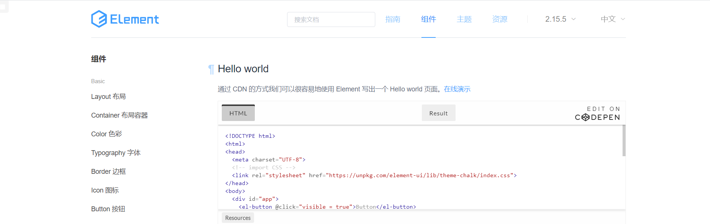

### 2.1  快速入门

1. 将资源 `04-资料\02-element` 下的 `element-ui` 文件夹直接拷贝到项目的 `webapp` 下。目录结构如下

   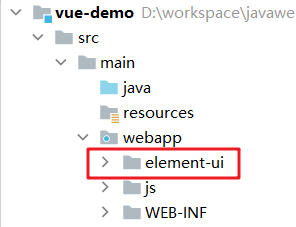

2. 创建页面，并在页面引入Element 的css、js文件 和 Vue.js

   ```html
   <script src="vue.js"></script>
   <script src="element-ui/lib/index.js"></script>
   <link rel="stylesheet" href="element-ui/lib/theme-chalk/index.css">
   ```

3. .创建Vue核心对象

   Element 是基于 Vue 的，所以使用Element时必须要创建 Vue 对象

   ```html
   <script>
       new Vue({
           el:"#app"
       })
   </script>
   ```

4. 官网复制Element组件代码

   

   在左菜单栏找到 `Button 按钮` ，然后找到自己喜欢的按钮样式，点击 `显示代码` ，在下面就会展示出对应的代码，将这些代码拷贝到我们自己的页面即可。

**整体页面代码如下：**

```html
<!DOCTYPE html>
<html lang="en">
<head>
    <meta charset="UTF-8">
    <title>Title</title>
</head>
<body>
<div id="app">


    <el-row>
     	<el-button>默认按钮</el-button>
        <el-button type="primary">主要按钮</el-button>
        <el-button type="success">成功按钮</el-button>
        <el-button type="info">信息按钮</el-button>
        <el-button type="warning">警告按钮</el-button>
        <el-button type="danger">删除</el-button>
    </el-row>
    <el-row>
        <el-button plain>朴素按钮</el-button>
        <el-button type="primary" plain>主要按钮</el-button>
        <el-button type="success" plain>成功按钮</el-button>
        <el-button type="info" plain>信息按钮</el-button>
        <el-button type="warning" plain>警告按钮</el-button>
        <el-button type="danger" plain>危险按钮</el-button>
    </el-row>

    <el-row>
        <el-button round>圆角按钮</el-button>
        <el-button type="primary" round>主要按钮</el-button>
        <el-button type="success" round>成功按钮</el-button>
        <el-button type="info" round>信息按钮</el-button>
        <el-button type="warning" round>警告按钮</el-button>
        <el-button type="danger" round>危险按钮</el-button>
    </el-row>

    <el-row>
        <el-button icon="el-icon-search" circle></el-button>
        <el-button type="primary" icon="el-icon-edit" circle></el-button>
        <el-button type="success" icon="el-icon-check" circle></el-button>
        <el-button type="info" icon="el-icon-message" circle></el-button>
        <el-button type="warning" icon="el-icon-star-off" circle></el-button>
        <el-button type="danger" icon="el-icon-delete" circle></el-button>
    </el-row>
</div>

<script src="js/vue.js"></script>
<script src="element-ui/lib/index.js"></script>
<link rel="stylesheet" href="element-ui/lib/theme-chalk/index.css">

<script>
    new Vue({
        el:"#app"
    })
</script>

</body>
</html>
```

### 2.2  Element 布局

Element 提供了两种布局方式，分别是：

* Layout 布局
* Container 布局容器

#### 2.2.1  Layout 局部

通过基础的 24 分栏，迅速简便地创建布局。也就是默认将一行分为 24 栏，根据页面要求给每一列设置所占的栏数。


在左菜单栏找到 `Layout 布局` ，然后找到自己喜欢的按钮样式，点击 `显示代码` ，在下面就会展示出对应的代码，显示出的代码中有样式，有html标签。将样式拷贝我们自己页面的 `head` 标签内，将html标签拷贝到  `<div id="app"></div>` 标签内。

**整体页面代码如下：**

```html
<!DOCTYPE html>
<html lang="en">
<head>
    <meta charset="UTF-8">
    <title>Title</title>

    <style>
        .el-row {
            margin-bottom: 20px;
        }
        .el-col {
            border-radius: 4px;
        }
        .bg-purple-dark {
            background: #99a9bf;
        }
        .bg-purple {
            background: #d3dce6;
        }
        .bg-purple-light {
            background: #e5e9f2;
        }
        .grid-content {
            border-radius: 4px;
            min-height: 36px;
        }
        .row-bg {
            padding: 10px 0;
            background-color: #f9fafc;
        }
    </style>
</head>
<body>
<div id="app">
    <el-row>
        <el-col :span="24"><div class="grid-content bg-purple-dark"></div></el-col>
    </el-row>
    <el-row>
        <el-col :span="12"><div class="grid-content bg-purple"></div></el-col>
        <el-col :span="12"><div class="grid-content bg-purple-light"></div></el-col>
    </el-row>
    <el-row>
        <el-col :span="8"><div class="grid-content bg-purple"></div></el-col>
        <el-col :span="8"><div class="grid-content bg-purple-light"></div></el-col>
        <el-col :span="8"><div class="grid-content bg-purple"></div></el-col>
    </el-row>
    <el-row>
        <el-col :span="6"><div class="grid-content bg-purple"></div></el-col>
        <el-col :span="6"><div class="grid-content bg-purple-light"></div></el-col>
        <el-col :span="6"><div class="grid-content bg-purple"></div></el-col>
        <el-col :span="6"><div class="grid-content bg-purple-light"></div></el-col>
    </el-row>
    <el-row>
        <el-col :span="4"><div class="grid-content bg-purple"></div></el-col>
        <el-col :span="4"><div class="grid-content bg-purple-light"></div></el-col>
        <el-col :span="4"><div class="grid-content bg-purple"></div></el-col>
        <el-col :span="4"><div class="grid-content bg-purple-light"></div></el-col>
        <el-col :span="4"><div class="grid-content bg-purple"></div></el-col>
        <el-col :span="4"><div class="grid-content bg-purple-light"></div></el-col>
    </el-row>
</div>
<script src="js/vue.js"></script>
<script src="element-ui/lib/index.js"></script>
<link rel="stylesheet" href="element-ui/lib/theme-chalk/index.css">

<script>
    new Vue({
        el:"#app"
    })
</script>
</body>
</html>
```

现在需要添加一行，要求该行显示8个格子，通过计算每个格子占 3 栏，具体的html 代码如下

```html
<!--
添加一行，8个格子  24/8 = 3
-->
<el-row>
    <el-col :span="3"><div class="grid-content bg-purple"></div></el-col>
    <el-col :span="3"><div class="grid-content bg-purple-light"></div></el-col>
    <el-col :span="3"><div class="grid-content bg-purple"></div></el-col>
    <el-col :span="3"><div class="grid-content bg-purple-light"></div></el-col>
    <el-col :span="3"><div class="grid-content bg-purple"></div></el-col>
    <el-col :span="3"><div class="grid-content bg-purple-light"></div></el-col>
    <el-col :span="3"><div class="grid-content bg-purple"></div></el-col>
    <el-col :span="3"><div class="grid-content bg-purple-light"></div></el-col>
</el-row>
```

#### 2.2.2  Container 布局容器

用于布局的容器组件，方便快速搭建页面的基本结构。如下图就是布局容器效果。

如下图是官网提供的 Container 布局容器实例：


该效果代码中包含了样式、页面标签、模型数据。将里面的样式 `<style>` 拷贝到我们自己页面的 `head` 标签中；将html标签拷贝到 `<div id="app"></div>` 标签中，再将数据模型拷贝到 `vue` 对象的 `data()` 中。

**整体页面代码如下：**

```html
<!DOCTYPE html>
<html lang="en">
<head>
    <meta charset="UTF-8">
    <title>Title</title>

    <style>
        .el-header {
            background-color: #B3C0D1;
            color: #333;
            line-height: 60px;
        }

        .el-aside {
            color: #333;
        }
    </style>
</head>
<body>
<div id="app">
    <el-container style="height: 500px; border: 1px solid #eee">
        <el-aside width="200px" style="background-color: rgb(238, 241, 246)">
            <el-menu :default-openeds="['1', '3']">
                <el-submenu index="1">
                    <template slot="title"><i class="el-icon-message"></i>导航一</template>
                    <el-menu-item-group>
                        <template slot="title">分组一</template>
                        <el-menu-item index="1-1">选项1</el-menu-item>
                        <el-menu-item index="1-2">选项2</el-menu-item>
                    </el-menu-item-group>
                    <el-menu-item-group title="分组2">
                        <el-menu-item index="1-3">选项3</el-menu-item>
                    </el-menu-item-group>
                    <el-submenu index="1-4">
                        <template slot="title">选项4</template>
                        <el-menu-item index="1-4-1">选项4-1</el-menu-item>
                    </el-submenu>
                </el-submenu>
                <el-submenu index="2">
                    <template slot="title"><i class="el-icon-menu"></i>导航二</template>
                    <el-submenu index="2-1">
                        <template slot="title">选项1</template>
                        <el-menu-item index="2-1-1">选项1-1</el-menu-item>
                    </el-submenu>
                </el-submenu>
                <el-submenu index="3">
                    <template slot="title"><i class="el-icon-setting"></i>导航三</template>
                    <el-menu-item-group>
                        <template slot="title">分组一</template>
                        <el-menu-item index="3-1">选项1</el-menu-item>
                        <el-menu-item index="3-2">选项2</el-menu-item>
                    </el-menu-item-group>
                    <el-menu-item-group title="分组2">
                        <el-menu-item index="3-3">选项3</el-menu-item>
                    </el-menu-item-group>
                    <el-submenu index="3-4">
                        <template slot="title">选项4</template>
                        <el-menu-item index="3-4-1">选项4-1</el-menu-item>
                    </el-submenu>
                </el-submenu>
            </el-menu>
        </el-aside>

        <el-container>
            <el-header style="text-align: right; font-size: 12px">
                <el-dropdown>
                    <i class="el-icon-setting" style="margin-right: 15px"></i>
                    <el-dropdown-menu slot="dropdown">
                        <el-dropdown-item>查看</el-dropdown-item>
                        <el-dropdown-item>新增</el-dropdown-item>
                        <el-dropdown-item>删除</el-dropdown-item>
                    </el-dropdown-menu>
                </el-dropdown>
                <span>王小虎</span>
            </el-header>

            <el-main>
                <el-table :data="tableData">
                    <el-table-column prop="date" label="日期" width="140">
                    </el-table-column>
                    <el-table-column prop="name" label="姓名" width="120">
                    </el-table-column>
                    <el-table-column prop="address" label="地址">
                    </el-table-column>
                </el-table>
            </el-main>
        </el-container>
    </el-container>
</div>
<script src="js/vue.js"></script>
<script src="element-ui/lib/index.js"></script>
<link rel="stylesheet" href="element-ui/lib/theme-chalk/index.css">

<script>
    new Vue({
        el:"#app",
        data() {
            const item = {
                date: '2016-05-02',
                name: '王小虎',
                address: '上海市普陀区金沙江路 1518 弄'
            };
            return {
                tableData: Array(20).fill(item)
            }
        }
    })
</script>
</body>
</html>
```

### 2.3  案例

其他的组件我们通过完成一个页面来学习。

我们要完成如下页面效果

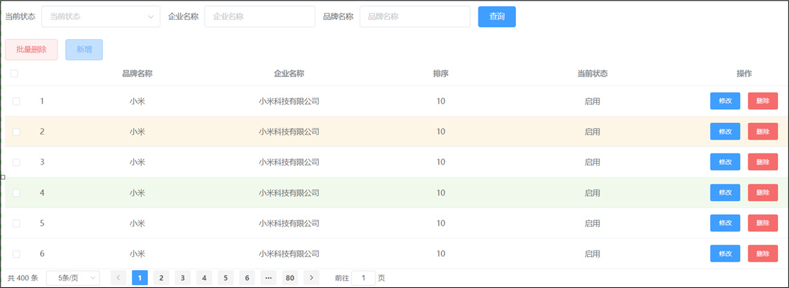

要完成该页面，我们需要先对这个页面进行分析，看页面由哪儿几部分组成，然后到官网进行拷贝并修改。页面总共有如下组成部分


还有一个是当我们点击 `新增` 按钮，会在页面正中间弹出一个对话框，如下


#### 2.3.1  准备基本页面

```html
<!DOCTYPE html>
<html lang="en">
<head>
    <meta charset="UTF-8">
    <title>Title</title>
</head>
<body>
<div id="app">
	
</div>

<script src="js/vue.js"></script>
<script src="element-ui/lib/index.js"></script>
<link rel="stylesheet" href="element-ui/lib/theme-chalk/index.css">

<script>
    new Vue({
        el: "#app"
    })
</script>
</body>
</html>
```

#### 2.3.2  完成表格展示

使用 Element 整体的思路就是 ==拷贝 + 修改==。

##### 2.3.2.1  拷贝


在左菜单栏找到 `Table 表格`并点击，右边主体就会定位到表格这一块，找到我们需要的表格效果（如上图），点击 `显示代码` 就可以看到这个表格的代码了。

将html标签拷贝到 `<div id="app"></div>` 中，如下：


将css样式拷贝到我们页面的 `head` 标签中，如下


将方法和模型数据拷贝到 Vue 对象指定的位置


拷贝完成后通过浏览器打开可以看到表格的效果


表格效果出来了，但是显示的表头和数据并不是我们想要的，所以接下来就需要对页面代码进行修改了。

##### 2.3.2.2  修改

1. **修改表头和数据**

   下面是对表格代码进行分析的图解。根据下图说明修改自己的列数和列名

   

   修改完页面后，还需要对绑定的模型数据进行修改，下图是对模型数据进行分析的图解

   

2. **给表格添加操作列**

   从之前的表格拷贝一列出来并对其进行修改。按钮是从官网的 `Button 按钮` 组件中拷贝并修改的

   

3. **给表格添加复选框列和标号列**

   给表格添加复选框和标号列，效果如下

   

   此效果也是从 Element 官网进行拷贝，先找到对应的表格效果，然后将其对应代码拷贝到我们的代码中，如下是复选框列官网效果图和代码

   

   这里需要注意在 `<el-table>` 标签上有一个事件 `@selection-change="handleSelectionChange"` ，这里绑定的函数也需要从官网拷贝到我们自己的页面代码中，函数代码如下：

   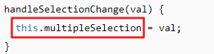

   从该函数中又发现还需要一个模型数据 `multipleSelection ` ，所以还需要定义出该模型数据

标号列也用同样的方式进行拷贝并修改。

#### 2.3.3  完成搜索表单展示

在 Element 官网找到横排的表单效果，然后拷贝代码并进行修改

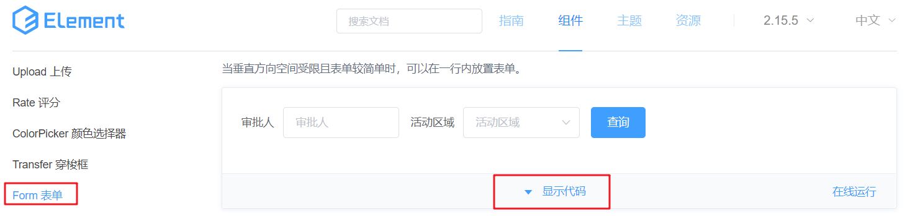

点击上面的 `显示代码` 后，就会展示出对应的代码，下面是对这部分代码进行分析的图解


然后根据我们要的效果修改代码。

#### 2.3.4  完成批量删除和新增按钮展示

从 Element 官网找具有着色效果的按钮，并将代码拷贝到我们自己的页面上


#### 2.3.5  完成对话框展示

在 Element 官网找对话框，如下：

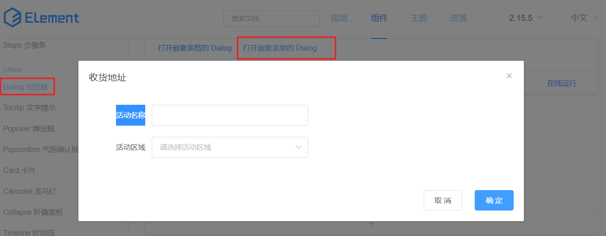

下面对官网提供的代码进行分析


上图分析出来的模型数据需要在 Vue 对象中进行定义。

#### 2.3.6  完成分页条展示

在 Element 官网找到 `Pagination 分页` ，在页面主体部分找到我们需要的效果，如下


点击 `显示代码` ，找到 `完整功能` 对应的代码，接下来对该代码进行分析


上面代码属性说明：

* `page-size` ：每页显示的条目数

* `page-sizes` ： 每页显示个数选择器的选项设置。

  `:page-sizes="[100,200,300,400]"`  对应的页面效果如下：

  

* `currentPage` ：当前页码。我们点击那个页码，此属性值就是几。
* `total` ：总记录数。用来设置总的数据条目数，该属性设置后， Element 会自动计算出需分多少页并给我们展示对应的页码。

事件说明：

* `size-change` ：pageSize 改变时会触发。也就是当我们改变了每页显示的条目数后，该事件会触发。
* `current-change` ：currentPage 改变时会触发。也就是当我们点击了其他的页码后，该事件会触发。

#### 2.3.7  完整页面代码

```html
<!DOCTYPE html>
<html lang="en">
<head>
    <meta charset="UTF-8">
    <title>Title</title>
    <style>
        .el-table .warning-row {
            background: oldlace;
        }
        .el-table .success-row {
            background: #f0f9eb;
        }
    </style>
</head>
<body>
<div id="app">
    <!--搜索表单-->
    <el-form :inline="true" :model="brand" class="demo-form-inline">
        <el-form-item label="当前状态">
            <el-select v-model="brand.status" placeholder="当前状态">
                <el-option label="启用" value="1"></el-option>
                <el-option label="禁用" value="0"></el-option>
            </el-select>
        </el-form-item>

        <el-form-item label="企业名称">
            <el-input v-model="brand.companyName" placeholder="企业名称"></el-input>
        </el-form-item>

        <el-form-item label="品牌名称">
            <el-input v-model="brand.brandName" placeholder="品牌名称"></el-input>
        </el-form-item>

        <el-form-item>
            <el-button type="primary" @click="onSubmit">查询</el-button>
        </el-form-item>
    </el-form>

    <!--按钮-->
    <el-row>
        <el-button type="danger" plain>批量删除</el-button>
        <el-button type="primary" plain @click="dialogVisible = true">新增</el-button>
    </el-row>
    
    <!--添加数据对话框表单-->
    <el-dialog
            title="编辑品牌"
            :visible.sync="dialogVisible"
            width="30%">
        <el-form ref="form" :model="brand" label-width="80px">
            <el-form-item label="品牌名称">
                <el-input v-model="brand.brandName"></el-input>
            </el-form-item>

            <el-form-item label="企业名称">
                <el-input v-model="brand.companyName"></el-input>
            </el-form-item>

            <el-form-item label="排序">
                <el-input v-model="brand.ordered"></el-input>
            </el-form-item>

            <el-form-item label="备注">
                <el-input type="textarea" v-model="brand.description"></el-input>
            </el-form-item>

            <el-form-item label="状态">
                <el-switch v-model="brand.status"
                           active-value="1"
                           inactive-value="0"
                ></el-switch>
            </el-form-item>
            <el-form-item>
                <el-button type="primary" @click="addBrand">提交</el-button>
                <el-button @click="dialogVisible = false">取消</el-button>
            </el-form-item>
        </el-form>
    </el-dialog>

    <!--表格-->
    <template>
        <el-table
                :data="tableData"
                style="width: 100%"
                :row-class-name="tableRowClassName"
                @selection-change="handleSelectionChange">
            <el-table-column
                    type="selection"
                    width="55">
            </el-table-column>
            <el-table-column
                    type="index"
                    width="50">
            </el-table-column>
            <el-table-column
                    prop="brandName"
                    label="品牌名称"
                    align="center">
            </el-table-column>
            <el-table-column
                    prop="companyName"
                    label="企业名称"
                    align="center">
            </el-table-column>
            <el-table-column
                    prop="ordered"
                    align="center"
                    label="排序">
            </el-table-column>
            <el-table-column
                    prop="status"
                    align="center"
                    label="当前状态">
            </el-table-column>
            <el-table-column
                    align="center"
                    label="操作">
                <el-row>
                    <el-button type="primary">修改</el-button>
                    <el-button type="danger">删除</el-button>
                </el-row>
            </el-table-column>

        </el-table>
    </template>

    <!--分页工具条-->
    <el-pagination
            @size-change="handleSizeChange"
            @current-change="handleCurrentChange"
            :current-page="currentPage"
            :page-sizes="[5, 10, 15, 20]"
            :page-size="5"
            layout="total, sizes, prev, pager, next, jumper"
            :total="400">
    </el-pagination>

</div>
<script src="js/vue.js"></script>
<script src="element-ui/lib/index.js"></script>
<link rel="stylesheet" href="element-ui/lib/theme-chalk/index.css">
<script>
    new Vue({
        el: "#app",
        methods: {
            tableRowClassName({row, rowIndex}) {
                if (rowIndex === 1) {
                    return 'warning-row';
                } else if (rowIndex === 3) {
                    return 'success-row';
                }
                return '';
            },
            // 复选框选中后执行的方法
            handleSelectionChange(val) {
                this.multipleSelection = val;

                console.log(this.multipleSelection)
            },
            // 查询方法
            onSubmit() {
                console.log(this.brand);
            },
            // 添加数据
            addBrand(){
                console.log(this.brand);
            },
            //分页
            handleSizeChange(val) {
                console.log(`每页 ${val} 条`);
            },
            handleCurrentChange(val) {
                console.log(`当前页: ${val}`);
            }
        },
        data() {
            return {
                // 当前页码
                currentPage: 4,
                // 添加数据对话框是否展示的标记
                dialogVisible: false,

                // 品牌模型数据
                brand: {
                    status: '',
                    brandName: '',
                    companyName: '',
                    id:"",
                    ordered:"",
                    description:""
                },
                // 复选框选中数据集合
                multipleSelection: [],
                // 表格数据
                tableData: [{
                    brandName: '华为',
                    companyName: '华为科技有限公司',
                    ordered: '100',
                    status: "1"
                }, {
                    brandName: '华为',
                    companyName: '华为科技有限公司',
                    ordered: '100',
                    status: "1"
                }, {
                    brandName: '华为',
                    companyName: '华为科技有限公司',
                    ordered: '100',
                    status: "1"
                }, {
                    brandName: '华为',
                    companyName: '华为科技有限公司',
                    ordered: '100',
                    status: "1"
                }]
            }
        }
    })
</script>
</body>
</html>
```

## 3、综合案例

### 3.1  功能介绍

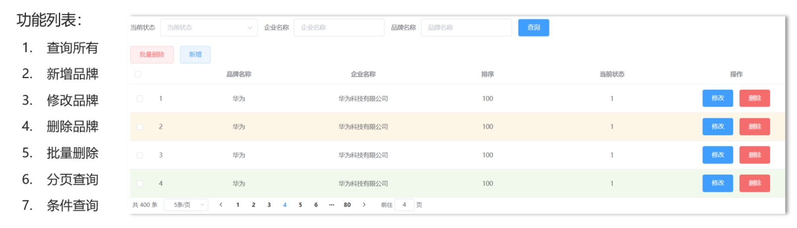

以上是我们在综合案例要实现的功能。对数据的除了对数据的增删改查功能外，还有一些复杂的功能，如 `批量删除`、`分页查询`、`条件查询` 等功能

* `批量删除` 功能：每条数据前都有复选框，当我选中多条数据并点击 `批量删除` 按钮后，会发送请求到后端并删除数据库中指定的多条数据。
* `分页查询` 功能：当数据库中有很多数据时，我们不可能将所有的数据展示在一页里，这个时候就需要分页展示数据。
* `条件查询` 功能：数据库量大的时候，我们就需要精确的查询一些想看到的数据，这个时候就需要通过条件查询。

这里的 `修改品牌` 和 `删除品牌` 功能在课程上不做讲解，留作同学来下的练习。

### 3.2  环境准备

环境准备我们主要完成以下两件事即可

* 将资料的 brand-case 模块导入到 idea中
* 执行资料中提供的 tb_brand.sql脚本

#### 3.2.1  工程准备

将 `04-资料\01-初始工程` 中的 `brand-case` 工程导入到我们自己的 idea 中。工程结构如下：

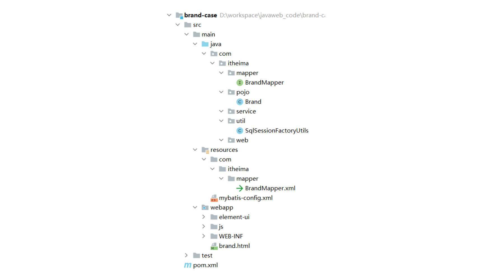

#### 3.2.2  创建表

下面是创建表的语句

```sql
-- 删除tb_brand表
drop table if exists tb_brand;
-- 创建tb_brand表
create table tb_brand (
    -- id 主键
    id           int primary key auto_increment,
    -- 品牌名称
    brand_name   varchar(20),
    -- 企业名称
    company_name varchar(20),
    -- 排序字段
    ordered      int,
    -- 描述信息
    description  varchar(100),
    -- 状态：0：禁用  1：启用
    status       int
);
-- 添加数据
insert into tb_brand (brand_name, company_name, ordered, description, status)
values 
       ('华为', '华为技术有限公司', 100, '万物互联', 1),
       ('小米', '小米科技有限公司', 50, 'are you ok', 1),
       ('格力', '格力电器股份有限公司', 30, '让世界爱上中国造', 1),
       ('阿里巴巴', '阿里巴巴集团控股有限公司', 10, '买买买', 1),
       ('腾讯', '腾讯计算机系统有限公司', 50, '玩玩玩', 0),
       ('百度', '百度在线网络技术公司', 5, '搜搜搜', 0),
       ('京东', '北京京东世纪贸易有限公司', 40, '就是快', 1),
       ('小米', '小米科技有限公司', 50, 'are you ok', 1),
       ('三只松鼠', '三只松鼠股份有限公司', 5, '好吃不上火', 0),
       ('华为', '华为技术有限公司', 100, '万物互联', 1),
       ('小米', '小米科技有限公司', 50, 'are you ok', 1),
       ('格力', '格力电器股份有限公司', 30, '让世界爱上中国造', 1),
       ('阿里巴巴', '阿里巴巴集团控股有限公司', 10, '买买买', 1),
       ('腾讯', '腾讯计算机系统有限公司', 50, '玩玩玩', 0),
       ('百度', '百度在线网络技术公司', 5, '搜搜搜', 0),
       ('京东', '北京京东世纪贸易有限公司', 40, '就是快', 1),
       ('华为', '华为技术有限公司', 100, '万物互联', 1),
       ('小米', '小米科技有限公司', 50, 'are you ok', 1),
       ('格力', '格力电器股份有限公司', 30, '让世界爱上中国造', 1),
       ('阿里巴巴', '阿里巴巴集团控股有限公司', 10, '买买买', 1),
       ('腾讯', '腾讯计算机系统有限公司', 50, '玩玩玩', 0),
       ('百度', '百度在线网络技术公司', 5, '搜搜搜', 0),
       ('京东', '北京京东世纪贸易有限公司', 40, '就是快', 1),
       ('小米', '小米科技有限公司', 50, 'are you ok', 1),
       ('三只松鼠', '三只松鼠股份有限公司', 5, '好吃不上火', 0),
       ('华为', '华为技术有限公司', 100, '万物互联', 1),
       ('小米', '小米科技有限公司', 50, 'are you ok', 1),
       ('格力', '格力电器股份有限公司', 30, '让世界爱上中国造', 1),
       ('阿里巴巴', '阿里巴巴集团控股有限公司', 10, '买买买', 1),
       ('腾讯', '腾讯计算机系统有限公司', 50, '玩玩玩', 0),
       ('百度', '百度在线网络技术公司', 5, '搜搜搜', 0),
       ('京东', '北京京东世纪贸易有限公司', 40, '就是快', 1),
       ('华为', '华为技术有限公司', 100, '万物互联', 1),
       ('小米', '小米科技有限公司', 50, 'are you ok', 1),
       ('格力', '格力电器股份有限公司', 30, '让世界爱上中国造', 1),
       ('阿里巴巴', '阿里巴巴集团控股有限公司', 10, '买买买', 1),
       ('腾讯', '腾讯计算机系统有限公司', 50, '玩玩玩', 0),
       ('百度', '百度在线网络技术公司', 5, '搜搜搜', 0),
       ('京东', '北京京东世纪贸易有限公司', 40, '就是快', 1),
       ('小米', '小米科技有限公司', 50, 'are you ok', 1),
       ('三只松鼠', '三只松鼠股份有限公司', 5, '好吃不上火', 0),
       ('华为', '华为技术有限公司', 100, '万物互联', 1),
       ('小米', '小米科技有限公司', 50, 'are you ok', 1),
       ('格力', '格力电器股份有限公司', 30, '让世界爱上中国造', 1),
       ('阿里巴巴', '阿里巴巴集团控股有限公司', 10, '买买买', 1),
       ('腾讯', '腾讯计算机系统有限公司', 50, '玩玩玩', 0),
       ('百度', '百度在线网络技术公司', 5, '搜搜搜', 0),
       ('京东', '北京京东世纪贸易有限公司', 40, '就是快', 1);
```

### 3.3  查询所有功能


如上图所示是查询所有品牌数据在页面展示的效果。要实现这个功能，要先搞明白如下问题：

* 什么时候发送异步请求？

  页面加载完毕后就需要在页面上看到所有的品牌数据。所以在 `mounted()` 这个构造函数中写发送异步请求的代码。

* 请求需要携带参数吗？

  查询所有功能不需要携带什么参数。

* 响应的数据格式是什么样？

  后端是需要将 `List<Brand>` 对象转换为 JSON 格式的数据并响应回给浏览器。响应数据格式如下：

  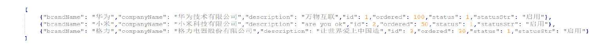

整体流程如下

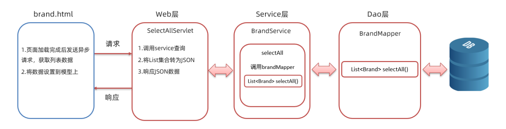

我们先实现后端程序，然后再实现前端程序。

#### 3.3.1 后端实现

##### 3.3.1.1  dao方法实现

在 `com.itheima.mapper.BrandMapper` 接口中定义抽象方法，并使用 `@Select` 注解编写 sql 语句

```java
/**
     * 查询所有
     * @return
     */
@Select("select * from tb_brand")
List<Brand> selectAll();
```

由于表中有些字段名和实体类中的属性名没有对应，所以需要在 `com/itheima/mapper/BrandMapper.xml` 映射配置文件中定义结果映射 ，使用`resultMap` 标签。映射配置文件内容如下：

```xml
<?xml version="1.0" encoding="UTF-8" ?>
<!DOCTYPE mapper
        PUBLIC "-//mybatis.org//DTD Mapper 3.0//EN"
        "http://mybatis.org/dtd/mybatis-3-mapper.dtd">
<mapper namespace="com.itheima.mapper.BrandMapper">

    <resultMap id="brandResultMap" type="brand">
        <result property="brandName" column="brand_name" />
        <result property="companyName" column="company_name" />
    </resultMap>
</mapper>
```

定义完结果映射关系后，在接口 `selectAll()` 方法上引用该结构映射。使用 `@ResultMap("brandResultMap")` 注解

完整接口的 `selectAll()` 方法如下：

```java
/**
     * 查询所有
     * @return
     */
@Select("select * from tb_brand")
@ResultMap("brandResultMap")
List<Brand> selectAll();
```

##### 3.3.1.2  service方法实现

在 `com.itheima.service` 包下创建 `BrandService` 接口，在该接口中定义查询所有的抽象方法

```java
public interface BrandService {

    /**
     * 查询所有
     * @return
     */
    List<Brand> selectAll();
}
```

并在 `com.itheima.service` 下再创建 `impl` 包；`impl` 表示是放 service 层接口的实现类的包。 在该包下创建名为 `BrandServiceImpl` 类

```java
public class BrandServiceImpl implements BrandService {

    @Override
    public List<Brand> selectAll() {
    }
}
```

此处为什么要给 service 定义接口呢？因为 service 定义了接口后，在 servlet 中就可以使用多态的形式创建 Service 实现类的对象，如下：

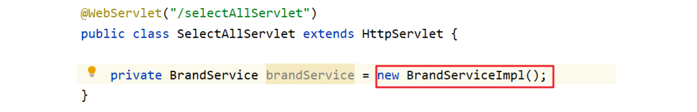

这里使用多态是因为方便我们后期解除 `Servlet` 和 `service` 的耦合。从上面的代码我们可以看到 `SelectAllServlet` 类和 `BrandServiceImpl` 类之间是耦合在一起的，如果后期 `BrandService` 有其它更好的实现类（例如叫 `BrandServiceImpl`），那就需要修改 `SelectAllServlet` 类中的代码。后面我们学习了 `Spring` 框架后就可以解除 `SelectAllServlet` 类和红色框括起来的代码耦合。而现在咱们还做不到解除耦合，在这里只需要理解为什么定义接口即可。

`BrandServiceImpl` 类代码如下：

```java
public class BrandServiceImpl implements BrandService {
    //1. 创建SqlSessionFactory 工厂对象
    SqlSessionFactory factory = SqlSessionFactoryUtils.getSqlSessionFactory();

    @Override
    public List<Brand> selectAll() {
        //2. 获取SqlSession对象
        SqlSession sqlSession = factory.openSession();
        //3. 获取BrandMapper
        BrandMapper mapper = sqlSession.getMapper(BrandMapper.class);

        //4. 调用方法
        List<Brand> brands = mapper.selectAll();

        //5. 释放资源
        sqlSession.close();

        return brands;
    }
}
```

##### 3.3.1.3  servlet实现

在 `com.itheima.web.servlet` 包下定义名为 `SelectAllServlet` 的查询所有的 `servlet`。该 `servlet` 逻辑如下：

* 调用service的 `selectAll()` 方法查询所有的品牌数据，并接口返回结果
* 将返回的结果转换为 json 数据
* 响应 json 数据

代码如下：

```java
@WebServlet("/selectAllServlet")
public class SelectAllServlet extends HttpServlet {

    private BrandService brandService = new BrandServiceImpl();

    @Override
    protected void doGet(HttpServletRequest request, HttpServletResponse response) throws ServletException, IOException {
        //1. 调用service查询
        List<Brand> brands = brandService.selectAll();
        //2. 转为JSON
        String jsonString = JSON.toJSONString(brands);
        //3. 写数据
        response.setContentType("text/json;charset=utf-8"); //告知浏览器响应的数据是什么， 告知浏览器使用什么字符集进行解码
        response.getWriter().write(jsonString);
    }

    @Override
    protected void doPost(HttpServletRequest request, HttpServletResponse response) throws ServletException, IOException {
        this.doGet(request, response);
    }
}
```

##### 3.3.1.4  测试后端程序

在浏览器输入访问 servlet 的资源路径 `http://localhost:8080/brand-case/selectAllServlet` ，如果没有报错，并能看到如下信息表明后端程序没有问题

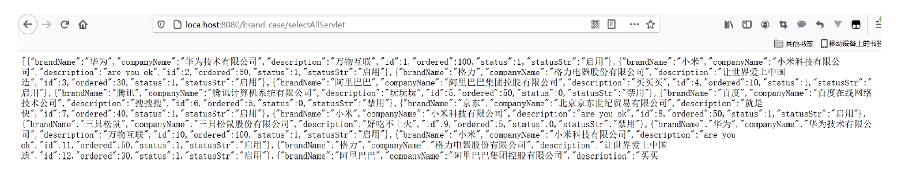

#### 3.3.2  前端实现

前端需要在页面加载完毕后发送 ajax 请求，所以发送请求的逻辑应该放在 `mounted()` 钩子函数中。而响应回来的数据需要赋值给表格绑定的数据模型，从下图可以看出表格绑定的数据模型是 `tableData`


前端代码如下：

```js
 mounted(){
     //当页面加载完成后，发送异步请求，获取数据
     var _this = this;

     axios({
         method:"get",
         url:"http://localhost:8080/brand-case/selectAllServlet"
     }).then(function (resp) {
         _this.tableData = resp.data;
     })
 }
```

### 3.4  添加功能

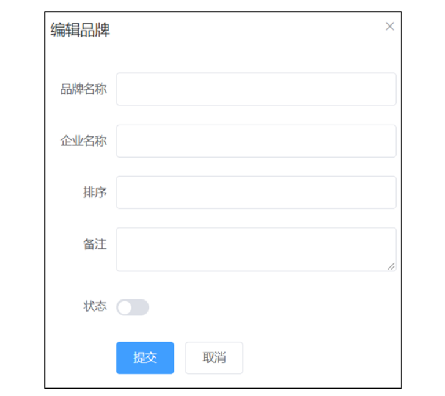

上图是添加数据的对话框，当点击 `提交` 按钮后就需要将数据提交到后端，并将数据保存到数据库中。下图是整体的流程：

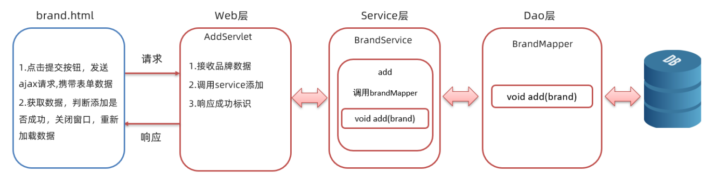

页面发送请求时，需要将输入框输入的内容提交给后端程序，而这里是以 json 格式进行传递的。而具体的数据格式如下：

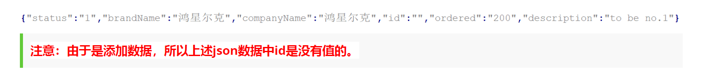

> ==注意：由于是添加数据，所以上述json数据中id是没有值的。==

#### 3.4.1  后端实现

##### 3.4.1.1  dao方法实现

在 `BrandMapper` 接口中定义 `add()` 添加方法，并使用 `@Insert` 注解编写sql语句

```java
/**
     * 添加数据
     * @param brand
     */
@Insert("insert into tb_brand values(null,#{brandName},#{companyName},#{ordered},#{description},#{status})")
void add(Brand brand);
```

##### 3.4.1.2  service方法实现

在 `BrandService` 接口中定义 `add()` 添加数据的业务逻辑方法

```java
/**
     * 添加数据
     * @param brand
     */
void add(Brand brand);
```

在 `BrandServiceImpl` 类中重写 `add()` 方法，并进行业务逻辑实现

```java
@Override
public void add(Brand brand) {
    //2. 获取SqlSession对象
    SqlSession sqlSession = factory.openSession();
    //3. 获取BrandMapper
    BrandMapper mapper = sqlSession.getMapper(BrandMapper.class);

    //4. 调用方法
    mapper.add(brand);
    sqlSession.commit();//提交事务

    //5. 释放资源
    sqlSession.close();
}
```

> ==注意：增删改操作一定要提交事务。==

##### 3.4.1.3  servlet实现

在 `com.itheima.web.servlet` 包写定义名为 `AddServlet` 的 Servlet。该 Servlet 的逻辑如下：

* 接收页面提交的数据。页面到时候提交的数据是 json 格式的数据，所以此处需要使用输入流读取数据
* 将接收到的数据转换为 `Brand` 对象
* 调用 service 的 `add()` 方法进行添加的业务逻辑处理
* 给浏览器响应添加成功的标识，这里直接给浏览器响应 `success` 字符串表示成功

servlet 代码实现如下：

```java
@WebServlet("/addServlet")
public class AddServlet extends HttpServlet {

    private BrandService brandService = new BrandServiceImpl();

    @Override
    protected void doGet(HttpServletRequest request, HttpServletResponse response) throws ServletException, IOException {

        //1. 接收品牌数据
        BufferedReader br = request.getReader();
        String params = br.readLine();//json字符串
        //转为Brand对象
        Brand brand = JSON.parseObject(params, Brand.class);
        //2. 调用service添加
        brandService.add(brand);
        //3. 响应成功的标识
        response.getWriter().write("success");
    }

    @Override
    protected void doPost(HttpServletRequest request, HttpServletResponse response) throws ServletException, IOException {
        this.doGet(request, response);
    }
}
```

#### 3.4.2  前端实现

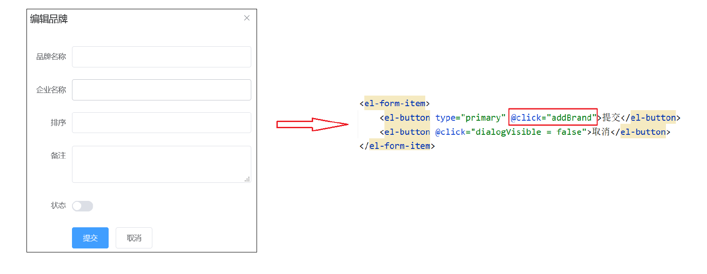

上图左边是页面效果，里面的 `提交` 按钮可以通过上图右边看出绑定了一个 单击事件，而该事件绑定的是 `addBrand` 函数，所以添加数据功能的逻辑代码应该写在 `addBrand()`  函数中。在此方法中需要发送异步请求并将表单中输入的数据作为参数进行传递。如下

```js
// 添加数据
addBrand() {
    var _this = this;

    // 发送ajax请求，添加数据
    axios({
        method:"post",
        url:"http://localhost:8080/brand-case/addServlet",
        data:_this.brand
    }).then(function (resp) {
       	//响应数据的处理逻辑
    })
}
```

在 `then` 函数中的匿名函数是成功后的回调函数，而 `resp.data` 就可以获取到响应回来的数据，如果值是 `success` 表示数据添加成功。成功后我们需要做一下逻辑处理：

1. **关闭新增对话框窗口**

   如下图所示是添加数据的对话框代码，从代码中可以看到此对话框绑定了 `dialogVisible` 数据模型，只需要将该数据模型的值设置为 false，就可以关闭新增对话框窗口了。

   

2. **重新查询数据**

   数据添加成功与否，用户只要能在页面上查看到数据说明添加成功。而此处需要重新发送异步请求获取所有的品牌数据，而这段代码在 `查询所有` 功能中已经实现，所以我们可以将此功能代码进行抽取，抽取到一个 `selectAll()` 函数中

   ```js
   // 查询所有数据
   selectAll(){
       var _this = this;
   
       axios({
           method:"get",
           url:"http://localhost:8080/brand-case/selectAllServlet"
       }).then(function (resp) {
           _this.tableData = resp.data;
       })
   }
   ```

   那么就需要将 `mounted()` 钩子函数中代码改进为

   ```js
   mounted(){
       //当页面加载完成后，发送异步请求，获取数据
       this.selectAll();
   }
   ```

   同时在新增响应的回调中调用 `selectAll()` 进行数据的重新查询。

3. **弹出消息给用户提示添加成功**

   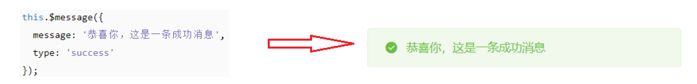

   上图左边就是 elementUI 官网提供的成功提示代码，而上图右边是具体的效果。

   > ==注意：上面的this需要的是表示 VUE 对象的this。==

综上所述，前端代码如下：

```js
// 添加数据
addBrand() {
    var _this = this;

    // 发送ajax请求，添加数据
    axios({
        method:"post",
        url:"http://localhost:8080/brand-case/addServlet",
        data:_this.brand
    }).then(function (resp) {
        if(resp.data == "success"){
            //添加成功
            //关闭窗口
            _this.dialogVisible = false;
            // 重新查询数据
            _this.selectAll();
            // 弹出消息提示
            _this.$message({
                message: '恭喜你，添加成功',
                type: 'success'
            });
        }
    })
}
```
