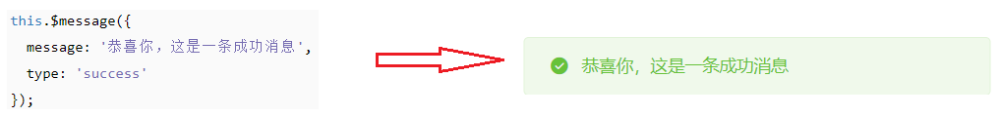
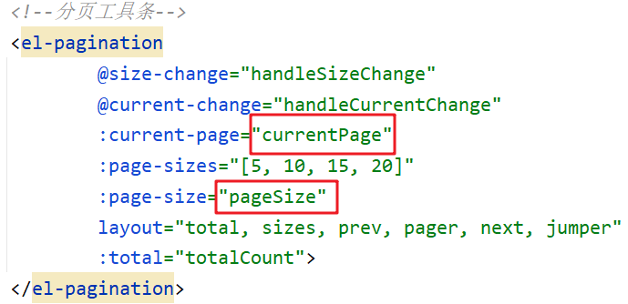
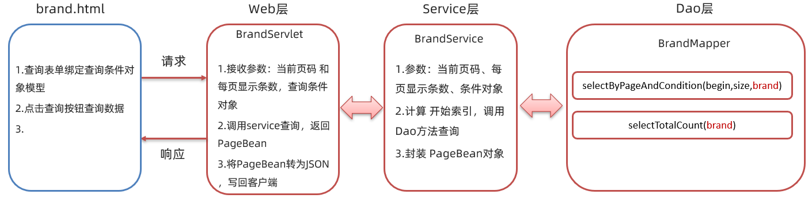

## 综合案例

> * 能够完成查询所有功能
> * 能够完成添加功能
> * 能够理解 BaseServlet 思想
> * 能够完成批量删除功能
> * 能够完成分页查询功能
> * 能够完成条件查询功能

## 1、功能介绍


以上是我们在综合案例要实现的功能。对数据的除了对数据的增删改查功能外，还有一些复杂的功能，如 `批量删除`、`分页查询`、`条件查询` 等功能

* `批量删除` 功能：每条数据前都有复选框，当我选中多条数据并点击 `批量删除` 按钮后，会发送请求到后端并删除数据库中指定的多条数据。
* `分页查询` 功能：当数据库中有很多数据时，我们不可能将所有的数据展示在一页里，这个时候就需要分页展示数据。
* `条件查询` 功能：数据库量大的时候，我们就需要精确的查询一些想看到的数据，这个时候就需要通过条件查询。

这里的 `修改品牌` 和 `删除品牌` 功能在课程上不做讲解，留作同学来下的练习。

## 2、环境准备

环境准备我们主要完成以下两件事即可

* 将资料的 brand-case 模块导入到 idea中
* 执行资料中提供的 tb_brand.sql脚本

### 2.1  工程准备

将 `04-资料\01-初始工程` 中的 `brand-case` 工程导入到我们自己的 idea 中。工程结构如下：


### 2.2  创建表

下面是创建表的语句

```sql
-- 删除tb_brand表
drop table if exists tb_brand;
-- 创建tb_brand表
create table tb_brand (
    -- id 主键
    id           int primary key auto_increment,
    -- 品牌名称
    brand_name   varchar(20),
    -- 企业名称
    company_name varchar(20),
    -- 排序字段
    ordered      int,
    -- 描述信息
    description  varchar(100),
    -- 状态：0：禁用  1：启用
    status       int
);
-- 添加数据
insert into tb_brand (brand_name, company_name, ordered, description, status)
values 
       ('华为', '华为技术有限公司', 100, '万物互联', 1),
       ('小米', '小米科技有限公司', 50, 'are you ok', 1),
       ('格力', '格力电器股份有限公司', 30, '让世界爱上中国造', 1),
       ('阿里巴巴', '阿里巴巴集团控股有限公司', 10, '买买买', 1),
       ('腾讯', '腾讯计算机系统有限公司', 50, '玩玩玩', 0),
       ('百度', '百度在线网络技术公司', 5, '搜搜搜', 0),
       ('京东', '北京京东世纪贸易有限公司', 40, '就是快', 1),
       ('小米', '小米科技有限公司', 50, 'are you ok', 1),
       ('三只松鼠', '三只松鼠股份有限公司', 5, '好吃不上火', 0),
       ('华为', '华为技术有限公司', 100, '万物互联', 1),
       ('小米', '小米科技有限公司', 50, 'are you ok', 1),
       ('格力', '格力电器股份有限公司', 30, '让世界爱上中国造', 1),
       ('阿里巴巴', '阿里巴巴集团控股有限公司', 10, '买买买', 1),
       ('腾讯', '腾讯计算机系统有限公司', 50, '玩玩玩', 0),
       ('百度', '百度在线网络技术公司', 5, '搜搜搜', 0),
       ('京东', '北京京东世纪贸易有限公司', 40, '就是快', 1),
       ('华为', '华为技术有限公司', 100, '万物互联', 1),
       ('小米', '小米科技有限公司', 50, 'are you ok', 1),
       ('格力', '格力电器股份有限公司', 30, '让世界爱上中国造', 1),
       ('阿里巴巴', '阿里巴巴集团控股有限公司', 10, '买买买', 1),
       ('腾讯', '腾讯计算机系统有限公司', 50, '玩玩玩', 0),
       ('百度', '百度在线网络技术公司', 5, '搜搜搜', 0),
       ('京东', '北京京东世纪贸易有限公司', 40, '就是快', 1),
       ('小米', '小米科技有限公司', 50, 'are you ok', 1),
       ('三只松鼠', '三只松鼠股份有限公司', 5, '好吃不上火', 0),
       ('华为', '华为技术有限公司', 100, '万物互联', 1),
       ('小米', '小米科技有限公司', 50, 'are you ok', 1),
       ('格力', '格力电器股份有限公司', 30, '让世界爱上中国造', 1),
       ('阿里巴巴', '阿里巴巴集团控股有限公司', 10, '买买买', 1),
       ('腾讯', '腾讯计算机系统有限公司', 50, '玩玩玩', 0),
       ('百度', '百度在线网络技术公司', 5, '搜搜搜', 0),
       ('京东', '北京京东世纪贸易有限公司', 40, '就是快', 1),
       ('华为', '华为技术有限公司', 100, '万物互联', 1),
       ('小米', '小米科技有限公司', 50, 'are you ok', 1),
       ('格力', '格力电器股份有限公司', 30, '让世界爱上中国造', 1),
       ('阿里巴巴', '阿里巴巴集团控股有限公司', 10, '买买买', 1),
       ('腾讯', '腾讯计算机系统有限公司', 50, '玩玩玩', 0),
       ('百度', '百度在线网络技术公司', 5, '搜搜搜', 0),
       ('京东', '北京京东世纪贸易有限公司', 40, '就是快', 1),
       ('小米', '小米科技有限公司', 50, 'are you ok', 1),
       ('三只松鼠', '三只松鼠股份有限公司', 5, '好吃不上火', 0),
       ('华为', '华为技术有限公司', 100, '万物互联', 1),
       ('小米', '小米科技有限公司', 50, 'are you ok', 1),
       ('格力', '格力电器股份有限公司', 30, '让世界爱上中国造', 1),
       ('阿里巴巴', '阿里巴巴集团控股有限公司', 10, '买买买', 1),
       ('腾讯', '腾讯计算机系统有限公司', 50, '玩玩玩', 0),
       ('百度', '百度在线网络技术公司', 5, '搜搜搜', 0),
       ('京东', '北京京东世纪贸易有限公司', 40, '就是快', 1);
```

## 3、查询所有功能


如上图所示是查询所有品牌数据在页面展示的效果。要实现这个功能，要先搞明白如下问题：

* 什么时候发送异步请求？

  页面加载完毕后就需要在页面上看到所有的品牌数据。所以在 `mounted()` 这个构造函数中写发送异步请求的代码。

* 请求需要携带参数吗？

  查询所有功能不需要携带什么参数。

* 响应的数据格式是什么样？

  后端是需要将 `List<Brand>` 对象转换为 JSON 格式的数据并响应回给浏览器。响应数据格式如下：

  

整体流程如下


我们先实现后端程序，然后再实现前端程序。

### 3.1 后端实现

#### 3.1.1  dao方法实现

在 `com.itheima.mapper.BrandMapper` 接口中定义抽象方法，并使用 `@Select` 注解编写 sql 语句

```java
/**
     * 查询所有
     * @return
     */
@Select("select * from tb_brand")
List<Brand> selectAll();
```

由于表中有些字段名和实体类中的属性名没有对应，所以需要在 `com/itheima/mapper/BrandMapper.xml` 映射配置文件中定义结果映射 ，使用`resultMap` 标签。映射配置文件内容如下：

```xml
<?xml version="1.0" encoding="UTF-8" ?>
<!DOCTYPE mapper
        PUBLIC "-//mybatis.org//DTD Mapper 3.0//EN"
        "http://mybatis.org/dtd/mybatis-3-mapper.dtd">
<mapper namespace="com.itheima.mapper.BrandMapper">

    <resultMap id="brandResultMap" type="brand">
        <result property="brandName" column="brand_name" />
        <result property="companyName" column="company_name" />
    </resultMap>
</mapper>
```

定义完结果映射关系后，在接口 `selectAll()` 方法上引用该结构映射。使用 `@ResultMap("brandResultMap")` 注解

完整接口的 `selectAll()` 方法如下：

```java
/**
     * 查询所有
     * @return
     */
@Select("select * from tb_brand")
@ResultMap("brandResultMap")
List<Brand> selectAll();
```

#### 3.1.2  service方法实现

在 `com.itheima.service` 包下创建 `BrandService` 接口，在该接口中定义查询所有的抽象方法

```java
public interface BrandService {

    /**
     * 查询所有
     * @return
     */
    List<Brand> selectAll();
}
```

并在 `com.itheima.service` 下再创建 `impl` 包；`impl` 表示是放 service 层接口的实现类的包。 在该包下创建名为 `BrandServiceImpl` 类

```java
public class BrandServiceImpl implements BrandService {

    @Override
    public List<Brand> selectAll() {
    }
}
```

此处为什么要给 service 定义接口呢？因为service定义了接口后，在 servlet 中就可以使用多态的形式创建Service实现类的对象，如下：


这里使用多态是因为方便我们后期解除 `Servlet` 和 `service` 的耦合。从上面的代码我们可以看到 `SelectAllServlet` 类和 `BrandServiceImpl` 类之间是耦合在一起的，如果后期 `BrandService` 有其它更好的实现类（例如叫 `BrandServiceImpl`），那就需要修改 `SelectAllServlet` 类中的代码。后面我们学习了 `Spring` 框架后就可以解除 `SelectAllServlet` 类和红色框括起来的代码耦合。而现在咱们还做不到解除耦合，在这里只需要理解为什么定义接口即可。

`BrandServiceImpl` 类代码如下：

```java
public class BrandServiceImpl implements BrandService {
    //1. 创建SqlSessionFactory 工厂对象
    SqlSessionFactory factory = SqlSessionFactoryUtils.getSqlSessionFactory();

    @Override
    public List<Brand> selectAll() {
        //2. 获取SqlSession对象
        SqlSession sqlSession = factory.openSession();
        //3. 获取BrandMapper
        BrandMapper mapper = sqlSession.getMapper(BrandMapper.class);

        //4. 调用方法
        List<Brand> brands = mapper.selectAll();

        //5. 释放资源
        sqlSession.close();

        return brands;
    }
}
```

#### 3.1.3  servlet实现

在 `com.itheima.web.servlet` 包下定义名为 `SelectAllServlet` 的查询所有的 `servlet`。该 `servlet` 逻辑如下：

* 调用service的 `selectAll()` 方法查询所有的品牌数据，并接口返回结果
* 将返回的结果转换为 json 数据
* 响应 json 数据

代码如下：

```java
@WebServlet("/selectAllServlet")
public class SelectAllServlet extends HttpServlet {

    private BrandService brandService = new BrandServiceImpl();

    @Override
    protected void doGet(HttpServletRequest request, HttpServletResponse response) throws ServletException, IOException {
        //1. 调用service查询
        List<Brand> brands = brandService.selectAll();
        //2. 转为JSON
        String jsonString = JSON.toJSONString(brands);
        //3. 写数据
        response.setContentType("text/json;charset=utf-8"); //告知浏览器响应的数据是什么， 告知浏览器使用什么字符集进行解码
        response.getWriter().write(jsonString);
    }

    @Override
    protected void doPost(HttpServletRequest request, HttpServletResponse response) throws ServletException, IOException {
        this.doGet(request, response);
    }
}
```

#### 3.1.4  测试后端程序

在浏览器输入访问 servlet 的资源路径 `http://localhost:8080/brand-case/selectAllServlet` ，如果没有报错，并能看到如下信息表明后端程序没有问题


### 3.2  前端实现

前端需要在页面加载完毕后发送 ajax 请求，所以发送请求的逻辑应该放在 `mounted()` 钩子函数中。而响应回来的数据需要赋值给表格绑定的数据模型，从下图可以看出表格绑定的数据模型是 `tableData`


前端代码如下：

```js
 mounted(){
     //当页面加载完成后，发送异步请求，获取数据
     var _this = this;

     axios({
         method:"get",
         url:"http://localhost:8080/brand-case/selectAllServlet"
     }).then(function (resp) {
         _this.tableData = resp.data;
     })
 }
```

## 4、添加功能


上图是添加数据的对话框，当点击 `提交` 按钮后就需要将数据提交到后端，并将数据保存到数据库中。下图是整体的流程：


页面发送请求时，需要将输入框输入的内容提交给后端程序，而这里是以 json 格式进行传递的。而具体的数据格式如下：


> ==注意：由于是添加数据，所以上述json数据中id是没有值的。==

### 4.1  后端实现

#### 4.1.1  dao方法实现

在 `BrandMapper` 接口中定义 `add()` 添加方法，并使用 `@Insert` 注解编写sql语句

```java
/**
     * 添加数据
     * @param brand
     */
@Insert("insert into tb_brand values(null,#{brandName},#{companyName},#{ordered},#{description},#{status})")
void add(Brand brand);
```

#### 4.1.2  service方法实现

在 `BrandService` 接口中定义 `add()` 添加数据的业务逻辑方法

```java
/**
     * 添加数据
     * @param brand
     */
void add(Brand brand);
```

在 `BrandServiceImpl` 类中重写 `add()` 方法，并进行业务逻辑实现

```java
@Override
public void add(Brand brand) {
    //2. 获取SqlSession对象
    SqlSession sqlSession = factory.openSession();
    //3. 获取BrandMapper
    BrandMapper mapper = sqlSession.getMapper(BrandMapper.class);

    //4. 调用方法
    mapper.add(brand);
    sqlSession.commit();//提交事务

    //5. 释放资源
    sqlSession.close();
}
```

> ==注意：增删改操作一定要提交事务。==

#### 4.1.3  servlet实现

在 `com.itheima.web.servlet` 包写定义名为 `AddServlet` 的 Servlet。该 Servlet 的逻辑如下：

* 接收页面提交的数据。页面到时候提交的数据是 json 格式的数据，所以此处需要使用输入流读取数据
* 将接收到的数据转换为 `Brand` 对象
* 调用 service 的 `add()` 方法进行添加的业务逻辑处理
* 给浏览器响应添加成功的标识，这里直接给浏览器响应 `success` 字符串表示成功

servlet 代码实现如下：

```java
@WebServlet("/addServlet")
public class AddServlet extends HttpServlet {

    private BrandService brandService = new BrandServiceImpl();

    @Override
    protected void doGet(HttpServletRequest request, HttpServletResponse response) throws ServletException, IOException {

        //1. 接收品牌数据
        BufferedReader br = request.getReader();
        String params = br.readLine();//json字符串
        //转为Brand对象
        Brand brand = JSON.parseObject(params, Brand.class);
        //2. 调用service添加
        brandService.add(brand);
        //3. 响应成功的标识
        response.getWriter().write("success");
    }

    @Override
    protected void doPost(HttpServletRequest request, HttpServletResponse response) throws ServletException, IOException {
        this.doGet(request, response);
    }
}
```

### 4.2  前端实现


上图左边是页面效果，里面的 `提交` 按钮可以通过上图右边看出绑定了一个 单击事件，而该事件绑定的是 `addBrand` 函数，所以添加数据功能的逻辑代码应该写在 `addBrand()`  函数中。在此方法中需要发送异步请求并将表单中输入的数据作为参数进行传递。如下

```js
// 添加数据
addBrand() {
    var _this = this;

    // 发送ajax请求，添加数据
    axios({
        method:"post",
        url:"http://localhost:8080/brand-case/addServlet",
        data:_this.brand
    }).then(function (resp) {
       	//响应数据的处理逻辑
    })
}
```

在 `then` 函数中的匿名函数是成功后的回调函数，而 `resp.data` 就可以获取到响应回来的数据，如果值是 `success` 表示数据添加成功。成功后我们需要做一下逻辑处理：

1. **关闭新增对话框窗口**

   如下图所示是添加数据的对话框代码，从代码中可以看到此对话框绑定了 `dialogVisible` 数据模型，只需要将该数据模型的值设置为 false，就可以关闭新增对话框窗口了。

   

2. **重新查询数据**

   数据添加成功与否，用户只要能在页面上查看到数据说明添加成功。而此处需要重新发送异步请求获取所有的品牌数据，而这段代码在 `查询所有` 功能中已经实现，所以我们可以将此功能代码进行抽取，抽取到一个 `selectAll()` 函数中

   ```js
   // 查询所有数据
   selectAll(){
       var _this = this;
   
       axios({
           method:"get",
           url:"http://localhost:8080/brand-case/selectAllServlet"
       }).then(function (resp) {
           _this.tableData = resp.data;
       })
   }
   ```

   那么就需要将 `mounted()` 钩子函数中代码改进为

   ```js
   mounted(){
       //当页面加载完成后，发送异步请求，获取数据
       this.selectAll();
   }
   ```

   同时在新增响应的回调中调用 `selectAll()` 进行数据的重新查询。

3. **弹出消息给用户提示添加成功**

   

   上图左边就是 elementUI 官网提供的成功提示代码，而上图右边是具体的效果。

   > ==注意：上面的this需要的是表示 VUE 对象的this。==

综上所述，前端代码如下：

```js
// 添加数据
addBrand() {
    var _this = this;

    // 发送ajax请求，添加数据
    axios({
        method:"post",
        url:"http://localhost:8080/brand-case/addServlet",
        data:_this.brand
    }).then(function (resp) {
        if(resp.data == "success"){
            //添加成功
            //关闭窗口
            _this.dialogVisible = false;
            // 重新查询数据
            _this.selectAll();
            // 弹出消息提示
            _this.$message({
                message: '恭喜你，添加成功',
                type: 'success'
            });
        }
    })
}
```

## 5、servlet优化

### 5.1  问题导入

==Web 层的 Servlet 个数太多了，不利于管理和编写==

通过之前的两个功能，我们发现每一个功能都需要定义一个 `servlet`，一个模块需要实现增删改查功能，就需要4个 `servlet`，模块一多就会造成`servlet` 泛滥。此时我们就想 `servlet` 能不能像 `service` 一样，一个模块只定义一个 `servlet`，而每一个功能只需要在该 `servlet` 中定义对应的方法。例如下面代码：

```java
@WebServlet("/brand/*")
public class BrandServlet {
    //查询所有
	public void selectAll(...) {}
    
    //添加数据
    public void add(...) {}
    
     //修改数据
    public void update(...) {}
    
    //删除删除
    public void delete(...) {}
}
```

而我们知道发送请求 `servlet`，`tomcat` 会自动的调用 `service()` 方法，之前我们在自定义的 `servlet` 中重写 `doGet()` 方法和 `doPost()` 方法，当我们访问该 `servlet` 时会根据请求方式将请求分发给 `doGet()` 或者 `doPost()`  方法，如下图


那么我们也可以仿照这样请求分发的思想，在 `service()` 方法中根据具体的操作调用对应的方法，如：查询所有就调用 `selectAll()` 方法，添加企业信息就调用 `add()` 方法。

为了做到通用，我们定义一个通用的 `servlet` 类，在定义其他的 `servlet` 是不需要继承 `HttpServlet`，而继承我们定义的 `BaseServlet`，在` BaseServlet` 中调用具体 `servlet`（如`BrandServlet`）中的对应方法。

```java
public class BaseServlet extends HttpServlet {
    @Override
    protected void service(HttpServletRequest req, HttpServletResponse resp) throws ServletException, IOException {
        //进行请求的分发
    }
}
```

`BrandServlet` 定义就需要修改为如下：

```java
@WebServlet("/brand/*")
public class BrandServlet extends BaseServlet {
    //用户实现分页查询
	public void selectAll(...) {} 
    
    //添加企业信息
    public void add(...) {}
    
    //修改企业信息
    public void update(...) {}
    
    //删除企业信息
    public void delete(...) {}
}
```

那么如何在 `BaseServlet` 中调用对应的方法呢？比如查询所有就调用 `selectAll()` 方法。

可以==规定在发送请求时，请求资源的二级路径（/brandServlet/selectAll）和需要调用的方法名相同==，如：

查询所有数据的路径以后就需要写成： `http://localhost:8080/brand-case/brandServlet/selectAll`

添加数据的路径以后就需要写成： `http://localhost:8080/brand-case/brandServlet/add`

修改数据的路径以后就需要写成： `http://localhost:8080/brand-case/brandServlet/update`

删除数据的路径以后就需要写成： `http://localhost:8080/brand-case/brandServlet/delete`

这样的话，在 `BaseServlet` 中就需要获取到资源的二级路径作为方法名，然后调用该方法

```java
public class BaseServlet extends HttpServlet {
    @Override
    protected void service(HttpServletRequest req, HttpServletResponse resp) throws ServletException, IOException {
        //1. 获取请求路径
        String uri = req.getRequestURI(); // 例如路径为：/brand-case/brand/selectAll
        //2. 获取最后一段路径，方法名
        int index = uri.lastIndexOf('/');
        String methodName = uri.substring(index + 1); //  获取到资源的二级路径  selectAll

        //2. 执行方法
        //2.1 获取BrandServlet /UserServlet 字节码对象 Class
        //System.out.println(this);

        Class<? extends BaseServlet> cls = this.getClass();
        //2.2 获取方法 Method对象
        try {
            Method method = cls.getMethod(methodName,？？？);
            //4,调用该方法
            method.invoke(this,？？？);
        } catch (NoSuchMethodException e) {
            e.printStackTrace();
        } catch (IllegalAccessException e) {
            e.printStackTrace();
        } catch (InvocationTargetException e) {
            e.printStackTrace();
        }
    }
}
```

通过上面代码发现根据方法名获取对应方法的 `Method` 对象时需要指定方法参数的字节码对象。解决这个问题，可以将方法的参数类型规定死，而方法中可能需要用到 `request` 对象和 `response` 对象，所以指定方法的参数为 `HttpServletRequest` 和 `HttpServletResponse`，那么 `BrandServlet` 代码就可以改进为：

```java
@WebServlet("/brand/*")
public class BrandServlet extends BaseServlet {
    //用户实现分页查询
	public void selectAll(HttpServletRequest req, HttpServletResponse resp) {}
    
    //添加企业信息
    public void add(HttpServletRequest req, HttpServletResponse resp) {}
    
    //修改企业信息
    public void update(HttpServletRequest req, HttpServletResponse resp) {}
    
    //删除企业信息
    public void delete(HttpServletRequest req, HttpServletResponse resp) {}
}
```

BaseServlet代码可以改进为：

```java
public class BaseServlet extends HttpServlet {

    //根据请求的最后一段路径来进行方法分发
    @Override
    protected void service(HttpServletRequest req, HttpServletResponse resp) throws ServletException, IOException {
        //1. 获取请求路径
        String uri = req.getRequestURI(); // 例如路径为：/brand-case/brand/selectAll
        //2. 获取最后一段路径，方法名
        int index = uri.lastIndexOf('/');
        String methodName = uri.substring(index + 1); //  获取到资源的二级路径  selectAll   

        //2. 执行方法
        //2.1 获取BrandServlet /UserServlet 字节码对象 Class
        //System.out.println(this);

        Class<? extends BaseServlet> cls = this.getClass();
        //2.2 获取方法 Method对象
        try {   
            Method method = cls.getMethod(methodName, HttpServletRequest.class, HttpServletResponse.class);
            //2.3 执行方法
            method.invoke(this,req,resp);
        } catch (NoSuchMethodException e) {
            e.printStackTrace();
        } catch (IllegalAccessException e) {
            e.printStackTrace();
        } catch (InvocationTargetException e) {
            e.printStackTrace();
        }
    }
}
```

### 5.2  代码优化

#### 5.2.1  后端优化

定义了 `BaseServlet` 后，针对品牌模块我们定义一个 `BrandServlet` 的 Servlet，并使其继承 `BaseServlet` 。在`BrandServlet`中定义 以下功能的方法：

* `查询所有`  功能：方法名声明为 `selectAll` ，并将之前的 `SelectAllServlet` 中的逻辑代码拷贝到该方法中
*  `添加数据` 功能：方法名声明为 `add` ，并将之前的 `AddServlet` 中的逻辑代码拷贝到该方法中

具体代码如下：

```java
@WebServlet("/brand/*")
public class BrandServlet extends BaseServlet{
    private BrandService brandService = new BrandServiceImpl();

    public void selectAll(HttpServletRequest request, HttpServletResponse response) throws ServletException, IOException {
        //1. 调用service查询
        List<Brand> brands = brandService.selectAll();

        //2. 转为JSON
        String jsonString = JSON.toJSONString(brands);
        //3. 写数据
        response.setContentType("text/json;charset=utf-8");
        response.getWriter().write(jsonString);
    }

    public void add(HttpServletRequest request, HttpServletResponse response) throws ServletException, IOException {

        //1. 接收品牌数据
        BufferedReader br = request.getReader();
        String params = br.readLine();//json字符串

        //转为Brand对象
        Brand brand = JSON.parseObject(params, Brand.class);

        //2. 调用service添加
        brandService.add(brand);

        //3. 响应成功的标识
        response.getWriter().write("success");
    }
}
```

#### 5.2.2  前端优化

页面中之前发送的请求的路径都需要进行修改，`selectAll()` 函数中发送异步请求的 `url` 应该改为 `http://localhost:8080/brand-case/brand/selectAll` 。具体代码如下：

```js
// 查询分页数据
selectAll(){
    var _this = this;

    axios({
        method:"get",
        url:"http://localhost:8080/brand-case/brand/selectAll"
    }).then(function (resp) {
        _this.tableData = resp.data;
    })
}
```

`addBrand()` 函数中发送异步请求的 `url` 应该改为 `http://localhost:8080/brand-case/brand/add` 。具体代码如下：

```js
// 添加数据
addBrand() {
    //console.log(this.brand);
    var _this = this;

    // 发送ajax请求，添加数据
    axios({
        method:"post",
        url:"http://localhost:8080/brand-case/brand/add",
        data:_this.brand
    }).then(function (resp) {
        if(resp.data == "success"){
            //添加成功
            //关闭窗口
            _this.dialogVisible = false;
            // 重新查询数据
            _this.selectAll();
            // 弹出消息提示
            _this.$message({
                message: '恭喜你，添加成功',
                type: 'success'
            });
        }
    })
}
```

## 6、批量删除


如上图所示点击多条数据前的复选框就意味着要删除这些数据，而点击了 `批量删除` 按钮后，需要让用户确认一下，因为有可能是用户误操作的，当用户确定后需要给后端发送请求并携带者需要删除数据的多个id值，后端程序删除数据库中的数据。具体的流程如下：


==注意：==

前端发送请求时需要将要删除的多个id值以json格式提交给后端，而该json格式数据如下：

```json
[1,2,3,4]
```


### 6.1  后端实现

#### 6.1.1  dao方法实现

在 `BrandMapper` 接口中定义 `deleteByIds()` 添加方法，由于这里面要用到动态 sql ，属于复杂的sql操作，建议使用映射配置文件。

接口方法声明如下：

```java
 /**
     * 批量删除
     * @param ids
     */
void deleteByIds(@Param("ids") int[] ids);
```

在 `BrandMapper.xml` 映射配置文件中添加 statement

```xml
<delete id="deleteByIds">
    delete from tb_brand where id in
    <foreach collection="ids" item="id" separator="," open="(" close=")">
        #{id}
    </foreach>
</delete>
```

#### 6.1.2  service方法实现

在 `BrandService` 接口中定义 `deleteByIds()` 批量删除的业务逻辑方法

```java
/**
     * 批量删除
     * @param ids
     */
void deleteByIds( int[] ids);
```

在 `BrandServiceImpl` 类中重写 `deleteByIds()` 方法，并进行业务逻辑实现

```java
@Override
public void deleteByIds(int[] ids) {
    //2. 获取SqlSession对象
    SqlSession sqlSession = factory.openSession();
    //3. 获取BrandMapper
    BrandMapper mapper = sqlSession.getMapper(BrandMapper.class);

    //4. 调用方法
    mapper.deleteByIds(ids);

    sqlSession.commit();//提交事务

    //5. 释放资源
    sqlSession.close();
}
```

#### 6.1.3  servlet实现

在 `BrandServlet` 类中定义 `deleteByIds()`  方法。而该方法的逻辑如下：

* 接收页面提交的数据。页面到时候提交的数据是 json 格式的数据，所以此处需要使用输入流读取数据
* 接收页面提交的数据。页面到时候提交的数据是 json 格式的数据，所以此处需要使用输入流读取数据
* 将接收到的数据转换为 `int[]` 数组
* 调用 service 的 `deleteByIds()` 方法进行批量删除的业务逻辑处理
* 给浏览器响应添加成功的标识，这里直接给浏览器响应 `success` 字符串表示成功

servlet 中 `deleteByIds()` 方法代码实现如下：

```java
public void deleteByIds(HttpServletRequest request, HttpServletResponse response) throws ServletException, IOException {
    //1. 接收数据 json  [1,2,3]
    BufferedReader br = request.getReader();
    String params = br.readLine();//json字符串
    //转为 int[]
    int[] ids = JSON.parseObject(params, int[].class);
    //2. 调用service添加
    brandService.deleteByIds(ids);
    //3. 响应成功的标识
    response.getWriter().write("success");
}
```

### 6.2  前端实现

此功能的前端代码实现稍微有点麻烦，分为以下几步实现

#### 6.2.1  获取选中的id值


从上图可以看出表格复选框绑定了一个 `selection-change` 事件，该事件是当选择项发生变化时会触发。该事件绑定了 `handleSelectionChange` 函数，而该函数有一个参数 `val` ，该参数是获取选中行的数据，如下


而我们只需要将所有选中数据的id值提交给服务端即可，获取id的逻辑我们书写在 `批量删除` 按钮绑定的函数中。

在 `批量删除` 按钮绑定单击事件，并给绑定触发时调用的函数，如下


并在Vue对象中的 methods 中定义 `deleteByIds()` 函数，在该函数中从 `multipleSelection` 数据模型中获取所选数据的id值。要完成这个功能需要在 Vue 对象中定义一个数据模型 `selectedIds:[]`，在 `deleteByIds()` 函数中遍历 `multipleSelection` 数组，并获取到每一个所选数据的id值存储到 `selectedIds` 数组中，代码实现如下：

```js
//1. 创建id数组 [1,2,3], 从 this.multipleSelection 获取即可
for (let i = 0; i < this.multipleSelection.length; i++) {
    let selectionElement = this.multipleSelection[i];
    this.selectedIds[i] = selectionElement.id;
}
```

#### 6.2.2  发送异步请求

使用 axios 发送异步请求并经上一步获取到的存储所有的 id 数组作为请求参数

```js
//2. 发送AJAX请求
var _this = this;

// 发送ajax请求，添加数据
axios({
    method:"post",
    url:"http://localhost:8080/brand-case/brand/deleteByIds",
    data:_this.selectedIds
}).then(function (resp) {
    if(resp.data == "success"){
        //删除成功
        // 重新查询数据
        _this.selectAll();
        // 弹出消息提示
        _this.$message({
            message: '恭喜你，删除成功',
            type: 'success'
        });
    }
})
```

#### 6.2.3  确定框实现

由于删除操作是比较危险的；有时候可能是由于用户的误操作点击了 `批量删除` 按钮，所以在点击了按钮后需要先给用户确认提示。而确认框在 `elementUI` 中也提供了，如下图


而在点击 `确定` 按钮后需要执行之前删除的逻辑。因此前端代码实现如下：

```js
 // 批量删除
deleteByIds(){
    // 弹出确认提示框
    this.$confirm('此操作将删除该数据, 是否继续?', '提示', {
        confirmButtonText: '确定',
        cancelButtonText: '取消',
        type: 'warning'
    }).then(() => {
        //用户点击确认按钮
        //1. 创建id数组 [1,2,3], 从 this.multipleSelection 获取即可
        for (let i = 0; i < this.multipleSelection.length; i++) {
            let selectionElement = this.multipleSelection[i];
            this.selectedIds[i] = selectionElement.id;
        }
        //2. 发送AJAX请求
        var _this = this;
        // 发送ajax请求，添加数据
        axios({
            method:"post",
            url:"http://localhost:8080/brand-case/brand/deleteByIds",
            data:_this.selectedIds
        }).then(function (resp) {
            if(resp.data == "success"){
                //删除成功
                // 重新查询数据
                _this.selectAll();
                // 弹出消息提示
                _this.$message({
                    message: '恭喜你，删除成功',
                    type: 'success'
                });
            }
        })
    }).catch(() => {
        //用户点击取消按钮
        this.$message({
            type: 'info',
            message: '已取消删除'
        });
    });
}
```

## 7、分页查询

我们之前做的 `查询所有` 功能中将数据库中所有的数据查询出来并展示到页面上，试想如果数据库中的数据有很多（假设有十几万条）的时候，将数据全部展示出来肯定不现实，那如何解决这个问题呢？几乎所有的网站都会使用分页解决这个问题。每次只展示一页的数据，比如一页展示10条数据，如果还想看其他的数据，可以通过点击页码进行查询


### 7.1  分析

#### 7.1.1  分页查询sql

分页查询也是从数据库进行查询的，所以我们要分页对应的SQL语句应该怎么写。分页查询使用 `LIMIT` 关键字，格式为：==`LIMIT 开始索引 每页显示的条数`==。以后前端页面在发送请求携带参数时，它并不明确开始索引是什么，但是它知道查询第几页。所以 `开始索引` 需要在后端进行计算，计算的公式是 ：==开始索引 = （当前页码 -  1）*  每页显示条数==

比如查询第一页的数据的 SQL 语句是：

```
select * from tb_brand  limit 0,5;
```

查询第二页的数据的 SQL 语句是：

```
select * from tb_brand  limit 5,5;
```

查询第三页的数据的 SQL 语句是：

```
select * from tb_brand  limit 10,5;
```

#### 7.1.2  前后端数据分析

分页查询功能时候比较复杂的，所以我们要先分析清楚以下两个问题：

* **前端需要传递什么参数给后端**

  根据上一步对分页查询 SQL 语句分析得出，前端需要给后端两个参数

  * 当前页码 ： currentPage
  * 每页显示条数：pageSize

* **后端需要响应什么数据给前端**

  

  上图是分页查询页面展示的效果，从上面我们可以看出需要响应以下联股份数据

  * 当前页需要展示的数据。我们在后端一般会存储到 List 集合中
  * 总共记录数。在上图页面中需要展示总的记录数，所以这部分数据也需要。总的页面 elementUI 的分页组件会自动计算，我们不需要关心

  而这两部分需要封装到 PageBean 对象中，并将该对象转换为 json 格式的数据响应回给浏览器

  

通过上面的分析我们需要先在 `pojo` 包下创建 `PageBean` 类，为了做到通过会将其定义成泛型类，代码如下：

```java
//分页查询的JavaBean
public class PageBean<T> {
    // 总记录数
    private int totalCount;
    // 当前页数据
    private List<T> rows;


    public int getTotalCount() {
        return totalCount;
    }

    public void setTotalCount(int totalCount) {
        this.totalCount = totalCount;
    }

    public List<T> getRows() {
        return rows;
    }

    public void setRows(List<T> rows) {
        this.rows = rows;
    }
}
```

#### 7.1.3  流程分析

后端需要响应`总记录数` 和 `当前页的数据` 两部分数据给前端，所以在 `BrandMapper`  接口中需要定义两个方法：

* selectByPage() ：查询当前页的数据的方法
* selectTotalCount() ：查询总记录的方法

整体流程如下：


### 7.2  后端实现

#### 7.2.1  dao方法实现

在 `BrandMapper` 接口中定义 `selectByPage()` 方法进行分页查询，代码如下：

```java
/**
     * 分页查询
     * @param begin
     * @param size
     * @return
     */
@Select("select * from tb_brand limit #{begin} , #{size}")
@ResultMap("brandResultMap")
List<Brand> selectByPage(@Param("begin") int begin,@Param("size") int size);
```

在 `BrandMapper` 接口中定义 `selectTotalCount()` 方法进行统计记录数，代码如下：

```java
/**
     * 查询总记录数
     * @return
     */
@Select("select count(*) from tb_brand ")
int selectTotalCount();
```

#### 7.2.2  service方法实现

在 `BrandService` 接口中定义 `selectByPage()` 分页查询数据的业务逻辑方法

```java
/**
     * 分页查询
     * @param currentPage  当前页码
     * @param pageSize   每页展示条数
     * @return
     */
    PageBean<Brand>  selectByPage(int currentPage,int pageSize);
```

在 `BrandServiceImpl` 类中重写 `selectByPage()` 方法，并进行业务逻辑实现

```java
@Override
public PageBean<Brand> selectByPage(int currentPage, int pageSize) {
    //2. 获取SqlSession对象
    SqlSession sqlSession = factory.openSession();
    //3. 获取BrandMapper
    BrandMapper mapper = sqlSession.getMapper(BrandMapper.class);
    //4. 计算开始索引
    int begin = (currentPage - 1) * pageSize;
    // 计算查询条目数
    int size = pageSize;
    //5. 查询当前页数据
    List<Brand> rows = mapper.selectByPage(begin, size);
    //6. 查询总记录数
    int totalCount = mapper.selectTotalCount();
    //7. 封装PageBean对象
    PageBean<Brand> pageBean = new PageBean<>();
    pageBean.setRows(rows);
    pageBean.setTotalCount(totalCount);

    //8. 释放资源
    sqlSession.close();
    return pageBean;
}
```

#### 7.2.3  servlet实现

在 `BrandServlet` 类中定义 `selectByPage()`  方法。而该方法的逻辑如下：

* 获取页面提交的 `当前页码` 和 `每页显示条目数` 两个数据。这两个参数是在url后进行拼接的，格式是  `url?currentPage=1&pageSize=5`。获取这样的参数需要使用 `requet.getparameter()` 方法获取。
* 调用 service 的 `selectByPage()` 方法进行分页查询的业务逻辑处理
* 将查询到的数据转换为 json 格式的数据
* 响应 json 数据

servlet 中 `selectByPage()` 方法代码实现如下：

```java
public void selectByPage(HttpServletRequest request, HttpServletResponse response) throws ServletException, IOException {
    //1. 接收 当前页码 和 每页展示条数    url?currentPage=1&pageSize=5
    String _currentPage = request.getParameter("currentPage");
    String _pageSize = request.getParameter("pageSize");

    int currentPage = Integer.parseInt(_currentPage);
    int pageSize = Integer.parseInt(_pageSize);

    //2. 调用service查询
    PageBean<Brand> pageBean = brandService.selectByPage(currentPage, pageSize);

    //2. 转为JSON
    String jsonString = JSON.toJSONString(pageBean);
    //3. 写数据
    response.setContentType("text/json;charset=utf-8");
    response.getWriter().write(jsonString);
}
```

#### 7.2.4  测试

在浏览器上地址栏输入 `http://localhost:8080/brand-case/brand/selectByPage?currentPage=1&pageSize=5` ，查询到以下数据


### 7.3  前端实现

#### 7.3.1  selectAll 代码改进

`selectAll()` 函数之前是查询所有数据，现需要改成分页查询。 请求路径应改为 `http://localhost:8080/brand-case/brand/selectByPage?currentPage=1&pageSize=5` ，而 `currentPage`  和 `pageSize`  是需要携带的参数，分别是 当前页码 和 每页显示的条目数。

 刚才我们对后端代码进行测试可以看出响应回来的数据，所以在异步请求的成功回调函数（`then` 中的匿名函数）中给页面表格的数据模型赋值 `_this.tableData = resp.data.rows;`。整体代码如下

```js
var _this = this;
axios({
    method:"post",
    url:"http://localhost:8080/brand-case/brand/selectByPage？currentPage=1&pageSize=5"
}).then(resp =>{
    //设置表格数据
    _this.tableData = resp.data.rows; // {rows:[],totalCount:100}
})
```

响应的数据中还有总记录数，要进行总记录数展示需要在页面绑定数据模型


> ==注意：该数据模型需要在Vue对象中声明出来。==

那异步请求的代码就可以优化为

```js
var _this = this;
axios({
    method:"post",
    url:"http://localhost:8080/brand-case/brand/selectByPage?currentPage=1&pageSize=5"
}).then(resp =>{
    //设置表格数据
    _this.tableData = resp.data.rows; // {rows:[],totalCount:100}
    //设置总记录数
    _this.totalCount = resp.data.totalCount;
})
```

而页面中分页组件给 `当前页码` 和 `每页显示的条目数` 都绑定了数据模型



所以 `selectAll()` 函数中发送异步请求的资源路径中不能将当前页码和 每页显示条目数写死，代码就可以优化为

```js
var _this = this;
axios({
    method:"post",
    url:"http://localhost:8080/brand-case/brand/selectByPage?currentPage="+this.currentPage+"&pageSize=" + this.pageSize
}).then(resp =>{
    //设置表格数据
    _this.tableData = resp.data.rows; // {rows:[],totalCount:100}
    //设置总记录数
    _this.totalCount = resp.data.totalCount;
})
```

#### 7.3.2  改变每页条目数


当我们改变每页显示的条目数后，需要重新发送异步请求。而下图是分页组件代码，`@size-change` 就是每页显示的条目数发生变化时会触发的事件


而该事件绑定了一个 `handleSizeChange` 函数，整个逻辑如下：

```js
handleSizeChange(val) { //我们选择的是 ‘5条/页’ 此值就是 5.而我们选择了 `10条/页` 此值就是 10
    // 重新设置每页显示的条数
    this.pageSize  = val; 
    //调用 selectAll 函数重新分页查询数据
    this.selectAll();
}
```

#### 7.3.3  改变当前页码

当我们改变页码时，需要重新发送异步请求。而下图是分页组件代码，`@current-change` 就是页码发生变化时会触发的事件


而该事件绑定了一个 `handleSizeChange` 函数，整个逻辑如下：

```js
handleCurrentChange(val) { //val 就是改变后的页码
    // 重新设置当前页码
    this.currentPage  = val;
    //调用 selectAll 函数重新分页查询数据
    this.selectAll();
}
```

## 8、条件查询


上图就是用来输入条件查询的条件数据的。要做条件查询功能，先明确以下三个问题

* 3个条件之间什么关系？

  同时满足，所用 SQL 中多个条件需要使用 and 关键字连接

* 3个条件必须全部填写吗？

  不需要。想根据哪儿个条件查询就写那个，所以这里需要使用动态 sql 语句

* 条件查询需要分页吗？

  需要

根据上面三个问题的明确，我们就可以确定sql语句了：

 

整个条件分页查询流程如下



### 8.1  后端实现

#### 8.1.1  dao实现

在 `BrandMapper` 接口中定义 `selectByPageAndCondition()` 方法 和 `selectTotalCountByCondition` 方法，用来进行条件分页查询功能，方法如下：

```java
/**
     * 分页条件查询
     * @param begin
     * @param size
     * @return
     */
List<Brand> selectByPageAndCondition(@Param("begin") int begin,@Param("size") int size,@Param("brand") Brand brand);

/**
     * 根据条件查询总记录数
     * @return
     */
int selectTotalCountByCondition(Brand brand);
```

参数：

* `begin` 分页查询的起始索引
* `size` 分页查询的每页条目数
* `brand` 用来封装条件的对象

由于这是一个复杂的查询语句，需要使用动态sql；所以我们在映射配置文件中书写 sql 语句。`brand_name` 字段和 `company_name` 字段需要进行模糊查询，所以需要使用 `%` 占位符。映射配置文件中 statement 书写如下：

```xml
<!--查询满足条件的数据并进行分页-->
<select id="selectByPageAndCondition" resultMap="brandResultMap">
    select *
    from tb_brand
    <where>
        <if test="brand.brandName != null and brand.brandName != '' ">
            and  brand_name like #{brand.brandName}
        </if>

        <if test="brand.companyName != null and brand.companyName != '' ">
            and  company_name like #{brand.companyName}
        </if>

        <if test="brand.status != null">
            and  status = #{brand.status}
        </if>
    </where>
    limit #{begin} , #{size}
</select>

<!--查询满足条件的数据条目数-->
<select id="selectTotalCountByCondition" resultType="java.lang.Integer">
    select count(*)
    from tb_brand
    <where>
        <if test="brandName != null and brandName != '' ">
            and  brand_name like #{brandName}
        </if>

        <if test="companyName != null and companyName != '' ">
            and  company_name like #{companyName}
        </if>

        <if test="status != null">
            and  status = #{status}
        </if>
    </where>
</select>
```

#### 8.1.2  service实现

在 `BrandService` 接口中定义 `selectByPageAndCondition()` 分页查询数据的业务逻辑方法

```java
 /**
     * 分页条件查询
     * @param currentPage
     * @param pageSize
     * @param brand
     * @return
     */
PageBean<Brand>  selectByPageAndCondition(int currentPage,int pageSize,Brand brand);
```

在 `BrandServiceImpl` 类中重写 `selectByPageAndCondition()` 方法，并进行业务逻辑实现

```java
 @Override
    public PageBean<Brand> selectByPageAndCondition(int currentPage, int pageSize, Brand brand) {
        //2. 获取SqlSession对象
        SqlSession sqlSession = factory.openSession();
        //3. 获取BrandMapper
        BrandMapper mapper = sqlSession.getMapper(BrandMapper.class);


        //4. 计算开始索引
        int begin = (currentPage - 1) * pageSize;
        // 计算查询条目数
        int size = pageSize;

        // 处理brand条件，模糊表达式
        String brandName = brand.getBrandName();
        if (brandName != null && brandName.length() > 0) {
            brand.setBrandName("%" + brandName + "%");
        }

        String companyName = brand.getCompanyName();
        if (companyName != null && companyName.length() > 0) {
            brand.setCompanyName("%" + companyName + "%");
        }

        //5. 查询当前页数据
        List<Brand> rows = mapper.selectByPageAndCondition(begin, size, brand);

        //6. 查询总记录数
        int totalCount = mapper.selectTotalCountByCondition(brand);

        //7. 封装PageBean对象
        PageBean<Brand> pageBean = new PageBean<>();
        pageBean.setRows(rows);
        pageBean.setTotalCount(totalCount);

        //8. 释放资源
        sqlSession.close();

        return pageBean;
    
```

> ==注意：brandName 和 companyName 属性值到时候需要进行模糊查询，所以前后需要拼接上 `%`==。

#### 8.1.3  servlet实现

在 `BrandServlet` 类中定义 `selectByPageAndCondition()`  方法。而该方法的逻辑如下：

* 获取页面提交的 `当前页码` 和 `每页显示条目数` 两个数据。这两个参数是在url后进行拼接的，格式是  `url?currentPage=1&pageSize=5`。获取这样的参数需要使用 `requet.getparameter()` 方法获取。

* 获取页面提交的 `条件数据` ，并将数据封装到一个Brand对象中。由于这部分数据到时候是需要以 json 格式进行提交的，所以我们需要通过流获取数据，具体代码如下：

  ```java
  // 获取查询条件对象
  BufferedReader br = request.getReader();
  String params = br.readLine();//json字符串
  
  //转为 Brand
  Brand brand = JSON.parseObject(params, Brand.class);
  ```

* 调用 service 的 `selectByPageAndCondition()` 方法进行分页查询的业务逻辑处理

* 将查询到的数据转换为 json 格式的数据

* 响应 json 数据

servlet 中 `selectByPageAndCondition()` 方法代码实现如下：

```java
/**
     * 分页条件查询
     * @param request
     * @param response
     * @throws ServletException
     * @throws IOException
     */

public void selectByPageAndCondition(HttpServletRequest request, HttpServletResponse response) throws ServletException, IOException {
    //1. 接收 当前页码 和 每页展示条数    url?currentPage=1&pageSize=5
    String _currentPage = request.getParameter("currentPage");
    String _pageSize = request.getParameter("pageSize");

    int currentPage = Integer.parseInt(_currentPage);
    int pageSize = Integer.parseInt(_pageSize);

    // 获取查询条件对象
    BufferedReader br = request.getReader();
    String params = br.readLine();//json字符串

    //转为 Brand
    Brand brand = JSON.parseObject(params, Brand.class);


    //2. 调用service查询
    PageBean<Brand> pageBean = brandService.selectByPageAndCondition(currentPage,pageSize,brand);

    //2. 转为JSON
    String jsonString = JSON.toJSONString(pageBean);
    //3. 写数据
    response.setContentType("text/json;charset=utf-8");
    response.getWriter().write(jsonString);
}
```

### 8.2  前端实现

前端代码我们从以下几方面实现：

1. **查询表单绑定查询条件对象模型**

   这一步在页面上已经实现了，页面代码如下：

   

2. **点击查询按钮查询数据**

   

   从上面页面可以看到给 `查询` 按钮绑定了 `onSubmit()` 函数，而在 `onSubmit()` 函数中只需要调用 `selectAll()` 函数进行条件分页查询。

3. **改进 selectAll() 函数**

   子页面加载完成后发送异步请求，需要携带当前页码、每页显示条数、查询条件对象。接下来先对携带的数据进行说明：

   * `当前页码` 和 `每页显示条数` 这两个参数我们会拼接到 URL 的后面
   * `查询条件对象` 这个参数需要以 json 格式提交给后端程序

   修改 `selectAll()` 函数逻辑为

   ```js
   var _this = this;
   
   axios({
       method:"post",
       url:"http://localhost:8080/brand-case/brand/selectByPageAndCondition?currentPage="+this.currentPage+"&pageSize="+this.pageSize,
       data:this.brand
   }).then(function (resp) {
   
       //设置表格数据
       _this.tableData = resp.data.rows; // {rows:[],totalCount:100}
       //设置总记录数
       _this.totalCount = resp.data.totalCount;
   })
   ```

## 9、前端代码优化

咱们已经将所有的功能实现完毕。而针对前端代码中的发送异步请求的代码，如下

```js
var _this = this;

axios({
    method:"post",
    url:"http://localhost:8080/brand-case/brand/selectByPageAndCondition?currentPage="+this.currentPage+"&pageSize="+this.pageSize,
    data:this.brand
}).then(function (resp) {

    //设置表格数据
    _this.tableData = resp.data.rows; // {rows:[],totalCount:100}
    //设置总记录数
    _this.totalCount = resp.data.totalCount;
})
```

需要在成功的回调函数（也就是`then` 函数中的匿名函数）中使用this，都需要在外边使用 `_this` 记录一下 `this` 所指向的对象；因为在外边的 `this` 表示的是 Vue 对象，而回调函数中的 `this` 表示的不是 vue 对象。这里我们可以使用 `ECMAScript6` 中的新语法（箭头函数）来简化这部分代码，如上面的代码可以简化为:

```js
axios({
    method:"post",
    url:"http://localhost:8080/brand-case/brand/selectByPageAndCondition?currentPage="+this.currentPage+"&pageSize="+this.pageSize,
    data:this.brand
}).then((resp) => {

    //设置表格数据
    this.tableData = resp.data.rows; // {rows:[],totalCount:100}
    //设置总记录数
    this.totalCount = resp.data.totalCount;
})
```

**箭头函数语法：**

```
(参数) => {
	逻辑代码
}
```

**箭头函数的作用：**

替换（简化）匿名函数。

