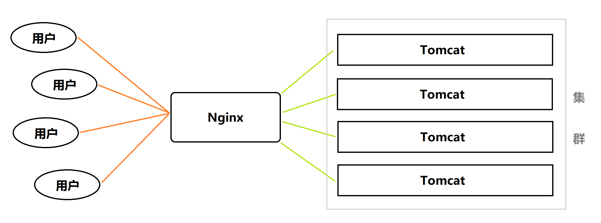
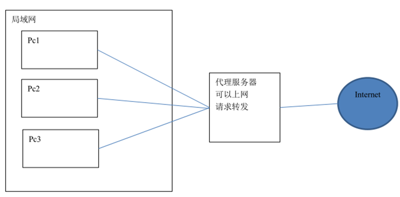
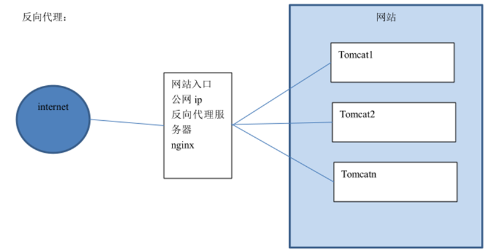

# Nginx

> - 掌握 Nginx 的安装
> - 掌握 Nginx 的静态网站部署
> - 理解 Nginx 的反向代理与负载均衡，能够配置反向代理与负载均衡

# 一、什么是 Nginx

Nginx 是一款高性能的 http 服务器/反向代理服务器及电子邮件（IMAP/POP3）代理服务器。由俄罗斯的程序设计师伊戈尔·西索夫（Igor Sysoev）所开发，官方测试 nginx 能够支撑 5 万个并发（Tomcat 150 个），并且 cpu、内存等资源消耗却非常低，运行非常稳定。

源码：https://trac.nginx.org/nginx/browser

官网：http://www.nginx.org/

**Nginx** **应用场景：**

1、http 服务器：Nginx 是一个 http 服务器可以独立提供 http 服务，可以做网页静态服务器。

2、虚拟主机：可以实现在一台服务器虚拟出多个网站。

3、反向代理，负载均衡：当网站的访问量达到一定程度后，单台服务器不能满足用户的请求时，需要用多台服务器集群可以使用 nginx 做反向代理，并且多台服务器可以平均分担负载，不会因为某台服务器负载高宕机而某台服务器闲置的情况。 



**Nginx 安装：**

Nginx 在 Linux 中的安装比较复杂，手动安装请参照相关文档和资料，对于云服务器一般的应用场景推荐使用宝塔面板进行安装比较方便。

**Nginx 启动：**

```
cd /usr/local/nginx/sbin/
./nginx 			 # 启动
./nginx -s stop		 # 此方式相当于先查出 nginx 进程 id 再使用 kill 命令强制杀掉进程
./nginx -s quit		 # 此方式停止步骤是待 nginx 进程处理任务完毕进行停止
./nginx -s reload 	 # 重启（推荐先 ./nginx -s quit，再 ./nginx）

ps aux | grep nginx	 # 查询 nginx 进程
```

# 二、Nginx 配置文件

> 当修改过配置文件后，需要重启 Nginx 才会生效！

conf 文件夹的 nginx.conf 文件，Nginx 服务器的基础配置，默认的配置也存放在此。

在 nginx.conf 的注释符号为：`#`

默认的 nginx 配置文件 nginx.conf 内容如下：

```
#user  nobody;
worker_processes  1;

#error_log  logs/error.log;
#error_log  logs/error.log  notice;
#error_log  logs/error.log  info;

#pid        logs/nginx.pid;


events {
    worker_connections  1024;
}


http {
    include       mime.types;
    default_type  application/octet-stream;

    #log_format  main  '$remote_addr - $remote_user [$time_local] "$request" '
    #                  '$status $body_bytes_sent "$http_referer" '
    #                  '"$http_user_agent" "$http_x_forwarded_for"';

    #access_log  logs/access.log  main;

    sendfile        on;
    #tcp_nopush     on;

    #keepalive_timeout  0;
    keepalive_timeout  65;

    #gzip  on;

    server {
        listen       80;
        server_name  localhost;

        #charset koi8-r;

        #access_log  logs/host.access.log  main;

        location / {
            root   html;
            index  index.html index.htm;
        }

        #error_page  404              /404.html;

        # redirect server error pages to the static page /50x.html
        #
        error_page   500 502 503 504  /50x.html;
        location = /50x.html {
            root   html;
        }

        # proxy the PHP scripts to Apache listening on 127.0.0.1:80
        #
        #location ~ \.php$ {
        #    proxy_pass   http://127.0.0.1;
        #}

        # pass the PHP scripts to FastCGI server listening on 127.0.0.1:9000
        #
        #location ~ \.php$ {
        #    root           html;
        #    fastcgi_pass   127.0.0.1:9000;
        #    fastcgi_index  index.php;
        #    fastcgi_param  SCRIPT_FILENAME  /scripts$fastcgi_script_name;
        #    include        fastcgi_params;
        #}

        # deny access to .htaccess files, if Apache's document root
        # concurs with nginx's one
        #
        #location ~ /\.ht {
        #    deny  all;
        #}
    }


    # another virtual host using mix of IP-, name-, and port-based configuration
    #
    #server {
    #    listen       8000;
    #    listen       somename:8080;
    #    server_name  somename  alias  another.alias;

    #    location / {
    #        root   html;
    #        index  index.html index.htm;
    #    }
    #}


    # HTTPS server
    #
    #server {
    #    listen       443 ssl;
    #    server_name  localhost;

    #    ssl_certificate      cert.pem;
    #    ssl_certificate_key  cert.key;

    #    ssl_session_cache    shared:SSL:1m;
    #    ssl_session_timeout  5m;

    #    ssl_ciphers  HIGH:!aNULL:!MD5;
    #    ssl_prefer_server_ciphers  on;

    #    location / {
    #        root   html;
    #        index  index.html index.htm;
    #    }
    #}

}
```

**Nginx 文件结构：**

```
...              #全局块

events {         #events块
   ...
}

http      #http块
{
    ...   #http全局块
    server        #server块
    { 
        ...       #server全局块
        location [PATTERN]   #location块
        {
            ...
        }
        location [PATTERN] 
        {
            ...
        }
    }
    server
    {
      ...
    }
    ...     #http全局块
}
```

- **全局块**：配置影响 nginx 全局的指令。一般有运行 nginx 服务器的用户组，nginx 进程 pid 存放路径，日志存放路径，配置文件引入，允许生成 worker process 数等。
- **events 块**：配置影响 nginx 服务器或与用户的网络连接。有每个进程的最大连接数，选取哪种事件驱动模型处理连接请求，是否允许同时接受多个网路连接，开启多个网络连接序列化等。
- **http 块**：可以嵌套多个 server，配置代理，缓存，日志定义等绝大多数功能和第三方模块的配置。如文件引入，mime-type 定义，日志自定义，是否使用 sendfile 传输文件，连接超时时间，单连接请求数等。
- **server 块**：配置虚拟主机的相关参数，一个 http 中可以有多个 server。
- **location 块**：配置请求的路由，以及各种页面的处理情况。

下面给大家上一个配置文件，作为理解。

```
########### 每个指令必须有分号结束。#################
#user administrator administrators;  #配置用户或者组，默认为nobody nobody。
#worker_processes 2; 		        #允许生成的进程数，默认为1
#pid /nginx/pid/nginx.pid;   	     #指定nginx进程运行文件存放地址
error_log log/error.log debug;       #制定日志路径，级别。这个设置可以放入全局块，http块，server块，级别以此为：debug|info|notice|warn|error|crit|alert|emerg
events {
    accept_mutex on;  	 #设置网路连接序列化，防止惊群现象发生，默认为on
    multi_accept on; 	 #设置一个进程是否同时接受多个网络连接，默认为off
    #use epoll;     	 #事件驱动模型，select|poll|kqueue|epoll|resig|/dev/poll|eventport
    worker_connections  1024;    #最大连接数，默认为512
}
http {
    include       mime.types;   		#文件扩展名与文件类型映射表
    default_type  application/octet-stream; 	#默认文件类型，默认为text/plain
    #access_log off; 		#取消服务日志    
    log_format myFormat '$remote_addr–$remote_user [$time_local] $request $status $body_bytes_sent $http_referer $http_user_agent $http_x_forwarded_for'; 	#自定义格式
    access_log log/access.log myFormat;  	#combined为日志格式的默认值
    sendfile on;   				#允许sendfile方式传输文件，默认为off，可以在http块，server块，location块。
    sendfile_max_chunk 100k;  	 #每个进程每次调用传输数量不能大于设定的值，默认为0，即不设上限。
    keepalive_timeout 65;  		 #连接超时时间，默认为75s，可以在http，server，location块。

    upstream mysvr {   
      server 127.0.0.1:7878;
      server 192.168.10.121:3333 backup;  	#热备
    }
    error_page 404 https://www.baidu.com; 	#错误页
    server {
        keepalive_requests 120; 	#单连接请求上限次数。
        listen       4545;   		#监听端口
        server_name  127.0.0.1;   	#监听地址       
        location  ~*^.+$ {       	#请求的url过滤，正则匹配，~为区分大小写，~*为不区分大小写。
           #root path;  		#根目录
           #index vv.txt;  		#设置默认页
           proxy_pass  http://mysvr;  	#请求转向mysvr 定义的服务器列表
           deny 127.0.0.1;  	#拒绝的ip
           allow 172.18.5.54; 	#允许的ip           
        } 
    }
}
```

# 三、Nginx 静态资源部署

初始 nginx.conf 文件如下：

```
worker_processes  1;

events {
    worker_connections  1024;
}

http {
    include       mime.types;
    default_type  application/octet-stream;

    sendfile        on;

    keepalive_timeout  65;

    server {
        listen       80; 	# 监听的端口
        server_name  localhost;		# 域名或ip，localhost 代表本机ip 127.0.0.1

        location / {		# 访问路径配置
            root   html;	 # 根目录
            index  index.html index.htm;	# 默认首页
        }

        error_page   500 502 503 504  /50x.html;	# 错误页面
        location = /50x.html {
            root   html;
        }
	}
}
```

将前端静态页面的路径配置到 server 的 location 中：

```
location / {
	root   前端项目路径;  #root /zjr/shopping;
	index  index.html index.htm;
}
```

# 四、Nginx 配置虚拟主机

虚拟主机，也叫“网站空间”，就是把一台运行在互联网上的物理服务器划分成多个“虚拟”服务器。虚拟主机技术极大的促进了网络技术的应用和普及。目前就是在同一主机系统上部署多个 Nginx 项目。

【端口方式】

```
server {
        listen       80;
        server_name  localhost;

        location / {
            root   html/objetc01;
            index  index.html index.htm;
		}
		
		error_page   500 502 503 504  /50x.html;
		location = /50x.html {
			root   html;
		}
}

server {
        listen       81;
        server_name  localhost;

        location / {
            root   html/object;
            index  index.html index.htm;
		}
		
		error_page   500 502 503 504  /50x.html;
		location = /50x.html {
			root   html;
		}
}
```

【域名方式】

> 一个域名对应一个 ip 地址，一个 ip 地址可以被多个域名绑定。
>
> 本地测试可以修改 hosts 文件（C:\Windows\System32\drivers\etc）
>
> 可以配置域名和 ip 的映射关系，如果 hosts 文件中配置了域名和 ip 的对应关系，不需要走 DNS 服务器。
>
> 192.168.177.129  www.hmtravel.com
>
> 192.168.177.129  regist.hmtravel.com

```
server {
        listen       80;
        server_name  www.hmtravel.com;

        location / {
            root   html/objetc01;
            index  index.html index.htm;
		}
		
		error_page   500 502 503 504  /50x.html;
		location = /50x.html {
			root   html;
		}
}

server {
        listen       80;
        server_name  regist.hmtravel.com;

        location / {
            root   html/object;
            index  index.html index.htm;
		}
		
		error_page   500 502 503 504  /50x.html;
		location = /50x.html {
			root   html;
		}
}
```

# 五、Nginx 反向代理

> 正向代理（代理）：本质是代理出口
>
> 
>
> 反向代理：本质是代理入口
>
> 
>
> 

在 Nginx 主机修改 Nginx 配置文件：

```
upstream tomcat-jerry {
	server 192.168.177.129:8080;		# 被代理服务器的 ip 和 端口
}

server {
	listen	80;
	server_name  www.jerry.com;
	
	location / {
		proxy_pass http://tomcat-jerry;
		index  index.html index.htm;
	}
	
	error_page   500 502 503 504  /50x.html;
	location = /50x.html {
		root   html;
	}
}
```

# 六、Nginx 负载均衡

> 负载均衡 建立在现有网络结构之上，它提供了一种廉价有效透明的方法扩展[网络设备](http://baike.baidu.com/item/网络设备)和[服务器](http://baike.baidu.com/item/服务器)的带宽、增加[吞吐量](http://baike.baidu.com/item/吞吐量)、加强网络数据处理能力、提高网络的灵活性和可用性。
>
> 负载均衡，英文名称为Load Balance，其意思就是分摊到多个操作单元上进行执行，例如Web[服务器](http://baike.baidu.com/item/服务器)、[FTP服务器](http://baike.baidu.com/item/FTP服务器)、[企业](http://baike.baidu.com/item/企业)关键应用服务器和其它关键任务服务器等，从而共同完成工作任务。

```
# 承担权重【1:2:1】
upstream server-list {
	server 192.168.177.129:8080;
	server 192.168.177.129:8081 weight=2;
	server 192.168.177.129:8082;
}

server {
	listen	80;
	server_name  www.jerry.com;
	
	location / {
		proxy_pass http://server-list;
		index  index.html index.htm;
	}
	
	error_page	500 502 503 504  /50x.html;
	location = /50x.html {
		root   html;
	}
}
```

> 注意：上述例子是在一台主机中，部署多个 Tomcat 并用端口号区分，不过在实际的应用中一般是一个 Tomcat 一台主机。

【均衡方式】

- **轮询（默认）**

```
upstream server-list {
	server localhost:8080;
	server localhost:9999;
}
```

- **weight 权重**

weight 代表权重，默认为1，权重越高被分配的客户端越多。
指定轮询几率，weight 和访问比率成正比，用于后端服务器性能不均的情况，例如：

```
upstream server-list {
	server localhost:8080 weight=5;
	server localhost:9999 weight=1;
}
```

- **ip_hash**

每个请求按访问 ip 的 hash 值分配，这样每个访问客户端会固定访问一个后端服务器，可以解决会话 Session 丢失的问题，不管刷新多少遍，同一客服端始终访问的是同一台服务器。

```
upstream server-list { 
	ip_hash; 
	server 127.0.0.1:8080; 
	server 127.0.0.1:9090; 
}
```

- **最少连接**

web 请求会被转发到连接数最少的服务器上。

```
upstream server-list { 
	least_conn;
	server 127.0.0.1:8080; 
	server 127.0.0.1:9090; 
}
```

> 以上例子，只是用 Nginx 做反向代理及负载均衡，无论前端还是后端都是由 Nginx 转发到之后的 Tomcat 服务器来提供服务的，Nginx 并没有提供前端服务。

【Nginx 运行 vue 项目，并对后端做负载均衡配置举例】

```
worker_processes  1;

events {
    worker_connections  1024;
}

http {
    include       mime.types;
    default_type  application/octet-stream;

    sendfile        on;

    keepalive_timeout  65;
     
    # 配置后端接口地址
    upstream apiServer {
        server 192.168.153.128:8101 weight=1;
        server 192.168.153.129:8101 weight=1;
    }

    server {
        listen       8080;
        server_name  localhost  192.168.153.131;

        location / {
        	# 设置 vue 项目路径
            root   /nginx/dist;
            index  index.html index.htm;
        }

        # 请求转发，给后端做负载均衡
        # 前提是 vue 前端要配置接口代理到 /api/
        location /api/ {
            add_header X-Content-Type-Options nosniff;
            proxy_set_header X-scheme $scheme;
            # 作用是我们可以获取到客户端的真实ip
            proxy_set_header X-Real-IP $remote_addr;
            proxy_set_header X-Forwarded-For $proxy_add_x_forwarded_for;
            proxy_set_header Host $http_host;
            proxy_set_header X-Nginx-Proxy true;
            proxy_hide_header X-Powered-By;
            proxy_hide_header Vary;
            proxy_pass http://apiServer;
        }

        error_page   500 502 503 504  /50x.html;
        location = /50x.html {
            root   html;
        }
    }
}
```

