## JDBC

**今日目标**

> * 掌握 JDBC 的 CRUD
> * 理解 JDBC 中各个对象的作用
> * 掌握 Druid 的使用

## 1 JDBC概述

在开发中我们使用的是 java 语言，那么势必要通过 java 语言操作数据库中的数据。这就是接下来要学习的 JDBC。

### 1.1 JDBC概念

> JDBC 就是使用 Java 语言操作关系型数据库的一套 API
>
> 全称：( Java DataBase Connectivity ) Java 数据库连接

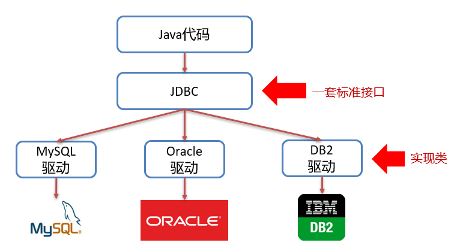

我们开发的同一套 Java 代码是无法操作不同的关系型数据库，因为每一个关系型数据库的底层实现细节都不一样。如果这样，问题就很大了，在公司中可以在开发阶段使用的是 MySQL 数据库，而上线时公司最终选用 Oracle 数据库，我们就需要对代码进行大批量修改，这显然并不是我们想看到的。我们要做到的是同一套 Java 代码操作不同的关系型数据库，而此时 sun 公司就指定了一套标准接口（JDBC），JDBC 中定义了所有操作关系型数据库的规则。众所周知接口是无法直接使用的，我们需要使用接口的实现类，而这套实现类（称之为：驱动）就由各自的数据库厂商给出。

### 1.2 JDBC本质

* 官方（sun公司）定义的一套操作所有关系型数据库的规则，即接口
* 各个数据库厂商去实现这套接口，提供数据库驱动 jar 包
* 我们可以使用这套接口（JDBC）编程，真正执行操作的是驱动 jar 包中的实现类

### 1.3  JDBC好处

* 各数据库厂商使用相同的接口，Java 代码不需要针对不同数据库分别开发
* 可随时替换底层数据库，访问数据库的 Java 代码基本不变

以后编写操作数据库的代码只需要面向 JDBC（接口），操作哪儿个关系型数据库就需要导入该数据库的驱动包，如需要操作 MySQL 数据库，就需要再项目中导入 MySQL 数据库的驱动包。如下图就是 MySQL 驱动包。


## 2 JDBC快速入门

先来看看通过 Java 操作数据库的流程

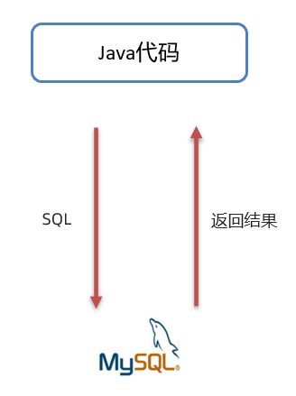

第一步：编写 Java 代码

第二步：Java 代码将 SQL 发送到 MySQL 服务端

第三步：MySQL 服务端接收到 SQL 语句并执行该 SQL 语句

第四步：将 SQL 语句执行的结果返回给 Java 代码

### 2.1  编写代码步骤

* 创建工程，导入驱动 jar 包

  

*  注册驱动

  ```java
  Class.forName("com.mysql.jdbc.Driver");
  ```

* 获取连接

  ```java
  Connection conn = DriverManager.getConnection(url, username, password);
  ```

  Java 代码需要发送 SQL 给 MySQL 服务端，就需要先建立连接

* 定义 SQL 语句

  ```java
  String sql =  "SELECT…" ;
  ```

* 获取执行 SQL 对象

  执行 SQL 语句需要 SQL 执行对象，而这个执行对象就是 Statement 对象

  ```java
  Statement stmt = conn.createStatement();
  ```

* 执行 SQL

  ```java
  stmt.executeUpdate(sql);  
  ```

* 处理返回结果
* 释放资源

### 2.2  具体操作

* 创建新的空的项目


* 定义项目的名称，并指定位置

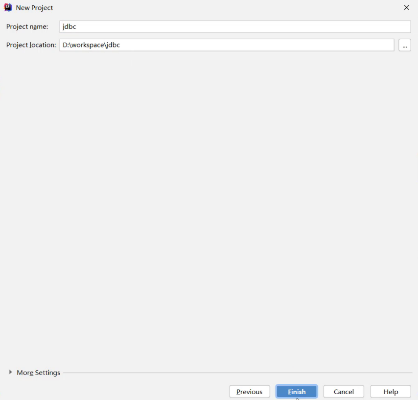

* 对项目进行设置，JDK 版本、编译版本


* 创建模块，指定模块的名称及位置


* 导入驱动包

  将 mysql 的驱动包放在模块下的 lib 目录（随意命名）下，并将该 jar 包添加为库文件


* 在添加为库文件的时候，有如下三个选项
  * Global Library：全局有效
  * Project Library：项目有效
  * Module Library：模块有效（我们选这个即可）


* 在 src 下创建类

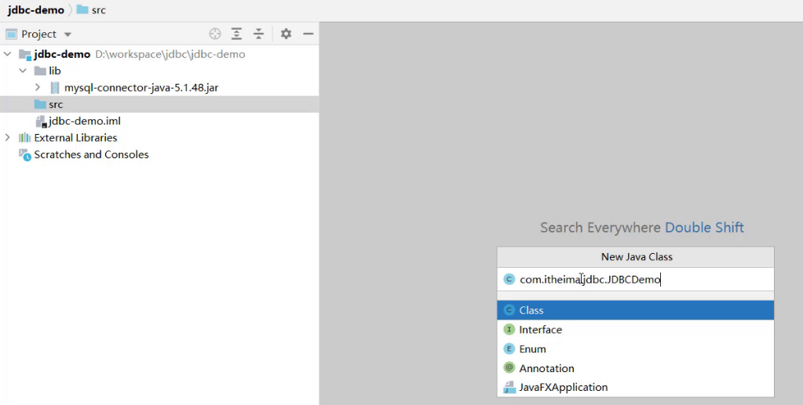

* 编写代码如下

```java
/**
 * JDBC快速入门
 */
public class JDBCDemo {

    public static void main(String[] args) throws Exception {
        //1. 注册驱动（可以省略）
        // Class.forName("com.mysql.jdbc.Driver");
        //2. 获取连接
        String url = "jdbc:mysql://127.0.0.1:3306/db1";
        String username = "root";
        String password = "1234";
        Connection conn = DriverManager.getConnection(url, username, password);
        //3. 定义 sql
        String sql = "update account set money = 2000 where id = 1";
        //4. 获取执行 sql 的对象 Statement
        Statement stmt = conn.createStatement();
        //5. 执行 sql
        int count = stmt.executeUpdate(sql);	// 返回值：表中受影响的行数
        //6. 处理结果
        System.out.println(count);
        //7. 释放资源（从里到外）
        stmt.close();
        conn.close();
    }
}
```

## 3 JDBC API详解

### 3.1 DriverManager

DriverManager（驱动管理类）作用：

* 注册驱动

  

  registerDriver 方法是用于注册驱动的，但是我们之前做的入门案例并不是这样写的。而是如下实现：

  ```sql
  Class.forName("com.mysql.jdbc.Driver");
  ```

  我们查询 MySQL 提供的 Driver 类，看它是如何实现的，源码如下：

  

  在该类中的静态代码块中已经执行了 `DriverManager` 对象的 `registerDriver()` 方法进行驱动的注册了，那么我们只需要加载 `Driver` 类，该静态代码块就会执行。而 `Class.forName("com.mysql.jdbc.Driver");` 就可以加载 `Driver` 类。

  > ==提示：==
  >
  > * MySQL 5 之后的驱动包，可以省略注册驱动的步骤（会自动注册）
  > * 自动加载 jar 包中 META-INF/services/java.sql.Driver 文件中的驱动类

* 获取数据库连接

  

  参数说明：

  * url：连接路径

    > 语法：jdbc:mysql://ip地址(域名):端口号/数据库名称?参数键值对1&参数键值对2…
    >
    > 示例：jdbc:mysql://127.0.0.1:3306/db1
    >
    > ==细节：==
    >
    > * 如果连接的是本机 mysql 服务器，并且 mysql 服务默认端口是 3306，则 url 可以简写为：jdbc:mysql:///数据库名称?参数键值对
    >
    > * 配置 useSSL=false 参数，禁用安全连接方式，解决警告提示
    >   * `jdbc:mysql://127.0.0.1:3306/db1?useSSL=false`
    >
  
  * user：用户名
  * password：密码

### 3.2  Connection

Connection（数据库连接对象）作用：

* 获取执行 SQL 的对象
* 管理事务

#### 3.2.1  获取执行对象

* 普通执行 SQL 对象

  ```java
  Statement createStatement()
  ```

  入门案例中就是通过该方法获取的执行对象。

* 预编译 SQL 的执行 SQL 对象：防止 SQL 注入

  ```java
  PreparedStatement  prepareStatement(sql)
  ```

  通过这种方式获取的 `PreparedStatement` SQL 语句执行对象是我们一会重点要进行讲解的，它可以防止 SQL 注入。

* 执行存储过程的对象

  ```java
  CallableStatement prepareCall(sql)
  ```

  通过这种方式获取的 `CallableStatement` 执行对象是用来执行存储过程的，而存储过程在 MySQL 中不常用，所以这个我们将不进行讲解。

#### 3.2.2  事务管理

先回顾一下 MySQL 事务管理的操作：

* 开启事务：`BEGIN;` 或者 `START TRANSACTION;`
* 提交事务：`COMMIT;`
* 回滚事务：`ROLLBACK;`

> MySQL 默认是自动提交事务。

接下来学习 JDBC 事务管理的方法。

Connection 中定义了 3 个对应的方法：

* 开启事务

  

  参数 autoCommit 表示是否自动提交事务，true 表示自动提交事务，false 表示手动提交事务。而开启事务需要将该参数设为 false。

* 提交事务

  

* 回滚事务

  

具体代码实现如下：

```java
/**
 * JDBC API 详解：Connection
 */
public class JDBCDemo3_Connection {

    public static void main(String[] args) throws Exception {
        //1. 注册驱动
        //Class.forName("com.mysql.jdbc.Driver");
        //2. 获取连接：如果连接的是本机 mysql 并且端口是默认的 3306 可以简化书写
        String url = "jdbc:mysql:///db1?useSSL=false";
        String username = "root";
        String password = "1234";
        Connection conn = DriverManager.getConnection(url, username, password);
        //3. 定义 sql
        String sql1 = "update account set money = 3000 where id = 1";
        String sql2 = "update account set money = 3000 where id = 2";
        //4. 获取执行 sql 的对象 Statement
        Statement stmt = conn.createStatement();

        try {
            // ============开启事务==========
            conn.setAutoCommit(false);
            //5. 执行 sql
            int count1 = stmt.executeUpdate(sql1);	//受影响的行数
            //6. 处理结果
            System.out.println(count1);
            int i = 3/0; // 手动制造异常
            //5. 执行 sql
            int count2 = stmt.executeUpdate(sql2);	//受影响的行数
            //6. 处理结果
            System.out.println(count2);

            // ============提交事务==========
            //程序运行到此处，说明没有出现任何问题，则需求提交事务
            conn.commit();
        } catch (Exception e) {
            // ============回滚事务==========
            //程序在出现异常时会执行到这个地方，此时就需要回滚事务
            conn.rollback();
            e.printStackTrace();
        }

        //7. 释放资源
        stmt.close();
        conn.close();
    }
}
```

### 3.3  Statement

#### 3.3.1  概述

Statement 对象的作用就是用来执行 SQL 语句。而针对不同类型的 SQL 语句使用的方法也不一样。

* 执行 DDL、DML 语句

  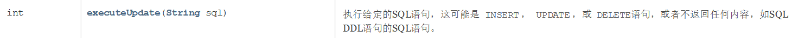

* 执行 DQL 语句

  

  该方法涉及到了 `ResultSet` 对象，而这个对象我们还没有学习，一会再重点讲解。

#### 3.3.2  代码实现

* 执行 DML 语句

  ```java
  /**
    * 执行 DML 语句
    * @throws Exception
    */
  @Test
  public void testDML() throws  Exception {
      //1. 注册驱动
      //Class.forName("com.mysql.jdbc.Driver");
      //2. 获取连接：如果连接的是本机 mysql 并且端口是默认的 3306 可以简化书写
      String url = "jdbc:mysql:///db1?useSSL=false";
      String username = "root";
      String password = "1234";
      Connection conn = DriverManager.getConnection(url, username, password);
      //3. 定义 sql
      String sql = "update account set money = 3000 where id = 1";
      //4. 获取执行 sql 的对象 Statement
      Statement stmt = conn.createStatement();
      //5. 执行 sql
      int count = stmt.executeUpdate(sql);	//执行完 DML 语句，受影响的行数
      //6. 处理结果
      //System.out.println(count);
      if(count > 0){
          System.out.println("修改成功~");
      }else{
          System.out.println("修改失败~");
      }
      
      //7. 释放资源
      stmt.close();
      conn.close();
  }
  ```

* 执行 DDL 语句

  ```java
  /**
    * 执行DDL语句
    * @throws Exception
    */
  @Test
  public void testDDL() throws  Exception {
      //1. 注册驱动
      //Class.forName("com.mysql.jdbc.Driver");
      //2. 获取连接：如果连接的是本机 mysql 并且端口是默认的 3306 可以简化书写
      String url = "jdbc:mysql:///db1?useSSL=false";
      String username = "root";
      String password = "1234";
      Connection conn = DriverManager.getConnection(url, username, password);
      //3. 定义 sql
      String sql = "drop database db2";
      //4. 获取执行 sql 的对象 Statement
      Statement stmt = conn.createStatement();
      //5. 执行 sql
      int count = stmt.executeUpdate(sql);	//执行完 DDL 语句，可能是 0
      //6. 处理结果
      System.out.println(count);
  
      //7. 释放资源
      stmt.close();
      conn.close();
  }
  ```

  > 注意：
  >
  > * 以后开发很少使用 java 代码操作 DDL 语句

### 3.4  ResultSet

#### 3.4.1  概述

ResultSet（结果集对象）作用：

* ==封装了 SQL 查询语句的结果。==

而执行了 DQL 语句后就会返回该对象，对应执行 DQL 语句的方法如下：

```sql
ResultSet executeQuery(sql)：执行DQL 语句，返回 ResultSet 对象
```

那么我们就需要从 `ResultSet` 对象中获取我们想要的数据。`ResultSet` 对象提供了操作查询结果数据的方法，如下：

> boolean  next()
> * 将光标从当前位置向前移动一行 
> * 判断当前行是否为有效行
>
> 方法返回值说明：
>
> * true：有效航，当前行有数据
> * false：无效行，当前行没有数据

> xxx  getXxx(参数)：获取数据
>
> * xxx : 数据类型；如： int getInt(参数) ；String getString(参数)
> * 参数
>   * int 类型的参数：列的编号，从 1 开始
>   * String 类型的参数： 列的名称 

如下图为执行 SQL 语句后的结果

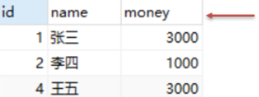

一开始光标指定于第一行前，如图所示红色箭头指向于表头行。当我们调用了 `next()` 方法后，光标就下移到第一行数据，并且方法返回 true，此时就可以通过 `getInt("id")` 获取当前行 id 字段的值，也可以通过 `getString("name")` 获取当前行 name 字段的值。如果想获取下一行的数据，继续调用 `next()` 方法，以此类推。

#### 3.4.2  代码实现

```java
/**
  * 执行DQL
  * @throws Exception
  */
@Test
public void testResultSet() throws  Exception {
    //1. 注册驱动
    //Class.forName("com.mysql.jdbc.Driver");
    //2. 获取连接：如果连接的是本机 mysql 并且端口是默认的 3306 可以简化书写
    String url = "jdbc:mysql:///db1?useSSL=false";
    String username = "root";
    String password = "1234";
    Connection conn = DriverManager.getConnection(url, username, password);
    //3. 定义 sql
    String sql = "select * from account";
    //4. 获取 statement 对象
    Statement stmt = conn.createStatement();
    //5. 执行 sql
    ResultSet rs = stmt.executeQuery(sql);
    //6. 处理结果， 遍历 rs 中的所有数据
    /* // 6.1 光标向下移动一行，并且判断当前行是否有数据
        while (rs.next()){
            //6.2 获取数据  getXxx()
            int id = rs.getInt(1);	// 此处用列编号 
            String name = rs.getString(2);
            double money = rs.getDouble(3);

            System.out.println(id);
            System.out.println(name);
            System.out.println(money);

            System.out.println("--------------");
        }*/
    // 6.1 光标向下移动一行，并且判断当前行是否有数据
    while (rs.next()){
        //6.2 获取数据  getXxx()
        int id = rs.getInt("id");
        String name = rs.getString("name");
        double money = rs.getDouble("money");

        System.out.println(id);
        System.out.println(name);
        System.out.println(money);

        System.out.println("--------------");
    }

    //7. 释放资源
    rs.close();
    stmt.close();
    conn.close();
}
```

### 3.5  案例

* 需求：查询 account 账户表数据，封装为 Account 对象中（一行数据一个对象），并且将对象存储到 ArrayList 集合中

  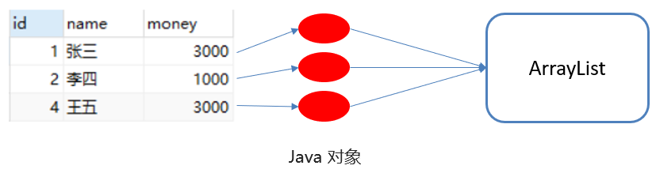

* 代码实现

  ```java
  /**
    * 查询 account 账户表数据，封装为 Account 对象中，并且存储到 ArrayList 集合中
    * 1. 定义实体类 Account
    * 2. 查询数据，封装到 Account 对象中
    * 3. 将 Account 对象存入 ArrayList 集合中
    */
  @Test
  public void testResultSet2() throws  Exception {
      //1. 注册驱动
      //Class.forName("com.mysql.jdbc.Driver");
      //2. 获取连接：如果连接的是本机 mysql 并且端口是默认的 3306 可以简化书写
      String url = "jdbc:mysql:///db1?useSSL=false";
      String username = "root";
      String password = "1234";
      Connection conn = DriverManager.getConnection(url, username, password);
  
      //3. 定义 sql
      String sql = "select * from account";
  
      //4. 获取 statement 对象
      Statement stmt = conn.createStatement();
  
      //5. 执行 sql
      ResultSet rs = stmt.executeQuery(sql);
  
      // 创建集合
      List<Account> list = new ArrayList<>();
     
      // 6.1 光标向下移动一行，并且判断当前行是否有数据
      while (rs.next()){
          Account account = new Account();
  
          //6.2 获取数据  getXxx()
          int id = rs.getInt("id");
          String name = rs.getString("name");
          double money = rs.getDouble("money");
  
          //赋值
          account.setId(id);
          account.setName(name);
          account.setMoney(money);
  
          // 存入集合
          list.add(account);
      }
  
      System.out.println(list);
  
      //7. 释放资源
      rs.close();
      stmt.close();
      conn.close();
  }
  ```

### 3.6  PreparedStatement

> PreparedStatement 作用：
>
> * 预编译 SQL 语句并执行：预防 SQL 注入问题

对上面的作用中 SQL 注入问题大家肯定不理解。那我们先对 SQL 注入进行说明。

#### 3.6.1  SQL注入

> SQL 注入是通过操作输入来修改事先定义好的 SQL 语句，用以达到执行代码对服务器进行攻击的方法。

在今天资料下的 `day03-JDBC\资料\2. sql注入演示` 中修改 `application.properties` 文件中的用户名和密码，文件内容如下：

```properties
spring.datasource.driver-class-name=com.mysql.cj.jdbc.Driver
spring.datasource.url=jdbc:mysql://localhost:3306/test?useSSL=false&useUnicode=true&characterEncoding=UTF-8
spring.datasource.username=root
spring.datasource.password=1234
```

在MySQL中创建名为 `test` 的数据库

```sql
create database test;
```

在命令提示符中运行今天资料下的 `day03-JDBC\资料\2. sql注入演示\sql.jar` 这个 jar 包。

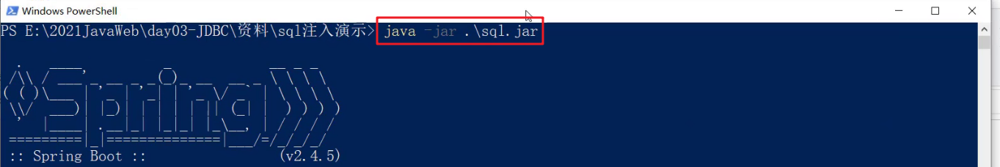 

此时我们就能在数据库中看到 user 表


接下来在浏览器的地址栏输入 `localhost:8080/login.html` 就能看到如下页面


我们就可以在如上图中输入用户名和密码进行登陆。用户名和密码输入正确就登陆成功，跳转到首页。用户名和密码输入错误则给出错误提示，如下图


但是我可以通过输入一些特殊的字符登陆到首页。

用户名随意写，密码写成 `' or '1' ='1`


这就是 SQL 注入漏洞，也是很危险的。当然现在市面上的系统都不会存在这种问题了，所以大家也不要尝试用这种方式去试其他的系统。

那么该如何解决呢？这里就可以将 SQL 执行对象 `Statement` 换成 `PreparedStatement` 对象。

#### 3.6.2  代码模拟SQL注入问题

```java
@Test
public void testLogin() throws  Exception {
    //2. 获取连接：如果连接的是本机 mysql 并且端口是默认的 3306 可以简化书写
    String url = "jdbc:mysql:///db1?useSSL=false";
    String username = "root";
    String password = "1234";
    Connection conn = DriverManager.getConnection(url, username, password);

    // 接收用户输入 用户名和密码
    String name = "sjdljfld";
    String pwd = "' or '1' = '1";
    String sql = "select * from tb_user where username = '"+name+"' and password = '"+pwd+"'";
    // 获取 stmt 对象
    Statement stmt = conn.createStatement();
    // 执行 sql
    ResultSet rs = stmt.executeQuery(sql);
    // 判断登录是否成功
    if(rs.next()){
        System.out.println("登录成功~");
    }else{
        System.out.println("登录失败~");
    }

    //7. 释放资源
    rs.close();
    stmt.close();
    conn.close();
}
```

上面代码是将用户名和密码拼接到 sql 语句中，拼接后的 sql 语句如下

```sql
select * from tb_user where username = 'sjdljfld' and password = ''or '1' = '1'
```

从上面语句可以看出条件 `username = 'sjdljfld' and password = ''` 不管是否满足，而 `or` 后面的 `'1' = '1'` 是始终满足的，最终条件是成立的，就可以正常的进行登陆了。

接下来我们来学习 PreparedStatement 对象。

#### 3.6.3  PreparedStatement概述

> PreparedStatement作用：
>
> * 预编译 SQL 语句并执行：预防 SQL 注入问题

* 获取 PreparedStatement 对象

  ```java
  // SQL 语句中的参数值，使用？占位符替代
  String sql = "select * from user where username = ? and password = ?";
  // 通过 Connection 对象获取，并传入对应的 sql 语句
  PreparedStatement pstmt = conn.prepareStatement(sql);
  ```

* 设置参数值

  上面的 sql 语句中参数使用 ? 进行占位，在之前之前肯定要设置这些 ?  的值。

  > PreparedStatement对象：setXxx(参数1，参数2)：给 ? 赋值
  >
  > * Xxx：数据类型 ； 如 setInt (参数1，参数2)
  >
  > * 参数：
  >
  >   * 参数1： ？的位置编号，从1 开始
  >
  >   * 参数2： ？的值

* 执行 SQL 语句

  > executeUpdate();  执行 DDL 语句和 DML 语句
  >
  > executeQuery();  执行 DQL 语句
  >
  > ==注意：==
  >
  > * 调用这两个方法时不需要传递 SQL 语句，因为获取 SQL 语句执行对象时已经对 SQL 语句进行预编译了。

#### 3.6.4  使用PreparedStatement改进

```java
 @Test
public void testPreparedStatement() throws  Exception {
    //2. 获取连接：如果连接的是本机 mysql 并且端口是默认的 3306 可以简化书写
    String url = "jdbc:mysql:///db1?useSSL=false";
    String username = "root";
    String password = "1234";
    Connection conn = DriverManager.getConnection(url, username, password);

    // 接收用户输入 用户名和密码
    String name = "zhangsan";
    String pwd = "' or '1' = '1";

    // 定义 sql
    String sql = "select * from tb_user where username = ? and password = ?";
    // 获取 pstmt 对象
    PreparedStatement pstmt = conn.prepareStatement(sql);
    // 设置？的值
    pstmt.setString(1,name);
    pstmt.setString(2,pwd);
    // 执行 sql
    ResultSet rs = pstmt.executeQuery();
    // 判断登录是否成功
    if(rs.next()){
        System.out.println("登录成功~");
    }else{
        System.out.println("登录失败~");
    }
    //7. 释放资源
    rs.close();
    pstmt.close();
    conn.close();
}
```

执行上面语句就可以发现不会出现 SQL 注入漏洞问题了。那么 PreparedStatement 又是如何解决的呢？它是将特殊字符进行了转义，转义的 SQL 如下：

```sql
select * from tb_user where username = 'sjdljfld' and password = '\'or \'1\' = \'1'
```

#### 3.6.5  PreparedStatement原理

> PreparedStatement 好处：
>
> * 预编译 SQL，性能更高
> * 防止 SQL 注入：==将敏感字符进行转义==

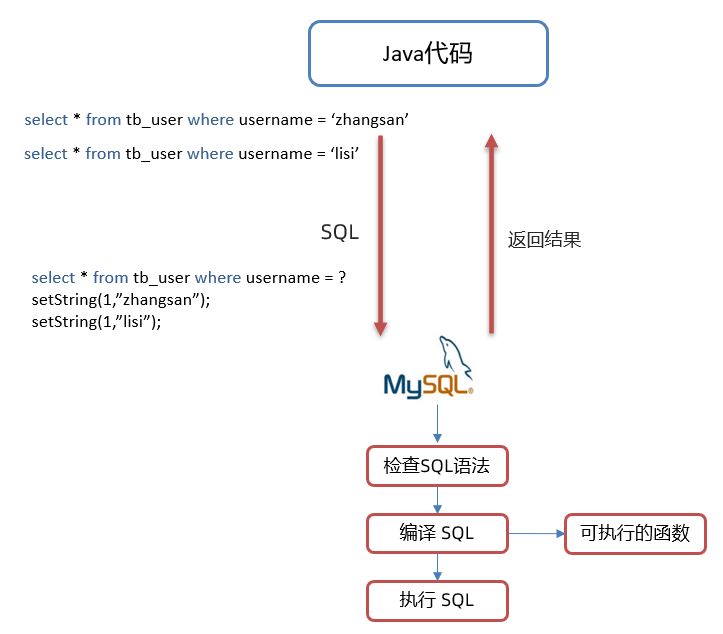

Java代码操作数据库流程如图所示：

* 将 sql 语句发送到 MySQL 服务器端

* MySQL 服务端会对 sql 语句进行如下操作

  * 检查 SQL 语句

    检查 SQL 语句的语法是否正确。

  * 编译 SQL 语句。将 SQL 语句编译成可执行的函数。

    检查 SQL 和编译 SQL 花费的时间比执行 SQL 的时间还要长。如果我们只是重新设置参数，那么检查 SQL 语句和编译 SQL 语句将不需要重复执行。这样就提高了性能。

  * 执行 SQL 语句

接下来我们通过查询日志来看一下原理。

* 开启预编译功能

  在代码中编写 url 时需要加上以下参数。而我们之前根本就没有开启预编译功能，只是解决了 SQL 注入漏洞。

  ```sql
  useServerPrepStmts=true
  ```

* 配置 MySQL 执行日志（重启 mysql 服务后生效）

  在 mysql 配置文件（my.ini）中添加如下配置

  ```
  log-output=FILE
  general-log=1
  general_log_file="D:\mysql.log"
  slow-query-log=1
  slow_query_log_file="D:\mysql_slow.log"
  long_query_time=2
  ```

* java测试代码如下：

  ```java
   /**
     * PreparedStatement原理
     * @throws Exception
     */
  @Test
  public void testPreparedStatement2() throws  Exception {
  
      //2. 获取连接：如果连接的是本机mysql并且端口是默认的 3306 可以简化书写
      // useServerPrepStmts=true 参数开启预编译功能
      String url = "jdbc:mysql:///db1?useSSL=false&useServerPrepStmts=true";
      String username = "root";
      String password = "1234";
      Connection conn = DriverManager.getConnection(url, username, password);
  
      // 接收用户输入 用户名和密码
      String name = "zhangsan";
      String pwd = "' or '1' = '1";
  
      // 定义sql
      String sql = "select * from tb_user where username = ? and password = ?";
  
      // 获取pstmt对象
      PreparedStatement pstmt = conn.prepareStatement(sql);
  
      Thread.sleep(10000);
      // 设置？的值
      pstmt.setString(1,name);
      pstmt.setString(2,pwd);
      ResultSet rs = null;
      // 执行sql
      rs = pstmt.executeQuery();
  
      // 设置？的值
      pstmt.setString(1,"aaa");
      pstmt.setString(2,"bbb");
      // 执行sql
      rs = pstmt.executeQuery();
  
      // 判断登录是否成功
      if(rs.next()){
          System.out.println("登录成功~");
      }else{
          System.out.println("登录失败~");
      }
  
      //7. 释放资源
      rs.close();
      pstmt.close();
      conn.close();
  }
  ```

  

* 执行SQL语句，查看 `D:\mysql.log` 日志如下:

  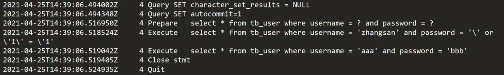

  上图中第三行中的 `Prepare` 是对SQL语句进行预编译。第四行和第五行是执行了两次SQL语句，而第二次执行前并没有对SQL进行预编译。

> ==小结：==
>
> * 在获取PreparedStatement对象时，将sql语句发送给mysql服务器进行检查，编译（这些步骤很耗时）
> * 执行时就不用再进行这些步骤了，速度更快
> * 如果sql模板一样，则只需要进行一次检查、编译

## 4，数据库连接池

### 4.1  数据库连接池简介

> * 数据库连接池是个容器，负责分配、管理数据库连接(Connection)
>
> * 它允许应用程序重复使用一个现有的数据库连接，而不是再重新建立一个；
>
> * 释放空闲时间超过最大空闲时间的数据库连接来避免因为没有释放数据库连接而引起的数据库连接遗漏
> * 好处
>   * 资源重用
>   * 提升系统响应速度
>   * 避免数据库连接遗漏

之前我们代码中使用连接是没有使用都创建一个Connection对象，使用完毕就会将其销毁。这样重复创建销毁的过程是特别耗费计算机的性能的及消耗时间的。

而数据库使用了数据库连接池后，就能达到Connection对象的复用，如下图

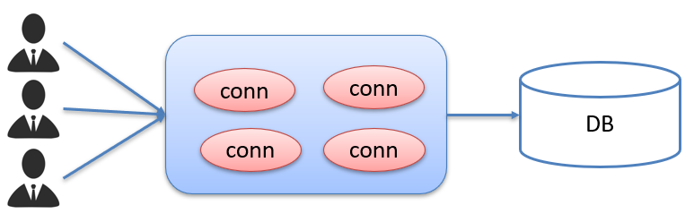

连接池是在一开始就创建好了一些连接（Connection）对象存储起来。用户需要连接数据库时，不需要自己创建连接，而只需要从连接池中获取一个连接进行使用，使用完毕后再将连接对象归还给连接池；这样就可以起到资源重用，也节省了频繁创建连接销毁连接所花费的时间，从而提升了系统响应的速度。

### 4.2  数据库连接池实现

* 标准接口：==DataSource==

  官方(SUN) 提供的数据库连接池标准接口，由第三方组织实现此接口。该接口提供了获取连接的功能：

  ```java
  Connection getConnection()
  ```

  那么以后就不需要通过 `DriverManager` 对象获取 `Connection` 对象，而是通过连接池（DataSource）获取 `Connection` 对象。

* 常见的数据库连接池

  * DBCP
  * C3P0
  * Druid

  我们现在使用更多的是Druid，它的性能比其他两个会好一些。

* Druid（德鲁伊）

  * Druid连接池是阿里巴巴开源的数据库连接池项目 

  * 功能强大，性能优秀，是Java语言最好的数据库连接池之一

### 4.3  Driud使用

> * 导入jar包 druid-1.1.12.jar
> * 定义配置文件
> * 加载配置文件
> * 获取数据库连接池对象
> * 获取连接

现在通过代码实现，首先需要先将druid的jar包放到项目下的lib下并添加为库文件

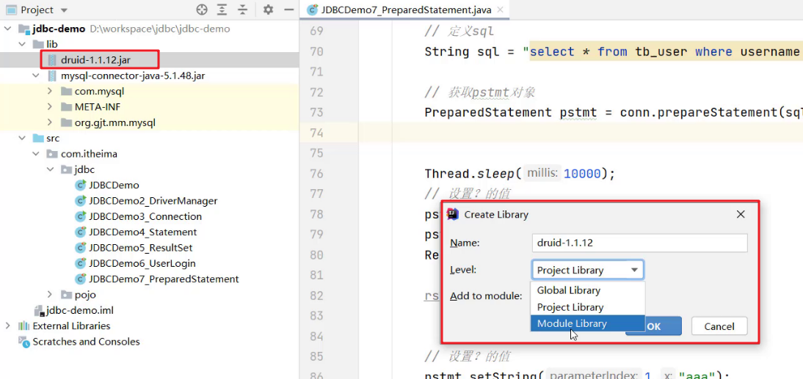

项目结构如下：


编写配置文件如下：

druid.properties

```properties
driverClassName=com.mysql.jdbc.Driver
url=jdbc:mysql:///db1?useSSL=false&useServerPrepStmts=true
username=root
password=1234
# 初始化连接数量
initialSize=5
# 最大连接数
maxActive=10
# 最大等待时间
maxWait=3000
```

使用druid的代码如下：

```java
/**
 * Druid数据库连接池演示
 */
public class DruidDemo {

    public static void main(String[] args) throws Exception {
        //1.导入jar包
        //2.定义配置文件
        //3. 加载配置文件
        Properties prop = new Properties();
        prop.load(new FileInputStream("jdbc-demo/src/druid.properties"));
        //4. 获取连接池对象
        DataSource dataSource = DruidDataSourceFactory.createDataSource(prop);

        //5. 获取数据库连接 Connection
        Connection connection = dataSource.getConnection();
        System.out.println(connection); //获取到了连接后就可以继续做其他操作了

        // 打印当前路径，这样有助于填写上面的路径
        //System.out.println(System.getProperty("user.dir"));
    }
}
```

## 5，JDBC练习

### 5.1  需求

完成商品品牌数据的增删改查操作

* 查询：查询所有数据
* 添加：添加品牌
* 修改：根据id修改
* 删除：根据id删除

### 5.2  案例实现

#### 5.2.1  环境准备

* 数据库表 `tb_brand`

  ```sql
  -- 删除tb_brand表
  drop table if exists tb_brand;
  -- 创建tb_brand表
  create table tb_brand (
      -- id 主键
      id int primary key auto_increment,
      -- 品牌名称
      brand_name varchar(20),
      -- 企业名称
      company_name varchar(20),
      -- 排序字段
      ordered int,
      -- 描述信息
      description varchar(100),
      -- 状态：0：禁用  1：启用
      status int
  );
  -- 添加数据
  insert into tb_brand (brand_name, company_name, ordered, description, status)
  values ('三只松鼠', '三只松鼠股份有限公司', 5, '好吃不上火', 0),
         ('华为', '华为技术有限公司', 100, '华为致力于把数字世界带入每个人、每个家庭、每个组织，构建万物互联的智能世界', 1),
         ('小米', '小米科技有限公司', 50, 'are you ok', 1);
  ```

* 在pojo包下实体类 Brand

  ```java
  /**
   * 品牌
   * alt + 鼠标左键：整列编辑
   * 在实体类中，基本数据类型建议使用其对应的包装类型
   */
  public class Brand {
      // id 主键
      private Integer id;
      // 品牌名称
      private String brandName;
      // 企业名称
      private String companyName;
      // 排序字段
      private Integer ordered;
      // 描述信息
      private String description;
      // 状态：0：禁用  1：启用
      private Integer status;
  
      public Integer getId() {
          return id;
      }
  
      public void setId(Integer id) {
          this.id = id;
      }
  
      public String getBrandName() {
          return brandName;
      }
  
      public void setBrandName(String brandName) {
          this.brandName = brandName;
      }
  
      public String getCompanyName() {
          return companyName;
      }
  
      public void setCompanyName(String companyName) {
          this.companyName = companyName;
      }
  
      public Integer getOrdered() {
          return ordered;
      }
  
      public void setOrdered(Integer ordered) {
          this.ordered = ordered;
      }
  
      public String getDescription() {
          return description;
      }
  
      public void setDescription(String description) {
          this.description = description;
      }
  
      public Integer getStatus() {
          return status;
      }
  
      public void setStatus(Integer status) {
          this.status = status;
      }
  
      @Override
      public String toString() {
          return "Brand{" +
                  "id=" + id +
                  ", brandName='" + brandName + '\'' +
                  ", companyName='" + companyName + '\'' +
                  ", ordered=" + ordered +
                  ", description='" + description + '\'' +
                  ", status=" + status +
                  '}';
      }
  }
  ```

#### 5.2.2  查询所有

```java
 /**
   * 查询所有
   * 1. SQL：select * from tb_brand;
   * 2. 参数：不需要
   * 3. 结果：List<Brand>
   */

@Test
public void testSelectAll() throws Exception {
    //1. 获取Connection
    //3. 加载配置文件
    Properties prop = new Properties();
    prop.load(new FileInputStream("jdbc-demo/src/druid.properties"));
    //4. 获取连接池对象
    DataSource dataSource = DruidDataSourceFactory.createDataSource(prop);

    //5. 获取数据库连接 Connection
    Connection conn = dataSource.getConnection();
    //2. 定义SQL
    String sql = "select * from tb_brand;";
    //3. 获取pstmt对象
    PreparedStatement pstmt = conn.prepareStatement(sql);
    //4. 设置参数
    //5. 执行SQL
    ResultSet rs = pstmt.executeQuery();
    //6. 处理结果 List<Brand> 封装Brand对象，装载List集合
    Brand brand = null;
    List<Brand> brands = new ArrayList<>();
    while (rs.next()){
        //获取数据
        int id = rs.getInt("id");
        String brandName = rs.getString("brand_name");
        String companyName = rs.getString("company_name");
        int ordered = rs.getInt("ordered");
        String description = rs.getString("description");
        int status = rs.getInt("status");
        //封装Brand对象
        brand = new Brand();
        brand.setId(id);
        brand.setBrandName(brandName);
        brand.setCompanyName(companyName);
        brand.setOrdered(ordered);
        brand.setDescription(description);
        brand.setStatus(status);

        //装载集合
        brands.add(brand);
    }
    System.out.println(brands);
    //7. 释放资源
    rs.close();
    pstmt.close();
    conn.close();
}
```

#### 5.2.3  添加数据

```java
/**
  * 添加
  * 1. SQL：insert into tb_brand(brand_name, company_name, ordered, description, status) values(?,?,?,?,?);
  * 2. 参数：需要，除了id之外的所有参数信息
  * 3. 结果：boolean
  */
@Test
public void testAdd() throws Exception {
    // 接收页面提交的参数
    String brandName = "香飘飘";
    String companyName = "香飘飘";
    int ordered = 1;
    String description = "绕地球一圈";
    int status = 1;

    //1. 获取Connection
    //3. 加载配置文件
    Properties prop = new Properties();
    prop.load(new FileInputStream("jdbc-demo/src/druid.properties"));
    //4. 获取连接池对象
    DataSource dataSource = DruidDataSourceFactory.createDataSource(prop);
    //5. 获取数据库连接 Connection
    Connection conn = dataSource.getConnection();
    //2. 定义SQL
    String sql = "insert into tb_brand(brand_name, company_name, ordered, description, status) values(?,?,?,?,?);";
    //3. 获取pstmt对象
    PreparedStatement pstmt = conn.prepareStatement(sql);
    //4. 设置参数
    pstmt.setString(1,brandName);
    pstmt.setString(2,companyName);
    pstmt.setInt(3,ordered);
    pstmt.setString(4,description);
    pstmt.setInt(5,status);

    //5. 执行SQL
    int count = pstmt.executeUpdate(); // 影响的行数
    //6. 处理结果
    System.out.println(count > 0);

    //7. 释放资源
    pstmt.close();
    conn.close();
}
```

#### 5.2.4  修改数据

```java
/**
  * 修改
  * 1. SQL：

     update tb_brand
         set brand_name  = ?,
         company_name= ?,
         ordered     = ?,
         description = ?,
         status      = ?
     where id = ?

   * 2. 参数：需要，所有数据
   * 3. 结果：boolean
   */

@Test
public void testUpdate() throws Exception {
    // 接收页面提交的参数
    String brandName = "香飘飘";
    String companyName = "香飘飘";
    int ordered = 1000;
    String description = "绕地球三圈";
    int status = 1;
    int id = 4;

    //1. 获取Connection
    //3. 加载配置文件
    Properties prop = new Properties();
    prop.load(new FileInputStream("jdbc-demo/src/druid.properties"));
    //4. 获取连接池对象
    DataSource dataSource = DruidDataSourceFactory.createDataSource(prop);
    //5. 获取数据库连接 Connection
    Connection conn = dataSource.getConnection();
    //2. 定义SQL
    String sql = " update tb_brand\n" +
        "         set brand_name  = ?,\n" +
        "         company_name= ?,\n" +
        "         ordered     = ?,\n" +
        "         description = ?,\n" +
        "         status      = ?\n" +
        "     where id = ?";

    //3. 获取pstmt对象
    PreparedStatement pstmt = conn.prepareStatement(sql);

    //4. 设置参数
    pstmt.setString(1,brandName);
    pstmt.setString(2,companyName);
    pstmt.setInt(3,ordered);
    pstmt.setString(4,description);
    pstmt.setInt(5,status);
    pstmt.setInt(6,id);

    //5. 执行SQL
    int count = pstmt.executeUpdate(); // 影响的行数
    //6. 处理结果
    System.out.println(count > 0);

    //7. 释放资源
    pstmt.close();
    conn.close();
}
```

#### 5.2.5  删除数据

```java
/**
  * 删除
  * 1. SQL：
            delete from tb_brand where id = ?
  * 2. 参数：需要，id
  * 3. 结果：boolean
  */
@Test
public void testDeleteById() throws Exception {
    // 接收页面提交的参数
    int id = 4;
    //1. 获取Connection
    //3. 加载配置文件
    Properties prop = new Properties();
    prop.load(new FileInputStream("jdbc-demo/src/druid.properties"));
    //4. 获取连接池对象
    DataSource dataSource = DruidDataSourceFactory.createDataSource(prop);
    //5. 获取数据库连接 Connection
    Connection conn = dataSource.getConnection();
    //2. 定义SQL
    String sql = " delete from tb_brand where id = ?";
    //3. 获取pstmt对象
    PreparedStatement pstmt = conn.prepareStatement(sql);
    //4. 设置参数
    pstmt.setInt(1,id);
    //5. 执行SQL
    int count = pstmt.executeUpdate(); // 影响的行数
    //6. 处理结果
    System.out.println(count > 0);

    //7. 释放资源
    pstmt.close();
    conn.close();
}
```

