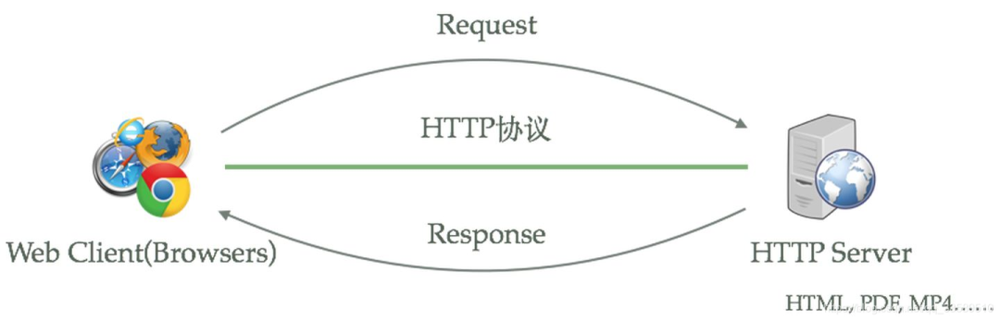
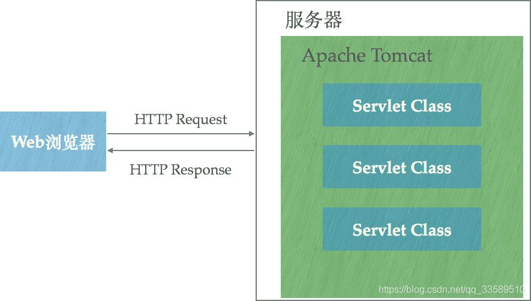

# 【Tomcat、Nginx 和 Apache 的区别】

- 这三者都是 web server，各自有什么特点？
- 他们之间的区别是什么？
- nginx 和 tomcat 性能上有何异同?
- tomcat 用在 Java 后台程序，难道不能用 apache 和 nginx？

Apache 其实是 Apache HTTP Server Project，和 Nginx 一样都是开源的 **HTTP 服务器** 软件。

HTTP 服务器本质上也是一种应用程序——它通常运行在服务器上，绑定服务器的 IP 地址并监听某个 TCP 端口，接收并处理 HTTP 请求，这样客户端（如 Chrome 这样的浏览器）就能通过 HTTP 协议获取服务器上的网页（HTML格式）、文档（PDF格式）等资源。

强大的 Java 类库也实现了简单的 HTTP 服务器供开发者使用：

- HttpServer (Java HTTP Server )

使用这种类库能很容易的运行一个 HTTP 服务器，它们都能通过绑定 IP 地址并监听 TCP 端口来提供 HTTP 服务。

相比于 Apache HTTP Server，Tomcat 能**动态生成资源**并返回给 Client。Apache HTTP Server 和 Nginx 都能将某一文本文件内容通过 HTTP 协议返回到客户端，但该文本文件的内容固定——无论何时、任何人访问它得到的内容都完全相同，即静态资源。

动态资源则在不同时间、客户端访问得到的内容不同。

Apache HTTP Server 和 Nginx 本身不支持生成动态页面，但可以通过其他模块来支持（例如通过 Shell、PHP、Py 脚本动态生成内容）。若想要使用 Java 程序动态生成资源内容，使用这类 HTTP 服务器就很难。Java Servlet 及 JSP 可以让 Java 程序也能处理 HTTP 请求并且返回内容（由程序动态控制）的能力，Tomcat 正是支持运行Servlet/JSP 应用程序的容器（Container）：

Tomcat 运行在 JVM 之上，和 HTTP 服务器一样，绑定 IP 地址并监听 TCP 端口，而且：

- 管理 Servlet 程序的生命周期
- 将 URL 映射到指定 Servlet 进行处理
- 与 Servlet 程序合作处理 HTTP 请求
- 根据 HTTP 请求生成 HttpServletRequest 对象并传递给 Servlet 进行处理，将 Servlet 中的 HttpServletResponse 对象生成的内容返回给浏览器

虽然 Tomcat 也可认为是 HTTP 服务器，但通常它仍和 Nginx 协作：

- 动静态资源分离

  使用 Nginx 的反向代理分发请求：所有动态资源的请求交给 Tomcat，静态资源的请求（例如图片、CSS、JS文件等）直接由 Nginx 返回给浏览器

- 负载均衡

  当业务压力增大时，可能一个 Tomcat 的实例不足以处理，可启动多个 Tomcat 实例进行水平扩展，Nginx 负责负载均衡，将请求分发到各个不同的实例进行处理

- 分发到各个不同的实例进行处理