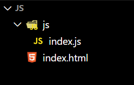
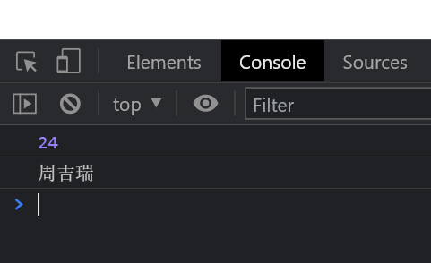

# 【JS语法与变量】

> 原创内容，转载请注明出处！

# 一、初识JavaScript

## 1.1 前端三层

|        | 语言       | 功能                               |
| ------ | ---------- | ---------------------------------- |
| 结构层 | HTML       | 搭建结构、放置部件、描述语义       |
| 样式层 | CSS        | 美化网页、实现布局                 |
| 行为层 | JavaScript | 实现交互效果、数据收发、表单验证等 |

## 1.2 JavaScript 历史

创始人：布兰登·艾奇

- 1995 年艾奇在美国网景公司发明了 LiveScript
- 网景公司与 Sun 公司合作，为了宣传改名为 JavaScript

> JavaScript 与 Java 没有半毛钱关系！非要有关系，那就是都与 Sun 公司有关。

目前 JavaScript 已经完全垄断了浏览器端脚本！

如今 JavaScript 功能非常强大，未来还会越来越强大！

## 1.3 什么是前端语言和后端语言

前端语言：处理界面（HTML、CSS、JavaScript、……）

后端语言：处理数据（Java、PHP、Python、Go、……）

（浏览器）前端	<———— HTTP 协议 ————>	后端（服务器）

> 传统的 JS 是一门前端语言，只能运行在浏览器端，不能在服务器端处理数据，且不能独立于浏览器存在，不能脱离 HTML！

在 2009 年，诞生了 Node.js，这是一个 JavaScript 的服务端运行平台。

> Node.js 出现后，JavaScript 可以独立于浏览器运行，可以用来写服务器端（后端）！

所以，JavaScript 是一门可以 “上天入地” 的语言！

可以说，JavaScript 是一门真正意义上的 “全栈” 语言！

## 1.4 ECMAScript 是 JavaScript 的标准

1997 年，欧洲计算机制造商协会（ECMA）颁布了 JavaScript 的标准，命名为 ECMAScript。

> ECMAScript 简称 ES，JavaScript 简称 JS。

- JavaScript 实现了 ECMAScript

- ECMAScript 规范了 JavaScript

## 1.5 JavaScript 体系

- 语言核心
  - ES5（现阶段学习目标）
  - ES6（后期学习目标）、ES7、ES8、ES9、……
- DOM（操纵 HTML）
- BOM（操作 浏览器）

## 1.6 JavaScript 的语言风格和特性

- 类 C 语言风格，容易上手
- 弱类型（动态类型），简单易学
- 丰富的功能，无敌的生态，强大的性能

> 弱类型既是 JS 的优点，也是 JS 的缺点！在 JS 诞生之初，JS 只是一个控制浏览器网页的小型脚本语言，所以最初设计 JS 时去掉了类型系统，因为类型系统需要涉及到复杂的语法校验和编译过程，得不偿失。后来随着前端的不断发展，JS 所开发的项目越来越复杂，JS 弱类型的特性反而变成了 JS 的劣势！所以最近几年微软出品的 TypeScript 越来越火，TS 就是一个 JS 的超集，在 JS 的基础上提供了类型系统的一门全新的语言，并且 TS 代码可以编译为纯 JS 代码运行到 JS 能运行的任何地方！所以 TypeScript 未来一定是前端开发的趋势……，我们在掌握好 JS 后，最好去学习一下 TS！

# 二、JS的书写位置

- 在 `<body>` 中的 `<script>` 标签中书写 JS 代码
- 将 JS 代码单独保存为 `.js` 文件，然后在 HTML 文件中使用 `<script src=""></script>` 引入

> JavaScript 不能脱离 HTML 网页运行！
>
> （当然，今后学习 Node.js 后，JavaScript 可以运行在独立的平台中）

## 2.1 在 \<body> 中书写 JS 代码

在 `<body>` 中的 `<script>` 标签中书写 JS 代码

- index.html

```html
<!DOCTYPE html>
<html lang="en">

<head>
    <meta charset="UTF-8">
    <meta http-equiv="X-UA-Compatible" content="IE=edge">
    <meta name="viewport" content="width=device-width, initial-scale=1.0">
    <title>Document</title>
</head>

<body>
    <!-- 在 HTML5 之前，必须要加上 type 属性，并且里面的内容一定要正确！-->
    <!-- 
    <script type="text/javascript">
    </script> 
    -->

    <!-- 目前都是使用 HTML5，所以不用写 type 属性，默认就是 JS -->
    <!-- 推荐把 <script> 写到 body 的末尾（避免 JS 发生阻塞时页面受到牵连）-->
    <script>
        // 弹窗输出一句话
        // 每一句 JS 代码以分号结尾！
        alert('你好，JavaScript！');
    </script>
</body>

</html>
```

- 效果图


## 2.2 将 JS 代码单独保存为 \.js 文件

将 JS 代码单独保存为 \.js 文件，然后在 HTML 文件中使用 `<script src=""></script>` 引入

- 文件结构



- index.html

```html
<!DOCTYPE html>
<html lang="en">

<head>
    <meta charset="UTF-8">
    <meta http-equiv="X-UA-Compatible" content="IE=edge">
    <meta name="viewport" content="width=device-width, initial-scale=1.0">
    <title>Document</title>
    <!--
    <script src="./js/index.js"></script>
	-->
</head>

<body>
    <!-- 也可以放在 body 末尾（推荐）-->
    <script src="./js/index.js"></script>
</body>

</html>
```

- index.js

```javascript
alert('你好，JavaScript！');
```

- 效果图


> 以上两种 JS 的书写方法，对于复杂的 js 代码，强烈推荐第二种！

# 三、认识输出语句

- `alert()`：弹出消息框
- `console.log()`：控制台输出

## 3.1 alert()

```javascript
alert('周吉瑞');
```

> alert：消息、警报

- `alert` 是 JS 的内置函数
- 调用函数需要使用圆括号 `()`
- `周吉瑞` 是函数的参数，此处的参数是一个字符串（JS 的字符串用 `''` 或 `""` 包裹）
- JS 语句末尾需要以 `;` 结尾

> 注意事项：
>
> - JS 字符串支持 `''` 和 `""`，但是目前实际开发中 `''` 用的更多，原因在于输入时可以不用按下 shift 键！
> - JS 语法规定是需要在句末加上 `;` 表示结束的！但是即便你不加 `;`，JS 解析引擎也会帮你自动加上，但还是推荐手动加上 `;`，因为极少数情况下会出现意外！
>
> - JS 语法中的任何符号都应该是英文状态下的符号！

【效果】


【功能】

在浏览器（JavaScript 引擎 例如：Chrome V8）解析到 JS 文件中的 `alert()` 语句时，便会中断 JS 脚本的执行，同时弹出消息框，直到用户单击确定后，才继续执行后续的 JS 脚本。

## 3.2 console.log()

```javascript
console.log('周吉瑞');
```

> console：控制台
>
> log：记录、日志

- `console` 是 JS 的内置对象
- 通过对象 “打点” 可以调用其内部的 `log` 方法（所谓 “方法” 就是对象能够调用的函数）

【效果】


> F12 打开浏览器调试面板，点击 Console 控制台菜单。

【功能】

在浏览器（JavaScript 引擎 例如：Chrome V8）解析到 JS 文件中的 `console.log()` 语句时，会直接在浏览器控制台输出语句，并自动继续执行后续的 JS 脚本。

# 四、学会处理报错

> JS 一但发生语句错误，那么后续的语句也就不执行了！
>
> 浏览器控制台会检测错误的类型及行号（行号不一定正确，但可以确定范围）
>
> 现代 IDE 一般具备智能自动检查功能，目前最智能的 JavaScript IDE：WebStorm（收费），VSCode（需要插件配合，免费轻量）

- `Uncaught SyntaxError: Invalid or unexpected token`

未捕获的语法错误：不合法或错误的符号。

（中文符号错误、……）

- `Uncaught ReferenceError: jerry is not defined`

未捕获的引用错误：jerry 没有被定义。

（字符串没有加引号、名称拼写错误、……）

**【学会 debugger】**

当我们需要调试 JavaScript 代码时，我们可以在代码的任何行上写上 `debugger;`，那么当执行到此处时，代码执行就会自动停止（相当于 “打断点”），当然我们也可以不加 `debugger;`，在调试时用鼠标点击的方式来 “打断点”，反正怎么方便怎么来！

> 注意：`debugger;` 被成功执行的前提是工具开启了调试功能，否则该语句不起任何作用！（Chrome Source 窗口可以开启调试；VSCode 也支持本地调试……）

# 五、变量

变量：计算机语言中能储存计算结果或能表示值的抽象概念。

> 变量不是数值本身，它们仅仅是一个用于存储数值的容器！

## 5.1 定义变量

要想使用变量，第一步就是声明它，并给它赋值。

```javascript
var a = 24;
var b = '周吉瑞';
```

- `var` 定义变量的关键字
- `a` 变量名
- `=` 赋值符号
- `24` 变量值

## 5.2 使用变量

当变量被赋值后，就可以使用它了。

```javascript
console.log(a);
console.log(b);
```

> 注意：使用变量时，变量名不能用引号包裹，否则会被识别为字符串！



## 5.3 改变变量的值

变量的值可以通过再次赋值被改变，改变变量的值时不需要再书写 `var` 关键字。

```javascript
var a = 54;
a = 24;
console.log(a);
```


## 5.4 变量的合法命名

- 只能由 `字母`、`数字`、`_`、`$` 组成，但不能以数字开头（建议普通代码一律以字母开头）
- 不能是 关键字 或 保留字
- 变量名大小写敏感，a 和 A 是两个不同的变量

> 函数、类名、对象的属性等也都要遵守这个标识符的命名规则！

## 5.5 推荐的变量命名风格

- 小驼峰命名法：`mathTestScore`（吐血推荐）
- C 风格变量命名法：`math_test_score`

> - 驼峰命名法：Java、JavaScript
>
> - 下划线命名法：C、C++、Python、Golang、SQL

## 5.6 变量的默认值

- 一个变量只定义，但没有赋初值，默认值是 `undefined`（未定义）
- 一个变量只有被 `var` 定义，并赋初值之后，才算正式初始化完成

```javascript
var a;	// 只定义但没有赋初值
console.log(a);	// undefined
a = 24;
console.log(a);	// 24
```

## 5.7 变量的常见错误

- 不用 `var` 定义，而直接将值赋予它，虽然不引发报错，但会产生严重的作用域问题。

> 请一律加上 `var` ！

```javascript
a = 24; // 未使用 var 定义的变量默认为全局变量！成为 window 对象的属性。
console.log(a);	// 24
console.log(window.a);	// 24
console.log(window.a === a);	// true
```

> 关于作用域的问题，后面会介绍。

- 尝试使用一个既没有被 `var` 定义过，也没有赋过值的变量，就会产生引用错误。

```javascript
console.log(c);
// index.js:1 Uncaught ReferenceError: c is not defined at index.js:1
```

> **使用 strict 严格模式**
>
> JavaScript 在设计之初，为了方便初学者学习，并不强制要求用 `var` 申明变量。这个设计错误带来了严重的后果：如果一个变量没有通过 `var` 申明就被使用，那么该变量就自动被申明为全局变量：
>
> ```javascript
> i = 10; // i 现在是全局变量
> ```
>
> 在同一个 HTML 页面的不同的 JavaScript 文件中，如果都不用 `var` 申明，恰好都使用了变量 `i`，将造成变量 `i` 互相影响，产生难以调试的错误结果。
>
> 使用 `var` 申明的变量则不是全局变量，它的范围被限制在该变量被申明的 JS 文件或函数体内（函数的概念将稍后讲解），同名变量在不同的函数体内互不冲突。
>
> 为了修补 JavaScript 这一严重设计缺陷，ECMA 在后续规范中推出了 strict 模式，在 strict 模式下运行的 JavaScript 代码，强制通过 `var` 申明变量，未使用 `var` 申明变量就使用的，将导致运行错误。
>
> 启用 strict 模式的方法是在 JavaScript 代码的第一行写上：
>
> ```javascript
> "use strict";
> ```
>
> 这是一个字符串，不支持 strict 模式的浏览器会把它当做一个字符串语句执行，支持 strict 模式的浏览器将开启 strict 模式运行 JavaScript。
>
> ```javascript
> "use strict";
> abc = "Hello, world";
> console.log(abc);
> // 如果浏览器支持 strict 模式，
> // 下面的代码将报 ReferenceError 错误：Uncaught ReferenceError: abc is not defined
> ```
>
> 不用 `var` 申明的变量会被视为全局变量，为了避免这一缺陷，所有的 JavaScript 代码都推荐使用 strict 模式。
>
> 提示：`"use strict"` 语句可以放在 JS 代码的任意一行上，并且它只对它所在作用域下方的代码起作用。

## 5.8 等号表示赋值

```javascript
var a = 10;
a = a + 1;
console.log(a);	// 11
a = a - 1;
console.log(a);	// 10
```

## 5.9 同时声明多个变量

```javascript
var a = 0, b = 1, c = 2;	// 建议每行只声明一个变量
```

# 六、变量声明提升

- 变量声明的提升：可以提前使用一个稍后才声明的变量，而不会引发异常
- 在执行所有代码前，JS 有预解析阶段，会预读所有变量的声明（不会提升赋值，只会提升定义）

```javascript
// 先使用变量（不会报错）
console.log(a);	// undefined
// 后定义变量
var a = 10;
console.log(a);	// 10
```

实际的情况相当于：

```javascript
// 变量声明提升的只是定义，不提升赋值！！！
var a;
console.log(a); // undefined
a = 10;
console.log(a); // 10
```

【注意事项】

- 变量声明提升是 JS 的独有特性！
- 在实际开发中，不要刻意使用变量提升的特性，一定要先定义再使用！
- 严格模式对变量提升没有约束作用，严格模式是不对变量提升进行报错的！

