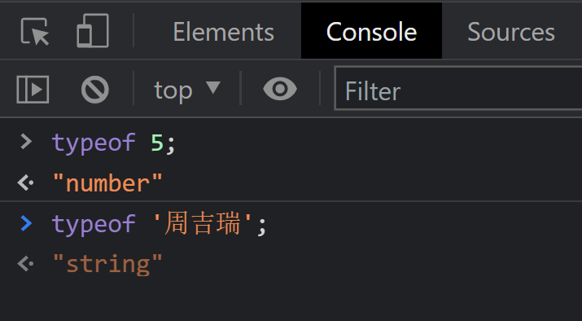
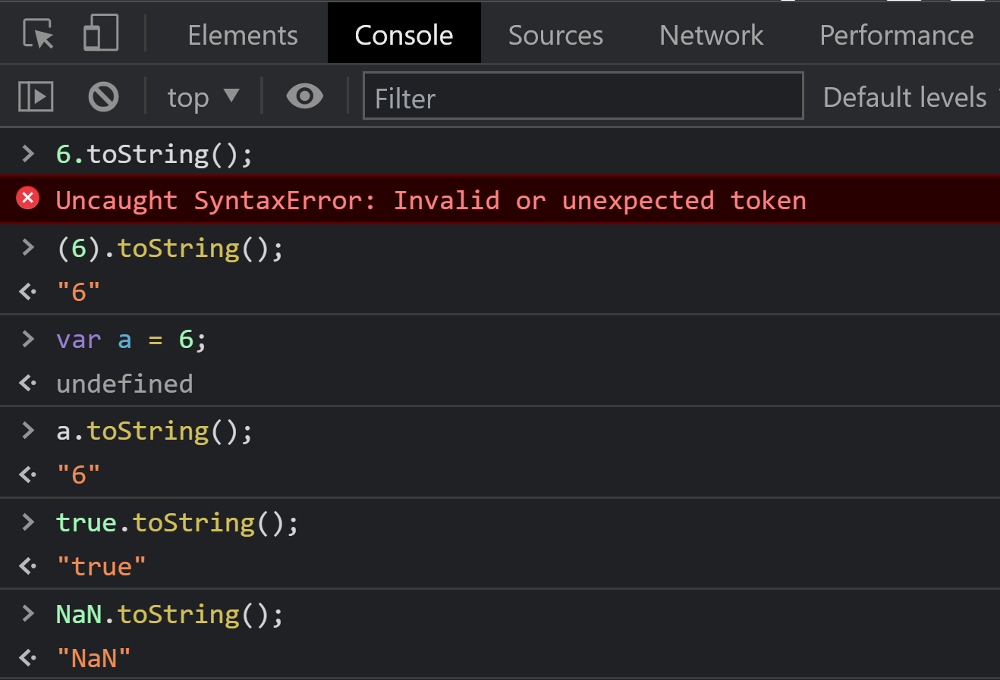
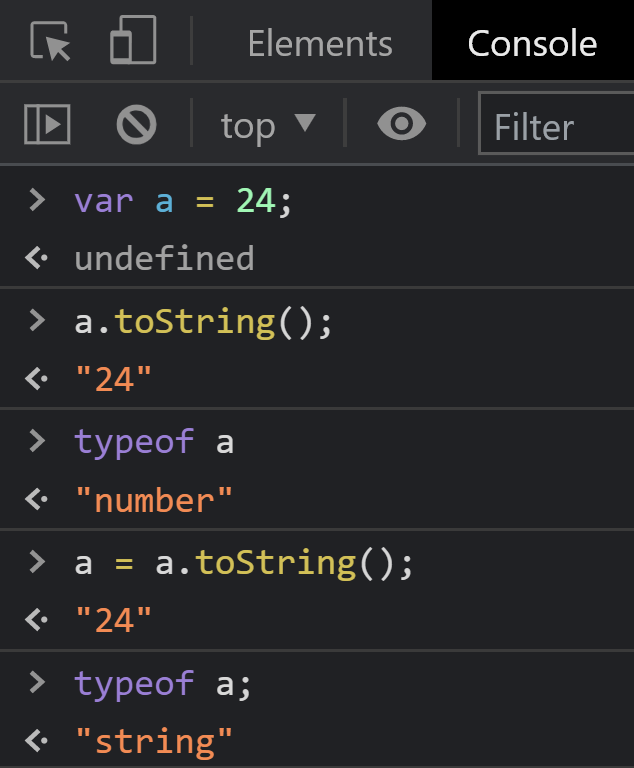

# 【JS基本数据类型】

> 原创内容，转载请注明出处！

# 一、数据类型简介和检测

## 1.1 JavaScript 中两大类数据类型

**（1）基本数据类型**

> JS 没有字符型，JS 的 String 是基本类型

- Number
- String
- Boolean
- Undefined
- Null

**（2）复杂数据类型**

- Object
- Array
- Function
- RegExp（正则表达式）
- Date
- Map
- Set
- Symbol
- ……

## 1.2 typeof 运算符

使用 `typeof` 运算符可以检测值或者变量的类型。

> typeof 是一个运算符，而不是内置函数，所以不用加 `()`，如果加了也不会报错，但是并不推荐。

```javascript
typeof 5;		// number
typeof '周吉瑞';	// string
```



> 利用浏览器控制台进行交互测试。

```javascript
console.log(typeof 5);
console.log(typeof "周吉瑞");
var a = "5";
console.log(typeof a);
```


> 从以上测试也可以看出，JS 是一个弱类型的语言，变量值是什么类型，那么变量就是什么类型，而不用显式地指出类型。

## 1.3 5种基本数据类型的 typeof 检测结果

| 类型名         | typeof 检测结果 | 值举例          |
| -------------- | --------------- | --------------- |
| 数字类型       | number          | `5`、`2.5`      |
| 字符串类型     | string          | `'慕课网'`      |
| 布尔类型       | boolean         | `true`、`false` |
| undefined 类型 | undefined       | `undefined`     |
| null 类型      | object          | `null`          |

# 二、Number（数字）类型

## 2.1 一切数都是数字类型

在 JS 中，所有数字不分大小、不分整浮、不分正负，都是数字类型。

```javascript
typeof 925; // number
typeof 0.5; // number
typeof -24; // number
```

## 2.2 小数中 0 可以省略

在表达小数的时候，整数个位的 `0` 可以省略。


## 2.3 科学计数法

较大数或较小数（绝对值较小）可以写成科学计数法。

```javascript
3e8;			// 300000000
typeof 3e8;		// number

3e-4;			// 0.0003
typeof 3e-4;	// number
```


## 2.4 不同进制的数字

**（1）二进制数值以 `0b` 开头**

```javascript
0b10;	// 2
0b1111;	// 15
```

**（2）八进制数值以 `0` 开头**

```javascript
017;	// 15
```

**（3）十六进制数值以 `0x` 开头**

```javascript
0xf;	// 15
```

## 2.5 一个特殊的数字型值 NaN

`NaN` 是 “not a number” 的意思，即 “不是一个数”，但它是一个数字类型的值。

```javascript
typeof NaN;	// number
```

- 0 除以 0 的结果是 NaN，事实上，在数学运算中，若结果不能得到数字，其结果往往都是 NaN
- NaN 有一个 “奇怪” 的性质：不自等。这个知识点将在后续课程中讲解

```javascript
0 / 0;	// NaN
5 - 3;	// 2
"我" - "你";	// NaN
"我" * "你";	// NaN
"我" / "你";	// NaN
"我" + "你";	// "我你"
NaN == NaN;  // false
```

> 再次强调：NaN 是一个值（特殊的值），不是类型。
>
> 唯一能判断 `NaN` 的方法是通过 `isNaN()` 函数：
>
> ```javascript
> isNaN(NaN); // true
> ```

# 三、String（字符串）类型

## 3.1 字符串的表示

字符串要用引号包裹，双引号或者单引号均可。

```javascript
typeof "周吉瑞";	// string
typeof '周吉瑞';	// string
```

数字 `10` 和字符串 `"10"` 在语义上是不同的，前者表示一个数量，后者是一个文本。

## 3.2 字符串的拼接

加号可以用来拼接多个字符串。

```javascript
"周" + "吉瑞";	// "周吉瑞"
"abc" + "d" + "ef";	// "abcdef"
```

## 3.3 字符串和变量的拼接

要将一个变量的值 “插入” 到字符串中，要满足变量左右两边至少有一边 + 字符串。

```javascript
var year = 2022;
var str = "北京冬奥会在" + year + "年召开";	// "北京冬奥会在2022年召开"

var a = 24;
var str1 = 54 + a;		// 78
var str2 = "54" + a;	// "5424"

1 + "10"; // "110"

2 + "";	// "2"
```

> 新版 ES 中增加了反引号 ( ` ) 表示法，可以更方便进行变量插值，后续课程将进行介绍。

## 3.4 空字符串

一些时候需要使用空字符串，直接书写闭合的引号对即可。

```javascript
var str = "";
```

空字符串可以用于将变量变为字符串！

```javascript
var a = 24;
console.log(typeof a);	// number
a = a + "";
console.log(a);	// "24"
console.log(typeof a);	// string
```

## 3.5 字符串的 length 属性

> 通过对 String 类型 “打点” 的方式，可以调用其内置属性。

字符串的 length 属性表示字符串的长度。

```javascript
"我喜欢JS".length;	// 5
"我喜欢JS，我也喜欢NODE".length;	// 14
"".length;	// 0
```

## 3.6 字符串的常用方法

> 通过对 String 类型 “打点” 的方式，可以调用其内置方法。

“方法” 就是能够打点调用的函数，字符串类型有丰富的内置方法。

| 方法            | 功能             |
| --------------- | ---------------- |
| `charAt()`      | 得到指定位置字符 |
| `substring()`   | 提取子串         |
| `substr()`      | 提取子串         |
| `slice()`       | 提取子串         |
| `toUpperCase()` | 将字符串变为大写 |
| `toLowerCase()` | 将字符串变为小写 |
| `indexOf()`     | 检索字符串       |

### 3.6.1 charAt()方法

`charAt()` 方法可以得到指定位置的字符。

字符串中的每个字符都按顺序编号，编号从 0 开始。

| `"`  | 我   | 喜   | 欢   | J    | S    | ,    | 我   | 也   | 喜   | 欢   | N    | O    | D    | E    | `"`  |
| ---- | ---- | ---- | ---- | ---- | ---- | ---- | ---- | ---- | ---- | ---- | ---- | ---- | ---- | ---- | ---- |
|      | 0    | 1    | 2    | 3    | 4    | 5    | 6    | 7    | 8    | 9    | 10   | 11   | 12   | 13   |      |

```javascript
"我喜欢JS，我也喜欢NODE".charAt(0);		// "我'
"我喜欢JS，我也喜欢NODE".charAt(5);		// "，"
"我喜欢JS，我也喜欢NODE".charAt(11);	// "O'
"我喜欢JS，我也喜欢NODE".charAt(99);	// ""
"我喜欢JS，我也喜欢NODE".charAt(-1);	// ""
```

> 超出范围的输出空字符 `""`。

### 3.6.2 substring()、substr() 和 slice() 方法

**（1）`substring(a, b)` 方法得到从 a 开始到 b 结束（不包括 b 处）的子串** `[a, b)`

> 编程语言的区间一般都是：左闭右开

```javascript
"我喜欢JS，我也喜欢NODE".substring(3, 5);		// "JS"
"我喜欢JS，我也喜欢NODE".substring(10, 14);		// "NODE"
"我喜欢JS，我也喜欢NODE".substring(10, 99);		// "NODE"
"我喜欢JS，我也喜欢NODE".substring(-1, 4);		// "我喜欢J"
```

> 超出范围的部分，取到端点字符。

- substring(a, b) 方法如果省略第二个参数，返回的子串会一直到字符串的结尾

```javascript
"我喜欢JS，我也喜欢NODE".substring(6);		// "我也喜欢NODE"
```

- substring(a, b) 中，a 可以大于 b，数字顺序将自动调整为小数在前

> 应该没有人会这样用

```javascript
"我喜欢JS，我也喜欢NODE".substring(3, 5);		// "JS"
"我喜欢JS，我也喜欢NODE".substring(5, 3);		// "JS"
```

**（2）`substr(a, b)` 中，将得到从 a 开始的长度为 b 的子串**

```javascript
"我喜欢JS，我也喜欢NODE".substr(3, 2);		// "JS"
```

- substr(a, b) 中，b 可以省略，表示到字符串结尾

```javascript
"我喜欢JS，我也喜欢NODE".substr(3);		// "JS，我也喜欢NODE"
```

- substr(a, b) 中，a 可以是负数，表示倒数位置

> 倒数第一位为 -1，而不是 -0

```javascript
"我喜欢JS，我也喜欢NODE".substr(-4, 2);		// "NO"
```

**（3）`slice(a, b)` 方法得到从 a 开始到 b 结束（不包括 b 处）的子串**

> slice：切片

```javascript
"我喜欢JS，我也喜欢NODE".slice(3, 5);		// "JS"
```

- slice(a, b) 的参数 a 可以是负数（与 substring(a, b) 的区别）

```javascript
"我喜欢JS，我也喜欢NODE".slice(-4, -1);		// "NOD"
// (-4, -1)：从 倒数第4位 到 倒数第1位，不包括 倒数第1位
```

- slice(a, b) 中，参数 a 必须小于参数 b，否则便会返回一个空字符串

```javascript
"我喜欢JS，我也喜欢NODE".slice(5, 2);		// ""
```

### 3.6.3 toUpperCase() 和 toLowerCase() 方法

- `toUpperCase()` 转为大写
- `toLowerCase()` 转为小写

```javascript
"I Love You".toUpperCase();		// "I LOVE YOU"
"IMooc".toLowerCase();			// "imooc"
```

> 注意：toUpperCase() 和 toLowerCase()，只是返回一个大小写格式，变量本身的值并没有改变。
>
> ```javascript
> var str = "I Love You";
> console.log(str.toUpperCase());		// "I LOVE YOU"
> console.log(str);					// "I Love You"
> str = str.toUpperCase();
> console.log(str);					// "I LOVE YOU"
> ```

### 3.6.4 indexOf() 方法

`indexOf()` 方法返回某个指定的字符串值在字符串中首次出现的位置

如果要检索的字符串没有出现，则返回 `-1`

```javascript
"abcdebb".indexOf("b");		// 1
"abcdebb".indexOf("deb");	// 3
"abcdebb".indexOf("m");		// -1
```

# 四、Boolean（布尔）类型

在计算机领域，几乎所有的 “真” 和 “假” 都归为布尔类型值。

布尔类型值只有两个：`true` 和 `false`，分别表示 `真` 和 `假`。

```javascript
typeof true;	// boolean
typeof false;	// boolean
```

> 布尔类型在 关系运算 和 逻辑运算 中广泛运用。

```javascript
3 < 5;	 // true
5 > 3; 	 // true
5 >= 100; // false
```

# 五、Undefined 类型

一个没有赋值的变量的默认值是 `undefined`，而 undefined 的类型也是 undefined。

即：undefined 既是类型，又是值（且这种类型只有它自己一个值）。

```javascript
typeof undefined;	// undefined
```

> 实际开发中，一般不会给某个变量赋值为 undefined，但是我们会检查一个变量的值是否为 undefined。

> 在变量声明提升的时候，会出现 undefined，要注意！

# 六、Null 类型

`null` 表示 “空”，它是 “空对象”。

当我们需要将对象销毁、数组销毁或者删除事件监听时，通常将它们设置为 null。

```javascript
box.onclick = null;
// 删除点击事件
```

用 typeof 检测 null 结果为 `object`。

```javascript
typeof null;	// object
```

> 狭义上，null 可以理解为 “空对象”，这样可以合理的解释为什么 null 的类型为 object。
>
> 但是准确的来说，null 不是一个 “对象”，它是一个独立的 “基本数据类型”。

# 七、数据类型的转换

## 7.1 其他值——>数字

### 7.1.1 使用 Number() 函数

`Number()` 函数是 JS 内置函数。

> 由于 Number() 属于内置构造函数，所以 Number() 的首字母 N 要大写。

**（1）字符串——>数字**

```javascript
Number('123');			// 123
Number('123.45');		// 123.45
Number('-123');			// -123
Number('-123.45');		// -123.45
Number('123年');	    	// NaN 
Number('2e3');			// 2000
Number('');				// 0

Number('1+1');			// NaN
Number(1+1);			// 2
```

**（2）布尔值——>数字**

```javascript
Number(true);			// 1
Number(false);			// 0
```

**（3）undefined和null——>数字**

```javascript
Number(undefined);		// NaN
Number(null);			// 0
```

### 7.1.2 使用 parseInt() 函数

`parseInt()` 函数的功能是将 字符串 或 浮点数 转为 整数。

- 自动截掉第一个非数字字符之后的所有字符

```javascript
parseInt('3.14');		  // 3
parseInt('-3.14');		  // -3
parseInt('3周吉瑞.14');	// 3
parseInt(3.14);		  	  // 3
parseInt(-3.14);		  // -3
```

- 所有文字都将被截掉

```javascript
parseInt('3.14是圆周率');	// 3
```

- 如果字符串以非数字开头，则转为 NaN

```javascript
parseInt('圆周率是3.14');	// NaN
parseInt('一二三');		 // NaN
```

- 不存在“四舍五入”

```javascript
parseInt('3.99');		  // 3
```

- true、false、undefined、null 转为 NaN

> 之所以会出现这种情况的原因是，parseInt() 的原理是，先将参数转换为字符串，再将字符串转为整数。
>
> 所以，true 等会先被转为 `'true'`。

```javascript
parseInt(true);			// NaN
parseInt(false);		// NaN	
parseInt(undefined);	// NaN
parseInt(null);			// NaN
```

> parseInt() 函数的特性会用于处理数字的净化。
>
> ```javascript
> parseInt('24px');	// 24
> // 去除了单位，保留数值！
> ```

### 7.1.3 使用 parseFloat() 函数

`parseFloat()` 函数的功能是将字符串转为浮点数。

> 绝大部分原理与 parseInt() 类似。

```javascript
parseFloat('3.14');		// 3.14
parseFloat(3.14);		// 3.14

parseFloat('3.14是圆周率');		// 3.14
parseFloat('3.14.15');		   // 3.14

parseFloat('3.99');			// 3.99
parseFloat('-3.99');		// -3.99
```

## 7.2 其他值——>字符串

### 7.2.1 使用 String() 函数

`String()` 函数是 JS 内置函数。

> 由于 String() 属于内置构造函数，所以 String() 的首字母 S 要大写。

**（1）数字——>字符串**

变为 “长得相同” 的字符串。

科学计数法和非 10 进制数字会转为 10 进制的标准值。

```javascript
String(123);		// '123'
String(123.4);		// '123.4'
String(2e3);		// '2000'
Stiing(NaN);		// 'NaN'
String(Infinity);	// 'Infinity'
String(0xf);		// '15'
```

**（2）布尔值——>字符串**

变为 “长得相同” 的字符串。

```javascript
String(true);		// 'true'
String(false);		// 'false'
```

**（3）undefined 和 null——>字符串**

变为 “长得相同” 的字符串。

```javascript
String(undefined);	// 'undefined'
String(null);		// 'null'
```

### 7.2.2 使用 toString() 方法

`toString()` 是几乎所有值都有的方法，功能是将值转为字符串。

> 纯数字不能直接 “打点” 调用 toString() 方法，要把纯数字用 `()` 包裹起来，此时 JS 会提升该数字为一个对象（包装为对象）。



> toString() 方法依旧是返回一个字符串，并不改变变量原有的类型！



## 7.3 其他值——>布尔值

`Boolean()` 函数是 JS 内置函数。

> 由于 Boolean() 属于内置构造函数，所以 Boolean() 的首字母 B 要大写。

**（1）数字——>布尔值**

0 和 NaN 转为 `false`，其他数字都转为 `true`。

```javascript
Boolean(123);			// true
Boolean(0);				// false
Boolean(NaN);			// false
Boolean(Infinity);		// true
Boolean(-Infinity);		// true
```

> Infinity 属性用于存放表示正无穷大的数值。

**（2）字符串——>布尔值**

空字符串变为 `false`，其他都转为 `true`。

```javascript
Boolean('');				// false
Boolean('abc');				// true
Boolean('false');			// true
```

**（3）undefined和null——>布尔值**

转为 false。

```javascript
Boolean(undefined);				// false
Boolean(null);					// false
```

# 八、加法器案例

- 使用 `prompt()` 函数弹出浏览器输入框，让用户输入两个数字

- 由于 prompt() 函数输入的任何值都将默认为字符串，所以我们要将其先转为数字类型
- 对数字进行加法运算
- 最后用 `alert()` 显示结果

```javascript
// 输入两个数字
var a = Number(prompt('请输入第一个数字：'));
var b = Number(prompt('请输入第二个数字：'));
// 计算两个数字的和
var sum = a + b;
// 弹出结果
alert(sum);
```

# 九、复杂数据类型简介

除基本类型值外，JS 的世界中还有复杂数据类型。

举例：

```javascript
[1, 2, 3]

{ a: 1, b: 2 }

function() {
}
```

复杂数据类型都是 “引用类型”（type: object），引用类型的特性将在数组一课中介绍。
