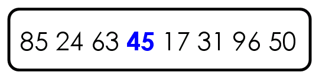
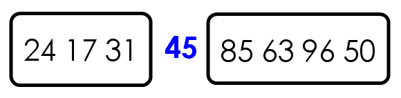
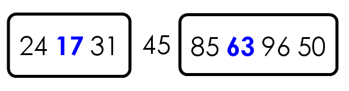
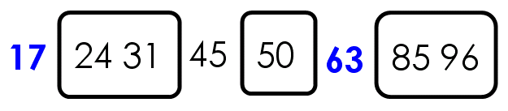
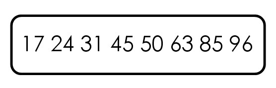

# 【JS数组】

> 原创内容，转载请注明出处！

# 一、什么是数组

数组（Array），顾名思义：用来存储一组相关值的类型。

数组可以方便地对一组值进行求和、计算平均值、逐项遍历等操作。

```javascript
var scoreArr = [87, 89, 93, 71, 100, 68, 94, 88];
```

> 数组名习惯以 Arr 结尾。

# 二、数组的定义

## 2.1 方括号定义法

```javascript
var arr = ['A', 'B', 'C', 'D'];
```

## 2.2 new 定义法

```javascript
var arr = new Array('A', 'B', 'C', 'D');
```

```javascript
var arr = new Array(4);
// 定义一个长度为 4 的数组，但是这 4 项都是 undefined
```

> 两种定义方法根据实际需求选择即可，两者的底层都是同样的实现逻辑。
>
> 推荐：方括号定义法！
>
> - 如果是定义时就要指定数组的值，那么建议使用：`var arr = ['A', 'B', 'C', 'D'];`
> - 如果是定义时还不指定数组的值，那么建议使用：`var arr = [];`

# 三、访问数组项

> 注意：JS 中数组的元素可以是不同的数据类型！

数组每一项都有下标，下标从 0 开始！

可以使用 `数组名[下标]` 的形式，访问数组的任一项。

# 四、下标越界

JS 规定，访问数组中不存在的项会返回 `undefined`，不会报错！

# 五、数组的长度

数组的 `length` 属性表示它的长度。

> 数组是引用类型，有自己的属性和方法。

```javascript
var arr = ['A', 'B', 'C', 'D'];
console.log(arr.length);	// 4
```

> 数组最后一项的下标是数组的长度减 1。

# 六、更改数组项

1. 访问数组项
2. 更改数组值

如果更改的数组项超过了 `length-1`，则会创造该项。

> JS 数组是可以动态扩容的！

```javascript
var arr = [1, 2, 3, 4];
arr[6] = 0;
console.log(arr);	// [1, 2, 3, 4, undefined, undefined, 0]
```

# 七、数组的遍历

数组最大的优点就是方便遍历。

```javascript
var arr = [1, 2, 3, 4];
for (var i = 0; i < arr.length; i++) {
    console.log(arr[i]);
}

var a = ['A', 'B', 'C'];
for (var v of a) {
    console.log(v); 	// 'A', 'B', 'C'
}
```

## 7.1 forEach() 方法

Array.forEach 方法为数组的每个元素都运行一个函数。

语法：

```javascript
arr.forEach(function(item, index, array) {
  // ...
});
```

案例：

```javascript
['Bilbo', 'Gandalf', 'Nazgul'].forEach(function (item, index, array) {
  console.log(`${item} 的索引值为：${index}，在数组：${array} 中`);
});

或者：

var arr = ['Bilbo', 'Gandalf', 'Nazgul'];
arr.forEach(function (item, index, array) {
  console.log(`${item} 的索引值为：${index}，在数组：${array} 中`);
});
// Bilbo 的索引值为：0，在数组：Bilbo,Gandalf,Nazgul 中
// Gandalf 的索引值为：1，在数组：Bilbo,Gandalf,Nazgul 中
// Nazgul 的索引值为：2，在数组：Bilbo,Gandalf,Nazgul 中
```

该函数的结果（如果它有返回）会被抛弃和忽略。

## 7.2 map() 方法

Array.map 方法是最有用和经常使用的方法之一。

它对数组的每个元素都调用函数，并返回结果数组。

语法：

```javascript
var result = arr.map(function(item, index, array) {
  // ...
})
```

例如，在这里我们将每个元素转换为它的字符串长度：

```javascript
var lengths = ["Bilbo", "Gandalf", "Nazgul"].map(function(item, index, array) {
    return item.length;
});
console.log(lengths); 
// [5, 7, 6]

// 可以省略不需要的形参：
var arr = ["Bilbo", "Gandalf", "Nazgul"];
var lengths = arr.map(function(item) {
    return item.length;
});
console.log(lengths); 
// [5, 7, 6]
```

# 八、数组类型的检测

数组用 `typeof` 检测结果是 `object`。

`Array.isArray()` 方法可以用来检测数组，返回一个布尔值。

> isArray() 不兼容 IE678，所以后面课程中，还将介绍使用 “鸭式辨型” 检测方法。

```javascript
Array.isArray([1, 2, 3]);		// true
Array.isArray([]);				// true
```

# 九、数组的常用方法

## 9.1 数组的头尾操作

| 方法        | 功能           |
| ----------- | -------------- |
| `push()`    | 在尾部插入新项 |
| `pop()`     | 在尾部删除     |
| `unshift()` | 在头部插入新项 |
| `shift()`   | 在头部删除     |

### 9.1.1 push() 方法

`push()` 方法用来在数组末尾推入新项，参数就是要推入的项。

如果要推入多项，可以用逗号隔开。

调用 `push()` 方法后，数组会立即改变，不需要赋值。

```javascript
var arr = [22, 33, 44, 55];
arr.push(66);
arr.push(77, 88, 99);
console.log(arr);
// [22, 33, 44, 55, 66, 77, 88, 99]
```

### 9.1.2 pop() 方法

与 push() 方法相反，`pop()` 方法用来删除数组中的最后一项。

`()` 里没有参数，默认弹出最后一项。

`pop()` 默认返回最后一项的值。

```javascript
var arr = [22, 33, 44, 55];
var item =  arr.pop();
console.log(arr);	// [22, 33, 44]
console.log(item);	// 55
```

### 9.1.3 unshift() 方法

`unshift()` 方法用来在数组头部插入新项，参数就是要插入的项。

如果要插入多项，可以用逗号隔开。

调用 `unshift()` 方法后，数组会立即改变，不需要赋值。

### 9.1.4 shift() 方法

与 unshift() 方法相反，`shift()` 方法用来删除数组中的开头一项。

`()` 里没有参数，默认弹出开头一项。

`shift()` 默认返回开头一项的值。

## 9.2 splice() 方法

`splice()` 方法用于替换数组中的指定项。

> 由于 splice() 可以实现很多功能，所以也称为 JS 的 “多功能方法”。

- 替换项

```javascript
var arr = ['A', 'B', 'C', 'D', 'E', 'F', 'G'];
// 从下标为 3 的项开始，连续替换 2 项。即将 'D', 'E' 替换为 'X', 'Y', 'Z'
arr.splice(3, 2, 'X', 'Y', 'Z');
console.log(arr);
// ['A', 'B', 'C', 'X', 'Y', 'Z', 'F', 'G']
```

- 插入项

```javascript
var arr = ['A', 'B', 'C', 'D'];
// 从下标为 2 的项开始，连续替换 0 项，即：在 [2] 处插入。
arr.splice(2, 0, 'X', 'Y', 'Z');
console.log(arr);
// ['A', 'B', 'X', 'Y', 'Z', 'C', 'D']
```

- 删除项

```javascript
var arr = ['A', 'B', 'C', 'D', 'E', 'F', 'G'];
// 从下标为 2 的项开始，连续替换 4 项（替换为空，即：删除）。
arr.splice(2, 4);
console.log(arr);
// ['A', 'B', 'G']
```

`splice()` 方法会以数组形式返回被替换/删除的项。

```javascript
var arr = ['A', 'B', 'C', 'D', 'E', 'F', 'G'];
// 从下标为 3 的项开始，连续替换 2 项。
var item = arr.splice(3, 2, 'X', 'Y', 'Z');
console.log(arr);
// ['A', 'B', 'C', 'X', 'Y', 'Z', 'F', 'G']
console.log(item);
// ['D', 'E']

var arr = ['A', 'B', 'C', 'D', 'E', 'F', 'G'];
// 从下标为 2 的项开始，连续替换 4 项（替换为空，即：删除）。
var item = arr.splice(2, 4);
console.log(arr);
// ['A', 'B', 'G']
console.log(item);
// ['C', 'D', 'E', 'F']
```

## 9.3 slice() 方法

`slice()` 方法用于得到子数组，类似于字符串中的 slice() 方法。

`slice(a, b)` 截取的子数组从下标为 a 的项开始，到下标为 b（但不包括下标为 b 的项）结束。

`slice(a, b)` 方法不会更改原有的数组。

`slice()` 如果不提供第二个参数，则表示从指定项开始，提取后续所有项作为子数组。

`slice()` 方法的参数允许为负数，表示数组的倒数第几项（记住不包括最后一项）。

```javascript
var arr = ['A', 'B', 'C', 'D', 'E', 'F'];
var childArr1 = arr.slice(2, 5);
var childArr2 = arr.slice(2);
var childArr3 = arr.slice(2, -1);
console.log(arr);			// ['A', 'B', 'C', 'D', 'E', 'F']
console.log(childArr1);		// ['C', 'D', 'E']
console.log(childArr2);		// ['C', 'D', 'E', 'F']
console.log(childArr3);		// ['C', 'D', 'E']
```

## 9.4 join() 和 split() 方法

数组的 `join()` 方法可以使 数组 转为 字符串。

字符串的 `split()` 方法可以使 字符串 转为 数组。

- `join()` 的参数表示以什么字符作为连接符，如果留空则默认以逗号分隔，如同调用 `toString()` 方法。
- `split()` 的参数表示以什么字符拆分字符串，一般不能留空。

```javascript
[22, 33, 44, 55].join();		// "22,33,44,55"
[22, 33, 44, 55].toString();	// "22,33,44,55"
[22, 33, 44, 55].join(',');		// "22,33,44,55"
[22, 33, 44, 55].join('-');		// "22-33-44-55"
[22, 33, 44, 55].join('~');		// "22~33~44~55"
```

```javascript
'abcdefg'.split();				// ["abcdefg"]
'abcdefg'.split('');			// ["a", "b", "c", "d", "e", "f", "g"]
'a-b-c-d-e-f-g'.split('');		// ["a", "-", "b", "-", "c", "-", "d", "-", "e", "-", "f", "-", "g"]
'a-b-c-d-e-f-g'.split('-');		// ["a", "b", "c", "d", "e", "f", "g"]
```

## 9.5 字符串和数组更多相关性

字符串也可以使用 `[下标]` 的形式访问某个字符，等价于 `charAt()` 方法。

> 在对字符串中的字符进行遍历时不用转为数组，直接利用 [下标] 即可！
>

```javascript
'我爱前端'[0];			// "我"
'我爱前端'[1];			// "爱"
'我爱前端'.charAt(0);	// "我"
```

```javascript
var str = '我爱前端';
for (var i = 0; i < str.length; i++) {
    console.log(str[i]);
}
```

## 9.6 concat() 方法

`concat()` 方法可以合并连接多个数组（以返回值的形式）。

`concat()` 方法不会改变原数组。

```javascript
var arr1 = [1, 2, 3, 4];
var arr2 = [5, 6, 7, 8];
var arr3 = [9, 10, 11];
var arr = arr1.concat(arr2, arr3);
console.log(arr);
// [1, 2, 3, 4, 5, 6, 7, 8, 9, 10, 11]
```

## 9.7 reverse() 方法

`reverse()` 方法用来将一个数组中的全部项顺序置反。

```javascript
var arr = ['A', 'B', 'C', 'D'];
arr.reverse();
console.log(arr);	// ["D", "C", "B", "A"]
```

【小案例】

字符串 `'ABCDEFG'` 逆序。

```javascript
'ABCDEFG'.split('').reverse().join('');
// "GFEDCBA"
```

## 9.8 indexOf() 和 includes() 方法

`indexOf()` 方法的功能是搜索数组中的元素，并返回它所在的位置，如果元素不存在，则返回 -1。

`includes()` 方法的功能是判断一个数组是否包含一个指定的值，返回一个布尔值。

```javascript
['A', 'B', 'C', 'D'].indexOf('C');	// 2
['A', 'B', 'C', 'D'].indexOf('D');	// 3
['A', 'B', 'C', 'D'].indexOf('X');	// -1
['A', 'B', 'B', 'B'].indexOf('B');	// 1
```

```javascript
['A', 'B', 'C', 'D'].includes('D');	// true
['A', 'B', 'C', 'D'].includes('X');	// false
```

注意：`indexOf()` 及 `includes()` 方法的判断标准为 `===` 全相等！

```javascript
[11, 22, 33].includes('22');	// false
[11, 22, 33].indexOf('22');		// -1
```

## 9.9 sort() 方法

`sort()` 方法用原地算法（直接改变原数组）对数组的元素进行排序，并返回数组。

默认排序顺序是将元素转换为字符串，然后根据字典序进行排序（数字 ——> 大写字母 ——> 小写字母，字符串内逐个字符进行比较，相同时比较下一位）

```js
var arr = [3, 18, 10, 24];
console.log(arr.sort());	// [ 10, 18, 24, 3 ]

var arr = ['A', 'a', 'c', 'D', 1];
console.log(arr.sort());	// [ 1, 'A', 'D', 'a', 'c' ]

var arr = ['aa', 'a0', 'aA', 'A1', 'Aa', 'AA'];
console.log(arr.sort());	// [ 'A1', 'AA', 'Aa', 'a0', 'aA', 'aa' ]
```

`sort()` 方法可以接收一个函数作为参数，我们可以在这个函数中自定义我们的排序规则：

```js
arr.sort(function(a, b) {
    // 比较规则...
});
// 参数a：前一个用于比较的元素。
// 参数b：后一个用于比较的元素。
```
| `function(a, b)` 返回值 | 排序顺序               |
| :---------------------- | :--------------------- |
| > 0                     | `a` 在 `b` 后          |
| < 0                     | `a` 在 `b` 前          |
| === 0                   | 保持 `a` 和 `b` 的顺序 |

案例1：按数字大小进行排序（降序）：

```js
var arr = [3, 18, 10, 24];
arr.sort(function(a, b) {
   if (a > b) {
       return -1;
   } else if (a < b) {
       return 1;
   } else {
       return 0;
   }
});
console.log(arr);	// [ 24, 18, 10, 3 ]
```

案例2：按照学生分数进行排序（降序）：

```js
var students = [
    { name: 'Edward', score: 66 },
    { name: 'Sharpe', score: 84 },
    { name: 'And', score: 58 },
    { name: 'The', score: 92 },
    { name: 'Magnetic', score: 99 },
    { name: 'Zeros', score: 74 }
];
students.sort(function (a, b) {
    if (a.score > b.score) {
        return -1;
    } else if (a.score < b.score) {
        return 1;
    } else {
        return 0;
    }
});
console.log(students);
/*
[ 
{ name: 'Magnetic', score: 99 },
{ name: 'The', score: 92 },
{ name: 'Sharpe', score: 84 },
{ name: 'Zeros', score: 74 },
{ name: 'Edward', score: 66 },
{ name: 'And', score: 58 } 
]
*/
```

除了内置排序方法外，还有一些排序算法：`冒泡排序` 和 `快速排序` 将在后面介绍。

## 9.10 find/findIndex/findLastIndex() 方法

想象一下，我们有一个对象数组。我们如何找到具有特定条件的对象？

这时可以用 Array.find 方法。

语法如下：

```javascript
var result = arr.find(function(item, index, array) {
  // 如果返回 true，则返回 item 并停止迭代
  // 如果返回 falsy，则继续迭代，如果一直没有返回 true，那么结束时返回 undefined
});
```

依次对数组中的每个元素调用该函数：

- `item` 是元素。
- `index` 是它的索引。
- `array` 是数组本身。

如果它返回 `true`，则搜索停止，并返回 `item`。如果没有搜索到，则返回 `undefined`。

例如，我们有一个存储用户的数组，每个用户都有 `id` 和 `name` 字段。让我们找到 `id === 1` 的那个用户：

```javascript
var users = [
  {id: 1, name: "John"},
  {id: 2, name: "Pete"},
  {id: 3, name: "Mary"}
];

var user = users.find(function(item) {
    return item.id === 1;
});

console.log(user.name); // John
```

在现实生活中，对象数组是很常见的，所以 `find` 方法非常有用。

注意在这个例子中，我们传给了 `find` 一个单参数函数。这很典型，并且 `find` 方法的其他参数很少使用。

arr.findIndex 方法（与 `arr.find`）具有相同的语法，但它返回找到的元素的索引，而不是元素本身。如果没找到，则返回 `-1`。

arr.findLastIndex 方法类似于 `findIndex`，但从右向左搜索，类似于 `lastIndexOf`。

这是一个例子：

```javascript
var users = [
    { id: 1, name: 'John' },
    { id: 2, name: 'Pete' },
    { id: 3, name: 'Mary' },
    { id: 4, name: 'John' }
];

// 寻找第一个 John 的索引
console.log(
    users.findIndex(function (user) {
        return user.name === 'John';
    })
); // 0

// 寻找最后一个 John 的索引
console.log(
    users.findLastIndex(function (user) {
        return user.name === 'John';
    })
); // 3
```

## 9.11 filter() 方法

`find` 方法搜索的是使函数返回 `true` 的第一个（单个）元素。

如果需要匹配的有很多，我们可以使用 `Array.filter(fn)`。

语法与 `find` 大致相同，但是 `filter` 返回的是所有匹配元素组成的数组：

filter：过滤、过滤器

```javascript
var results = arr.filter(function(item, index, array) {
  // 如果返回 true，那么 item 被 push 到 results，迭代继续
  // 如果什么都没找到，则返回空数组
});
```

例如：

```javascript
var users = [
  {id: 1, name: 'John'},
  {id: 2, name: 'Pete'},
  {id: 3, name: 'Jerry'},
  {id: 4, name: 'Mary'}
];

// 返回前两个用户的数组
var someUsers = users.filter(function(item) {
    return item.id < 3;
});
console.log(someUsers); // [ { id: 1, name: 'John' }, { id: 2, name: 'Pete' } ]

// 返回用户名字含四个字母的数组
var fourNameUsers = users.filter(function(item) {
    return item.name.length <= 4;
});
console.log(fourNameUsers);	// [ { id: 1, name: 'John' }, { id: 2, name: 'Pete' }, { id: 4, name: 'Mary' } ]
```

## 9.12 有关数组在 ES6 中的增强

数组在 ES6 中新增了较多的新方法，将在 ES6 相关课程中介绍。

## 9.13 数组去重和随机样本

【数组去重】

题目：去掉数组中的重复项。

思路：准备一个空结果数组，遍历原数组，如果遍历到的项不在结果数组中，则推入结果数组。

```javascript
var arr = [1, 1, 1, 2, 2, 3, 3, 3, 2, 1];
var resultArr = [];
for (var i = 0; i < arr.length; i++) {
    if (!resultArr.includes(arr[i])) {
        resultArr.push(arr[i]);
    }
}
console.log(resultArr);
```

【随机样本】

题目：请随机从原数组中取 3 项。

思路：准备一个空结果数组，遍历原数组，随机选择一项，推入结果数组，并且将这项在原数组中删除。

```javascript
var arr = [3, 6, 10, 5, 8, 9];
var resultArr = [];
for (var i = 0; i < 3; i++) {
    var n = parseInt(Math.random() * arr.length);
    resultArr.push(arr[n]);
    arr.splice(n, 1);
}
console.log(resultArr);
```

## 9.14 冒泡排序

冒泡排序是一个著名的排序算法，也是最基础的交换排序。

冒泡排序的核心思想：一趟一趟地进行多次项的两两比较，每次都会将最大的元素排好位置，如同水中的气泡上浮一样。

> 时间复杂度：O(n²)


```javascript
var arr = [9, 5, 6, 8, 2, 7, 3, 4, 1];
var temp;
for (var i = 0; i < arr.length - 1; i++) {
    for (var j = i + 1; j < arr.length; j++) {
        if (arr[i] > arr[j]) {
            temp = arr[i];
            arr[i] = arr[j];
            arr[j] = temp;
        }
    }
}
console.log(arr);
```

## 9.15 快速排序（冒泡排序改进版）

快速排序（Quicksort）是使用得最广泛，速度也较快的排序算法。它是图灵奖得主 C. A. R. Hoare（1934--）于 1960 时提出来的。是二十世纪10大算法之一，非常重要！时间复杂度： `O(nlogn)`，稳定性：`不稳定`。


快速排序与冒泡排序同属交换排序，不过快速排序采用了 “分治法” 的思想大大提高了排序的时间性能。

"快速排序"的思想很简单，整个排序过程只需要三步：

1. 在数据集之中，选择一个元素作为 "基准"（pivot）

2. 所有小于 "基准" 的元素，都移到 "基准" 的左边；所有大于 "基准" 的元素，都移到 "基准" 的右边

3. 对 基准 左边和右边的两个子集，不断重复第一步和第二步，直到所有子集只剩下一个元素为止

举例来说，现在有一个数据集 `{85, 24, 63, 45, 17, 31, 96, 50}`，怎么对其排序呢？

第一步，选择中间的元素 45 作为 "基准"（基准值可以任意选择，但是选择中间的值比较容易理解）。



第二步，按照顺序，将每个元素与 "基准" 进行比较，形成两个子集，一个 "小于45"，另一个 "大于等于45"。



第三步，对两个子集不断重复第一步和第二步，直到所有子集只剩下一个元素为止。








下面用 Javascript 语言实现上面的算法。

首先，定义一个 quickSort 函数，它的参数是一个数组。

```javascript
 var quickSort = function(arr) {
 };
```

然后，检查数组的元素个数，如果小于等于 1，就返回。

```javascript
 var quickSort = function(arr) {
 	if (arr.length <= 1) {
    	return arr; 
    }
 };
```

接着，选择 "基准"（pivot），并将其与原数组分离，再定义两个空数组，用来存放一左一右的两个子集。

```javascript
var quickSort = function(arr) {
	if (arr.length <= 1) {
        return arr; 
    }
    // Math.floor 向下取整
 　　var pivotIndex = Math.floor(arr.length / 2) ;
	// splice() 方法通过删除或替换现有元素或者原地添加新的元素来修改数组,并以数组形式返回被修改的内容。此方法会改变原数组。
 　　var pivot = arr.splice(pivotIndex, 1)[0];
 　　var left = [];
 　　var right = [];
};
```

然后，开始遍历数组，小于 "基准" 的元素放入左边的子集，大于基准的元素放入右边的子集。

```javascript
 var quickSort = function(arr) {
 	if (arr.length <= 1) {
        return arr; 
    }
 　　var pivotIndex = Math.floor(arr.length / 2) ;
 　　var pivot = arr.splice(pivotIndex, 1)[0];
 　　var left = [];
 　　var right = [];
 　　for (var i = 0; i < arr.length; i++) {
       if (arr[i] < pivot) {
           left.push(arr[i]);
       } else {
           right.push(arr[i]);
       }
   }
 };
```

最后，使用递归不断重复这个过程，就可以得到排序后的数组。

```javascript
 var quickSort = function(arr) {
     if (arr.length <= 1) { 
         return arr; 
     }
 　　var pivotIndex = Math.floor(arr.length / 2);
 　　var pivot = arr.splice(pivotIndex, 1)[0];
 　　var left = [];
 　　var right = [];
 　　for (var i = 0; i < arr.length; i++) {
       if (arr[i] < pivot) {
           left.push(arr[i]);
       } else {
           right.push(arr[i]);
       }
   }
     // concat 拼接数组
     return quickSort(left).concat([pivot], quickSort(right));
 };
```

# 十、二维数组

二维数组：以数组作为数组元素的数组，即 “数组的数组”。

二维数组可以看做是 “矩阵”。

> matrix：矩阵

```javascript
var matrix = [
    [11, 33, 55],
    [22, 33, 44],
    [36, 49, 52],
    [56, 10, 23]
];

// 二维数组长度
console.log(matrix.length);		// 4
console.log(matrix[1].length);	// 3

// 遍历二维数组
for (var i = 0; i < matrix.length; i++) {
    for (var j = 0; j < matrix[i].length; j++) {
        console.log(matrix[i][j]);
    }
}
```

# 十一、基本类型值和引用类型值

|            | 当 var a = b 变量传值时                          | 当用 == 或 === 比较时                                        |
| ---------- | ------------------------------------------------ | ------------------------------------------------------------ |
| 基本类型值 | 内存中产生新的副本                               | 比较值是否相等（由于是赋值所以类型肯定相同，=== 无需考虑类型是否相等） |
| 引用类型值 | 内存中不产生新的副本，而是让新变量指向同一个对象 | 比较内存地址是否相等，即：比较是否是同一个对象（由于是赋值所以类型肯定相同，=== 无需考虑类型是否相等） |

```javascript
// 基本类型值
var a = 3;
var b = a;
a++;
console.log(a);		// 4
consloe.log(b);		// 3
```

```javascript
// 引用类型值
var arr1 = [1, 2, 3, 4];
var arr2 = arr1;
arr1.push(5);
console.log(arr1);	// [1, 2, 3, 4, 5]
console.log(arr2);	// [1, 2, 3, 4, 5]
```

- 基本类型：`number`、`boolean`、`string`、`undefined`、`null`
- 引用类型：`array`、`object`、`function`、`regexp`、……

【内存】


【相等 `==` 判断时的区别】

- 基本类型进行相等 `==` 判断时，会比较 “值” 是否相等
- 引用类型进行相等 `==` 判断时，会比较 “址” 是否相等，也就是说它会比较是否为内存中的同一个东西

```javascript
3 == 3;		// true
3 === 3;		// true
[1, 2, 3] == [1, 2, 3];	// false
[1, 2, 3] === [1, 2, 3];	// false
[] == [];	// false
[] === [];	// false

var arr = [1, 2, 3];
arr == arr;		// true
var arr2 = arr;
arr == arr2;	// true，这里比较的是 arr 与 arr2 中保存的地址是否相等
arr === arr2;	// true，由于类型相同，所以这里比较的也是 arr 与 arr2 中保存的地址是否相等
```

# 十二、深克隆和浅克隆

> 深克隆和浅克隆需要手写代码实现，而不是简单的调用函数。

使用 arr1 = arr2 的语法不会克隆数组。

浅克隆：只克隆数组的第一层，如果是多维数组，或者数组中的项是其他引用类型值，则不克隆其他层。

深克隆：克隆数组的所有层，要用递归技术，在后面课程中介绍。

【浅克隆】

> 核心思想：“藕断丝连”

```javascript
var arr = [1, 2, 3, 4, [5, 6, 7]];
var resultArr = [];
for (var i = 0; i < arr.length; i++) {
    resultArr.push(arr[i]);
}
console.log(resultArr);		            // [1, 2, 3, 4, [5, 6, 7]]
console.log(resultArr == arr);  		// false    
console.log(resultArr[4] == arr[4]);	// true
```

