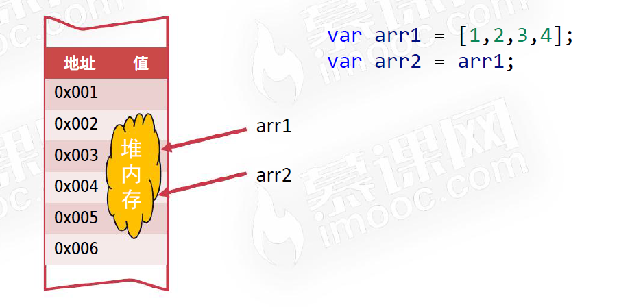

# 【JS数组】

> 原创内容，转载请注明出处！

# 一、什么是数组

数组（Array），顾名思义：用来存储一组相关值的类型。

数组可以方便地对一组值进行求和、计算平均值、逐项遍历等操作。

```javascript
var scoreArr = [87, 89, 93, 71, 100, 68, 94, 88];
```

> 数组名习惯以 Arr 结尾。

# 二、数组的定义

## 2.1 方括号定义法

```javascript
var arr = ['A', 'B', 'C', 'D'];
```

## 2.2 new 定义法

```javascript
var arr = new Array('A', 'B', 'C', 'D');
```

```javascript
var arr = new Array(4);
// 定义一个长度为 4 的数组，但是这 4 项都是 undefined
```

# 三、访问数组项

数组每一项都有下标，下标从 0 开始！

可以使用 `数组名[下标]` 的形式，访问数组的任一项。

# 四、下标越界

JS 规定，访问数组中不存在的项会返回 `undefined`，不会报错！

# 五、数组的长度

数组的 `length` 属性表示它的长度。

```javascript
var arr = ['A', 'B', 'C', 'D'];
console.log(arr.length);	// 4
```

> 数组最后一项的下标是数组的长度减 1。

# 六、更改数组项

1. 访问数组项
2. 更改数组值

如果更改的数组项超过了 `length-1`，则会创造该项。

```javascript
var arr = [1, 2, 3, 4];
arr[6] = 0;
console.log(arr);	// [1, 2, 3, 4, undefined, undefined, 0]
```

# 七、数组的遍历

数组最大的优点就是方便遍历。

```javascript
var arr = [1, 2, 3, 4];
for (var i = 0; i < arr.length; i++) {
    console.log(arr[i]);
}

var a = ['A', 'B', 'C'];
for (var i in a) {
    console.log(i); 	// '0', '1', '2'
    console.log(a[i]); 	// 'A', 'B', 'C'
}
```

# 八、数组类型的检测

数组用 `typeof` 检测结果是 `object`。

`Array.isArray()` 方法可以用来检测数组，返回一个布尔值。

> isArray() 不兼容 IE678，所以后面课程中，还将介绍使用 “鸭式辨型” 检测方法。

```javascript
Array.isArray([1, 2, 3]);		// true
Array.isArray([]);				// true
```

# 九、数组的常用方法

## 9.1 数组的头尾操作

| 方法        | 功能           |
| ----------- | -------------- |
| `push()`    | 在尾部插入新项 |
| `pop()`     | 在尾部删除     |
| `unshift()` | 在头部插入新项 |
| `shift()`   | 在头部删除     |

### 9.1.1 push() 方法

`push()` 方法用来在数组末尾推入新项，参数就是要推入的项。

如果要推入多项，可以用逗号隔开。

调用 `push()` 方法后，数组会立即改变，不需要赋值。

```javascript
var arr = [22, 33, 44, 55];
arr.push(66);
arr.push(77, 88, 99);
console.log(arr);
// [22, 33, 44, 55, 66, 77, 88, 99]
```

### 9.1.2 pop() 方法

与 push() 方法相反，`pop()` 方法用来删除数组中的最后一项。

`()` 里没有参数，默认弹出最后一项。

`pop()` 默认返回最后一项的值。

```javascript
var arr = [22, 33, 44, 55];
var item =  arr.pop();
console.log(arr);	// [22, 33, 44]
console.log(item);	// 55
```

### 9.1.3 unshift() 方法

`unshift()` 方法用来在数组头部插入新项，参数就是要插入的项。

如果要插入多项，可以用逗号隔开。

调用 `unshift()` 方法后，数组会立即改变，不需要赋值。

### 9.1.4 shift() 方法

与 unshift() 方法相反，`shift()` 方法用来删除数组中的开头一项。

`()` 里没有参数，默认弹出开头一项。

`shift()` 默认返回开头一项的值。

## 9.2 splice() 方法

`splice()` 方法用于替换数组中的指定项。

> 由于 splice() 可以实现很多功能，所以也称为 JS 的 “多功能方法”。

- 替换项

```javascript
var arr = ['A', 'B', 'C', 'D', 'E', 'F', 'G'];
// 从下标为 3 的项开始，连续替换 2 项。即将 'D', 'E' 替换为 'X', 'Y', 'Z'
arr.splice(3, 2, 'X', 'Y', 'Z');
console.log(arr);
// ['A', 'B', 'C', 'X', 'Y', 'Z', 'F', 'G']
```

- 插入项

```javascript
var arr = ['A', 'B', 'C', 'D'];
// 从下标为 2 的项开始，连续替换 0 项，即：在 [2] 处插入。
arr.splice(2, 0, 'X', 'Y', 'Z');
console.log(arr);
// ['A', 'B', 'X', 'Y', 'Z', 'C', 'D']
```

- 删除项

```javascript
var arr = ['A', 'B', 'C', 'D', 'E', 'F', 'G'];
// 从下标为 2 的项开始，连续替换 4 项（替换为空，即：删除）。
arr.splice(2, 4);
console.log(arr);
// ['A', 'B', 'G']
```

`splice()` 方法会以数组形式返回被替换/删除的项。

```javascript
var arr = ['A', 'B', 'C', 'D', 'E', 'F', 'G'];
// 从下标为 3 的项开始，连续替换 2 项。
var item = arr.splice(3, 2, 'X', 'Y', 'Z');
console.log(arr);
// ['A', 'B', 'C', 'X', 'Y', 'Z', 'F', 'G']
console.log(item);
// ['D', 'E']

var arr = ['A', 'B', 'C', 'D', 'E', 'F', 'G'];
// 从下标为 2 的项开始，连续替换 4 项（替换为空，即：删除）。
var item = arr.splice(2, 4);
console.log(arr);
// ['A', 'B', 'G']
console.log(item);
// ['C', 'D', 'E', 'F']
```

## 9.3 slice() 方法

`slice()` 方法用于得到子数组，类似于字符串中的 slice() 方法。

`slice(a, b)` 截取的子数组从下标为 a 的项开始，到下标为 b（但不包括下标为 b 的项）结束。

`slice(a, b)` 方法不会更改原有的数组。

`slice()` 如果不提供第二个参数，则表示从指定项开始，提取后续所有项作为子数组。

`slice()` 方法的参数允许为负数，表示数组的倒数第几项（记住不包括最后一项）。

```javascript
var arr = ['A', 'B', 'C', 'D', 'E', 'F'];
var childArr1 = arr.slice(2, 5);
var childArr2 = arr.slice(2);
var childArr3 = arr.slice(2, -1);
console.log(arr);			// ['A', 'B', 'C', 'D', 'E', 'F']
console.log(childArr1);		// ['C', 'D', 'E']
console.log(childArr2);		// ['C', 'D', 'E', 'F']
console.log(childArr3);		// ['C', 'D', 'E']
```

## 9.4 join() 和 split() 方法

数组的 `join()` 方法可以使 数组 转为 字符串。

字符串的 `split()` 方法可以使 字符串 转为 数组。

- `join()` 的参数表示以什么字符作为连接符，如果留空则默认以逗号分隔，如同调用 `toString()` 方法。
- `split()` 的参数表示以什么字符拆分字符串，一般不能留空。

```javascript
[22, 33, 44, 55].join();		// "22,33,44,55"
[22, 33, 44, 55].toString();	// "22,33,44,55"
[22, 33, 44, 55].join(',');		// "22,33,44,55"
[22, 33, 44, 55].join('-');		// "22-33-44-55"
[22, 33, 44, 55].join('~');		// "22~33~44~55"
```

```javascript
'abcdefg'.split();				// ["abcdefg"]
'abcdefg'.split('');			// ["a", "b", "c", "d", "e", "f", "g"]
'a-b-c-d-e-f-g'.split('');		// ["a", "-", "b", "-", "c", "-", "d", "-", "e", "-", "f", "-", "g"]
'a-b-c-d-e-f-g'.split('-');		// ["a", "b", "c", "d", "e", "f", "g"]
```

## 9.5 字符串和数组更多相关性

字符串也可以使用 `[下标]` 的形式访问某个字符，等价于 `charAt()` 方法。

> 在对字符串中的字符进行遍历时不用转为数组，直接利用 [下标] 即可。
>
> 字符串的一些算法问题，会转为数组解决！

```javascript
'我爱前端'[0];			// "我"
'我爱前端'[1];			// "爱"
'我爱前端'.charAt(0);	// "我"
```

```javascript
var str = '我爱前端';
for (var i = 0; i < str.length; i++) {
    console.log(str[i]);
}
```

## 9.6 concat() 方法

`concat()` 方法可以合并连接多个数组（以返回值的形式）。

`concat()` 方法不会改变原数组。

```javascript
var arr1 = [1, 2, 3, 4];
var arr2 = [5, 6, 7, 8];
var arr3 = [9, 10, 11];
var arr = arr1.concat(arr2, arr3);
console.log(arr);
// [1, 2, 3, 4, 5, 6, 7, 8, 9, 10, 11]
```

## 9.7 reverse() 方法

`reverse()` 方法用来将一个数组中的全部项顺序置反。

```javascript
var arr = ['A', 'B', 'C', 'D'];
arr.reverse();
console.log(arr);	// ["D", "C", "B", "A"]
```

【一个小案例】

字符串 `'ABCDEFG'` 逆序。

```javascript
'ABCDEFG'.split('').reverse().join('');
// "GFEDCBA"
```

## 9.8 indexOf() 和 includes() 方法

`indexOf()` 方法的功能是搜索数组中的元素，并返回它所在的位置，如果元素不存在，则返回 -1。

`includes()` 方法的功能是判断一个数组是否包含一个指定的值，返回一个布尔值。

```javascript
['A', 'B', 'C', 'D'].indexOf('C');	// 2
['A', 'B', 'C', 'D'].indexOf('D');	// 3
['A', 'B', 'C', 'D'].indexOf('X');	// -1
['A', 'B', 'B', 'B'].indexOf('B');	// 1
```

```javascript
['A', 'B', 'C', 'D'].includes('D');	// true
['A', 'B', 'C', 'D'].includes('X');	// false
```

注意：`indexOf()` 及 `includes()` 方法的判断标准为 `===` 全相等！

```javascript
[11, 22, 33].includes('22');	// false
[11, 22, 33].indexOf('22');		// -1
```

## 9.9 sort() 方法

数组有 `sort()` 方法可以用于数组的排序，但是涉及到函数的相关知识，在函数一节课进行介绍。

除了内置排序方法外，还有一些排序算法：`冒泡排序` 和 `快速排序` 将在后面介绍。

## 9.10 有关数组在 ES6 中的增强

数组在 ES6 中新增了较多的新方法，将在 ES6 相关课程中介绍。

## 9.11 数组去重和随机样本

【数组去重】

题目：去掉数组中的重复项。

思路：准备一个空结果数组，遍历原数组，如果遍历到的项不在结果数组中，则推入结果数组。

```javascript
var arr = [1, 1, 1, 2, 2, 3, 3, 3, 2, 1];
var resultArr = [];
for (var i = 0; i < arr.length; i++) {
    if (!resultArr.includes(arr[i])) {
        resultArr.push(arr[i]);
    }
}
console.log(resultArr);
```

【随机样本】

题目：请随机从原数组中取 3 项。

思路：准备一个空结果数组，遍历原数组，随机选择一项，推入结果数组，并且将这项在原数组中删除。

```javascript
var arr = [3, 6, 10, 5, 8, 9];
var resultArr = [];
for (var i = 0; i < 3; i++) {
    var n = parseInt(Math.random() * arr.length);
    resultArr.push(arr[n]);
    arr.splice(n, 1);
}
console.log(resultArr);
```

## 9.12 冒泡排序

冒泡排序是一个著名的排序算法，也是最基础的交换排序。

冒泡排序的核心思想：一趟一趟地进行多次项的两两比较，每次都会将最大的元素排好位置，如同水中的气泡上浮一样。

> 时间复杂度：O(n²)


```javascript
var arr = [9, 5, 6, 8, 2, 7, 3, 4, 1];
var temp;
for (var i = 0; i < arr.length - 1; i++) {
    for (var j = i + 1; j < arr.length; j++) {
        if (arr[i] > arr[j]) {
            temp = arr[i];
            arr[i] = arr[j];
            arr[j] = temp;
        }
    }
}
console.log(arr);
```

# 十、二维数组

二维数组：以数组作为数组元素的数组，即 “数组的数组”。

二维数组可以看做是 “矩阵”。

> matrix：矩阵

```javascript
var matrix = [
    [11, 33, 55],
    [22, 33, 44],
    [36, 49, 52],
    [56, 10, 23]
];

// 二维数组长度
console.log(matrix.length);		// 4
console.log(matrix[1].length);	// 3

// 遍历二维数组
for (var i = 0; i < matrix.length; i++) {
    for (var j = 0; j < matrix[i].length; j++) {
        console.log(matrix[i][j]);
    }
}
```

# 十一、基本类型值和引用类型值

|            | 当 var a = b 变量传值时                          | 当用 == 比较时                                 |
| ---------- | ------------------------------------------------ | ---------------------------------------------- |
| 基本类型值 | 内存中产生新的副本                               | 比较值是否相等                                 |
| 引用类型值 | 内存中不产生新的副本，而是让新变量指向同一个对象 | 比较内存地址是否相等，即：比较是否是同一个对象 |

```javascript
// 基本类型值
var a = 3;
var b = a;
a++;
console.log(a);		// 4
consloe.log(b);		// 3
```

```javascript
// 引用类型值
var arr1 = [1, 2, 3, 4];
var arr2 = arr1;
arr1.push(5);
console.log(arr1);	// [1, 2, 3, 4, 5]
console.log(arr2);	// [1, 2, 3, 4, 5]
```

- 基本类型：`number`、`boolean`、`string`、`undefined`、`null`
- 引用类型：`array`、`object`、`function`、`regexp`、……

【内存】




【相等 `==` 判断时的区别】

- 基本类型进行相等 `==` 判断时，会比较 “值” 是否相等
- 引用类型进行相等 `==` 判断时，会比较 “址” 是否相等，也就是说它会比较是否为内存中的同一个东西

```javascript
3 == 3;		// true
[1, 2, 3] == [1, 2, 3];	// false
[] == [];	// false

var arr = [1, 2, 3];
arr == arr;		// true
var arr2 = arr;
arr == arr2;	// true
arr === arr2;	// true
```

两个等号 `==` 运算符不比较值的类型，它会进行隐式转换后比较值是否相等。

三个等号 `===` 运算符，不仅比较值是否相同，也比较类型是否相同。

# 十二、深克隆和浅克隆

> 深克隆和浅克隆需要手写代码实现，而不是简单的调用函数。

使用 arr1 = arr2 的语法不会克隆数组。

浅克隆：只克隆数组的第一层，如果是多维数组，或者数组中的项是其他引用类型值，则不克隆其他层。

深克隆：克隆数组的所有层，要用递归技术，在后面课程中介绍。

【浅克隆】

> 核心思想：“藕断丝连”

```javascript
var arr = [1, 2, 3, 4, [5, 6, 7]];
var resultArr = [];
for (var i = 0; i < arr.length; i++) {
    resultArr.push(arr[i]);
}
console.log(resultArr);		// [1, 2, 3, 4, [5, 6, 7]]
console.log(resultArr == arr);  		// false    
console.log(resultArr[4] == arr[4]);	// true
```

