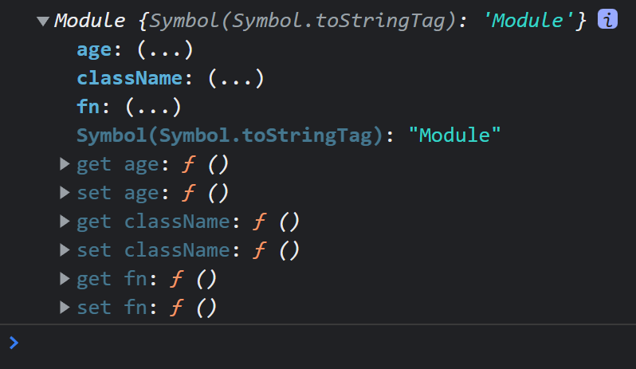
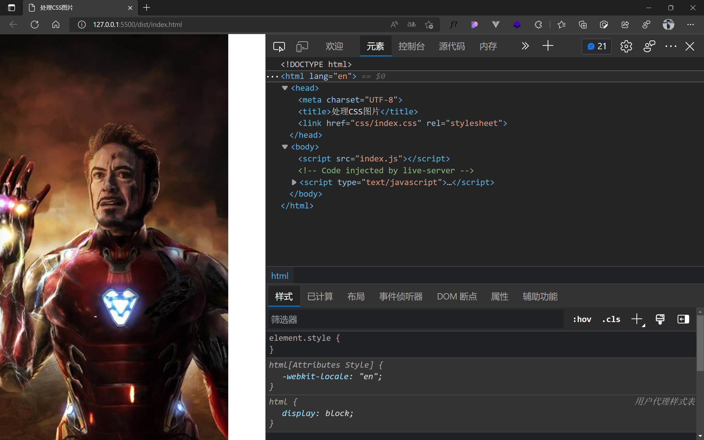
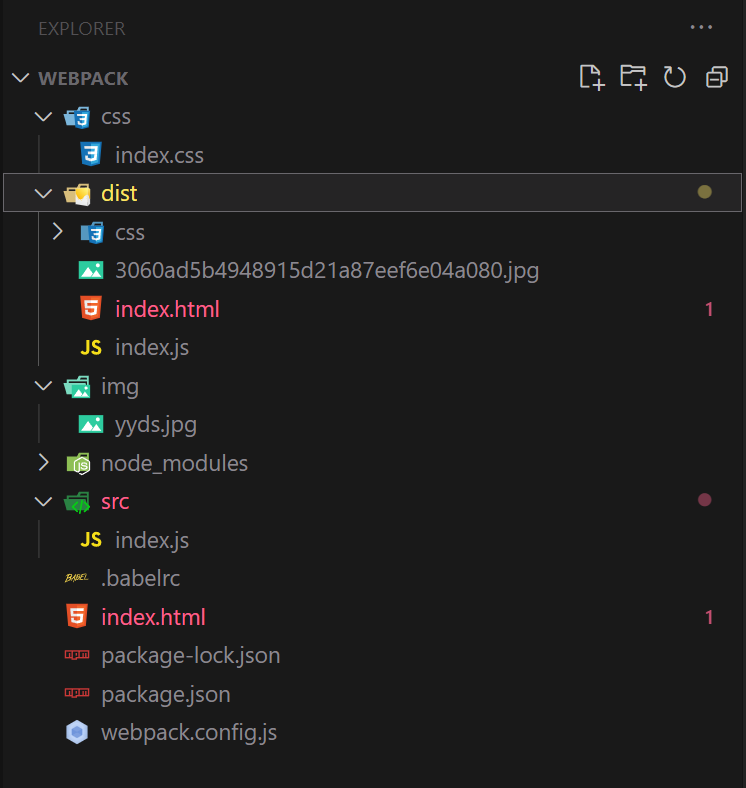
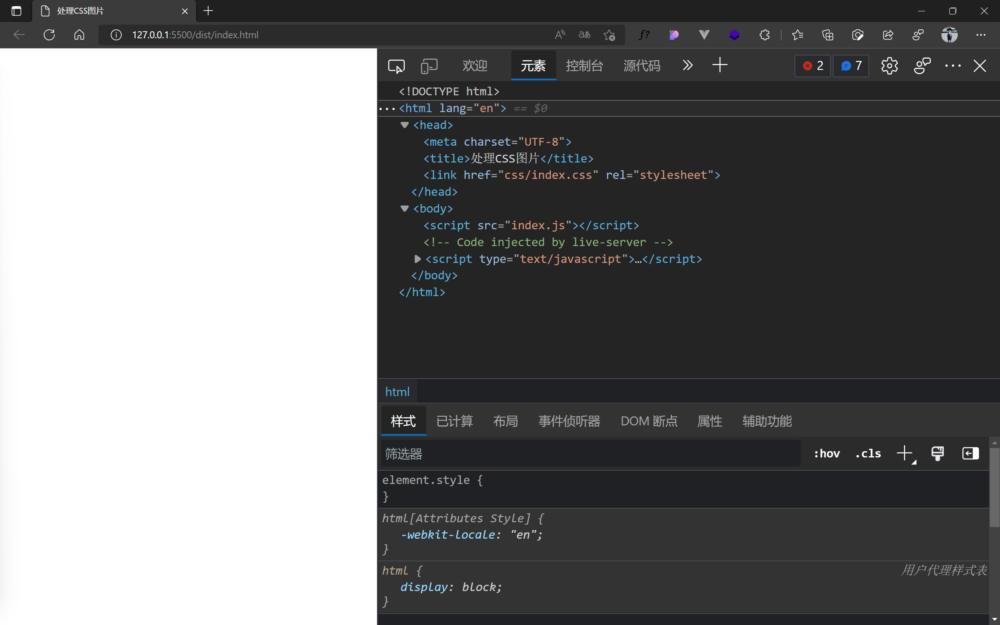
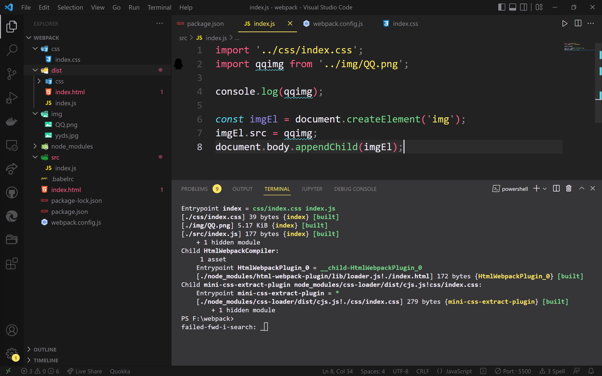
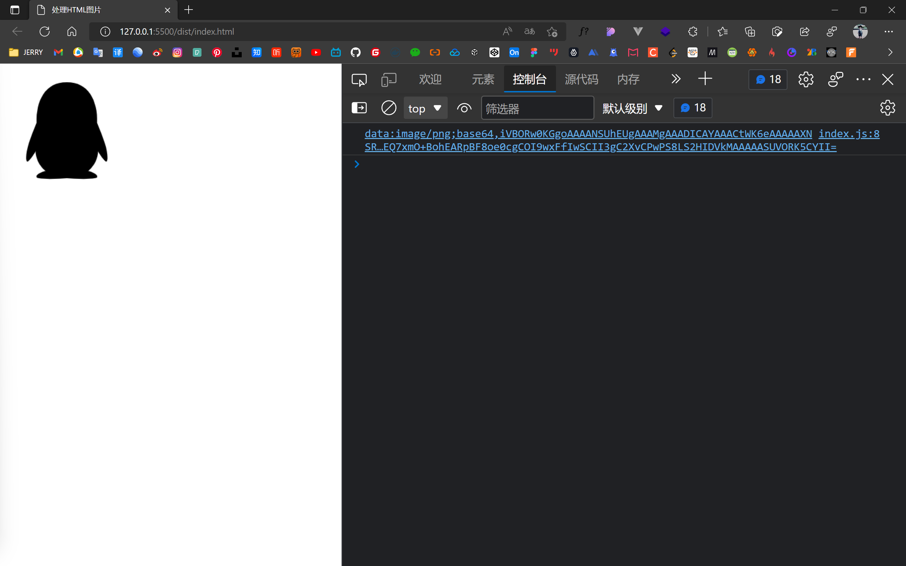

# 【ES6之Module模块与Babel编译及Webpack】

> 原创内容，转载请注明出处！

# 一、Module模块

## 1.1 初识Module

（1）什么是模块

模块：一个一个的局部作用域的代码块。

（2）什么是模块系统

模块系统：系统的解决了模块化一系列问题。

1. 模块化的写法（之前我们用立即执行函数模拟模块化，ES6 则实现了针对模块化的语法）
2. 消除全局变量（模块中的变量都是局部的，不同模块之间不会相互干扰，可以通过特定语法暴露指定内容）
3. 管理加载顺序（之前我们将一个总的 JavaScript 程序分几个文件写，但在最终合并调用时，js 的引入需要满足前后依赖关系。比如：被引用的 js 文件就一定要在引用它的 js 文件之前加载）

## 1.2 Module的基本用法

> 注意：Module 要生效，必须在服务器环境下才能执行。
>
> 普通的 HTML、JS 是本地文件环境，地址以 file 协议开头，服务器则以 http 或 https 开头。
>
> 方法：VSCode 中使用 Live Server 拓展，WebStorm 默认就是服务器环境。

- 一个 JS 文件就是一个模块
- 用 import 关键字导入模块
- 用 export 关键字导出模块需要暴露的部分
- 在使用 script 标签加载的时候，需要加上 type="module"，否则就以普通 JS 文件的形式引入了，就不是模块了

## 1.3 Module的导入导出

> 导出的东西可以被导入（import），并访问到！
>
> 对于导入和导出有两种方法：
>
> - export default 导出，import 导入
> - export 导出，import 导入

### 1.3.1 export default 导出和对应的 import 导入

（1）一个模块没有导出，是否可以将其导入？

```html
<!-- 一个模块没有导出，也可以将其导入 -->
<!-- 被导入的模块的代码都会执行一遍，并且同一个模块的导入只执行一遍！ -->
<!DOCTYPE html>
<html lang="zh-CN">
<head>
    <meta charset="UTF-8">
    <title>Module</title>
</head>
<body>
<!-- script 标签需要加上 type="module" -->
<script type="module">
    import "./test.js";		// 浏览器控制台打印：test
    import "./test.js";		// 不执行
    import "./test.js";		// 不执行
    import "./test02.js";	// 浏览器控制台打印：test02
    import "./test.js";		// 不执行
    import "./test02.js";	// 不执行
</script>
</body>
</html>

----------------------------------------------------
<!-- test.js -->

console.log("test");

----------------------------------------------------
<!-- test02.js -->

console.log("test02");

```

（2）一个模块中只能有一个 export default。

【module.js】

```javascript
// 模块中的变量都是局部的
const age = 18;
const sex = "male";

export default age;			// 通过 export default 导出（暴露）一个值
// export default sex;		// 报错！因为 export default 只能在一个文件中导出一次！！！

/*
export default 24;				// 可以导出值
export default {};				// 可以导出对象
export default function(){};	 // 可以导出函数
export default class{};			 // 可以导出class
*/
```

【index.html】

```html
<!DOCTYPE html>
<html lang="zh-CN">
<head>
    <meta charset="UTF-8">
    <title>Module</title>
</head>
<body>
<!-- script 标签需要加上 type="module" -->
<script type="module">
    // import 之后跟一个模块的别名，推荐别名与导出时的名字相同，比如这里就用 age
    import age from "./module.js";
    console.log(age);	// 18
</script>
</body>
</html>
```

### 1.3.2 export 导出和对应的 import 导入

**（1）基本用法**

【module.js】

```javascript
/*
const age = 18;
export age;		// 报错
*/

// export 后面只能跟声明或语句！
export const age = 18;
```

【index.html】

```html
<!DOCTYPE html>
<html lang="zh-CN">
<head>
    <meta charset="UTF-8">
    <title>Module</title>
</head>
<body>
<!-- script 标签需要加上 type="module" -->
<script type="module">
    // import aaa from "./module.js";	// 报错！ 
    // export 导出的模块，在导入时不能随意取别名，名称必须与模块导出时相同！并且要使用类似于解构赋值的{}形式！
    
    import {age} from "./module.js";	// 注意：名称不能随意取，一定要与模块相同
    console.log(age);	// 18;
</script>
</body>
</html>
```

注意：在用 export 导出时，也可以用类似于解构赋值的`{}`形式！

【module.js】

```javascript
const age = 18;

export {age};
```

**（2）多个导出导入**

【module.js】

```javascript
// 1、采用声明或语句的形式
/*
export funciton fn() {};
export class className {};
export const age = 18;
*/

// 2、采用解构赋值的形式
function fn() {};
class className {};
const age = 18;

/* 方式 1：
export {fn};
export {className};
export {age};
*/

// 方式 2：
export {fn, className, age};
```

【index.html】

```html
<!DOCTYPE html>
<html lang="zh-CN">
<head>
    <meta charset="UTF-8">
    <title>Module</title>
</head>
<body>
<!-- script 标签需要加上 type="module" -->
<script type="module">
    /* 方式 1：
    import {fn} from "./module.js";
    import {className} from "./module.js";
    import {age} from "./module.js";
    */
    // 方式 2：
    import {fn, className, age} from "./module.js";
    console.log(fn);			// ƒ fn() {}
    console.log(className);		// class className {}
    console.log(age);	    	// 18
</script>
</body>
</html>
```

**（3）导出导入时起别名**

```javascript
export {fn as func, className as cN, age};
```

```javascript
import {func, cN, age as nl} from "./module.js";
console.log(func);			// ƒ fn() {}
console.log(cN);			// class className {}
console.log(nl);	    	// 18
```

**（4）整体导入**

```javascript
// 之前的导入方式，如果导入的模块不多那么还好，但是一但模块数量多了起来，那么就特别费劲
// import {fn, className, age} from "./module.js";

// 整体导入
// 将同一文件里的所有模块导入到一个对象中
// 不仅对 export 有效，同时对 export default 也同样有效
import * as imObj from "./module.js";
console.log(imObj);					// 见图片
console.log(imObj.fn);				// ƒ fn() {}
console.log(imObj.className);		// class className {}
console.log(imObj.age);				// 18
// export default 也同样有效：imObj.default
```



**（5）同时导入**

当我们需要分别导入 export default 和 export 时，可以使用同时导入的方式。

```javascript
// 我们可以分开实现
import {fn, className, age} from "./module.js";
import sex from "./module.js";
```

```javascript
// 更推荐使用同时导入的方式
import sex, {fn, className, age} from "./module.js";
// 注意：export default 必须在 export 之前
```

## 1.4 Module的注意事项

### 1.4.1 Module的注意事项

**（1）模块顶层的 this 指向**

顶层：不在 if、for、while、函数等局部作用域之外的部分。

在模块中顶层的 this 指向 undefined！（千万不要误以为指向 window）

> 模块中顶层的 this 指向 undefined，所以我们可以利用这个特性，检测模块有没有被正确的导入。比如：当 script 标签中没有 type="moudel" 时，模块就没有被成功引入，那么 this 就指向的是 window。

> 当我们需要指定必须以模块的方式导入时，我们可以这样做：
>
> 【module.js】
>
> ```javascript
> if (typeof this !== "undefined") {
>     throw new Error("请使用模块的方式加载！");
> }
> ```

**（2）import 关键字和 import() 函数**

- import 命令具有提升效果，无论写在哪都会提升到代码的头部，率先执行！

- import 执行的时候，代码还没有执行，所以我们不能将 import 嵌入到代码逻辑中！

  ```javascript
  // 以下做法时错误的！
  if (...) {
      import "./pc.js";
  } else {
      import "./mobile.js";
  }
  // import 和 export 命令只能在模块的顶层，不能在代码块中执行！ 
  ```

- import() 可以按条件导入，并且返回一个 promise 对象

  ```javascript
  if (...) {
      import("pc.js").then().catch();
  } else {
      import("mobile.js").then().catch();
  }
  ```

**（3）导入导出的复合写法**

复合写法：在一条语句中同时完成导入和导出。

```javascript
// 导入导出的复合写法
export {age} from "./module.js";

// 等价于
import {age} from "./module.js";
export {age} from "./module.js";
// 先导入用，用完后再导出，相当于 “中转站”
```

# 二、Babel与webpack

## 2.1 认识Babel

官网：[Babel · The compiler for next generation JavaScript https://babel.dev/](https://babel.dev/)

在线编译：[Babel · The compiler for next generation JavaScript https://babel.dev/repl](https://babel.dev/repl)

Babel 是 JavaScript 的编译器，用来将 ES6 代码转换成 ES6 之前的代码。

Babel 本身可以编译 ES6 的大部分语法，比如：let、const、箭头函数、class，……，但是对于 ES6 新增的 API，比如：Set、Map、Promise 等全局对象，以及一些定义在全局对象上的方法（比如 Object.assign/Array.from）都不能直接编译，需要借助其它的模块，Babel 一般需要配合 Webpack 来编译 Module 模块语法。

## 2.2 Babel的使用方式

使用方式说明：[Babel · The compiler for next generation JavaScript https://babel.dev/setup](https://babel.dev/setup)

目前，我们主要关注：CLI 及 Webpack。

注意：我们一般不考虑 [In the browser](https://babel.dev/setup#installation) 方式，因为此种方式代码每次被浏览器执行时都要先转换为 ES6 之前的代码，这样的转换影响了性能，而 CLI 及 Webpack 的方式是提前就将 ES6 代码转化为 ES6 之前的代码，浏览器在运行时已经是 ES6 之前的代码了，不影响性能。

## 2.3 使用Babel前的准备工作

### 2.3.1 什么是Node.js和npm

简单的说 Node.js 就是运行在服务端的 JavaScript。

Node.js 是一个基于 Chrome JavaScript 运行时建立的一个平台。

Node.js 是一个事件驱动 I/O 服务端 JavaScript 环境，基于 Google 的 V8 引擎，V8 引擎执行 Javascript 的速度非常快，性能非常好。

后端的 JavaScript = ECMAScript + IO + File + ...服务器端的操作。

npm 是随同 Node.js 一起安装的包管理工具，能解决 Node.js 代码部署上的很多问题，常见的使用场景有以下几种：

- 允许用户从 npm 服务器下载别人编写的第三方包到本地使用。
- 允许用户从 npm 服务器下载并安装别人编写的命令行程序到本地使用。
- 允许用户将自己编写的包或命令行程序上传到 npm 服务器供别人使用。

由于新版的 Node.js 已经集成了 npm，所以之前 npm 也一并安装好了。同样可以通过输入 **"npm -v"** 来测试是否成功安装。

### 2.3.2 安装Node.js

Node.js 中文官网：[Node.js (nodejs.org)](https://nodejs.org/zh-cn/)

我们下载长期支持版，并双击安装包根据提示进行安装即可。

可以通过在终端中依次输入：`node -v` 及 `npm -v` 来查看版本，如果查看成功，即表明安装成功。

### 2.3.3 初始化项目

- 初始化项目：`npm init`

- 进行项目配置

- 确认配置并正式生成项目


> 当依次正确完成以上步骤后，项目路径下就会生成一个 `package.json` 文件，里面最初记录了我们 npm 项目的初始化配置信息，往后我们利用 npm 安装的依赖及包都会记录在这个文件中。
>
> 往后当我们需要迁移项目时，我们只需要拷贝这个 `package.json` 文件，然后在新的项目中使用相应的命令，便可恢复文件中的环境、依赖及包。
>
> 【初始时的 package.json】
>
> ```json
> {
>       "name": "demo",
>       "version": "1.0.0",
>       "description": "",
>       "main": "index.js",
>       "scripts": {
>        	"test": "echo \"Error: no test specified\" && exit 1"
>       },
>       "author": "",
>       "license": "ISC"
> }
> ```

### 2.3.4 安装Babel需要的包

安装命令：`npm install --save-dev @babel/core @babel/cli`

注意：`--save-dev` 表示这是一个开发环境的依赖，即上线之后是用不到的。

当我们安装成功后，会得到一个依赖及包代码的放置目录和两个 json 文件，其中 package.json 文件会新增一个 `devDependencies` （开发依赖）属性，并记录下我们的安装记录。


- @babel/cli：CLI 中使用 Babel 必须的包，实现了命令行中 Babel 命令的识别与执行等
- @babel/core：Babel 中用于完成 “发号施令” 的包，即：指挥控制其它 Babel 包的行为

> 注意：我们在安装时，要特别注意一下依赖及包的版本号，不能随意的依赖最新版本，因为最新版本可能会不兼容某些旧版本。

> 当我们迁移了项目环境时，也许项目的依赖及包代码（node_modules 文件夹）已经不在了或者错误了，那么只要 package.json 文件还在，那么我们只需要执行 `npm install` 命令，即可根据 package.json 内容重新生成项目的依赖及包代码（node_modules 文件夹）。
>
> 注意：`npm install` 可以简写为：`npm i`
>
> 注意：在平时的项目开发中，我们在拷贝项目或者迁移项目时，通常不会把 node_modules 文件夹一同拷贝或迁移，因为该文件夹的文件数量级太大了，所以拷贝或迁移的时间会特别长，而且还容易出错，我们一般都是通过 `npm install` 来重新生成。

### 2.3.5 使用Babel编译ES6代码

首先，我们需要手动在 package.json 文件中添加以下代码：

```json
"scripts": {
    "build": "babel src -d lib"
}
```

其中 `"build": "babel src -d lib"` 表示：通过 babel 命令将 src 下的文件编译并输出到 lib 目录下。

附：`-d` 实际表示的就是：`--out-dir` 的缩写，其实就是输出目录的意思。

注意：由于我们通常不放在 `lib` 目录下，而是放在 `dist` 目录下，所以我们把 package.json 文件中添加的代码修改为：

```json
"scripts": {
    "build": "babel src -d dist"
}
```

**（1）编译的命令**

当配置好上述步骤后，我们即可通过命令进行编译。

编译命令：`npm run build`

当我们编译成功后，便会多出一个 `dist` 目录，里面便放置有编译后的文件。

> 当我们把编译好的文件打开后，发现里面的代码依旧是 ES6 版本的，这是因为我们在正式编译代码之前还需要设置一个 Babel 的配置文件。

**（2）Babel的配置文件**

首先，我们需要额外安装一个包：`npm install @babel/preset-env --save-dev`，这个包能告诉编译器具体如何转换编译 ES6 的语法。

安装成功后，在项目目录下，创建一个 `.babelrc`。

在文件中写入：

```json
{
    "presets": ["@babel/preset-env"]
}
```

> 配置之后，我们再次执行 `npm run build` 命令，那么 dist 目录中的文件就是编译完成的 ES6 之前版本的代码了！

## 2.4 Webpack是什么

（1）认识 Webpack

Webpack 是静态模块打包器，当 Webpack 处理应用程序时，会将所有这些模块打包成一个或多个文件。

（2）什么是 Webpack 模块？

除了 JavaScript 外，还有 CSS、图片、图标字体等。

（3）什么是静态？

开发过程中存在于本地的 js/css/图片/图标字体 等文件，就是静态的；而从远程服务器获取的就是动态的。

Webpack 没办法处理动态的部分，只能处理静态的部分。

[webpack 中文文档 | webpack 中文网 (webpackjs.com)](https://www.webpackjs.com/)

## 2.5 Webpack初体验

**（1）初始化项目**

`npm init`，注意：项目名请不要取 `webpack`，因为这个项目名与 webpack 包名冲突了。

**（2）安装Webpack需要的包**

`npm install --save-dev webpack-cli@3.3.12 webpack@4.44.1`，此处以某个版本作为演示。

**（3）配置Webpack**

- 创建配置文件 `webpack.config.js`

- 编辑配置内容：

  ```js
  // 导入模块（Node 方式）
  const path = require('path');
  
  // 以模块方式导出配置
  module.exports = {
    // 入口
    entry: './src/index.js',
    // 出口
    output: {
      path: path.resolve(__dirname, 'dist'),
      filename: 'bundle.js',
    },
  };
  
  // Webpack 的配置文件的内容也是以模块的方式导出，但是这里的模块不是 JS 模块，而是 Node 模块
  ```
  
  与此同时，还需要在 package.json 中添加：
  
  ```json
  "scripts": {
      // 执行 webpack 命令就相当于去执行 webpack 配置文件
      // (会去默认执行 webpack.config.js 配置文件)
      // "webpack": "webpack"
      //（去执行指定的配置文件，这个配置文件是可以自由指定的）
      "webpack": "webpack --config webpack.config.js"
  }
  ```

- 举例代码

  - index.html

  ```html
  <!DOCTYPE html>
  <html lang="en">
  
  <head>
      <meta charset="UTF-8" />
      <title>Webpack 初体验</title>
  </head>
  
  <body>
      <script src="./src/index.js" type="module"></script>
  </body>
  
  </html>
  ```

  - src/index.js

  ```javascript
  import age from './module.js';
  
  console.log('index.js', age);
  ```

  - src/module.js

  ```javascript
  export default 18;
  
  console.log('module.js');
  ```

- 编译并测试

  - `npm run webpack`

  执行后，便会生成一个 dist 目录，并有一个 bundle.js 文件：

  ```javascript
  !function(e){var t={};function n(r){if(t[r])return t[r].exports;var o=t[r]={i:r,l:!1,exports:{}};return e[r].call(o.exports,o,o.exports,n),o.l=!0,o.exports}n.m=e,n.c=t,n.d=function(e,t,r){n.o(e,t)||Object.defineProperty(e,t,{enumerable:!0,get:r})},n.r=function(e){"undefined"!=typeof Symbol&&Symbol.toStringTag&&Object.defineProperty(e,Symbol.toStringTag,{value:"Module"}),Object.defineProperty(e,"__esModule",{value:!0})},n.t=function(e,t){if(1&t&&(e=n(e)),8&t)return e;if(4&t&&"object"==typeof e&&e&&e.__esModule)return e;var r=Object.create(null);if(n.r(r),Object.defineProperty(r,"default",{enumerable:!0,value:e}),2&t&&"string"!=typeof e)for(var o in e)n.d(r,o,function(t){return e[t]}.bind(null,o));return r},n.n=function(e){var t=e&&e.__esModule?function(){return e.default}:function(){return e};return n.d(t,"a",t),t},n.o=function(e,t){return Object.prototype.hasOwnProperty.call(e,t)},n.p="",n(n.s=0)}([function(e,t,n){"use strict";n.r(t);console.log("module.js"),console.log("index.js",18)}]);
  ```

  可以看见，默认通过 webpack 打包后的文件是压缩版的，我们可以通过在 webpack.config.js 配置文件中设置成开发版：

  ```javascript
  const path = require('path');
  
  module.exports = {
      // 开发模式
      mode: 'development',
      entry: './src/index.js',
      output: {
          path: path.resolve(__dirname, 'dist'),
          filename: 'bundle.js',
      },
  };
  ```

  再次执行 `npm run webpack`，查看 dist/bundle.js 文件：

  ```javascript
  /******/ (function(modules) { // webpackBootstrap
  /******/ 	// The module cache
  /******/ 	var installedModules = {};
  /******/
  /******/ 	// The require function
  /******/ 	function __webpack_require__(moduleId) {
  /******/
  /******/ 		// Check if module is in cache
  /******/ 		if(installedModules[moduleId]) {
  /******/ 			return installedModules[moduleId].exports;
  /******/ 		}
  /******/ 		// Create a new module (and put it into the cache)
  /******/ 		var module = installedModules[moduleId] = {
  /******/ 			i: moduleId,
  /******/ 			l: false,
  /******/ 			exports: {}
  /******/ 		};
  /******/
  /******/ 		// Execute the module function
  /******/ 		modules[moduleId].call(module.exports, module, module.exports, __webpack_require__);
  /******/
  /******/ 		// Flag the module as loaded
  /******/ 		module.l = true;
  /******/
  /******/ 		// Return the exports of the module
  /******/ 		return module.exports;
  /******/ 	}
  /******/
  /******/
  /******/ 	// expose the modules object (__webpack_modules__)
  /******/ 	__webpack_require__.m = modules;
  /******/
  /******/ 	// expose the module cache
  /******/ 	__webpack_require__.c = installedModules;
  /******/
  /******/ 	// define getter function for harmony exports
  /******/ 	__webpack_require__.d = function(exports, name, getter) {
  /******/ 		if(!__webpack_require__.o(exports, name)) {
  /******/ 			Object.defineProperty(exports, name, { enumerable: true, get: getter });
  /******/ 		}
  /******/ 	};
  /******/
  /******/ 	// define __esModule on exports
  /******/ 	__webpack_require__.r = function(exports) {
  /******/ 		if(typeof Symbol !== 'undefined' && Symbol.toStringTag) {
  /******/ 			Object.defineProperty(exports, Symbol.toStringTag, { value: 'Module' });
  /******/ 		}
  /******/ 		Object.defineProperty(exports, '__esModule', { value: true });
  /******/ 	};
  /******/
  /******/ 	// create a fake namespace object
  /******/ 	// mode & 1: value is a module id, require it
  /******/ 	// mode & 2: merge all properties of value into the ns
  /******/ 	// mode & 4: return value when already ns object
  /******/ 	// mode & 8|1: behave like require
  /******/ 	__webpack_require__.t = function(value, mode) {
  /******/ 		if(mode & 1) value = __webpack_require__(value);
  /******/ 		if(mode & 8) return value;
  /******/ 		if((mode & 4) && typeof value === 'object' && value && value.__esModule) return value;
  /******/ 		var ns = Object.create(null);
  /******/ 		__webpack_require__.r(ns);
  /******/ 		Object.defineProperty(ns, 'default', { enumerable: true, value: value });
  /******/ 		if(mode & 2 && typeof value != 'string') for(var key in value) __webpack_require__.d(ns, key, function(key) { return value[key]; }.bind(null, key));
  /******/ 		return ns;
  /******/ 	};
  /******/
  /******/ 	// getDefaultExport function for compatibility with non-harmony modules
  /******/ 	__webpack_require__.n = function(module) {
  /******/ 		var getter = module && module.__esModule ?
  /******/ 			function getDefault() { return module['default']; } :
  /******/ 			function getModuleExports() { return module; };
  /******/ 		__webpack_require__.d(getter, 'a', getter);
  /******/ 		return getter;
  /******/ 	};
  /******/
  /******/ 	// Object.prototype.hasOwnProperty.call
  /******/ 	__webpack_require__.o = function(object, property) { return Object.prototype.hasOwnProperty.call(object, property); };
  /******/
  /******/ 	// __webpack_public_path__
  /******/ 	__webpack_require__.p = "";
  /******/
  /******/
  /******/ 	// Load entry module and return exports
  /******/ 	return __webpack_require__(__webpack_require__.s = "./src/index.js");
  /******/ })
  /************************************************************************/
  /******/ ({
  
  /***/ "./src/index.js":
  /*!**********************!*\
    !*** ./src/index.js ***!
    \**********************/
  /*! no exports provided */
  /***/ (function(module, __webpack_exports__, __webpack_require__) {
  
  "use strict";
  eval("__webpack_require__.r(__webpack_exports__);\n/* harmony import */ var _module_js__WEBPACK_IMPORTED_MODULE_0__ = __webpack_require__(/*! ./module.js */ \"./src/module.js\");\n\r\n\r\nconsole.log('index.js', _module_js__WEBPACK_IMPORTED_MODULE_0__[\"default\"]);\n\n//# sourceURL=webpack:///./src/index.js?");
  
  /***/ }),
  
  /***/ "./src/module.js":
  /*!***********************!*\
    !*** ./src/module.js ***!
    \***********************/
  /*! exports provided: default */
  /***/ (function(module, __webpack_exports__, __webpack_require__) {
  
  "use strict";
  eval("__webpack_require__.r(__webpack_exports__);\n/* harmony default export */ __webpack_exports__[\"default\"] = (18);\r\n\r\nconsole.log('module.js');\n\n//# sourceURL=webpack:///./src/module.js?");
  
  /***/ })
  
  /******/ });
  ```

  可见，Webpack 将我们的代码打包为一个文件了。同时可以发现，文件中已经没有 import 及 export 关键字了，webpack 帮我们实现了导入导出的代码并合并到一个文件中。

  - 接下来，我们就可以直接在 HTML 中引入打包后的文件

  ```html
  <!DOCTYPE html>
  <html lang="en">
  
  <head>
      <meta charset="UTF-8" />
      <title>Webpack 初体验</title>
  </head>
  
  <body>
      <!-- <script src="./src/index.js" type="module"></script> -->
      <script src="./dist/bundle.js"></script>
  </body>
  
  </html>
  ```

## 2.6 entry和output

【entry】

在 webpack.config.js 中 entry 指定了 webpack 打包时的入口文件！

```javascript
const path = require('path');

module.exports = {
    mode: 'development',
    // 入口文件
    // 写法一（单文件入口）
    // entry: './src/index.js',
    // 写法二（单文件或多文件入口）
    // 多个页面，一般都对应独立的 js 文件，都需要多个入口
    entry: {
        main: './src/index.js',
        search: './src/search.js'
    },
    output: {
        path: path.resolve(__dirname, 'dist'),
        filename: 'bundle.js',
    },
};
```

【output】

在 webpack.config.js 中 entry 指定了 webpack 打包时的出口文件！

```javascript
const path = require('path');

module.exports = {
    mode: 'development',
    entry: './src/index.js',
    output: {
        // __dirname，表示当前所在路径
        // path.resolve，可以拼接路径
        // path: 当前路径/dist
        path: path.resolve(__dirname, 'dist'),
        // 输出的文件名（单出口）
        filename: 'bundle.js',
    },
};
```

以上是单入口的情况，如果不是单入口，就有多个出口，那么就需要这样写：

```javascript
const path = require('path');

module.exports = {
    mode: 'development',
    entry: {
        main: './src/index.js',
        search: './src/search.js'
    },
    output: {
        path: path.resolve(__dirname, 'dist'),
        // 输出的文件名（多出口）
        // name 会自动替换为对应的入口文件，针对不同的入口有不同的输出
        filename: '[name].js',
    },
};
```

## 2.7 loader

loader：加载器

webpack 本身是用来打包 js 的（主要就是来解决 JS 模块化问题），如果需要用到其他模块的功能，那么就需要各种各样的 loader。

[loaders | webpack 中文网 (webpackjs.com)](https://www.webpackjs.com/loaders/)

【babel-loader】

在 webpack 中使用 babel 就需要借助 babel-loader。

安装：babel-loader + babel/core + babel/preset-env

```
npm install --save-dev babel-loader@8.1.0 @babel/core@7.11.0 @babel/preset-env@7.11.0
```

记得配置 babel，`.babelrc`

```
{
    "presets": ["@babel/preset-env"]
}
```

在 webpack.config.js 中配置 babel-loader

```javascript
const path = require('path');

module.exports = {
    mode: 'development',
    entry: {
        index: './src/index.js'
    },
    output: {
        path: path.resolve(__dirname, 'dist'),
        filename: '[name].js'
    },
    module: {
        // 可以配置多个 loader，所以是一个数组
        rules: [
            // 每个 loader 用一个对象来配置内容
            //（注意：不同的 loader 的配置规则不同，可以在 www.webpackjs.com/loaders/ 中查看）
            {
                // 正则表达式匹配需要被该 loader 处理的文件（此处是所有的 js 文件）
                test: /\.js$/,
                // node_modules 也包含 js 文件，但不需要处理，所以我们将其排除
                exclude: /node_modules/,
                loader: 'babel-loader'
            }
        ]
    }
};
```

之后，当我们 `npm run webpack` 后，会先处理 loader，再 webpack 打包！

最后，我们查看打包后的 dist/index.js 文件，会发现里面的 let 等 ES6 语法都已经转为 var 等之前版本的语法了！说明 babel 确实生效了！

但是！细心观察会发现，babel 只是会将一些 ES6 的基本语法进行转换，但是诸如：Object、Set、Map、Promise 等 ES6 提供的 API，babel 是无法直接转换的，所以我们需要再借助其它的模块，而这些第三方模块可以帮我们实现 ES6 中的 API。

> core-js 是 JavaScript 标准库的 polyfill（垫片/补丁），将新功能的 ES API 转换为大部分现代浏览器都可以支持运行的一个 API 补丁包集合。它支持最新的 ECMAScript 标准，它支持 ECMAScript 标准库提案，它支持一些 WHATWG / W3C 标准（跨平台或者 ECMAScript 相关），它最大限度的模块化：你能仅仅加载你想要使用的功能，它能够不污染全局命名空间，它和 Babel 紧密集成：这能够优化 core-js 的导入，它是最普遍、最流行的为 JavaScript 标准库打补丁的方式。

安装 core-js：

```
npm install --save-dev core-js@3.6.5
```

之后，我们只需要在我们 js 文件的开头都写上 `import 'core-js/stable';` 便可以了！

例如：index.js

```javascript
import 'core-js/stable';

let name = 'Alex';
const age = 18;

const add = (x, y) => x + y;

new Promise((resolve, reject) => {
    resolve('成功');
}).then(value => {
    console.log(value);
});

Array.from([1, 2]);

class Person {
    constructor(name, age) {
        Object.assign(this, {name, age});
    }
}

new Person('Alex', 18);
```

## 2.8 plugins

plugins：插件

loader 被用于转换某些类型的模块，而插件则可以用于执行范围更广的任务。

[Plugins | webpack 中文网 (webpackjs.com)](https://www.webpackjs.com/plugins/)

【html-webpack-plugin】

插件功能：将 html 文件也同时进行打包！

安装：

```
npm install --save-dev html-webpack-plugin@4.3.0
```

配置 webpack.config.js

```javascript
const path = require('path');
const HtmlWebpackPlugin = require('html-webpack-plugin');

module.exports = {
    mode: 'development',
    entry: {
        index: './src/index.js'
    },
    output: {
        path: path.resolve(__dirname, 'dist'),
        filename: '[name].js'
    },
    module: {
        rules: [
            {
                test: /\.js$/,
                exclude: /node_modules/,
                loader: 'babel-loader'
            }
        ]
    },
    // 可以配置多个 plugin，所以是一个数组
    plugins: [
        // 每个 plugin 通过实例化对象来配置
        // 配置信息在参数中，具体用法每个 plugin 不同，可以在 www.webpackjs.com/plugins/ 中查看
        new HtmlWebpackPlugin({
            template: './index.html',
            // 指定该 html 要引入哪个 js 文件（如果不指定，那么 dist 中打包得到了几个 js 都会引入进来）
            chunks: [
                'index'
            ]
        })
    ]
};
```

以上是单入口的情况，下面展示多入口：

```javascript
const path = require('path');
const HtmlWebpackPlugin = require('html-webpack-plugin');

module.exports = {
    mode: 'development',
    entry: {
        main: './src/index.js',
        search: './src/search.js'
    },
    output: {
        path: path.resolve(__dirname, 'dist'),
        filename: '[name].js'
    },
    module: {
        rules: [
            {
                test: /\.js$/,
                exclude: /node_modules/,
                loader: 'babel-loader'
            }
        ]
    },
    plugins: [
        // 多入口：有几个入口就实例化几次
        new HtmlWebpackPlugin({
            template: './index.html',
            // 多个对象要加上名字进行区分
            filename: 'index.html',
            chunks: [
                'index'
            ]
        }),
        new HtmlWebpackPlugin({
            template: './search.html',
            filename: 'search.html',
            chunks: [
                'search'
            ]
        }) 
    ]
};
```

其它配置：

```javascript
const path = require('path');
const HtmlWebpackPlugin = require('html-webpack-plugin');

module.exports = {
    mode: 'development',
    entry: {
        index: './src/index.js'
    },
    output: {
        path: path.resolve(__dirname, 'dist'),
        filename: '[name].js'
    },
    module: {
        rules: [
            {
                test: /\.js$/,
                exclude: /node_modules/,
                loader: 'babel-loader'
            }
        ]
    },
    // 可以配置多个 plugin，所以是一个数组
    plugins: [
        // 每个 plugin 通过实例化对象来配置
        // 配置信息在参数中，具体用法每个 plugin 不同，可以在 www.webpackjs.com/plugins/ 中查看
        new HtmlWebpackPlugin({
            template: './index.html',
            // 指定该 html 要引入哪个 js 文件（如果不指定，那么 dist 中打包得到了几个 js 都会引入进来）
            chunks: [
                'index'
            ],
            minify: {
                // 删除 index.html 中的注释
                removeComments: true,
                // 删除 index.html 中的空格
                collapseWhitespace: true,
                // 删除各种 html 标签属性值的双引号
                removeAttributeQuotes: true
            }
        })
    ]
};
```

## 2.9 处理CSS

安装 css-loader：

```
npm install --save-dev css-loader@4.1.1			# 识别 css 
npm install --save-dev style-loader@1.2.1		# 将 css 引入到 html 的 style
```

配置 webpack.config.js：

```javascript
const path = require('path');
const HtmlWebpackPlugin = require('html-webpack-plugin');

module.exports = {
    mode: 'development',
    entry: {
        index: './src/index.js'
    },
    output: {
        path: path.resolve(__dirname, 'dist'),
        filename: '[name].js'
    },
    module: {
        rules: [
            {
                test: /\.js$/,
                exclude: /node_modules/,
                loader: 'babel-loader'
            },
            {
                test: /\.css$/,
                // 多个 loader，要用 use[] 或 use{}
                use: [
                    // 注意：必须先 style-loader 再 css-loader，因为执行顺序是从后往前
                    'style-loader',
                    'css-loader'
                ]
            }
        ]
    },
    plugins: [
        new HtmlWebpackPlugin({
            template: './index.html',
            chunks: [
                'index'
            ],
            minify: {
                removeComments: true,
                collapseWhitespace: true,
                removeAttributeQuotes: true
            }
        })
    ]
};
```

此时，我们就可以在 index.js 文件开头写入：`import '../css/index.css';`。

- /src/index.js

```javascript
import '../css/index.css';
```

- /css/index.css

```css
body {
    background-color: red;
}
```

- index.html

```html
<!DOCTYPE html>
<html lang="en">

<head>
    <meta charset="UTF-8" />
    <title>处理CSS</title>
</head>

<body>
</body>

</html>
```

- `npm run webpack`


可见，css 以 `<style>` 的方式引入了 HTML 中！

当然，在实际场景中，我们更倾向于将 css 以 `<link>` 的方式来引入：

安装 mini-css-extract-plugin：

```
npm install --save-dev mini-css-extract-plugin@0.9.0
```

配置 webpack.config.js：

```javascript
const path = require('path');
const HtmlWebpackPlugin = require('html-webpack-plugin');
const MiniCssExtractPlugin = require('mini-css-extract-plugin');

module.exports = {
    mode: 'development',
    entry: {
        index: './src/index.js'
    },
    output: {
        path: path.resolve(__dirname, 'dist'),
        filename: '[name].js'
    },
    module: {
        rules: [
            {
                test: /\.js$/,
                exclude: /node_modules/,
                loader: 'babel-loader'
            },
            {
                test: /\.css$/,
                use: [
                    MiniCssExtractPlugin.loader,
                    'css-loader'
                ]
            }
        ]
    },
    plugins: [
        new HtmlWebpackPlugin({
            template: './index.html',
            chunks: [
                'index'
            ],
            minify: {
                removeComments: true,
                collapseWhitespace: true,
                removeAttributeQuotes: true
            }
        }),
        new MiniCssExtractPlugin({
        	filename: 'css/[name].css'
        })
    ]
};
```

再次 `npm run webpack`：


## 2.10 处理CSS图片

- /css/index.css

```css
body {
    background-image: url(https://tse2-mm.cn.bing.net/th/id/OIP-C.rq2KVURH2gEGBq9pjDz1nAHaQB?pid=ImgDet&rs=1);
    background-repeat: no-repeat;
}
```

- `npm run webpack`



乍一看，一切正常啊！确实默认可以处理 CSS 图片啊！为什么还要单独讲解如何处理 CSS 图片呢？这是因为上面的例子中 CSS 的图片是一个网络地址的图片，而 webpack 本身就不会处理网络的内容，只会对本地的内容进行处理，网络的内容没有任何的影响，所以当我们把图片地址换成一个本地图片时：

- /css/index.css

```css
body {
    background-image: url(../img/yyds.jpg);
    background-repeat: no-repeat;
}
```


webpack 直接报错！因为 webpack 当处理网络内容时直接跳过，而对于本地内容时就要处理，可 webpack 本身并不能处理 css 图片。

安装：file-loader

```
npm install --save-dev file-loader@6.0.0
```

配置 webpack.config.js：

```javascript
const path = require('path');
const HtmlWebpackPlugin = require('html-webpack-plugin');
const MiniCssExtractPlugin = require('mini-css-extract-plugin');

module.exports = {
    mode: 'development',
    entry: {
        index: './src/index.js'
    },
    output: {
        path: path.resolve(__dirname, 'dist'),
        filename: '[name].js'
    },
    module: {
        rules: [
            {
                test: /\.js$/,
                exclude: /node_modules/,
                loader: 'babel-loader'
            },
            {
                test: /\.css$/,
                use: [
                    MiniCssExtractPlugin.loader,
                    'css-loader'
                ]
            },
            {
                test: /\.(jpg|jpeg|png|apng|gif|tif|svg|bmp|webp)$/,
                loader: 'file-loader' 
            }
        ]
    },
    plugins: [
        new HtmlWebpackPlugin({
            template: './index.html',
            chunks: [
                'index'
            ],
            minify: {
                removeComments: true,
                collapseWhitespace: true,
                removeAttributeQuotes: true
            }
        }),
        new MiniCssExtractPlugin({
        	filename: 'css/[name].css'
        })
    ]
};
```

- `npm run webpack`



- /dist/css/index.css

```css
body {
    background-image: url(3060ad5b4948915d21a87eef6e04a080.jpg);
    background-repeat: no-repeat;
}
```



发现图片并没有成功引入，那是因为路径有问题。

```css
/* 打包得到的 */
body {
    background-image: url(3060ad5b4948915d21a87eef6e04a080.jpg);
    background-repeat: no-repeat;
}

/* 正确的 */
body {
    background-image: url(../3060ad5b4948915d21a87eef6e04a080.jpg);
    background-repeat: no-repeat;
}
```

之所以会发生上述原因，和 mini-css-extract-plugin 与 file-loader 没有协调好有关，解决办法是：

```javascript
const path = require('path');
const HtmlWebpackPlugin = require('html-webpack-plugin');
const MiniCssExtractPlugin = require('mini-css-extract-plugin');

module.exports = {
    mode: 'development',
    entry: {
        index: './src/index.js'
    },
    output: {
        path: path.resolve(__dirname, 'dist'),
        filename: '[name].js'
    },
    module: {
        rules: [
            {
                test: /\.js$/,
                exclude: /node_modules/,
                loader: 'babel-loader'
            },
            {
                test: /\.css$/,
                use: [
                    {
                        loader: MiniCssExtractPlugin.loader,
                        // 解决 CSS 图片路径问题
                        options: {
                            publicPath: '../'
                        }
                    },
                    'css-loader'
                ]
            },
            {
                test: /\.(jpg|jpeg|png|apng|gif|tif|svg|bmp|webp)$/,
                loader: 'file-loader' 
            }
        ]
    },
    plugins: [
        new HtmlWebpackPlugin({
            template: './index.html',
            chunks: [
                'index'
            ],
            minify: {
                removeComments: true,
                collapseWhitespace: true,
                removeAttributeQuotes: true
            }
        }),
        new MiniCssExtractPlugin({
        	filename: 'css/[name].css'
        })
    ]
};
```

- `npm run webpack` 再次打包查看 dist/css/index.css，便正确了！

```css
body {
    background-image: url(../3060ad5b4948915d21a87eef6e04a080.jpg);
    background-repeat: no-repeat;
}
```

上述步骤得到的 css 图片是放在 dist 目录的根目录下的，如果我们想打包后的图片放在 dist/img 中，那么我们可以：

```javascript
const path = require('path');
const HtmlWebpackPlugin = require('html-webpack-plugin');
const MiniCssExtractPlugin = require('mini-css-extract-plugin');

module.exports = {
    mode: 'development',
    entry: {
        index: './src/index.js'
    },
    output: {
        path: path.resolve(__dirname, 'dist'),
        filename: '[name].js'
    },
    module: {
        rules: [
            {
                test: /\.js$/,
                exclude: /node_modules/,
                loader: 'babel-loader'
            },
            {
                test: /\.css$/,
                use: [
                    {
                        loader: MiniCssExtractPlugin.loader,
                        // 解决 CSS 图片路径问题
                        options: {
                            publicPath: '../'
                        }
                    },
                    'css-loader'
                ]
            },
            {
                test: /\.(jpg|jpeg|png|apng|gif|tif|svg|bmp|webp)$/,
                use: {
                    loader: 'file-loader',
                    // 解决图片路径及名称问题
                    options: {
                        name: 'img/[name].[ext]'
                    }
                }
            }
        ]
    },
    plugins: [
        new HtmlWebpackPlugin({
            template: './index.html',
            chunks: [
                'index'
            ],
            minify: {
                removeComments: true,
                collapseWhitespace: true,
                removeAttributeQuotes: true
            }
        }),
        new MiniCssExtractPlugin({
        	filename: 'css/[name].css'
        })
    ]
};
```


> 注意：file-loader 的本质是把文件直接进行拷贝并重设地址，不只是对图片有用，对其它文件也有用！

## 2.11 处理HTML图片

例如：

```html
<!DOCTYPE html>
<html lang="en">

<head>
    <meta charset="UTF-8" />
    <title>处理HTML图片</title>
</head>

<body>
    
</body>

</html>
```

安装：html-withimg-loader

```
npm install --save-dev html-withimg-loader@0.1.16
```

配置 webpack.config.js：

```javascript
const path = require('path');
const HtmlWebpackPlugin = require('html-webpack-plugin');
const MiniCssExtractPlugin = require('mini-css-extract-plugin');

module.exports = {
    mode: 'development',
    entry: {
        index: './src/index.js'
    },
    output: {
        path: path.resolve(__dirname, 'dist'),
        filename: '[name].js'
    },
    module: {
        rules: [
            {
                test: /\.js$/,
                exclude: /node_modules/,
                loader: 'babel-loader'
            },
            {
                test: /\.css$/,
                use: [
                    {
                        loader: MiniCssExtractPlugin.loader,
                        options: {
                            publicPath: '../'
                        }
                    },
                    'css-loader'
                ]
            },
            {
                test: /\.(jpg|jpeg|png|apng|gif|tif|svg|bmp|webp)$/,
                use: {
                    loader: 'file-loader',
                    options: {
                        name: 'img/[name].[ext]',
                        // html-withimg-loader 处理 HTML 图片是依赖于 file-loader 的
                        esModule: false
                    }
                }
            },
            {
                test: /\.(htm|html)$/,
                loader: 'html-withimg-loader'
            }
        ]
    },
    plugins: [
        new HtmlWebpackPlugin({
            template: './index.html',
            chunks: [
                'index'
            ],
            minify: {
                removeComments: true,
                collapseWhitespace: true,
                removeAttributeQuotes: true
            }
        }),
        new MiniCssExtractPlugin({
        	filename: 'css/[name].css'
        })
    ]
};
```

打包后的 html：

```html
<!DOCTYPE html>
<html lang=en>

<head>
    <meta charset=UTF-8>
    <title>处理HTML图片</title>
    <link href=css/index.css rel=stylesheet>
</head>

<body>
    
    <script src=index.js></script>
</body>

</html>
```

## 2.12 处理JS图片

依旧是使用 file-loader，我们直接在 js 文件中导入图片即可使用。

- index.js

```javascript
import '../css/index.css';
import yydsimg from '../img/yyds.jpg';

const imgEl = document.createElement('img');
imgEl.src = yydsimg;
document.body.appendChild(imgEl);
```

## 2.13 url-loader处理图片

一般在网站项目中会有许许多多的小图标（<=10k），如果把这些小图标都以图片文件的方式打包在一起是比较臃肿且不科学的，一般可以把这些小图标以 base64 编码的方式打包（将图片的 url 地址替换为该图片的 base64 编码），这种打包后，小图标就不再以实体图片的形式存在了，而是以编码的形式存在。

安装：url-loader

注意：url-loader 是依赖于 file-loader 的，所以前提是已经安装了 file-loader。

```
npm install --save-dev url-loader@4.1.0
```

安装了 url-loader 后，就可以不用 file-loader 了，只用配置 url-loader：

```javascript
const path = require('path');
const HtmlWebpackPlugin = require('html-webpack-plugin');
const MiniCssExtractPlugin = require('mini-css-extract-plugin');

module.exports = {
    mode: 'development',
    entry: {
        index: './src/index.js'
    },
    output: {
        path: path.resolve(__dirname, 'dist'),
        filename: '[name].js'
    },
    module: {
        rules: [
            {
                test: /\.js$/,
                exclude: /node_modules/,
                loader: 'babel-loader'
            },
            {
                test: /\.css$/,
                use: [
                    {
                        loader: MiniCssExtractPlugin.loader,
                        options: {
                            publicPath: '../'
                        }
                    },
                    'css-loader'
                ]
            },
            {
                test: /\.(jpg|jpeg|png|apng|gif|tif|svg|bmp|webp)$/,
                use: {
                    // 将 file-loader 改为 url-loader
                    loader: 'url-loader',
                    options: {
                        name: 'img/[name].[ext]',
                        esModule: false,
                        // 限制：小于 10k 的文件，用 base64 编码，其它的与 file-loader 相同处理
                        limit: 10000
                    }
                }
            },
            {
                test: /\.(htm|html)$/,
                loader: 'html-withimg-loader'
            }
        ]
    },
    plugins: [
        new HtmlWebpackPlugin({
            template: './index.html',
            chunks: [
                'index'
            ],
            minify: {
                removeComments: true,
                collapseWhitespace: true,
                removeAttributeQuotes: true
            }
        }),
        new MiniCssExtractPlugin({
        	filename: 'css/[name].css'
        })
    ]
};
```

执行 `npm run webpack`：





## 2.14 webpack-dev-server

为什么需要 webpack-dev-server？

答案：自动打包！（每次修改都会自动打包）

安装：

```
npm install --save-dev webpack-dev-server@3.11.0
```

修改 package.json，增加 `"dev": "webpack-dev-server"`：

> `"dev"*:* "webpack-dev-server --open chrome"` *自动打包后打开*  chrome 浏览器

```json
{
  "name": "webpack0",
  "version": "1.0.0",
  "description": "",
  "main": "index.js",
  "scripts": {
    "test": "echo \"Error: no test specified\" && exit 1",
    "build": "babel src -d dist",
    "webpack": "webpack --config webpack.config.js",
    "dev": "webpack-dev-server"
  },
  "author": "",
  "license": "ISC",
  "devDependencies": {
    "@babel/cli": "^7.18.6",
    "@babel/core": "^7.11.0",
    "@babel/preset-env": "^7.11.0",
    "babel-loader": "^8.1.0",
    "core-js": "^3.6.5",
    "css-loader": "^4.1.1",
    "file-loader": "^6.0.0",
    "html-webpack-plugin": "^4.3.0",
    "html-withimg-loader": "^0.1.16",
    "mini-css-extract-plugin": "^0.9.0",
    "style-loader": "^1.2.1",
    "url-loader": "^4.1.0",
    "webpack": "^4.44.1",
    "webpack-cli": "^3.3.12",
    "webpack-dev-server": "^3.11.0"
  }
}
```

注意：`npm run dev` 会在内存中生成打包后的文件，但在项目中是不可见的！如果在开发完后需要生成 dist 目录，那么最后 `npm run webpack` 即可。

