# 【HTTP、存储、Ajax】

# 一、前后端通信与HTTP协议

## 1.1 初始前后端通信

### 1.1.1 前后端通信是什么

前端和后端数据交互的过程。

浏览器/客服端 与 后端服务器 的数据交互的过程。

### 1.1.2 为什么需要前后端通信

前端请求后端得到数据，并展示在前端页面上。

前端把用户所填信息发送到后端，并保存到后端数据库里。

## 1.2 前后端通信过程与概念解释


【概念解释】

- 前端：浏览器网页端
- 客户端：凡是能与服务器交互的终端（桌面端软件、APP、命令行工具……）
- 后端：服务器端

> 其实：浏览器网页端也是客户端的一种。

## 1.3 前后端通信方式

- 浏览器访问网页
  - 通过浏览器地址栏输入 域名 或 IP 请求服务器响应网页
- HTML 标签
  - 浏览器解析到 link、img、script、iframe 等标签时会向浏览器请求相关资源
  - 浏览器请求过程是并行的，而非串行的，当然并行数量有一定限制
  - 还有一些标签，浏览器不会自主向服务器发送请求，而是等待用户的指令，如：a、form
- Ajax 和 Fetch
  - 专门实现前后端通信的 JS 工具

## 1.4 初始HTTP

### 1.4.1 HTTP是什么

超文本传输协议（Hyper Text Transfer Protocol，HTTP）是一个简单的请求-响应协议，它通常运行在[TCP](https://baike.baidu.com/item/TCP/33012)之上。它指定了客户端可能发送给服务器什么样的消息以及得到什么样的响应。

HTML、JS、CSS、图片、字体、音频、视频都是通过 HTTP 协议在浏览器与服务器之间传输的。

### 1.4.2 HTTP请求响应的过程

- 用户在浏览器输入 域名 或 IP
  - 浏览器先去缓存中查看是否已经访问过该网站
    - 已经访问过
      - 请求服务器询问是否已经过期
        - 过期：请求服务器
        - 未过期：直接从缓存返回该网站内容
    - 没有访问过
      - 输入的是域名
        - 通过本地 host 查询对应 IP
          - host 没有，通过 DNS 域名解析服务器查询 IP
        - 通过 IP 地址与服务器建立 TCP 连接
        - 基于 TCP 连接实现 HTTP 请求响应
      - 输入的是 IP
        - 通过 IP 地址与服务器建立 TCP 连接
        - 基于 TCP 连接实现 HTTP 请求响应

> TCP 与 HTTP：
>
> 大多数人对 HTTP 与 TCP 的关系模糊不清，这有一点是由于 HTTP 名字的中文翻译失误，HyperText Transfer Protocol，它翻译成 “超文本传输协议”，问题就在这个传输。于是很多人总是把 HTTP 和 TCP（传输控制协议）的职能认为是同类型的了，然而实际上它们不是。
>
> HTTP 是在 TCP 之上，它负责在发送端 “生成针对目标 Web 服务器的 HTTP 请求报文” 和在接收端 “对 Web 服务器请求的内容进行处理”，传输功能是由 TCP 完成的，HTTP 只是为传输做好了前期准备（说白了就是规定了要传输什么格式及内容），即 “传达” 一份将要拿去传输的东西让 TCP 去传输，所以将 Transfer 翻译成 “传达” 会比较合适。而在网络原理中，“传输” 是对另一个词的翻译：Transport。
>
> TCP/IP 和 HTTP 协议的关系，从本质上来说，二者没有可比性，我们在传输数据时，可以只使用（传输层）TCP/IP 协议，但是那样的话，如果没有应用层，便无法识别数据内容，如果想要使传输的数据有意义，则必须使用到应用层协议，应用层协议有很多，比如 HTTP、FTP、TELNET 等，也可以自己定义应用层协议。WEB 使用 HTTP 协议作应用层协议，以封装 HTTP 文本信息，然后使用 TCP/IP 做传输层协议将它发到网络上。
>
> 其中：IP 负责终端到终端的通信（本机与服务器），TCP 负责终端与终端内端口之间的通信（本机浏览器端口与服务器后端服务端口）
>
> - 网络层：IP 协议（计算机与计算机之间，或者确切地说应该是网卡与网卡之间）
> - 传输层：TCP 协议（应用与应用之间，或者确切地说应该是端口与端口之间）
> - 应用层：HTTP 协议（对所传输的数据进行格式上的语义化规定，通俗的理解就是约定传输的数据用什么格式）

### 1.4.3 HTTP报文

浏览器向服务器发送请求时，请求本身就是一段信息，叫：请求报文。

服务器向浏览器发送响应时传输的信息，叫：响应报文。

【HTTP 报文格式】

- 【**请求报文**】

  

  - **请求行：**HTTP 请求中的第一行数据，请求行包含三块内容，分别是 `GET[请求方式]` `/[请求URL路径]` `HTTP/1.1[HTTP协议及版本]`，请求方式有七种,最常用的是 GET 和 POST

  - **请求头：**格式为 `key:value` 形式，请求头中会包含若干个属性，常见的 HTTP 请求头有：

    ```
    Host: 表示请求的主机名
    User-Agent: 浏览器版本，例如Chrome浏览器的标识类似Mozilla/5.0 ...Chrome/79，IE浏览器的标识类似Mozilla/5.0 (Windows NT ...)like Gecko
    Accept：表示浏览器能接收的资源类型，如text/*，image/*，*/*表示所有
    Accept-Language：表示浏览器偏好的语言，服务器可以据此返回不同语言的网页
    Accept-Encoding：表示浏览器可以支持的压缩类型，例如gzip，deflate等
    ```

    请求头内容的作用：

    服务端可以根据请求头中的内容来获取客户端的相关信息，有了这些信息服务端就可以处理不同的业务需求，比如：

    * 不同浏览器解析 HTML 和 CSS 标签的结果会有不一致，所以就会导致相同的代码在不同的浏览器会出现不同的效果
    * 服务端根据客户端请求头中的数据获取到客户端的浏览器类型，就可以根据不同的浏览器设置不同的代码来达到一致的效果
    * 这就是我们常说的浏览器兼容问题

  - **请求体：**POST 请求的最后一部分，存储请求参数（GET 请求没有请求体，GET 的请求内容在请求行的请求URL路径中）

    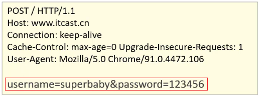

    如上图红线框的内容就是请求体的内容，请求体和请求头之间是有一个空行隔开。此时浏览器发送的是 POST 请求，为什么不能使用 GET 呢？这时就需要回顾 GET 和 POST 两个请求之间的区别了：

    * GET 请求参数在请求行中，大小有限制，没有请求体，POST 请求参数在请求体中
    * GET 请求参数大小有限制，POST 没有

- 【**响应报文**】

  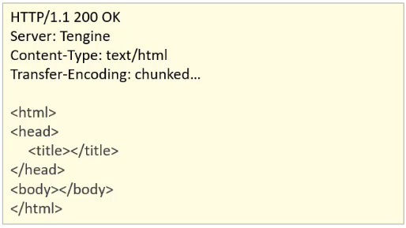

  - **响应行：**响应数据的第一行，响应行包含三块内容，分别是 `HTTP/1.1[HTTP协议及版本]` `200[响应状态码]` `ok[状态码的描述]`

  - **响应头：**格式为 `key-value` 形式，响应头中会包含若干个属性，常见的 HTTP 响应头有：

    ```
    Content-Type：表示该响应内容的类型，例如text/html，image/jpeg；
    Content-Length：表示该响应内容的长度（字节数）；
    Content-Encoding：表示该响应压缩算法，例如gzip；
    Cache-Control：指示客户端应如何缓存，例如max-age=300表示可以最多缓存300秒
    ```

  - **响应体：**最后一部分，存放响应数据，上图中 `<html>...</html>` 这部分内容就是响应体，它和响应头之间有一个空行隔开

【响应状态码】

关于响应状态码，我们先主要认识三个状态码，其余的等后期用到了再去掌握:

* 200 ok 客户端请求成功
* 404 Not Found 请求资源不存在
* 500 Internal Server Error 服务端发生不可预期的错误

## 1.5 HTTP方法

### 1.5.1 常用的HTTP方法

浏览器发送请求时采用的方法，和响应无关！

GET、POST、PUT、DELETE、……

用来定义对于资源采取什么样的操作的，有各自的语义。

### 1.5.2 HTTP方法语义

GET：获取数据

POST：创建数据

PUT：更新数据

DELETE：删除数据

这些方法虽然有各自的语义，但是并不是强制的！

### 1.5.3 RESTful接口设计

一种接口设计风格，充分利用 HTTP 方法的语义。

【我们一般的接口设计】

通过用户 ID 获取个人信息，使用 GET 方式：

- https://www.zjr.com/api/user/getUser?id=1

注册新用户，使用 POST 方式：

- https://www.zjr.com/api/user/addUser
- 数据在请求体中

修改用户信息，使用 POST 方式：

- https://www.zjr.com/api/user/modifyUser
- 数据在请求体中

删除用户，使用 POST 方式：

- https://www.zjr.com/api/user/deleteUser
- 数据在请求体中

【RESTful 接口设计】

（充分利用 HTTP 方法的语义）

通过用户 ID 获取个人信息，使用 GET 方式：

- https://www.zjr.com/api/user?id=1

注册新用户，使用 POST 方式：

- https://www.zjr.com/api/user
- 数据在请求体中

修改用户信息，使用 PUT 方式：

- https://www.zjr.com/api/user
- 数据在请求体中

删除用户，使用 DELETE 方式：

- https://www.zjr.com/api/user
- 数据在请求体中

## 1.6 GET和POST方法的对比

### 1.6.1 语义

GET：获取数据

POST：创建数据

### 1.6.2 发送数据

GET 通过地址在请求行中携带数据，能携带的数据量和地址长度有关系，一般最多几 K。

POST 既可以通过地址在请求行中携带数据（一般不会这么做），还可以通过请求体携带数据。

### 1.6.3 缓存

GET 可以被缓存，POST 不会被缓存。

### 1.6.4 安全性

GET 和 POST 都不安全，但是 GET 的数据直接在地址栏中显示并且还会被浏览器缓存所以更不安全！

## 1.7 HTTP状态码

HTTP 状态码：定义服务器对请求的处理结果，是服务器返回的。

HTTP 状态码的语义：

100~199：代表请求已经被接收，需要继续处理

200~299：成功（200）

300~399：重定向

- 301：永久性重定向（重定向会被缓存）谨慎使用！
- 302：临时性重定向（会向服务器询问）
- 304：没有修改（向服务器确认缓存是否还可用）

400~499：请求错误（404）

500~599：服务器错误（500）

# 二、本地存储

## 2.1 前言

**【会话跟踪】**

**会话：**浏览器访问服务器资源时，会话就会建立！直到有一方断开连接，会话才会结束！在一次会话中可以包含多次请求和响应。

> 可以把会话想象成微信聊天，当我（“浏览器”）与他（“服务器”）开始聊天时，“会话” 就建立了，除非我们其中有人退出聊天，那么 “会话” 才结束！在一次聊天（“会话”）中，我们可以多次发送消息（“请求”）和接收消息（“响应”）。

> 一个浏览器可能存在多个会话！例如：浏览器打开了多个标签，每个标签都是不同的网站，那么这些不同的网站所连接的服务器也是不同的！那么就会建立不同的会话。

**会话跟踪：**一种维护浏览器状态的方法，服务器需要识别多次请求是否来自于同一浏览器，以便在同一次会话的多次请求间共享数据。

> 解释：浏览器和服务器之间使用的是 HTTP 协议来进行数据传输，由于 HTTP 协议是无状态的，就是说每一次的 HTTP 请求都是彼此独立的，即便你是同一个浏览器发的多次请求，服务器也根本不知道这是否来自同一个浏览器。HTTP 协议设计成无状态的目的是让每次请求之间相互独立，互不影响，并且足够安全。可是这样的设计也带来了问题，由于服务器识别不了是否来自同一浏览器，所以会话就不能实现跟踪！会话一但不能跟踪许多功能就无法实现，例如：
>
> - 勾选 “记住我” 按钮后，来自同一浏览器的登录请求，可以自动登录，免除账号密码验证。
> - 服务器发送一个验证码图片到浏览器，用户输入验证码后将结果发送回服务器，服务器判断验证码填写是否正确。
> - 登录过期。
> - ……

那么该如何实现会话跟踪技术呢? 具体的实现方式有：

- 客户端会话跟踪技术：Cookie
- 服务端会话跟踪技术：Session
- 令牌会话跟踪技术：Token

**【Cookie】**

Cookie：客户端会话跟踪技术，将数据保存到客户端（浏览器），以后每次请求都会自动携带 Cookie 数据进行服务器的访问。

**原理：**服务器响应浏览器数据时，可以在 HTTP 响应头中设置一个头信息：`set-cookie`，这个头信息后面就跟着 Cookie 数据（键值对），例如：`Set-Cookie:username=jerry`（实际上该头信息的内容不只是 Cookie 数据的键值对，还会包括该 Cookie 的最长有效时间、主机名、URL等），浏览器获取到响应结果后，从响应头中就可以获取到 `Set-Cookie` 对应的值 `username=jerry`，并将数据存储在浏览器的内存中，浏览器下次发送请求给同一服务器时，浏览器会自动在请求头中添加一个头信息：`Cookie:username=jerry` 发送给服务器，服务器就拿到了 Cookie 的值，那么会话就成功实现跟踪了！比如：在 Cookie 中存放用户登录的有效凭证，那么下一次请求登录时，就可以验证这个凭证实现免密登录了……

> 说明：
>
> 1. 服务器可以向浏览器发送多个 Cookie，浏览器都会保存下来，并在下一次请求服务器时，捆绑在一起发送给服务器。
> 2. 默认情况下，Cookie 存储在浏览器内存中，当浏览器关闭，内存释放，则 Cookie 被销毁，但是如果服务器在发送 Cookie 时为其设置了存活时间，那么浏览器就会根据存活时间将该 Cookie 保存到硬盘上。

**【Session】**

Session：服务端会话跟踪技术，将数据保存到服务端（服务器）

- Session 是存储在服务端而 Cookie 是存储在客户端（浏览器）
- 存储在客户端的数据容易被窃取和截获，存在很多不安全的因素，敏感信息千万不能用 Cookie 存储
- 存储在服务端的数据相比于客户端来说就更安全

**原理：**首先要知道，Session 是基于 Cookie 实现的！只不过 “绕了个弯”！具体原理是，服务器会生成一个 Session，这个 Session 里存放了会话信息（例如：用户登录凭证），同时这个 Session 会有一个自己唯一的 id（一个复杂的哈希字符串），当服务器响应信息给浏览器时，服务器会在 HTTP 响应头中设置一个 `set-cookie` 头信息，这个 Cookie 的内容就是 Session 的 id，即 `Set-Cookie:JESSIONID=XXX...`，浏览器在收到响应后就保存这个 Cookie，然后在下一次请求同一服务器时携带这个 Cookie 即 `Cookie:JESSIONID=XXX...`，服务器在收到这个 Cookie 后，识别到是名为 `JESSIONID` 的 Cookie，就会拿其值 `XXX...`（id）去匹配服务器中的 Session id，最终就拿到了具体的 Session 值，那么会话就成功实现跟踪了！

> 说明：
>
> 1. Session 默认是存储在服务器的内存中的，服务器重新启动后，内存中的数据已经被释放了，Session 也就被销毁了，我们可以借助服务器中的 “Session 钝化” 技术来把 Session 自动存在服务器硬盘中（一种特殊的保存 Session 的文件），在服务器重启之后利用 “Session 活化” 技术来自动复原之前的 Session（之前保存的文件在活化后会被删除/更新）
> 2. Session 默认有一个自动销毁时间（一般是 30 分钟），服务端也可以自己指定 Session 的销毁时间，甚至是根据具体业务来销毁 Session，比如：当用户退出登录后就删除该用户有关的 Session……
> 3. 因为 Session 是基于 Cookie 实现的，所以即便 Session 比 Cookie 要安全得多，但依旧不能把敏感信息放在 Session 中（比如：用户密码）

**【Token】**

Token：令牌会话跟踪技术。

准确的说应该叫：JWT 认证机制（或者是会话跟踪机制也行），JWT（英文全称：JSON Web Token）是目前最流行的跨域认证解决方案。

为什么有了 Cookie 和 Session 还需要 JWT 呢？

- Cookie 默认不支持跨域访问（什么是跨域后面讲），所以当涉及到前端跨域请求后端的时候，需要做很多额外的配置，非常麻烦！而且 Session 也是基于 Cookie 的，所以 Session 也具有同样的问题！
- 无论是 Cookie 还是 Session 都不算安全！JWT 相较前两者要安全的多！（这不代表可以存储密码）

JWT 原理：

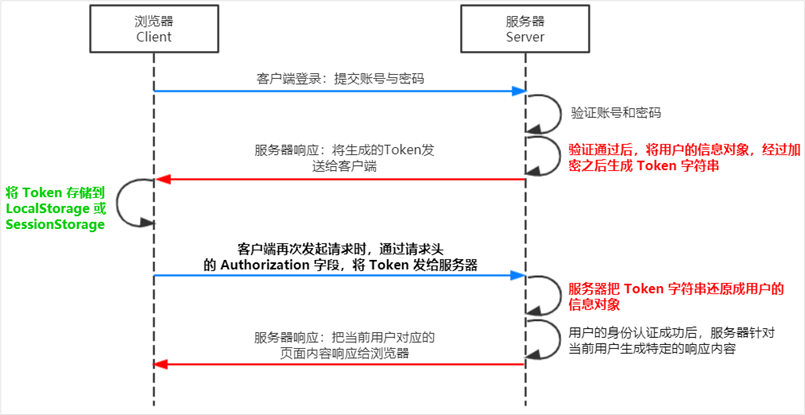

> 说明：服务端也是可以设置 Token 存活时间的！同时也可以借助一些技术实现 “Token 钝化” 和 “Token 活化”。

**【本地存储】**

刚刚我们所讲的 Cookie Session Token 都是服务器发给我们的，其实前端自己也提供了相应的 API 可以操作 Cookie Session Token！

> 说明：Session 在客户端（浏览器）其实本质上就是一个 Cookie，所以这里所说的前端操作 Session 实际还是操作 Cookie，至于 Token 通常是存储到浏览器的 LocalStorage 或 SessionStorage 中，我们所说的操作 Token 实际操作的是 LocalStorage 或 SessionStorage（LocalStorage、SessionStorage 后面学习）

下面，就开始学习客户端（浏览器）对 Cookie 及 Storage 的操作吧！

## 2.2 Cookie

### 2.2.1 初始Cookie

Cookie 是什么？

Cookie 全称 HTTP Cookie，简称 Cookie，是浏览器存储数据的一种方式，因为存储在用户本地，而不是存储在服务器上，是本地存储。

同时，Cookie 一般会自动跟随着浏览器每次请求发送到服务器端。

如何查看 Cookie？

F12 打开浏览器控制台，选择 Application（应用程序）中的 Storage（存储）中的 Cookies，里面就能看到当前页面的 Cookie 了。

Cookie 一般都是以 网址 或 IP 的形式进行标识。

- 浏览器每个页面都会有各自的 Cookie 列表，列表中可能有多个 Cookie 项，因为同一个页面可能请求了多个不同的服务器，那么就会收到多个服务器发送过来的 Cookie，而每个 Cookie 项中会存有多条数据。

每个 Cookie 中，以 `key=value` 的形式存储一系列记录，记录与记录之间用 `;` + ` ` 隔开。

当浏览器向服务器发送请求时，会连同一起发送 Cookie。

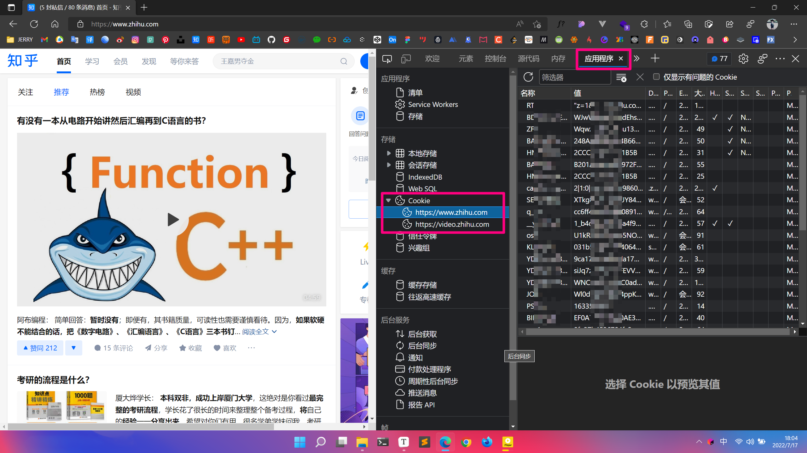

### 2.2.2 Cookie的基本用法

读取 Cookie：`document.cookie`（返回一个由 “名值对” 构成的字符串，“名值对” 之间用 “一个分号 + 一个空格” 隔开）。

注意：读取时只能一次性读取全部的 Cookie，不能通过 “名” 单独读出某条 “名值对”。

写入 Cookie：`document.cookie = 'username=jerry'`。

注意：不能同时设置多个 Cookie `document.cookie = 'username=jerry; age=18'`，只能一个一个设置。

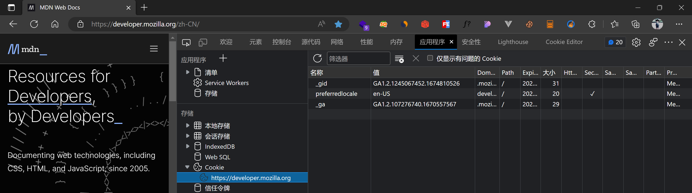

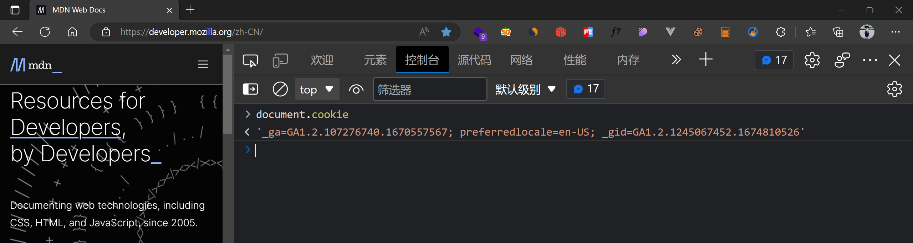

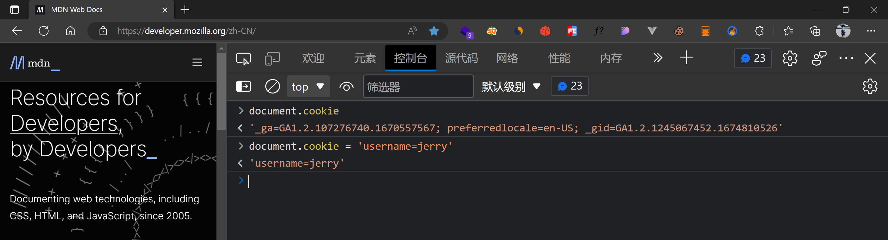

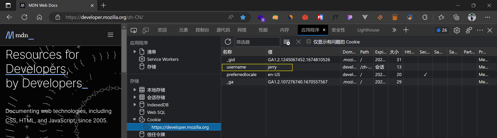

### 2.2.3 Cookie的属性

- Cookie 的名称（Name）：（必须属性）

- Cookei 的值（Value）：（必须属性）

> Cookie 的名称或值如果包含非英文字母，则写入时需要使用 encodeURIComponent() 编码，读取时使用 decodeURIComponent() 解码：
>
> ```javascript
> document.cookie = `username=${encodeURIComponent('张三')}`;
> document.cookie = `${encodeURIComponent('用户名')}=zhangsan`;
> // 一般名称使用英文字母，不要使用中文，值可以使用中文，但是要编码（否则会乱码）
> ```

- 失效（到期）时间：对于失效的 Cookie，会被浏览器清除（非必须属性，有默认值）

> 如果没有设置失效时间，那么这样的 Cookie 称为：会话 Cookie（到期时间默认值为 Session，注意这个 Session 单纯是 “会话” 的意思！和服务器那个 Session 无关！），它存在内存中，当会话结束，也就是浏览器关闭时，Cookie 会消失。
>
> 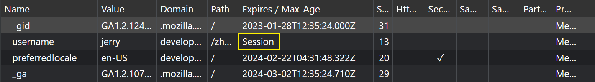
>
> 想长时间存在，设置 Expires 或 Max-Age：
>
> 【Expires】：值为 Date 类型
>
> ```javascript
> document.cookie = `username=alex; expires=${new Date('2050-1-01 00:00:00')}`;
> ```
>
> 【Max-Age】：值为数字，表示当前时间 + 多少秒后过期，单位是秒
>
> ```javascript
> // 5 秒
> document.cookie = 'username=alex; max-age=5';
> // 30 天
> document.cookie = `username=alex; max-age=${24 * 3600 * 30}`;
> // 0：立即删除
> documetn.cookie = 'username=alex; max-age=0';
> // 负数：立即删除
> documetn.cookie = 'username=alex; max-age=-1';
> 
> // 同时有 Max-Age 和 Expires，Max-Age 优先级更高会覆盖 Expires！
> ```

- Domain 域：限定了同一站点下不同域名访问 Cookie 的范围（非必须属性，有默认值，默认值为当前域）

> 可以通过 Domain 设置同一站点下不同域名对 Cookie 的访问范围。
>
> 比如：`www.bilibili.com` 和 `m.bilibili.com` 分别是B站的PC端和移动端，但它们只能各自访问到添加了其域名或父域名的 Domain 对应的 Cookie。
>
> - 我们清空 B站 PC端的 Cookie，然后自己添加一条 Cookie，浏览器会自动帮我们把 Domain 设置为 `www.bilibili.com`
>
> 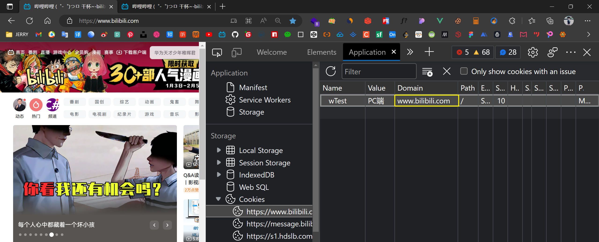
>
> - 我们清空 B站 移动端的 Cookie，然后自己添加一条 Cookie，浏览器会自动帮我们把 Domain 设置为 `m.bilibili.com`
>
> 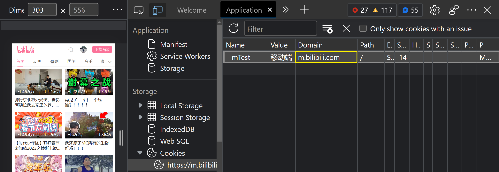
>
> - 现在我们在 PC 端只能访问 Domain 为 `www.bilibili.com` 的 Cookie，我们在移动端只能访问 Domain 为 `m.bilibili.com` 的 Cookie
>
> 
>
> 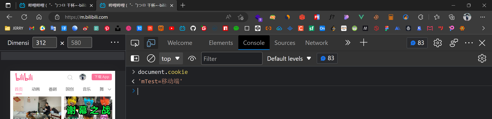
>
> 
>
> - 我们在 PC 端添加一个 Domain 为 `.bilibili.com` 的域名，则 PC 端与 移动端 都能访问到，因为这是它们的父域名
>
> 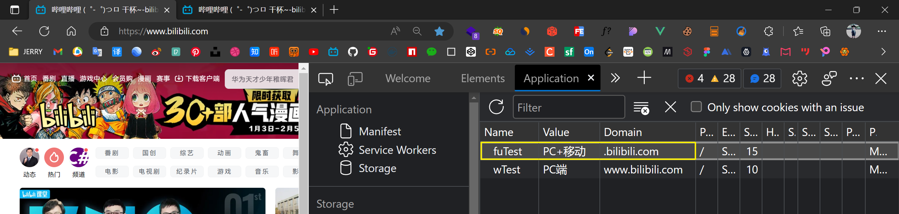
>
> 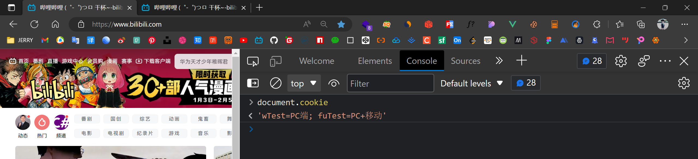
>
> 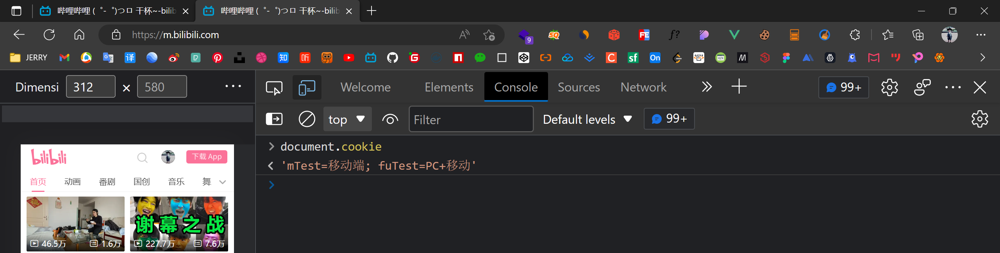
>
> - 当然，在移动端里添加 Domain 为 `www.bilibili.com` 的 Cookie 也是可以的，不过添加了移动端也访问不了，但是 PC 端能访问
>
> 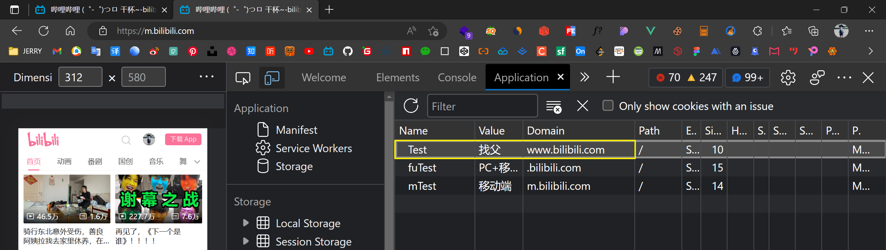
>
> 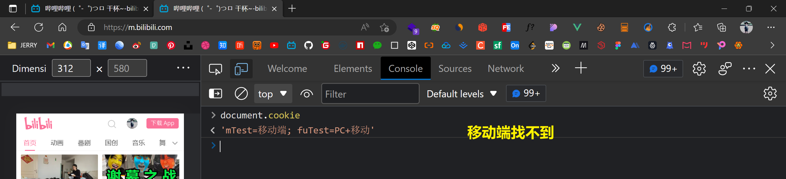
>
> 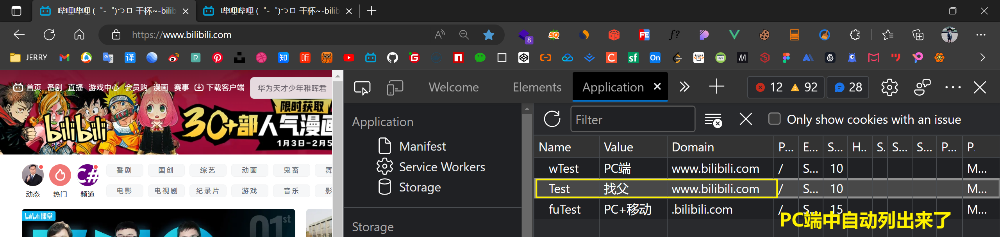
>
> 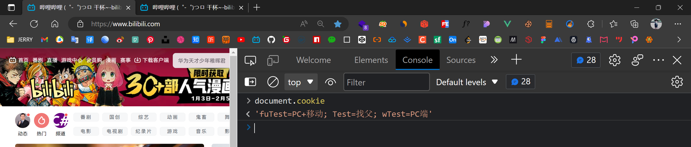
>
> 
>
> > 实际上，浏览器就是根据 Cookie 的 Domain 把它们划分成 Cookie 列表然后放到开发者工具中的，开发者工具根据你打开的窗口的域名，呈现该域名所能访问的 Cookie，这样就比较清晰，方面开发者查看。
>
> 【添加 Domain】（默认值为当前域名）
>
> ```javascript
> // 注意：我们只能读写当前域或父域的 Cookie，无法读写其它域的 Cookie       
> // 比如：当前我们在 www.zjr.com，那么父域是 .zjr.com
> document.cookie='username=alex; domain=www.zjr.com';
> document.cookie='username=alex; domain=.zjr.com';
> ```

- Path 路径：限定了同一站点下同一域名下不同路径访问 Cookie 的范围（非必须属性，有默认值）

>可以通过 Path 设置同一站点下同一域名下不同路径访问 Cookie 的范围。
>
>比如：www.zjr.com 和 www.zjr.com/course 和 www.zjr.com/course/list 是同一域名的不同路径，但这些路径下的页面只能访问到添加了其路径或父路径 Path 的对应的 Cookie。
>
>【添加 Path】（默认值为根路径 `/`）
>
>```javascript
>// 注意：不能在上一级路径下读写下一级路径到 Path
>// 当前在 www.zjr.com
>document.cookie = 'username=alex; path=/';	// 该路径下全部都能访问
>// 当前在 www.zjr.com/course;
>document.cookie = 'username=alex; path=/';	// 该路径下全部都能访问
>document.cookie = 'username=alex; path=/course';	// /course 路径后的能访问
>// 当前在 www.zjr.com/course/list
>document.cookie = 'username=alex; path=/';	// 该路径下全部都能访问
>document.cookie = 'username=alex; path=/course';	// /course 路径后的能访问
>document.cookie = 'username=alex; path=/course/list';	// /course/list 路径后的能访问
>```

> 注意：只有当 Name、Domain、Path 这 3 个属性都同时相等的时候，才是同一个 Dookie。

- HttpOnly：设置了 HttpOnly 属性的 Cookie 不能通过 JS 去访问（为了安全性）
- Secure 安全标志：限定了只有在使用了 https 而不是 http 的情况下才可以发送给服务端

### 2.2.4 Cookie注意事项

- 前后端都可以写入和获取 Cookie
  - 前端可以生成 Cookie 并通过请求发送给服务器后端进行读取
  - 后端可以生成 Cookie 并通过响应返回给浏览器，然后浏览器进行存储
- Cookie 有数量限制
  - 每个域下的 Cookie 数量有限制（大概 < 50）
- Cookie 有大小限制 
  - 每个 Cookie 的存储容量很小，最多只有 4KB 左右

## 2.3 LocalStorage

### 2.3.1 初始localStorage

【localStrorage 是什么】

localStrorage 也是一种浏览器存储数据的方式（本地存储），它只是存储在本地，不会发送到服务器端。

可以理解为浏览器自带的一种 “小型数据库”

单个域名下的 localStrorage 总大小有限制。

localStrorage 是 key-value 形式。

【在浏览器中操作 localStrorage】

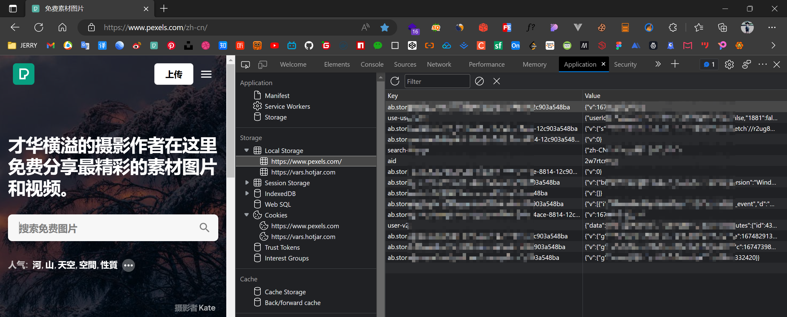

【基本用法】

```java
// 查看 localStrorage 
console.log(localStrorage);
// 存数据
localStorage.setItem('username', 'alex');
localStorage.setItem('username', 'zs');
localStorage.setItem('age', 18);
localStorage.setItem('sex', 'male');
// 获取长度
console.log(localStrorage.length);
// 获取数据
console.log(localStorage.getItem('username'));
console.log(localStorage.getItem('name'));	// 获取不存在的会返回 null
// 删除数据
localStorage.removeItem('age');
localStorage.removeItem('name');	// 删除不存在的数据不会报错
// 清空数据
localStorage.clear();
```

使用 localStorage 实现自动填充功能：

已经登录过的用户，下一次登录时自动填充用户名。

```html
<!DOCTYPE html>
<html lang="en">
  <head>
    <meta charset="UTF-8" />
    <title>初识 localStorage</title>
  </head>
  <body>
    <form id="login" action="https://www.imooc.com" method="post">
      <input type="text" name="username" />
      <input type="password" name="password" />
      <input type="submit" id="btn" value="登录" />
    </form>

    <script>
      // 使用 localStorage 实现自动填充
      const loginForm = document.getElementById('login');
      const btn = document.getElementById('btn');

      const username = localStorage.getItem('username');
      if (username) {
        loginForm.username.value = username;
      }

      btn.addEventListener(
        'click',
        e => {
          // 阻止默认行为（先不提交）
          e.preventDefault();
          // 用户名及密码规则校验……
          // 校验通过，将用户名存入 localStorage
          localStorage.setItem('username', loginForm.username.value);
          // 提交表单
          loginForm.submit();
        },
        false
      );
    </script>
  </body>
</html>

```

### 2.3.2 localStorage的注意事项

- localStorage 的存储期限
  - localStorage 是持久化的本地存储，除非手动清除（比如通过 JS 删除，或者清除浏览器缓存），否则数据是永远不会过期的
- localStorage 键和值的类型
  - 其键和值的类型只能是字符串，不是字符串类型也会先转为字符串类型再存进去 
- 不同域名下能否共用 localStorage 
  - 不能！
- localStorage 的兼容性
  - IE7 及以下版本不支持。

## 2.4 SessionStorage

sessionStorage 当会话结束（比如关闭浏览器）的时候，sessionStorage 中的数据会被清空，其它用法与 localStorage 一致。

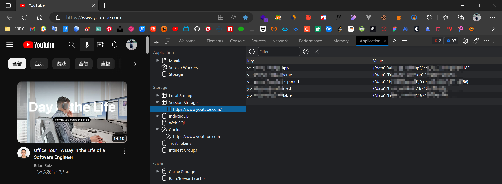

# 三、Ajax

## 3.1 初始 Ajax

### 3.1.1 Ajax 是什么

AJAX = Asynchronous JavaScript and XML（异步的 JavaScript 和 XML）。

AJAX 不是新的编程语言，而是一种使用现有标准的新方法。

AJAX 最大的优点是在不重新加载整个页面的情况下，可以与服务器交换数据并更新部分网页内容。

Ajax 中的异步：可以异步地向服务器发送请求，在等待响应的过程中，不会阻塞当前页面，浏览器可以做自己的事情。直到成功获取响应后，浏览器才开始处理响应数据。

学习 Ajax 必须在服务器环境下，VSCode 可以使用（Live Server）

## 3.2 Ajax 的基本用法

### 3.2.1 XMLHttpRequest

Ajax 想要实现浏览器与服务器之间的异步通信，需要依靠 XMLHttpRequest，它是一个构造函数。

> 之所有叫 XMLHttpRequest，是因为之前前后端主要的通信载体都是 XML，所以当时微软在为这个函数取名时就加上了 XML，但是这并不代表它只能与 XML 格式绑定，即可以 XML 也可以 JSON，未来还可以其它的。
>

### 3.2.2 Ajax 的使用步骤

```javascript
// 创建 xhr 对象
const xhr = new XMLHttpRequest();
// 准备发送请求（准备工作）
xhr.open('HTTP方法GET/POST/PUT/DELETE', '地址URL', '异步还是同步true/false');
// 发送请求，调用 send()
xhr.send(null);	// GET（POST/PUT/DELETE 需要通过其它方式）
// 监听事件，处理响应
// 当获取到响应后，会触发 xhr 对象的 readystatechange 事件，可以在该事件中对响应进行处理
xhr.onreadystatechange = () => {
    /*
    readystatechange 事件监听 readyState 这个状态的变化
    它的值从 0~4，一共 5 个状态
    0：未初始化。尚未调用 open()
    1：启动。已经调用 open()，但尚未调用 send()
    2：发送。已经调用 send()，但尚未接收到响应
    3：接收。已经接收到部分响应数据（还没有全部接收完）
    4：完成。已经接收到全部响应数据，而且已经可以在浏览器中使用了
    */
    if (xhr.readyState != 4) {
        return;
    }
    // 获取到响应后，响应的内容会自动填充到 xhr 对象的属性上
    // xhr.status（HTTP CODE）：HTTP 200；404
    // xhr.statusText（HTTP 状态说明）：OK；Not Found
    // xhr.responseText（响应内容，字符串形式）
    if ((xhr.status >= 200 && xhr.status < 300) || xhr.status === 304) {
        console.log('正常');
        console.log(xhr.statusText);
        // 响应数据
        console.log(xhr.responseText);
    } else {
        console.log('错误');
        console.log(xhr.statusText);
    }
};
```

注意事项：

- readystatechange 事件也可以配合 addEventListener 使用，不过要注意，IE6~IE8 不支持 addEventListener

```javascript
const xhr = new XMLHttpRequest();

xhr.open('HTTP方法GET/POST/PUT/DELETE', '地址URL', '异步还是同步true/false');

xhr.send(null);

xhr.addEventListener('readystatechange', () => {
    if (xhr.readyState != 4) {
        return;
    }
    if ((xhr.status >= 200 && xhr.status < 300) || xhr.status === 304) {
        console.log('正常');
        console.log(xhr.statusText);
        console.log(xhr.responseText);
    } else {
        console.log('错误');
        console.log(xhr.statusText);
    }
}, false);
```

- 为了兼容性，readystatechange 中不要使用 this 代指 xhr，还是直接使用 xhr 即可。
- 为了兼容性，readystatechange 事件最好放在 open 之前监听。

```javascript
const xhr = new XMLHttpRequest();
xhr.onreadystatechange = () => {
    if (xhr.readyState != 4) {
        return;
    }
    if ((xhr.status >= 200 && xhr.status < 300) || xhr.status === 304) {
        console.log('正常');
        console.log(xhr.statusText);
        console.log(xhr.responseText);
    } else {
        console.log('错误');
        console.log(xhr.statusText);
    }
};
xhr.open('HTTP方法GET/POST/PUT/DELETE', '地址URL', '异步还是同步true/false');
xhr.send(null);	
```

【使用 Ajax 完成前后端通信】

```html
<!DOCTYPE html>
<html lang="en">

<head>
    <meta charset="UTF-8" />
    <title>Ajax 的基本用法</title>
</head>

<body>
    <script>
        const url = 'https://www.imooc.com/api/http/search/suggest?words=js';
        const xhr = new XMLHttpRequest();
        xhr.onreadystatechange = () => {
            if (xhr.readyState !== 4) {
                return;
            }
            if ((xhr.status >= 200 && xhr.status < 300) || xhr.status === 304) {
                console.log(xhr.responseText);
                console.log(typeof xhr.responseText);
            }
        };
        xhr.open('GET', url, true);
        xhr.send(null);
    </script>
</body>

</html>
```

## 3.3 GET请求

### 3.3.1 携带数据

```javascript
let name = 'zjr';
let age = 18;
const url = 'https://www.jerry.com/api/user?' + 'name=' + name + '&age=' + age;
const url = encodeURIComponent(__url);
const xhr = new XMLHttpRequest();
//......
xhr.open('GET', url, true);
xhr.send(null);
```

### 3.3.2 数据编码

非英文字符在发送前需要编码：

```javascript
let name = '周吉瑞';
let age = 18;
const __url = 'https://www.jerry.com/api/user?' + 'name=' + name + '&age=' + age;
const url = encodeURIComponent(__url);
const xhr = new XMLHttpRequest();
//......
xhr.open('GET', url, true);
xhr.send(null);
```

## 3.4 POST请求

### 3.4.1 携带数据

```javascript
let id = 01321;
let name = 'zjr';
let age = 18;
// POST 可以在请求头中传递数据也可以在请求体中传递数据
const url = 'https://www.jerry.com/api/user?' + 'id=' + id;
const xhr = new XMLHttpRequest();
//......
xhr.open('POST', url, true);
// 在请求体中传递数据，直接写在 send() 的参数位置
// 一般是字符串，我们一般使用 k=v&k=v 的字符串形式
// 当然，目前使用最多的还是使用 JSON 形式
xhr.send('name=' + name + '&age=' + age);
```

### 3.4.2 数据编码

```javascript
let id = 01321;
let name = 'zjr';
let age = 18;
// POST 可以在请求头中传递数据也可以在请求体中传递数据
const __url = 'https://www.jerry.com/api/user?' + 'id=' + id;
const url = encodeURIComponent(__url);
const xhr = new XMLHttpRequest();
//......
xhr.open('POST', url, true);
// 在请求体中传递数据，直接写在 send() 的参数位置
// 一般是字符串，我们一般使用 k=v&k=v 的字符串形式
// 当然，目前使用最多的还是使用 JSON 形式
const __payload = 'name=' + name + '&age=' + age;
const payload = encodeURIComponent(__payload);
xhr.send(payload);
```

## 3.5 JSON

### 3.5.1 初始JSON

JSON（[JavaScript](https://baike.baidu.com/item/JavaScript) Object Notation, JS对象简谱）是一种轻量级的数据交换格式。它基于 [ECMAScript](https://baike.baidu.com/item/ECMAScript)（European Computer Manufacturers Association, 欧洲计算机协会制定的 js 规范）的一个子集，采用完全独立于编程语言的文本格式来存储和表示数据。简洁和清晰的层次结构使得 JSON 成为理想的数据交换语言。 易于人阅读和编写，同时也易于机器解析和生成，并有效地提升网络传输效率。

之前常用的前后端数据交互格式是 XML，目前则是 JSON。

JSON 的其中一种表示方式看上去类似于一个字符串化的 JS 对象，所以对于 Ajax 传递 JS 对象参数是非常方便的。

JSON 有 3 种形式，每种形式的写法都和 JS 中的数据类型非常像，可以轻松的和 JS 中的数据类型互相转换。

JS 对象 ——> JSON ——> Java/PHP/Pyhton（利用 JSON 解析工具解析成对应语言的对象）

Java/PHP/Pyhton 对象 ——> JSON ——> JS 对象

### 3.5.2 JSON的3中形式

> JSON 不允许有注释！JSON 字符串是 `""`，不能是 `''`，JSON 没有 undefined 值！

【简单值形式】

对应着 JS 简单数据类型（undefined 除外）：数字、字符串、布尔值、null

```json
24
```

【对象形式】

对应 JS 对象（JSON 中属性名必须用字符串）

```json
{
    "name": "周吉瑞",
    "age": 18,
    "hobby": ["编程", "摄影", "设计", "数码"],
    "family": {
        "father": "zyj",
        "mother": "glp"
    }
}
```

【数组形式】

对应 JS 数组（对象形式一般用来表示一个实体的数据，数组类型一般用来表示多个实体的数据）

```json
[
    {
        "id": 01,
        "username": "张三",
        "readme": "哈佛大学医学博士，内科主任医师",
        "day": ["周一", "周四"]
    },
    {
        "id": 02,
        "username": "李四",
        "readme": "北京协和医学院博士，外科主任医师"
        "day": ["周一", "周二", "周五"]
    }
]
```

### 3.5.3 JSON的常用方法

- JSON.parse()

JSON.parse()：可以将 JSON 格式的字符串解析成 JS 中的对应值。

（一定要是合法的 JSON 字符串，否则会报错）

 ```javascript
 let obj = JSON.parse(xhr.responseText);
 ```

- JSON.stringify()

JSON.stringify()：可以将 JS 的基本数据类型、对象或者数组转换为 JSON 格式的字符串。

```javascript
let usrObj = {
    name: "zhoujirui",
    age: 18
}
__usrObj = JSON.stringify(usrObj);
xhr.send(__usrObj);
```

- 使用 JSON.parse() 和 JSON.stringify() 封装 localStorage

localStorage 的值只能是字符串，需要存其它类型就必须转字符串，利用 JSON.parse() 和 JSON.stringify() 就能方便的实现，我们封装一个模块 storage.js：

```javascript
const set = (key, value) => {
    storage.setItem(key, JSON.stringify(value));
}

const get = (key) => {
    return JSON.parse(storage.getItem(key));
}

const remove = (key) => {
    storage.removeItem(key);
}

const clear = () => {
    storage.clear();
}

export {set, get, remove, clear};

/*
<script type="module">
	import {set, get, remove, clear} from './storage.js';
</script>
*/
```

## 3.6 跨域

### 3.6.1 跨域是什么

先看一个同域的例子：

```javascript
const url = './index.html';
const xhr.new XMLHttpRequest();
xhr.onreadystatechange = () => {
    ...
}
xhr.open('GET', url, true);
xhr.send(null);
/*
返回内容：index.html 中 body 内的标签字符串内容
<h1>index</h1>
<p>hello</p>
*/
```

跨域：

```javascript
const url = 'https://www.imooc.com';
const xhr.new XMLHttpRequest();
xhr.onreadystatechange = () => {
    ...
}
xhr.open('GET', url, true);
xhr.send(null);
// 报错！
```

不同域（跨域），浏览器会默认认为不安全，便会被浏览器阻止！

跨域：向一个域发送请求，如果要请求的域和当前域是不同域，就叫跨域

跨域请求：不同域之间的请求，就是跨域请求

### 3.6.2 什么是不同域，什么是同域

https://www.imooc.com:433/course/list

- https（协议）
- www.imooc.com（域名）
- 443（端口号）
- /course/list（路径）

只要 协议、域名、端口号 任何一个不一样，就是不同域！

与路径无关，路径一不一样无所谓！

注意：http 和 https 不一样！

http 的默认端口为 80，https 的默认端口为 443，如果是默认端口号可以省略不写。

https://www.imooc.com:443/ 与 https://www.imooc.com/ 是一样的。

### 3.6.3 跨域请求为什么会被阻止

阻止跨域请求，其实是浏览器本身的一种安全策略，同源策略，与服务器端无关！

其它客户端或服务器都不存在跨域被阻止的问题。

### 3.6.4 跨域解决方案

- CORS 跨域资源共享

- JSONP

> 优先使用 CORS 跨域资源共享，如果浏览器不支持 CORS 的话，再使用 JSONP

【CORS 跨域资源共享】

刚才，我们请求 'https://www.imooc.com' 时发生了跨区请求失败，但是之前我们请求某个 API 接口，不是可以请求成功吗？那也是跨域请求啊！为什么那个就不会被阻止呢？

原因是，在 API 的后端代码中，就已经设置了跨域资源共享。

当后端设置了 CORS 后，那么前端请求后端时，返回的响应头中会有 `Access-Control-Allow-Origin: *` 表示允许所有的域名来跨域请求它，* 是通配符，没有任何限制。

> 只允许 http://127.0.0.1:5500 跨域访问：
>
> `Access-Control-Allow-Origin: http://127.0.0.1:5500`

使用 CORS 跨域的过程：

1. 后端在响应头中添加 Access-Control-Allow-Origin 头信息

2. 浏览器发送跨域请求
3. 浏览器接收到响应
4. 如果是同域下的请求，浏览器不会额外做什么，相当于通信完成
5. 如果是不同域下的请求，浏览器就会从响应头中查找是否允许跨域访问
6. 如果允许跨域，通信完成
7. 如果没有找到就丢弃响应结果

CORS 的兼容性：

IE10 及以上版本的浏览器可以正常使用 CORS。

这里的正常指的是能否识别 Access-Control-Allow-Origin。

【JSONP】

 **JSONP 的原理：**
`<script>` 标签跨域不会被浏览器阻止

JSONP 主要就是利用 script 标签，加载跨域文件

**使用 JSONP 实现跨域：**

首先必须在服务器端准备好一个 JSONP 接口，例如：
`https://www.imooc.com/api/http/jsonp?callback=handleResponse`

```html
<!DOCTYPE html>
<html lang="en">

<head>
    <meta charset="UTF-8" />
    <title>JSONP</title>
</head>

<body>
    <script>
        // 动态加载 JSONP 接口
        const script = document.createElement('script');
        script.src = 'https://www.imooc.com/api/http/jsonp?callback=handleResponse';
        document.body.appendChild(script);

        // 声明函数
        const handleResponse = data => {
            console.log(data);
        };

        // handleResponse({
        //   code: 200,
        //   data: [
        //     {
        //       word: 'jsp'
        //     },
        //     {
        //       word: 'js'
        //     },
        //     {
        //       word: 'json'
        //     },
        //     {
        //       word: 'js 入门'
        //     },
        //     {
        //       word: 'jstl'
        //     }
        //   ]
        // });
    </script>
</body>

</html>
```

## 3.7 XHR

### 3.7.1 XHR的属性

**responseType 和 response 属性**

responseType 得到的结果默认一定是字符串格式，可以在 xhr.open 和 xhr.send 之间设置 xhr.responseType = 'json'，（默认是 xhr.responseType = '' 或 xhr.responseType = 'text'）那么如果返回的是 JSON 格式的数据，便会自动调用 JSON.pares() 将其转换为 JS 对象，这样我们就不用在手动转换了，同时获取的时候就只能是用 `xhr.response` 来获取。

当然，在没有设置 xhr.responseType = 'xxxx' 的时候，我们用 responseType 和 response 来获取到的数据都是字符串的，所以实际上是完全可以用 response 来代替 responseType 获取响应数据的，唯一要注意的就是 IE10 及之后的 IE 浏览器才兼容 response。

```javascript
const url = 'https://www.imooc.com/api/http/search/suggest?words=js';
const xhr = new XMLHttpRequest();
xhr.onreadystatechange = () => {
    if (xhr.readyState !== 4) {
        return;
    }
    if ((xhr.status >= 200 && xhr.status < 300) || xhr.status === 304) {
        console.log(xhr.response);
    }
};
xhr.open('GET', url, true);
xhr.responseType = 'json';
xhr.send(null);
```

> 注意：一但自动转换，就不能再 JSON.parse(xhr.response) 了，否则会报错。

**timeout 属性**

设置请求的超时时间（单位 ms），如果这个时间内没有响应，那么就会触发 timeout 事件。

兼容性：IE8 及以上支持。

```javascript
xhr.open('GET', url, true);
xhr.timeout = 10000;
xhr.send(null);
```

**withCredentials 属性**

指定使用 Ajax 发送请求时是否携带 Cookie。

使用 Ajax 发送请求，默认情况下，同域时，会携带 Cookie，跨域时，不会。

兼容性：IE10 及以上支持。

```javascript
// 设置跨域时携带 Cookie
xhr.withCredentials = true;
// 注意：这里设置了，还需要服务器端对 Access-Control-Allow-Origin 设置到允许跨域的域名，而不能是 *
```

### 3.7.2 XHR的方法

**abort()：终止当前请求，一般配合 abort 事件一起使用**

```javascript
xhr.send(null);
xhr.abort();	// abort() 一定要在 send 后调用
```

**setRequestHeader()：设置请求头信息**

`xhr.setRequestHeader(头部字段的名称, 头部字段的值);`

注意：不是所有的请求头信息都能设置的，大部分都不能设置，我们目前重点关注：Content-Type

```javascript
xhr.open('GET', url, true);
// 请求头中的 Content-Type 字段用来告诉服务器，浏览器发送的数据是什么格式
// xhr.setRequestHeader('Content-Type', 'application/x-www-form-urlencoded');
xhr.setRequestHeader('Content-Type', 'application/json');
// xhr.send('username=alex&age=18');
xhr.send(JSON.stringify({
    username: 'alex',
    age: 18
}))
```

> 注意：'Content-Type', 'application/x-www-form-urlencoded' 的方式也是表单提交时的默认方式，也就是说表单提交的默认格式就是 'username=alex&age=18' 形式。

### 3.7.3 XHR的事件

**load 事件**

响应数据可用时触发（可以替代 readystatechange 事件）

兼容性：IE9 及以上

```javascript
const url = 'https://www.imooc.com/api/http/search/suggest?words=js';
const xhr = new XMLHttpRequest();
/*
xhr.onreadystatechange = () => {
    if (xhr.readyState !== 4) {
        return;
    }
    if ((xhr.status >= 200 && xhr.status < 300) || xhr.status === 304) {
        console.log(xhr.response);
    }
};
*/

/*
xhr.onload = () => {
    if ((xhr.status >= 200 && xhr.status < 300) || xhr.status === 304) {
        console.log(xhr.response);
    }
};
*/

// 由于兼容性是 IE9 及以上，所以干脆使用 addEventListener
xhr.addEventListener('load', () => {
     if ((xhr.status >= 200 && xhr.status < 300) || xhr.status === 304) {
        console.log(xhr.response);
    }
}, false);
xhr.open('GET', url, true);
xhr.responseType = 'json';
xhr.send(null);
```

**error 事件**

请求错误时，触发！注意：不是状态码错误，而是请求就错误了！

兼容性：IE10 及以上

```javascript
const url = 'https://www.imooc.com/api/http/search/suggest?words=js';
const xhr = new XMLHttpRequest();
xhr.addEventListener('load', () => {
     if ((xhr.status >= 200 && xhr.status < 300) || xhr.status === 304) {
        console.log(xhr.response);
    }
}, false);
xhr.addEventListener('error', () => {
    console.log('error');
}, false);
xhr.open('GET', url, true);
xhr.responseType = 'json';
xhr.send(null);
```

**abort 事件**

调用 abort 方法的时候就会触发。

兼容性：IE10 及以上

```javascript
const url = 'https://www.imooc.com/api/http/search/suggest?words=js';
const xhr = new XMLHttpRequest();
xhr.addEventListener('load', () => {
     if ((xhr.status >= 200 && xhr.status < 300) || xhr.status === 304) {
        console.log(xhr.response);
    }
}, false);
xhr.addEventListener('error', () => {
    console.log('error');
}, false);
xhr.addEventListener('abort', () => {
    console.log('abort');
}, false);
xhr.open('GET', url, true);
xhr.responseType = 'json';
xhr.send(null);
xhr.abort();
```

**timeout 事件**

请求超时就会触发。

兼容性：IE8 及以上

```javascript
const url = 'https://www.imooc.com/api/http/search/suggest?words=js';
const xhr = new XMLHttpRequest();
xhr.addEventListener('load', () => {
     if ((xhr.status >= 200 && xhr.status < 300) || xhr.status === 304) {
        console.log(xhr.response);
    }
}, false);
xhr.addEventListener('error', () => {
    console.log('error');
}, false);
xhr.addEventListener('abort', () => {
    console.log('abort');
}, false);
xhr.addEventListener('timeout', () => {
    console.log('timeout');
}, false);
xhr.open('GET', url, true);
xhr.responseType = 'json';
xhr.timeout = 10000;
xhr.send(null);
xhr.abort();
```

## 3.8 FormData

**使用 Ajax 提交表单**

```javascript
<!DOCTYPE html>
<html lang="en">

<head>
    <meta charset="UTF-8" />
    <title>FormData</title>
</head>

<body>
    <form id="login" action="https://www.imooc.com/api/http/search/suggest?words=js" method="POST"
        enctype="multipart/form-data">
        <input type="text" name="username" placeholder="用户名" />
        <input type="password" name="password" placeholder="密码" />
        <input id="submit" type="submit" value="登录" />
    </form>

    <script>
        const login = document.getElementById('login');
        // 解构赋值得到表单元素
        const {
            username,
            password
        } = login;
        const btn = document.getElementById('submit');
        const url = 'https://www.imooc.com/api/http/search/suggest?words=js';

        btn.addEventListener(
            'click',
            e => {
                // 阻止表单自动提交
                e.preventDefault();

                // 表单数据验证……

                // 发送 Ajax 请求
                const xhr = new XMLHttpRequest();

                xhr.addEventListener(
                    'load',
                    () => {
                        if (
                            (xhr.status >= 200 && xhr.status < 300) ||
                            xhr.status === 304
                        ) {
                            console.log(xhr.response);
                        }
                    },
                    false
                );

                xhr.open('POST', url, true);

                // 组装数据
                const data = `username=${username.value}&password=${password.value}`;
                
                xhr.setRequestHeader(
                    'Content-Type',
                    'application/x-www-form-urlencoded'
                );

                xhr.send(data);
            },
            false
        );
    </script>
</body>

</html>
```

上面的方法，虽然可以实现用 Ajax 提交表单，但是存在一个问题，就是当表单项非常多的时候，组装数据拼接字符串是非常麻烦的，所以我们一般用 FormData 来解决。

通过 HTML 表单元素创建 FormData 对象

const fd = new FormData(表单元素)

xhr.send(fd)

兼容性：IE10 及上可以支持

```html
<!DOCTYPE html>
<html lang="en">
  <head>
    <meta charset="UTF-8" />
    <title>FormData</title>
  </head>
  <body>
    <form
      id="login"
      action="https://www.imooc.com/api/http/search/suggest?words=js"
      method="POST"
      enctype="multipart/form-data"
    >
      <input type="text" name="username" placeholder="用户名" />
      <input type="password" name="password" placeholder="密码" />
      <input id="submit" type="submit" value="登录" />
    </form>

    <script>
      const login = document.getElementById('login');
      const { username, password } = login;
      const btn = document.getElementById('submit');
      const url = 'https://www.imooc.com/api/http/search/suggest?words=js';

      btn.addEventListener(
        'click',
        e => {
          // 阻止表单自动提交
          e.preventDefault();

          // 表单数据验证……

          // 发送 Ajax 请求
          const xhr = new XMLHttpRequest();

          xhr.addEventListener(
            'load',
            () => {
              if (
                (xhr.status >= 200 && xhr.status < 300) ||
                xhr.status === 304
              ) {
                console.log(xhr.response);
              }
            },
            false
          );

          xhr.open('POST', url, true);

          // FormData 可用于发送表单数据
          const data = new FormData(login);

          xhr.send(data);
        },
        false
      );
    </script>
  </body>
</html>
```

> FormData 会自动添加 Content-Type，当然这个 Content-Type 的值为 multipart/form-data。

 FormData 的更多使用方法：

可以单独通过 `append()` 方法额外添加数据

```javascript
const fd = new FormData(表单元素)
fd.append('age', 18)
fd.append('sex', 'male')
xhr.send(fd)
```

## 3.9 封装Ajax

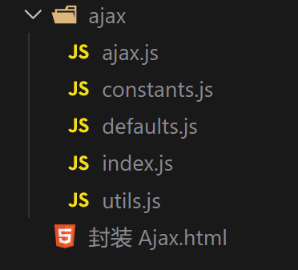

- ajax.js

```javascript
// 常量
import {
  HTTP_GET,
  CONTENT_TYPE_FORM_URLENCODED,
  CONTENT_TYPE_JSON
} from './constants.js';

// 工具函数
import {
  serialize,
  addURLData,
  serializeJSON
} from './utils.js';

// 默认参数
import DEFAULTS from './defaults.js';

// Ajax 类
class Ajax {
  constructor(url, options) {
    this.url = url;
    this.options = Object.assign({}, DEFAULTS, options);

    // 初始化
    this.init();
  }

  // 初始化
  init() {
    const xhr = new XMLHttpRequest();

    this.xhr = xhr;

    // 绑定响应事件处理程序
    this.bindEvents();

    xhr.open(this.options.method, this.url + this.addParam(), true);

    // 设置 responseType
    this.setResponseType();

    // 设置跨域是否携带 cookie
    this.setCookie();

    // 设置超时
    this.setTimeout();

    // 发送请求
    this.sendData();
  }

  // 绑定响应事件处理程序
  bindEvents() {
    const xhr = this.xhr;

    const {
      success,
      httpCodeError,
      error,
      abort,
      timeout
    } = this.options;

    // load
    xhr.addEventListener(
      'load',
      () => {
        if (this.ok()) {
          success(xhr.response, xhr);
        } else {
          httpCodeError(xhr.status, xhr);
        }
      },
      false
    );

    // error
    // 当请求遇到错误时，将触发 error 事件
    xhr.addEventListener(
      'error',
      () => {
        error(xhr);
      },
      false
    );

    // abort
    xhr.addEventListener(
      'abort',
      () => {
        abort(xhr);
      },
      false
    );

    // timeout
    xhr.addEventListener(
      'timeout',
      () => {
        timeout(xhr);
      },
      false
    );
  }

  // 检测响应的 HTTP 状态码是否正常
  ok() {
    const xhr = this.xhr;
    return (xhr.status >= 200 && xhr.status < 300) || xhr.status === 304;
  }

  // 在地址上添加数据
  addParam() {
    const {
      params
    } = this.options;

    if (!params) return '';

    return addURLData(this.url, serialize(params));
  }

  // 设置 responseType
  setResponseType() {
    this.xhr.responseType = this.options.responseType;
  }

  // 设置跨域是否携带 cookie
  setCookie() {
    if (this.options.withCredentials) {
      this.xhr.withCredentials = true;
    }
  }

  // 设置超时
  setTimeout() {
    const {
      timeoutTime
    } = this.options;

    if (timeoutTime > 0) {
      this.xhr.timeout = timeoutTime;
    }
  }

  // 发送请求
  sendData() {
    const xhr = this.xhr;

    if (!this.isSendData()) {
      return xhr.send(null);
    }

    let resultData = null;
    const {
      data
    } = this.options;

    // 发送 FormData 格式的数据
    if (this.isFormData()) {
      resultData = data;
    } else if (this.isFormURLEncodedData()) {
      // 发送 application/x-www-form-urlencoded 格式的数据

      this.setContentType(CONTENT_TYPE_FORM_URLENCODED);
      resultData = serialize(data);
    } else if (this.isJSONData()) {
      // 发送 application/json 格式的数据

      this.setContentType(CONTENT_TYPE_JSON);
      resultData = serializeJSON(data);
    } else {
      // 发送其他格式的数据

      this.setContentType();
      resultData = data;
    }

    xhr.send(resultData);
  }

  // 是否需要使用 send 发送数据
  isSendData() {
    const {
      data,
      method
    } = this.options;

    if (!data) return false;

    if (method.toLowerCase() === HTTP_GET.toLowerCase()) return false;

    return true;
  }

  // 是否发送 FormData 格式的数据
  isFormData() {
    return this.options.data instanceof FormData;
  }

  // 是否发送 application/x-www-form-urlencoded 格式的数据
  isFormURLEncodedData() {
    return this.options.contentType
      .toLowerCase()
      .includes(CONTENT_TYPE_FORM_URLENCODED);
  }

  // 是否发送 application/json 格式的数据
  isJSONData() {
    return this.options.contentType.toLowerCase().includes(CONTENT_TYPE_JSON);
  }

  // 设置 Content-Type
  setContentType(contentType = this.options.contentType) {
    if (!contentType) return;

    this.xhr.setRequestHeader('Content-Type', contentType);
  }

  // 获取 XHR 对象
  getXHR() {
    return this.xhr;
  }
}

export default Ajax;
```

- constants.js

```javascript
// 常量
export const HTTP_GET = 'GET';
export const CONTENT_TYPE_FORM_URLENCODED = 'application/x-www-form-urlencoded';
export const CONTENT_TYPE_JSON = 'application/json';
```

- defaults.js

```javascript
// 常量
import {
  HTTP_GET,
  CONTENT_TYPE_FORM_URLENCODED
} from './constants.js';

// 默认参数
const DEFAULTS = {
  method: HTTP_GET,
  // 请求头携带的数据
  params: null,
  // params: {
  //   username: 'alex',
  //   age: 18
  // }
  // username=alex&age=18
  // 请求体携带的数据
  data: null,
  // data: {
  //   username: 'alex',
  //   age: 18
  // }
  // data: FormData 数据

  contentType: CONTENT_TYPE_FORM_URLENCODED,
  responseType: '',
  timeoutTime: 0,
  withCredentials: false,

  // 方法
  success() {},
  httpCodeError() {},
  error() {},
  abort() {},
  timeout() {}
};

export default DEFAULTS;
```

- index.js

```javascript
import Ajax from './ajax.js';

const ajax = (url, options) => {
  return new Ajax(url, options).getXHR();
};

const get = (url, options) => {
  return ajax(url, {
    ...options,
    method: 'GET'
  });
};

const getJSON = (url, options) => {
  return ajax(url, {
    ...options,
    method: 'GET',
    responseType: 'json'
  });
};

const post = (url, options) => {
  return ajax(url, {
    ...options,
    method: 'POST'
  });
};

export {
  ajax,
  get,
  getJSON,
  post
};
```

- utils.js

```javascript
// 工具函数

// 数据序列化成 urlencoded 格式的字符串
const serialize = param => {
  const results = [];

  for (const [key, value] of Object.entries(param)) {
    results.push(`${encodeURIComponent(key)}=${encodeURIComponent(value)}`);
  }

  // ['username=alex', 'age=18'];

  return results.join('&');
};

// 数据序列化成 JSON 格式的字符串
const serializeJSON = param => {
  return JSON.stringify(param);
};

// 给 URL 添加参数
// www.imooc.com?words=js&
const addURLData = (url, data) => {
  if (!data) return '';

  const mark = url.includes('?') ? '&' : '?';

  return `${mark}${data}`;
};

export {
  serialize,
  addURLData,
  serializeJSON
};
```

- Ajax.html

```html
<!DOCTYPE html>
<html lang="en">

<head>
  <meta charset="UTF-8" />
  <title>封装 Ajax</title>
</head>

<body>
  <script type="module">

    import { ajax, get, getJSON, post } from './ajax/index.js';

    const url = 'https://www.imooc.com/api/http/search/suggest?words=js';
    const xhr = ajax(url, {
      method: 'GET',
      params: { username: 'alex' },
      data: {
        age: 18
      },
      responseType: 'json',
      // timeoutTime: 10,
      success(response) {
        console.log(response);
      },
      httpCodeError(err) {
        console.log('http code error', err);
      },
      error(xhr) {
        console.log('error', xhr);
      },
      abort(xhr) {
        console.log('abort', xhr);
      },
      timeout(xhr) {
        console.log('timeout', xhr);
      }
    });
    xhr.abort();
  </script>
</body>

</html>
```

## 3.10 使用Promise改造封装好的Ajax

- ajax.js

```javascript
// 常量
import {
  HTTP_GET,
  CONTENT_TYPE_FORM_URLENCODED,
  CONTENT_TYPE_JSON
} from './constants.js';

// 工具函数
import {
  serialize,
  addURLData,
  serializeJSON
} from './utils.js';

// 默认参数
import DEFAULTS from './defaults.js';

// Ajax 类
class Ajax {
  constructor(url, options) {
    this.url = url;
    this.options = Object.assign({}, DEFAULTS, options);

    // 初始化
    this.init();
  }

  // 初始化
  init() {
    const xhr = new XMLHttpRequest();

    this.xhr = xhr;

    // 绑定响应事件处理程序
    this.bindEvents();

    xhr.open(this.options.method, this.url + this.addParam(), true);

    // 设置 responseType
    this.setResponseType();

    // 设置跨域是否携带 cookie
    this.setCookie();

    // 设置超时
    this.setTimeout();

    // 发送请求
    this.sendData();
  }

  // 绑定响应事件处理程序
  bindEvents() {
    const xhr = this.xhr;

    const {
      success,
      httpCodeError,
      error,
      abort,
      timeout
    } = this.options;

    // load
    xhr.addEventListener(
      'load',
      () => {
        if (this.ok()) {
          success(xhr.response, xhr);
        } else {
          httpCodeError(xhr.status, xhr);
        }
      },
      false
    );

    // error
    // 当请求遇到错误时，将触发 error 事件
    xhr.addEventListener(
      'error',
      () => {
        error(xhr);
      },
      false
    );

    // abort
    xhr.addEventListener(
      'abort',
      () => {
        abort(xhr);
      },
      false
    );

    // timeout
    xhr.addEventListener(
      'timeout',
      () => {
        timeout(xhr);
      },
      false
    );
  }

  // 检测响应的 HTTP 状态码是否正常
  ok() {
    const xhr = this.xhr;
    return (xhr.status >= 200 && xhr.status < 300) || xhr.status === 304;
  }

  // 在地址上添加数据
  addParam() {
    const {
      params
    } = this.options;

    if (!params) return '';

    return addURLData(this.url, serialize(params));
  }

  // 设置 responseType
  setResponseType() {
    this.xhr.responseType = this.options.responseType;
  }

  // 设置跨域是否携带 cookie
  setCookie() {
    if (this.options.withCredentials) {
      this.xhr.withCredentials = true;
    }
  }

  // 设置超时
  setTimeout() {
    const {
      timeoutTime
    } = this.options;

    if (timeoutTime > 0) {
      this.xhr.timeout = timeoutTime;
    }
  }

  // 发送请求
  sendData() {
    const xhr = this.xhr;

    if (!this.isSendData()) {
      return xhr.send(null);
    }

    let resultData = null;
    const {
      data
    } = this.options;

    // 发送 FormData 格式的数据
    if (this.isFormData()) {
      resultData = data;
    } else if (this.isFormURLEncodedData()) {
      // 发送 application/x-www-form-urlencoded 格式的数据

      this.setContentType(CONTENT_TYPE_FORM_URLENCODED);
      resultData = serialize(data);
    } else if (this.isJSONData()) {
      // 发送 application/json 格式的数据

      this.setContentType(CONTENT_TYPE_JSON);
      resultData = serializeJSON(data);
    } else {
      // 发送其他格式的数据

      this.setContentType();
      resultData = data;
    }

    xhr.send(resultData);
  }

  // 是否需要使用 send 发送数据
  isSendData() {
    const {
      data,
      method
    } = this.options;

    if (!data) return false;

    if (method.toLowerCase() === HTTP_GET.toLowerCase()) return false;

    return true;
  }

  // 是否发送 FormData 格式的数据
  isFormData() {
    return this.options.data instanceof FormData;
  }

  // 是否发送 application/x-www-form-urlencoded 格式的数据
  isFormURLEncodedData() {
    return this.options.contentType
      .toLowerCase()
      .includes(CONTENT_TYPE_FORM_URLENCODED);
  }

  // 是否发送 application/json 格式的数据
  isJSONData() {
    return this.options.contentType.toLowerCase().includes(CONTENT_TYPE_JSON);
  }

  // 设置 Content-Type
  setContentType(contentType = this.options.contentType) {
    if (!contentType) return;

    this.xhr.setRequestHeader('Content-Type', contentType);
  }

  // 获取 XHR 对象
  getXHR() {
    return this.xhr;
  }
}

export default Ajax;
```

- constants.js

```javascript
// 常量
export const HTTP_GET = 'GET';
export const CONTENT_TYPE_FORM_URLENCODED = 'application/x-www-form-urlencoded';
export const CONTENT_TYPE_JSON = 'application/json';

export const ERROR_HTTP_CODE = 1;
export const ERROR_HTTP_CODE_TEXT = 'HTTP 状态码异常';
export const ERROR_REQUEST = 2;
export const ERROR_REQUEST_TEXT = '请求被阻止';
export const ERROR_TIMEOUT = 3;
export const ERROR_TIMEOUT_TEXT = '请求超时';
export const ERROR_ABORT = 4;
export const ERROR_ABORT_TEXT = '请求终止';
```

- defaults.js

```javascript
// 常量
import {
  HTTP_GET,
  CONTENT_TYPE_FORM_URLENCODED
} from './constants.js';

// 默认参数
const DEFAULTS = {
  method: HTTP_GET,
  // 请求头携带的数据
  params: null,
  // params: {
  //   username: 'alex',
  //   age: 18
  // }
  // username=alex&age=18
  // 请求体携带的数据
  data: null,
  // data: {
  //   username: 'alex',
  //   age: 18
  // }
  // data: FormData 数据

  contentType: CONTENT_TYPE_FORM_URLENCODED,
  responseType: '',
  timeoutTime: 0,
  withCredentials: false,

  // 方法
  success() {},
  httpCodeError() {},
  error() {},
  abort() {},
  timeout() {}
};

export default DEFAULTS;
```

- index.js

```javascript
import Ajax from './ajax.js';
// 常量
import {
  ERROR_HTTP_CODE,
  ERROR_REQUEST,
  ERROR_TIMEOUT,
  ERROR_ABORT,
  ERROR_HTTP_CODE_TEXT,
  ERROR_REQUEST_TEXT,
  ERROR_TIMEOUT_TEXT,
  ERROR_ABORT_TEXT
} from './constants.js';

const ajax = (url, options) => {
  // return new Ajax(url, options).getXHR();
  let xhr;
  const p = new Promise((resolve, reject) => {
    xhr = new Ajax(url, {
      ...options,
      ...{
        success(response) {
          resolve(response);
        },
        httpCodeError(status) {
          reject({
            type: ERROR_HTTP_CODE,
            text: `${ERROR_HTTP_CODE_TEXT}: ${status}`
          });
        },
        error() {
          reject({
            type: ERROR_REQUEST,
            text: ERROR_REQUEST_TEXT
          });
        },
        abort() {
          reject({
            type: ERROR_ABORT,
            text: ERROR_ABORT_TEXT
          });
        },
        timeout() {
          reject({
            type: ERROR_TIMEOUT,
            text: ERROR_TIMEOUT_TEXT
          });
        }
      }
    }).getXHR();
  });

  p.xhr = xhr;
  p.ERROR_HTTP_CODE = ERROR_HTTP_CODE;
  p.ERROR_REQUEST = ERROR_REQUEST;
  p.ERROR_TIMEOUT = ERROR_TIMEOUT;
  p.ERROR_ABORT = ERROR_ABORT;

  return p;
};

const get = (url, options) => {
  return ajax(url, {
    ...options,
    method: 'GET'
  });
};

const getJSON = (url, options) => {
  return ajax(url, {
    ...options,
    method: 'GET',
    responseType: 'json'
  });
};

const post = (url, options) => {
  return ajax(url, {
    ...options,
    method: 'POST'
  });
};

export {
  ajax,
  get,
  getJSON,
  post
};
```

- utils.js

```javascript
// 工具函数

// 数据序列化成 urlencoded 格式的字符串
const serialize = param => {
  const results = [];

  for (const [key, value] of Object.entries(param)) {
    results.push(`${encodeURIComponent(key)}=${encodeURIComponent(value)}`);
  }

  // ['username=alex', 'age=18'];

  return results.join('&');
};

// 数据序列化成 JSON 格式的字符串
const serializeJSON = param => {
  return JSON.stringify(param);
};

// 给 URL 添加参数
// www.imooc.com?words=js&
const addURLData = (url, data) => {
  if (!data) return '';

  const mark = url.includes('?') ? '&' : '?';

  return `${mark}${data}`;
};

export {
  serialize,
  addURLData,
  serializeJSON
};
```

- Ajax.html

```html
<!DOCTYPE html>
<html lang="en">

<head>
  <meta charset="UTF-8" />
  <title>使用 Promise 改造封装好的 Ajax</title>
</head>

<body>
  <script type="module">
    import { ajax, get, getJSON, post } from './ajax/index.js';

      const url = 'https://www.imooc.com/api/http/search/suggest?words=js';

      const p = getJSON(url, {
        params: { username: 'alex' },
        data: { age: 18 }
        // timeoutTime: 10
        // success(){},error(){}
      });
      p.xhr.abort();

      const { ERROR_HTTP_CODE, ERROR_REQUEST, ERROR_TIMEOUT, ERROR_ABORT } = p;

      p.then(repsonse => {
        console.log(repsonse);
      }).catch(err => {
        // console.log(err);
        switch (err.type) {
          case ERROR_HTTP_CODE:
            console.log(err.text);
            break;
          case ERROR_REQUEST:
            console.log(err.text);
            break;
          case ERROR_TIMEOUT:
            console.log(err.text);
            break;
          case ERROR_ABORT:
            console.log(err.text);
            break;
        }
      });
    </script>
</body>

</html>
```

## 3.11 多个Ajax请求的并发执行

当我们发送多个 Ajax 请求并且要并发执行的时候，应该满足：多个响应都成功了才成功，只要有一个不成功那么就失败，所以可以这么做：

```javascript
import {
    getJSON
} from './ajax/index.js';

const menuURL = 'https://www.imooc.com/api/mall-PC/index/menu';
const adURL = 'https://www.imooc.com/api/mall-PC/index/ad';

const loadingPageEl = document.getElementById('loading-page');
const adEl = document.getElementById('ad');
const menuEl = document.getElementById('menu');

const p1 = getJSON(menuURL)
    .then(repsonse => {
        let html = '';

        for (const item of repsonse.data) {
            html += `
        <li class="menu-item" data-key="${item.key}">
          <span>${item.title}</span>
          <div class="menu-content">
            <p></p>
          </div>
        </li>
      `;
        }

        menuEl.innerHTML = html;
    })
    .then(() => {
        const items = menuEl.querySelectorAll('.menu-item');

        for (const item of items) {
            item.addEventListener(
                'mouseenter',
                () => {
                    if (item.dataset.done === 'done') return;

                    getJSON(
                            `https://www.imooc.com/api/mall-PC/index/menu/${item.dataset.key}`
                        )
                        .then(repsonse => {
                            item.dataset.done = 'done';

                            let html = '';

                            for (const item of repsonse.data) {
                                html += `<p>${item.title}</p>`;
                            }

                            item.querySelector('.menu-content').innerHTML = html;
                        })
                        .catch(err => {
                            console.log(err);
                        });
                },
                false
            );
        }
    })
    .catch(err => {
        console.log(err);
    });

const p2 = getJSON(adURL)
    .then(response => {
        let html = '';
        for (const item of response.data) {
            html += ``;
        }
        adEl.innerHTML = html;
    })
    .catch(err => {
        console.log(err);
    });

Promise.all([p1, p2]).then(() => {
    // IE10 开始支持
    loadingPageEl.classList.add('none');
    // loadingPageEl.classList.remove('none');
});
```

# 四、Axios

[Axios 中文文档 | Axios 中文网 | Axios 是一个基于 promise 的网络请求库，可以用于浏览器和 node.js (axios-http.cn)](https://www.axios-http.cn/)（具体内容请参照文档！！！）

## 4.1 Axiso基本用法

### 4.1.1 引入Axiso

`<script src="https://cdn.jsdelivr.net/npm/axios/dist/axios.min.js"></script>`

### 4.1.2 使用Axiso

- 请求体为 JSON 格式

```javascript
 axios(url, {
     method: 'post',
     // 请求头信息
     headers: {
         'Content-Type': 'application/json'
     },
     // 请求头数据
     params: {
         usrname: 'alex'
     },
     // 请求体数据
     data: {
         age: 18,
         sex: 'male'
     },
     // 超时时间（毫秒）
     timeout: 10000,
     // 是否跨域携带 Cookie
     withCredentials: true
 }).then(response => {
     console.log(response);
     console.log(response.data);
     console.log(response.status);
     console.log(response.statusText);
 }).catch(err => {
     console.log(err);
 })
```

- 请求体为 名值对 形式

```javascript
 axios(url, {
     method: 'post',
     // 请求头信息
     headers: {
         'Content-Type': 'application/x-www-form-urlencoded'
     },
     // 请求头数据
     params: {
         usrname: 'alex'
     },
     // 请求体数据
     data: 'age=18&sex=male',
     // 超时时间（毫秒）
     timeout: 10000,
     // 是否跨域携带 Cookie
     withCredentials: true
 }).then(response => {
     console.log(response);
     console.log(response.data);
     console.log(response.status);
     console.log(response.statusText);
 }).catch(err => {
     console.log(err);
 })
```

- Axios 提供了 get 方法

```javascript
axios.get(url, {
    params: {
        usrname: 'alex',
        age: 18
    },
     timeout: 10000,
     withCredentials: true
}).then(response => {
    console.log(response.data);
}).catch(err => {
    console.log(err);
})
```

- Axios 提供了 post 方法

名值对形式

```javascript
axios.post(url, 
  'username=alex&age=18'
).then(response => {
    console.log(response.data);
}).catch(err => {
    console.log(err);
})
```

JSON 格式

```javascript
axios.post(url, {
    usrname: 'alex',
    age: 18
}).then(response => {
    console.log(response.data);
}).catch(err => {
    console.log(err);
})
```

发起多个并发请求

```javascript
function getUserAccount() {
    return axios.get('/user/12345');
}

function getUserPermissions() {
    return axios.get('/user/12345/permissions');
}

Promise.all([getUserAccount(), getUserPermissions()])
    .then(function (results) {
    const acct = results[0];
    const perm = results[1];
});
```

> 注意：通过 Axios 得到的响应 JSON 数据会自动转换为 JS 数据类型的！

# 五、Fetch

Fetch 是 Ajax 的一种替代方案，它是基于 Promise 的。

`fetch()`是 XMLHttpRequest 的升级版，用于在 JavaScript 脚本里面发出 HTTP 请求，浏览器原生提供这个对象！

[使用 Fetch - Web API 接口参考 | MDN (mozilla.org)](https://developer.mozilla.org/zh-CN/docs/Web/API/Fetch_API/Using_Fetch)

目前，Ajax 的兼容性比 Fetch 要好，所以目前了解即可！

```javascript
// fetch() 调用后返回 Promise 对象
const url = 'https://www.imooc.com/api/http/search/suggest?words=j
// fetch 返回数据：
// body: (...)
// bodyUsed: false
// ok: true
// status: 200
// statusText: "OK"
// type: "cors"
// url: "https://www
const fd = new FormData();
fd.append('username', 'alex');
// 第二个参数是对象，用来配置 fetch
fetch(url, {
    method: 'post',
    // 通过请求体携带数据：
    // body: null
    // body: 'username=alex&age=18',
    // body: JSON.stringify({ username: 'alex' })
    // 表单数据
    body: fd,
    // headers: {
    //   'Content-Type': 'application/x-www-form-urlencoded'
    //   'Content-Type': 'application/json'
    // }
    // 模式
    // cors：跨域资源共享
    mode: 'cors'
    // 跨域是否携带 Cookie，include：包含
    // credentials:'include'
  })
  .then(response => {
    console.log(respons
    // body/bodyUsed
    // body 只能读一次，读过之后就不让再读了，bodyUsed: false 变为 t
    // ok
    // 如果为 true，表示可以读取数据，不用再去判断 HTTP 状
    if (response.ok) {
      return response.json();
      // 设置用字符串格式返回
      // return response.text();
    } else {
      throw new Error(`HTTP CODE 异常 ${response.status}`);
    }
  })
  .then(data => {
    // 读取数据
    console.log(data);
  })
  .catch(err => {
    console.log(err);
  });
```

