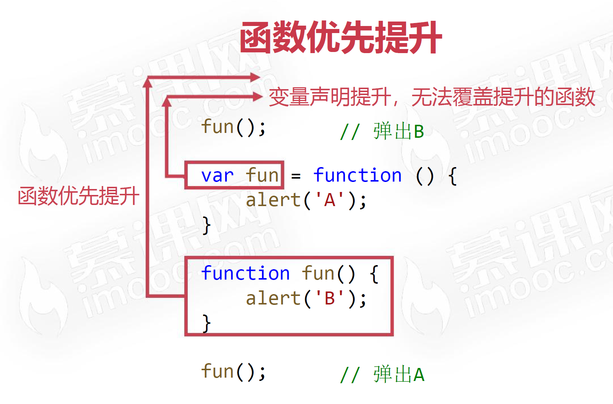
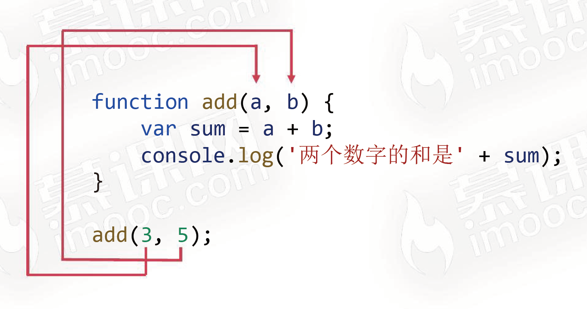
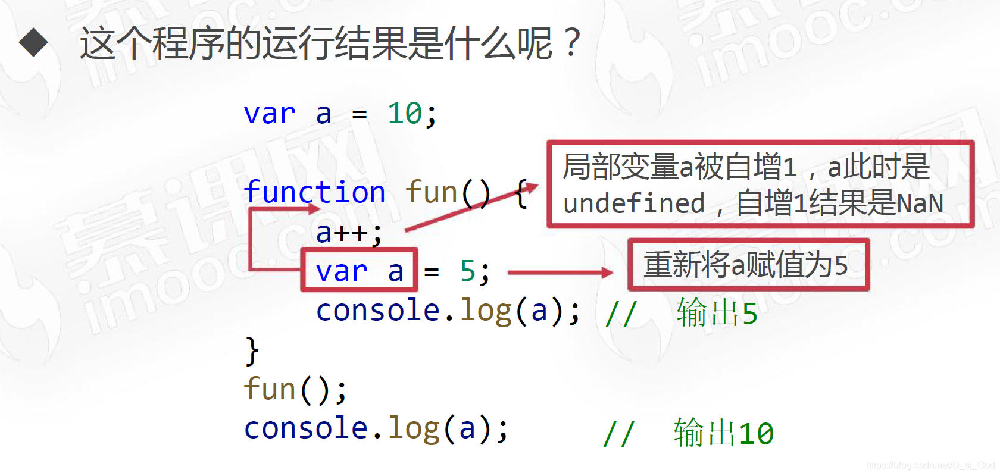
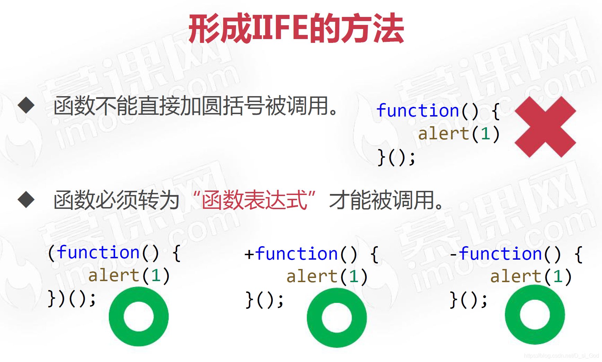

# 【JS函数】

> 原创内容，转载请注明出处！

# 一、什么是函数

函数就是语句的封装，可以让这些代码方便地被复用。

函数具有 “一次定义，多次调用” 的优点。

使用函数，可以简化代码，让代码更具有可读性。

# 二、函数的定义

和变量类似，函数必须先定义然后才能使用。

使用 `function` 关键字定义函数。

> function：函数、功能。

【方式 1 **函数声明**】

```javascript
function fun() {
    // 函数语句块
}
```

- `function`：表示定义函数
- `fun`：函数名（必须符合 JS 标识符命名规则）
- `()`：圆括号中是形参列表，即使没有形参，也必须书写圆括号
- `{}`：花括号内为函数语句块

【方式 2 **函数表达式**】

```javascript
var fun = function() {
    // 函数语句块
}
```

- `function(){}`：匿名函数
- `()`：圆括号中是形参列表，即使没有形参，也必须书写圆括号
- `{}`：花括号内为函数语句块
- `fun`：函数变量

# 三、函数的调用

执行函数体中的所有语句，就称为 “调用函数”。

调用函数非常简单，只需要在函数名字后书写圆括号对即可。

```javascript
fun();	// 调用函数
```

【小案例】

```javascript
// 定义函数，定义的函数是不会被立即执行的
function fun() {
    console.log('你好');
    console.log('今天天气真好');
}
// 函数必须要等到调用的时候才能被执行
fun();
fun();
fun();
// 执行了三次
```

 # 四、函数声明的提升

和变量声明提升类似，函数声明也可以被提升。

```javascript
fun();
// 在预解析阶段会被提升
function fun() {
    alert("函数被执行");
}
```

效果相当于：

```javascript
function fun() {
    alert("函数被执行");
}
fun();
```

【函数表达式不能被提升】

```javascript
fun();	// 报错！
var fun = function() {
    alert("函数不能被执行");
}
```

> 解释：函数表达式不能被提升的本质原因是函数表达式定义的其实是个变量，只不过是把函数赋给这个变量，而变量的提升只提升定义，不提升赋值！

# 五、函数优先提升



```javascript
fun(); // B

var fun = function () {
    alert('A');
}

function fun() {
    alert('B');
}

fun(); // A
```

效果相当于：

```javascript
function fun() {
    alert('B');
}

var fun;

fun(); // B

fun = function () {
    alert('A');
}

fun(); // A
```

# 六、函数的参数和返回值

## 6.1 函数的参数

参数是函数内的一些待定值，在调用函数时，必须传入这些参数的具体值。

函数的参数可多可少，函数可以没有参数，也可以有多个参数，多个参数之间需要用逗号隔开。

```javascript
// 形参
function add(a, b) {
    var sum = a + b;
    console.log('a + b = ' + sum);
}
// 实参
add(3, 5);
```

- 圆括号中定义 “形式参数”
- 调用函数时传入 “实际参数”

> “形式参数” 和 “实际参数” 是彼此独立的，除了传递值之外，互不干扰！

### 6.1.1 “形实结合”



### 6.1.2 形参和实参个数不同的情况


### 6.1.3 arguments

函数内 `arguments` 表示它接收到的实参列表，它是一个类数组对象。

类数组对象：所有属性均为从 `0` 开始的自然数序列，并且有 `length` 属性，和数组类似可以用方括号书写下标访问对象的某个属性值，但是**不能调用数组的方法**。

```javascript
function fun() {
    console.log(arguments);		// 11 22 33 44
    console.log(arguments[0]);	// 11
    console.log(arguments[1]);	// 22
    console.log(arguments[9]);	// undefined
}
fun(11, 22, 33, 44);
```

【小案例】

JS 本身没有函数的重载，但是可以借助 arguments 模拟 “函数重载”。

> 以下例子是一个典型的“函数重载”，参数个数不同形成 “重载”。

```javascript
function fun() {
    if (arguments.length == 0) {
        console.log(0);
    } else if (arguments.length == 1) {
        console.log(1);
    } else {
        console.log(2);
    }
}
fun(); // 0
fun(1); // 1
fun(1, 2); // 2
```

## 6.2 函数的返回值

函数体内可以使用 `return` 关键字表示 “函数的返回值”。

```javascript
function sum(a, b) {
    return a + b;	// 函数的返回值
}
var result = sum(3, 5);	// 函数的返回值可以被变量接收
```

调用一个有返回值的函数，可以被当做一个普通值，从而可以出现在任何可以书写值的地方。

```javascript
function sum(a, b) {
    return a + b;
}
var result = sum(3, 4) * sum(2, 6);
```

```javascript
function sum(a, b) {
    return a + b;
}
var result = sum(3, sum(4, 5));	// 函数嵌套
```

遇见 `return` 即退出函数。

结合 if 语句的时候，往往不需要写 else 分支了。

```javascript
// 判断一个数字是否为偶数
function checkEven(n) {
    if (n % 2 == 0) {
        return true;
    }
    return false;
}
var result = checkEven(6);
console.log(result);	// true
```

# 七、JS内置 sort() 方法

数组排序可以使用 `sort()` 方法，这个方法的参数又是一个函数。

```javascript
var arr = [33, 22, 55, 11];
arr.sort(function(a, b){});
```

这个函数中 a、b 分别表示数组中靠前和考后的项，如果需要将它们交换位置，则返回正整数；否则就返回负数。

```javascript
// 从小到大排序
var arr = [33, 22, 55, 11];
arr.sort(function(a, b) {
    if (a > b) {
        return 1;
    } else {
        return -1;
    }
});
console.log(arr);	// [11, 22, 33, 55]
```

对以上算法的优化：

```javascript
// 从小到大排序
var arr = [33, 22, 55, 11];
arr.sort(function(a, b) {
	return a - b;
});
console.log(arr);	// [11, 22, 33, 55]
```

# 八、递归

函数的内部语句可以调用这个函数自身，从而发起对函数的一次迭代。在新的迭代中，又会执行调用函数自身的语句，从而又产生一次迭代。当函数执行到某一次时，不再进行新的迭代，函数被一层一层返回，函数被递归。

> 函数自己调用自己！

递归是一种较为高级的编程思想，它把一个大型复杂的问题层层转化为一个与原问题相似的规模较小的问题来求解。

【小案例：求阶乘】

```javascript
// n! 的本质：n * (n-1)!
function factorial(n) {
    // 递归的出口
    if (n == 1) {
        return 1;
    }
    return n * factorial(n - 1);
}
```

> 递归技巧：
>
> 1. 分析问题，抽象出具体的数学模型
> 2. 分析数学模型是否有 “规律性”
> 3. 找到基本的 “规律”（比如：`n!` 的本质：`n * (n-1)!`）
> 4. 将 “规律” 转换为代码（比如：`return n * factorial(n - 1);`）
> 5. 找到 “出口” 也就是临界情况（比如：`1! == 1`）
> 6. 将 “出口” 转化为代码（比如：`if (n == 1) { return 1; }`）
> 7. 组合代码形成递归算法

# 九、实现深克隆

使用递归思想，整体思路和浅克隆类似，但稍微进行一些改动：如果遍历到的项是基本类型值，则直接推入结果数组；如果遍历到的项是数组，则重复执行浅克隆的操作。

```javascript
var arr1 = [33, 44, 11, 22, [77, 88, [33, 44]]];

function deepClone(arr) {
    // 结果数组，“每一层”都有一个结果数组
    var result = [];
    // 遍历数组的每一项
    for (var i = 0; i < arr.length; i++) {
        // 类型判断，如果遍历到的项为数组
        if (Array.isArray(arr[i])) {
            // 递归
            result.push(deepClone(arr[i]));
        } else {
            // 如果遍历到的项是基本类型，就直接推入到结果数组中
            result.push(arr[i]);
        }
    }
    // 返回结果数组
    return result;
}

var arr2 = deepClone(arr1);
console.log(arr1); // [33, 44, 11, 22, [77, 88, [33, 44]]]
console.log(arr2); // [33, 44, 11, 22, [77, 88, [33, 44]]]
console.log(arr1[4] == arr2[4]); // false
```

# 十、全局变量和局部变量

## 10.1 变量作用域

JS 是函数级作用域编程语言：变量只在其所定义时所在的 function 内部有意义。

## 10.2 局部变量

```javascript
function fun() {
    var a = 10;
}

fun();
console.log(a);	// 报错
```

> 变量 a 是在 fun 函数中被定义的，所以变量 a 只在 fun 函数内部有定义，fun 函数就是 a 的 “作用域”，变量 a 被称为 “局部变量”。

## 10.3 全局变量

如果不将变量定义在任何函数的内部，此时这个变量就是全局变量，它在任何函数内部都可以被访问和更改。

## 10.4 遮蔽效应

如果函数中也定义了和全局变量同名的变量，则函数内的局部变量会将全局的变量进行 “遮蔽”。

```javascript
var a = 10;
function fun() {
    var a = 5;
    a++;
    console.log(a);	// 6
}
fun();
console.log(a);	// 10
```

## 10.5 注意考虑变量声明提升的情况



## 10.6 形参也是局部变量


## 10.7 作用域链

先来认识函数的嵌套：一个函数内部也可以定义一个函数。和局部变量类似，定义在一个函数内部的函数是局部变量。

```javascript
function fun() {
    // 局部函数
    function inner() {
        console.log('你好');
    }
    // 调用局部函数
    inner();
}
// 调用外部函数
fun();
```

在函数嵌套中，变量会从内到外逐层寻找它的定义。

```javascript
var a = 10;
var b = 20;
function fun() {
    var c = 40;
    function inner() {
    	var a = 40;
        var d = 50;
        console.log(a, b, c, d);	// 40 20 40 50
    }
    inner();
}
fun();
```

## 10.8 不加 var 将定义全局变量

在初次给变量赋值时，如果没有加 `var`，则将定义全局变量。

```javascript
function fun() {
    a = 3;
}
fun();
console.log(a);	// 3
```

> 没有特殊情况，一律都要记得加 `var`。

# 十一、闭包

```javascript
// 定义一个全局变量
var name = 'ABC';

// 创建一个函数
function fun() {
    // 定义局部变量
    var name = '周吉瑞';
    // 返回一个局部函数
    return function() {
        console.log(name);
    };
}

// 调用外部函数，就能得到内部函数，用变量 inn 来接收
var inn = fun();
// 执行 inn 函数，就相当于在 fun 函数的外部，执行了内部函数
inn(); // "周吉瑞"
```

## 11.1 什么是闭包

JS 中函数会产生闭包。闭包是函数本身和该函数声明时所处的环境状态的组合。

函数能够 “记忆住” 其定义时所处的环境，**即使函数不在其定义的环境中被调用，也能访问定义时所处环境的变量。**

## 11.2 观察闭包现象

**在 JS 中，每次创建函数时都会创建闭包。**

**但是，闭包特性往往需要将函数 “换一个地方” 执行，才能被直观的体现出来。**

## 11.3 闭包非常实用

闭包很有用，因为它允许我们将数据与操作该数据的函数关联起来，这与 “面向对象编程” 有少许相似之处。

闭包的功能：记忆性、模拟私有变量。

### 11.3.1 闭包用途1 - 记忆性

当闭包产生时，函数所处环境的状态会始终保持在内存中，不会在外层函数调用后自动清除。这就是闭包的记忆性。

【闭包的记忆性举例】

创建体温检测函数 checkTemp(n)，可以检查体温 n 是否正常，函数会返回布尔值。

但是，不同的小区有不同的体温检测标准，比如 A 小区体温合格线是 37.1℃，而 B 小区体温合格线是 37.3℃，应该怎么编程呢？

```javascript
function createCheckTemp(standardTemp) {
    function checkTemp(n) {
        if (n <= standardTemp) {
            alert('你的体温正常');
        } else {
            alert('你的体温偏高');
        }
    }
    return checkTemp;
}

// 创建一个 checkTemp 函数，它以 37.1 度为标准线
var checkTemp_A = createCheckTemp(37.1);

// 再创建一个 checkTemp 函数， 它以 37.3 度为标准线
var checkTemp_B = createCheckTemp(37.3);

checkTemp_A(37.2);	// "你的体温偏高"
checkTemp_A(37.0);	// "你的体温正常"
checkTemp_B(37.2);	// "你的体温正常"
checkTemp_B(37.6);	// "你的体温偏高"
```

### 11.3.2 闭包用途2 - 模拟私有变量

题目：请定义一个变量 a，要求是能保证这个 a 只能被进行指定操作（如：加1、乘2），而不能进行其他操作，应该怎么编程呢？

> 即：让变量变得安全，私有化！
>
> 在 Java、C++ 等语言中，有私有属性的概念，但是 JS 中只能用闭包来模拟。

```javascript
// 封装一个函数，这个函数的功能就是私有化变量
function fun() {
    // 定义一个局部变量a
    var a = 0;
    // 返回一个对象
    return {
        getA: function () {
            return a;
        },
        add: function () {
            a++;
        },
        pow: function () {
            a *= 2;
        }
    };
}

var obj = fun();
// 如果想在 fun 函数外面使用变量 a，唯一的方法就是调用 getA() 方法
console.log(obj.getA()); // 0
// 想让变量 a 进行加 1 操作
obj.add();
console.log(obj.getA()); // 1
obj.pow();
console.log(obj.getA()); // 2
```

### 11.3.3 使用闭包的注意点

不能滥用闭包！否则会造成网页的性能问题，严重时可能导致 “内存泄漏”。

所谓 “内存泄漏” 就是指程序中已经动态分配的内存由于某种原因未释放或无法释放。

> 目前，Chrome 等比较先进的浏览器很少发生内存泄漏。

### 11.3.4 闭包的一道面试题

```javascript
function addCount() {
    var count = 0;
    return function() {
        count = count + 1;
        console.log(count);
    };
}
var fun1 = addCount();
var fun2 = addCount();
fun1();	// 1
fun2();	// 1
fun2();	// 2
fun1();	// 2
```

# 十二、立即执行函数 IIFE

IIFE 立即调用函数表达式，是一种特殊的 JS 函数写法，一旦被定义，就立即被调用。

```javascript
(function () {
    // 函数体语句
})();
```

## 12.1 形成 IIFE 的方法




> 常用 `()` 来将函数转为 “函数表达式”。

## 12.2 IIFE的作用1 - 为变量赋值

```javascript
var age = 12;
var sex = '男';
var title = (function () {
    if (age < 18) {
        return '小朋友';
    } else {
        if (sex == '男') {
            return '先生';
        } else {
            return '女士';
        }
    }
})();
```

## 12.3 IIFE的作用2 - 将全局变量变为局部变量

先看一个问题：

```javascript
var arr = [];
for (var i = 0; i < 5; i++) {
    arr.push(function() {
        alert(i);
    });
}
arr[2](); // 弹出5

/*
解释：因为 arr 数组中的每个元素都是 function(){alert(i)} 这个函数，
arr[2] ——> function(){alert(i)}
arr[2](); ——> function(){alert(i)}()
由于 i 最终确定为 5；
*/
```

IIFE 可以在一些场合（如 for 循环中）将全局变量变为局部变量，语法显得紧凑。

```javascript
var arr = [];
for (var i = 0; i < 5; i++) {
    (function (i) {
        arr.push(function () {
            alert(i);
        });
    })(i);
}
arr[2]();	// 弹出2

/*
解释：由于 实参 与 形参 互不干扰，所以此处的 i 对于 第一个 function 是递增的。
而由于 第一个function 中的 i 对于 第二个function 而言满足其闭包，所以 第二个function 的 i 也是递增的。
*/
```

