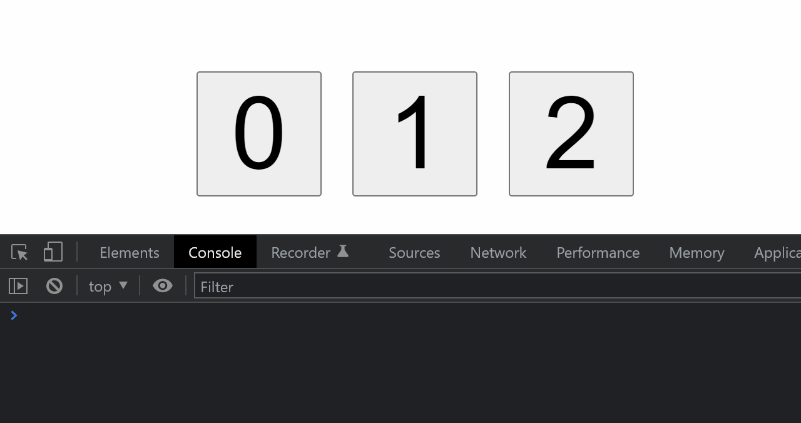
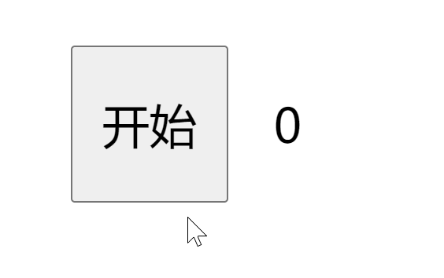
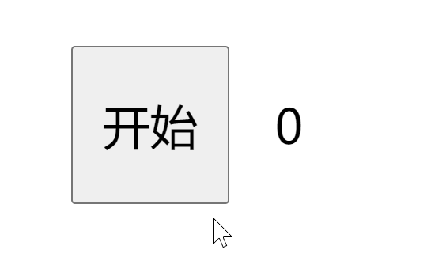

# 【ES6基础入门】

> 原创内容，转载请注明出处！

# 一、初始 ES6

## 1.1 ES6 简介

ES6 = ECMAScript 这门标准的第 6 代版本（2015）。

- ECMAScript 是语言的标准
- 6 是版本号

ECMA：欧洲计算机制造商协会

具体内容：语法 + API

历史版本：ES1——>3、ES5——>6（ES4 被废弃了）

我们目前使用 JS 的大部分内容都是 ES3 **的部分**。

ES 与 JS 的关系：`JavaScript(浏览器端) = ESMAScript(语法+API) + DOM + BOM`

 ES6 的兼容性：

- 主流浏览器的最新版本几乎都全部支持 ES6
- IE 老版本等不支持的浏览器，可以使用 Babel 转码
- **总之，请放心大胆地使用 ES6**

## 1.2 let 和 const

简单解释：

- `let` 用于声明变量（对应之前的 `var`）
- `const` 用于声明常量（之前没有常量的概念）

### 1.2.1 变量与常量

变量：初始化后可以重新赋值的量

常量：初始化后不可以重新赋值的量

### 1.2.2 const

**（1）为什么需要 const**

因为某些量的值是一直固定的，不需要也不能被修改，如果被修改就会报错。

**（2）const 注意事项**

- 使用 const 声明常量，一但声明就**必须立即初始化**，不能分开赋值

  ```javascript
  const name = 'jerry'; √
  -------------------------
  const name;
  name = 'jerry'; ×
  ```

- const 声明的常量，允许在不重新赋值的情况下修改它的值

  ```javascript
  // 基本数据类型不适用
  -------------------
  // 引用数据类型
  const person = {
      username: 'jerry'
  };
  
  person.username = 'zjr'; √
  ```

### 1.2.3 什么时候用 let，什么使用用 const

原则：如果不知道用什么的时候，就用 const

原因：如果应该是常量，那么刚好符合需求。如果应该是变量，那么后来报错时，再来改为变量也为时不晚。同时，一开始就设置为常量还会避免真的需要为常量时，该值在后来被意外修改的情况。

## 1.3 let、const 与 var 的区别

- 重复声明
- 变量提升
- 暂时性死区
- window 对象的属性和方法（全局作用域中）
- 块级作用域

> 下面以 let 与 var 的对比来说明，const 与 let 同理

### 1.3.1 重复声明

```javascript
var a = 10;
var a = 24;
console.log(a);		// 24
```

```javascript
let a = 10;
let a = 24;
console.log(a);		// 报错
```

```javascript
function func(a) {
    var a = 1;
    console.log(a);		// 1
}
func(24);
```

```javascript
function func(a) {
    let a = 1;
    console.log(a);		// 报错
}
func(24);
```

### 1.3.2 变量提升

```javascript
console.log(a);		// undefined
var a = 24;
```

```javascript
console.log(a);		// 报错
let a = 24;
```

> 对于所有的变量和常量来说都应该遵循：**先声明后使用**的原则！

### 1.3.3 暂时性死区

只要作用域内存在 let、const，它们所声明的变量或常量就自动 “绑定” 这个区域，不再受到外部作用域的影响。

```javascript
let a = 2;
function func() {
    console.log(a);		// 报错
    let a = 1;
}
func();
```

```javascript
let a = 2;
function func() {
    console.log(a);		// 2
}
func();
```

**即：只要作用域内出现了同名的 let 或 const，那么就会去找这个量（向前找），如果找不到也不会跳去外部找，只会直接报错！**

> 只要我们遵守 “**先声明后使用**”，那么其实就基本不会遇到变量提升及暂时性死区问题。

### 1.3.4 window 对象的属性和方法（全局作用域中）

全局作用域中，`var` 声明的变量，`function` 声明的函数，会自动变成 window 对象的属性或方法。

```javascript
var age = 18;
function add() {}
console.log(window.age);			// 18
console.log(window.add === add);	// true
```

```javascript
let age = 18;
const add = function() {}
console.log(window.age);			// undefined
console.log(window.add === add);	// false
```

### 1.3.5 块级作用域

- var 没有块级作用域

```javascript
for (var i = 0; i < 3; i++) {
}
console.log(i);		// 3
```

- let、const 有块级作用域

```javascript
for (let i = 0; i < 3; i++) {
}
console.log(i);		// 报错
```

- 作用域链：内层作用域 ——> 外层作用域 ——> 全局作用域

- 块级作用域：除了对象 `{}`，函数 `{}`（函数作用域）之外的一切 `{}` 都属于块级作用域。

## 1.4 let 和 const 的应用

要求：在页面上显示三个按钮（1、2、3），点击任何一个按钮便显示该按钮对应的数字。

- 使用 var

```html
<!DOCTYPE html>
<html lang="en">
<head>
    <meta charset="UTF-8"/>
    <meta content="width=device-width, initial-scale=1.0" name="viewport"/>
    <meta content="ie=edge" http-equiv="X-UA-Compatible"/>
    <title>let 和 const 的应用</title>
    <style>
        body {
            padding: 50px 0 0 150px;
        }

        .btn {
            width: 100px;
            height: 100px;
            margin-right: 20px;
            font-size: 80px;
            cursor: pointer;
        }
    </style>
</head>
<body>
<button class="btn">0</button>
<button class="btn">1</button>
<button class="btn">2</button>

<script>
     var btns = document.querySelectorAll('.btn');

     for (var i = 0; i < btns.length; i++) {
       btns[i].addEventListener(
         'click',
         function () {
           console.log(i);
         },
         false
       );
     }
</script>
</body>
</html>
```


无论点击谁都是 3，这是因为 var 没有块级作用域，三个点击事件函数中的 i 都是同一个全局变量，最终 i 都为 3 了，所以固然都输出 3。


- 使用 var，同时利用闭包

```html
<!DOCTYPE html>
<html lang="en">
<head>
    <meta charset="UTF-8"/>
    <meta content="width=device-width, initial-scale=1.0" name="viewport"/>
    <meta content="ie=edge" http-equiv="X-UA-Compatible"/>
    <title>let 和 const 的应用</title>
    <style>
        body {
            padding: 50px 0 0 150px;
        }

        .btn {
            width: 100px;
            height: 100px;
            margin-right: 20px;
            font-size: 80px;
            cursor: pointer;
        }
    </style>
</head>
<body>
<button class="btn">0</button>
<button class="btn">1</button>
<button class="btn">2</button>

<script>
    var btns = document.querySelectorAll('.btn');

    for (var i = 0; i < btns.length; i++) {
        (function (index) {
            btns[index].addEventListener(
                'click',
                function () {
                    console.log(index);
                },
                false
            );
        })(i);
    }
</script>
</body>
</html>
```



三个点击事件函数中的 i 对应到三个闭包上，且闭包的 i 为函数参数（局部变量），分别是 0、1、2。


- 使用 let

```html
<!DOCTYPE html>
<html lang="en">
<head>
    <meta charset="UTF-8"/>
    <meta content="width=device-width, initial-scale=1.0" name="viewport"/>
    <meta content="ie=edge" http-equiv="X-UA-Compatible"/>
    <title>let 和 const 的应用</title>
    <style>
        body {
            padding: 50px 0 0 150px;
        }

        .btn {
            width: 100px;
            height: 100px;
            margin-right: 20px;
            font-size: 80px;
            cursor: pointer;
        }
    </style>
</head>
<body>
<button class="btn">0</button>
<button class="btn">1</button>
<button class="btn">2</button>

<script>
    let btns = document.querySelectorAll('.btn');

    for (let i = 0; i < btns.length; i++) {
        btns[i].addEventListener(
            'click',
            function () {
                console.log(i);
            },
            false
        );
    }
</script>
</body>
</html>
```


# 二、模板字符串

## 2.1 认识模板字符串

- 普通字符串：

```javascript
'字符串'
"字符串"
```

- 模板字符串：

```javascript
`字符串`
```

## 2.2 模板字符串与一般字符串的区别

- 对于普通用法**没有区别**

```javascript
const name1 = 'zjr';
const name2 = `zjr`;
console.log(name1, name2, name1 === name2);
// zjr zjr true
```

- 字符串拼接的**巨大区别**

```javascript
const person = {
    name: 'zjr',
    age: 18,
    sex: '男'
};

const info =
    '我的名字是：' + person.name +
    '，性别是：' + person.sex +
    '，今年：' + person.age + '岁';

console.log(info);

// 我的名字是：zjr，性别是：男，今年：18岁
```

```javascript
const person = {
    name: `zjr`,
    age: 18,
    sex: `男`
};

const info = `我的名字是：${person.name}，性别是：${person.sex}，今年：${person.age}岁`;

console.log(info);

// 我的名字是：zjr，性别是：male，今年：18岁
```

> 模板字符串最大的优势：方便注入！

## 2.3 模板字符串的注意事项

### 2.3.1 输出多行字符串

```javascript
// 一般字符串
const info = '第一行\n第二行';
console.log(info);
/*
第一行
第二行
*/


// 模板字符串
const info = `第一行
第二行`;	// 注意不能有缩进
console.log(info);
/*
第一行
第二行
*/
```

> 模板字符串中，所有的空格、换行或缩进都会被保存在输出中

### 2.3.2 输出 `` ` 和 `\` 等特殊字符

```javascript
const info = `\``;	// ```
const info = `\\`;	// `\`
const info = `""`;	// `""`
const info = `''`;	// `''`
```

### 2.3.3 模板字符串的注入

```javascript
const username = 'alex';
const person = {
    age: 18,
    sex: `male`
};
const getSex = function (sex) {
    return sex === `male` ? '男' : '女';
};

const info = `${username},${person.age + 2},${getSex(person.sex)}`;
console.log(info);

// alex,20,男
```

> 模板字符串的 `${}` 注入可以兼容几乎所有的值！
>
> 模板字符串、字符串、数值、布尔值、表达式、函数……（只要结果是个 “值” 即可）

## 2.4 模板字符串的应用

```javascript
<!DOCTYPE html>
<html lang="en">
<head>
    <meta charset="UTF-8"/>
    <title>模板字符串的应用</title>
    <style>
        body {
            padding: 50px 0 0 300px;
            font-size: 22px;
        }

        ul {
            padding: 0;
        }

        p {
            margin-bottom: 10px;
        }
    </style>
</head>
<body>
<p>学生信息表</p>
<ul id="list">
    <li style="list-style: none;">信息加载中……</li>
</ul>

<script>
    // 数据（此处只是模拟数据，后期是通过 Ajax 从后台获取）
    const students = [
        {
            username: 'Alex',
            age: 18,
            sex: 'male'
        },
        {
            username: 'ZhangSan',
            age: 28,
            sex: 'male'
        },
        {
            username: 'LiSi',
            age: 20,
            sex: 'female'
        }
    ];

    const list = document.getElementById('list');

    let html = '';

    for (let i = 0; i < students.length; i++) {
        html += `<li>我的名字是：${students[i].username},${students[i].sex},${students[i].age}</li>`;
    }

    list.innerHTML = html;
</script>
</body>
</html>
```


# 三、箭头函数

## 3.1 认识箭头函数

普通函数：

- `function 函数名() {}`
- `const 变量名 = function () {};`

箭头函数：

- `参数 => 函数体`

- `() => {}`

> 由于箭头函数是匿名函数，所以我们通常把它赋给一个变量

```javascript
const add = (x, y) => {
    return x + y;
};

console.log(add(1, 1));		// 2
```

## 3.2 箭头函数注意事项

### 3.2.1 单个参数

```javascript
const add = (x) => {
    return x + 1;
};

// 单个参数可以省略 ()
const add = x => {
    return x + 1;
};

// 无参数或0个参数不能省略 ()
const test = () => {
    return 1;
};
```

### 3.2.2 单行函数体

```javascript
const add = (x, y) => {
    return x + y;
};

// 单行函数体可以省略 return 和 {}，且一但省略就 return 和 {} 都要一起省略
const add = (x, y) => x + y; 
```

### 3.2.3 单行对象

```javascript
const add = (x, y) => {
    return {
        value: x + y
    };
};

// const add = (x, y) => {value: x + y};  报错！因为 {} 会产生歧义！
// () 可以将语句变为表达式，从而 {} 就可以被顺理成章解释为对象
const add = (x, y) => ({value: x + y});

// 数组就没有以上问题
const add = (x, y) => [x, y];
```

> 推荐：最好不要简写！

## 3.3 非箭头函数中的 this 指向

### 3.3.1 全局作用域中的 this 指向

```javascript
console.log(this);
// window
```

### 3.3.2 一般函数（非箭头函数）中的 this 指向

> 只有在函数调用的时候 this 指向才能确定，不调用的时候，不知道指向谁。
>
> this 指向和函数在哪儿没有关系，只和谁在调用有关。

```javascript
function add() {
    console.log(this);
}

add();	// window
// 在非严格模式下，this 其实是先指向 undefined，然后被自动转为了 window
```

```javascript
'use strict'	// 严格模式

function add() {
    console.log(this);
}

add();	// undefined
// 在严格模式下，this 为 undefined
```

```javascript
'use strict'	// 严格模式

function add() {
    console.log(this);
}

const calc = {
    add: add
};

calc.add();		// 上下文 this 为 calc

const adder = calc.add;
adder();		// 指向 undefined（非严格模式下指向 window）
```

## 3.4 箭头函数没有 this

> 箭头函数没有 this！

## 3.5 不适用箭头函数的场景

### 3.4.1 作为构造函数

因为箭头函数没有 this，而构造函数的核心就是 this。

### 3.4.2 需要 this 指向调用对象的时候

因为箭头函数没有 this，所以如果箭头函数中出现了 this，那么这个 this 就是外层的！

### 3.4.3 需要使用 arguments 的时候

箭头函数没有 arguments。

（这个问题有替代解决方案：剩余参数）

## 3.6 箭头函数的应用

> 主要应用就是：箭头函数没有 this 这一特性！

```html
<!DOCTYPE html>
<html lang="en">
<head>
    <meta charset="UTF-8"/>
    <title>箭头函数的应用</title>
    <style>
        body {
            padding: 50px 0 0 250px;
            font-size: 30px;
        }

        #btn {
            width: 100px;
            height: 100px;
            margin-right: 20px;
            font-size: 30px;
            cursor: pointer;
        }
    </style>
</head>
<body>
<button id="btn">开始</button>
<span id="result">0</span>

<script>
    const btn = document.getElementById('btn');
    const result = document.getElementById('result');

    const timer = {
        time: 0,
        start: function () {
            // 我们希望的 this 是 start 里的 this，因为这个 this 才会指向 time
            btn.addEventListener(
                'click',
                function () {
                    setInterval(function () {
                        console.log(this);	// window 计时器由于没有人去调用它，所以它的 this 是指向 window
                        this.time++;
                        result.innerHTML = this.time;
                    }, 1000);
                },
                false
            );
        }
    };

    timer.start();
</script>
</body>
</html>
```


---

```html
<!DOCTYPE html>
<html lang="en">
<head>
    <meta charset="UTF-8"/>
    <title>箭头函数的应用</title>
    <style>
        body {
            padding: 50px 0 0 250px;
            font-size: 30px;
        }

        #btn {
            width: 100px;
            height: 100px;
            margin-right: 20px;
            font-size: 30px;
            cursor: pointer;
        }
    </style>
</head>
<body>
<button id="btn">开始</button>
<span id="result">0</span>

<script>
    const btn = document.getElementById('btn');
    const result = document.getElementById('result');

    const timer = {
        time: 0,
        start: function () {
            // 我们希望的 this 是 start 里的 this，因为这个 this 才会指向 time
         	// 用 that 或 self 代替 this
            var that = this;
            btn.addEventListener(
                'click',
                function () {
                    setInterval(function () {
                        that.time++;
                        result.innerHTML = that.time;
                    }, 1000);
                },
                false
            );
        }
    };

    timer.start();
</script>
</body>
</html>
```


---

```html
<!DOCTYPE html>
<html lang="en">
<head>
    <meta charset="UTF-8"/>
    <title>箭头函数的应用</title>
    <style>
        body {
            padding: 50px 0 0 250px;
            font-size: 30px;
        }

        #btn {
            width: 100px;
            height: 100px;
            margin-right: 20px;
            font-size: 30px;
            cursor: pointer;
        }
    </style>
</head>
<body>
<button id="btn">开始</button>
<span id="result">0</span>

<script>
    const btn = document.getElementById('btn');
    const result = document.getElementById('result');

    const timer = {
        time: 0,
        start: function () {
            // 我们希望的 this 是 start 里的 this，因为这个 this 才会指向 time
            btn.addEventListener(
                'click',
                // 箭头函数中没有 this，所以下面的 this 是 start 的
                () => {
                    setInterval(() => {
                        console.log(this);
                        this.time++;
                        result.innerHTML = this.time;
                    }, 1000);
                },
                false
            );
        }
    };

    timer.start();
</script>
</body>
</html>
```



# 四、解构赋值

认识解构赋值：

```javascript
const [a, b, c] = [1, 2, 3];
console.log(a, b, c);	// 1 2 3
```

解析某一数据的结构，将我们想要的东西提取出来，赋值给变量或常量。

## 4.1 数组的解构赋值

### 4.1.1 原理

1. 模式（结构）匹配 `[] = [1, 2, 3];`

2. 索引值相同的完成赋值 `const [a, b, c] = [1, 2, 3];`

3. 举例

   ```javascript
   const [a, [, , b], c] = [1, [2, 3, 4], 5];
   console.log(a, b, c);	// 1 4 5
   ```

### 4.1.2 数组解构赋值的默认值

**（1）默认值的基本用法**

```javascript
const [a, b] = [];
console.log(a, b);	// undefined undefined

// ---------------------------------------
const [a = 1, b = 2] = [];
console.log(a, b);	// 1 2
```

**（2）默认值的生效条件**

只有当一个数组成员严格等于 (===) undefined 时，对应的默认值才会生效。

```javascript
const [a = 1, b = 2] = [3, 0];		// 3 0
const [a = 1, b = 2] = [3, null];	// 3 null
const [a = 1, b = 2] = [3];			// 3 2
```

**（3）默认值表达式**

如果默认值是表达式，默认值表达式是惰性求值的（即：当无需用到默认值时，表达式是不会求值的）

```javascript
const func = () => {
    return 24;
};

const [a = func()] = [1];	// 1
const [b = func()] = [];	// 24
```

### 4.1.3 数组解构赋值的应用

**（1）arguments**

```javascript
function func() {
    const [a, b] = arguments;
    console.log(a, b);	// 1 2
}
func(1, 2);
```

**（2）NodeList**

```html
<!DOCTYPE html>
<html lang="en">
<head>
    <meta charset="UTF-8">
    <title>NodeList</title>
</head>
<body>
<p>1</p>
<p>2</p>
<p>3</p>
<script>
    const [p1, p2, p3] = document.querySelectorAll('p');
    console.log(p1, p2, p3);
    /*
    <p>1</p>
	<p>2</p>
	<p>3</p>
	*/
</script>
</body>
</html>
```

**（3）函数参数的解构赋值**

```javascript
const array = [1, 1];
// const add = arr => arr[0] + arr[1];
const add = ([x = 0, y = 0]) => x + y;
console.log(add(array));	// 2
console.log(add([]));		// 0
```

**（4）交换变量的值**

```javascript
let x = 2, y = 1;

// 原来
let tmp = x;
x = y;
y = tmp;

// 现在
[x, y] = [y, x];
// 理解：[x, y] = [2, 1]
console.log(x, y);
// 1 2
```

## 4.2 对象的解构赋值

### 4.2.1 原理

1. 模式（结构）匹配 `{} = {};`
2. 属性名相同的完成赋值 `const {name, age} = {name: 'jerry', age: 18};` 或 `const {age, name} = {name: 'jerry', age: 18};`

### 4.2.2 标准写法

```javascript
const {age: age, name: name} = {name: 'jerry', age: '18'};
或
const {'name': name, 'age': age} = {name: 'jerry', age: '18'};

// 这样写法的一个最大的好处就是可以自定义别名
const {name: myName, age: myAge} = {name: 'jerry', age: '18'};
console.log(myName, myAge);	// jerry 18
```

### 4.2.3 对象解构赋值的默认值

1. 对象的属性值严格等于 undefined 时，对应的默认值才会生效。

2. 如果默认值是表达式，默认值表达式是惰性求值的。

### 4.2.4 将一个已经声明的变量用于解构赋值

整个赋值需要在圆括号中进行：

```javascript
let x = 2;
({x} = {x: 1});
// 如果不加 ()，那么 {x} 会被浏览器误认为是普通的代码块
// 已经声明的变量用于数组的解构赋值就不会遇到这个问题
```

### 4.2.5 对象解构赋值可以取到继承属性

```javascript
const {toString} = {};
console.log(toString);	// [Function: toString]
// toString 是 object 的属性，而任何对象都继承自 Object
```

### 4.2.6 对象解构赋值的应用

 **（1）对象作为函数参数**

```javascript
// 之前
const logPersonInfo = user => console.log(user.name, user.age);
logPersonInfo({name: 'jerry', age: 18});

// 之后
const logPersonInfo = ({age = 21, name = 'ZJR'}) => console.log(name, age);
logPersonInfo({name: 'jerry', age: 18});	// jerry 18
logPersonInfo({});	// ZJR 21
```

**（2）复杂的嵌套（主要是缕清逻辑关系即可）**

```javascript
const obj = {
    x: 1,
    y: [2, 3, 4],
    z: {
        a: 5,
        b: 6
    }
};

// ----------------------------------------------------
const {x, y, z} = obj;
console.log(x, y, z);	// 1 [ 2, 3, 4 ] { a: 5, b: 6 }

// ----------------------------------------------------
const {y: [, y2]} = obj;
console.log(y2);	// 3
console.log(y);		// 报错

// ----------------------------------------------------
const {y: y, y: [, y2]} = obj;
console.log(y2);	// 3
console.log(y);		// [ 2, 3, 4 ]

// ----------------------------------------------------
const {y, y: [, y2], z, z: {b}} = obj;
console.log(y2);	// 3
console.log(y);		// [ 2, 3, 4 ]
console.log(z);		// { a: 5, b: 6 }
console.log(b);		// 6
```

## 4.3 其它数据类型的解构赋值

### 4.3.1 字符串的解构赋值

既可以用数组的形式来解构赋值，也可以用对象的形式来解构赋值。

```javascript
// 数组形式解构赋值
const [a, b, , , c] = 'hello';
console.log(a, b, c);	// h e o

// 对象形式解构赋值
const {0: a, 1: b, 4: o, length} = 'hello';
console.log(a, b, o, length);	// h e o 5
```

### 4.3.2 数值和布尔值的解构赋值

只能按照对象的形式来解构赋值。

（会先自动将等号右边的值转为对象）

```javascript
// 先来复习一下将数值和布尔值转化为对象
console.log(new Number(123));
console.log(new Boolean(true));
// 转化后的对象里没有任何的属性（没有 123 这个属性，也没有 true 这个属性）和方法，
// 所有的属性和方法都在它的继承 __proto__ 中，比如 toString 方法就是继承来的。

// 里面的值只能是默认值，继承的方法倒是可以取到
const {a = 1, toString} = 123;
console.log(a, toString);	// 1 [Function: toString]

// 里面的值只能是默认值，继承的方法倒是可以取到
const {b = 1, toString} = true;
console.log(b, toString);	// 1 [Function: toString]
```

> 知道有这回事即可，一般都用不到，因为没太大意义。

### 4.3.3 undefined 和 null 没有解构赋值

由于 undefined 和 null 无法转为对象，所以对它们进行解构赋值，都会报错。

# 五、对象字面量的增强

## 5.1 属性和方法的简洁表示法

### 5.1.1 对象字面量

```javascript
// 实例化构造函数生成对象
const person = new Object();
person.age = 18;
person.speak = function() {};
console.log(person);	// { age: 18, speak: [Function (anonymous)] }

// 对象字面量
const person = {
    age: 18,
    speak: function() {}
};
console.log(person);	// { age: 18, speak: [Function (anonymous)] }
```

### 5.1.1 属性的简洁表示法

```javascript
const age = 18;
const person = {
    age: age
};
console.log(person.age);	// 18

// -----------------------

const age = 18;
const person = {
    'age': age
};
console.log(person.age);	// 18

// -----------------------

// 键名和变量或常量名一样的时候，可以只写一个
const age = 18;
const person = {
    age
};
console.log(person.age);	// 18
```

### 5.1.2 方法的简洁表示法

```javascript
const person = {
    // speak: function() {}
    speak() {}
};

console.log(person);	// { speak: [Function: speak] }
```

## 5.2 方括号语法

### 5.2.1 方括号语法的用法

```javascript
const prop = 'age';
const person = {};
person.prop = 18;
console.log(person);	// { prop: 18 }

// -----------------------------------------

const prop = 'age';
const person = {};
person[prop] = 18;
console.log(person);	// { age: 18 }

// -----------------------------------------

// ES6 增强
const prop = 'age';
const person = {
    [prop]: 18
};
console.log(person);	// { age: 18 }
```

### 5.2.2 方括号中可以放什么

```javascript
// [值、可以得到值的表达式]
const prop = 'age';
const func = () => 'age2';
const person = {
    [prop]: 18,
    [func()]: 24,
    ['sex']: 'man',
    ['s' + 'ex2']: 'womam'
};
console.log(person);	// { age: 18, age2: 24, sex: 'man', sex2: 'womam' }
```

### 5.2.3 放括号语法和点语法的区别

1. 点语法是方括号语法的特殊形式
2. 属性名由数字、字母、下划线以及 $ 构成，并且数字还不能打头的时候可以使用点语法（合法标识符）
3. 能用点语法优先使用点语法

```javascript
const person = {
    age: 18
};

person.age 等价于 person['age']
```

# 六、函数参数的默认值

## 6.1 认识函数参数的默认值

调用函数的时候传参了，就用传递的参数；如果没传参，就用默认值

## 6.2 函数参数默认值的基本用法

```javascript
// 之前的默认值实现方式
const multiply = (x, y) => {
    if (typeof y === 'undefined') {
        y = 3;
    }
    return x * y;
};
console.log(multiply(2, 2));	// 4
console.log(multiply(2));		// 6
```

```javascript
// ES6 默认值实现方式
const multiply = (x, y = 3) => {
    return x * y;
};
console.log(multiply(2, 2));	// 4
console.log(multiply(2));		// 6
```

## 6.3 默认值的生效条件

不传参数，或者明确的传递 undefined 作为参数，只有这两种情况下，默认值才会生效。

注意：null 就是 null，不会使用默认值。

## 6.4 默认值表达式

如果默认值是表达式，那么默认值表达式是惰性求值的。

## 6.5 设置默认值的小技巧

函数参数的默认值最好从参数列表的右边开始设置。

```javascript
// 从左边开始设置默认值的缺陷
const multiply = (x = 1, y) => x * y;
console.log(multiply(undefined, 2));	// 2
// 为了避免歧义，前面的参数必须指定为 undefined
```

## 6.6函数参数默认值的应用

**接收很多参数的时候**

```javascript
// 普通时候
const logUser = (username = 'zjr', age = 18, sex = 'male') => {
    console.log(username, age, sex);
};
// 需要能够记住参数的顺序，如果参数较多那么需要配合文档，使用不方便
logUser('jerry', 18, 'male');

// ------------------------------------------------------------

// 接收一个对象作为参数
// 不需要记住参数的顺序
const logUser = options => {
    console.log(options.username, options.age, options.sex);
};
logUser({
    username: 'jerry',
    age: 18,
    sex: 'male'
});

// ------------------------------------------------------------

// 再优化
const logUser = ({username, age, sex}) => {
    console.log(username, age, sex);
};

logUser({
    username: 'jerry',
    age: 18,
    sex: 'male'
});

// ------------------------------------------------------------

// 引入默认值
const logUser = ({
    username = 'zjr',
    age = 18,
    sex = 'male'
}) => {
    console.log(username, age, sex);
};

// 其实是解构赋值原理
logUser({username: 'jerry'});	// jerry 18 male

logUser({});	// zjr 18 male

logUser();		// 报错，因为这样相当于传了一个 undefined，不符合解构赋值

// ------------------------------------------------------------

// 再优化（函数默认值 + 解构赋值 + 解构赋值默认值）
const logUser = ({
    username = 'zjr',
    age = 18,
    sex = 'male'
} = {}) => {
    console.log(username, age, sex);
};
logUser();	// zjr 18 male

/* 
解释：
1、options 与 {username = 'zjr', age = 18, sex = 'male'} 互等
2、{username = 'zjr', age = 18, sex = 'male'} = {} 其实就是 options = {}
3、由于 logUser() 的实参为 undefined，所以默认值为 {}
4、再因为 {username = 'zjr', age = 18, sex = 'male'} = {} 是解构赋值
5、由于 {} 内为 undefined，所以解构赋值启用默认值
5、所以真正的形参为 {username = 'zjr', age = 18, sex = 'male'}
注明：这样做的好处是增加函数的健壮性！
*/
```

