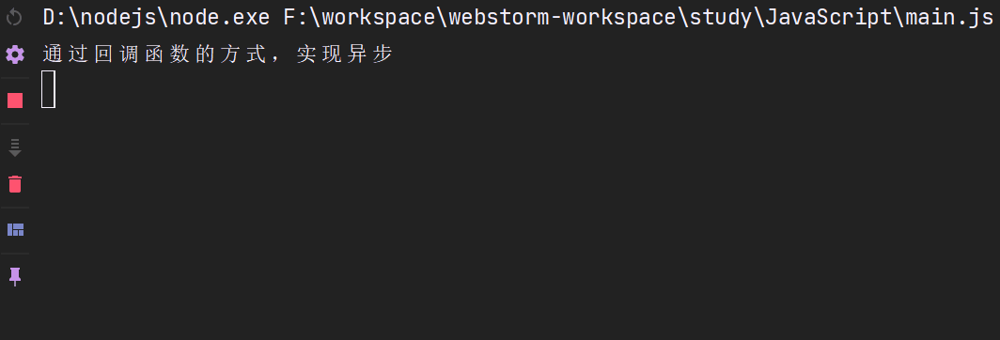
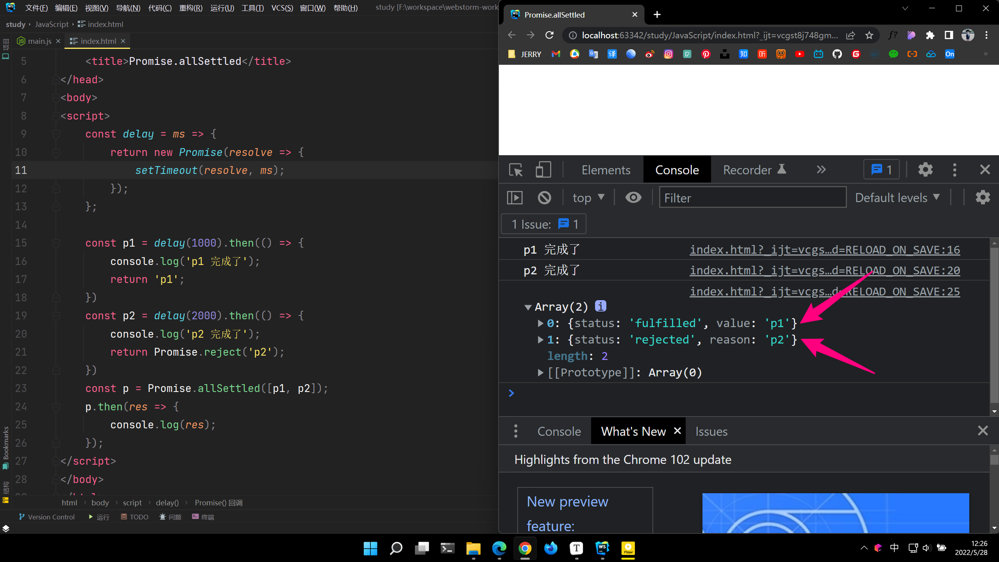

# 【ES6之Promise与Class类】

> 原创内容，转载请注明出处！

# 一、Promise

## 1.1 Promise 是什么？

Promise 是异步操作的一种解决方案。

> ### 异步的概念
>
> 异步（Asynchronous, async）是与同步（Synchronous, sync）相对的概念。
>
> 在我们学习的传统单线程编程中，程序的运行是同步的（同步不意味着所有步骤同时运行，而是指步骤在一个控制流序列中按顺序执行）。而异步的概念则是不保证同步的概念，也就是说，一个异步过程的执行将不再与原有的序列有顺序关系。
>
> 简单来理解就是：同步按你的代码顺序执行，异步不按照代码顺序执行，异步的执行效率更高。
>
> 以上是关于异步的概念的解释，接下来我们通俗地解释一下异步：异步就是从主线程发射一个子线程来完成任务。
>
> 
>
> ### 什么时候用异步编程
>
> 在前端编程中（甚至后端有时也是这样），我们在处理一些简短、快速的操作时，例如计算 1 + 1 的结果，往往在主线程中就可以完成。主线程作为一个线程，不能够同时接受多方面的请求。所以，当一个事件没有结束时，界面将无法处理其他请求。
>
> 现在有一个按钮，如果我们设置它的 onclick 事件为一个死循环，那么当这个按钮按下，整个网页将失去响应。
>
> 为了避免这种情况的发生，我们常常用子线程来完成一些可能消耗时间足够长以至于被用户察觉的事情，比如读取一个大文件或者发出一个网络请求。因为子线程独立于主线程，所以即使出现阻塞也不会影响主线程的运行。但是子线程有一个局限：一旦发射了以后就会与主线程失去同步，我们无法确定它的结束，如果结束之后需要处理一些事情，比如处理来自服务器的信息，我们是无法将它合并到主线程中去的。
>
> JavaScript 是单线程语言，为了解决多线程问题，JavaScript 中的异步操作函数往往通过回调函数来实现异步任务的结果处理。
>
> ### 回调函数
>
> 回调函数就是一个函数（作为函数参数的函数），它是在我们启动一个异步任务的时候就告诉它：等你完成了这个任务之后要干什么。这样一来主线程几乎不用关心异步任务的状态了，他自己会善始善终。
>
> ## 实例
>
> `setInterval()` 和 `setTimeout()` 是两个异步语句。
>
> 异步（asynchronous）：不会阻塞 CPU 继续执行其他语句，当异步完成时（包含回调函数的主函数的正常语句完成时），会执行 “回调函数”（callback）。
>
> ```html
> <!DOCTYPE html>
> <html>
> 
> <head>
>  <meta charset="utf-8">
>  <title>菜鸟教程(runoob.com)</title>
> </head>
> 
> <body>
> 
>  <p>回调函数等待 3 秒后执行。</p>
>  <p id="demo"></p>
>  <p>异步方式，不影响后续执行。</p>
>  <script>
>      function print() {
>          document.getElementById("demo").innerHTML = "RUNOOB!";
>      }
>      setTimeout(print, 3000);
>  </script>
> 
> </body>
> 
> </html>
> ```
>
> 
>
> 这段程序中的 setTimeout 就是一个消耗时间较长（3 秒）的过程，它的第一个参数是个回调函数，第二个参数是毫秒数，这个函数执行之后会产生一个子线程，子线程会等待 3 秒，然后执行回调函数 "print"，在命令行输出 "RUNOOB!"。
>
> 当然，JavaScript 语法十分友好，我们不必单独定义一个函数 print ，我们常常将上面的程序写成：
>
> ## 实例
>
> ```html
> <!DOCTYPE html>
> <html>
> 
> <head>
>  <meta charset="utf-8">
>  <title>菜鸟教程(runoob.com)</title>
> </head>
> 
> <body>
> 
>  <p>回调函数等待 3 秒后执行。</p>
>  <p id="demo"></p>
>  <p>异步方式，不影响后续执行。</p>
>  <script>
>      setTimeout(function () {
>          document.getElementById("demo").innerHTML = "RUNOOB!";
>      }, 3000);
>      /* ES6 箭头函数写法
>      setTimeout(() => {
>          document.getElementById("demo").innerHTML = "RUNOOB!";
>      }, 3000);
>      */
>  </script>
> 
> </body>
> 
> </html>
> ```
>
> **注意：**既然 setTimeout 会在子线程中等待 3 秒，在 setTimeout 函数执行之后主线程并没有停止，所以：
>
> ## 实例
>
> ```html
> <!DOCTYPE html>
> <html>
> 
> <head>
>  <meta charset="utf-8">
>  <title>菜鸟教程(runoob.com)</title>
> </head>
> 
> <body>
> 
>  <p>回调函数等待 3 秒后执行。</p>
>  <p id="demo1"></p>
>  <p id="demo2"></p>
>  <script>
>      setTimeout(function () {
>          document.getElementById("demo1").innerHTML = "RUNOOB-1!";
>      }, 3000);
>      document.getElementById("demo2").innerHTML = "RUNOOB-2!";
>  </script>
> 
> </body>
> 
> </html>
> ```
>
> 这段程序的执行结果是：
>
> 

（之前常用的异步操作解决方案是：回调函数）

```javascript
document.addEventListener(
    'click',
    () => {
        console.log('这里是异步的');
    },
    false
);
console.log('这里是同步的');
```

什么时候使用 Promise 呢？

Promise 一般用来解决层层嵌套的回调函数（回调地狱 callback hell）的问题。

例如下面展示两个回调地狱的例子：

例子1：分别间隔一秒打印省市县

```html
<!DOCTYPE html>
<html lang="zh">

<head>
    <meta charset="UTF-8">
    <meta http-equiv="X-UA-Compatible" content="IE=edge">
    <meta name="viewport" content="width=device-width, initial-scale=1.0">
    <title>回调举例</title>
</head>

<body>
<script>
    /*
    // 此种方式，省市县都会在一秒后同时打印，没有实现要求
    setTimeout(() => {
        console.log("云南省");
    }, 1000);
    setTimeout(() => {
        console.log("玉溪市");
    }, 1000);
    setTimeout(() => {
        console.log("峨山县");
    }, 1000);
    */

    // 通过回调函数的方式，实现异步
    setTimeout(() => {
        console.log("云南省");
        let str01 = "云南省";
        setTimeout(() => {
            console.log(str01 + "玉溪市");
            let str02 = "云南省玉溪市";
            setTimeout(() => {
                console.log(str02 + "峨山县");
            }, 1000, str02);
        }, 1000, str01);
    }, 1000);
    console.log("通过回调函数的方式，实现异步");
</script>
</body>

</html>
```



例子2：当我们点击窗口后，盒子依次 “右——>下——>左” 移动

```html
<!DOCTYPE html>
<html lang="en">
<head>
    <meta charset="UTF-8"/>
    <title>Promise</title>
    <style>
        * {
            padding: 0;
            margin: 0;
        }

        #box {
            width: 300px;
            height: 300px;
            background-color: red;
            transition: all 0.5s;
        }
    </style>
</head>
<body>
<div id="box"></div>
<script>    
    // 运动函数
    const move = (el, {x = 0, y = 0} = {}, end = () => {}) => {
        el.style.transform = `translate3d(${x}px, ${y}px, 0)`;
        el.addEventListener(
            // transitionend 事件在 CSS 完成过渡后触发。
            'transitionend',
            () => {
                end();
            },
            false
        );
    };

    const boxEl = document.getElementById('box');

    // 形成回调地狱
    document.addEventListener(
        'click',
        () => {
            move(boxEl, {x: 150}, () => {
                move(boxEl, {x: 150, y: 150}, () => {
                    move(boxEl, {y: 150}, () => {
                        move(boxEl, {x: 0, y: 0});
                    });
                });
            });
        },
        false
    );
</script>
</body>
</html>
```


## 1.2 Promise 的基本用法

### 1.2.1 实例化构造函数生成实例对象

Promise 实质上是一个构造函数，所以我们一般通过实例化的方式来使用它。

### 1.2.2 Promise 的状态

Promise 有三个状态：pending（等待）、fulfilled 或 resolved（成功）、rejected（失败）。

并且 Promise 必须接收一个回调函数，这个回调函数有两个参数，这两个参数也是两个函数，`(resolve, reject) => {}`。

- 实例化 Promise 后，默认是等待状态。

- 当执行 `resolve()` 函数时，Promise 从等待状态——>成功状态。

- 当执行 `reject()` 函数时，Promise 从等待状态——>失败状态。

注意：当 Promise 的状态一但从等待转变为某一个状态后，后续的转变就自动忽略了，比如：先调用 resolve() 再调用 reject()，那么 Promise 的最终结果是成功状态。

> 注意：这里的 resolve reject 只是一个形参，可以取任意名字，但是我们约定直接使用 resolve reject。

### 1.2.3 then 方法

当我们实例化 Promise 后得到的 Promise 对象便具有一个 `then` 方法。

then 方法具有两个回调函数作为参数，`() => {}, () => {}`。

- 当 Promise 对象为成功状态时就默认自动执行 then 方法的第一个回调函数
- 当 Promise 对象为失败状态时就默认自动执行 then 方法的第二个回调函数

### 1.2.4 resolve 和 reject 函数的参数

`resolve()` 和 `reject()` 函数是可以接收参数的。

- `resolve()` 接收的参数会传递给 then 方法的第一个回调函数
- `reject()` 接收的参数会传递给 then 方法的第二个回调函数

注意：通常我们不仅仅会传递一个基本数据类型的值，我们还常常传递对象，比如再 reject 中传递一个错误对象：

`reject(new Error("出错了！"));`

## 1.3 then()

1. then 方法的两个回调函数什么时候执行

   - pending——>fulfilled 时，执行 then 的第一个回调函数
   - pending——>rejected 时，执行 then 的第二个回调函数

2. then 方法执行后的返回值

   - then 方法执行后默认自动返回一个新的 Promise 对象

3. then 方法返回的 Promise 对象的状态改变

   - then 方法其实默认返回的是 undefined，即：`return undefined`，但是 ES6 的机制规定：当 then 返回 undefined 时，那么会将这个 undefined 包装成一个 Promise，并且这个 Promise 默认调用了 `resilve()` 方法（成功态），并且把 undefined 作为了 resilve() 的参数，相当于：

     ```javascript
     const p = new Promise((resolve, reject) => {
         resolve();
     });
     p.then(() => {
         // 默认会执行这一条
         // return undefined;
     }, () => {
     });
     
     // 实际上，return 会包装为一个 Promise 对象，同时默认执行 resolve()，并把 return 的值作为 resolve() 的参数
     /*
     return new Promise(resolve => {
         resolve(undefined);
     });
     */
     
     // -----------------------------
     // 如果我们在这个返回的 Promise 上继续调用 then 方法，并接收参数的话，可以发现 then 中成功接收到了被 Promise 包装后的参数
     const p2 = new Promise((resolve, reject) => {
         resolve();
     });
     p2.then(() => {
         // 默认会执行这一条
         // return undefined;
     }).then(data => {
         console.log(data);  // 打印 undefined
         // 手动 return 一个值
         return 24;
         // 相当于：return new Promise(resolve => {resolve(24);});
     }).then((data) => {
         console.log(data);	// 打印 undefined
     });
     ```

   - 如果我们要让 then 返回一个失败状态的 Promise，那么我们可以手动 return 一个 Promise 并执行 reject() 方法。

     ```javascript
     const p3 = new Promise((resolve, reject) => {
         resolve();
     });
     p3.then(() => {
         // 手动返回一个调用了 reject 的 Promise
         return new Promise((resolve, reject) => {
             reject("失败");
         })
     }).then(() => {}, errData => {
         console.log(errData);	// 失败
     });
     ```

学习了以上知识，现在我们来用 Promise 改造之前的两个回调地狱案例。

案例一：分别间隔一秒打印省市县。

```javascript
<!DOCTYPE html>
<html lang="zh">

<head>
    <meta charset="UTF-8">
    <meta http-equiv="X-UA-Compatible" content="IE=edge">
    <meta name="viewport" content="width=device-width, initial-scale=1.0">
    <title>Promise</title>
</head>

<body>
<script>
    // 通过 Promise 的方式，解决回调地狱
    new Promise((resolve) => {
        setTimeout(() => {
            console.log("云南省");
            resolve("云南省");
        }, 1000);
    }).then(res => {
        return new Promise((resolve) => {
            setTimeout(() => {
                console.log(res + "玉溪市");
                resolve(res + "玉溪市");
            }, 1000);
        });
    }).then(res => {
        setTimeout(() => {
            console.log(res + "峨山县");
        }, 1000);
    });

    console.log("通过 Promise 的方式，实现异步");
</script>
</body>

</html>
```


例子2：当我们点击窗口后，盒子依次 “右——>下——>左” 移动。

```html
// 利用 Promise 解决回调地狱问题
// 例子2：当我们点击窗口后，盒子依次 “右——>下——>左” 移动
<!DOCTYPE html>
<html lang="en">
<head>
    <meta charset="UTF-8"/>
    <title>Promise</title>
    <style>
        * {
            padding: 0;
            margin: 0;
        }

        #box {
            width: 300px;
            height: 300px;
            background-color: red;
            transition: all 0.5s;
        }
    </style>
</head>
<body>
<div id="box"></div>
<script>
    // 运动函数
    const move = (el, {x = 0, y = 0} = {}, end = () => {}) => {
        el.style.transform = `translate3d(${x}px, ${y}px, 0)`;
        el.addEventListener(
            // transitionend 事件在 CSS 完成过渡后触发。
            'transitionend',
            () => {
                end();
            },
            false
        );
    };

    const boxEl = document.getElementById('box');

    const movePromise = (el, point) => {
        return new Promise(resolve => {
            move(el, point, () => {
                resolve();
            });
        });
    };

    document.addEventListener(
        'click', () => {
            movePromise(boxEl, {x: 150}).then(() => {
                return movePromise(boxEl, {x: 150, y: 150});
            }).then(() => {
                return movePromise(boxEl, {y: 150});
            }).then(() => {
                movePromise(boxEl, {x: 0, y: 0});
            })
        }, false);
</script>
</body>
</html>
```

## 1.4 catch()

由之前的例子可以看出，我们在使用 Promise 的时候，大部分情况下，我们只用 resolve() 方法（成功态），所以在 Promise 回调函数中我们常常省略 reject 函数参数，在 then 中我们常常省略第二个回调函数。

但是我们还是需要处理异步中的异常，所以 ES6 中提供了我们一个 `catch()` 方法专门用来处理 Promise 的异常部分（失败态）。

- catch 专门用来处理 rejected 状态

- catch 本质上是 then 的特例

```javascript
new Promise((resolve, reject) => {
    reject("失败");
}).then(res => {
    console.log(res);
}).catch(err => {
    console.log(err);   // 失败
});

// -------------------------------------
// 上面的代码本质上等同于
new Promise((resolve, reject) => {
    reject("失败");
}).then(res => {
    console.log(res);
}).then(null, err => {
    console.log(err);	// 失败
});
```

> 在 Promise 中，一但出现了错误状态，那么这个错误是不会消失的，会一直向下传递，直到遇到可以处理错误的函数。

由于 catch 是 then 的特例，所以 catch 依旧返回的是一个 Promise 对象，我们可以在 catch 后继续调用 then。

```javascript
new Promise((resolve, reject) => {
    reject("失败");
}).then(res => {
    console.log(res);
}).catch(err => {
    console.log(err);   // 失败
    return "测试";
}).then(res => {
   console.log(res);	// 测试 
});
```

> 一般总是建议，Promise 对象后面要跟一个或多个 catch 方法，这样可以处理 Promise 内部发生的错误！

## 1.5 finally()

 当 Promise 状态发生变化时，不论如何变化都会执行，不变化不执行。

- finally() 不能接收参数。

- finally 也是 then 的特例。

```javascript
new Promise(resolve => {
    resolve("测试01");
}).finally(data => {
    console.log(data + " finally01");
    return new Promise((resolve, reject) => {
        reject("测试02");
    })
}).finally(data => {
    console.log(data + " finally02")
}).catch(err => {
    console.log("catch: " + err);
});

/*
undefined finally01
undefined finally02
catch: 测试02
*/

// 从以上示例可以看出：finally 可以接收正确状态或错误状态，但是不能接收参数。

// -------------------------------------
// finally 也是 then 的特例
// finally 等同于：
new Promise((resolve, reject) => {
    ...
}).then(res => {
    return res;
}, err => {
    return new Promise((resolve, reject) => {
        reject(err);
    })
})
```

`finally`：主要是用来处理一些必做操作，比如在操作数据库之后（无论成功与否）都要关闭数据库连接。

## 1.6 Promise.resolve()和Promise.reject()

 以上两者都是 Promise 构造函数的方法。

> 下面我们以 Promise.resolve() 举例，Promise.reject() 同理。

 ```javascript
 // Promise.resolve() 可以理解为普通成功状态的一种简写形式
 new Promise(resolve => resolve('foo'));
 // 简写
 Promise.resolve('foo');
 ```

Promise.resolve() 与 Promise.reject() 的参数问题：

1、一般参数

```javascript
Promise.resolve('foo').then(data => {
    console.log(data);
})	// foo
```

2、特殊参数：Promise 作为参数

```javascript
const p1 = new Promise(resolve => {
    setTimeout(resolve, 1000, '我执行了');
    /*
    上述延时器写法相当于：
    setTimeout(()=>{
        resolve('我执行了');
    }, 1000);
     */
});
Promise.resolve(p1).then(data => {
    console.log(data);	// 等待一秒后，输出 '我执行了'
});

/*
当 Promise.resolve() 接收的是 Promise 对象时，直接返回这个 Promise 对象，什么都不做
*/

// 所以，以上代码等同于：
p1.then(data => {
   console.log(data); // 等待一秒后，输出 '我执行了'
});

// 验证
console.log(Promise.resolve(p1) === p1);	// true

// 由于 Promise.resolve() 可以理解为普通成功状态的一种简写形式，所以：
new Promise(resolve => resolve(p1)).then(data => {
   console.log(data); // 等待一秒后，输出 '我执行了'
});
```

3、特殊参数：具有 then 方法的对象（了解即可）

```javascript
const thenable = {
    then() {
        console.log('then');
    }
};
Promise.resolve(thenable).then(
    res => console.log("res " + res),
    err => console.log("err " + err)
);

/*
then
*/

// 当接收一个含 then 方法的对象时，Promise.resolve() 会直接调用 then 方法。

// 为什么不会执行 then 中的两个回调函数呢？
console.log(Promise.resolve(thenable));
/*
Promise { <pending> }
then
*/
// 可见，当接收一个含 then 方法的对象时，默认返回一个 Promise 并且是等待状态的，没有状态的变化，那么就不可能会执行 then 的回调函数
// 如果我们要改变这个返回的 Promise 对象的状态，并让 then 的回调对应处理的话，ES6 规定了以下写法：
const thenable02 = {
    then(resolve, reject) {
        console.log('then');
        resolve('then');
    }
};
Promise.resolve(thenable02).then(
    res => console.log("res " + res),
    err => console.log("err " + err)
);
/*
then
res then
*/
```

> 与 Promise.resolve() 不同，Promise.reject() 无论接收什么类型的参数，都会原封不动的向后传递！

## 1.7 Promise.all()

Promise.all() 关注多个 Promise 对象的状态变化。

可以传入多个 Promise 实例，包装成一个新的 Promise 实例返回。

```javascript
/*
Promise.all() 的状态变化与所有传入的 Promise 实例对象状态有关
所有状态都变成 resolved，最终的状态才会变成 resolved
只要有一个变成 rejected，最终的状态就变成 rejected
用途举例：在用 Ajax 从后端接口获取数据的时候，如果全部获取到了，那么才处理，否则不处理。
*/

const delay = ms => {
    return new Promise(resolve => {
        setTimeout(resolve, ms);
    });
};

// 示例一：所有状态都变为 resolved
const p1 = delay(1000).then(() => {
    console.log('p1 完成了');
    return 'p1';
});
const p2 = delay(2000).then(() => {
    console.log('p2 完成了');
    return 'p2';
});
const p = Promise.all([p1, p2]);
p.then(res => {
    console.log(res + " 成功");
}, err => {
    console.log(err + " 失败");
});

/*
p1 完成了
p2 完成了
p1,p2 成功
*/
/*
解释：
1、Promise.all() 直接执行两个 Promise 实例
2、执行 p1，输出 p1 完成了
3、检测到 resolved，Promise.all() 继续执行
4、执行 p2，输出 p2 完成了
5、检测到 resolved，由于 Promise 已经全部执行完，所以执行 then 第一个回调输出 p1,p2 成功，Promise.all() 终止。
*/

// 示例二：出现一个 rejected 状态
const p1 = delay(1000).then(() => {
    console.log('p1 完成了');
    return Promise.reject('p1');
});
const p2 = delay(2000).then(() => {
    console.log('p2 完成了');
    return 'p2';
});
const p = Promise.all([p1, p2]);
p.then(res => {
    console.log(res + " 成功");
}, err => {
    console.log(err + " 失败");
});
/*
p1 完成了
p1 失败
p2 完成了
*/
/*
解释：
1、Promise.all() 直接执行两个 Promise 实例
2、执行 p1，输出 p1 完成了
3、检测到 rejected，Promise.all() 直接变为 rejected，执行 then 第二个回调输出 p1 失败，至此 Promise.all() 已经执行完毕。
4、由于 p2 延迟了两秒执行所以在后面输出（如果 p2 延时小于 p1，那么应该先输出 p2 完成了，然后在是 p1 完成了，p1 失败）
*/
```

## 1.8 Promise.race()和Promise.allSettled()

- Promise.race()

Promise.race() 的状态取决于第一个完成的 Promise 实例对象，如果第一个完成的成功了，那么最终就是成功的；如果第一个完成的失败了，那么最终就是失败的。

- Promise.allSettled()

Promise.allSettled() 的状态与传入的 Promise 状态无关。

它永远都是成功的，只会执行 then 的第一个回调函数。

用途：用于记录下各个 Promise 的表现。



## 1.9 Promise的注意事项

### 1.9.1 resolve或reject执行后的代码

resolve或reject后的代码依旧是会执行的，但是极度不推荐这么做。

为了确保安全，推荐在调用 resolve 或 reject 函数的时候加上 return，不再执行它们后面的代码。

```javascript
new Promise((resolve, reject) => {
    resolve();
    console.log('hi');	// hi
});

// 推荐加上 return
new Promise((resolve, reject) => {
    return resolve();
    // console.log('hi');	// 不输出
});
```

### 1.9.2 Promise.all/race/allSettled的参数问题

- 参数如果不是 Promise 数组，会将不是 Promise 数组的元素转变成 Promise 对象且是成功态的。

```javascript
// 举例：
Promise.all([1, 2, 3]).then(datas => {
    console.log(datas);
});

// 等价于：
Promise.all([
    Promise.resolve(1),
    Promise.resolve(2),
    Promise.resolve(3)
]).then(datas => {
    console.log(datas);
});
```

- 不只是数组，任何可遍历的类型都可以作为参数

依旧是会将其转变成 Promise 对象且是成功态的。

> 原生可遍历：数组、字符串、Set、Map、NodeList、arguments
> 非原生可遍历：迭代器

### 1.9.3 Promise.all/race/allSettled的错误处理

- 单独处理：在每一个 Promise 对象后用 catch() 单独处理
- 统一处理：在 Promise.all/race/allSettled 后用 catch() 统一处理

> 注意：某个错误一但处理过一次，那么就不会在后续再被处理了。

## 1.10 Promise的应用

【异步加载图片】

异步加载：也称为图片的预加载。利用js代码提前加载图片，用户需要时可以直接从本地缓存获取，但是会增加服务器前端的压力。这样做可以提高用户的体验，因为同步加载大图片的时候，图片会一层一层的显示处理，但是经过预加载后，直接显示出整张图片。

```html
 <!DOCTYPE html>
<html lang="en">
<head>
    <meta charset="UTF-8"/>
    <title>Promise 的应用</title>
    <style>
        #img {
            width: 24%;
            padding: 24px;
        }
    </style>
</head>
<body>
<!-- 一般加载图片方式 -->
<!--  -->


<script>
    // 异步加载图片
    // 异步加载图片函数（参数：图片路径）
    const loadImgAsync = url => {
        // Promise 实现异步
        return new Promise((resolve, reject) => {
            // 创建一个图片对象
            const img = new Image();

            // 图片成功加载触发事件
            img.onload = () => {
                resolve(img);
            };

            // 图片加载失败触发事件
            img.onerror = () => {
                reject(new Error(`Could not load image at ${url}`));
            };

            // 这个放在 onload 与 onerror 之后
            // 一但给 img.src 赋值，那么便立马开始发送请求加载图片（在后台加载，页面上不会显示）
            // 注意：这里的 src 是 img 对象的属性，与 html 中 img 的 src 无关
            img.src = url;
        });
    };

    const imgDOM = document.getElementById('img');
    loadImgAsync('https://scpic.chinaz.net/files/pic/pic9/202009/apic27858.jpg')
        .then(img => {
            // 如果加载成功，那么把后台缓存的图片显示到页面上
            imgDOM.src = img.src;
        })
        .catch(err => {
            console.log(err);
        });
</script>
</body>
</html>
```


# 二、Class类

## 2.1 认识Class

类：人类、狗类

实例、对象：中国人、藏獒

> 类可以看作是对象的模板，用一个类可以创建出许多不同的对象。

## 2.2 Class的基本用法

`class Person{}`

注意：类名 Person 后没有 `()`，同时 `{}` 后也不应该加 `;`。

> 注意：所有 JavaScipt 语句的 `{}` 后都不需要加 `;`。

每一个类中都包含一个构造方法，这个构造方法可以手动写出来，也可以不写，如果手动不写那么浏览器也会默认自动添加。

```javascript
class Person {
    // 实例化时执行构造方法，所以必须有构造方法，但可以不写出来
    constructor() {
        console.log("构造方法自动执行");
    }
}

// 实例化一个 Person 对象（必须采用 new 语法）
const p = new Person();		// 构造方法自动执行
```

通常情况下，我们会在构造函数中进行对象属性初始化。

```javascript
class Person {
    constructor(name, age) {
        this.name = name;
        this.age = age;
    }
}

const zjr = new Person('jerry', 18);
console.log(zjr.name);		// jerry
console.log(zjr.age);		// 18
```

在构造函数中，我们确实可以添加方法，但是不建议这么做，因为这样的处理方式会导致每一个实例的对象中都单独保存了一份该方法，造成内存的浪费。

我们应该将方法写在 class 类中，这样所有的对象都共享同一个方法。

```javascript
class Person {
    constructor(name, age) {
        this.name = name;
        this.age = age;
        this.speak = () => {
            console.log(this.name + " say Hi!");
        }
    }
}

const zjr = new Person('jerry', 18);
zjr.speak();	// jerry say Hi!

const lxy = new Person('Dragon', 18);
lxy.speak();	// Dragon say Hi!

console.log(zjr.speak === lxy.speak);	// false
```

```javascript
// 一般我们把属性定义在构造方法中，把方法定义在类中
class Person {
    constructor(name, age) {
        this.name = name;
        this.age = age;
    }

    // 方法定义在类中的写法
    speak() {
        console.log(this.name + " say Hi!");
    }
}

const zjr = new Person('jerry', 18);
zjr.speak();	// jerry say Hi!

const lxy = new Person('Dragon', 18);
lxy.speak();	// Dragon say Hi!

console.log(zjr.speak === lxy.speak);	// true
```

## 2.3 Class与构造函数

将上述的 Class 改造为之前学习过的构造函数：

```javascript
function Person(name, age) {
    this.name = name;
    this.age = age;
}
Person.prototype.speak = function() {
    console.log(this.name + " sya Hi!");
}

const zjr = new Person('jarry', 18);
zjr.speak();	// jerry say Hi!
```

> Class 与 构造函数 的关系：
>
> 在 ES6 之前，要在 JavaScript 中实现面向对象编程，便要借助于构造函数。
>
> 在 ES6 之后，实现面向对象编程便可以使用 Class。
>
> 推荐：以后的面向对象编程请优先使用 Class。
>
> > Class 的底层实现机制还是 构造函数 的再次封装！
> >
> > 例如：`console.log(typeof Person);` 结果为：function，所以 Class 的底层实际上还是构造函数。
> >
> > 例如：`console.log(Person.prototype.speak);` 结果可以得到 speak 函数，所以 Class 底层实际上是构造函数，且依旧有原型。
> >
> > 甚至，我们可以给 Person 的原型上添加方法，依旧可以达到相应的效果，但是极不推荐这样做！

## 2.4 Class的两种定义形式

### 2.4.1 声明形式

```javascript
class Person {
    constructor() {
        ...
    }
    speak() {
        ...
    }
}
```

### 2.4.2 表达式形式

```javascript
// 匿名 class 赋给一个变量
const Person = class {
    constructor() {
        ...
    }
    speak() {
        ...
    }
}
```

由于匿名函数可以实现立即执行函数，所以我们模仿立即执行函数的方式也可以实现立即执行类。

```javascript
new (class {
    constructor() {
        console.log("constructor");		// constructor
    }
})();
```

## 2.5 实例属性、静态方法和静态属性

### 2.5.1 实例属性

我们之前将类的属性利用 this 的方式写在了构造方法里，把类的方法写在了 class 里。

现在我们还可以把类的属性和方法写在 class 里，然后在构造方法里进行值的修改，或者是提供一个 get set 方法来间接控制变量。

```javascript
class Person {
    _age = 0;        // 类属性之前不能加 var 或 let
    _sex = 'male';   // 类属性被赋予的值相当于就是属性的默认值
    
    /*
    // get、set 还可以用这样的格式来写
    // 这里其实本质上就是定义一个类属性，只不过这个属性指向一个函数而已
    getSex = function() {
        return this._age;
    };
    */

    get age() {
        return this._age;
    }

    set age(value) {
        this._age = value;
    }

    get sex() {
        return this._sex;
    }

    set sex(value) {
        this._sex = value;
    }

    constructor(age, sex) {
        this._age = age;
        this._sex = sex;
    }

    // 类的方法不能用 function 关键字
    speak() {
        console.log(this._age + " " + this._sex);
    }
}
```

### 2.5.2 静态方法

对于类的普通方法，我们要调用它，必须先实例化对象，然后再用对象来 “打点” 调用。

如果我们要想直接利用类来调用，那么就要在类中创建静态方法。

```javascript
class Person {
    constructor(name, sex) {
        this.name = name;
        this.sex = sex;
    }
    
    // 除了类的静态方法之外，是可以定义类的同名普通方法的
    speak() {
        console.log("说话");
    }
    
    static speak() {
        console.log("人类可以说话")
    }
}

// 一个是类的方法（静态方法），一个是实例对象的方法（普通方法），所以不会冲突
Person.speak();		// 人类可以说话
const p = new Person('Alex', 18);
p.speak();			// 说话
```

静态方法的 this 指向问题：静态方法的 this 指向这个类本身。

注意：普通方法 this 指向具体的对象，而静态方法的 this 指向类本身。

```javascript
class Person {
    // 静态属性
    static _name = "user";
    static _age = 18;

    constructor(name, age) {
        this._name = name;
        this._age = age;
    }

    static test() {
        console.log("静态方法");
    }

    // 静态方法
    static readme() {
        // 静态方法中的 this 指向 Person 类本身
        // 并且静态方法的 this 只能引用到类的静态属性及静态方法
        console.log(this._name + " " + this._age);
        this.test();
    }
}

Person.readme();
console.log(Person._name);
/*
user 18
静态方法
user
*/

/*
再次注意：静态方法中只能使用类的静态属性与静态方法
*/
```

### 2.5.3 静态属性

静态属性也就是类的属性，依旧使用 static 关键字。

注意：静态属性 static 的定义方法目前只是一个提案，目前不推荐这样写！某些浏览器不支持。

```javascript
class Person {
    constructor(name) {
        this.name = name;
    }
    
    // 目前不推荐 static 这种写法，因为还只是一个提案
    // static version = "1.0";
    
    // 推荐利用静态方法来间接实现静态属性
    static getVersion() {
        return "1.0";
    }
}
```

## 2.6 私有属性和方法

JavaScript 本身没有私有属性和方法，所以我们利用其它方式来实现私有化。

```javascript
// 方式一：在属性开头加上 _ 表示私有
class Person {
    constructor(name) {
        this._name = name;
    }
    
    _speak() {
        console.log("speak");
    }
    
    getName() {
        return this._name;
    }
}

const p = new Person('Alex');
console.log(p.name);	// 报错！
// console.log(p._name);	// Alex，但是这样做就无意义了，违背了私有化的初衷

/*
注意：加下划线的方式实际上只是行业中约定俗成的一种方法，
我们依旧可以通过 p._name，来访问，但是这样做就无意义了！所以这种方法的使用纯靠程序员自觉。
*/
```

```html
<!DOCTYPE html>
<html lang="en">
<head>
    <meta charset="UTF-8"/>
    <title>Class私有属性</title>
</head>
<body>
<script>
    // 方式二：将私有属性和方法移出类（使用模块）
    // 由于我们还没有学习过模块，所以我们目前用立即执行函数（闭包原理）来模拟
    (function () {
        let name = "";
        let speak = function () {
            console.log("speak");
        }

        class Person {
            constructor(username) {
                name = username;
            }

            getName() {
                return name;
            }

            runSpeak() {
                speak();
            }
        }

        // 将类添加到全局作用域中暴露
        window.Person = Person;
    })();

    const p = new Person('Alex');
    console.log(p.name);	// 报错
    console.log(p.getName());	// Alex
    p.runSpeak();	// speak
</script>
</body>
</html>
```

## 2.7 extends

### 2.7.1 子类继承父类

```javascript
class Person {
    constructor(name, sex) {
        this.name = name;
        this.sex = sex;
        this.say = function() {
            console.log("say");
        };
    }
    speak() {
        console.log("speak");
    };
    static speak() {
        console.log("static speak");
    };
}
Person.version = "1.0";

// 子类继承
class Programmer extends Person {
    constructor(name, sex) {
        // 调用父类的构造方法
        super(name, sex);
    }
}

// 测试
const zjr = new Programmer('jerry', '男');
console.log(zjr.name);				// jerry
console.log(zjr.sex);				// 男
zjr.say();						   // say
zjr.speak();					   // speak
Programmer.speak();				    // static speak
console.log(Programmer.version);	 // 1.0 
// 由此可见，子类集成了父类所以属性及方法！
```

### 2.7.2 改写继承的属性或方法

```javascript
class Person {
    constructor(name, sex) {
        this.name = name;
        this.sex = sex;
        this.say = function () {
            console.log("say");
        };
    }

    speak() {
        console.log("speak");
    };

    static speak() {
        console.log("static speak");
    };
}

Person.version = "1.0";

// 子类继承
class Programmer extends Person {
    constructor(name, sex, age) {
        // 调用父类的构造方法，super 必须在子类构造方法第一行写
        super(name, sex);
        // 改写父类属性
        this.name = 'zjr';
        // 新增子类属性
        this.age = age;
    }

    // 改写父类属性
    speak() {
        console.log("子类 speak");
    }

    // 新增子类属性
    hi() {
        console.log("Hi!");
    }
}

const zjr = new Programmer('jerry', '男', 18);
console.log(zjr.name);		// zjr
console.log(zjr.sex);		// 男
console.log(zjr.age);		// 18
zjr.speak();			   // 子类 speak
zjr.say();				   // say
```

## 2.8 super

### 2.8.1 作为函数调用

```javascript
// super 作为函数使用，代表了父类的构造方法，只能用在子类的构造方法中，用在其他地方就会报错
class Person {
    constructor(name, sex) {
        this.name = name;
        this.sex = sex;
    }
}

class Programmer extends Person {
    constructor(name, sex) {
        super(name, sex);
        // super 虽然代表了父类的构造方法，但是内部的 this 指向子类的实例
        // 当然 super 中的 this 是隐含的，不能显示的写出来，否则会报错！
    }
}

const zjr = new Programmer('jerry', '男');
```

### 2.8.2 作为对象使用

```javascript
// super 作为对象使用，代表了父类的原型对象 Person.prototype
// 所以我们可以通过 super 访问父类的方法了
class Person {
    name = "Person";

    constructor(name, sex) {
        this.name = name;
        this.sex = sex;
    }

    speak() {
        console.log("speak");
    }

    static speak() {
        console.log("static speak");
        console.log(this.name);
    }
}

class Programmer extends Person {
    name = "Programmer";

    constructor(name, sex) {
        super(name, sex);
        // 在构造方法中使用
        super.speak();
    }

    speak() {
        // 在一般方法中使用
        super.speak();
        console.log("子类 speak");
    }

    static speak() {
        // 在静态方法中使用
        // 指向父类，而不是父类的原型对象
        // 原因是：我们此时调用的是父类的方法（静态方法属于父类），而不是父类原型对象上的方法
        super.speak();
        console.log("重写 static speak");
        // 通过 super 调用父类的方法时，方法内部的 this 指向当前的子类，而不是子类的实例
    }
}

const zjr = new Programmer('jerry', '男');
zjr.speak();
Programmer.speak();

/*
speak
speak
子类 speak
static speak
Programmer
重写 static speak
*/

// 注意：super.name 是 undefined！
// 因为 super 作为对象是表示父类的原型对象 Person.prototype，而原型对象上并没有父类属性
```

