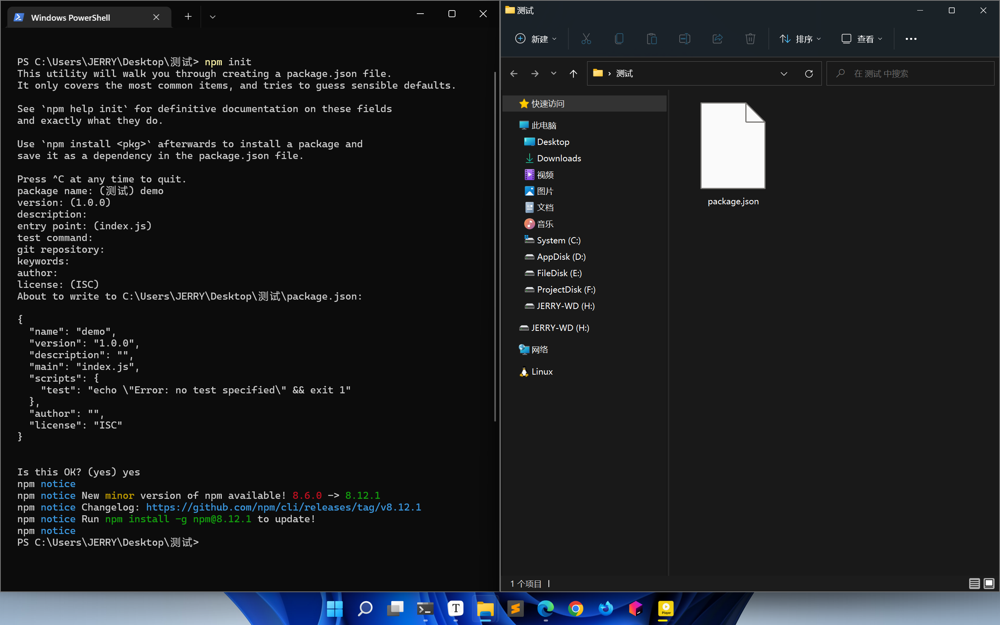
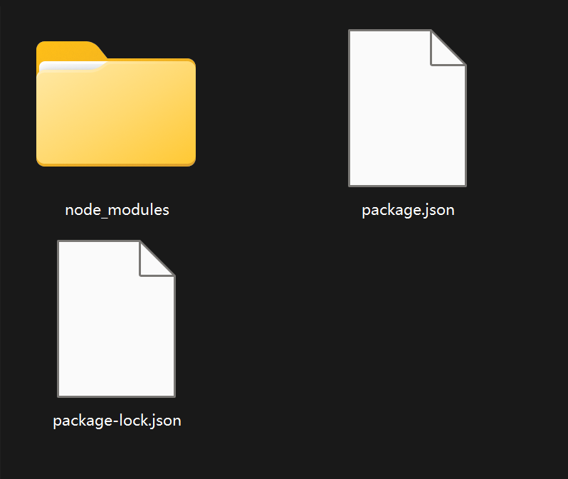
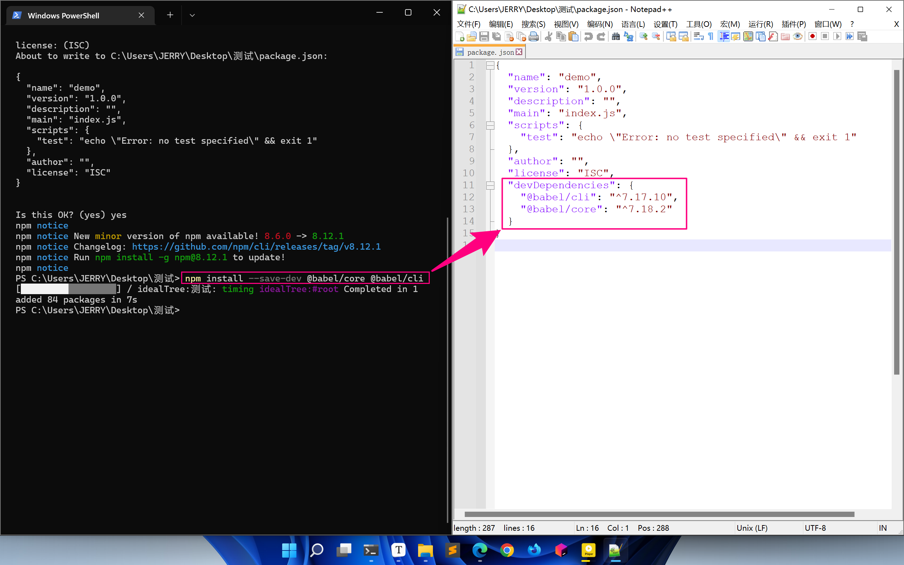

# 【ES6之Module模块与Babel编译】

> 原创内容，转载请注明出处！

# 一、Module模块

## 1.1 初识Module

（1）什么是模块

模块：一个一个的局部作用域的代码块。

（2）什么是模块系统

模块系统：系统的解决了模块化一系列问题

1. 模块化的写法（之前我们用立即执行函数模拟模块化，ES6 则实现了针对模块化的语法）
2. 消除全局变量（模块中的变量都是局部的，不同模块之间不会相互干扰）
3. 管理加载顺序（之前我们将一个总的 JavaScript 程序分几个文件写，但在最终合并调用时，js 的引入需要满足前后依赖关系。比如：被引用的 js 文件就一定要在引用它的 js 文件之前加载）

## 1.2 Module的基本用法

> 注意：Module 要生效，必须在服务器环境下才能执行。
>
> 普通的 HTML、JS 是本地文件环境，以 file 地址开头，服务器则以 http 开头。
>
> 方法：VSCode 中使用 Live Server 拓展，WebStorm 默认就是服务器环境。

- 一个 JS 文件就是一个模块
- 用 import 关键字导入模块
- 用 export 关键字导出模块需要暴露的部分
- 在使用 script 标签加载的时候，需要加上 type="module" 

## 1.3 Module的导入导出

### 1.3.1 export default 导出和对应的 import 导入

（1）没有导出，是否可以导入？

```html
// 一个模块没有导出，也可以将其导入
// 被导入的代码都会执行一遍，并且同一个导入只执行一遍！
// index.html
<!DOCTYPE html>
<html lang="zh-CN">
<head>
    <meta charset="UTF-8">
    <title>Module</title>
</head>
<body>
<!-- script 标签需要加上 type="module" -->
<script type="module">
    import "./test.js";		// 浏览器控制台打印：test
    import "./test.js";		// 不执行
    import "./test.js";		// 不执行
    import "./test02.js";	// 不执行
    import "./test.js";		// 浏览器控制台打印：test02
    import "./test02.js";	// 不执行
</script>
</body>
</html>

// test.js
/*
console.log("test");
*/

// test02.js
/*
console.log("test02");
*/
```

（2）export default 导出和对应的 import 导入

一个模块中只能有一个 export default。

【module.js】

```javascript
const age = 18;
const sex = "male";

export default age;		// 通过 export default 导出（暴露）一个值
/*
export default sex;		// 报错！因为 export default 只能在一个文件中导出一次！！！
export default 24;				// 可以导出值
export default {};				// 可以导出对象
export default function(){};	 // 可以导出函数
export default class{};			 // 可以导出class
*/
```

【index.html】

```html
<!DOCTYPE html>
<html lang="zh-CN">
<head>
    <meta charset="UTF-8">
    <title>Module</title>
</head>
<body>
<!-- script 标签需要加上 type="module" -->
<script type="module">
    // import 之后跟一个模块的别名，推荐别名与导出时的名字相同，比如这里就用 age
    import age from "./module.js";
    console.log(age);	// 18
</script>
</body>
</html>
```

### 1.3.2 export 导出和对应的 import 导入

**（1）基本用法**

【module.js】

```javascript
/*
const age = 18;
export age;		// 报错
*/

// export 后面只能跟声明或语句！
export const age = 18;
```

【index.html】

```html
<!DOCTYPE html>
<html lang="zh-CN">
<head>
    <meta charset="UTF-8">
    <title>Module</title>
</head>
<body>
<!-- script 标签需要加上 type="module" -->
<script type="module">
    // import aaa from "./module.js";	// 报错！ 
    // export 导出的模块，在导入时不能随意取别名，名称必须与模块导出时相同！并且要使用解构赋值的形式！
    
    import {age} from "./module.js";	// 注意：名称不能随意取，一定要与模块相同
    console.log(age);	// 18;
</script>
</body>
</html>
```

注意：在用 export 导出时，也可以用解构赋值的形式！

【module.js】

```javascript
const age = 18;

export {age};
```

**（2）多个导入**

【module.js】

```javascript
// 1、采用声明或语句的形式
/*
export funciton fn() {};
export class className {};
export const age = 18;
*/

// 2、采用解构赋值的形式
function fn() {};
class className {};
const age = 18;

/* 方式 1：
export {fn};
export {className};
export {age};
*/

// 方式 2：
export {fn, className, age};
```

【index.html】

```html
<!DOCTYPE html>
<html lang="zh-CN">
<head>
    <meta charset="UTF-8">
    <title>Module</title>
</head>
<body>
<!-- script 标签需要加上 type="module" -->
<script type="module">
    /* 方式 1：
    import {fn} from "./module.js";
    import {className} from "./module.js";
    import {age} from "./module.js";
    */
    // 方式 2：
    import {fn, className, age} from "./module.js";
    console.log(fn);			// ƒ fn() {}
    console.log(className);		// class className {}
    console.log(age);	    	// 18
</script>
</body>
</html>
```

**（3）导出导入时起别名**

```javascript
export {fn as func, className as cN, age};
```

```javascript
import {func, cN, age as nl} from "./module.js";
console.log(func);			// ƒ fn() {}
console.log(cN);			// class className {}
console.log(nl);	    	// 18
```

**（4）整体导入**

```javascript
// 之前的导入方式，如果导入的模块不多那么还好，但是一但模块数量多了起来，那么就特别费劲
// import {fn, className, age} from "./module.js";

// 整体导入
// 将同一文件里的所有模块导入到一个对象中
// 不仅对 export 有效，同时对 export default 也同样有效
import * as imObj from "./module.js";
console.log(imObj);					// 见图片
console.log(imObj.fn);				// ƒ fn() {}
console.log(imObj.className);		// class className {}
console.log(imObj.age);				// 18
// export default 也同样有效：imObj.default
```


**（5）同时导入**

当我们需要分别导入 export default 和 export 时，可以使用同时导入的方式。

```javascript
// 我们可以分开实现
import {fn, className, age} from "./module.js";
import sex from "./module.js";
```

```javascript
// 更推荐使用同时导入的方式
import sex, {fn, className, age} from "./module.js";
// 注意：export default 必须在 export 之前
```

## 1.4 Module的注意事项

### 1.4.1 Module的注意事项

**（1）模块顶层的 this 指向**

顶层：不在 if、for、while、函数等局部作用域之外的部分。

在模块中顶层的 this 指向 undefined！（千万不要误以为指向 window）

> 模块中顶层的 this 指向 undefined，所以我们可以利用这个特性，检测模块有没有被正确的导入。比如：当 script 标签中没有 type="moudel" 时，模块就没有被成功引入，那么 this 就指向的是 window。

> 当我们需要指定必须以模块的方式导入时，我们可以这样做：
>
> 【module.js】
>
> ```javascript
> if (typeof this !== "undefined") {
>     throw new Error("请使用模块的方式加载！");
> }
> ```

**（2）import 关键字和 import() 函数**

- import 命令具有提升效果，会提升到代码的头部，率先执行！

- import 执行的时候，代码还没有执行，所以我们不能将 import 嵌入到代码逻辑中！

  ```javascript
  // 以下做法时错误的！
  if (...) {
      import "./pc.js";
  } else {
      import "./mobile.js";
  }
  // 所以 import 和 export 命令只能在模块的顶层，不能在代码块中执行！ 
  ```

- import() 可以按条件导入，并且返回一个 promise 对象

  ```javascript
  if (...) {
      import("pc.js").then().catch();
  } else {
      import("mobile.js").then().catch();
  }
  ```

**（3）导入导出的复合写法**

复合写法：在一条语句中同时完成导入和导出。

```javascript
// 导入导出的复合写法
export {age} from "./module.js";

// 等价于
import {age} from "./module.js";
export {age} from "./module.js";
// 先导入用，用完后再导出，相当于 “中转站”
```

# 二、Babel与webpack

## 2.1 认识Babel

官网：[Babel · The compiler for next generation JavaScript https://babel.dev/](https://babel.dev/)

在线编译：[Babel · The compiler for next generation JavaScript https://babel.dev/repl](https://babel.dev/repl)

Babel 是 JavaScript 的编译器，用来将 ES6 代码转换成 ES6 之前的代码。

Babel 本身可以编译 ES6 的大部分语法，比如：let、const、箭头函数、class，……，但是对于 ES6 新增的 API，比如：Set、Map、Promise 等全局对象，以及一些定义在全局对象上的方法（比如 Object.assign/Array.from）都不能直接编译，需要借助其它的模块，Babel 一般需要配合 Webpack 来编译模块语法。

## 2.2 Babel的使用方式

使用方式说明：[Babel · The compiler for next generation JavaScript https://babel.dev/setup](https://babel.dev/setup)

目前，我们主要关注：CLI 及 Webpack。

注意：我们一般不考虑 [In the browser](https://babel.dev/setup#installation) 方式，因为此种方式代码每次被浏览器执行时都要先转换为 ES6 之前的代码，这样的转换影响了性能，而 CLI 及 Webpack 的方式是提前就将 ES6 代码转化为 ES6 之前的代码，浏览器在运行时已经是 ES6 之前的代码了，不影响性能。

## 2.3 使用Babel前的准备工作

### 2.3.1 什么是Node.js和npm

简单的说 Node.js 就是运行在服务端的 JavaScript。

Node.js 是一个基于 Chrome JavaScript 运行时建立的一个平台。

Node.js 是一个事件驱动 I/O 服务端 JavaScript 环境，基于 Google 的 V8 引擎，V8 引擎执行 Javascript 的速度非常快，性能非常好。

后端的 JavaScript = ECMAScript + IO + File + ...服务器端的操作。

npm 是随同 Node.js 一起安装的包管理工具，能解决 Node.js 代码部署上的很多问题，常见的使用场景有以下几种：

- 允许用户从 npm 服务器下载别人编写的第三方包到本地使用。
- 允许用户从 npm 服务器下载并安装别人编写的命令行程序到本地使用。
- 允许用户将自己编写的包或命令行程序上传到 npm 服务器供别人使用。

由于新版的 Node.js 已经集成了 npm，所以之前 npm 也一并安装好了。同样可以通过输入 **"npm -v"** 来测试是否成功安装。

### 2.3.2 安装Node.js

Node.js 中文官网：[Node.js (nodejs.org)](https://nodejs.org/zh-cn/)

我们下载长期支持版，并双击安装包根据提示进行安装即可。

可以通过在终端中依次输入：`node -v` 及 `npm -v` 来查看版本，如果查看成功，即表明安装成功。

### 2.3.3 初始化项目

- 初始化项目：`npm init`

- 进行项目配置

- 确认配置并正式生成项目



> 当依次正确完成以上步骤后，项目路径下就会生成一个 `package.json` 文件，里面最初记录了我们 npm 项目的初始化配置信息，往后我们利用 npm 安装的依赖及包都会记录在这个文件中。
>
> 往后当我们需要迁移项目时，我们只需要拷贝这个 `package.json` 文件，然后在新的项目中使用相应的命令，便可恢复文件中的环境、依赖及包。
>
> 【初始时的 package.json】
>
> ```json
> {
>   "name": "demo",
>   "version": "1.0.0",
>   "description": "",
>   "main": "index.js",
>   "scripts": {
>     "test": "echo \"Error: no test specified\" && exit 1"
>   },
>   "author": "",
>   "license": "ISC"
> }
> ```

### 2.3.4 安装Babel需要的包

安装命令：`npm install --save-dev @babel/core @babel/cli`

注意：`--save-dev` 表示这是一个开发环境的依赖，即上线之后是用不到的。

当我们安装成功后，会得到一个依赖及包代码的放置目录和两个 json 文件，其中 package.json 文件会新增一个 `devDependencies` （开发依赖）属性，并记录下我们的安装记录。





- @babel/cli：CLI 中使用 Babel 必须的包，实现了命令行中 Babel 命令的识别与执行等
- @babel/core：Babel 中用于完成 “发号施令” 的包，即：指挥控制其它 Babel 包的行为

> 注意：我们在安装时，要特别注意一下依赖及包的版本号，不能随意的依赖最新版本，因为最新版本可能会不兼容某些旧版本。

> 当我们迁移了项目环境时，也许项目的依赖及包代码（node_modules 文件夹）已经不在了或者错误了，那么只要 package.json 文件还在，那么我们只需要执行 `npm install` 命令，即可根据 package.json 内容重新生成项目的依赖及包代码（node_modules 文件夹）。
>
> 注意：`npm install` 可以简写为：`npm i`
>
> 注意：在平时的项目开发中，我们在拷贝项目或者迁移项目时，通常不会把 node_modules 文件夹一同拷贝或迁移，因为该文件夹的文件数量级太大了，所以拷贝或迁移的时间会特别长，而且还容易出错，我们一般都是通过 `npm install` 来重新生成。

### 2.3.5 使用Babel编译ES6代码

首先，我们需要手动在 package.json 文件中添加以下代码：

```json
"scripts": {
    "build": "babel src -d lib"
}
```

其中 `"build": "babel src -d lib"` 表示：通过 babel 命令将 src 下的文件编译并输出到 lib 目录下。

附：`-d` 实际表示的就是：`--out-dir` 的缩写，其实就是输出目录的意思。

注意：由于我们通常不放在 `lib` 目录下，而是放在 `dist` 目录下，所以我们把 package.json 文件中添加的代码修改为：

```json
"scripts": {
    "build": "babel src -d dist"
}
```

**（1）编译的命令**

当配置好上述步骤后，我们即可通过命令进行编译。

编译命令：`npm run build`

当我们编译成功后，便会多出一个 `dist` 目录，里面便放置有编译后的文件。

> 当我们把编译好的文件打开后，发现里面的代码依旧是 ES6 版本的，这是因为我们在正式编译代码之前还需要设置一个 Babel 的配置文件。

**（2）Babel的配置文件**

首先，我们需要额外安装一个包：`npm install @babel/preset-env --save-dev`，这个包能告诉编译器具体如何转换编译 ES6 的语法。

安装成功后，在项目目录下，创建一个 `.babelrc`。

在文件中写入：

```json
{
    "presets": ["@babel/preset-env"]
}
```

> 配置之后，我们再次执行 `npm run build` 命令，那么 dist 目录中的文件就是编译完成的 ES6 之前版本的代码了！