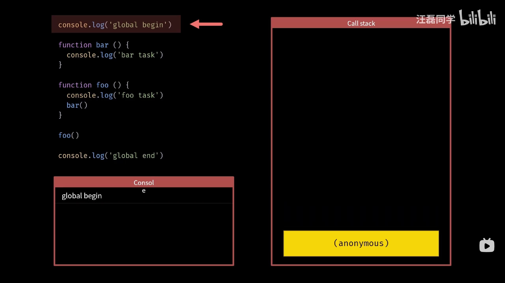
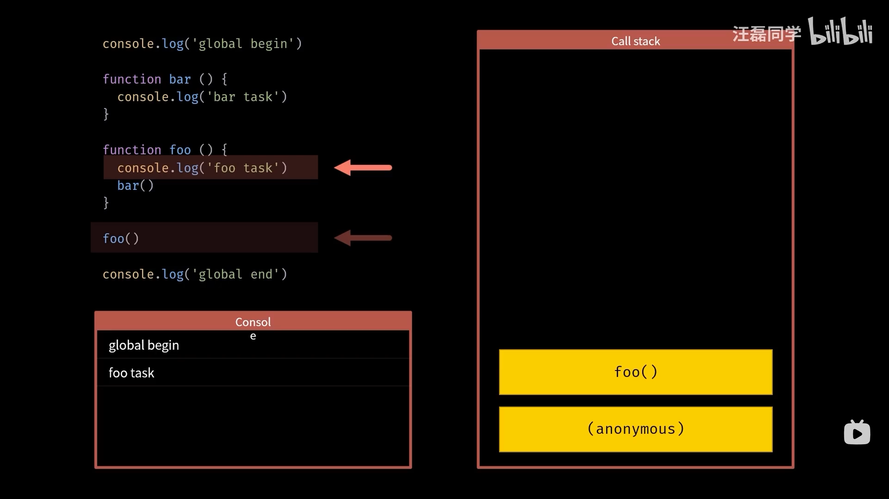
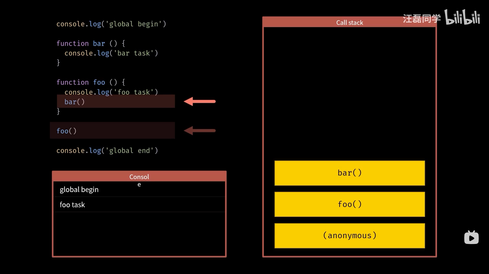
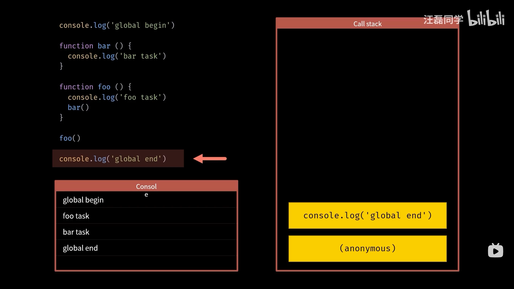

# 一文彻底搞懂JS异步编程

> 参考：[同步模式_哔哩哔哩_bilibili](https://www.bilibili.com/video/BV1b14y1w7Mg/?p=2&spm_id_from=pageDriver&vd_source=c20505dcdf2f5d80abfca661acc03ea7)

异步编程是 JavaScript 最重要的部分之一，也是 JavaScript 能 “大放异彩” 的核心依托！所以，彻底搞懂 JS 的异步编程是非常具有必要性的！

但是，JS 的异步编程并不容易理解，主要原因是其打破了大多数学习者的编程思维习惯，所以要彻底搞懂 JS 异步编程，需要从 “根上” 来了解 JS 实现异步的全过程，下面就结合例子来一步一步走进 JavaScript 异步编程！

## 单线程

众所周知，JavaScript 的脚本是单线程执行的！

单线程指的是，JS 执行环境中负责执行代码的线程只有一个，即：JavaScript 只在一个线程上运行。也就是说，JavaScript 同时只能执行一个任务，其他任务都必须在后面排队等待。

```js
console.log('1');
console.log('2');
console.log('3');

// 由于是单线程，所以三个函数的执行必然是遵循 “由前到后，依次执行”，所以执行结果必然是 1 2 3 的顺序
```

JavaScript 之所以采用单线程，而不是多线程，跟历史有关系。JavaScript 从诞生起就是单线程，原因是不想让浏览器变得太复杂，因为多线程需要共享资源、且有可能修改彼此的运行结果，对于一种网页脚本语言来说，这就太复杂了。如果 JavaScript 同时有两个线程，一个线程在网页 DOM 节点上添加内容，另一个线程删除了这个节点，这时浏览器应该以哪个线程为准？是不是还要有锁机制？所以，为了避免复杂性，JavaScript 一开始就是单线程，这已经成了这门语言的核心特征，将来也不会改变。

所以，单线程的优势就在于：简单 + 安全！

相反，单线程的劣势在于可能发生阻塞：

下面这个例子，在 “开始” 与 “结束” 之间，有一个耗时操作，所以在 “开始” 执行之后，程序会等待（阻塞）一段时间后才会执行 “结束”。

```js
console.log('开始');
for (let i = 0; i < 1000000; i++) {
    for (let j = 0; j < 1000000; j++) {
        // 这是一个耗时的循环
    }
}
console.log('结束');

/*
开始
(阻塞一段时间……)
结束
*/
```

## 同步模式

同步模式指的就是代码会依次执行，后一个任务必须等待前一个任务执行完成之后才可以执行，程序的执行顺序和代码的编写顺序完全一致，这种模式的特点是：简单和安全。

在单线程下，大多数代码的执行都遵循同步模式，下面我们对一段同步模式的代码进行分析：

- 在代码片段的下方是控制台，右方是调用栈

> JS 的单线程的同步模式，其实就是 JS 引擎在维护一个 JS 执行时的调用栈来实现的。


- 首先，JS 代码被 JS 引擎加载，调用栈中会自动压入一个匿名调用

> 匿名调用可以理解为 JS 代码被全部放入了一个匿名函数中来执行。


- 逐句执行，`console.log()` 被压入调用栈，执行后在控制台打印出 `global begin`


- `console.log()` 调用结束，随即被弹出调用栈 



- 接下来遇到两个函数的声明，函数的声明不会被压入调用栈，会自动向后执行


- 遇到 `foo()`（函数的调用），随即 foo 函数被压入调用栈


- foo 中的 `console.log()` 被压入调用栈中，并执行打印 `foo task`，随即 `console.log()` 被弹出栈




- 调用 bar 函数，随即 `bar()` 被压入调用栈中



- bar 函数调用了 `console.log()`，`console.log()` 被压入栈中，并执行打印了 `bar task`，随即 `console.log()` 被弹出栈，此时 bar 函数也执行完了，所以 `bar()` 也随即被弹出栈


- 由于 bar 函数执行完了，所以 foo 函数也就执行完了，故 `foo()` 被弹出栈


- 最后，压入 `console.log()`，执行打印 `global end`，弹出 `console.log()`




- 代码全部执行完毕，调用栈被清空


## 异步模式
