# 一文彻底搞懂JS异步编程

> 作者：Jerry Zhou.（周吉瑞）

> 参考资料：[「重学 JavaScript」之 JS 异步编程](https://www.bilibili.com/video/BV1b14y1w7Mg/?p=2&share_source=copy_web&vd_source=f142a37c45de7b8323eedf220d9dcdd1) 

异步编程是 JavaScript 最重要的部分之一，也是 JavaScript 能 “大放异彩” 的核心依托！所以，彻底搞懂 JS 的异步编程是非常具有必要性的！

但是，JS 的异步编程并不容易理解，主要原因是其打破了大多数学习者的编程思维习惯，所以要彻底搞懂 JS 异步编程，需要从 “根上” 来了解 JS 实现异步的全过程，下面就结合例子来一步一步走进 JavaScript 异步编程！

## 一、单线程

众所周知，JavaScript 的脚本是单线程执行的！

单线程指的是，JS 执行环境中负责执行代码的线程只有一个，即：JavaScript 只在一个线程上运行。也就是说，JavaScript 同时只能执行一个任务，其他任务都必须在后面排队等待。

```js
console.log('1');
console.log('2');
console.log('3');

// 由于是单线程，所以三个函数的执行必然是遵循 “由前到后，依次执行”，所以执行结果必然是 1 2 3 的顺序
```

JavaScript 之所以采用单线程，而不是多线程，跟历史有关系。JavaScript 从诞生起就是单线程，原因是不想让浏览器变得太复杂，因为多线程需要共享资源、且有可能修改彼此的运行结果，对于一种网页脚本语言来说，这就太复杂了。如果 JavaScript 同时有两个线程，一个线程在网页 DOM 节点上添加内容，另一个线程删除了这个节点，这时浏览器应该以哪个线程为准？是不是还要有锁机制？所以，为了避免复杂性，JavaScript 一开始就是单线程，这已经成了这门语言的核心特征，将来也不会改变。

所以，单线程的优势就在于：简单 + 安全！

相反，单线程的劣势在于可能发生阻塞：

下面这个例子，在 “开始” 与 “结束” 之间，有一个耗时操作，所以在 “开始” 执行之后，程序会等待（阻塞）一段时间后才会执行 “结束”。

```js
console.log('开始');
for (let i = 0; i < 1000000; i++) {
    for (let j = 0; j < 1000000; j++) {
        // 这是一个耗时的循环
    }
}
console.log('结束');

/*
开始
(阻塞一段时间……)
结束
*/
```

## 二、同步模式

同步模式指的就是代码会依次执行，后一个任务必须等待前一个任务执行完成之后才可以执行，程序的执行顺序和代码的编写顺序完全一致，这种模式的特点是：简单和安全。

在单线程下，大多数代码的执行都遵循同步模式，下面我们对一段同步模式的代码进行分析：

- 在代码片段的下方是控制台 Consol，右方是调用栈 Call stack

> JS 单线程的同步模式，其实就是 JS 引擎在维护一个 JS 执行时的调用栈来实现的。


- 首先，JS 代码被 JS 引擎加载，调用栈中会自动压入一个匿名的全局调用

> 匿名的全局调用可以理解为 JS 代码被全部放入了一个匿名函数中来执行。


- 逐句执行，`console.log()` 被压入调用栈，执行后在控制台打印出 `global begin`


- `console.log()` 调用结束，随即被弹出调用栈 


- 接下来遇到两个函数的声明，函数的声明不会被压入调用栈，会自动向后执行


- 遇到 `foo()`（函数的调用），随即 foo 函数被压入调用栈


- foo 中的 `console.log()` 被压入调用栈中，并执行打印 `foo task`，随即 `console.log()` 被弹出栈


- 调用 bar 函数，随即 `bar()` 被压入调用栈中


- bar 函数调用了 `console.log()`，`console.log()` 被压入栈中，并执行打印了 `bar task`，随即 `console.log()` 被弹出栈，此时 bar 函数也执行完了，所以 `bar()` 也随即被弹出栈


- 由于 bar 函数执行完了，所以 foo 函数也就执行完了，故 `foo()` 被弹出栈


- 最后，压入 `console.log()`，执行打印 `global end`，弹出 `console.log()`


- 代码全部执行完毕，调用栈被清空


## 三、异步模式

不同于同步模式，异步模式的 API 不会等待这个任务的结束才开始下一个任务，对于耗时操作都是开启过后就立即执行下一个任务，而针对耗时操作结束后的逻辑一般会通过回调函数的方式定义，当耗时操作完成后会自动调用相应的回调函数来进行后续的处理。

这种模式是非常具有意义的，它让作为单线程的 JavaScript 语言实现了单线程下的异步编程！

> 在许多高级语言中，实现异步编程的方式是通过创建线程来进行多线程编程，如：Java

下面，我们用一段包含异步调用的代码来讲解异步模式的原理：

Consol：控制台；Call stack：调用栈；Web APIs：异步 API 执行线程；Queue：任务队列；Event loop：事件循环

- JS 引擎加载 JS 代码，调用栈中压入匿名的全局调用


- `console.log()` 压入调用栈，执行打印 `global begin`，随即弹出调用栈


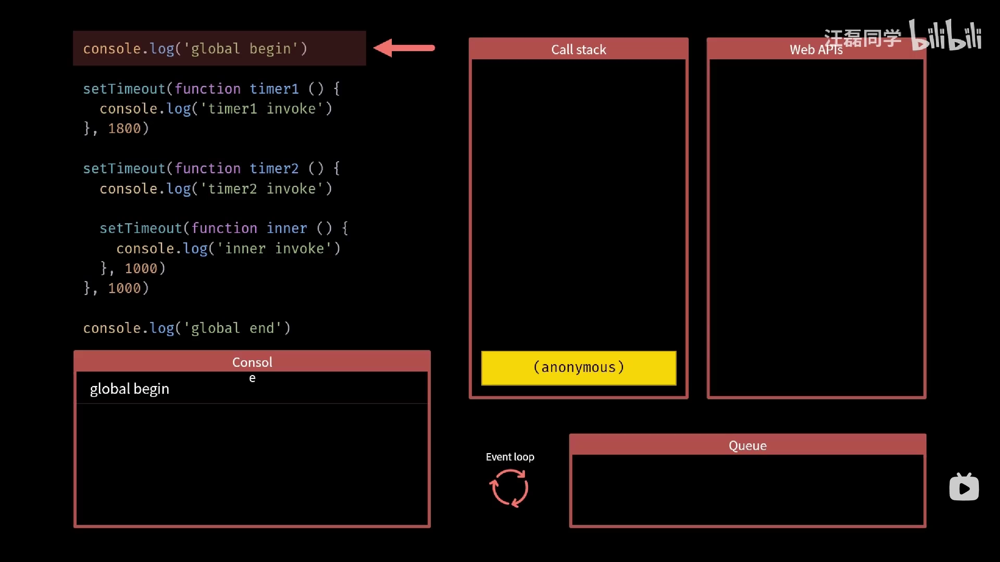

- `setTimeout()` 压入调用栈，由于 setTimeout 是一个异步 API，所以 JS 引擎会单独用一个线程去负责执行该异步 API 中的异步逻辑，所以这里 Web APIs 就会开始独立地开启 1.8s 的倒计器，同时 `setTimeout()` 会立马被弹出调用栈（避免在调用栈中阻塞）


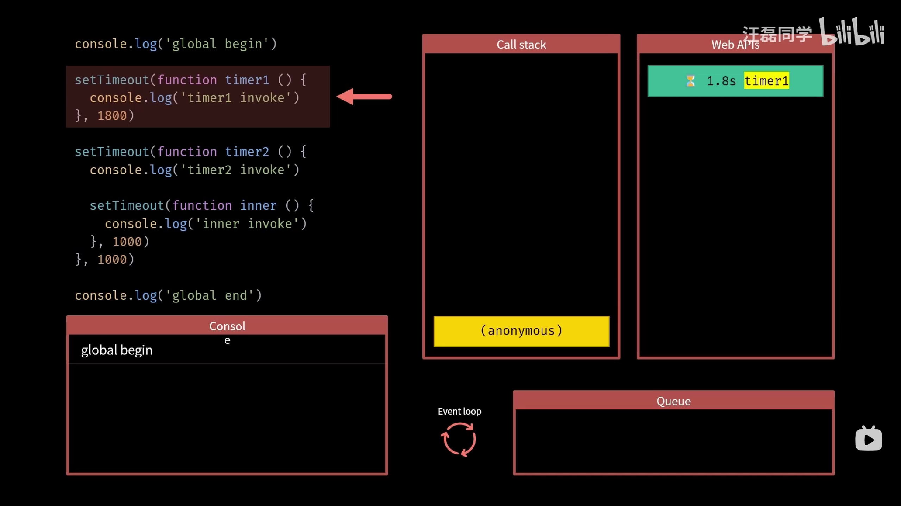

- 之后又遇到一个倒计时器，所以先压栈，开启倒计时器，弹栈

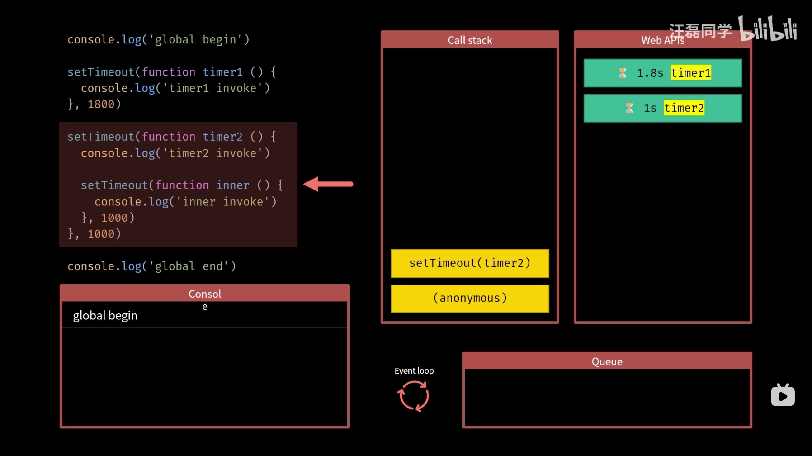


- 最后遇到一个 console.log 调用，所以压栈，执行打印，弹栈

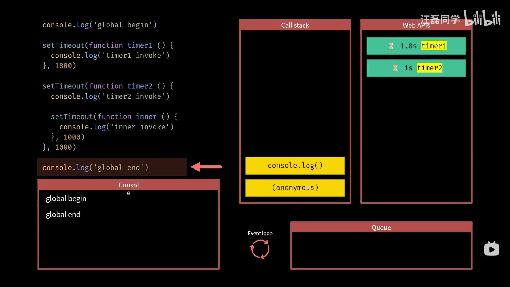

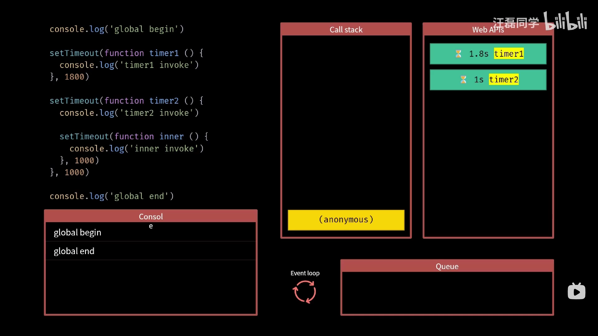

- 调用栈被清空


- 由于 Call stack（调用栈）为空，所以 Event loop（事件循环）机制就会去 Queue（任务队列）中取任务（回调函数）放入调用栈中去执行，而目前 Queue 中没有任务，所以就不进行任何操作

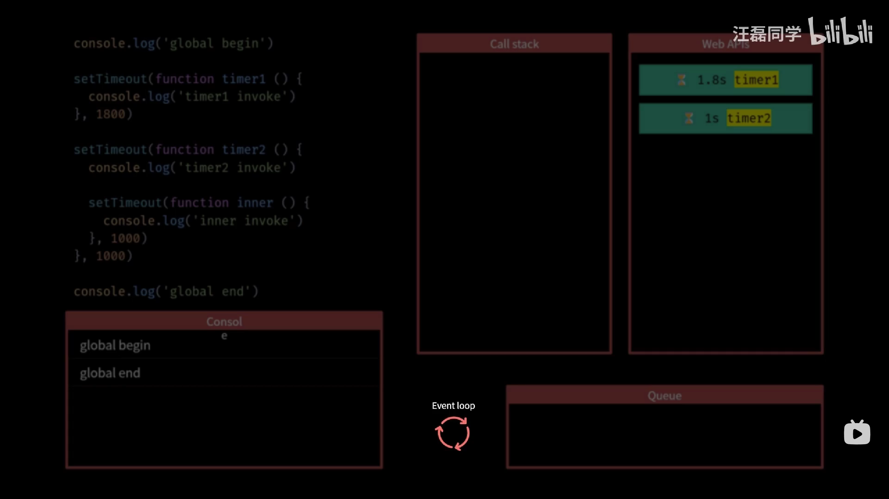

- 1s 后，timer2 率先完成，从 Web APIs 中结束，其对应的回调函数便会被放入到 Queue 中的第一位

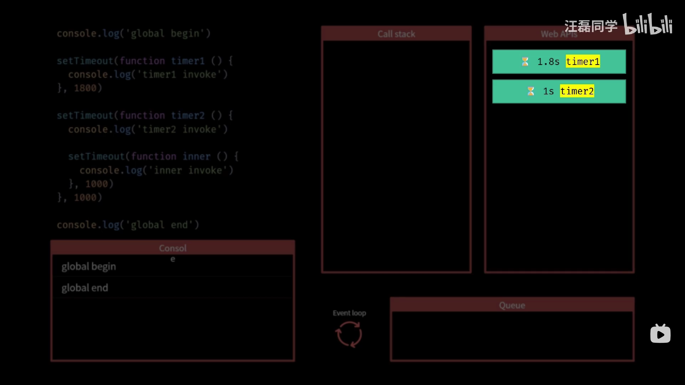


- 同理，1.8s 后 timer2 完成，从 Web APIs 中结束，其对应的回调函数便会被放入到 Queue 中的第二位

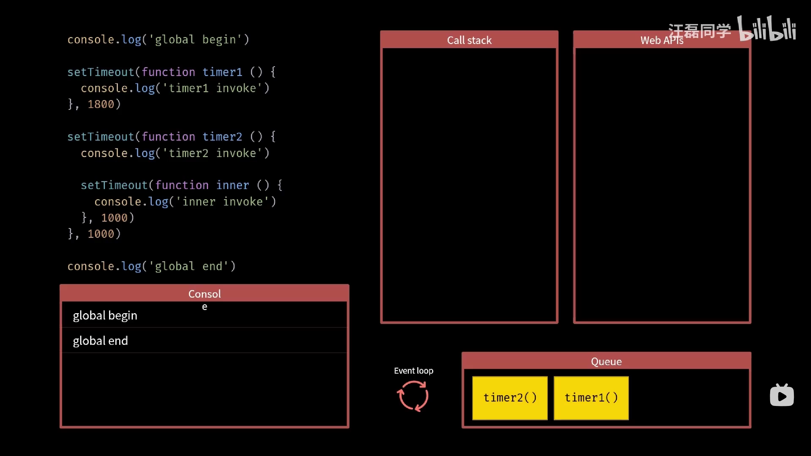

- 由于 Call stack 为空，且 Queue 不为空，所以 Event loop 便会将 Queue 中的第一位任务 timer2 压入 Call stack 中

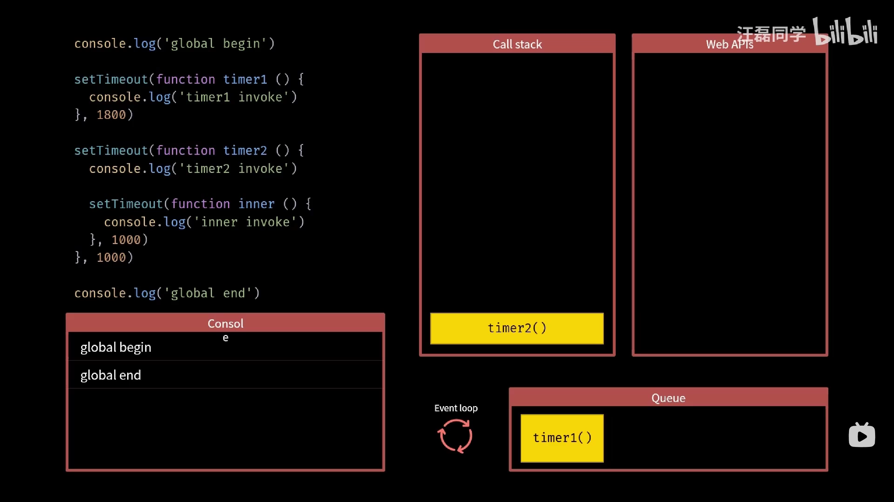

- 此时，调用栈开启了新一轮的执行，压入 console.log，执行打印，弹出 console.log，压入 setTimeout，独立开启倒计时器，弹出 setTimeout，清空调用栈


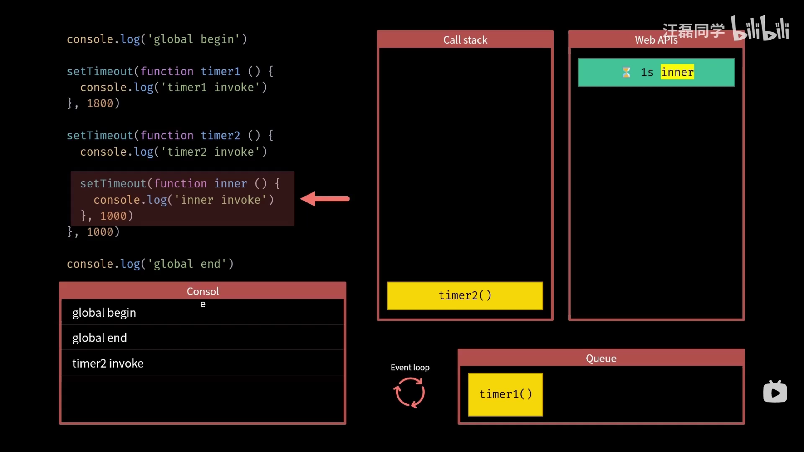

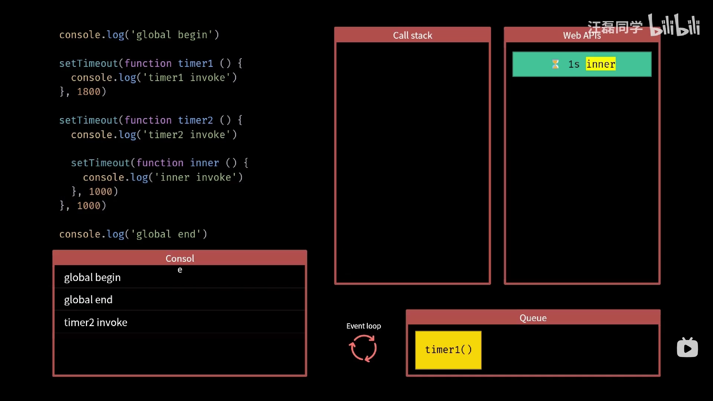

- Call stack 为空，Queue 不为空，Event loop 将 Queue 中第一位任务 timer1 压入 Call stack，开启新一轮执行


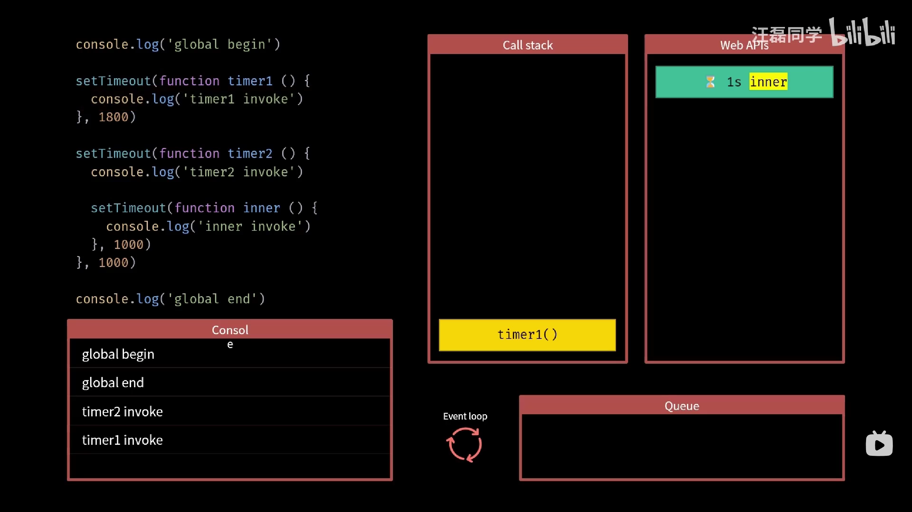


- 后续同理，直至结束……


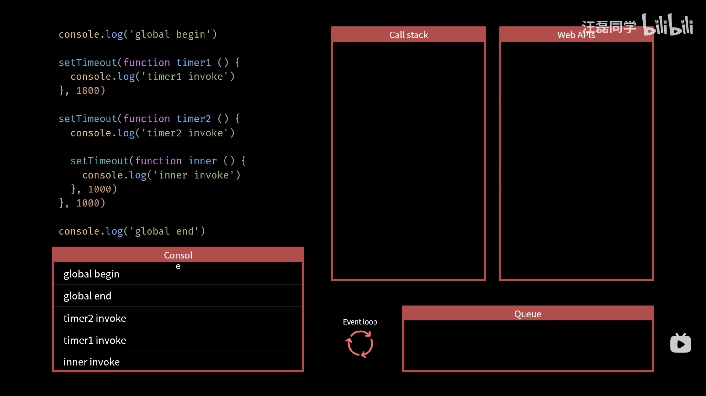

> 说明：
>
> 1. Web APIs 在 JS 引擎中不止一个，而是多个（Web APIs 加 s 的由来），至于有多少个要看 JS 代码执行了多少个异步的 API，图中把其画成一个整体是为了方便理解！
> 2. JS 是单线程的，但是为什么会有 Web APIs 这种单独处理异步逻辑的独立线程呢？这是因为，虽然 JS 是单线程的，但是 JS 的单线程指的是执行 JS 代码的执行器是单线程的，而 JS 引擎本身却是多线程的！当 JS 代码中遇到异步 API 时，JS 引擎会单独开启一个相应的异步处理线程（例如：计时器）去独立处理这部分异步逻辑，在处理完成后再将其放入 Queue 任务队列中，等待 Event loop 事件循环机制将其在 Call stack 调用栈为空时压入其中，执行其对应的回调函数。也就是依靠这样的机制，JS 才能实现单线程下的异步编程！
> 3. Web APIs 一但完成就会立马放入 Queue 中，Web API 之间也无顺序可言，先完成的 Web API 就会先进入 Queue 中。而 timer1 timer2 inner 实际放入 Queue 的时间点也不一定是图上展示的，比如 timer1 可能在 Call stack 还未为空时就已经放入 Queue 了（当同步代码执行时间大于 1s 时），而 timer2 在放入 Queue 时，可能 timer1 已经被压入 Call stack 了……，图中之所以这样画，是为了方便理解。

JS 异步模式执行流程图：


## 四、回调函数

> 回调函数：所有异步编程方案的根基！

回调函数的理解：

1. 我要做一件事
2. 我知道做这件事的步骤
3. 但做这件事之前依赖他人的一个任务，并且我不知道他什么时候能弄完
4. 我还有其他事，我不想干等着他
5. 于是，我干脆把这件事怎么做的步骤提前教给他，让他在把任务完成后帮我随带做了
6. 我开开心心的去做其他事了

举例：

1. 我要做一盘炸鸡
2. 我知道做炸鸡的步骤
3. 女朋友去买鸡肉了，但不知道她什么时候能买回来
4. 我还要出去和朋友蹦迪，不想干等着她
5. 于是，在女朋友出门之前，我把做炸鸡的步骤（回调函数）教给了她，让她在买到鸡肉后，直接开炸（执行回调函数）
6. 我开开心心的去蹦迪了

这种，由调用者定义，交给执行者执行的函数就叫做：回调函数！

**回调函数的用法：把函数作为参数传递**

```js
const love = function () {
    console.log('Node.js YYDS!');
}

setTimeout(love, 3000);

// 3s 后，setTimeout 会自动调用（回调）love 函数
```

```js
// 你也可以直接把回调函数写到形参中
setTimeout(() => {
    console.log('Node.js YYDS!');
}, 3000);
```

除了异步 API 中使用回调函数外，在实际开发中回调函数的写法也在许多场景下更为合理：

```js
function myDisplayer(some) {
    console.log(some);
}

function myCalculator(num1, num2) {
    let sum = num1 + num2;
    return sum;
}

// 调用计算器函数 (myCalculator) 保存结果，然后调用另一个函数 (myDisplayer) 来显示结果
let result = myCalculator(5, 5);
myDisplayer(result);
```

```js
// 调用计算器函数 (myCalculator)，并让计算器函数调用显示函数 (myDisplayer)
function myDisplayer(some) {
    console.log(some);
}

function myCalculator(num1, num2) {
    let sum = num1 + num2;
    myDisplayer(sum);
}

myCalculator(5, 5);
```

```js
// 使用回调，在计算完成后让计算器函数运行回调
function myDisplayer(some) {
  console.log(some);
}

function myCalculator(num1, num2, myCallback) {
  let sum = num1 + num2;
  myCallback(sum);
}

myCalculator(5, 5, myDisplayer);
```

---

```js
// Ajax 请求案例
function myDisplayer(some) {
    console.log(some);
}

function getFile(myCallback) {
    let req = new XMLHttpRequest();
    req.open('GET', "my.html");
    req.onload = function () {
        if (req.status == 200) {
            myCallback(this.responseText);
        } else {
            myCallback("Error: " + req.status);
        }
    }
    req.send();
}

getFile(myDisplayer);

/* 
注意：Ajax 天生就是异步的
所以即便把 myCallback(this.responseText) 改为 console.log(this.responseText)
代码的运行依旧是异步的，先执行后续代码，等请求结束后再执行 req.onload 中的逻辑（onload 是一个事件，事件是异步的）
这里的例子，主要是演示回调函数对于改变代码结构的好处，毕竟如果 req.onload 内的逻辑比较复杂，使用回调来解耦是个好思路
*/
```

上述例子也许不能给你带来震撼，或许你还会觉得多此一举，实际上在真实开发场景中，利用好回调函数，可以极大的优化代码的结构！

> 除了回调函数之外，事件监听 和 发布/订阅 也是最为常见异步操作模式，这里就不展开了。

## 五、Promise

> Promise：一种更优的异步编程统一方案

为什么会出现 Promise？

下面的例子中，涉及到多个异步操作，后一个异步操作依赖于前一个异步操作的结果，所以只能把后一个异步操作放在前一个异步操作的回调函数里，这样就不可避免形成回调函数的嵌套！

```js
setTimeout(() => {
    console.log("云南省");
    const str01 = "云南省";
    setTimeout(() => {
        console.log(str01 + "玉溪市");
        const str02 = "云南省玉溪市";
        setTimeout(() => {
            console.log(str02 + "峨山县");
        }, 1000, str02);
    }, 1000, str01);
}, 1000);

/*
云南省
云南省玉溪市
云南省玉溪市峨山县
*/
```

```js
function sayNum(name, callback) {
    setTimeout(() => {
        console.log(name);
        callback();
    }, 1000);
}

sayNum('one', () => {
    sayNum('two', () => {
        sayNum('three', () => {
            sayNum('four', () => {
                console.log('结束了');
            });
        });
    });
});

/*
one
two
three
four
结束了
*/
```

可见，用传统回调函数去处理较为复杂的异步问题时很容易形成深层次的回调函数嵌套问题，俗称 “回调地域” 或 “死亡金字塔”，倒不是说这种方式不行，而是这种方式编写的代码可读性极差！可维护性极差！稍微复杂一点的业务，随便一点更改都会 “牵一发而动全身” 维护起来简直让人崩溃！

“要是异步编程可以向同步编程一样就好了！”

所以，Promise 来了，Promise 诞生的目的就是为了让异步编程长得像 “同步”！

> CommonJS 社区率先提出了 Promise 规范，后来在 ES2015（ES6） 中被标准化，成为语言规范。

**那到底什么是 Promise？**

Promise 是异步操作的一种解决方案，从语言层面来说 Promise 就是一个 JS 对象！

Promise 这个对象用来表示一个异步任务最终结束后是成功还是失败。

Promise 有三种状态：Pending（等待）、Fulfilled（成功）、Rejected（失败）。

在最终状态（要么成功，要么失败）确定后，相对应的任务便会被自动执行。


**那 Promise 怎么用呢？**

对于每一个异步任务，我们都应该创建一个 Promise 对象来管理它：

> 当我们 new Promise 的一瞬间，该 Promise 中的异步任务就开始执行了！

```js
const promise = new Promise((resolve, reject) => {
    // 异步任务
});
```

在创建 Promise 对象时，规定必须传入一个回调函数！

这个回调函数有两个参数 `resolve` 和 `reject`，这两个参数实际上也是两个函数，我们可以直接调用它：

> 参数 `resolve` 和 `reject` 的名称是可以任取的，但是推荐使用这两个！

- 实例化 Promise 后，默认是 Pending 等待状态。

- 当执行 `resolve()` 时，Promise 从 Pending 状态 ——> Fulfilled 成功状态。

- 当执行 `reject()` 时，Promise 从 Pending 状态 ——> Rejected 失败状态。

例如，我们可以：

```js
// 伪代码
const promise = new Promise((resolve, reject) => {
    console('这是一个异步任务（比如网络请求）……');
    if (结果成功) {
        resolve();
    } else {
        reject();
    }
});
```

> 注意：当 Promise 的状态一但从等待转变为某一个状态后，后续的转变就自动忽略了，比如：先调用 `resolve()` 再调用 `reject()`，那么 Promise 的最终结果依旧是成功状态。

现在，我们知道了异步任务要用 Promise 来包装，异步结果成功了执行 `resolve()`，失败了执行 `reject()`，然后 Promise 的状态也就随之改变为了成功态或失败态，那么成功或失败后的处理逻辑又该写去哪里呢？换句话说，原来回调函数里的内容要写去哪里呢？

我们通过这幅图，可以看出，Fulfilled 和 Rejected 应该都有一个各自的回调函数来处理成功或失败后的逻辑，问题是这两个回调函数在哪？


答案是：then 方法里！

当我们实例化 Promise 后得到的 Promise 对象便具有一个 `then` 方法。

```js
const promise = new Promise((resolve, reject) => {
    // 异步任务
});

promise.then(function onFulfilled() { }, function onRejected() { });
```

```js
const promise = new Promise((resolve, reject) => {
    // 异步任务
});

// 通常我们写箭头函数
promise.then(() => { }, () => { });
```

then 方法具有两个回调函数作为参数 `()=>{}, ()=>{}`。

- 当 Promise 对象转为成功状态时就默认自动执行 then 方法的第一个回调函数
- 当 Promise 对象转为失败状态时就默认自动执行 then 方法的第二个回调函数

换句话说：then 方法的第一个回调函数里就写异步处理成功后的逻辑，第二个回调函数里就写异步处理失败后的逻辑。

例如，我们可以：

```js
// 伪代码
const promise = new Promise((resolve, reject) => {
    console('这是一个异步任务（比如网络请求）……');
    if (结果成功) {
        resolve();
    } else {
        reject();
    }
});

promise.then(() => {
    console.log('成功了！');
}, () => {
    console.log('失败了！');
});
```

显然，此时还差点什么……

数据呢？以前用回调函数时，回调函数里可是能接收参数的，比如（Ajax 请求返回的数据），那 then 的两个回调函数又怎么接收成功或失败的数据呢？

`resolve()` 和 `reject()` 函数是可以接收参数（形参）的！

- `resolve()` 接收的参数会传递给 then 方法的第一个回调函数
- `reject()` 接收的参数会传递给 then 方法的第二个回调函数

> 注意：通常我们不仅仅会传递一个基本数据类型的值，我们还常常传递对象。比如：在 reject 中传递一个错误对象 `reject(new Error("出错了！"));`

例如，我们可以：

```js
// 伪代码
const promise = new Promise((resolve, reject) => {
    console('这是一个异步任务（比如网络请求）……');
    if (结果成功) {
        resolve('成功数据');
    } else {
        reject(new Error('信息信息'));
    }
});

promise.then(res => {
    console.log(`成功了！数据是：${res}`);
}, rej => {
    console.log(`失败了！${rej}`);
});
```

注意：就算 Promise 对象里没有任何的异步任务，它所对应的 then 方法中的回调函数依旧要进入到任务队列中排队，直到同步代码执行完了，才会执行两个回调函数。

证明：

```js
const promise = new Promise((resolve, reject) => {
    resolve('成功');
});

promise.then(res => {
    console.log(res);
}, rej => {
    console.log(rej);
});

console.log('同步代码');

/*
同步代码
成功
*/
```

下面，我们就用 Promise 来重构 Ajax 案例吧：

```js
// Promise 简单封装 Ajax
function ajax(url) {
    return new Promise((resolve, reject) => {
        const xhr = new XMLHttpRequest();
        xhr.open('GET', url);
        xhr.responseText = 'json';
        xhr.onload = function () {
            if (this.status === 200) {
                resolve(this.response);
            } else {
                reject(new Error(this.statusText));
            }
        }
        xhr.send();
    });
}

ajax('./test.json').then(res => {
    console.log(res);
}, rej => {
    console.log(rej);
});
```

## 六、Promise链式调用

学习了 Promise 的基本用法，你开始满怀信心要去解决 “回调地域” 问题了，于是你开始重构之前的案例：

```js
setTimeout(() => {
    console.log("云南省");
    const str01 = "云南省";
    setTimeout(() => {
        console.log(str01 + "玉溪市");
        const str02 = "云南省玉溪市";
        setTimeout(() => {
            console.log(str02 + "峨山县");
        }, 1000, str02);
    }, 1000, str01);
}, 1000);

/*
云南省
云南省玉溪市
云南省玉溪市峨山县
*/
```

```js
new Promise(resolve => {
    setTimeout(() => {
        console.log("云南省");
        resolve("云南省");
    }, 1000);
}).then(res => {
    new Promise(resolve => {
        setTimeout(() => {
            console.log(res + "玉溪市");
            resolve("云南省玉溪市");
        }, 1000);
    }).then(res => {
        new Promise(resolve => {
            setTimeout(() => {
                console.log(res + "峨山县");
            }, 1000);
        });
    });
});

/*
云南省
云南省玉溪市
云南省玉溪市峨山县
*/
```

好家伙！原来是 “回调地狱”，用了 Promise 后，变成 “then 地狱” 了！What F**k？

Promise 这么强大，一定是我的问题，改进一下代码：

```js
function time(place) {
    return new Promise(resolve => {
        setTimeout(() => {
            console.log(place);
            resolve(place);
        }, 1000);
    });
}

time('云南省').then(res => {
    time(res + '玉溪市').then(res => {
        time(res + '峨山县');
    });
});

/*
云南省
云南省玉溪市
云南省玉溪市峨山县
*/
```

卧艹！这不还是 “then 地狱” 吗？这也没解决地域嵌套问题啊！

别急，之所以解决不了嵌套问题，是因为你没有利用到 Promise 的链式调用！

那 Promise 的链式调用长什么样呢？

```js
// 这里省略了 then 的第二个回调
promise.then(() => {  
}).then(() => {
}).then(() => {
}).then(() => {
});
```

嗯，就是长这样！是不是一脸懵逼 ^^

我们先来看几句话：

1. Promise 对象的 then 方法会自动返回一个全新的 Promise 对象
2. 后一个 then 方法就是在为上一个 then 方法返回的 Promise 对象注册回调
3. 上一个 then 方法中的回调函数的返回值会作为后面 then 方法回调的参数
4. 如果 then 中返回的是手动 new 的 Promise，那么下一个 then 就是属于这个 Promise 的，then 中的回调函数会等待这个 Promise 中的异步任务结束才执行

下面我们来详细解释：

首先，then 方法执行后会默认自动返回一个新的 Promise 对象。

then 方法其实默认返回的是 undefined，即：`return undefined`，但是 ES6 的机制规定：当 then 返回 undefined 时，会自动将这个 undefined 包装成一个 Promise，并且这个 Promise 默认调用了 `resolve()` 方法（成功态），并且把 undefined 作为了 `resolve()` 的参数，相当于：

```javascript
const promise = new Promise((resolve, reject) => {
    resolve();
});

promise.then(() => {
    // 默认会执行这一条
    // return undefined;
    
    // 而 ES6 会将其处理成这样
    // return new Promise(resolve => {
    //     resolve(undefined);
	// });
});
```

```js
// 现在我们来链式调用
const promise = new Promise((resolve, reject) => {
    resolve();
});

promise.then(() => {
    // return new Promise(resolve => {
    //     resolve(undefined);
	// });
}).then(res => {
    console.log(res);	// undefined
});
```

假如说，我们在 then 中手动返回了某个值，那么这个值也会被自动包装成一个 Promise，并且这个 Promise 默认调用了 `resolve()` 方法（成功态），并且把这个值作为了 `resolve()` 的参数。

```js
const promise = new Promise((resolve, reject) => {
    resolve();
});

promise.then(() => {
    // return new Promise(resolve => {
    //     resolve(undefined);
	// });
}).then(res => {
    console.log(res);	// undefined
    return '牛批';
    // return new Promise(resolve => {
    //     resolve('牛批');
	// });
}).then(res => {
    console.log(res);	// 牛批
});
```

如果要让 then 返回一个失败状态的 Promise，那么我们可以手动 return 一个 Promise 并执行 `reject()` 方法。

```js
const promise = new Promise((resolve, reject) => {
    resolve();
});
promise.then(() => {
    // 手动返回一个调用了 reject 的 Promise
    return new Promise((resolve, reject) => {
        reject('失败');
    })
}).then(() => { }, rej => {
    console.log(rej);	// 失败
});
```

当然，成功状态的 Promise 也是可以手动 return 的，毕竟很多时候我们需要 then 返回的是一段复杂的逻辑代码，所以只能手动包装 Promise，当然如果只是需要返回一个结果，那么直接返回更方便。

学习了以上知识，现在我们终于可以用 Promise 改造之前的回调地狱案例了！

```js
new Promise(resolve => {
    setTimeout(() => {
        console.log("云南省");
        resolve("云南省");
    }, 1000);
}).then(res => {
    return new Promise(resolve => {
        setTimeout(() => {
            console.log(res + "玉溪市");
            resolve(res + "玉溪市");
        }, 1000);
    });
}).then(res => {
    setTimeout(() => {
        console.log(res + "峨山县");
    }, 1000);
});

/*
云南省
云南省玉溪市
云南省玉溪市峨山县
*/
```


可见 Promise 的链式调用设计得非常巧妙！通过每轮 then 中 return 出一个新的 Promise，就把嵌套的 then 变为了链式的 then！

## 七、Promise异常处理

根据之前所学，Promise 一但为失败态，就会调用其 then 方法的第二个回调函数，常见的情况如下：

```js
const promise = new Promise((resolve, reject) => {
    reject('失败');
});

promise.then(() => { }, rej => {
    console.log('第二个回调被执行');
    console.log(rej);
});

/*
第二个回调被执行
失败
*/
```

```js
const promise = new Promise((resolve, reject) => {
    reject(new Error('失败'));
});

promise.then(() => { }, rej => {
    console.log('第二个回调被执行');
    console.log(rej);
});

/*
第二个回调被执行
Error: 失败
    at c:\Users\wwwzj\Desktop\app.js:2:12
    at new Promise (<anonymous>)
    at Object.<anonymous> (c:\Users\wwwzj\Desktop\app.js:1:17)
    at Module._compile (node:internal/modules/cjs/loader:1159:14)
    at Module._extensions..js (node:internal/modules/cjs/loader:1213:10)
    at Module.load (node:internal/modules/cjs/loader:1037:32)
    at Module._load (node:internal/modules/cjs/loader:878:12)
    at Function.executeUserEntryPoint [as runMain] (node:internal/modules/run_main:81:12)
    at node:internal/main/run_main_module:23:47
*/
```

```js
const promise = new Promise((resolve, reject) => {
    // 这是一个不存在的方法
    err();
});

promise.then(() => { }, rej => {
    console.log('第二个回调被执行');
    console.log(rej);
});

/*
第二个回调被执行
ReferenceError: err is not defined
    at c:\Users\wwwzj\Desktop\app.js:3:5
    at new Promise (<anonymous>)
    at Object.<anonymous> (c:\Users\wwwzj\Desktop\app.js:1:17)
    at Module._compile (node:internal/modules/cjs/loader:1159:14)
    at Module._extensions..js (node:internal/modules/cjs/loader:1213:10)
    at Module.load (node:internal/modules/cjs/loader:1037:32)
    at Module._load (node:internal/modules/cjs/loader:878:12)
    at Function.executeUserEntryPoint [as runMain] (node:internal/modules/run_main:81:12)
    at node:internal/main/run_main_module:23:47
*/
```

```js
const promise = new Promise((resolve, reject) => {
    // 手动抛出一个异常
    throw new Error('这是一个异常');
});

promise.then(() => { }, rej => {
    console.log('第二个回调被执行');
    console.log(rej);
});

/*
第二个回调被执行
Error: 这是一个异常
    at c:\Users\wwwzj\Desktop\app.js:3:11
    at new Promise (<anonymous>)
    at Object.<anonymous> (c:\Users\wwwzj\Desktop\app.js:1:17)
    at Module._compile (node:internal/modules/cjs/loader:1159:14)
    at Module._extensions..js (node:internal/modules/cjs/loader:1213:10)
    at Module.load (node:internal/modules/cjs/loader:1037:32)
    at Module._load (node:internal/modules/cjs/loader:878:12)
    at Function.executeUserEntryPoint [as runMain] (node:internal/modules/run_main:81:12)
    at node:internal/main/run_main_module:23:47
*/
```

我们在使用 Promise 的时候，大部分情况下，习惯性只用 `resolve()` 方法（成功态），所以在 Promise 回调函数中我们常常省略 reject 参数，在 then 中我们常常省略第二个回调函数，例如：

```js
const promise = new Promise(resolve => {
    //...
    resolve();
});

promise.then(() => {
    //...
});
```

但是我们还是需要处理异步中的异常，所以 Promise 提供了我们一个 `catch()` 方法专门用来处理 Promise 的异常（失败态），并且 `catch()` 对于处理 Promise 链式调用情况下的异常会非常的方便。

实际上，catch 本质上是 then 的特例，或者说是 then 的语法糖：

```js
new Promise((resolve, reject) => {
    reject("失败");
}).then(res => {
    console.log(res);
}).catch(err => {
    console.log(err);   // 失败
});

// -------------------------------
// 上面的代码本质上等同于
new Promise((resolve, reject) => {
    reject("失败");
}).then(res => {
    console.log(res);
}).then(undefined, err => {
    console.log(err);	// 失败
});
```

**在 Promise 链式调用中，一但出现异常，异常便会顺着链条向下传递，直至遇到可以处理异常的函数。**

> 如果有多个异常处理函数，那么某个异常被某个处理函数处理之后，异常就终止了，不会再往后传递给后续的异常处理函数！

使用 catch 可以捕获 catch 之前链条上的所有异常！相当于给一段 Promise 链条，甚至是整条 Promise 链条设置了统一的异常处理，非常的方便！

捕获所有 error 的最简单的方法是，将 `.catch` 附加到链的末尾：

```js
fetch('/article/promise-chaining/user.json')
    .then(response => response.json())
    .then(user => fetch(`https://api.github.com/users/${user.name}`))
    .then(response => response.json())
    .then(githubUser => new Promise((resolve, reject) => {
        let img = document.createElement('img');
        img.src = githubUser.avatar_url;
        img.className = "promise-avatar-example";
        document.body.append(img);
        setTimeout(() => {
            img.remove();
            resolve(githubUser);
        }, 3000);
    }))
    .catch(error => console.log(error.message));
```

由于 catch 是 then 的特例，所以 catch 依旧返回一个全新的 Promise 对象，我们可以在 catch 后继续调用 then。

```js
new Promise((resolve, reject) => {
    reject("失败");
}).then(res => {
    console.log(res);
}).catch(err => {
    console.log(err);   // 失败
    return "测试";
}).then(res => {
    console.log(res);	// 测试 
}).catch(err => {
    console.log(err);   // 一个链条上可以有多个 catch
});
```

> 一般总是建议，Promise 对象后面要跟一个或多个 catch 方法。

除了 then 和 catch 外，还有一个 finally 方法！

 当 Promise 状态发生变化时，不论如何变化都会执行，不变化不执行。

- `finally()` 不能接收参数
- finally 也是 then 的特例
- finally 也会返回全新的 Promise

```js
new Promise(resolve => {
    resolve("成功");
}).finally(data => {
    console.log(data + " finally01");
    return new Promise((resolve, reject) => {
        reject("失败");
    })
}).finally(data => {
    console.log(data + " finally02")
}).catch(err => {
    console.log("catch: " + err);
});

/*
undefined finally01
undefined finally02
catch: 失败
*/

// date 为 undefined，所以 finally 接收不了任何参数，写成 finally(() => {}) 即可
```

`finally`：主要是用来处理一些必做操作，比如在操作数据库之后（无论成功与否）都要关闭数据库连接。

## 八、Promise静态方法

`Promise.resolve()` 和 `Promise.reject()`

> 以上两者都是 Promise 构造函数的方法。

`Promise.resolve()` 可以理解为普通成功状态的一种简写形式：

```js
Promise.resolve('hi');

// 等同于
new Promise(resolve => resolve('hi'));
```

- 一般参数

```js
Promise.resolve('hi').then(res => {
    console.log(data);
});	// hi
```

- Promise 参数

```js
// Promise 作为参数，得到的依旧是其本身
const promise1 = new Promise(resolve => { });
const promise2 = Promise.resolve(promise1);
console.log(promise1 === promise2);	// true
```

`Promise.reject()` 可以理解为普通失败状态的一种简写形式：

```js
Promise.reject('err');

// 等同于
new Promise((resolve, reject) => {
    reject('err');
});
```

```js
Promise.reject(new Error('err'));

// 等同于
new Promise((resolve, reject) => {
    reject(new Error('err'));
});
```

## 九、Promise并行执行

我们之前学习了 Promise 的链式调用，多个异步任务之间是按照前后顺序来依次执行的。不过，某些时候我们却需要多个异步任务并行执行，比如：我们需要请求多个独立的 API 网络接口，那么最好的做法就是让这些异步请求同时并行执行，这样可以大大提高效率。

但多个异步任务必然有多个异步结果（状态），有没有一种办法可以统一管理这些并行请求的状态呢？

- `Promise.all()` 可以关注多个 Promise 对象的状态变化。

`Promise.all()`  需要接收一个数组作为参数，数组中的每个元素都是一个 Promise 对象。

`Promise.all()`  会返回一个全新的 Promise 对象，当数组中并行执行的所有异步任务都成功时，返回的 Promise 便是成功态的，其 then 方法的第一个回调函数便会接收到一个数组，数组元素是每一个异步任务的成功结果。反之，只要有任何一个异步任务失败了，那么返回的 Promise 就是失败态的。

```js
/*
Promise.all() 的状态变化与所有传入的 Promise 实例对象状态有关
所有状态都变成 resolved，最终的状态才会变成 resolved
只要有一个变成 rejected，最终的状态就变成 rejected
用途举例：在用 Ajax 从后端接口获取数据的时候，如果全部获取到了，那么才处理，否则不处理。
*/

const delay = ms => {
    return new Promise(resolve => {
        setTimeout(resolve, ms);
    });
};

// 示例一：所有状态都变为 resolved
const p1 = delay(1000).then(() => {
    console.log('p1 完成了');
    return 'p1';
});
const p2 = delay(2000).then(() => {
    console.log('p2 完成了');
    return 'p2';
});
const p = Promise.all([p1, p2]);
p.then(res => {
    console.log(`${res} 成功，res 是一个数组，元素是各个 Promise 成功的结果：${res.length}，${res[0]}，${res[1]}`);
}, err => {
    console.log(err + " 失败");
});

/*
p1 完成了
p2 完成了
p1,p2 成功，res 是一个数组，元素是各个 Promise 成功的结果：2，p1，p2
*/
```

```js
const delay = ms => {
    return new Promise(resolve => {
        setTimeout(resolve, ms);
    });
};

// 示例二：出现一个 rejected 状态
const p1 = delay(1000).then(() => {
    console.log('p1 完成了');
    return Promise.reject('p1');
});
const p2 = delay(2000).then(() => {
    console.log('p2 完成了');
    return 'p2';
});
const p = Promise.all([p1, p2]);
p.then(res => {
    console.log(res + " 成功");
}, err => {
    console.log(err + " 失败");
});
/*
p1 完成了
p1 失败
p2 完成了
*/

/*
解释：
1、执行 p1，输出 p1 完成了
2、检测到 rejected，Promise.all() 直接变为 rejected，执行 then 第二个回调输出 p1 失败，至此 Promise.all() 已经执行完毕。
3、由于 p2 延迟了两秒执行所以在后面输出（如果 p2 延时小于 p1，那么应该先输出 p2 完成了，然后在是 p1 完成了，p1 失败）
*/
```

- `Promise.race()`

`Promise.race()` 的状态取决于第一个完成的 Promise 实例对象，如果第一个完成的成功了，那么最终就是成功的；如果第一个完成的失败了，那么最终就是失败的。

注意：不是第一个任务，而是第一个完成的任务！

用途举例：

```js
const request = ajax('/test.json');
const timeout = new Promise((resolve, reject) => {
    setTimeout(() => reject(new Error('timeout')), 1000);
});

Promise.race([request, timeout]).then(value => {
    console.log(value);
}).catch(error => {
    console.log(error);
});

// 当 ajax 请求在 1s 内返回结果时，就成功，超过 1s 就失败
```

- `Promise.allSettled()`

`Promise.allSettled()` 的状态与传入的 Promise 状态无关。

它永远都是成功的，只会执行 then 的第一个回调函数。

用途：用于记录下各个 Promise 的表现：

```js
const delay = ms => {
    return new Promise(resolve => {
        setTimeout(resolve, ms);
    });
};

const p1 = delay(1000).then(() => {
    console.log('p1 完成了');
    return 'p1';
});
const p2 = delay(2000).then(() => {
    console.log('p2 完成了');
    return Promise.reject('p2');
});

const p = Promise.allSettled([p1, p2]);
p.then(res => {
    console.log(res);
});

/*
p1 完成了
p2 完成了
[
  { status: 'fulfilled', value: 'p1' },
  { status: 'rejected', reason: 'p2' }
]
*/
```

## 十、Promise执行时序

我们已经知道，Promise 中就算没有任何的异步任务，其 then 中的回调函数也需要到任务队列中进行排队，在同步代码都执行完成后，才会执行 then 中的回调函数。

那下面我们来看一个例子：

```js
console.log('start');

setTimeout(() => {
    console.log('setTimeout');
}, 0);

Promise.resolve().then(() => {
    console.log('promise 1');
}).then(() => {
    console.log('promise 2');
});

console.log('end');
```

这段代码的执行结果应该是什么呢？

按照我们之前的学习，先执行同步代码，后根据先后顺序执行异步任务，先执行完的异步任务先进入任务队列，然后等调用栈空时，就会逐个回调。

所以，执行结果应该是：

```
start
end
setTimeout
promise 1
promise 2
```

可惜，事情没有我们想的简单，真实的执行结果是：


Promise 在 setTimeout 之前，这是为什么呢？

原因是，Promise 和 setTimeout 所对应的是不同的任务队列，Promise 是 “微任务”，setTimeout 是 “宏任务”，宏任务是加入到 “任务队列” 中，而微任务则是加入到 “微任务队列” 中，事件循环机制是在不断地执行宏任务，每个宏任务执行完毕都会先将当前的微任务队列清空，然后在执行下一个宏任务，所以 “微任务” 优先级高于 “宏任务”！

微任务（micro task）如：Promise、MutationObserver、process.nextTick

宏任务（macro task 或 callback queue）如：setTimeout、setInterval、I/O 等大部分异步 API

> 以上只是对宏任务和微任务进行一个简单粗略的介绍，深层次的内容涉及 JS 引擎的多个方面，请查询其他文档。

## 十一、Promise的注意事项

resolve 或 reject 执行后的代码依旧是会执行的，但是极度不推荐这么做！

为了确保安全，推荐在调用 resolve 或 reject 函数的时候加上 return，不再执行它们后面的代码。

```javascript
new Promise((resolve, reject) => {
    resolve();
    // 后面的代码会执行
    console.log('hi');	// hi
});

// 推荐加上 return
new Promise((resolve, reject) => {
    return resolve();
    console.log('hi');	// 不执行
});
```

Promise.all/race/allSettled 的参数如果不是 Promise 数组，会将不是 Promise 数组的元素转变成 Promise 对象且是成功态的！

```javascript
// 举例：
Promise.all([1, 2, 3]).then(datas => {
    console.log(datas);
});

// 等价于：
Promise.all([
    Promise.resolve(1),
    Promise.resolve(2),
    Promise.resolve(3)
]).then(datas => {
    console.log(datas);
});
```

不只是数组，任何可遍历的类型都可以作为参数，且依旧是会将其转变成 Promise 对象且是成功态的。

> 原生可遍历：数组、字符串、Set、Map、NodeList、arguments
> 非原生可遍历：迭代器

Promise.all/race/allSettled 的错误处理：

- 单独处理：在每一个 Promise 对象后用 `catch()` 单独处理
- 统一处理：在 Promise.all/race/allSettled 后用 `catch()` 统一处理

> 注意：某个错误一但处理过一次，那么就不会在后续再被处理了。

## 十二、async/await语法糖

