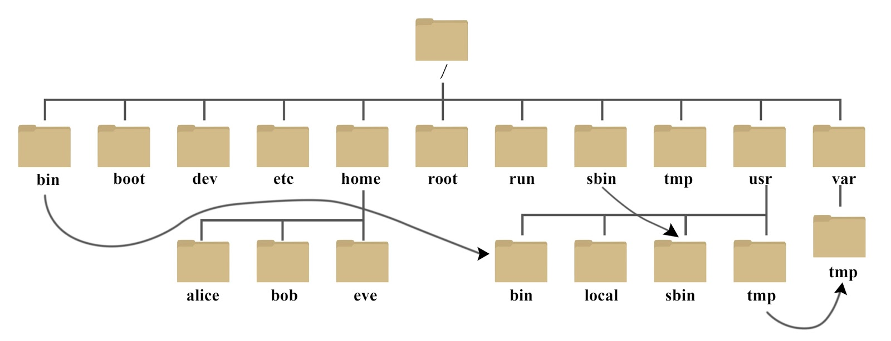

# Linux基础精粹

> 原创内容，转载请注明出处！

> Linux，全称 GNU/Linux，是一种免费使用和自由传播的 [类UNIX](https://baike.baidu.com/item/类UNIX/9032872) 操作系统，其内核由 [林纳斯·本纳第克特·托瓦兹](https://baike.baidu.com/item/林纳斯·本纳第克特·托瓦兹/1034429) 于1991年10月5日首次发布，它主要受到 [Minix](https://baike.baidu.com/item/Minix/7106045) 和 Unix 思想的启发，是一个基于 [POSIX](https://baike.baidu.com/item/POSIX/3792413) 的多用户、[多任务](https://baike.baidu.com/item/多任务/1011764)、支持[多线程](https://baike.baidu.com/item/多线程/1190404)和多 [CPU](https://baike.baidu.com/item/CPU/120556) 的操作系统。它能运行主要的 [Unix](https://baike.baidu.com/item/Unix/219943) 工具软件、应用程序和网络协议。它支持 [32位](https://baike.baidu.com/item/32位/5812218) 和 [64位](https://baike.baidu.com/item/64位/2262282) 硬件。Linux 继承了 Unix 以网络为核心的设计思想，是一个性能稳定的多用户网络操作系统。Linux 有上百种不同的发行版，如基于社区开发的 [Ubuntu](https://baike.baidu.com/item/ubuntu/155795)、[CentOS](https://baike.baidu.com/item/CentOS)、[Debian](https://baike.baidu.com/item/debian/748667)，和基于商业开发的 [Red Hat Enterprise Linux](https://baike.baidu.com/item/Red Hat Enterprise Linux/10770503)、[SUSE](https://baike.baidu.com/item/SUSE/60409)、[Oracle Linux](https://baike.baidu.com/item/Oracle Linux/6876458) 等。

# 一、Linux目录结构



- **/bin**
  bin 是 Binaries（二进制文件）的缩写，这个目录存放着最经常使用的命令。

- **/boot**
  这里存放的是启动 Linux 时使用的一些核心文件，包括一些连接文件以及镜像文件。

- **/dev**
  dev 是 Device（设备）的缩写，该目录下存放的是 Linux 的外部设备，在 Linux 中访问设备的方式和访问文件的方式是相同的。

- **/etc**
  etc 是 Etcetera（等等）的缩写，这个目录用来存放所有的系统管理所需要的配置文件和子目录。

- **/home**
  用户的主目录，在 Linux 中，每个用户都有一个自己的目录，一般该目录名是以用户的账号命名的，如上图中的 alice、bob 和 eve。

- **/lib**
  lib 是 Library（库）的缩写，这个目录里存放着系统最基本的动态连接共享库，其作用类似于 Windows 里的 DLL 文件，几乎所有的应用程序都需要用到这些共享库。

- **/lost+found**
  这个目录一般情况下是空的，当系统非法关机后，这里就存放了一些文件。

- **/media**
  Linux 系统会自动识别一些设备，例如U盘、光驱等等，当识别后，Linux 会把识别的设备挂载到这个目录下。

- **/mnt**
  系统提供该目录是为了让用户临时挂载别的文件系统的，我们可以将光驱挂载在 /mnt/ 上，然后进入该目录就可以查看光驱里的内容了。

- **/opt**
  opt 是 optional（可选）的缩写，这是给主机额外安装软件所摆放的目录，比如你安装一个 ORACLE 数据库则就可以放到这个目录下，默认是空的。

- **/proc**
  proc 是 Processes（进程）的缩写，/proc 是一种伪文件系统（即虚拟文件系统），存储的是当前内核运行状态的一系列特殊文件，这个目录是一个虚拟的目录，它是系统内存的映射，我们可以通过直接访问这个目录来获取系统信息。
  这个目录的内容不在硬盘上而是在内存里，我们也可以直接修改里面的某些文件，比如可以通过下面的命令来屏蔽主机的 ping 命令，使别人无法 ping 你的机器：

  ```
  echo 1 > /proc/sys/net/ipv4/icmp_echo_ignore_all
  ```

- **/root**
  该目录为系统管理员，也称作超级权限者的用户主目录。

- **/sbin**
  s 就是 Super User 的意思，是 Superuser Binaries（超级用户的二进制文件）的缩写，这里存放的是系统管理员使用的系统管理程序。

- **/selinux**
  这个目录是 Redhat/CentOS 所特有的目录，Selinux 是一个安全机制，类似于 Windows 的防火墙，但是这套机制比较复杂，这个目录就是存放 Selinux 相关的文件的。

- **/srv**
   该目录存放一些服务启动之后需要提取的数据。

- **/sys**

  这是 Linux2.6 内核的一个很大的变化，该目录下安装了 2.6 内核中新出现的一个文件系统 sysfs。

  sysfs 文件系统集成了下面 3 种文件系统的信息：针对进程信息的 proc 文件系统、针对设备的 devfs 文件系统以及针对伪终端的 devpts 文件系统。

  该文件系统是内核设备树的一个直观反映。

  当一个内核对象被创建的时候，对应的文件和目录也在内核对象子系统中被创建。

- **/tmp**
  tmp 是 temporary（临时）的缩写这个目录是用来存放一些临时文件的。

- **/usr**
  usr 是 unix shared resources（共享资源）的缩写，这是一个非常重要的目录，用户的很多应用程序和文件都放在这个目录下，类似于 Windows 下的 program files 目录。

- **/usr/bin**
  系统用户使用的应用程序。

- **/usr/sbin**
  超级用户使用的比较高级的管理程序和系统守护程序。

- **/usr/src**
  内核源代码默认的放置目录。

- **/var**
  var 是 variable（变量）的缩写，这个目录中存放着在不断扩充着的东西，我们习惯将那些经常被修改的目录放在这个目录下，包括各种日志文件。

- **/run**
  是一个临时文件系统，存储系统启动以来的信息，当系统重启时，这个目录下的文件应该被删掉或清除。如果你的系统上有 /var/run 目录，应该让它指向 run。

> 在 Linux 系统中，有几个目录是比较重要的，平时需要注意不要误删除或者随意更改内部文件。
>
> **/etc**：上边也提到了，这个是系统中的配置文件，如果你更改了该目录下的某个文件可能会导致系统不能启动。
>
> **/bin、/sbin、/usr/bin、/usr/sbin**：这是系统预设的执行文件的放置目录，比如 **ls** 就是在 **/bin/ls** 目录下的。
>
> 值得提出的是 **/bin、/usr/bin** 是给系统用户使用的指令（除 root 外的通用用户），而 **/sbin、/usr/sbin** 则是给 root 使用的指令。
>
> **/var**：这是一个非常重要的目录，系统上跑了很多程序，那么每个程序都会有相应的日志产生，而这些日志就被记录到这个目录下，具体在 /var/log 目录下，另外 mail 的预设放置也是在这里。

> 其中对于开发者要注意：
>
> - /root：系统管理员目录
> - /home/用户名：普通用户目录
> - /usr：软件安装目录（一般情况下，环境配置安装的软件都放在 /usr/local 目录下）
>
> Linux 的软件安装目录是有讲究的：
>
> - `/usr`：系统级的目录，可以理解为 `C:/Windows/`
> - `/usr/lib`：理解为 `C:/Windows/System32`
> - `/usr/local`：用户级的程序目录，可以理解为`C:/Progrem Files/`，用户自己编译的软件默认会安装到这个目录下（环境配置安装的软件也推荐放在该目录下）
> - `/opt`：用户级的程序目录，可以理解为`D:/Software`，opt 有可选的意思，这里可以用于放置第三方大型软件（如，办公软件、应用软件），当你不需要时，直接`rm -rf`掉即可，在硬盘容量不够时，也可将 /opt 单独挂载到其他磁盘上使用
>
> 源码放哪里？
>
> - `/usr/src`：系统级的源码目录
> - `/usr/local/src`：用户级的源码目录

# 二、常用命令

- `ls`：列出文件及目录的名称
  - `ls -a`：列出所有文件及目录（`.` 开头的隐藏文件及目录也会列出）
  - `ls -l` 或 `ll`：列出文件及目录详细信息（文件属性、文件数、拥有者、所属组、文件大小、建档日期、文件名）
    - 注意：对于 “文件大小” 这一块，文件、目录有所区别：
      1. 对于普通文件，显示的是文件的实际大小（字节数）
      2. 对于设备文件是指主设备号（后一列为次设备号）
      3. 对于目录，是指目录大小（目录内 inode 列表所占空间，而不是目录内文件所占的空间大小，一般情况大多是 4096）
      4. 对于符号链接，是指链接文件的路径名的字节数
  - `ls -t`：将文件及目录依建立时间之先后次序列出

- `du -sh`：查看所在目录的大小
  - `du -sh 文件名或目录名`：查看指定文件或目录的大小
  - `du -sh *`：查看当前路径下所有文件及目录各自的大小
- `pwd`：查看当前所在绝对路径

- `cd 目录路径`：切换路径下的目录
  - `cd 目录名`：切换到当前路径下的目录（相对路径、绝对路径）
  - `cd /`：切换到根目录（不是 /root）
  - `cd ~`：切换到 /home 目录
  - `cd ..`：切换到父级目录
  - `cd -`：切换到上一次所在的目录

- `mkdir 目录名`：创建目录
- `rmdir 目录名`：删除目录（前提：目录为空！）
- `cat 文件名`：浏览文件的所有内容
  - `cat > 文件名 << EOF`：写入内容进文件，会先清空文件内容（键入 EOF 并回车便会退出）
  - `cat >> 文件名 << EOF`：追加内容进文件（键入 EOF 并回车便会退出）
  - `cat a.txt > b.txt`：将 a.txt 的内容放到 b.txt 中，会先清空 b.txt
  - `cat a.txt >> b.txt`：将 a.txt 的内容追加到 b.txt 的末尾
  - 注意：其实 > 及 >> 的本质是重定向输出，任何可以输出内容的命令都可以借助其进行重定向输出，比如：`ifconfig >> ip.txt` 就是将 ifconfig 命令的输出内容（网络配置信息）追加到 ip.txt 文件中
- `more 文件名`：分页浏览文件的所有内容（空格显示下一页、回车显示下一行、按 Q 退出）
- `less 文件名`：与 more 类似，不同的是还可以通过键盘上下键来控制
- `tail`：用于显示文件末尾几行的内容
  - `tail -行数 文件名`：查看文件倒数几行（常用于查看日志文件）
  - `tail - f 文件名`：动态查看文件（文件内容有变化会动态更新，常用于查看运行生成文件）

- `cp 原文件 目标路径`：复制文件
  - `cp 原文件 目标路径/重命名文件`：复制并重命名文件
  - 注意：cp 命令只对文件生效，如果是对目录进行操作请使用 `cp -r`
- `mv 原文件 目标路径`：剪切文件
  - `mv 原文件 目标路径/重命名文件`：剪切并重命名文件
  - `mv 原文件 ./重命名文件`：重命名文件
  - 注意：mv 命令对文件和目录都生效
- `rm`：删除文件命令
  - `rm 文件名`：删除文件（默认会有确认提示：y 确认，n 取消）
  - `rm -r 目录名`：删除目录（默认会有确认提示：y 确认，n 取消），相比 rmdir 可以删除非空目录
  - 注意：Ubuntu 对 rm 默认没有提示，所以需要加 `-i` 参数。`-f` 在任何 Linux 系统中都可以用来取消提示，但是非常不推荐这么做！
  - 注意：对于文件夹的删除 `-i` 会递归提醒（即：文件夹中包含的所有文件都会单独确认一次），如果不想这样可以使用 `-I` 一次性确认
- `*`：通配符，表示所有内容（`*.zip`：表示该路径下的所有 `.zip` 后缀结尾的文件）
- `tar`：Linux 打包或解压命令（tar 命令位于 /bin 目录下，它能够将用户所指定的文件或目录打包成一个文件，但不做压缩）一般 Linux 上常用的压缩方式是选用 tar 将许多文件打包成一个文件，再以 gzip 压缩命令压缩成 xxx.tar.gz 的文件
  - `tar -cvf 打包文件名.tar 目标目录或文件`：打包为 tar 文件
  - `tar -zcvf 打包并压缩文件名.tar.gz 目标目录或文件`：打包并压缩为 tar 文件
  - `tar -zxvf 文件.tar.gz -C 目标目录`：解压 tar.gz 文件到目标目录下

- `zip -r 打包压缩文件名.zip 目标目录或文件`：打包压缩为 zip 文件
  - `-r` 的含义：递归处理，将指定目录下的所有文件和子目录一并处理
  - `zip 打包文件名.zip 目标目录或文件`：只打包不压缩
- `unzip 文件.zip -d 目标路径`：解压 zip 文件到目标路径
  - `unzip -l 文件.zip`：查看压缩文件中包含的文件（不解压）

- `find`：查找文件
  - `find 查找路径 -name 文件名`：在某路径下查找文件
    - `find / -name zjr*.zip`：在根路径下查找 zjr 开头的 zip 文件
- `grep`：查找文件内容
  - `grep 查找字符串 查找文件`：显示查找到的那一行
  - `grep 查找字符串 查找文件 -A1`：显示查找到的那一行及其上一行
  - `grep 查找字符串 查找文件 -B1`：显示查找到的那一行及其下一行
  - `grep 查找字符串 查找文件 --color`：高亮显示搜索到的目标字符串
- `touch`：创建一个空文件
  - `touch zjr.txt`
- `clear`：清屏

- `ps -ef`：查看所有进程
  - `ps -ef | grep 要查内容`：查看某一进程
- `kill 进程号`：杀掉 进程号 编号的进程
  - `kill -9 进程号`：强制杀死进程

- `|`：管道，Linux 命令中重要的一个概念，其作用是将一个命令的输出作用于另一个命令的输入
  - `ls --help | more`：分页查询帮助信息
  - `cat index.html | more`：分页查看 index.html 文件内容
  - `ps -ef |grep java`：查询名称中包含 java 的进程

---

【Linux 权限】

当我们用 `ls -l` 查看时，会发现第一列有 10 个字符（分四个部分），这就是文件或目录的权限。

- 第一部分：代表文件类型（占 1 个字符）
  - `-`：表示文件
  - `d`：表示目录
  - `l`：表示连接（可以理解为快捷方式）
- 第二部分：代表当前用户该文件或目录所具有的权限（占 3 个字符）
  - `r`：读
  - `w`：写
  - `x`：可执行
- 第三部分：代表当前组内其他用户具有该文件或目录的权限（占 3 个字符）
  - `r`：读
  - `w`：写
  - `x`：可执行
- 第四部分：代表其他组的用户具有该文件或目录的权限（占 3 个字符）
  - `r`：读
  - `w`：写
  - `x`：可执行

> r：对文件是指可读取内容，对目录是可以 ls
>
> w：对文件是指可修改文件内容，对目录是指可以在其中创建或删除子节点（目录或文件）
>
> x：对文件是指是否可以运行这个文件，对目录是指是否可以 cd 进入这个目录

【举例】

​                          

【权限修改】

- 方式一：`chmod u=权限, g=权限, o=权限 文件或目录名`
  - 例如：`chmod u=rwx, g=rx, o=rx a.txt`
- 方式二：r 对应 4、w 对应 2、x 对应 1，（设置时对其进行累加）
  - 例如：`chmod 755 a.txt`（4+2+1=7、4+1=5、4+1=5）

---

【Linux 常用网络操作】

- 主机名配置

  - `hostname`：查看主机名
  - `hostname 新主机名`：修改主机名（重启后无效，如果要永久生效，需要修改 /etc/sysconfig/network 文件中的 HOSTNAME）

- IP 地址配置

  -  `ifconfig`：查看 ip 地址
    - `ifconfig eth0 192.168.12.22`：修改 ip 地址（重启后无效）
    - 如果要永久性修改 ip 地址，需要修改 /etc/sysconfig/network-scripts/ifcfg-eth0 文件
      - `DEVICE=eth0`：网卡
      - `ONBOOT=no`：系统启动时是否激活该网卡（yes 使用，no 不使用）
      - `BOOTPROTO=dhcp`：是否自动获取 ip 地址（dhcp 自动获取，static 静态 ip）
      - `HWADDR=00:0C:29:B5:B2:69` ：MAC 地址
      - `IPADDR=12.168.177.129` ：IP 地址
      - `NETMASK=255.255.255.0` ：子网掩码
      - `NETWORK=192.168.177.0` ：网络地址
      - `BROADCAST=192.168.0.255` ：广播地址
  - 在修改后 `service network restart`：重启网络服务

- 域名映射

  > Linux 域名映射：/etc/hosts 文件用于在通过主机名进行访问时做 ip 地址解析之用，相当于 Windows 系统的 C:\Windows\System32\drivers\etc\hosts 文件的功能，即：将一个域名映射到一个 ip 地址，当访问这个域名时（ping 这个域名时）会自动访问该 ip 地址

- 网络服务管理

  - `service network status`：查看指定服务的状态

  - `service network stop`：停止指定服务

  - `service network start`：启动指定服务

  - `service network restart`：重启指定服务

  - `service --status–all`：查看系统中所有后台服务

  - `netstat –nltp`：查看系统中网络进程的端口监听情况

  - 防火墙设置

    - 防火墙根据配置文件 /etc/sysconfig/iptables 来控制本机的 ”出”、”入” 网络访问行为
      - `service iptables status`：查看防火墙状态
      - `service iptables stop`：关闭防火墙
      - `service iptables start`：启动防火墙
      - `chkconfig iptables off`：禁止防火墙自启

    >当我们在 Linux 服务器上部署项目时，经常需要放行一些防火墙的端口，否则某些运行中的服务就会在外界访问失败，例如：
    >
    >> MySQL：3306 端口（以 CentOS 为例）
    >>
    >> - `/sbin/iptables -I INPUT -p tcp --dport 3306 -j ACCEPT`
    >> - `/etc/rc.d/init.d/iptables save`
    >> - `/etc/init.d/iptables status`
    >>
    >> 当然，也可以直接关闭防火墙，但是强烈不建议这样！
    >>
    >> > 目前，一般的项目组或是小型公司的网站服务器基本都是云服务器（例如：阿里云、腾讯云），而这些云服务器的防火墙安全组配置不需要手动配置，而是去控制台设置即可！
    >> >
    >> > 同时，普通网站所需的环境可以借助第三方的 Linux 配置面板进行安装和配置（如：[宝塔面板](https://www.bt.cn/new/index.html)），而且一般情况下面板不仅能一键安装项目环境，还提供了系统资源及安全监控等功能，可以说是在一定程度上解决了环境配置繁琐易错的难题（注意：放行防火墙端口的时候，必须云服务器控制台与面板后台都要同时放行！）

---

【Vim 编辑器】

在 Linux 下一般使用 Vim 编辑器来编辑文件，Vim 既可以查看文件也可以编辑文件，三种模式：命令行、插入、底行模式。

打开文件：`vim 文件名`（默认进入命令模式）

切换到插入模式：按 i 、o、a 键

三种进入插入模式：

- i：在当前的光标所在处插入

- o：在当前光标所在的行的下一行插入

- a：在光标所在的下一个字符插入

切换到命令行模式：按 Esc 键

切换到底行模式：在命令模式下按 `:`（更多详细用法，查询文档）

退出：`Esc` ——> `:q`

保存并退出：`Esc` ——> `:wq`

不保存退出：`Esc` ——> `:q!`

搜索：命令模式下 `/搜索内容`（向前搜索），`?搜索内容`（向后搜索），之后按 Enter 开始搜索，按 n 搜索下一个匹配结果，按 N 查找前面一个匹配结果

---

【Linux 软件安装】

Linux 上的软件安装有以下几种常见方式：

- 二进制发布包：软件已经针对具体平台编译打包发布，只要解压，修改配置即可，缺陷是各个 Linux 平台不兼容
- RPM 包：软件已经按照 redhat 的包管理工具规范 RPM 进行打包发布，需要获取到相应的软件 RPM 发布包，然后用 RPM 命令进行安装，缺陷是不会自动解决软件依赖
- Yum 在线安装：软件已经以 RPM 规范打包，但发布在了网络上的一些服务器上，可用 yum 在线安装服务器上的 rpm 软件，并且会自动解决软件安装过程中的库依赖问题，[linux yum 命令 | 菜鸟教程 (runoob.com)](https://www.runoob.com/linux/linux-yum.html)
- 源码编译安装：软件以源码工程的形式发布，需要获取到源码工程后用相应开发工具进行编译打包部署

---

【Linux 文件上传下载工具】

- [FTP](https://baike.baidu.com/item/FTP/13839)
- [lrzsz](https://baike.baidu.com/item/lrzsz/5592701)

