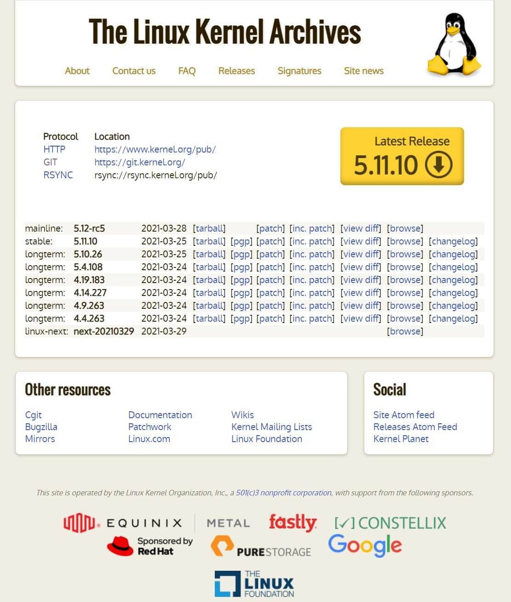

# 《JERRY Linux-小抄》

> 原创内容，转载请注明出处！

> 说明：以下内容基于 VMware 16 Player & Ubuntu 20.04.2.0 LTS 环境

# 一、认识 Linux

## 1.1.1 Linux 的由来

1991年8月25日，Linus Torvalds（芬兰）发布了 Linux 的第一个公告，正式宣布 Linux 的诞生！

目前常用的 Linux 发行版：

- Red Hat Linux 红帽（采用 RPM 包管理方式）
- CentOS（红帽的再编译发行版，采用 RPM 包管理方式）
- Fedora（基于红帽，由 Fedora Project 社区开发维护，采用 RPM 包管理方式）
- Debian 大便（采用 APT 包管理方式）
- Ubuntu 乌班图（基于 Debian 的衍生发行版，采用 APT 包管理方式）
- Linux Mint（基于 Debian 的衍生发行版，采用 APT 包管理方式）
- Elementary OS（基于 Debian 的衍生发行版，采用 APT 包管理方式）
- Kail（基于 Debian 的衍生发行版，采用 APT 包管理方式）
- ……

目前常见的基于 Linux 基础的系统：

- Android 安卓（手机操作系统）
- HarmonyOS 鸿蒙（鸿蒙物联网操作系统）
- Windows10 Linux 子系统（目前 Win10 支持几款主流的 Linux 发行版以子系统的形式运行在 Win10 内部）
- ……

## 1.1.2 Linux 的内核

Linux 一词，准确的来说指的是：Linux 内核。

而我们平时使用的 Linux 系统指的是在 Linux 内核基础上加工拓展的 Linux 发行版。

Linux 内核项目地址：[http://www.kernel.org](http://www.kernel.org)

Linux 内核说明：



**【第一列】：源代码标记**

- mainline

  为 Linus Torvalds 亲自制作的内核发布版，是官方当前最新版本的 Kernel source。在 Torvalds 对所有其他程序员所做出的重大变化进行整合，并且对先前版本的 Bug 进行几轮修复后，大约每十周正式发布一个新版本。

  mainline 事实上代表着一个 Linux kernel 分支，这个分支还有一个名词，叫：vanilla “香草香精”。（vanilla 表示：这是一个标准的，没有经过补丁的和升级的源码。之所以叫 vanilla 香草香精，这是因为她具有可添加和可自定义拓展的身份。）

- stable

  稳定版。

- longterm

  长期维护版。

- linux-next、snapshot

  都是代码提交周期结束之前生成的快照用于给 Linux 代码贡献者们做测试。
  

标准内核与 Linux 发行版内核的区分：

大多数 Linux 用户运行的是由某个 Linux 发行版提供的内核。一些发行版采用 "vanilla" 和 "stable" 内核。然而。某些著名的 Linux 发行商（如： Red Hat 和 Debian）坚持使用另一组内核分支。与 "vanilla" 分支相比，总的来说这些内核的更新速度较慢，同时稳定性与安全性更高，并且通常还包含了来自相关 "stable" 分支的所有修复，及许多其他功能。


**【第二列】：版本号**

- -rc 表示非正式发布版本
- [EOL] 表示本分支最后一个版本

Linux 内核版本号由 3 个数字和破折号之后的一系列数字标识组成：r.x.y-z

- r：目前发布的内核主版本
- x：偶数表示稳定版本，奇数表示开发中版本
- y：修订版本号（错误修补的次数）
- z：当前内核版本的第 z 次微调

在 Ubuntu 命令行中执行：`$ cat /proc/version` 可以得到 Ubuntu 的内核版本

`Linux version 5.8.0-48-generic (buildd@lgw01-amd64-008) (gcc (Ubuntu 9.3.0-17ubuntu1~20.04) 9.3.0, GNU ld (GNU Binutils for Ubuntu) 2.34) #54~20.04.1-Ubuntu SMP Sat Mar 20 13:40:25 UTC 2021`

其中除了 r.x.y-z 之外

- patch、generic：当前内核版本为通用版本
- server：针对服务器
- i386：针对老式英特尔处理器
- pae：物理地址扩展，为了弥补 32 位地址在 PC 服务器应用上的不足而退出，表示此 32 位系统可以支持超过 4G 的内存
- x86_64：对称多处理机，表示内核支持多核、多处理器
- 内核编译时的编译器版本、编译时所用的系统版本、编译的时间……


**【第三列】：版本发布日期**


**【第四列】：tar.xz 格式压缩的 kernel 源代码下载链接**

tarball 是 Linux 系统下最方便的打包工具，是以 tar 这个指令来打包与压缩的档案。


**【第五列】：pgp 数字签名下载链接**

PGP（优良保密协议）：是一套用于消息加密、验证的应用程序，采用 IDEA 的散列算法作为加密与验证之用。


**【第六列】：patch 补丁下载链接**

用于从本分支的基础版本，升级到本分支当前最新版本。


**【第七列】：inc.patch 补丁下载链接**

用于从上一版本升级到当前最新版本。


**【第八列】：查看相邻两个版本的不同内容统计**

使用 Diffstat 对比两个版本的源码不同并生成统计文件用于后期打补丁时使用。


**【第九列】：浏览当前版本内核源码的树型结构**


**【第十列】：浏览当前版本内核源码的修改记录**


## 1.1.3 Linux 的特点

Linux 包含了 UNIX 系统的全部功能和特性，它之所以能被全世界这么多用户接受，与其自身的特点是分不开的：

- 模块化程度高
- 源码公开
- 设备独立性
- 广泛的硬件支持
- 极强的安全性及可靠性
- 可移植性强
- 良好的网络与文件系统支持

## 1.1.4 Linux 的用途

Linux 的主要用途在于：

- 高性能计算（超算和企业的高性能计算平台）
- 服务器（占据了绝大部分的市场份额）
- 科研和科学计算
- 特殊的音视频处理

## 1.2.1 Ubuntu 简介

**Ubuntu 发行版**

Ubuntu 社区在每年的 4 月份发布一个 Ubuntu 的长期支持版（Long Term Support, LTS），并且 Ubuntu 的发行版分为两个版本，分别是：桌面版本和服务器版本。

桌面版本的特点：

- 桌面整洁
- 应用程序丰富
- 可编辑和共享其他格式的文件
- 系统升级快速简单
- 强大的自由软件仓库
- 触手可及的帮助与支持

服务器版本的特点：

- 拥有集成安全的平台
- 总体成本较低
- 消除更新个人工作站的成本

**Ubuntu 的启动过程**

Ubuntu 的启动采用全新的 init 系统：UpStart。UpStart 基于事件机制，在感知到事件之后触发相应的等待任务，该机制加快了系统启动时间。采用该种事件之后触发相应的等待任务，该机制加快了系统启动时间。采用该种事件的驱动模式，UpStart 完美地解决了即插即用设备所带来的问题。Ubuntu 的所有初始化都是串行执行的。

然而，随着上游 Debian 开始采用 Systemd（Systemd 是 Linux 系统中最新的初始化系统，它主要的设计目的是克服 sysvinit 固有的缺点，提高系统的启动速度），下游的 Ubuntu 也开始采用 Systemd 作为标准的系统初始化系统。Systemd 的很多概念来源于苹果 Mac OS 操作系统上的 launchd，Systemd 提供了和 Sysvint 以及 LSB initscripts 兼容的特性。Systemd 提供了比 UpStart 更激进的并行启动能力，采用了 socket / D-Bus activation 等技术启动服务。一个显而易见的结果就是：更快的启动速度。

我们常用的 systemctl 命令是用于控制 systemd 和 service。

## 1.3.1 Linux 系统结构

UNIX / Linux 系统可以粗糙地抽象为 3 个层次。

- 底层是系统内核（Kernel）
  - 中间层是 Shell 层，即：命令解释器
    - 高层则是应用层

（1）内核层

内核层是 UNIX / Linux 系统的核心和基础，它直接附着在硬件平台之上，控制和管理系统内各种资源（硬件资源和软件资源），有效地组织进程的运行，从而扩展硬件的功能，提高资源的利用效率，为用户提供方便、高效、安全、可靠的应用环境。

（2）Shell 层

Shell 层是与用户直接交互的界面，用户可以在提示符下输入命令行，由 Shell 解释执行并输出相应结果或者有关信息，所以我们也把 Shell 称作：命令解释器

（3）应用层

应用层提供基于 X Window 协议的图形环境。X Window 协议定义了一个系统所必须具备的功能。

## 1.4.1 Linux 文件结构

- `/`：根
  - `/bin`：二进制可执行命令
  - `/dev`：设备特殊文件
  - `/etc`：系统管理和配置文件
    - `/etc/rc.d`：启动的配置文件和脚本
  - `/home`：用户主目录的基点，比如用户
    - `/home/user`：user 的主目录就是 /home/user
  - `/lib`：标准程序设计库，又叫：动态链接共享库，作用类似 windows 里的 .dell 文件
  - `/sbin`：系统管理命令，这里存放的是系统管理员使用的管理程序
  - `/tmp`：公用的临时文件存储点
  - `/root`：系统管理员的主目录
  - `/mnt`：系统提供这个目录是让用户临时挂载其他的文件系统
  - `/lost+found`：这个目录平时是空的，系统非正常关机而留下 “无家可归” 的文件的存放位置
  - `/proc`：虚拟的目录，是系统内存的映射。可直接访问这个目录来获取系统信息
  - `/var`：某些大文件的溢出区，比方说各种服务的日志文件
  - `/usr`：最庞大的目录，要用到的应用程序和文件几乎都在这个目录
    - `/usr/x11r6`：存放 x window 的目录
    - `/usr/bin`：众多的应用程序
    - `/usr/sbin`：超级用户的一些管理程序
    - `/usr/doc`：Linux 文档
    - `/usr/include`：Linux 开发和编译应用程序所需要的头文件
    - `/usr/lib`：常用的动态链接库和软件包的配置文件
    - `/usr/man`：帮助文档
    - `/usr/src`：源代码，Linux 内核的源代码就存放在 /usr/src/linux 中
    - `/usr/local/bin`：本地增加的命令
    - `/usr/local/lib`：本地增加的库根文件系统

为什么很多发行版，比如 CentOS、Red Hat、SuSE等，他们的 `/`（根）目录下都有相同的目录结构？

文件系统目录标准（FHS），多数 Linux 版本采用这种文件组织形式，类似于 Windows 操作系统中 C 盘的文件目录，FHS 采用树形结构组织文件。FHS 定义了系统中每个区域的用途，所需要的最小构成的文件和目录，同时还给出了例外处理与矛盾处理。

# 二、Linux 图形界面

## 2.1.1 Linux 桌面介绍

Linux 的各个发行版都有丰富的图形化桌面环境，各有特色，各有优劣。

当然，上述的桌面环境其实是在内核之外的桌面服务模块的基础上开发的一套界面环境，下面来介绍下几大主流桌面服务模块：

- X Window System

X 窗口系统（也称为：X11 或 X）是一种以位图方式显示的软件窗口系统。最初是 1984 年麻省理工学院的研究，之后成为 UNIX、类UNIX、以及OpenVMS等操作系统所一致适用的标准化软件工具包及显示架构的运作协定。

- Wayland

是 2008 年由 Intel 开放源代码技术中心的成员所发起的一个桌面的显示服务协议和在 Linux 上实现这个协议的软件库。

- Mir

Canonical 2013年3月宣布开发自己的显示服务器 Mir。Canonical 则表示现在的 X 以及未来的 Wayland 无法满足未来横跨桌面、手机、平板和电视的发展策略。

Ubuntu 目前还在使用 X Window System！

## 2.2.1 登录

系统启动默认进入图形界面，当然用户可以通过修改系统的配置文件，可以使系统启动时直接进入纯字符界面。

- <kbd>Ctrl</kbd> + <kbd>Alt</kbd> + <kbd>T</kbd> 进入终端界面
- `$ cd /etc/default` 进入 default 目录
- `$ sudo gedit grub ` 管理员权限编辑 grub 配置文件
- 输入用户密码
- 将 GRUB_CMDLINE_LINUX_DEFAULT 的值由 `quiet splash` 修改为 `text`
- 重启系统后即可进入相对应的界面

注意：并不建议以这样的方式使用字符界面。

（1）个人桌面使用，图形界面有很大的便利性。

（2）服务器环境使用，不会安装桌面环境。

（3）显示服务器 Wayland 即将被 Ubuntu 启用，现有启动 X11 图像模块的方式即将废止。

## 2.3.1 常见图形化应用

- Firefox 浏览器
- LibreOffice Writer 文字处理
- LibreOffice Calc 电子表格
- LibreOffice Impress 演示文稿
- GIMP 基于 GPL 协议的图像处理软件
- VLC 音视频播放器

## 2.4.1 软件包及管理器

**（1）软件源管理程序**

**（2）软件包及管理器**

**（3）软件包安装删除**

**（4）Ubuntu 软件库**


```
-------------------------------------------------------------------------------
告知：该笔记已停止更新……
-------------------------------------------------------------------------------
```


