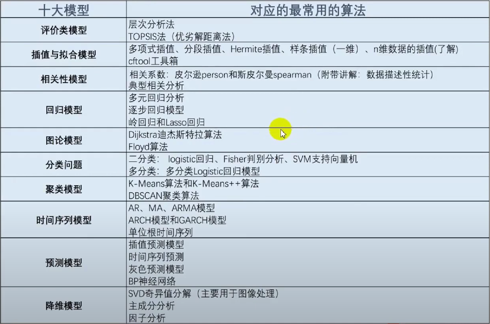

# MATLAB 数学建模

## 一、MatLab基本常识

Matlab 脚本：包含 Matlab 代码的文件（`.m` 文件）。

Matlab 既可以使用命令行交互的方式执行，也可以使用脚本的方式执行。 

---

1、`;`分号：Matlab 在一行的语句后面加上分号（英文输入法），那么就表示不显示该行的运行结果，否则会自动显示该行的运行结果。

> 在我们实际用脚本编写代码的过程中，我们一般是加分号的，因为代码执行过程中的大部分过程我们并不需要显示出来，只需要显示我们最终的结果即可。

```matlab
>> a = 24;
>> a = 24

a =

    24

>> 
```

2、`%`注释：快捷键（ctrl+R）

3、`clear`：清除工作区的所有变量命令

> 注意：clear 清除的是工作区所有的变量，而不是清空命令行窗口。

4、`clc`：清除命令行窗口中的所有文本，让屏幕变得干净。

5、`clear;clc;`：我们经常这么用，起到“初始化”的作用，防止之前的结果对新脚本文件（.m 文件）产生干扰。

> `;`分号还具有区分行的作用。

6、`disp()`函数：屏幕输出函数

```matlab
disp('我是Jerry，大家好！');
% Matlab 中字符串用单引号或者双引号

% 行向量
a = [1, 2, 3];
b = [1 2 3];
disp(a);
disp(b);
% 这里的输出其实可以不用 disp 函数，只要初始化行向量的时候不加分号即可

% 列向量
c = [1; 2; 3];	% 分号可以用来分隔每一行的元素
disp(c)
% disp() 函数的末尾加不加分号的结果都是一样的！
```

```
我是Jerry，大家好！
     1     2     3

     1     2     3

     1
     2
     3
```

7、字符串合并

- `strcat()`合并多个字符串

  ```matlab
  % strcat('字符串1', '字符串2')
  a = 24;
  % 一个有用的字符串函数：num2str() 将数字转换为字符串
  disp(strcat('a的取值为：', num2str(a)));
  % a的取值为：24
  ```

- `['字符串1', '字符串2', ...]`或`['字符串1' '字符串2' ...]`

  ```matlab
  % 利用 [] 把字符串看成一个向量，字符串之间可以用分号或空格间隔
  a = 24;
  disp(['a的取值为：', num2str(a)]);
  % a的取值为：24
  ```

8、`input()`函数：屏幕输入函数

```matlab
% 一般我们会将输入的数、向量、矩阵、字符串等赋给一个变量，这里我们赋给A
A = input('请输入A：');
B = input('请输入B：')
% 注意观察工作区，并体会 input 后面加分号和不加分号的区别
```

```
请输入A：24
请输入B：24

B =

    24

>> 
```

9、`sum()`函数：求和函数

```matlab
% 1、如果是向量（无论是行向量还是列向量），都是直接求和
% 行向量
E = [1, 2, 3]
sum(E)
% 列向量
E = [1; 2; 3]
sum(E)
```

```
E =

     1     2     3


ans =

     6


E =

     1
     2
     3


ans =

     6

>> 
```

```matlab
% 2、如果是矩阵，则需要根据行和列的方向作区分
E = [1, 2; 3, 4; 5, 6]
E = [1 2; 3 4; 5 6]
% 矩阵同行元素用逗号或空格隔开，不同行之间用分号隔开

% a = sum(x)：按列求和（得到一个行向量）
a = sum(E)
a = sum(E, 1)
a = sum(E, 2)
% a = sum(E, 1)：按列求和（得到一个行向量）
% a = sum(E, 2)：按行求和（得到一个列向量）
% 这里的第二个参数在 matlab 中叫：dim（纬度），这里默认 dim = 1

% a = sum(sum(E)) 或 a = sum(E(:))：对整个矩阵求和
a = sum(sum(E))	% 先按照列求和，在进行一次求和
a = sum(E(:))
E(:) % 把矩阵按列方向拼接成一列
```

```
E =

     1     2
     3     4
     5     6


E =

     1     2
     3     4
     5     6


a =

     9    12


a =

     9    12


a =

     3
     7
    11


a =

    21


a =

    21


ans =

     1
     3
     5
     2
     4
     6

>> 
```

10、提取矩阵中指定位置的元素

- 取指定行和列的一个元素（输出的是一个值）

```matlab
A = [1 1 4 1/3 3; 1 1 4 1/3 3; 1/4 1/4 1 1/3 1/2; 3 3 3 1 3; 1/3 1/3 2 1/3 1];
A
A(2, 1)
A(3, 2)
```

```
A =

    1.0000    1.0000    4.0000    0.3333    3.0000
    1.0000    1.0000    4.0000    0.3333    3.0000
    0.2500    0.2500    1.0000    0.3333    0.5000
    3.0000    3.0000    3.0000    1.0000    3.0000
    0.3333    0.3333    2.0000    0.3333    1.0000


ans =

     1


ans =

    0.2500

>> 
```

- 取指定的某一行的全部元素（输出的是一个行向量）

```matlab
clc;A
A(2, :)
A(5, :)
% 冒号':'表示取所有元素
```

```
A =

    1.0000    1.0000    4.0000    0.3333    3.0000
    1.0000    1.0000    4.0000    0.3333    3.0000
    0.2500    0.2500    1.0000    0.3333    0.5000
    3.0000    3.0000    3.0000    1.0000    3.0000
    0.3333    0.3333    2.0000    0.3333    1.0000


ans =

    1.0000    1.0000    4.0000    0.3333    3.0000


ans =

    0.3333    0.3333    2.0000    0.3333    1.0000

>> 
```

- 取指定的某一列的全部元素（输出的是一个列向量）

```matlab
clc;A
A(:, 1)
A(:, 3)
% 冒号':'表示取所有元素
```

```
A =

    1.0000    1.0000    4.0000    0.3333    3.0000
    1.0000    1.0000    4.0000    0.3333    3.0000
    0.2500    0.2500    1.0000    0.3333    0.5000
    3.0000    3.0000    3.0000    1.0000    3.0000
    0.3333    0.3333    2.0000    0.3333    1.0000


ans =

    1.0000
    1.0000
    0.2500
    3.0000
    0.3333


ans =

     4
     4
     1
     3
     2

>> 
```

- 取指定的某些行的全部元素（输出的是一个矩阵）

```matlab
clc;A
A([2, 5], :)	% 只取第二行和第五行（一共2行）
A(2:5, :)		% 取第二行到第五行（一共4行）
A(2:2:5, :)		% 取第二行和第四行（从 2 开始，每次递增 2 个单位，到 5 结束）
1:3:10			% 等差数列，从 1 到 10，公差为 3	
10:-1:1			% 等差数列，从 10 到 1，公差为 -1
A(2:end, :)		% 取第二行到最后一行 
A(2:end-1, :)	 % 取第二行到倒数第二行 
```

```
A =

    1.0000    1.0000    4.0000    0.3333    3.0000
    1.0000    1.0000    4.0000    0.3333    3.0000
    0.2500    0.2500    1.0000    0.3333    0.5000
    3.0000    3.0000    3.0000    1.0000    3.0000
    0.3333    0.3333    2.0000    0.3333    1.0000


ans =

    1.0000    1.0000    4.0000    0.3333    3.0000
    0.3333    0.3333    2.0000    0.3333    1.0000


ans =

    1.0000    1.0000    4.0000    0.3333    3.0000
    0.2500    0.2500    1.0000    0.3333    0.5000
    3.0000    3.0000    3.0000    1.0000    3.0000
    0.3333    0.3333    2.0000    0.3333    1.0000


ans =

    1.0000    1.0000    4.0000    0.3333    3.0000
    3.0000    3.0000    3.0000    1.0000    3.0000


ans =

     1     4     7    10


ans =

    10     9     8     7     6     5     4     3     2     1


ans =

    1.0000    1.0000    4.0000    0.3333    3.0000
    0.2500    0.2500    1.0000    0.3333    0.5000
    3.0000    3.0000    3.0000    1.0000    3.0000
    0.3333    0.3333    2.0000    0.3333    1.0000


ans =

    1.0000    1.0000    4.0000    0.3333    3.0000
    0.2500    0.2500    1.0000    0.3333    0.5000
    3.0000    3.0000    3.0000    1.0000    3.0000

>> 
```

- 取全部元素（按列拼接，最终输出的是一个列向量）

```matlab
clc;A
A(:)
% 在 MATLAB 中，矩阵是按照列进行存储的
% 这也说明为什么 sum() 函数默认按列进行累加
```

```
A =

    1.0000    1.0000    4.0000    0.3333    3.0000
    1.0000    1.0000    4.0000    0.3333    3.0000
    0.2500    0.2500    1.0000    0.3333    0.5000
    3.0000    3.0000    3.0000    1.0000    3.0000
    0.3333    0.3333    2.0000    0.3333    1.0000


ans =

    1.0000
    1.0000
    0.2500
    3.0000
    0.3333
    1.0000
    1.0000
    0.2500
    3.0000
    0.3333
    4.0000
    4.0000
    1.0000
    3.0000
    2.0000
    0.3333
    0.3333
    0.3333
    1.0000
    0.3333
    3.0000
    3.0000
    0.5000
    3.0000
    1.0000

>> 
```

11、`size()`函数

```matlab
clear;clc;
A = [1, 2, 3; 4, 5, 6]
B = [1, 2, 3, 4, 5, 6]
% size() 函数是用来求矩阵的大小的
% 它返回一个行向量，第一个元素是矩阵的行数，第二个元素是矩阵的列数
size(A)
size(B)

% 返回给一个向量
[r, c] = size(A)
disp('---------')
disp([r, c])
disp('---------')
% 将矩阵 A 的行数返回到第一个变量 r，列数返回到第二个变量 c
r = size(A, 1)	% 返回行数
c = size(A, 2)	% 返回列数
```

```
A =

     1     2     3
     4     5     6


B =

     1     2     3     4     5     6


ans =

     2     3


ans =

     1     6


r =

     2


c =

     3

---------
     2     3

---------

r =

     2


c =

     3

>> 
```

12、`repmat()`函数

```matlab
clear;clc;
% B = repmat(A, m, n) 将矩阵 A 复制 m×n 块，即把 A 作为 B 的元素，B 由 m×n 个 A 平铺而成
A = [1, 2, 3; 4, 5, 6]
B = repmat(A, 2, 1)
B = repmat(A, 3, 2)
```

```
A =

     1     2     3
     4     5     6


B =

     1     2     3
     4     5     6
     1     2     3
     4     5     6


B =

     1     2     3     1     2     3
     4     5     6     4     5     6
     1     2     3     1     2     3
     4     5     6     4     5     6
     1     2     3     1     2     3
     4     5     6     4     5     6

>> 
```

13、矩阵运算

```matlab
% MatLab 在矩阵运算中，* 和 / 代表矩阵之间的乘法与除法（A/B = A*inv(B)）
A = [1, 2; 3, 4]
B = [1, 0; 1, 1]
A * B
inv(B)	% 求 B 的逆矩阵
B * inv(B)	% 原矩阵与其逆矩阵相乘得到单位矩阵
A * inv(B)
A / B

% MatLab 在矩阵运算中，+ 和 - 代表矩阵之间的加法和减法
% 矩阵加减的前提是，两个矩阵的大小相同
A + B
A - B
```

```
A =

     1     2
     3     4


B =

     1     0
     1     1


ans =

     3     2
     7     4


ans =

     1     0
    -1     1


ans =

     1     0
     0     1


ans =

    -1     2
    -1     4


ans =

    -1     2
    -1     4


ans =

     2     2
     4     5


ans =

     0     2
     2     3

>> 
```

```matlab
% 两个形状相同的矩阵对应的元素之间的乘除法需要使用 .* 和 ./
% 注意：这里不是矩阵的乘除法，而是矩阵对应元素之间的乘除法
A = [1, 2; 3, 4]
B = [1, 0; 1, 1]
A .* B
A ./ B
```

```
A =

     1     2
     3     4


B =

     1     0
     1     1


ans =

     1     0
     3     4


ans =

     1   Inf
     3     4

>> 
```

```matlab
% 每个元素同时和常数相乘或相除操作，可以使用 * / 也可以使用 .* ./
A = [1, 2; 3, 4]
A * 2
A .* 2
A / 2
A ./ 2
```

```
A =

     1     2
     3     4


ans =

     2     4
     6     8


ans =

     2     4
     6     8


ans =

    0.5000    1.0000
    1.5000    2.0000


ans =

    0.5000    1.0000
    1.5000    2.0000

>> 
```

```matlab
% 每个元素同时乘方时只能用 .^
A = [1, 2; 3, 4]
A .^ 2
% A ^ 2 表示的实际上是 A * A
A ^ 2
A * A
```

```
A =

     1     2
     3     4


ans =

     1     4
     9    16


ans =

     7    10
    15    22


ans =

     7    10
    15    22

>> 
```

14、求特征值和特征向量

- `eig()`函数

  ```matlab
  % 在 MatLab 中，计算矩阵 A 的特征值和特征向量的函数是 eig(A)，其中最常用的两个用法：
  A = [1 2 3; 2 2 1; 2 0 3]
  % (1) E = eig(A) 求矩阵 A 的全部特征值，构成向量 E
  E = eig(A)
  % (2) [V, D] = eig(A) 求矩阵 A 的全部特征值，构成对角阵 D，并求 A 的特征向量构成 V 的列向量。
  % V 的每一列都是 D 中与之相同列的特征值的特征向量
  [V, D] = eig(A)
  ```

  ```
  A =
  
       1     2     3
       2     2     1
       2     0     3
  
  
  E =
  
     -1.3166
      5.3166
      2.0000
  
  
  V =
  
      0.8364   -0.6336   -0.2408
     -0.3875   -0.5470   -0.8427
     -0.3875   -0.5470    0.4815
  
  
  D =
  
     -1.3166         0         0
           0    5.3166         0
           0         0    2.0000
  
  >> 
  ```

15、`find()`函数

```matlab
% find() 函数，它可以用来返回向量或者矩阵中不为 0 的元素的位置索引
clear;clc;
X = [1 0 4 -3 0 0 0 8 6]
ind = find(X)

% 其有多种用法，比如：返回前 2 个不为 0 的元素的位置：
ind = find(X, 2)

% 上面针对的是向量（一维），若 X 是一个矩阵（二维，有行和列），索引该如何返回呢？
clear;X = [1 -3 0; 0 0 8; 4 0 6]
ind = find(X)
% 这是因为在 MatLab 在存储矩阵时，是一列一列存储的，我们可以做一下验证：
X(4)

% 假如需要按照行列的信息输出该怎么办呢？
[r, c] = find(X)
D = [r, c];
a= size(D, 1);
disp('--------------------');
for i = (1:a)
    disp(['(', num2str(D(i, 1)), ', ', num2str(D(i, 2)), ')'])
end
disp('--------------------');
[r, c] = find(X, 1)	% 只找第一个非 0 元素
```

```
X =

     1     0     4    -3     0     0     0     8     6


ind =

     1     3     4     8     9


ind =

     1     3


X =

     1    -3     0
     0     0     8
     4     0     6


ind =

     1
     3
     4
     8
     9


ans =

    -3


r =

     1
     3
     1
     2
     3


c =

     1
     1
     2
     3
     3

--------------------
(1, 1)
(3, 1)
(1, 2)
(2, 3)
(3, 3)
--------------------

r =

     1


c =

     1

>> 
```

16、矩阵与常数的大小判断运算

```matlab
% 三种运算符：大于 >，小于 <，等于 ==
clc;
X = [1 -3 0; 0 0 8; 4 0 6]
X > 0
X == 4
```

```
X =

     1    -3     0
     0     0     8
     4     0     6


ans =

  3×3 logical 数组

   1   0   0
   0   0   1
   1   0   1


ans =

  3×3 logical 数组

   0   0   0
   0   0   0
   1   0   0

>> 
```

17、判断语句

```matlab
% MatLab 的判断语句，if 所在的行不需要冒号，语句的最后一定要以 end 结尾；中间的语句要注意缩进
a = input('请输入考试分数')
if a >= 85
	disp('优秀')
elseif a >= 60
	disp('合格')
else
	disp('挂科')
end
```

## 二、常见模型




## 三、MatLab语法总结

