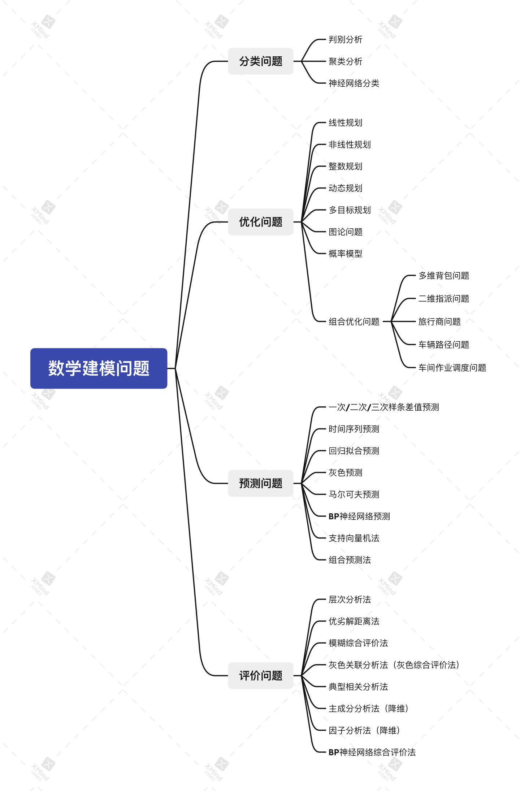
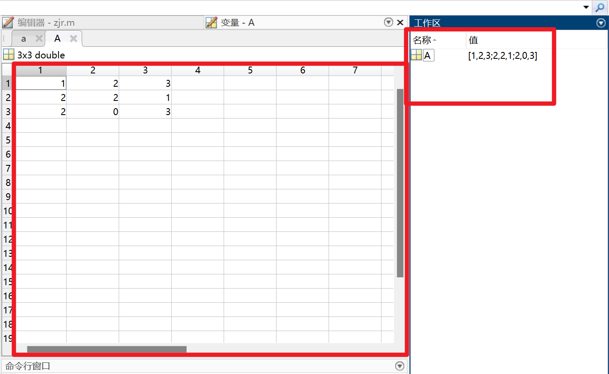
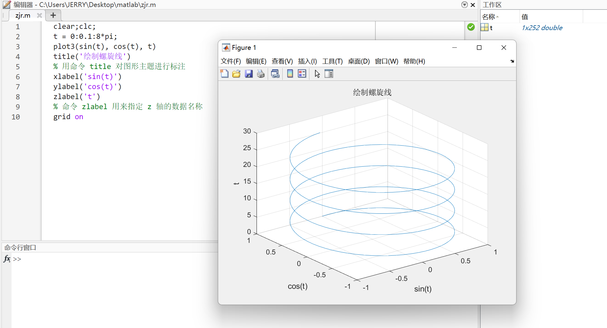
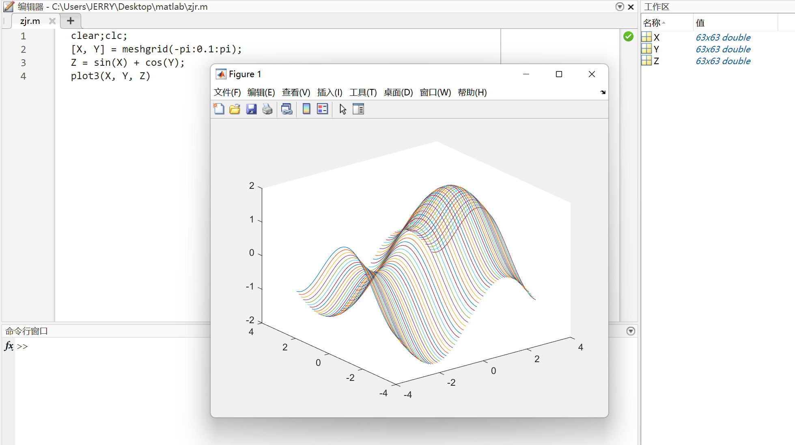
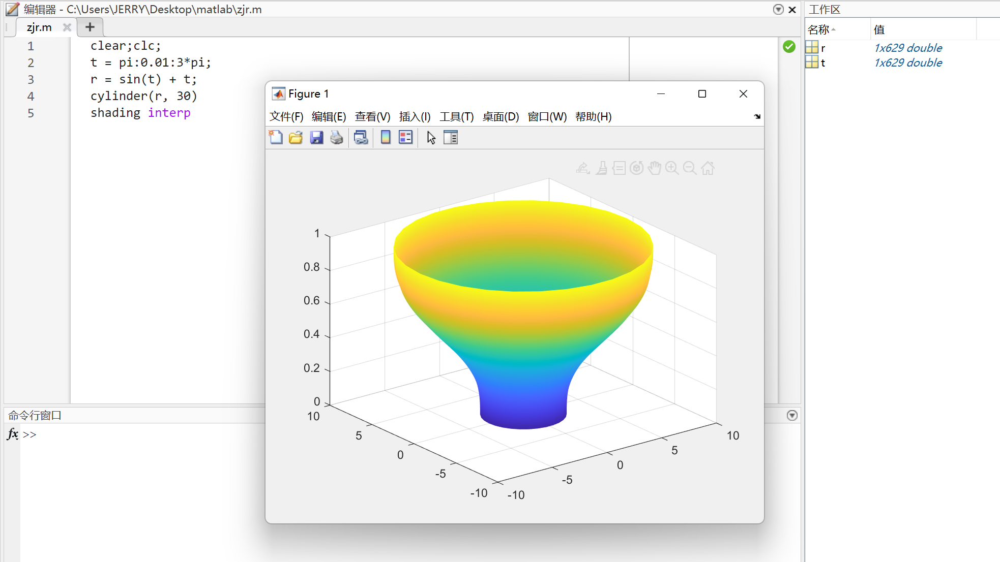

# MATLAB 数学建模

## 一、MatLab基本常识

Matlab 脚本：包含 Matlab 代码的文件（`.m` 文件）。

Matlab 既可以使用命令行交互的方式执行，也可以使用脚本的方式执行。 

---

1、`;`分号：Matlab 在一行的语句后面加上分号（英文输入法），那么就表示不显示该行的运行结果，否则会自动显示该行的运行结果。

> 在我们实际用脚本编写代码的过程中，我们一般是加分号的，因为代码执行过程中的大部分过程我们并不需要显示出来，只需要显示我们最终的结果即可。

```matlab
>> a = 24;
>> a = 24

a =

    24

>> 
```

2、`%`注释：快捷键（ctrl+R）

3、`clear`：清除工作区的所有变量命令

> 注意：clear 清除的是工作区所有的变量，而不是清空命令行窗口。

4、`clc`：清除命令行窗口中的所有文本，让屏幕变得干净。

5、`clear;clc;`：我们经常这么用，起到“初始化”的作用，防止之前的结果对新脚本文件（.m 文件）产生干扰。

> `;`分号还具有区分行的作用。

6、`disp()`函数：屏幕输出函数

```matlab
disp('我是Jerry，大家好！');
% Matlab 中字符串用单引号或者双引号

% 行向量
a = [1, 2, 3];
b = [1 2 3];
disp(a);
disp(b);
% 这里的输出其实可以不用 disp 函数，只要初始化行向量的时候不加分号即可

% 列向量
c = [1; 2; 3];	% 分号可以用来分隔每一行的元素
disp(c)
% disp() 函数的末尾加不加分号的结果都是一样的！
```

```
我是Jerry，大家好！
     1     2     3

     1     2     3

     1
     2
     3
```

7、字符串合并

- `strcat()`合并多个字符串

  ```matlab
  % strcat('字符串1', '字符串2')
  a = 24;
  % 一个有用的字符串函数：num2str() 将数字转换为字符串
  disp(strcat('a的取值为：', num2str(a)));
  % a的取值为：24
  ```

- `['字符串1', '字符串2', ...]`或`['字符串1' '字符串2' ...]`

  ```matlab
  % 利用 [] 把字符串看成一个向量，字符串之间可以用分号或空格间隔
  a = 24;
  disp(['a的取值为：', num2str(a)]);
  % a的取值为：24
  ```

8、`input()`函数：屏幕输入函数

```matlab
% 一般我们会将输入的数、向量、矩阵、字符串等赋给一个变量，这里我们赋给A
A = input('请输入A：');
B = input('请输入B：')
% 注意观察工作区，并体会 input 后面加分号和不加分号的区别
```

```
请输入A：24
请输入B：24

B =

    24

>> 
```

9、`sum()`函数：求和函数

```matlab
% 1、如果是向量（无论是行向量还是列向量），都是直接求和
% 行向量
E = [1, 2, 3]
sum(E)
% 列向量
E = [1; 2; 3]
sum(E)
```

```
E =

     1     2     3


ans =

     6


E =

     1
     2
     3


ans =

     6

>> 
```

```matlab
% 2、如果是矩阵，则需要根据行和列的方向作区分
E = [1, 2; 3, 4; 5, 6]
E = [1 2; 3 4; 5 6]
% 矩阵同行元素用逗号或空格隔开，不同行之间用分号隔开

% a = sum(x)：按列求和（得到一个行向量）
a = sum(E)
a = sum(E, 1)
a = sum(E, 2)
% a = sum(E, 1)：按列求和（得到一个行向量）
% a = sum(E, 2)：按行求和（得到一个列向量）
% 这里的第二个参数在 matlab 中叫：dim（纬度），这里默认 dim = 1

% a = sum(sum(E)) 或 a = sum(E(:))：对整个矩阵求和
a = sum(sum(E))	% 先按照列求和，在进行一次求和
a = sum(E(:))
E(:) % 把矩阵按列方向拼接成一列
```

```
E =

     1     2
     3     4
     5     6


E =

     1     2
     3     4
     5     6


a =

     9    12


a =

     9    12


a =

     3
     7
    11


a =

    21


a =

    21


ans =

     1
     3
     5
     2
     4
     6

>> 
```

10、提取矩阵中指定位置的元素

- 取指定行和列的一个元素（输出的是一个值）

```matlab
A = [1 1 4 1/3 3; 1 1 4 1/3 3; 1/4 1/4 1 1/3 1/2; 3 3 3 1 3; 1/3 1/3 2 1/3 1];
A
A(2, 1)
A(3, 2)
```

```
A =

    1.0000    1.0000    4.0000    0.3333    3.0000
    1.0000    1.0000    4.0000    0.3333    3.0000
    0.2500    0.2500    1.0000    0.3333    0.5000
    3.0000    3.0000    3.0000    1.0000    3.0000
    0.3333    0.3333    2.0000    0.3333    1.0000


ans =

     1


ans =

    0.2500

>> 
```

- 取指定的某一行的全部元素（输出的是一个行向量）

```matlab
clc;A
A(2, :)
A(5, :)
% 冒号':'表示取所有元素
```

```
A =

    1.0000    1.0000    4.0000    0.3333    3.0000
    1.0000    1.0000    4.0000    0.3333    3.0000
    0.2500    0.2500    1.0000    0.3333    0.5000
    3.0000    3.0000    3.0000    1.0000    3.0000
    0.3333    0.3333    2.0000    0.3333    1.0000


ans =

    1.0000    1.0000    4.0000    0.3333    3.0000


ans =

    0.3333    0.3333    2.0000    0.3333    1.0000

>> 
```

- 取指定的某一列的全部元素（输出的是一个列向量）

```matlab
clc;A
A(:, 1)
A(:, 3)
% 冒号':'表示取所有元素
```

```
A =

    1.0000    1.0000    4.0000    0.3333    3.0000
    1.0000    1.0000    4.0000    0.3333    3.0000
    0.2500    0.2500    1.0000    0.3333    0.5000
    3.0000    3.0000    3.0000    1.0000    3.0000
    0.3333    0.3333    2.0000    0.3333    1.0000


ans =

    1.0000
    1.0000
    0.2500
    3.0000
    0.3333


ans =

     4
     4
     1
     3
     2

>> 
```

- 取指定的某些行的全部元素（输出的是一个矩阵）

```matlab
clc;A
A([2, 5], :)	% 只取第二行和第五行（一共2行）
A(2:5, :)		% 取第二行到第五行（一共4行）
A(2:2:5, :)		% 取第二行和第四行（从 2 开始，每次递增 2 个单位，到 5 结束）
1:3:10			% 等差数列，从 1 到 10，公差为 3	
10:-1:1			% 等差数列，从 10 到 1，公差为 -1
A(2:end, :)		% 取第二行到最后一行 
A(2:end-1, :)	 % 取第二行到倒数第二行 
```

```
A =

    1.0000    1.0000    4.0000    0.3333    3.0000
    1.0000    1.0000    4.0000    0.3333    3.0000
    0.2500    0.2500    1.0000    0.3333    0.5000
    3.0000    3.0000    3.0000    1.0000    3.0000
    0.3333    0.3333    2.0000    0.3333    1.0000


ans =

    1.0000    1.0000    4.0000    0.3333    3.0000
    0.3333    0.3333    2.0000    0.3333    1.0000


ans =

    1.0000    1.0000    4.0000    0.3333    3.0000
    0.2500    0.2500    1.0000    0.3333    0.5000
    3.0000    3.0000    3.0000    1.0000    3.0000
    0.3333    0.3333    2.0000    0.3333    1.0000


ans =

    1.0000    1.0000    4.0000    0.3333    3.0000
    3.0000    3.0000    3.0000    1.0000    3.0000


ans =

     1     4     7    10


ans =

    10     9     8     7     6     5     4     3     2     1


ans =

    1.0000    1.0000    4.0000    0.3333    3.0000
    0.2500    0.2500    1.0000    0.3333    0.5000
    3.0000    3.0000    3.0000    1.0000    3.0000
    0.3333    0.3333    2.0000    0.3333    1.0000


ans =

    1.0000    1.0000    4.0000    0.3333    3.0000
    0.2500    0.2500    1.0000    0.3333    0.5000
    3.0000    3.0000    3.0000    1.0000    3.0000

>> 
```

- 取全部元素（按列拼接，最终输出的是一个列向量）

```matlab
clc;A
A(:)
% 在 MATLAB 中，矩阵是按照列进行存储的
% 这也说明为什么 sum() 函数默认按列进行累加
```

```
A =

    1.0000    1.0000    4.0000    0.3333    3.0000
    1.0000    1.0000    4.0000    0.3333    3.0000
    0.2500    0.2500    1.0000    0.3333    0.5000
    3.0000    3.0000    3.0000    1.0000    3.0000
    0.3333    0.3333    2.0000    0.3333    1.0000


ans =

    1.0000
    1.0000
    0.2500
    3.0000
    0.3333
    1.0000
    1.0000
    0.2500
    3.0000
    0.3333
    4.0000
    4.0000
    1.0000
    3.0000
    2.0000
    0.3333
    0.3333
    0.3333
    1.0000
    0.3333
    3.0000
    3.0000
    0.5000
    3.0000
    1.0000

>> 
```

11、`size()`函数

```matlab
clear;clc;
A = [1, 2, 3; 4, 5, 6]
B = [1, 2, 3, 4, 5, 6]
% size() 函数是用来求矩阵的大小的
% 它返回一个行向量，第一个元素是矩阵的行数，第二个元素是矩阵的列数
size(A)
size(B)

% 返回给一个向量
[r, c] = size(A)
disp('---------')
disp([r, c])
disp('---------')
% 将矩阵 A 的行数返回到第一个变量 r，列数返回到第二个变量 c
r = size(A, 1)	% 返回行数
c = size(A, 2)	% 返回列数
```

```
A =

     1     2     3
     4     5     6


B =

     1     2     3     4     5     6


ans =

     2     3


ans =

     1     6


r =

     2


c =

     3

---------
     2     3

---------

r =

     2


c =

     3

>> 
```

12、`repmat()`函数

```matlab
clear;clc;
% B = repmat(A, m, n) 将矩阵 A 复制 m×n 块，即把 A 作为 B 的元素，B 由 m×n 个 A 平铺而成
A = [1, 2, 3; 4, 5, 6]
B = repmat(A, 2, 1)
B = repmat(A, 3, 2)
```

```
A =

     1     2     3
     4     5     6


B =

     1     2     3
     4     5     6
     1     2     3
     4     5     6


B =

     1     2     3     1     2     3
     4     5     6     4     5     6
     1     2     3     1     2     3
     4     5     6     4     5     6
     1     2     3     1     2     3
     4     5     6     4     5     6

>> 
```

13、矩阵运算

```matlab
% MatLab 在矩阵运算中，* 和 / 代表矩阵之间的乘法与除法（A/B = A*inv(B)）
A = [1, 2; 3, 4]
B = [1, 0; 1, 1]
A * B
inv(B)	% 求 B 的逆矩阵
B * inv(B)	% 原矩阵与其逆矩阵相乘得到单位矩阵
A * inv(B)
A / B

% MatLab 在矩阵运算中，+ 和 - 代表矩阵之间的加法和减法
% 矩阵加减的前提是，两个矩阵的大小相同
A + B
A - B
```

```
A =

     1     2
     3     4


B =

     1     0
     1     1


ans =

     3     2
     7     4


ans =

     1     0
    -1     1


ans =

     1     0
     0     1


ans =

    -1     2
    -1     4


ans =

    -1     2
    -1     4


ans =

     2     2
     4     5


ans =

     0     2
     2     3

>> 
```

```matlab
% 两个形状相同的矩阵对应的元素之间的乘除法需要使用 .* 和 ./
% 注意：这里不是矩阵的乘除法，而是矩阵对应元素之间的乘除法
A = [1, 2; 3, 4]
B = [1, 0; 1, 1]
A .* B
A ./ B
```

```
A =

     1     2
     3     4


B =

     1     0
     1     1


ans =

     1     0
     3     4


ans =

     1   Inf
     3     4

>> 
```

```matlab
% 每个元素同时和常数相乘或相除操作，可以使用 * / 也可以使用 .* ./
A = [1, 2; 3, 4]
A * 2
A .* 2
A / 2
A ./ 2
```

```
A =

     1     2
     3     4


ans =

     2     4
     6     8


ans =

     2     4
     6     8


ans =

    0.5000    1.0000
    1.5000    2.0000


ans =

    0.5000    1.0000
    1.5000    2.0000

>> 
```

```matlab
% 每个元素同时乘方时只能用 .^
A = [1, 2; 3, 4]
A .^ 2
% A ^ 2 表示的实际上是 A * A
A ^ 2
A * A
```

```
A =

     1     2
     3     4


ans =

     1     4
     9    16


ans =

     7    10
    15    22


ans =

     7    10
    15    22

>> 
```

14、求特征值和特征向量

- `eig()`函数

  ```matlab
  % 在 MatLab 中，计算矩阵 A 的特征值和特征向量的函数是 eig(A)，其中最常用的两个用法：
  A = [1 2 3; 2 2 1; 2 0 3]
  % (1) E = eig(A) 求矩阵 A 的全部特征值，构成向量 E
  E = eig(A)
  % (2) [V, D] = eig(A) 求矩阵 A 的全部特征值，构成对角阵 D，并求 A 的特征向量构成 V 的列向量。
  % V 的每一列都是 D 中与之相同列的特征值的特征向量
  [V, D] = eig(A)
  ```

  ```
  A =
  
       1     2     3
       2     2     1
       2     0     3
  
  
  E =
  
     -1.3166
      5.3166
      2.0000
  
  
  V =
  
      0.8364   -0.6336   -0.2408
     -0.3875   -0.5470   -0.8427
     -0.3875   -0.5470    0.4815
  
  
  D =
  
     -1.3166         0         0
           0    5.3166         0
           0         0    2.0000
  
  >> 
  ```

15、`find()`函数

```matlab
% find() 函数，它可以用来返回向量或者矩阵中不为 0 的元素的位置索引
clear;clc;
X = [1 0 4 -3 0 0 0 8 6]
ind = find(X)

% 其有多种用法，比如：返回前 2 个不为 0 的元素的位置：
ind = find(X, 2)

% 上面针对的是向量（一维），若 X 是一个矩阵（二维，有行和列），索引该如何返回呢？
clear;X = [1 -3 0; 0 0 8; 4 0 6]
ind = find(X)
% 这是因为在 MatLab 在存储矩阵时，是一列一列存储的，我们可以做一下验证：
X(4)

% 假如需要按照行列的信息输出该怎么办呢？
[r, c] = find(X)
D = [r, c];
a= size(D, 1);
disp('--------------------');
for i = (1:a)
    disp(['(', num2str(D(i, 1)), ', ', num2str(D(i, 2)), ')'])
end
disp('--------------------');
[r, c] = find(X, 1)	% 只找第一个非 0 元素
```

```
X =

     1     0     4    -3     0     0     0     8     6


ind =

     1     3     4     8     9


ind =

     1     3


X =

     1    -3     0
     0     0     8
     4     0     6


ind =

     1
     3
     4
     8
     9


ans =

    -3


r =

     1
     3
     1
     2
     3


c =

     1
     1
     2
     3
     3

--------------------
(1, 1)
(3, 1)
(1, 2)
(2, 3)
(3, 3)
--------------------

r =

     1


c =

     1

>> 
```

16、矩阵与常数的大小判断运算

```matlab
% 三种运算符：大于 >，小于 <，等于 ==
clc;
X = [1 -3 0; 0 0 8; 4 0 6]
X > 0
X == 4
```

```
X =

     1    -3     0
     0     0     8
     4     0     6


ans =

  3×3 logical 数组

   1   0   0
   0   0   1
   1   0   1


ans =

  3×3 logical 数组

   0   0   0
   0   0   0
   1   0   0

>> 
```

17、判断语句

```matlab
% MatLab 的判断语句，if 所在的行不需要冒号，语句的最后一定要以 end 结尾；中间的语句要注意缩进
a = input('请输入考试分数')
if a >= 85
	disp('优秀')
elseif a >= 60
	disp('合格')
else
	disp('挂科')
end
```

## 二、常见模型




## 三、MatLab语法总结

1、帮助

- `help` 在命令窗口（command windows）显示指定命令的简短使用说明
- `doc` 以网页形式显示指定命令的帮助页，此命令显示的标准更加具体，还有各种使用举例
- `lookfor` 按指定的关键词模糊查询与之相关的命令
- `which` 显示指定函数所在的目录

```
1. help eig 	# 用于查看 eig 函数的帮助文档，查询结果在 command 窗口显示
2. doc eig  	# 同样是查看 eig 函数帮助文档，结果在单独的查看显示，比 help 显示更加完整详细
3. lookfor eig	# 模糊查找， 比如说你知道某个可能的函数是 plo***， 但是你有记不清就可以用这个命令了
4. which eig 	# 查找函数具体在什么位置
```

2、如果语句很长，可用续行符 `…`（三个点）续行，续行符的前面最好留一个空格

```matlab
c = 123 + 456 + 789 + ...
    123456  % 三个点换行
```

3、变量的查询

```
% who 显示工作空间中的所有变量；whos 查看工作空间中变量的详细属性
>> a = 1;
>> b = 2;
>> c = pi

c =

    3.1416

>> d = 'zjr'

d =

    'zjr'

>> who

您的变量为:

a  b  c  d  

>> whos
  Name      Size            Bytes  Class     Attributes

  a         1x1                 8  double              
  b         1x1                 8  double              
  c         1x1                 8  double              
  d         1x3                 6  char                

>> 
```

4、系统预定义变量

- `pi`：圆周率 π
- `inf 或 Inf`：无穷大
- `nan, NaN`：Not-a-Number，一个不定值，如 0/0
- `eps`：浮点运算相对精度
- `i, j` ：虚部单位, 通常为了避免混淆我们写作`1i, 1j`
- 特殊变量 `ans` —— 应尽量避免给系统预定义变量重新赋值

5、输出格式

Matlab 以双精度执行所有的运算，运算结果可以在屏幕上输出，同时赋给指定变量；若无指定变量，则系统会自动将结果赋给变量 “ans”；Matlab 中数的输出格式可以通过 `format` 命令指定；`format` 只改变变量的输出格式，但不会影响变量的值！

6、变量的存储

```matlab
save 文件名 变量名列表

% 将变量 p 与 q 存储到文件 file.mat 里面
save 'var.mat' p q 

% 和上面结果一样 
save('var.mat', 'p', 'q')
```

7、变量的读取

```matlab
% 读取 var.mat 中的全部变量
load 'var.mat'

% 读取指定变量
load 'var.mat' p

% 和上面结果一样
load('var.mat')
load('var.mat', 'p')
```

8、对于矩阵数据，我们可以直接复制 Excel 中的表格数据到 MATLAB 的变量中，也可以把变量数据复制到 Excel 中进行进一步处理



9、变量的清除

```matlab
clear		% 清除全部变量
clear all 	% 清除全部变量
clear p		% 清除指定变量
```

10、MatLab 矩阵数值计算

（1）矩阵的定义：MatLab 的操作对象是矩阵

- 定义矩阵：直接输入法

  ```matlab
  A = [1  2  3; 4  5  6; 7  8  9]
  % 或者
  A = [1  2  3; 
       4  5  6; 
       7  8  9]
  % 也可以把空格换为逗号（建议还是空格）
  ```

- 矩阵用方括号 `[ ]`括起

  ```matlab
  mat = [元素]
  ```

- 矩阵同一行中的元素之间用`空格`或`逗号`分隔

  ```matlab
  mat1 = [1 2 3]; 
  % 两者意义一样
  mat2 = [1,2,3];
  ```

- 矩阵行与行之间用 分号 分开

  ```matlab
  mat3 = [ 1 2 3; 4, 5, 6];
  ```

- 直接输入法中，分号可以用 回车 代替

  ```matlab
  mat4 = [1 2 3
          4 5 6];
  ```

（2）矩阵赋值操作

- 矩阵 A 是一个 1*2 矩阵，第一个元素 1，第二个元素 2

  ```matlab
  A(1) = 1;
  A(2) = 2;
  ```

  ```
  A =
  
       1
  
  
  A =
  
       1     2
  
  >> 
  ```

- 大矩阵可以把小矩阵作为其元素

  ```matlab
  A = [A; 3 4];
  ```

  ```
  A =
  
       1     2
       3     4
  
  >> 
  ```

（3）矩阵元素提取引用操作

- `A(1)`引用 A 的第一个元素
- `A(i)`向量 A 中的第 i 个元素
- `A(i, j)`矩阵 A 中的第 i 行，第 j 列元素
- 冒号的特殊用法：`a:b:c` 产生一个由等差序列组成的向量，a 是首项，b 是公差，c 确定最后一项，若 b = 1，则 b 可以省略

```matlab
x = 1:2:5
x = 2:5
x = 10:-3:2
```

```
x =

     1     3     5


x =

     2     3     4     5


x =

    10     7     4

>> 
```

- `A(i:j, m:n)` 表示由矩阵 A 的第 i 到第 j 行和第 m 到第 n 列交叉线上的元素组成的子矩阵（可利用冒号提取矩阵的整行或整列）

```matlab
A = [1 2 3
     4 5 6
     7 8 9]
A(1, :)
A(:, 1:2)
A(:, :)
A(:)
```

```
A =

     1     2     3
     4     5     6
     7     8     9


ans =

     1     2     3


ans =

     1     2
     4     5
     7     8


ans =

     1     2     3
     4     5     6
     7     8     9


ans =

     1
     4
     7
     2
     5
     8
     3
     6
     9

>> 
```

（4）建立矩阵进阶

- 利用函数建立数值矩阵：MATLAB 提供了许多生成和操作矩阵的函数。例如：`reshape`函数和`diag`函数等，reshape 函数用于建立数值矩阵，diag 函数用于产生对角阵

  ```matlab
  >> x = 1:12
  x =
       1     2     3     4     5     6     7     8     9    10    11    12
  >> y = reshape(x,3,4)	% reshape 的用法，建立数值矩阵
  y =
       1     4     7    10
       2     5     8    11
       3     6     9    12
  
  >> z = 1:4
  z =
       1     2     3     4
  >> diag(z)	% diag 函数的用法，创建对角矩阵
  ans =
       1     0     0     0
       0     2     0     0
       0     0     3     0
       0     0     0     4
  ```

- 利用 M 文件建立矩阵：对于比较大且比较复杂的矩阵，可以为它专门建立一个 M 文件

- 矩阵的基本运算：

  - （１）矩阵转置
  - （２）矩阵加和减
  - （３）矩阵乘法
  - （４）矩阵除法`A\b`等同于`inv(A)*b`
  - （５）矩阵的乘方`a^2`

  ```matlab
  A = [1 2 3
       4 5 6
       7 8 9]
  A.' % 矩阵转置
  A'  % 矩阵共轭转置
  ```

  ```
  A =
  
       1     2     3
       4     5     6
       7     8     9
  
  
  ans =
  
       1     4     7
       2     5     8
       3     6     9
  
  
  ans =
  
       1     4     7
       2     5     8
       3     6     9
  
  >> 
  ```

（5）建立矩阵的函数

```matlab
eye(size(A))	% 产生与 A 矩阵同阶的单位矩阵
zeros(m, n)		% 产生 0 矩阵
ones(m, n)		% 产生幺矩阵
rand(m, n)		% 产生随机元素的矩阵
size(a)			% 返回包含两个元素（行数、列数）的向量
length(a)		% 返回向量的长度 
```

11、MatLab 图像可视化

（1）二维平面图形与坐标系

1. 线性坐标曲线`plot`函数命令，它可以生成线段、曲线和参数方程曲线的函数图形

   命令格式：`plot(X, Y)`；`plot(x1, y1, x2, y2, …)`

2. 用命令`plot(x, y)`绘制`y = cos(x)`在一个周期内的图形

   ```matlab
   x = 0:0.01:2*pi;
   y = cos(x);   
   plot(x, y)
   ```

   

3. 在同一图形窗口中用命令`plot(x, y)`绘出正弦余弦函数的图形

   ```matlab
   x = 0:0.01:2*pi;   
   y = [sin(x); cos(x)];   
   plot(x, y)
   ```

   

> plot 函数可以设置曲线的线段类型、定点标记和线段颜色。
>
> 调用格式：`plot(x, y, s)` ，s 为类型说明参数，是字符串。
>
> s 字符串可以是三种类型的符号之一，也可以是线型与颜色和定点标记与颜色的组合。
>
> 用 `hold on` 命令在一个坐标系中增加新的图形对象。

4. 图形窗口的分割：实现在同一个窗口中同时显示多个图像的命令`subplot`

   ```matlab
   subplot(m, n, i)
   ```

   其含义为：把图形窗口分割为 m 行 n 列子窗口，然后选定第 i 个窗口为当前窗口。 subplot 命令不仅用于二维图形，对三维图形一样适用。其本质是将 figure 窗口分为几个区域，再在每个区域内分别绘图。

   用 subplot 函数把两种不同的图形综合在一个图形窗口中。

   ```matlab
   subplot(2, 2, 1)
   t = 0.1:0.1:4*pi;
   y = sin(t);
   semilogx(t, y, 'linewidth', 2)
   grid on
   set(gca, 'FontSize', 15)
   
   subplot(2, 2, 2)
   t = 0:0.1:4*pi;
   y = sin(t);
   plot(t, y, 'linewidth', 2)
   set(gca, 'FontSize', 15)
   
   subplot(2, 2, 3)
   x = 1:0.01:5;
   y = exp(x);
   plot(x, y, 'linewidth', 2)
   set(gca, 'FontSize', 15)
   
   subplot(2, 2, 4)
   x = 1:0.1:10;
   y = sqrt(x);
   plot(x, y, '-', 'linewidth', 2)
   set(gca, 'FontSize', 15)
   axis tight
   ```

   

5. 坐标系的调整：实现坐标系的调整的命令是`axis`函数

   调用格式为：`axis([xmin, xmax, ymin, ymax, zmin, zmax])`
   坐标的最小值 (xmin, ymin, zmin) 必须小于相应的最大值 (xmax, ymax, zmax)

   ```matlab
   subplot(2, 1, 1) 
   t = 0:0.1:4*pi; 
   y = sin(t); 
   plot(t, y)  
   subplot(2, 1, 2) 
   t = 0:0.1:4*pi; 
   y = sin(t); 
   plot(t, y) 
   axis([0, max(t), min(y), max(y)]) 
   ```

   

（2）三维绘图

绘图命令`plot3`

其调用格式为：`plot3(X1, Y1, Z1, s1, X2, Y2, Z2, s2, …)`

参数的含义如下：

- X1、Y1、Z1：第一到三维数据，是尺寸相等的向量或矩阵
- s、s1、s2：是字符串，用来设置线型、颜色、数据点标记

x、y、z 是向量时，plot3 命令的使用：

```matlab
t = 0:0.1:8*pi; 
plot3(sin(t), cos(t), t)
title('绘制螺旋线') 
% 用命令 title 对图形主题进行标注 
xlabel('sin(t)')         
ylabel('cos(t)') 
zlabel('t')     
% 命令 zlabel 用来指定 z 轴的数据名称 
grid on
```



x、y、z 都是矩阵时，plot3 命令的使用：

```matlab
clear;clc;
[X, Y] = meshgrid(-pi:0.1:pi);
Z = sin(X) + cos(Y); 
plot3(X, Y, Z) 
```



- 三维曲面绘图命令：首先是平面网格点的生成函数命令`meshgrid`用来生成 x-y 平面上的网格点矩阵。 调用形式为：
  `[X, Y] = meshgrid(x, y)`
  `[X, Y] = meshgrid(x) 等价于 [X, Y] = meshgrid(x, x)`

  参数含义如下：

  - x：是区间 [x0, xm] 上分划的向量
  - y：是区间 [y0, yn] 上分划的向量
  - X，Y：输出变量矩阵，矩阵 X 的行向量都是向量 x，矩阵 Y 的列向量都是向量 y
  - 函数 meshgrid 将由两个向量决定的区域转换为对应的网格点矩阵

- 三维网格命令 mesh 利用函数 mesh 生成网格曲面。 调用格式为：

  - mesh(X, Y, Z, C)：X、Y、Z、C 是同维数的矩阵，X、Y、Z 对应空间上的网格点，网格线颜色由 C 决定
  - mesh(X, Y, Z)：相当于上面的 C=Z 的情况
  - mesh(x, y, Z, C)：x 和 y 是向量，Z 和 C 是同维数的矩阵，网格曲面的网格顶点是 (x(j), y(i), Z(i, j))，网格线的颜色由矩阵 C 决定

- 三维表面命令 surf 函数：surf 命令的调用格式与 mesh 相同

  利用三维网格表面命令 surf 绘制图形

```matlab
z = peaks;		% 绘制山峰的图像，将函数值赋予变量 z 
surf(z)			% 对山峰的图像进行着色处理
shading interp	 % 函数 shading 改变着色方式 
```

- 柱面的表达 cylinder cylinder 命令中，柱面的轴线定义为 z 轴，只要给出母线的描述就可完成一个柱面。 调用格式为：

```matlab
[X, Y, Z] = cylinder(R, N);
[X, Y, Z] = cylinder(R)	% 缺省值 N=20； 
[X, Y, Z] = cylinder	% 缺省值 N=20，R=[1，1]。 
```

R：是一描述柱面母线的向量； N：是旋转柱面上的分割线条数； [X, Y, Z] ：是返回的 x, y, z 坐标向量。 绘制一个柱面。

```matlab
t = pi:0.01:3*pi; 
r = sin(t) + t; 
cylinder(r, 30) 
shading interp
```



- 球面的表达 sphere 调用格式为：
  [X, Y, Z] = sphere(N)：产生一个（N+1）×（N+1）的矩阵，然后用函数 surf 命令绘制一个单位的球面，N 为设置分割线的条数；
  [X, Y, Z] = sphere：缺省 N = 20。

  画一个球面

```matlab
[X, Y, Z] = sphere;
surf(X, Y, Z)
```


12、MatLab 符号运算

（1）符号对象的建立：`sym 和 syms`

```matlab
符号变量 = sym(A)
```

`syms` 符号变量1 符号变量2 ... 符号变量 n

```matlab
syms a b c
```

查找符号表达式中的符号变量：

`findsym(expr) `按字母顺序列出符号表达式 expr 中的所有符号变量

`findsym(expr, N)` 按顺序列出 expr 中离 x 最近的 N 个符号变量

用给定的数据替换符号表达式中的指定的符号变量

```text
subs(f,x,a) 
```

用 a 替换字符函数 f 中的字符变量 x

- 因式分解

```matlab
syms x;
f = x^6+1;
factor(f)
```

- 函数展开

```matlab
syms x; 
f = (x+1)^6;
expand(f)
```

- 合并同类项

```matlab
collect(f, v) % 按指定变量 v 进行合并
```

- 函数简化

```matlab
[How, y] = simple(f)	% y 为 f  的最简短形式，How 中记录的为简化过程中使用的方法。
```

- 计算极限

```matlab
limit(f, x, a)			% 计算
limit(f, a)				% 当默认变量趋向于 a 时的极限
limit(f)				% 计算 a=0 时的极限
limit(f, x, a, 'right')	 % 计算右极限
limit(f, x, a, 'left')	 % 计算左极限
```

- 计算导数

```matlab
g = diff(f,	v)		% 求符号表达式  f 关于 v 的导数
g = diff(f)			% 求符号表达式  f 关于默认变量的导数
g = diff(f, v, n)	% 求 f 关于 v 的 n 阶导数
```

- 计算积分

```matlab
int(f, v, a, b)		% 计算定积分
int(f, a, b)		% 计算关于默认变量的定积分
int(f, v)			% 计算不定积分
int(f)				% 计算关于默认变量的不定积分
```

- 符号求和

```matlab
symsum(f, v, a, b)
```

- 代数方程求解 `solve(f, v)`：求方程关于指定自变量的解
- 微分方程求解

```matlab
y = dsolve('eq1', 'eq2', ... , 'cond1', 'cond2', ... , 'v')
```

其中 y 为输出的解，eq1、eq2、. . . 为微分方程，cond1、cond2、...为初值条件， v 为自变量

13、MatLab 程序设计

（1）M 文件

用 MATLAB 语言编写的程序，称为 M 文件， M 文件有两类：

**命令文件**和**函数文件**。 

命令文件：没有输入参数，也不返回输出参数。

函数文件：可以输入参数，也可返回输出参数。

- `input`函数： 用于向计算机输入一个参数
- `pause`函数：暂停程序的执行
- `disp`函数：命令窗口输出函数

（2）程序设计

* for 语句

```matlab
for 循环变量=表达式1:表达式2:表达式3
    循环体语句
end
```

注：其中 表达式1 的值为循环变量的**初值**，表达式2 的值为**步长**，表达式3 的值为循环变量的**终值**，步长为1时，表达式2可以省略

- while 语句

```matlab
 while (条件)
     循环体语句
 end
```

（3）函数文件：是另一种形式的 M 文件，每一个函数文件都定义一个函数。

函数文件由 function 语句引导，其格式为：

```matlab
function 输出形参表=函数名(输入形参表)
注释说明部分
函数体
```

注：其中函数名的命名规则与变量名相同，输入形参为函数的输入参数，输出形参为函数的输出参数。

当输出形参多于 1 个时，则应该用方括号括起来。

编写函数文件求小于任意自然数 n 的 Fibonacci 数列各项。

```matlab
function f = ffib(n)
    % 用于求Fibonacci数列的函数文件
    f = [1, 1];
    i = 1;
    while f(i) + f(i+1) < n
       f(i+2) = f(i) + f(i+1);
       i = i+1;
    end
end
```

- 函数调用：` [输出实参表]=函数名(输入实参表)`

（4）全局变量和局部变量

在 MATLAB 中，全局变量用命令 global 定义。函数文件的内部变量是局部的，与其他函数文件及 MATLAB 工作空间相互隔离。但是，如果在若干函数中，都把某一变量定义为全局变量，那么这些函数将公用这一个变量。全局变量的作用域是整个 MATLAB 工作空间，即全程有效。
