# MySQL 精简笔记

> 原创内容，转载请注明出处！

> 学习目标：
>
> * 完成 MySQL 的安装及登陆基本操作
> * 能通过 SQL 对数据库进行 CRUD
> * 能通过 SQL 对表进行 CRUD
> * 能通过 SQL 对数据进行 CRUD
> * 约束、数据库设计
> * 多表查询、视图
> * 事务、索引
> * 本文只涉及 MySQL 初级使用的必备知识，进阶知识请查阅其他资料……

# 一、数据库相关概念

以前我们做系统，数据持久化的存储采用的是文件存储。

存储到文件中可以达到系统关闭数据不会丢失的效果，但是文件存储也有它的弊端。

假设在文件中存储以下的数据：

```
姓名	年龄	性别	住址
张三	23	 男	  北京西三旗
李四	24	 女	  北京西二旗
王五	25	 男	  西安软件新城
```

假设现要修改李四为男性，我们现学习的 IO 技术可以通过将所有的数据读取到内存中，然后进行修改再存到该文件中。通过这种方式操作存在很大问题，现在只有三条数据，如果文件中存储1T的数据，那么就会发现内存根本就存储不了。就算内存足够存储，数据的操作与管理也极不方便。

现需要既能持久化存储数据，也要能避免上述问题的技术使用在我们的系统中。数据库就是这样的一门技术。

## 2.1 数据库

* 存储和管理数据的仓库，数据是有组织的进行存储

* 英文：DataBase，简称 DB

数据库就是将数据存储在硬盘上，可以达到持久化存储的效果。

## 2.2 数据库管理系统

* 管理数据库的大型软件
* 英文：DataBase Management System，简称 DBMS

在电脑上安装了数据库管理系统后，就可以通过数据库管理系统创建数据库来存储数据，也可以通过该系统对数据库中的数据进行数据的增删改查相关的操作。我们平时说的 MySQL 数据库其实是 MySQL 数据库管理系统。

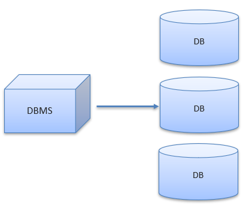

通过上面的描述，大家应该已经知道了`数据库管理系统`和`数据库`的关系。那么有哪些常见的数据库管理系统呢？

## 2.3 常见的数据库管理系统

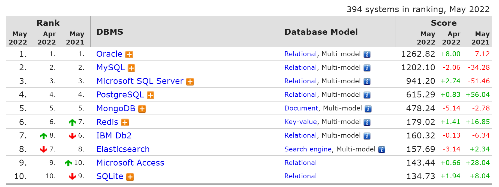

接下来对上面列举的数据库管理系统进行简单的介绍：

* Oracle：收费的大型数据库，Oracle 公司的产品（政企公共部门、金融银行等行业常使用）
* MySQL：开源免费的中小型数据库（Sun 公司收购了 MySQL，而 Sun 公司后又被 Oracle 收购）
* SQL Server：MicroSoft 公司收费的中型数据库（C#、.net 等语言常使用）
* PostgreSQL：开源免费中小型的数据库（MySQL 原团队开发）
* DB2：IBM 公司的大型收费数据库产品
* SQLite：嵌入式的轻型数据库（如：作为 Android 内置数据库）

我们学习的是 MySQL 数据库管理系统，Oracle 在一些公司也有使用，此时大家肯定会想以后在公司中如果使用我们没有学习过的Oracle 数据库管理系统怎么办？这点大家大可不必担心，如下图所示：

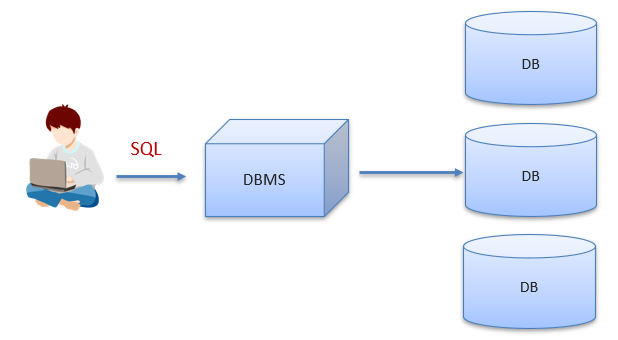

我们可以通过数据库管理系统操作数据库，对数据库中的数据进行增删改查操作，而怎么样让用户跟数据库管理系统打交道呢？通过一门数据库语言（SQL）来实现。并且 SQL 是关系型数据库的通用语言，所以学会 SQL 那么无论遇到哪种关系型数据库都问题不大。

## 2.4 SQL

* 英文：Structured Query Language，简称 SQL（结构化查询语言）
* 操作关系型数据库的编程语言
* 定义操作所有关系型数据库的统一标准，可以使用 SQL 操作所有的关系型数据库管理系统，以后工作中如果使用到了其他的关系型数据库管理系统，也同样的使用 SQL 来操作

> 非关系型数据库（NoSql）
>
> - MongoDB：基于分布式文件存储的数据库。由 C++ 语言编写，旨在为 Web 应用提供可扩展的高性能数据存储解决方案
> - Redis（Remote Dictionary Server )，即远程字典服务：是一个开源的使用 ANSI-C 语言编写、支持网络、可基于内存亦可持久化的日志型、Key-Value 数据库，并提供多种语言的 API（常用于缓存数据库）

# 二、MySQL基础

## 2.1 MySQL安装

> 安装环境：Windows11 64位
> 软件版本：MySQL 5.7.24 解压版（绿色安装版）

### 2.1.1  下载

https://downloads.mysql.com/archives/community/

点开上面的链接就能看到如下界面：

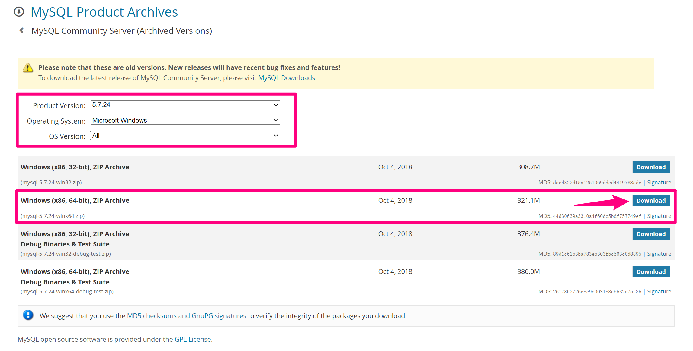

选择和自己系统位数相对应的版本点击右边的`Download`即可下载。

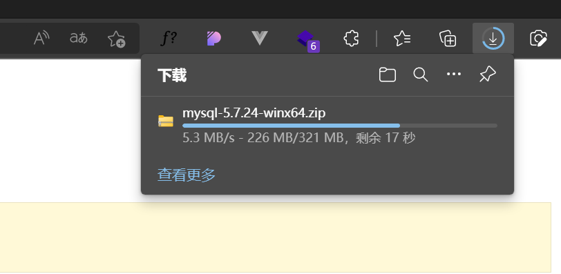

### 2.1.2  安装

下载完成后我们得到的是一个压缩包，将其解压，我们就可以得到 MySQL 5.7.24 的软件本体了（就是一个文件夹），我们可以把它放在你想安装的位置。

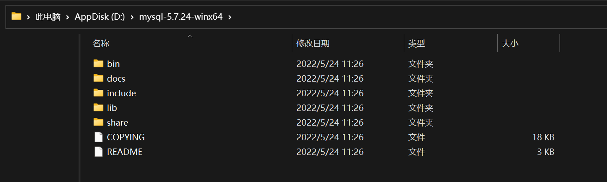

## 2.2 MySQL配置

### 2.2.1 添加环境变量

> 环境变量里面有很多选项，这里我们只用到`Path`这个参数。为什么在初始化的开始要添加环境变量呢？
> 在终端中输入一个可执行程序的名字，Windows 会先在环境变量中的`Path`所指示的路径中寻找一遍，如果找到了就直接执行，没找到就在当前工作目录中继续寻找，如果还没找到，就报错。我们添加环境变量的目的就是能够在任意路径下的终端中直接调用 MySQL 中的相关程序而不用总是切换工作目录，大大方便了操作。

右键`开始菜单`→`设置`→`系统`→`系统信息`，点击`高级系统设置`点击`环境变量`

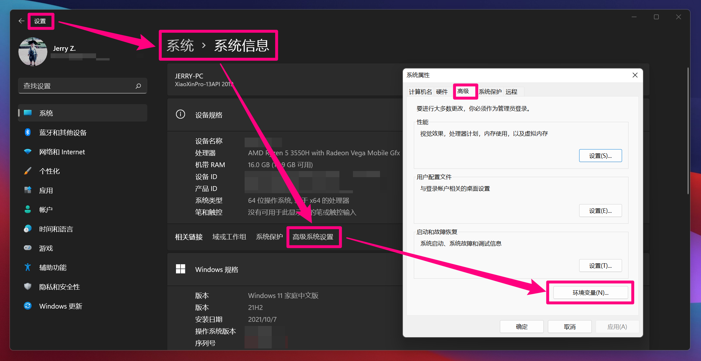

在`系统变量`中新建`MYSQL_HOME`，之后点击确定

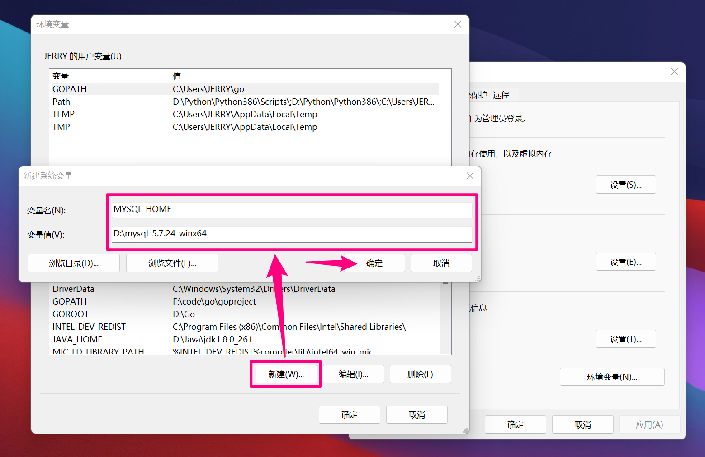

在`系统变量`中找到并编辑`Path`点击`新建`，输入`%MYSQL_HOME%\bin`，最后点击确定。

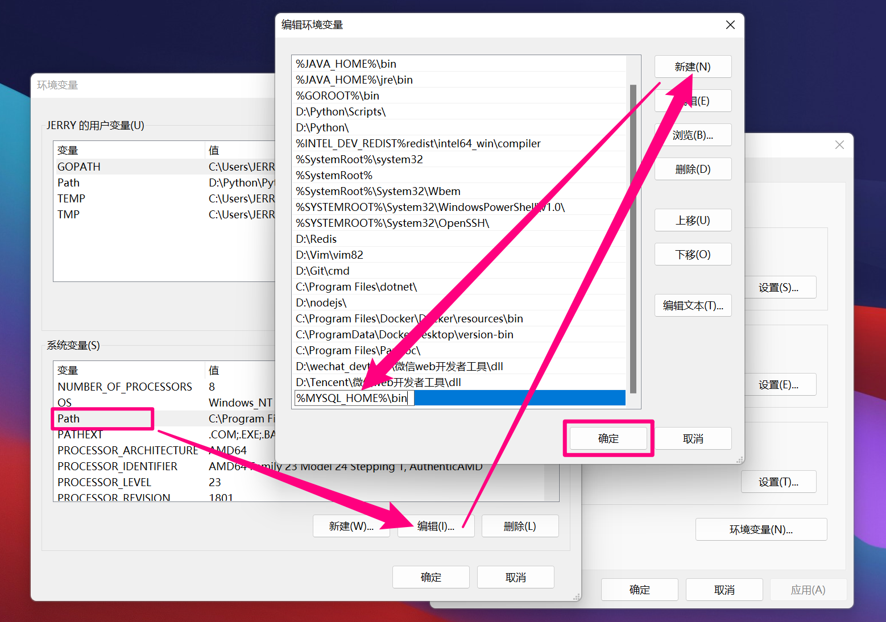

**如何验证是否添加成功？**

右键开始菜单，选择`Windeos终端(管理员)`，打开终端，敲入`mysql`，回车。
如果提示`Can't connect to MySQL server on 'localhost'`则证明添加成功。
如果提示`mysql : 无法将“mysql”项识别为 cmdlet、函数、脚本文件或可运行程序的名称。请检查名称的拼写，如果包括路径，请确保路径正确，然后再试一次。`则表示添加失败，请重新检查步骤并重试。

### 2.2.2 新建配置文件

新建一个文本文件，写入以下内容：

```ini
[mysql]
default-character-set=utf8

[mysqld]
character-set-server=utf8
default-storage-engine=INNODB
sql_mode=STRICT_TRANS_TABLES,NO_ZERO_IN_DATE,NO_ZERO_DATE,ERROR_FOR_DIVISION_BY_ZERO,NO_AUTO_CREATE_USER,NO_ENGINE_SUBSTITUTION
```

把上面的文本文件另存为，在保存类型里选`所有文件 (*.*)`，文件名为`my.ini`，存放的路径为 MySQL 的`根目录`（例如我的是`D:\mysql-5.7.24-winx64`根据自己的 MySQL 目录位置修改）。

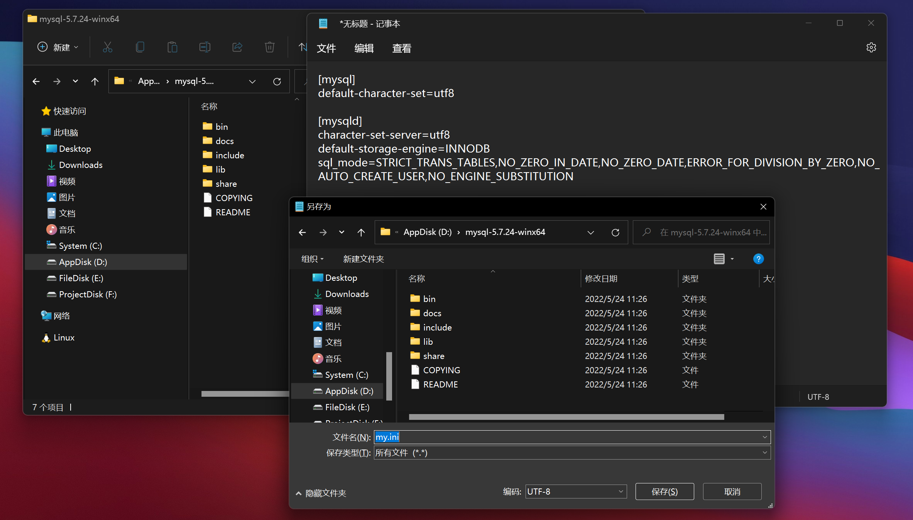

上面配置文本的意思是，配置数据库的默认编码集为`utf-8`和默认存储引擎为`INNODB`。

### 2.2.3  初始化MySQL

在刚才的终端中敲入`mysqld --initialize-insecure`回车，稍微等待一会，如果没有出现报错信息则证明`data`目录初始化没有问题，此时再查看 MySQL 目录下已经有`data`目录生成。

```
mysqld --initialize-insecure
```

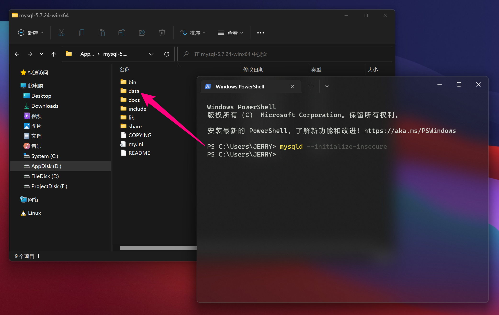

### 2.2.4  注册MySQL服务

> 注册服务就是将 MySQL 作为计算机系统后台的一个应用程序。

在终端里敲入`mysqld -install`，回车。

```
mysqld -install
```


现在你的计算机上已经安装好了 MySQL 服务了。

> 安装了 MySQL 服务的计算机便可以叫做：MySQL 服务器。

> 假设出现`Install/Remove of the Service Denied!`提示，请切换管理员权限终端再试

### 2.2.5  启动MySQL服务

在终端里敲入`net start mysql`，回车。

```java
net start mysql	// 启动 mysql 服务
net stop mysql	// 停止 mysql 服务
```

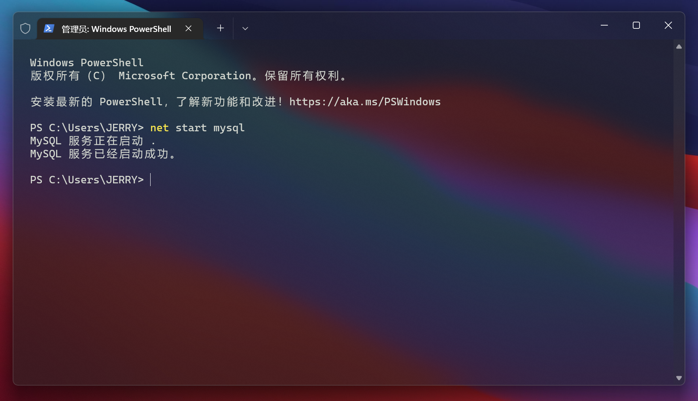

### 2.2.6  修改默认账户密码

在终端里敲入`mysqladmin -u root password 123456`，这里的`123456`就是指默认管理员（即 root 账户）的密码，可以自行修改成你所需的。

```
mysqladmin -u root password 123456
```

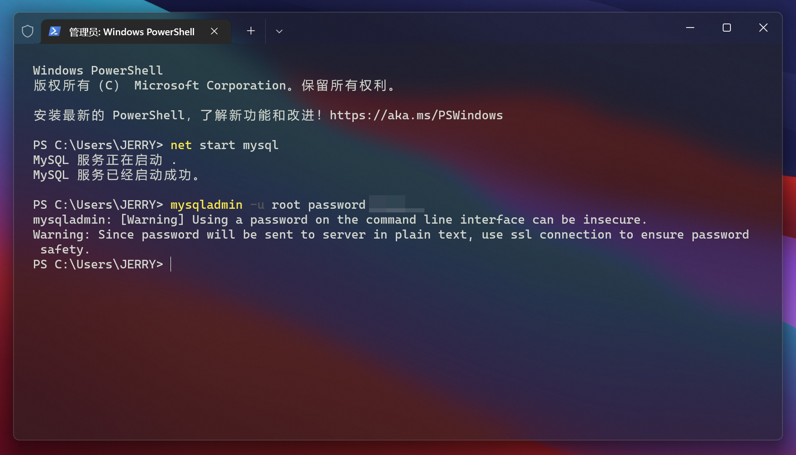

**至此，MySQL 5.7.24 解压版安装完毕！**

### 2.2.7 开启远程访问权限

MySQL 默认是不允许远程访问的，当我们需要远程访问时（比如连接云服务器中的数据库）那么就需要开启远程访问权限。

```mysql
use mysql;
update user set user.Host='%' where user.User='root';
flush privileges;
```

## 2.3  MySQL卸载

如果你想卸载 MySQL，也很简单。

右键开始菜单，选择`Windeos终端(管理员)`，打开终端。

1. 敲入`net stop mysql`，回车。

```
net stop mysql
```

2. 再敲入`mysqld -remove mysql`，回车。

```
mysqld -remove mysql
```

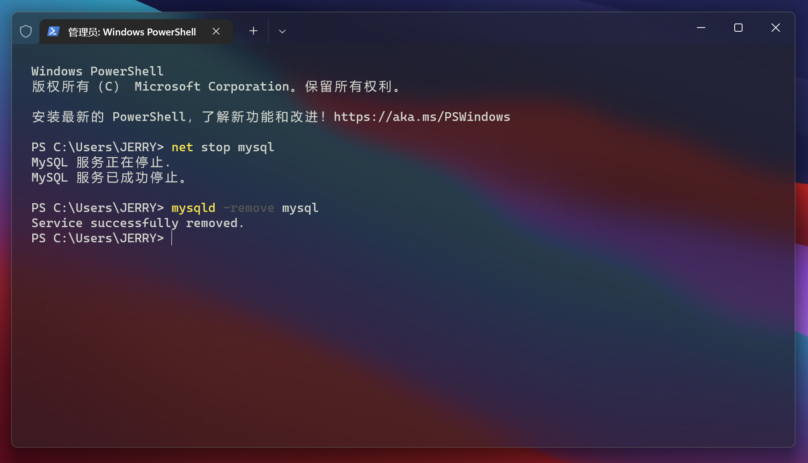

3. 最后删除 MySQL 目录及相关的环境变量。

**至此，MySQL 5.7.24 解压版卸载完成！**

## 2.4  MySQL登陆和退出

### 2.4.1  登陆

右键开始菜单，选择`Windeos终端(管理员)`，打开终端。
在终端中输入，`mysql -uroot -p123456`，回车，出现下图且左下角为`mysql>`，则登录成功。

```
mysql -uroot -p123456

登录参数：
mysql -u用户名 -p密码 -h要连接的mysql服务器的ip地址(默认127.0.0.1) -P端口号(默认3306)
```

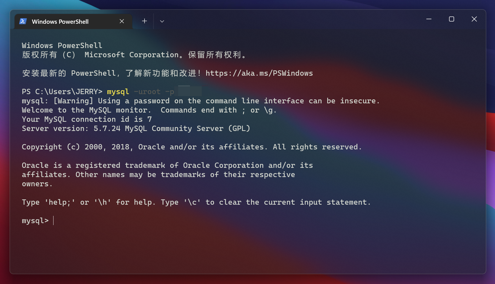

**到这里你就可以开始你的 MySQL 之旅了！**

### 2.4.2  退出

退出 MySQL：

```
exit 或 quit
```

## 2.5  MySQL数据模型

**关系型数据库：**

> 关系型数据库是建立在关系模型基础上的数据库，简单说，关系型数据库是由多张能互相连接的`二维表`组成的数据库。

如下图，`订单信息表` 和 `客户信息表` 都是有行有列二维表我们将这样的称为关系型数据库。

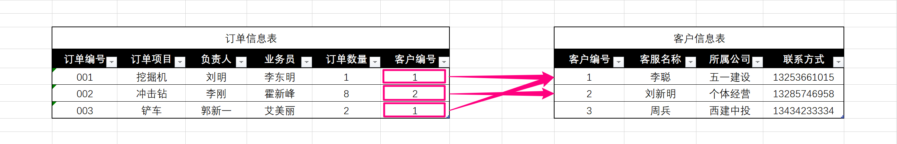

接下来看关系型数据库的优点：

* 都是使用表结构，格式一致，易于维护
* 使用通用的 SQL 语言操作，使用方便，支持复杂查询
* 数据持久化存储在磁盘中，安全稳定

**数据模型：**

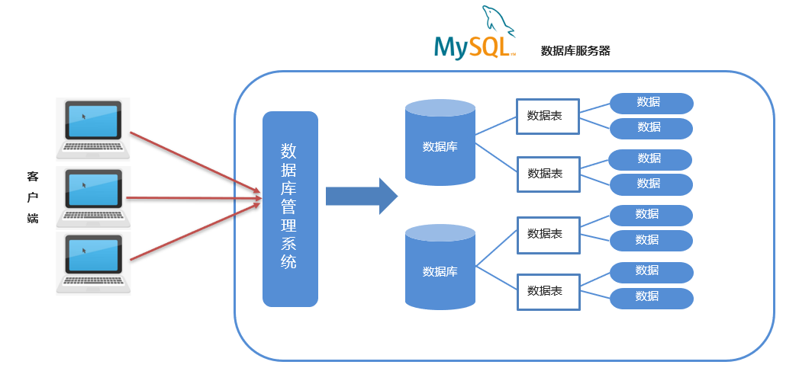

如上图，我们通过客户端利用数据库管理系统创建数据库，在数据库中创建表，在表中添加数据。创建的每一个数据库对应到磁盘上都是一个文件夹。比如可以通过 SQL 语句创建一个数据库（数据库名称为`db01`），语句如下。该语句咱们后面会学习。

```sql
CREATE DATABASE db01;
```

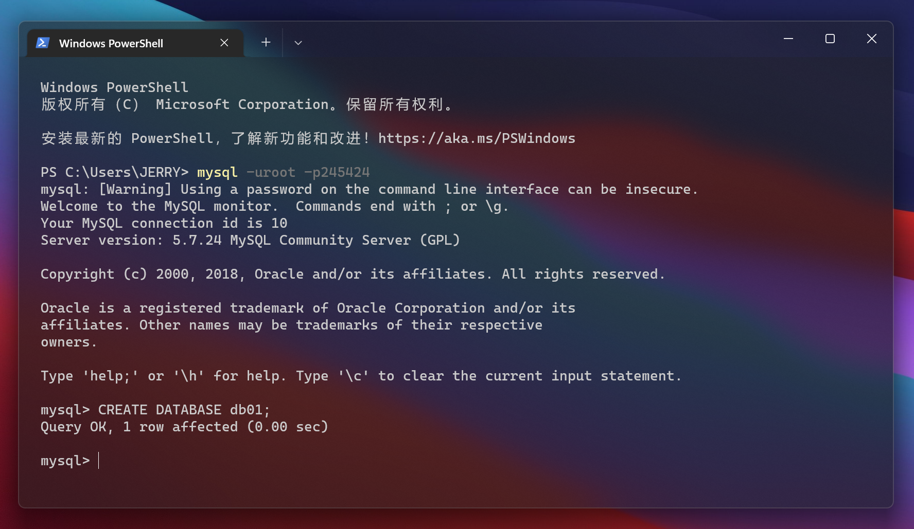

我们可以在数据库安装目录下的`data`目录下看到多了一个`db01`的文件夹。所以，**在 MySQL 中一个数据库对应到磁盘上的一个文件夹。**

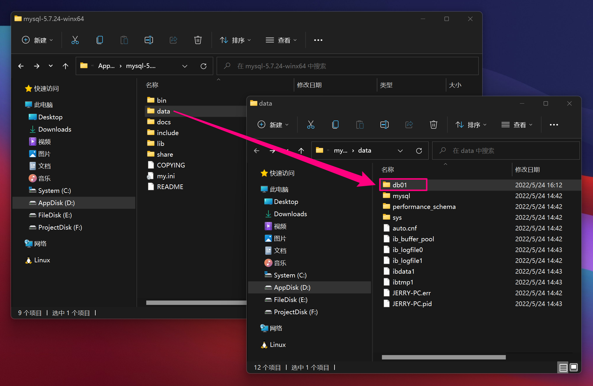

而一个数据库下可以创建多张表，我们到 MySQL 中自带的 mysql 数据库的文件夹目录下：

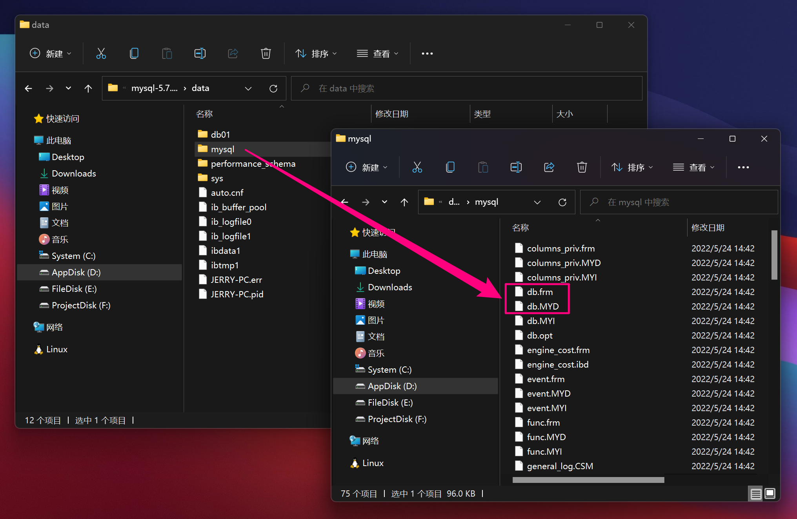

而上图中右边的 `db.frm` 是表文件，`db.MYD` 是数据文件，通过这两个文件组合就可以构建数据二维表。

> 此处只是使用`db.frm`与`db.MYD`举例，其他的任意一张表也是同理。

**小结：**

* MySQL 中可以创建多个数据库，每个数据库对应到磁盘上 data 目录中的一个文件夹
* 在每个数据库中可以创建多个表，每张表都对应到磁盘上一个 frm 文件
* 每张表可以存储多条数据，数据会被存储到磁盘中 MYD 文件中

## 2.6 MySQL文件结构


- bin：用于放置一些可执行文件，如 mysql.exe、mysqld.exe、mysqlshow.exe 等
- data：用于放置一些日志文件以及数据库，我们创建和保存的数据都存在这个目录里
- docs：用于存放一些文档
- include：由于 MySQL 是用 C 语言写的，这里放置一些头文件，如：mysql.h、mysql_ername.h 等
- lib：用于放置一系列库文件
- share：用于存放字符集、语言等信息
- my.ini：默认使用的配置文件，一般情况下，只要修改该配置文件中的内容就可以对 MySQL 进行配置
- COPYING：许可声明
- README：自述文件

# 三、SQL基础

了解了数据模型后，接下来我们就学习 SQL 语句，通过 SQL 语句对数据库、表、数据进行增删改查操作。 

## 3.1 SQL简介

* 英文：Structured Query Language，简称 SQL（结构化查询语言）
* 一门操作关系型数据库的编程语言
* 定义操作所有关系型数据库的统一标准
* 对于同一个需求，每一种数据库操作的方式可能会存在一些不一样的地方，我们称为“方言”，不过只要我们掌握了 SQL 那么切换不同的关系型数据库的学习成本也是非常低的，即：学好“普通话”那么学“方言”也会非常快

## 3.2 通用语法

* SQL 语句可以单行或多行书写，以分号结尾

  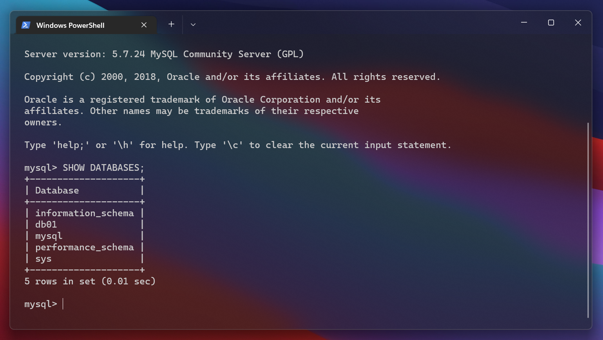 

  如上，以分号结尾才是一个完整的 SQL 语句

* MySQL 数据库的 SQL 语句不区分大小写，关键字建议使用大写

  （同样的一条 SQL 语句写成下图的样子，一样可以运行出结果）

  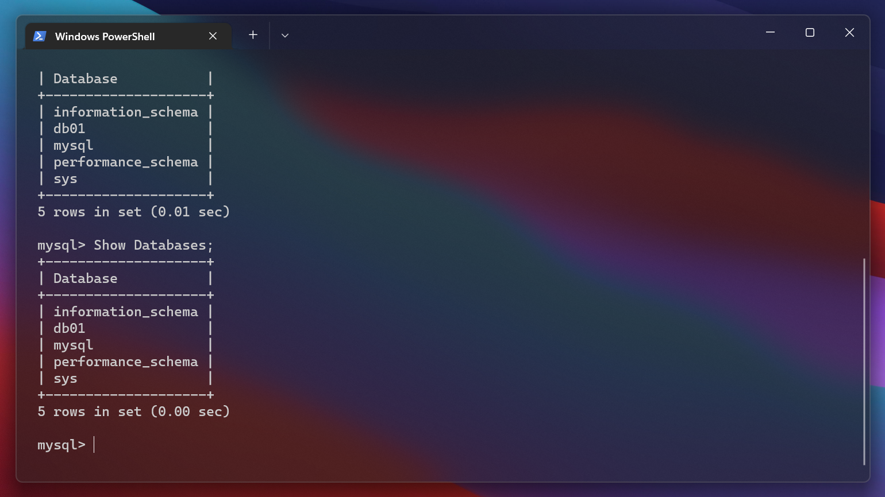 

* 注释

  * 单行注释：`-- 注释`或`# 注释`（MySQL 特有） 
  * 推荐使用 `-- 注释`
  
  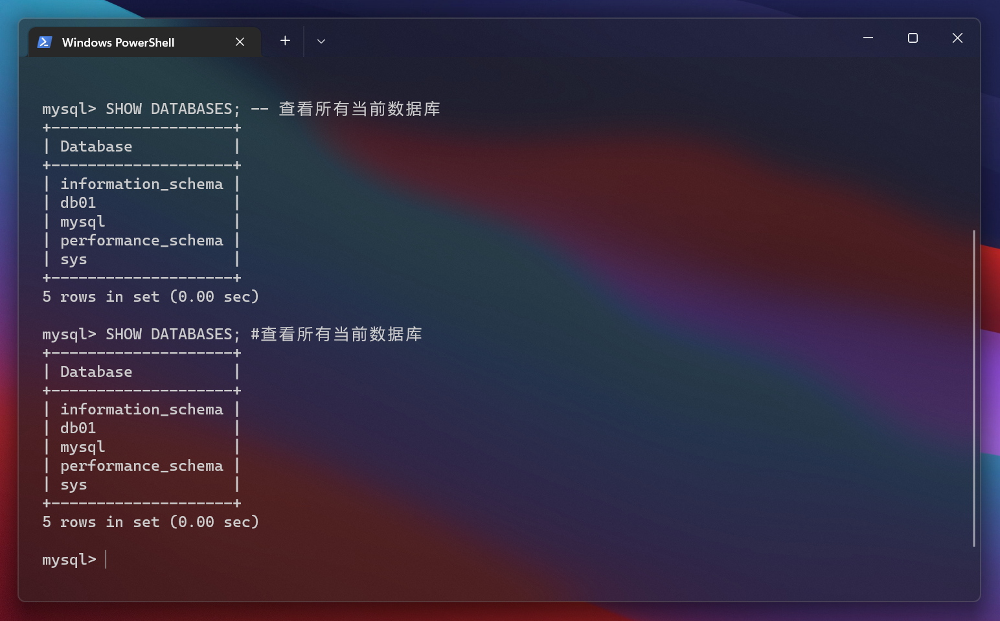 
  
    > 注意：使用`--`添加单行注释时，`--`后面一定要加空格，而`#`没有要求，但推荐注释符号后都留一个空格。
  
  * 多行注释: `/* 注释 */`
  
  ```sql
  -- 单行注释（推荐）
  #单行注释
  # 推荐留一个空格
  /*
  多行
  注释
  */
  ```


## 3.3 SQL分类

* DDL（Data Definition Language）数据定义语言，用来定义数据库对象：数据库、表、列等

  DDL 简单理解就是用来操作数据库和表的。

  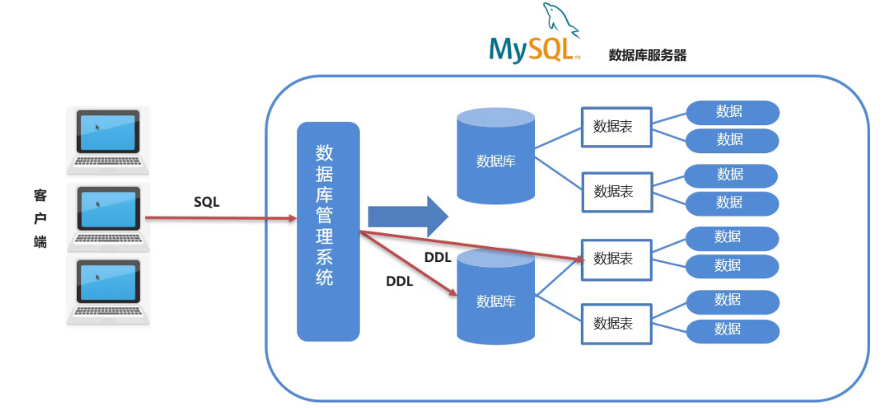

* DML（Data Manipulation Language）数据操作语言，用来对数据库中表的数据进行增删改

  DML 简单理解就对表中数据进行增删改。

  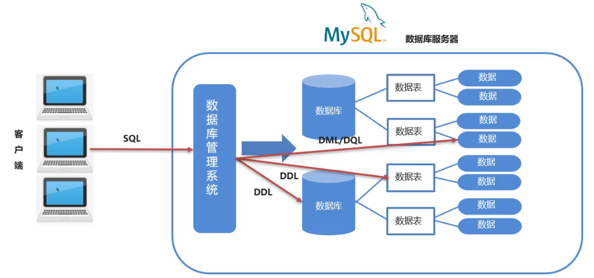

* DQL（Data Query Language）数据查询语言，用来查询数据库中表的记录（数据）

  DQL 简单理解就是对数据进行查询操作，从数据库表中查询到我们想要的数据。

* DCL（Data Control Language）数据控制语言，用来定义数据库的访问权限和安全级别及创建用户

  DML 简单理解就是对数据库进行权限控制，比如我让某一个数据库表只能让某一个用户进行操作等。

> 注意： 以后我们最常操作的是 `DML` 和 `DQL`  ，因为我们开发中最常操作的就是数据。

# 四、DDL数据库定义语言

我们先来学习 DDL 来操作数据库，而操作数据库主要就是对数据库的增删查操作。

## 4.1  查询

查询所有的数据库

```sql
SHOW DATABASES;
```

运行上面语句效果如下：

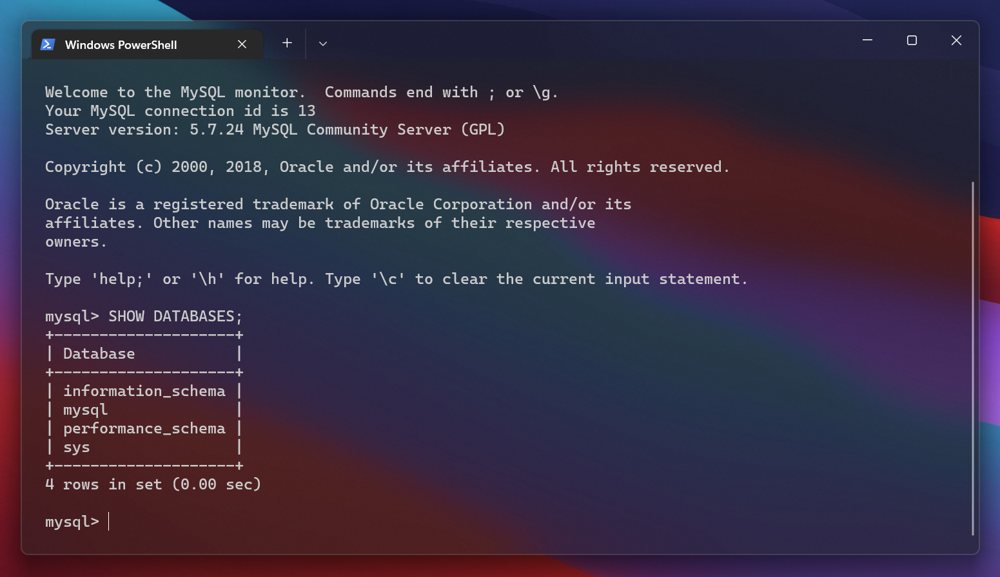

上述查询到的是的这些数据库是 mysql 安装好自带的数据库，是数据库的核心，请不要操作这些数据库。

- `information_schema`是信息数据库，其中保存着关于 MySQL 服务器所维护的所有其他数据库的信息（属于一个逻辑数据库：视图，所以在 data 中并没有它的身影）
- `performance_schema`可以理解为 MySQL Server 数据库性能监控，记录着内存、CPU 和网络磁盘 IO 情况
- `mysql`主要存储用户信息和权限，还有日志、时区信息、内存信息之类
- `sys`提供了一些代替直接访问 performance_schema 的视图，目标是把 performance_schema 的把复杂度降低，让 DBA 能更好的阅读这个库里的内容，让 DBA 更快的了解 DB 的运行情况

## 4.2  创建数据库

* **创建数据库**：

```sql
CREATE DATABASE 数据库名称;
```

而在创建数据库的时候，我并不知道 db01 数据库有没有创建，直接再次创建名为 db01 的数据库就会出现错误。

（Can't create database 'db01'; database exists）

为了避免上面的错误，在创建数据库的时候先做判断，如果不存在再创建。

* **创建数据库（先判断，如果不存在，再创建）**

```sql
CREATE DATABASE IF NOT EXISTS 数据库名称;
```

运行语句效果如下：

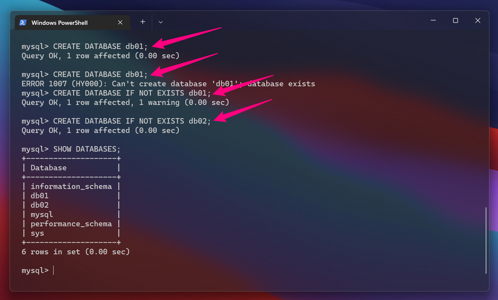

从上面的效果可以看到虽然 db01 数据库已经存在，再创建 db01 也没有报错，而创建 db02 数据库则创建成功。

> MySQL 数据库同样是需要设置字符集的（有默认值），为了确保统一，我们推荐还是手动设置上，防止字符混乱的情况发生：
>
> ```sql
> CREATE DATABASE db01 DEFAULT CHARACTER SET utf8 COLLATE utf8_general_ci;
> ```
>
> - DEFAULT CHARACTER SET utf8：数据库字符集
> - COLLATE utf8_general_ci：数据库校对规则

## 4.3  删除数据库

* **删除数据库**

```sql
DROP DATABASE 数据库名称;
```

* **删除数据库（先判断，如果存在再删除）**

```sql
DROP DATABASE IF EXISTS 数据库名称;
```

运行语句效果如下：

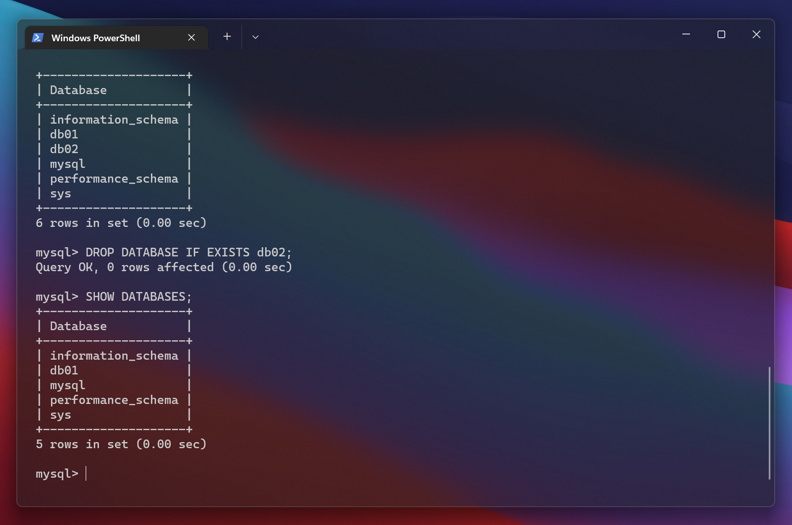

## 4.4  使用数据库

数据库创建好了，要在数据库中创建表，得先明确在哪个数据库中操作，此时就需要使用数据库。

* **使用数据库**

```sql
USE 数据库名称;
```

* **查看当前使用的数据库**

```sql
SELECT DATABASE();
```

运行语句效果如下：

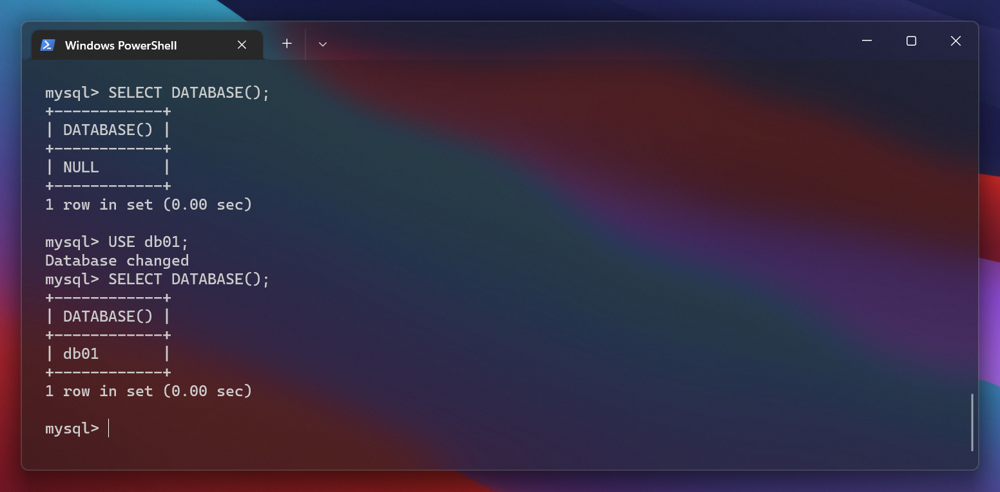

## 4.5 操作表

操作表也就是对表进行增（Create）删（Retrieve）改（Update）查（Delete）。

### 4.5.1 查询表

* **查询当前数据库下所有表名称**

```sql
SHOW TABLES;
```

我们创建的数据库中没有任何表，因此我们进入 MySQL 自带的 mysql 数据库，执行上述语句查看。

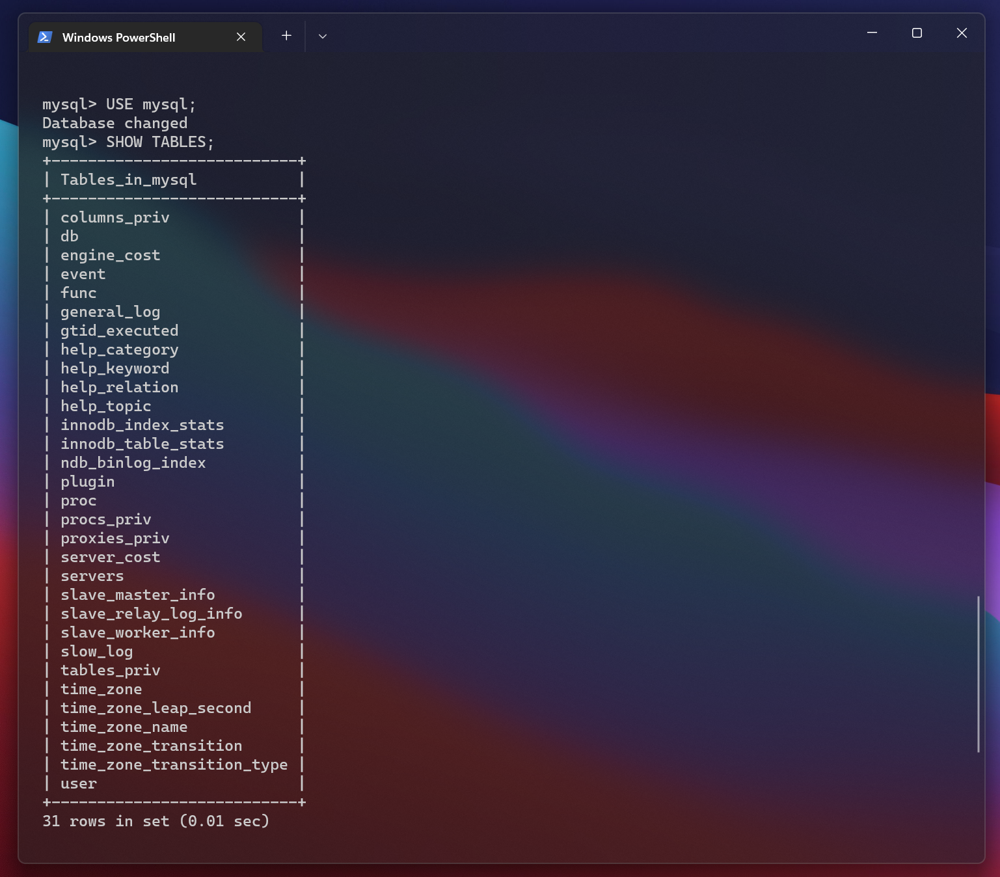

* **查询表结构**

```sql
DESC 表名称;
```

查看所在数据库中 func 表的结构，运行语句如下：

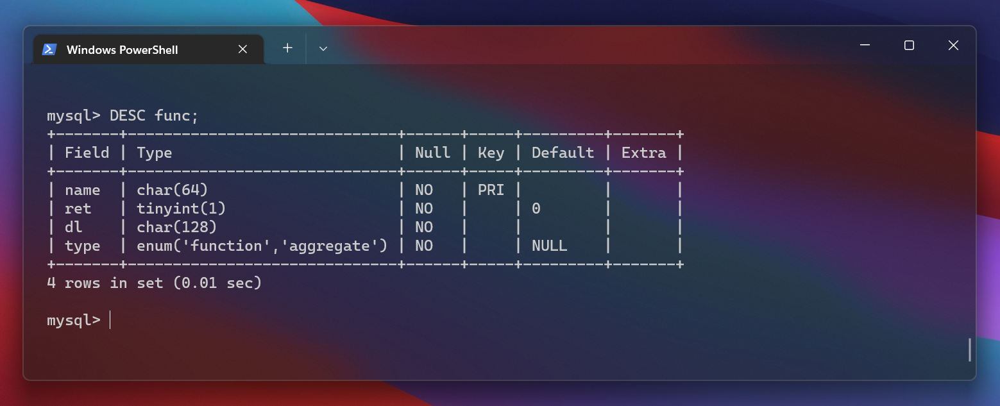

### 4.5.2 创建表

* **创建表**

```sql
CREATE TABLE 表名 (
	字段名1  数据类型1,
	字段名2  数据类型2,
	…
	字段名n  数据类型n
);
```

> 注意：最后一行末尾，不能加逗号

知道了创建表的语句，那么我们创建创建如下结构的表

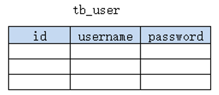

```sql
CREATE TABLE tb_user (
    id int,
    username varchar(20),
    password varchar(32)
);
```

运行语句如下：

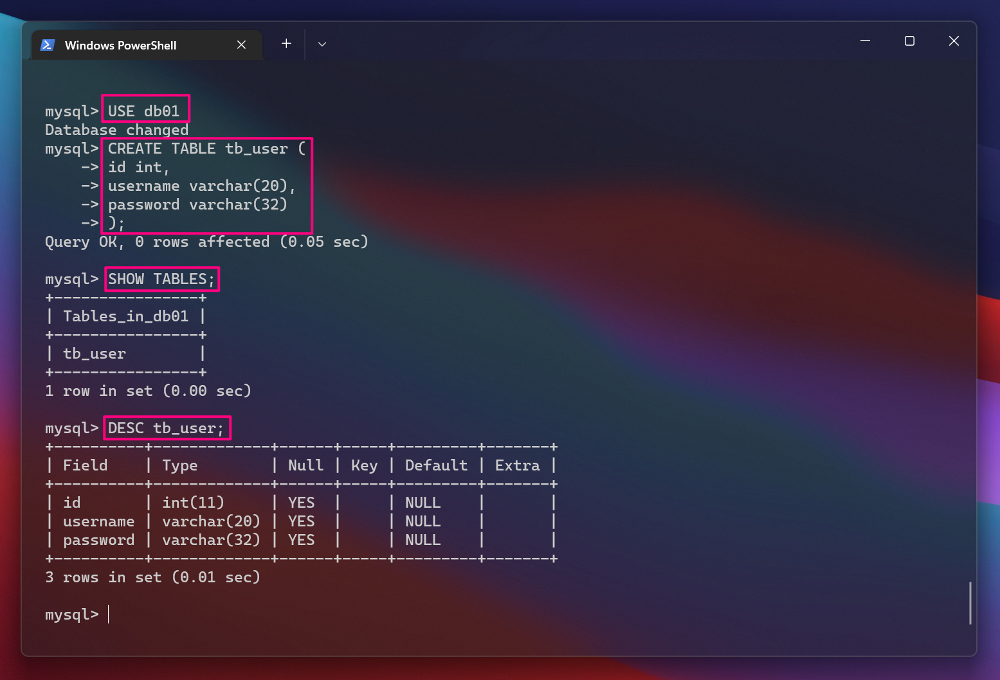

> MySQL 表同样是需要设置字符集的（有默认值），为了确保统一，我们推荐还是手动设置上，防止字符混乱的情况发生：
>
> ```sql
> CREATE TABLE 表名 (
>     ...,
> ) ENGINE = INNODB DEFAULT CHARSET = utf8;
> ```
>
> - ENGINE = INNODB：使用 InnoDB 引擎
> - DEFAULT CHARSET = utf8：数据库默认编码为 utf-8

### 4.5.3 数据类型

MySQL 支持多种类型，可以分为三类：

* 数值

  ```
  tinyint：小整数型，占一个字节
  int：大整数类型，占四个字节，使用格式：字段名 int;
  double：浮点类型，使用格式：字段名 double(总长度, 小数点后保留的位数);
  ```
  
* 日期

  ```
  date：日期值，只包含年月日，eg：birthday date;
  datetime：混合日期和时间值，包含年月日时分秒
  ```
  
* 字符串

  ```
  char：定长字符串。
  	优点：存储性能高
  	缺点：浪费空间
  	eg：name char(10) 如果存储的数据字符个数不足10个，也会占10个的空间
  varchar：变长字符串。
  	优点：节约空间
  	缺点：存储性能底
  	eg：name varchar(10) 如果存储的数据字符个数不足10个，那就数据字符个数是几就占几个的空间	
  ```

> 

**案例：**

> 需求：设计一张学生表，请注重数据类型、长度的合理性。
> 1. 编号
> 2. 姓名，姓名最长不超过 10 个汉字
> 3. 性别，因为取值只有两种可能，因此最多一个汉字（一个汉字占两个字符，但是这里用 0 表示女，1 表示男）
> 4. 生日，取值为年月日
> 5. 入学成绩，小数点后保留两位
> 6. 邮件地址，最大长度不超过 64
> 7. 家庭联系电话，不一定是手机号码，可能会出现 - 等字符
> 8. 学生状态（用数字表示，正常、休学、毕业...）

语句设计如下：

```sql
CREATE TABLE student (
    id int,
    name varchar(10),
    gender char(1),
    birthday date,
    score double(5,2),
    email varchar(64),
    tel varchar(15),
    status tinyint
);
```

### 4.5.4 删除表

* **删除表**

```sql
DROP TABLE 表名;
```

* **删除表时判断表是否存在**

```sql
DROP TABLE IF EXISTS 表名;
```

运行语句效果如下：

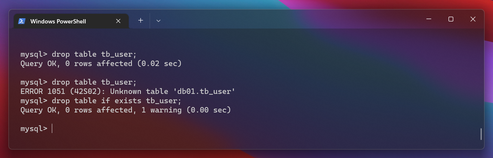

### 4.5.5 修改表

* **修改表名**

```sql
ALTER TABLE 表名 RENAME TO 新的表名;

-- 将表名 student 修改为 stu
ALTER TABLE student RENAME TO stu;
```

* **添加一列**

```sql
ALTER TABLE 表名 ADD 列名 数据类型;

-- 给 stu 表添加一列 address，该字段类型是 varchar(50)
ALTER TABLE stu ADD address varchar(50);
```

* **修改数据类型**

```sql
ALTER TABLE 表名 MODIFY 列名 新数据类型;

-- 将 stu 表中的 address 字段的类型改为 char(50)
ALTER TABLE stu MODIFY address char(50);
```

* **修改列名和数据类型**

```sql
ALTER TABLE 表名 CHANGE 列名 新列名 新数据类型;

-- 将 stu 表中的 address 字段名改为 addr，类型改为 varchar(50)
ALTER TABLE stu CHANGE address addr varchar(50);
```

* **删除列**

```sql
ALTER TABLE 表名 DROP 列名;

-- 将 stu 表中的 addr 字段 删除
ALTER TABLE stu DROP addr;
```

## 4.6 Navicat使用

通过上面的学习，我们发现在命令行中写 SQL 语句特别不方便，尤其是编写创建表的语句，我们只能在记事本上写好后直接复制到命令行进行执行。那么有没有更好的工具提供给我们进行使用呢？ 当然有！

### 4.6.1  Navicat概述

* Navicat for MySQL 是管理和开发 MySQL 的理想解决方案
* 这套全面的工具为数据库管理、开发和维护提供了一款直观而强大的图形界面。
* Navicat几乎支持市面上所有主流的数据库
* 官网： [http://www.navicat.com.cn](http://www.navicat.com.cn/) 

### 4.6.3  Navicat使用

**建立和 MySQL 服务的连接**

第一步： 点击连接，选择 MySQL

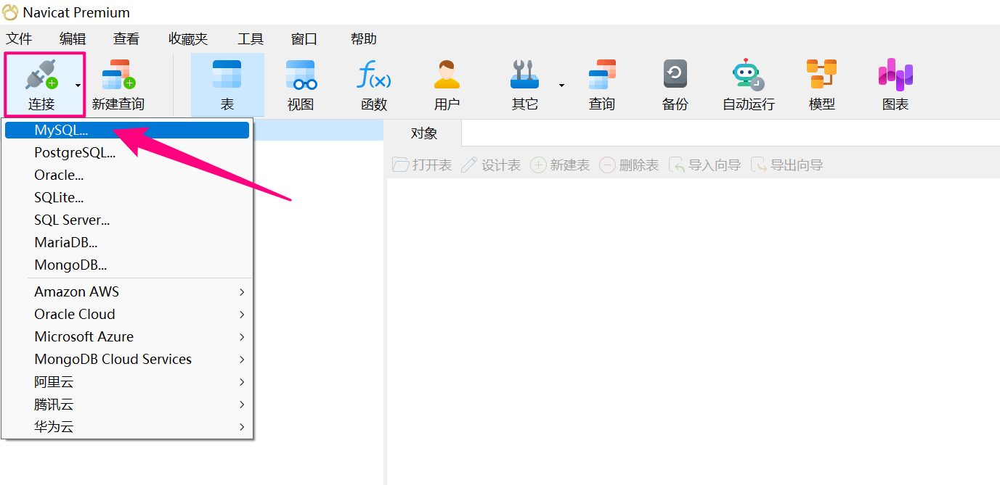

第二步：填写连接数据库必要的信息

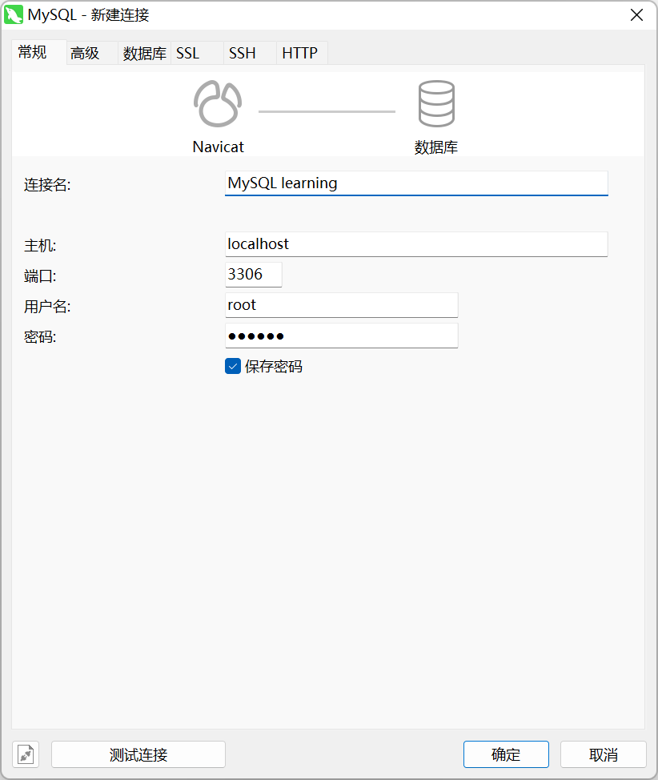

以上操作没有问题就会提示“连接成功”。

连接成功后，双击数据库就可以打开数据库，就能看到如下图界面：

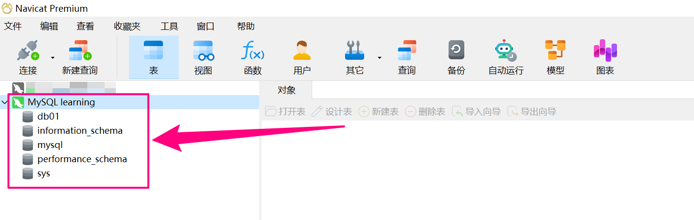

* **创建表**

通过下图操作创建表：

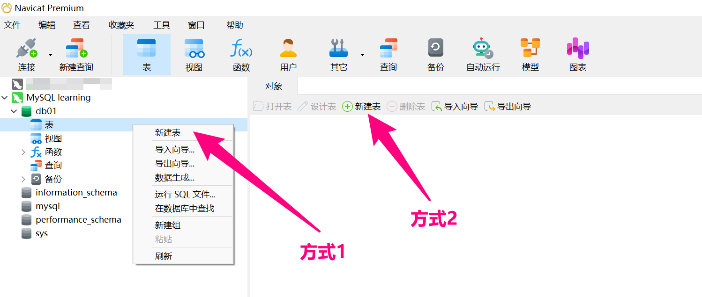

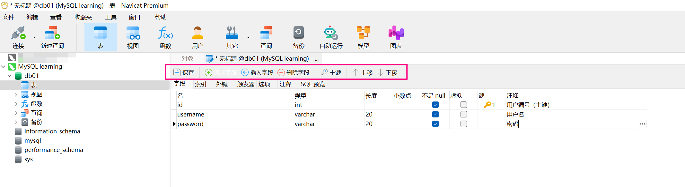

* **修改表结构**

通过下图操作修改表结构：

设计表完成后，可以点击设计表，对表进行再修改。

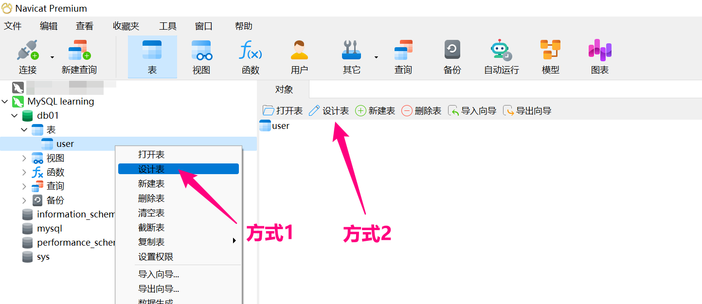

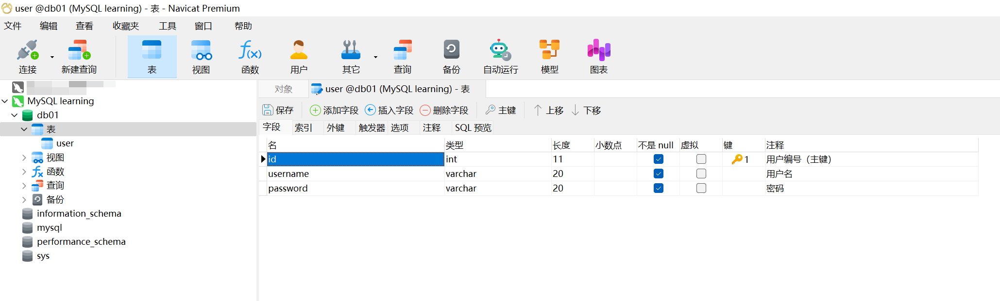

* **编写SQL语句并执行**

按照如下图所示进行操作即可书写 SQL 语句并执行 SQL 语句。

首先，在某个数据库下新建查询：


在编辑窗口中输入 SQL 代码，点击运行并在结果窗口中查看执行结果。


> 注意：运行 SQL 语句有两种方式：1、运行全部 SQL 语句；2、运行选中的 SQL 语句

- **将表构建为模型或图表**

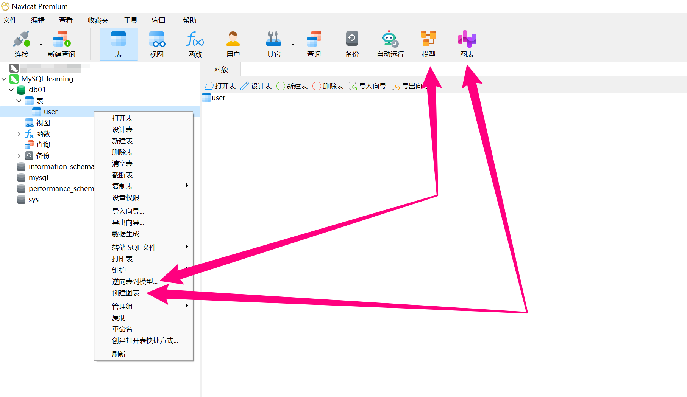

- **导入导出数据**

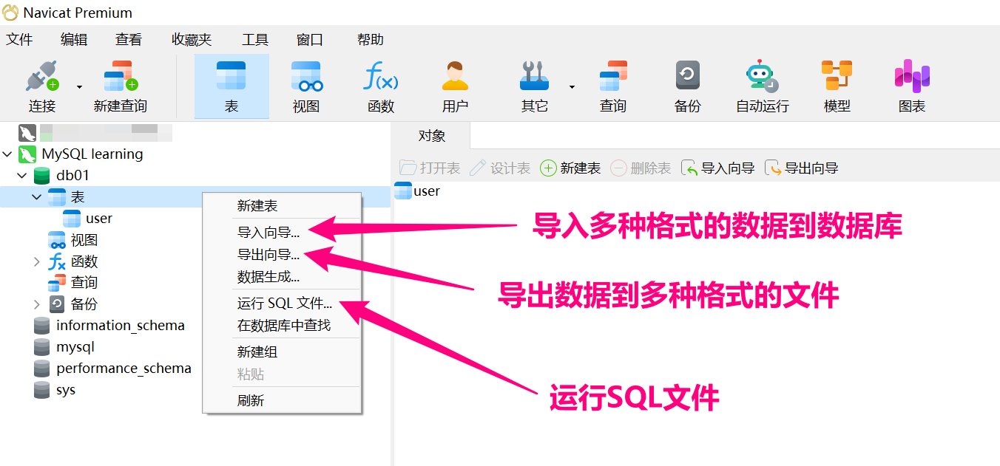

将数据库导出为 SQL 文件或执行 SQL 文件：

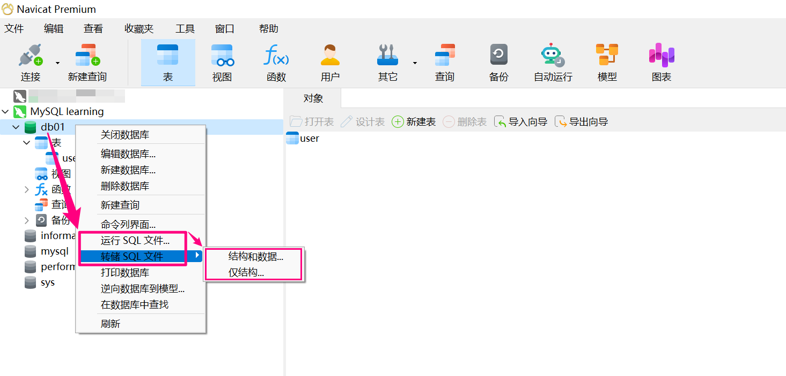

# 五、DML

DML 主要是对数据进行增（insert）删（delete）改（update）操作。

### 5.1  添加数据

* **给指定列添加数据**

```sql
INSERT INTO 表名(列名1, 列名2, …) VALUES(值1, 值2, …);
```

* **给全部列添加数据**

```sql
INSERT INTO 表名 VALUES(值1, 值2,…);
```

* **批量添加数据**

```sql
INSERT INTO 表名(列名1, 列名2, …) VALUES(值1, 值2, …), (值1, 值2, …), (值1, 值2, …), …;
INSERT INTO 表名 VALUES(值1, 值2, …), (值1, 值2, …), (值1, 值2, …), …;
```

* **练习**

为了演示以下的增删改操作是否操作成功，故先将查询所有数据的语句介绍给大家：

```sql
# 查询 stu 中的所有数据
SELECT * FROM stu;
```

```sql
-- 给指定列添加数据
INSERT INTO stu (id, NAME) VALUES (1, '张三');
-- 给所有列添加数据，列名列表可以省略（为了可读性，建议不要省略！）
INSERT INTO stu (id, NAME, sex, birthday, score, email, tel, STATUS) VALUES (2, '李四', '男', '1999-11-11', 88.88, 'lisi@itcast.cn', '13888888888', 1);
-- 省略列名列表（为了可读性，建议不要省略！）
INSERT INTO stu VALUES (2,'李四','男','1999-11-11',88.88,'lisi@itcast.cn','13888888888',1);

-- 批量添加数据，以给所有列添加数据为例
INSERT INTO stu VALUES 
	(2, '李四', '男', '1999-11-11', 88.88, 'lisi@itcast.cn', '13888888888', 1),
	(2, '李四', '男', '1999-11-11', 88.88, 'lisi@itcast.cn', '13888888888', 1),
	(2, '李四', '男', '1999-11-11', 88.88, 'lisi@itcast.cn', '13888888888', 1);
```

### 5.2  修改数据

* **修改表数据**

```sql
UPDATE 表名 SET 列名1 = 值1, 列名2 = 值2, … [WHERE 条件];
```

> 注意：
>
> 1. 修改语句中如果不加 WHERE 条件，则将对所有的数据都修改！
> 2. 像上面的语句中的中括号，表示在写 SQL 语句中可以省略这部分

* **练习**

  * 将张三的性别改为女

    ```sql
    UPDATE stu SET sex = '女' WHERE name = '张三';
    ```

  * 将张三的生日改为 1999-12-12 分数改为 99.99

    ```sql
    UPDATE stu SET birthday = '1999-12-12', score = 99.99 WHERE name = '张三';
    ```

  * 注意：如果 update 语句没有加 where 条件，则会将表中该列的所有数据全部修改！

    ```sql
    UPDATE stu SET sex = '女';
    ```


### 5.3  删除数据

* **删除数据**

```sql
DELETE FROM 表名 [WHERE 条件];
```

* **练习**

```sql
-- 删除张三记录
DELETE FROM stu WHERE name = '张三';

-- 删除 stu 表中所有的数据
DELETE FROM stu;
```

# 六、DQL

数据库查询操作是最重要的操作，所以此部分需要重点掌握。

接下来我们先介绍查询的完整语法：

> 注意：在进行 DQL 操作的时候，一定要符合下列命令的先后顺序！

```sql
SELECT 
    字段列表
FROM 
    表名列表 
WHERE 
    条件列表
GROUP BY
    分组字段
HAVING
    分组后条件
ORDER BY
    排序字段
LIMIT
    分页限定
```

为了给大家演示查询的语句，我们需要先准备表及一些数据：

```sql
-- 删除 stu 表
DROP TABLE IF EXISTS stu;

-- 创建 stu 表
CREATE TABLE stu (
 id int, -- 编号
 name varchar(20), -- 姓名
 age int, -- 年龄
 sex varchar(5), -- 性别
 address varchar(100), -- 地址
 math double(5, 2), -- 数学成绩
 english double(5, 2), -- 英语成绩
 hire_date date -- 入学时间
);

-- 添加数据
INSERT INTO stu ( id, NAME, age, sex, address, math, english, hire_date )
VALUES
	( 1, '马运', 55, '男', '杭州', 66, 78, '1995-09-01' ),
	( 2, '马花疼', 45, '女', '深圳', 98, 87, '1998-09-01' ),
	( 3, '马斯克', 55, '男', '香港', 56, 77, '1999-09-02' ),
	( 4, '柳白', 20, '女', '湖南', 76, 65, '1997-09-05' ),
	( 5, '柳青', 20, '男', '湖南', 86, NULL, '1998-09-01' ),
	( 6, '刘德花', 57, '男', '香港', 99, 99, '1998-09-01' ),
	( 7, '张学右', 22, '女', '香港', 99, 99, '1998-09-01' ),
	( 8, '德玛西亚', 18, '男', '南京', 56, 65, '1994-09-02' );
```

接下来咱们从最基本的查询语句开始学起。

### 6.1  基础查询

#### 6.1.1  语法

* **查询多个字段**

```sql
SELECT 字段列表 FROM 表名;
SELECT * FROM 表名; -- 查询所有数据
```

* **去除重复记录**

```sql
SELECT DISTINCT 字段列表 FROM 表名;
```

* **起别名**

```sql
AS: -- AS 可以省略
```

#### 6.1.2  练习

* 查询 name、age 两列

  ```sql
  SELECT name, age FROM stu;
  ```

* 查询所有列的数据，列名的列表可以使用`*`替代

  ```sql
  SELECT * FROM stu;
  ```

  上面语句中的`*`不建议大家使用，因为在这写`*`不方便我们阅读 SQL 语句，同时滥用`*`会造成性能浪费，我们写字段列表的话，可以添加注释对每一个字段进行说明。

* 查询地址信息

  ```sql
  SELECT address FROM stu;
  ```

  执行上面语句结果如下：

  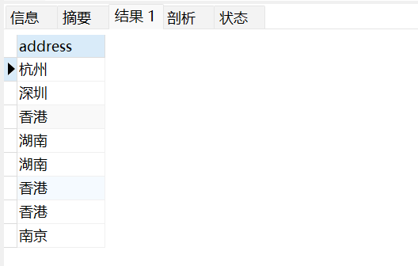

  从上面的结果我们可以看到有重复的数据，我们也可以使用`DISTINCT`关键字去除重复数据。

* 去除重复记录

  ```sql
  SELECT DISTINCT address FROM stu;
  ```

* 查询姓名、数学成绩、英语成绩。并通过`AS`给`math`和`english`起别名（AS 关键字可以省略）

  ```sql
  SELECT name, math AS 数学成绩, english AS 英文成绩 FROM stu;
  SELECT name, math 数学成绩, english 英文成绩 FROM stu;
  ```

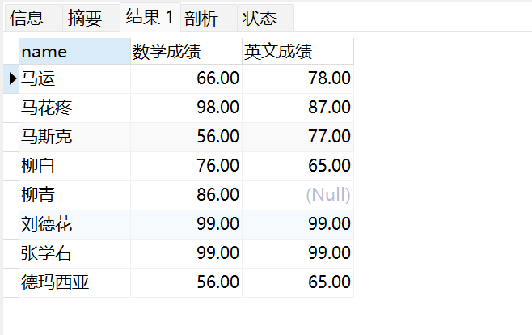

### 6.2  条件查询

#### 6.2.1  语法

```sql
SELECT 字段列表 FROM 表名 WHERE 条件列表;
```

* **条件**

条件列表可以使用以下运算符：

| 符号                  | 功能                                   |
| --------------------- | -------------------------------------- |
| `>`                   | 大于                                   |
| `<`                   | 小于                                   |
| `>=`                  | 大于等于                               |
| `<=`                  | 小于等于                               |
| `=`                   | 等于                                   |
| `<>` 或 `!=`          | 不等于                                 |
| `BETWEEN ... AND ...` | 在某个范围之内（都包含）               |
| `IN(...)`             | 多选一                                 |
| `LIKE 占位符`         | 模糊查询，_单个任意字符，%多个任意字符 |
| `IS NULL`             | 是 NULL                                |
| `IS NOT NULL`         | 不是 NULL                              |
| `AND` 或 `&&`         | 并且                                   |
| `OR` 或 `||`          | 或者                                   |
| `NOT` 或 `!`          | 非，不是                               |

#### 6.2.2  条件查询练习

* 查询年龄大于 20 岁的学员信息

  ```sql
  SELECT * FROM stu WHERE age > 20;
  ```

* 查询年龄大于等于 20 岁的学员信息

  ```sql
  SELECT * FROM stu WHERE age >= 20;
  ```

* 查询年龄大于等于 20 岁并且年龄小于等于 30 岁的学员信息

  ```sql
  SELECT * FROM stu WHERE age >= 20 && age <= 30;
  SELECT * FROM stu WHERE age >= 20 AND age <= 30;
  ```

  > 上面语句中 && 和 AND 都表示并且的意思，建议使用 AND
  >
  > 也可以使用 BETWEEN ... AND ... 来实现上面需求

  ```sql
  SELECT * FROM stu WHERE age BETWEEN 20 AND 30;
  ```

* 查询入学日期在 '1998-09-01' 到 '1999-09-01' 之间的学员信息

  ```sql
  SELECT * FROM stu WHERE hire_date BETWEEN '1998-09-01' AND '1999-09-01';
  ```

* 查询年龄等于 18 岁的学员信息

  ```sql
  SELECT * FROM stu WHERE age = 18;
  ```

* 查询年龄不等于 18 岁的学员信息

  ```sql
  SELECT * FROM stu WHERE age != 18;
  SELECT * FROM stu WHERE age <> 18;
  ```

* 查询年龄等于 18 岁或者年龄等于 20 岁或者年龄等于 22 岁的学员信息

  ```sql
  SELECT * FROM stu WHERE age = 18 OR age = 20 OR age = 22;
  SELECT * FROM stu WHERE age IN (18, 20 ,22);
  ```

* 查询年龄不在 18 岁到 20 岁之间的学员信息

```sql
SELECT * FROM stu WHERE age NOT IN (18, 19, 20); 
```

* 查询英语成绩为 null 的学员信息

  NULL 值的比较不能使用 =  或者 != 。需要使用 IS 或者 IS NOT

  ```sql
  SELECT * FROM stu WHERE english = NULL; -- 这个语句是不行的
  SELECT * FROM stu WHERE english IS NULL;
  SELECT * FROM stu WHERE english IS NOT NULL;
  ```

#### 6.2.3  模糊查询练习

> 模糊查询使用 LIKE 关键字，可以使用通配符进行占位：
>
> - `_`：代表单个任意字符
>
> - `%`：代表任意个数字符

* 查询姓 “马” 的学员信息

  ```sql
  SELECT * FROM stu WHERE name LIKE '马%';
  ```

* 查询第二个字是 “花” 的学员信息  

  ```sql
  SELECT * FROM stu WHERE name LIKE '_花%';
  ```

* 查询名字中包含 “德” 的学员信息

  ```sql
  SELECT * FROM stu WHERE name LIKE '%德%';
  ```


### 6.3  排序查询

#### 6.3.1  语法

```sql
SELECT 字段列表 FROM 表名 ORDER BY 排序字段名1 [排序方式1], 排序字段名2 [排序方式2] …;
```

上述语句中的排序方式有两种，分别是：

* ASC ： 升序排列（默认值）
* DESC ： 降序排列

> 注意：如果有多个排序条件，那么只有当前边的条件值一样时，才会根据后一条件进行排序。

#### 6.3.2  练习

* 查询学生信息，按照年龄升序排列 

  ```sql
  SELECT * FROM stu ORDER BY age;
  SELECT * FROM stu ORDER BY age ASC;
  ```

* 查询学生信息，按照数学成绩降序排列

  ```sql
  SELECT * FROM stu ORDER BY math DESC;
  ```

* 查询学生信息，按照数学成绩降序排列，如果数学成绩一样，再按照英语成绩升序排列

  ```sql
  SELECT * FROM stu ORDER BY math DESC , english ASC;
  SELECT * FROM stu ORDER BY math DESC , english;
  ```


### 6.4  聚合函数

#### 6.4.1  概念

将一列数据作为一个整体，进行纵向计算。

如何理解呢？假设有如下表：

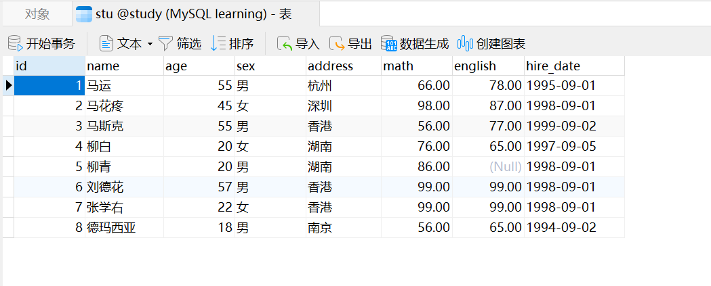

现有一需求让我们求表中所有数据的数学成绩的总和，这就是对 math 字段进行纵向求和。

#### 6.4.2  聚合函数分类

| 函数名        | 功能                               |
| ------------- | ---------------------------------- |
| `COUNT(列名)` | 统计数量（一般选用不为 null 的列） |
| `MAX(列名)`   | 最大值                             |
| `MIN(列名)`   | 最小值                             |
| `SUM(列名)`   | 求和                               |
| `AVG(列名)`   | 平均值                             |

#### 6.4.3  聚合函数语法

```sql
SELECT 聚合函数名(列名) FROM 表;
```

> 注意：NULL 值不参与所有聚合函数运算。

#### 6.4.4  练习

* 统计班级一共有多少个学生

  ```sql
  SELECT COUNT(id) FROM stu; -- 8条数据，统计学生个数正确
  SELECT COUNT(english) FROM stu; -- 7条数据，统计学生个数错误
  ```

  上面语句根据某个字段进行统计，如果该字段某一行的值为 NULL 的话，将不会被统计。所以可以通过主键或者 `count(*)` 来实现，`*`表示所有字段数据，当一行数据所有列都为 NULL 时才统计不出该行来，一行中也不可能所有的数据都为 NULL，所以建议使用`count(*)`。

  ```sql
  SELECT COUNT(*) FROM stu; -- 8条数据
  ```

* 查询数学成绩的最高分

  ```sql
  SELECT MAX(math) FROM stu;
  ```

* 查询数学成绩的最低分

  ```sql
  SELECT MIN(math) FROM stu;
  ```

* 查询数学成绩的总分

  ```sql
  SELECT SUM(math) FROM stu;
  ```

* 查询数学成绩的平均分

  ```sql
  SELECT AVG(math) FROM stu;
  ```

* 查询英语成绩的最低分

  ```sql
  SELECT MIN(english) FROM stu;
  ```


### 6.5  分组查询

#### 6.5.1  语法

> 分组查询的本质其实就是：先按照某个条件对数据进行分组，然后对每一个组进行单独的查询。

```sql
SELECT 字段列表 FROM 表名 [WHERE 分组前条件限定] GROUP BY 分组字段名 [HAVING 分组后条件过滤];
```

> 注意：分组之后，查询的字段为聚合函数和分组字段，查询其他字段无任何意义。

#### 6.5.2  练习

* 查询男同学和女同学各自的数学平均分

  ```sql
  SELECT sex, AVG(math) FROM stu GROUP BY sex;
  -- 为了方便知道分组后的组名，所以我们通常也把分组字段 sex 加上 
  ```

  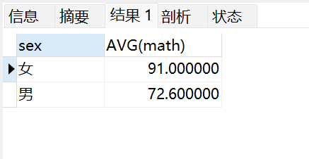

  > 注意：分组之后，查询的字段为 **聚合函数** 或 **分组字段**，查询其他字段无任何意义！

  ```sql
  SELECT name, sex, AVG(math) FROM stu GROUP BY sex;  -- 这里查询 name 字段就没有任何意义
  ```

* 查询男同学和女同学各自的数学平均分，以及各自人数

  ```sql
  SELECT sex, AVG(math), COUNT(*) FROM stu GROUP BY sex;
  ```

* 查询男同学和女同学各自的数学平均分，以及各自人数，要求：分数低于 70 分的不参与分组

  ```sql
  SELECT sex, AVG(math), COUNT(*) FROM stu WHERE math > 70 GROUP BY sex;
  ```

* 查询男同学和女同学各自的数学平均分，以及各自人数，要求：分数低于 70 分的不参与分组，分组之后人数大于 2 个的

  ```sql
  SELECT sex, AVG(math), COUNT(*) FROM stu WHERE math > 70 GROUP BY sex HAVING COUNT(*)  > 2
  ```

> 注意：如果 SQL 语句过长，那么推荐换行写。
>
> ```sql
> SELECT sex, AVG( math ), COUNT(*) 
> FROM stu 
> WHERE math > 70 
> GROUP BY sex 
> HAVING COUNT(*) > 2;
> ```

**WHERE 和 HAVING 区别：**

* 执行时机不一样：WHERE 是分组之前进行限定，不满足 WHERE 条件，则不参与分组，而 HAVING 是分组之后对结果进行过滤。

* 可判断的条件不一样：WHERE 不能对聚合函数进行判断，HAVING 可以。

### 6.6  分页查询

相信大家在很多网站都见过页面底部分页部件，如京东、百度、淘宝等。分页查询是将数据一页一页的展示给用户看，用户也可以通过点击查看下一页的数据，这样在面对大量数据的时候可以有效缓解性能压力，同时增加用户体验。

接下来我们先说分页查询的语法。

#### 6.6.1  语法

```sql
SELECT 字段列表 FROM 表名 LIMIT 起始索引, 查询条目数;
```

> 注意： 上述语句中的起始索引是从 0 开始。

#### 6.6.2  练习

* 从 0 开始查询，查询 3 条数据

  ```sql
  SELECT * FROM stu LIMIT 0 , 3;
  ```

* 每页显示3条数据，查询第1页数据

  ```sql
  SELECT * FROM stu LIMIT 0 , 3;
  ```

* 每页显示3条数据，查询第2页数据

  ```sql
  SELECT * FROM stu LIMIT 3 , 3;
  ```

* 每页显示3条数据，查询第3页数据

  ```sql
  SELECT * FROM stu LIMIT 6 , 3;
  ```

从上面的练习推导出起始索引计算公式：

```sql
起始索引 = (当前页码 - 1) * 每页显示的条数
```

> 小提示：
>
> 分页查询在不同数据库中不一样。
>
> - MySQL：limit
> - Oracle：rownumber
> - SQL Server：top

# 七、约束

## 7.1 概述和分类

### 7.1.1 约束的概念

- 约束是作用于表中列上的规则，用于限制加入表的数据
- 约束的存在保证了数据库中数据的准确性，有效性和完整性

### 7.1.2 约束的分类

| 约束名称 | 描述                                                         | 关键字        |
| -------- | ------------------------------------------------------------ | ------------- |
| 非空约束 | 保证列中所有数据不能有 NULL 值                               | `NOT NULL`    |
| 唯一约束 | 保证列中所有数据各不相同                                     | `UNIQUE`      |
| 主键约束 | 主键是一行数据的唯一标识，要求非空且唯一<br />（一张表只能有一个主键） | `PRIMARY KEY` |
| 检查约束 | 保证列中的值满足某一条件                                     | `CHECK`       |
| 默认约束 | 保存数据时，未指定值采用默认值                               | `DEFAULT`     |
| 外键约束 | 外键用来让两个表的数据之间建立链接，保证数据的一致性和完整性<br />（一张表可以有多个外键） | `FOREIGN KEY` |

> 注意：MySQL 不支持检查约束！对于数据的检查，我们可以放在逻辑代码中进行（例如 Java）。

## 7.2 约束案例

根据需求，为表添加合适的约束。


```sql
CREATE TABLE emp (
	id INT PRIMARY KEY AUTO_INCREMENT, -- id主键一般配合自增长 AUTO_INCREMENT 来约束
	ename VARCHAR ( 50 ) NOT NULL UNIQUE,
	joindate DATE NOT NULL,
	salary DOUBLE ( 7, 2 ) NOT NULL,
	bonus DOUBLE ( 7, 2 ) DEFAULT 0 
);
```

> ```sql
> -- 建完表后添加非空约束
> ALTER TABLE 表名 MODIFY 字段名 数据类型 NOT NULL;
> -- 删除约束
> ALTER TABLE 表名 MODIFY 字段名 数据类型;
> 
> -- 建完表后添加唯一约束
> ALTER TABLE 表名 MODIFY 字段名 数据类型 UNIQUE;
> -- 删除约束
> ALTER TABLE 表名 DROP INDEX 字段名;
> 
> -- 建完表后添加主键约束
> ALTER TABLE 表名 ADD PRIMARY KEY(字段名);
> -- 删除约束
> ALTER TABLE 表名 DROP PRIMARY KEY;
> 
> -- 建完表后添加默认约束
> ALTER TABLE 表名 ALTER 列名 SET DEFAULT 默认值;
> -- 删除约束
> ALTER TABLE 表名 ALTER 列名 DROP DEFAULT;
> ```

> 注意：虽然一张表只能有一个主键，但是该主键是可以由该张表的多个字段共同构成的！
>
> ```sql
> CREATE TABLE 表名 (
>     ...,
>     PRIMARY KEY (字段1, 字段2)
> );
> 
> -- 或是在表创建后再：ALTER TABLE 表名 ADD PRIMARY KEY(字段1， 字段2);
> ```

## 7.3 外键约束

概念：外键用来将两个表的数据之间建立联结，保证数据的一致性和完整性。

举例：员工表中每个员工的部门信息来源于部门表。

> 一致性：员工的部门信息一定来源于部门表，信息一致。
>
> 完整性：要删除某一个部门，前提是属于该部门的员工都已经删除了。
>
> 员工表为 “从表”，部门表为 “主表”。
>
> 一定是先创建主表，再创建从表！

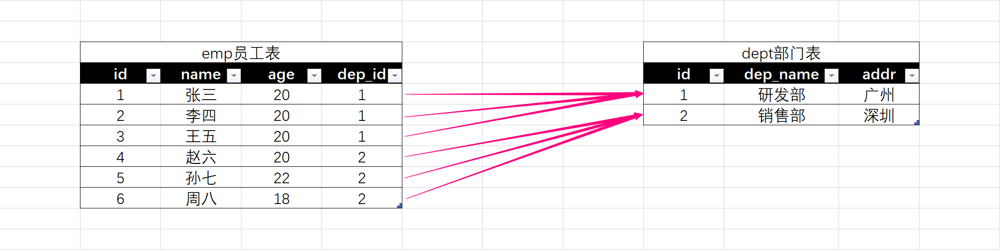

语法：

（1）添加约束

```sql
-- 创建表时添加外键约束
CREATE TABLE 表名 (
    列名 数据类型,
    ...
    [CONSTRAINT] [外键名称] FOREIGN KEY(外键列名) REFERENCES 主表(主表列名)
);
```

```sql
-- 键完表后添加外键约束
ALTER TABLE 表名 ADD CONSTRAINT 外键名称 FOREIGN KEY(外键列名) REFERENCES 主表(主表列名);
```

（2）删除约束

```sql
ALTER TABLE 表名 DROP FOREIGN KEY 外键名称;
```

案例解决：

```sql
-- 一定是先创建主表，再创建从表！

-- 部门表
CREATE TABLE dept (
    id INT PRIMARY KEY AUTO_INCREMENT,
    dep_name VARCHAR ( 20 ),
    addr VARCHAR ( 20 )
);

-- 员工表
CREATE TABLE emp ( 
    id INT PRIMARY KEY AUTO_INCREMENT,
    name VARCHAR ( 20 ), 
    age INT, 
    dep_id INT, 
    -- 添加外键 dep_id 关联 dept 表的 id 主键
    -- 外键通常命名为：fk_从表_主表
    CONSTRAINT fk_emp_dept FOREIGN KEY(dep_id) REFERENCES dept(id)
);
```

# 八、数据库设计

## 8.1 简介

### 8.1.1 软件的研发步骤


### 8.1.2 数据库设计概念

- 数据库设计就是根据业务系统的具体需求，结合我们所选用的 DBMS，为这个业务系统构造出最优的数据存储模型
- 通俗理解：建立数据库中的表结构以及表与表之间的关联关系的过程
- 有哪些表？表里有哪些字段？表与表之间有什么关系？

### 8.1.3 数据库设计步骤

1. 需求分析（数据是什么？数据具有哪些属性？数据与属性的特点是什么？）
2. 逻辑分析（通过 ER 图对数据库进行逻辑建模，不需要考虑我们所选用的数据库管理系统）
3. 物理设计（根据数据库自身的特点把逻辑设计转换为物理设计）
4. 维护设计（对新的需求进行建表以及表优化等）

## 8.2 多表关系的实现

### 8.2.1 表关系

- 一对一：用户 和 用户详情
- 一对多（多对一）：部门 和 员工
- 多对多：商品 和 订单

### 8.2.2 表关系的实现

**（1）一对一**

一对一关系多用于表拆分，将一个实体中经常使用的字段放一张表，不经常使用的字段放另一张表，用于提升查询性能。

实现方式：在任意一方加入外键，关联另一方的主键，并且设置外键为唯一（UNIQUE）。

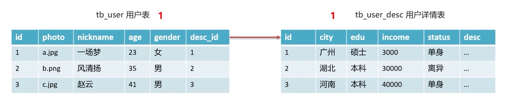

**（2）一对多（多对一）**

实现方式：再 “多” 的一方建立外键，指向 “一” 的一方的主键。

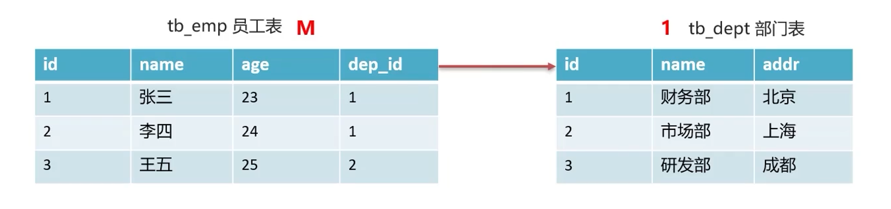

**（3）多对多**

实现方式：建立第三张中间表，中间表至少包含两个外键，分布关联两方的主键。

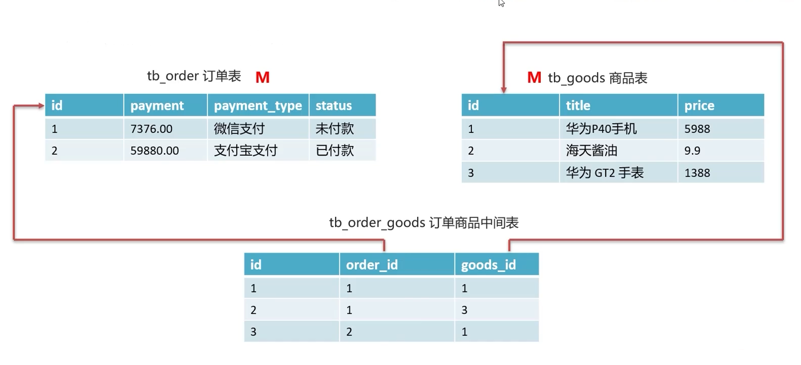

> 通常，在第三张中间表中，我们还会存放一些其他数据，比如：购买数量。
>
> 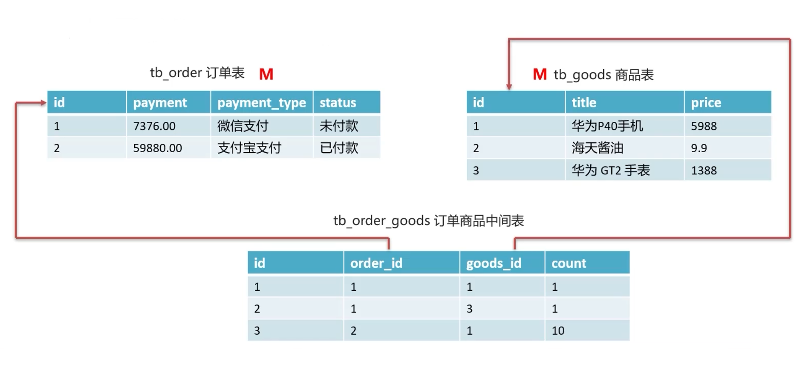

> 购物车的例子更好理解多对多
>
> 表1：商品表（主键：商品id）
>
> 表2：用户表（主键：用户id）
>
> 表3：购物车表（外键1：商品id，外键2：用户id，其他数据：商品添加数量）

多对多实现：

```sql
-- 订单表
CREATE TABLE tb_order (
    id INT PRIMARY KEY AUTO_INCREMENT,
    payment DOUBLE ( 10, 2 ),
    payment_type TINYINT,
    status TINYINT
);

-- 商品表
CREATE TABLE tb_goods (
    id INT PRIMARY KEY AUTO_INCREMENT,
    title VARCHAR ( 100 ),
    price DOUBLE ( 10, 2 )
);

-- 订单商品中间表
CREATE TABLE tb_order_goods (
	id INT PRIMARY KEY AUTO_INCREMENT,
    order_id INT,
    goods_id INT,
    count int
);

-- 添加外键
ALTER TABLE tb_order_goods ADD CONSTRAINT fk_order_id FOREIGN KEY(order_id) REFERENCES tb_order(id);
ALTER TABLE tb_order_goods ADD CONSTRAINT fk_goods_id FOREIGN KEY(goods_id) REFERENCES tb_goods(id);
```

## 8.3 案例

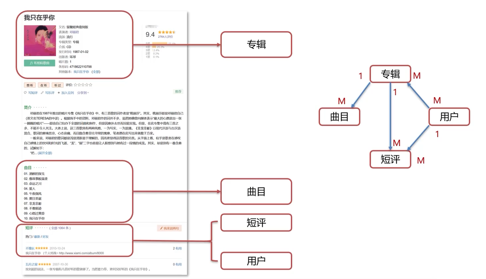

## 8.4 三大范式

**（1）第一范式**

1NF 是对属性的**原子性**，要求属性具有原子性，不可再分解；

> 表：字段1、 字段2(字段2.1、字段2.2)、字段3

如：`学生(学号, 姓名, 性别, 出生年月日)`，如果认为最后一列还可以再分成`(出生年, 出生月, 出生日)`，它就不是一范式了，否则就是；

**（2）第二范式**

第二范式（2NF）是在第一范式（1NF）的基础上建立起来的，即满足第二范式（2NF）必须先满足第一范式（1NF）；

第二范式要求确保表中每列与主键相关，而不能只与主键的某部分相关（主要针对联合主键），主键列与非主键列遵循完全函数依赖关系，也就是完全依赖；

2NF 是对记录的**唯一性**，要求记录有唯一标识，即实体的唯一性，即不存在**部分依赖**；

> 表：学号、姓名、课程、学分、成绩

这个表明显说明了两个事务：`学生信息`，`课程信息`；由于非主键字段必须依赖主键，这里**学分依赖课程，成绩依赖学号及课程**，所以不符合二范式。

可能会存在问题：

- 数据冗余：多条记录含有相同信息；
- 删除异常：删除所有学生信息，就把课程信息全删除了；
- 插入异常：学生未选课，无法记录进数据库；
- 更新异常：调整课程学分，所有行都得调整；

正确做法：

- 学生表：`Student(学号, 姓名)`； 
- 课程表：`Course(课程号, 课程名, 学分)`；
- 选课关系表：`StudentCourse(学号, 课程号, 成绩)`；

**（3）第三范式**

第三范式（3NF）是在第二范式的基础上建立起来的。第三范式指：属性不依赖于其他非主属性；

3NF 是对字段的**冗余性**，要求任何字段不能由其他字段派生出来，它要求字段没有冗余，即不存在**传递依赖**；

> 表：学号，姓名，年龄，学院名称，学院电话 

存在**传递依赖：**(学号) → (所在学院) → (学院联系电话) 。

可能会存在问题：

- 数据冗余：有重复值；
- 更新异常：有重复的冗余信息，修改时需要同时修改多条记录，否则会出现数据不一致的情况；

正确做法：

- 学生表：`Student(学号, 姓名, 年龄, 学院编号)`；

- 学院表：`College(学院编号, 学院名称, 学院电话)`；

**（4）反范式化**

**一般说来，数据库只需满足第三范式（3NF）就行了。**

没有冗余的数据库设计是可以做到的。但是，没有冗余的数据库未必是最好的数据库！有时为了提高运行效率，就必须降低范式标准，适当保留冗余数据。具体做法是：在概念数据模型设计时遵守第三范式，降低范式标准的工作放到物理数据模型设计时考虑。降低范式就是增加字段，允许冗余，达到以空间换时间的目的。

例：有一张存放商品的基本表，“金额” 这个字段的存在，表明该表的设计不满足第三范式，因为 “金额” 可以由 “单价” 乘以 “数量” 得到，说明 “金额” 是冗余字段。但是，增加 “金额” 这个冗余字段，可以提高查询统计的速度，这就是以空间换时间的作法。

> **关于关系数据库表的 “合与拆” ？**
>
> 数据库设计是尽量把字段放在一个表，还是能分离的尽量分离？这个问题，其实是不绝对的，需要结合具体的业务场景来谈！
>
> 或者说：两边都是极端！
>
> 如果尽量 “分离”，结果是每两张表之间都要有关系表。好处是业务变动时数据库更改很小，代价是查询会变麻烦。
>
> 如果尽量 “合并”，结果是表数量减少。好处是查询方便贴合逻辑，代价是一旦业务变更引发的修改规模很大。
>
> 一般是根据业务来分析，绝对不会变的关系一般会合并，有可能在未来四五年改变的要留好弹性，然后根据具体业务作冗余。
>
> 当然理论上用一张表几百个字段也所谓。不分析需求，设计不足，经常要改结构的也无所谓。

## 8.5 数据完整性

（1）域完整性

是指一个列的输入有效性，是否允许为空值。强制域完整性的方法有：限制类型（通过设定列的数据类型）、格式（通过 CHECK 约束和规则）或可能值的范围（通过 FOREIGN KEY 约束、CHECK 约束、DEFAULT 定义、NOT NULL 定义和规则）。如：学生的考试成绩必须在 0～100 之间，性别只能是 “男” 或 “女”。

（2）实体完整性

是指保证表中所有的行唯一。实体完整性要求表中的所有行都有一个唯一标识符。这个唯一标识符可能是一列，也可能是几列的组合，称为主键。也就是说，表中的主键在所有行上必须取唯一值。强制实体完整性的方法有：索引、UNIQUE 约束、PRIMARY KEY 约束或 IDENTITY 属性。如：student 表中 sno（学号）的取值必须唯一，它唯一标识了相应记录所代表的学生，学号重复是非法的。学生的姓名不能作为主键，因为完全可能存在两个学生同名同姓的情况。

（3）参照完整性

是指保证主关键字（被引用表）和外部关键字（引用表）之间的参照关系。它涉及两个或两个以上表数据的一致性维护。外键值将引用表中包含此外键的记录和被引用表中主键与外键相匹配的记录关联起来。在输入、更改或删除记录时，参照完整性保持表之间已定义的关系，确保键值在所有表中一致。这样的一致性要求确保不会引用不存在的值，如果键值更改了，那么在整个数据库中，对该键值的所有引用要进行一致的更改。参照完整性是基于外键与主键之间的关系。例如学生学习课程的课程号必须是有效的课程号，score 表（成绩表）的外键 cno（课程号）将参考 course 表（课程表）中主键 cno（课程号）以实现数据完整性。

域完整性、实体完整性及参照完整性分别在列、行、表上实施。数据完整性任何时候都可以实施，但对已有数据的表实施数据完整性时，系统要先检查表中的数据是否满足所实施的完整性，只有表中的数据满足了所实施的完整性，数据完整性才能实施成功。

# 九、多表查询

当我们需要同时在多个表中查询数据时，我们便需要使用多表查询。

例如：`SELECT * FROM emp, dept;`

多表查询的本质是笛卡儿积！

所以，当我们执行上面的语句时，得到的查询结果是将 emp 表与 dept 表的每一行数据都两两组合一遍，最终得到的数据很多是无意义的数据，所以，我们在使用多表查询的时候，一定要限定条件进行约束！例如，联结查询：

```sql
-- 查询 emp 和 dept 的数据，其中要满足 emp.dep_id = dept.id
SELECT * FROM emp, dept
WHERE emp.dep_id = dept.id
```

多表查询：从多张表查询数据。


- 联结查询
  - 内联结：相当于查询 A B 交集数据
  - 外联结：
    - 左外联结：相当于查询 A 表所有数据和交集部分数据
    - 右外联结：相当于查询 B 表所有数据和交集部分数据
- 子查询

## 9.1 内联结

内联结查询语法：

```sql
-- 隐式内联结
SELECT 字段列表 FROM 表1, 表2, ... WHERE 条件;

-- 显示内联结
SELECT 字段列表 FROM 表1 [INNER] JOIN 表2 ON 条件;
```

```sql
-- 隐式内联结
SELECT emp.name, emp.gender, dept.name
FROM emp, dept
WHERE emp.dep_id = dept.id;

-- 起别名
SELECT t1.name, t1.gender, t2.name
FROM emp AS t1, dept AS t2
WHERE t1.dep_id = t2.id;
```

```sql
-- 显示内联结
SELECT emp.name, emp.gender, dept.name
FROM emp
INNER JOIN dept ON emp.dep_id = dept.id;

-- INNER 可以省略
SELECT emp.name, emp.gender, dept.name
FROM emp
JOIN dept ON emp.dep_id = dept.id;
```

## 9.2 外联结

外联结查询语法：

```sql
-- 左外联结
SELECT 字段列表 FROM 表1 LEFT [OUTER] JOIN 表2 ON 条件;

-- 右边联结
SELECT 字段列表 FROM 表1 RIGHT [OUTER] JOIN 表2 ON 条件;
```

- 左外联结：符合条件部分 + 左表不符合条件部分
- 右外联结：符合条件部分 + 右表不符合条件部分

```sql
-- 左外联结
-- 查询 emp 表所有数据和对应的部门信息
SELECT * FROM emp LEFT JOIN dept ON emp.dep_id = dept.did;

-- 右外联结
-- 查询 dept 表的所有数据和对应的员工信息
SELECT * FROM emp RIGHT JOIN dept ON emp.dep_id = dept.did;
```

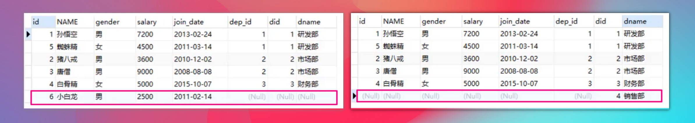

## 9.3 子查询

子查询的概念：查询中嵌套查询，称嵌套的查询为子查询。

```sql
-- 查询工资高于猪八戒的员工信息

-- 1、查询猪八戒的工资
SELECT salary FROM emp WHERE name = "猪八戒";	-- 3600
-- 2、查询工资高于猪八戒的员工信息
SELECT * FROM emp WHERE salary > 3600;

-- 子查询
SELECT * FROM emp
WHERE salary > (
    SELECT salary FROM emp
    WHERE name = "猪八戒"
);
```

子查询根据查询结果不同，作用不同：

- 单行单列：作为条件值，使用 `=` `!=` `>` `<` 等进行条件判断

  `SELECT 字段名称 FROM 表 WHERE 字段名 = (子查询);`

  ```sql
  -- 查询 “财务部” 所有员工信息
  SELECT * FROM emp 
  WHERE dep_id = (
      SELECT did FROM dept
      WHERE dname = "财务部"
  );
  ```

- 多行单列：作为条件值，使用 `in` 等关键字进行条件判断

  `SELECT 字段名称 FROM 表 WHERE 字段名 in (子查询);`

  ```sql
  -- 查询 “财务部” 和 “市场部” 所有的员工信息
  
  -- 拆分
  SELECT did FROM dept WHERE dname = '财务部' OR dname = '市场部';	 -- 2 3
  SELECT * FROM emp WHERE dep_id IN ( 2, 3 );
  
  -- 多行单列子查询
  SELECT * FROM emp 
  WHERE dep_id IN (
      SELECT did FROM dept 
      WHERE dname = '财务部' OR dname = '市场部'
  );
  ```

- 多行多列：作为虚拟表

  `SELECT 字段名称 FORM (子查询) WHERE 条件;`

  ```sql
  -- 查询入职日期是 2011-11-11 之后的员工信息和部门信息
  SELECT * FROM (
      SELECT * FROM emp
      WHERE join_date > '2011-11-11'
  ) AS t1, dept
  WHERE t1.dep_id = dept.did;
  ```

# 十、视图

## 10.1 视图简介

视图是虚拟的表。与包含数据的表不同，视图只包含使用时动态检索数据的查询。

举例：

```sql
-- 检索订购了某个特定产品的客户
SELECT cust_name, cust_contact
FROM customers, orders, orderitems
WHERE customers.cust_id = orders.cust_id
	AND orderitems.order_num = orders.order_num
	AND prod_id = 'TNT2';
```

可以发现，任何一个想要实现类似上述查询的人，都首先要对涉及到的表的结构非常清楚，并且熟悉如何进行联结查询。

而利用视图，我们便可以把以上查询操作封装成一个 “虚拟表”，表中的内容包含查询的结果，这样就这样直接使用这个表方便查询。

```sql
-- 创建视图
CREATE VIEW productcustomers AS
SELECT cust_name, cust_contact, prod_id
FROM customers, orders, orderitems
WHERE customers.cust_id = orders.cust_id
	AND orderitems.order_num = orders.order_num;
-- 作为视图，它不包含表中应该有的任何列或数据，它包含的是一个 SQL 查询
	
-- 利用视图
SELECT cust_name, cust_contact
FROM productcustomers
WHERE prod_id = 'TNT2';
-- 在 MySQL 处理此查询时，它将指定的 WHERE 子句添加到视图查询中已有 WHERE 子句中
```

> 注意：我们应该创建可重用的视图！
>
> 比如在上面的例子中，我们所创建的视图返回了生产所有产品的客户，而不是仅仅是生产 TNT2 的客户，扩展视图的范围不仅使得它能被重用，而且甚至更有用。

视图的作业：

- 重用 SQL 语句
- 简化复杂的 SQL 操作
- 使用表的某部分而不是整个表
- 保护数据
- 更改数据格式和表示

## 10.2 视图规则

- 与表一样，视图必须唯一命名
- 视图数量没有限制
- 为了创建视图，必须有足够的访问权限
- 视图可以嵌套
- ORDER BY 可以用在视图中，但如果从该视图检索数据的 SELECT 语句中也包含 ORDER BY，那么该视图中的 ORDER BY 将被覆盖
- 视图不能索引，也不能有相关的触发器或默认值
- 视图可以和表一起使用

## 10.3 视图的使用

- 创建

```sql
CREATE VIEW 视图名 AS
...
```

- 查看

```sql
SHOW CREATE VIEW 视图名;
```

- 删除

```sql
DROP VIEW 视图名;
```

- 更新

```sql
-- 1、方法
先用 DROP 再用 CREATE

-- 2、方法
直接使用 CREATE OR REPLACE VIEW
-- 如果要更新的视图不存在，则第二种方法会创建一个视图，如果要更新的视图存在，则第二种方法更新语句会替换原有视图

-- 注意：
/*
视图不一定都可以更新！
一般来说，大部分视图是可以更新的（可以对视图使用 INSERT UPDATE DELETE）
更新一个视图实际上是更新了其基表！即：间接对基表进行增加和删除行！
*/
/*
当视图涉及的基表 MySQL 不能准确完全的确定时，表不允许更新视图，具体来说有以下情况：
在视图中定义了以下操作：
分组（使用 GROUP BY 和 HAVIHG）
联结
子查询
并
聚合函数（Min()、Count()、Sun()等）
DISTINCT
导出（计算）列
*/
```

# 十一、事务

## 11.1 事务简介

- 数据库的事务是一种机制、一个操作序列，包含了一组数据库操作命令
- 事务把所有的命令作为一个整体一起向系统提交或撤销操作请求，即这一组数据库命令要么同时成功，要么同时失败
- 事务是一个不可分割的工作逻辑单元

> 举例：付款流程
>
> 查询买家账号余额 ——> 买家账户余额减500 ——> 商家账号余额增500
>
> （凡是以上 3 个步骤没有正常完成任何一个，那么整个流程就失败）

核心：要么同时成功，否则同时失败！


## 11.2 事务的使用

```sql
-- 开启事务
START TRANSACTION;
-- 或者 
BEGIN;

-- 提交事务
COMMIT;

-- 回滚事务
ROLLBACK;
```

```sql
-- 创建账户表
CREATE TABLE account (
    id INT PRIMARY KEY AUTO_INCREMENT,
    name VARCHAR ( 10 ),
    money DOUBLE ( 10, 2 )
);

-- 添加数据
INSERT INTO account ( NAME, money ) VALUES ( '张三', 1000 ),( '李四', 1000 );

-- 转账操作
-- 开启事务
BEGIN;
-- 1、查询李四的余额（此处默认满足条件）
-- 2、李四金额 -500
UPDATE account SET money = money - 500 WHERE name = '李四';
-- 3、张三金额 +500
UPDATE account SET money = money + 500 WHERE name = '张三';
-- 提交事务
COMMIT;
-- 回滚事务
ROLLBACK;
```

## 11.3 事务四大特征

- 原子性：事务是不可分割的最小操作单位，要么同时成功，要么同时失败
- 一致性：事务完成时，必须使所有的数据都保存一致状态（例如：总金额相同）
- 隔离性：多个事务之间，操作的可见性（在一个事务执行的过程中，在外界视角上是不可见的）
- 持久性：事务一旦提交或回滚，它对数据库中的数据的改变就是永久的

## 11.4 MySQL事务默认自动提交

其实，我们的每一条 SQL 操作都是一个事务，只不过 MySQL 是默认自动提交事务的。

```sql
-- 查看事务的默认提交方式
SELECT @@autocommit;
-- 自动提交：1
-- 手动提交：0
-- 修改为手动提交方式
SET @@autocommit = 0;

-- 对于手动提交来说，我们需要手动在语句后加上 COMMIT; 
```

# 十二、索引

## 12.1 MySQL索引简介

索引是 MySQL 数据库为了加快数据查询速度，给表中的某一个或者是某几个列添加的一种“目录”。MySQL 的索引是一个特殊的文件，但是 InnoDB 类型引擎的表的索引是表空间的一个组成部分。

MySQL 数据库一共支持 5 种类型的索引，分别是：普通索引、唯一性索引、主键索引、复合索引和全文索引，下面将对这四种类型的索引一一介绍。

## 12.2 MySQL五种类型索引详解

### 12.2.1 普通索引

普通索引是 MySQL 数据库中的一种索引，添加普通索引的列对数据没有特殊要求，普通索引能起到的作用就是加快查询速度。

在创建数据表时添加普通索引 SQL 语句示例如下：

```sql
CREATE TABLE exp (
    id INT,
    name VARCHAR ( 20 ),
    INDEX idx_name(name)
);
```

或者可以把 INDEX 换成 KEY，如下：

```sql
CREATE TABLE exp (
    id INT,
    name VARCHAR ( 20 ),
    KEY idx_name(name)
);
```

在上述 SQL 命令中，KEY 或者 INDEX 表示添加索引，后面紧跟着的是索引名称，后面括号里的是要添加索引的列。

本文介绍的所有索引相关的 SQL 语句，如果没有特殊说明，INDEX 都可以换成 KEY，为了节省文章篇幅，这一点在以后就不再赘述了。此外，我们也可以在添加索引时，不指定索引的名称，这时，MySQL 会自动为该索引添加与该字段同名的索引名。

执行结构如下：

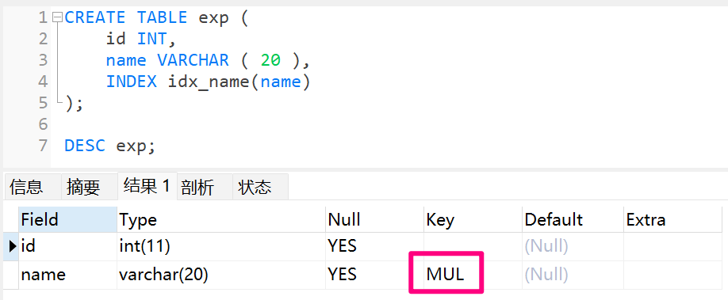

创建数据表后向表内新添加普通索引 SQL 语句示例如下：

```sql
ALTER TABLE exp ADD INDEX idx_id(id);
```

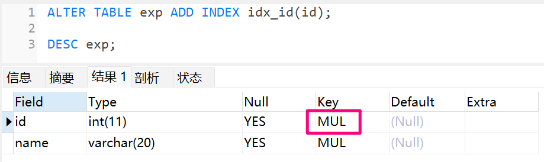

创建数据表后删除普通索引的 SQL 语句示例如下：

```sql
ALTER TABLE exp DROP INDEX idx_name;
```

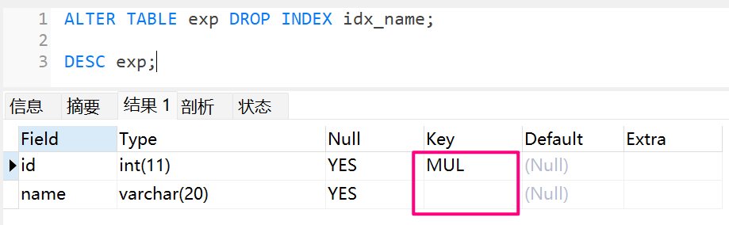

注意，在上述命令中，dix_name 是索引的名字而不是含有索引的字段的名字，如果我们忘记了该表中的索引名称，可以执行以下 SQL命令进项查询：

```sql
SHOW INDEX FROM exp;
```

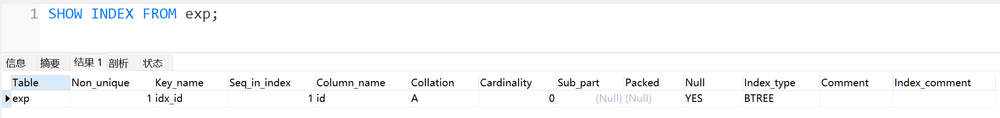

从上面几张图片可以看出，添加普通索引后，在使用 DESC 查看表结构时，会发现 Key 列上出现 MUL，这就表示该列添加了普通索引。

### 12.2.2 唯一性索引

唯一性索引，是在普通索引的基础上，要求添加该索引的列所有的值只能出现一次。唯一性索引常用于添加在诸如：身份证号、学号等字段中，不可以添加在诸如：姓名、学校等字段中。

唯一性索引的添加与普通索引几乎完全相同，只不过要把普通索引的关键字 INDEX 和 KEY 换成 `UNIQUE INDEX` 和 `UNIQUE KEY`。

在创建数据表时添加唯一性索引的 SQL 语句示例如下：

```sql
CREATE TABLE exp (
    id INT,
    name VARCHAR ( 20 ),
    UNIQUE INDEX idx_id(id)
);
```

上述命令执行结果如下：

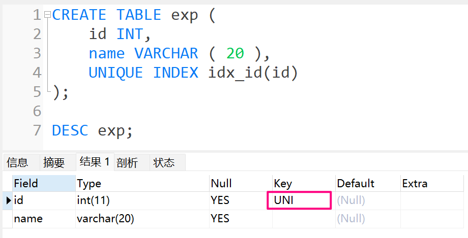

可以看出，添加唯一性索引的字段，在使用 DESC 命令查询表结构时，Key 列中会显示 UNI，表示该字段添加了唯一性索引。

在创建数据表后添加唯一性索引的 SQL 语句实例如下：

```sql
ALTER TABLE exp ADD UNIQUE INDEX idx_id(id);
```

删除唯一性索引的 SQL 语句示例如下：

```sql
ALTER TABLE exp DROP INDEX idx_id;
```

### 12.2.3 主键索引

主键索引，是数据库的所有索引中查询速度最快的，并且每个数据表只能有1个主键索引列。同时，主键索引的列，不允许出现重复的数据，也不允许为空值。

注意：主键索引，只能用 KEY，不能用 INDEX！

添加、删除主键索引与普通索引和唯一性索引非常相似，只不过将 Key 换成了 `PRIMARY KEY` 而已。相关 SQL 命令如下：

```sql
CREATE TABLE exp (
    id INT,
    name VARCHAR ( 20 ),
    PRIMARY KEY idx_id(id)
);
```

```sql
ALTER TABLE exp ADD PRIMARY KEY idx_id(id);
```

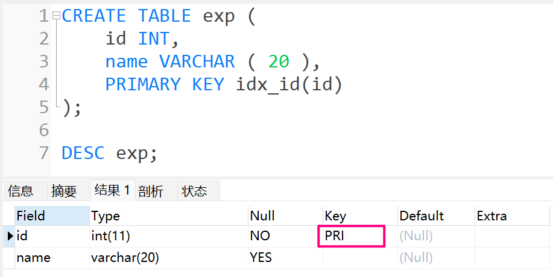

主键索引的删除可以执行命令：

```sql
ALTER TABLE exp DROP PRIMARY KEY;
```

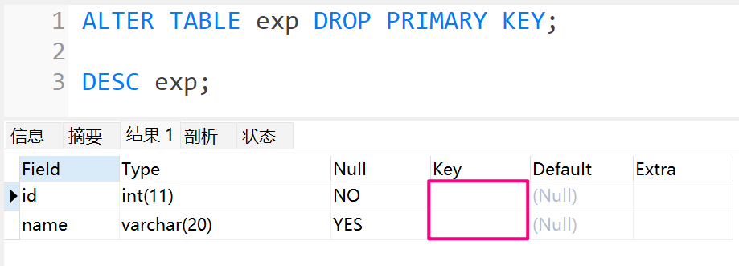

> 有时，我们在尝试删除主键索引时，MySQL 会拒绝，这可能是因为该字段添加了 AUTO_INCREMENT 属性的缘故，我们可以把该字段修饰符删除，就可以删除该字段的主键索引了。

### 12.2.4 复合索引

如果想要创建一个包含不同的列的索引，我们就可以创建复合索引。其实，复合索引在业务场景中应用的非常频繁。比如，如果我们想要记录数据包的内容，则需要将 IP 和 端口号 作为标识数据包的依据，这时就可以把 IP 地址的列和 端口号 的列创建为复合索引。

创建、添加和删除复合索引 SQL 语句示例如下：

```sql
CREATE TABLE exp (
    ip VARCHAR ( 15 ),
    port INT,
    PRIMARY KEY idx_ip_port(ip, port)
);
```

```sql
ALTER TABLE exp ADD PRIMARY KEY idx_ip_port(ip, port);
```

```sql
ALTER TABLE exp DROP PRIMARY KEY;
```

复合索引在创建后，在使用 DESC 查看数据表结构时，会在 Key 列中发现多个 PRI，这就表示这些含有 PRI 的列就是复合索引的列了。如下所示：

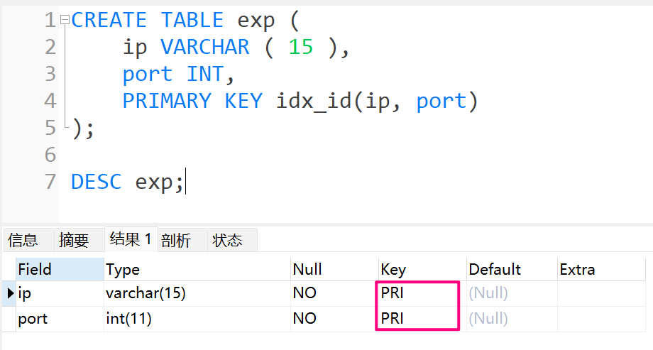

> 注意：复合索引相当于一个多列的主键索引。因此，添加复合索引的任何一个列都不允许数据为空，并且这些列不允许数据完全相同，否则 MySQL 数据库会报错。

### 12.2.5 全文索引

全文索引主要是用于解决大数据量的情况下模糊匹配的问题。如果数据库中某个字段的数据量非常大，那么如果我们想要使用 LIKE 通配符的方式进行查找，速度就会变得非常慢。针对这种情况，我们就可以使用全文索引的方式，来加快模糊查询的速度。全文索引的原理是通过分词技术，分析处文本中关键字及其出现的频率，并依次建立索引。全文索引的使用，与数据库版本、数据表引擎乃至字段类型息息相关，主要限制如下：

1. MySQL3.2 版本以后才支持全文索引
2. MySQL5.6 之前的版本，只有 MyISAM 引擎才支持全文索引
3. MySQL5.6 以后的版本，MyISAM 引擎和 InnoDB 引擎都支持全文索引
4. MySQL5.7 版本以后 MySQL 才内置 ngram 插件，全文索引才开始支持中文
5. 只有字段数据类型为 CHAR、VARCHAR、以及 TEXT 的字段才支持添加全文索引

创建、添加和删除全文索引 SQL 命令如下：

```sql
CREATE TABLE exp (
    id INT,
    content TEXT,
    FULLTEXT KEY idx_content(content)
) ENGINE = INNODB DEFAULT CHARSET = utf8;
```

```sql
ALTER TABLE exp ADD FULLTEXT INDEX idx_content(content);
```

```sql
ALTER TABLE exp DROP INDEX idx_content;
```

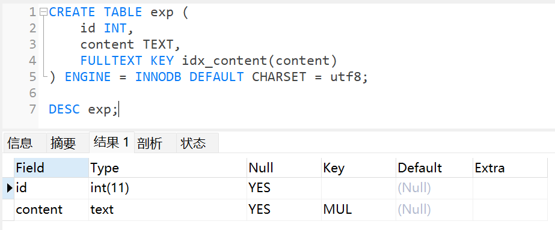

在创建了全文索引后，也不能够使用 LIKE 通配符的方式进行模糊查询，全文索引的使用有其特定的语法，如下所示：

```sql
SELECT * FROM exp WHERE MATCH(content) AGAINST ( 'a' );
```

其中，MATCH 后面的括号里是含有全文索引的字段，AGAINST 后面的括号里是要模糊匹配的内容。

> 此外，全文索引的作用并不是唯一的，在很多场景下，我们并不会使用 MySQL 数据库内置的全文索引，而是使用第三方类似的索引以实现相同的功能。

全文搜索模式：

**（1）自然语言模式（默认情况下为该模式）**

```sql
SELECT * FROM user WHERE MATCH(userName) AGAINST ( '张三' );
-- 如果最小搜索长度为 1 的话，则查找包含 张、三、张三 的记录；与布尔搜索模式中的 “+张三” 结果相同
-- 最小搜索长度在 MySQL 配置文件中设置
```

**（2）布尔搜索模式（目前了解即可，后续使用再深入研究）**

- 【+】---------- 必须包含此字符串
- 【-】---------- 必须不包含此字符串
- 【“”】-------- 双引号内作为整体不能拆词
- 【>】-------- 提高该词的相关性，查询的结果靠前
- 【<】-------- 降低该词的相关性，查询的结果靠后
- 【*】--------- 通配符，只能接在词后面
- ……

```sql
SELECT * FROM user WHERE MATCH(userName) AGAINST ( '+"美女" & +"动人"' IN BOOLEAN MODE);
-- 查询有 “美女” 的又有 “动人” 的记录
```

## 12.3 MySQL索引使用原则

1. 索引是典型的 “以空间换时间” 的策略，它会消耗计算机存储空间，但是会加快查询速度
2. 索引的添加，尽管加快了在查询时的查询速度，但是会减慢在插入、删除时的速度。因为在插入、删除数据时需要进行额外的索引更新操作
3. 索引并非越多越好，数据量不大时不需要添加索引
4. 如果一个表的值需要频繁的插入和修改，则不适合建立索引，反之如果一个表中某个字段的值要经常进行查询、排序和分组则需要建立索引
5. 如果一个字段满足建立唯一性索引的条件，就不要建立普通索引

# 十三、其它部分

> 这里只是对 MySQL 的其它知识做一个介绍，详细内容请参考其它资料。

【MySQL 存储过程和触发器】

存储过程是在数据库中定义一些 SQL 语句的集合，可以直接调用这些 “集合” 来执行已经定义好的 SQL 语句。避免了开发人员重复编写相同 SQL 语句的问题。

触发器和存储过程相似，都是嵌入到 MySQL 中的一段程序。触发器是由事件来触发某个操作，当数据库执行到这些事件时，就会激活触发器来执行相应的操作。

【MySQL 存储过程】

我们前面所学习的 MySQL 语句都是针对一个表或几个表的单条 SQL 语句，但是在数据库的实际操作中，经常会有需要多条 SQL 语句处理多个表才能完成的操作。

例如，为了确认学生能否毕业，需要同时查询学生档案表、成绩表和综合表，此时就需要使用多条 SQL 语句来针对这几个数据表完成处理要求。

存储过程是一组为了完成特定功能的 SQL 语句集合。使用存储过程的目的是将常用或复杂的工作预先用 SQL 语句写好并用一个指定名称存储起来，这个过程经编译和优化后存储在数据库服务器中，因此称为存储过程。当以后需要数据库提供与已定义好的存储过程的功能相同的服务时，只需调用 “CALL存储过程名字” 即可自动完成。

常用操作数据库的 SQL 语句在执行的时候需要先编译，然后执行。存储过程则采用另一种方式来执行 SQL 语句。

一个存储过程是一个可编程的函数，它在数据库中创建并保存，一般由 SQL 语句和一些特殊的控制结构组成。当希望在不同的应用程序或平台上执行相同的特定功能时，存储过程尤为合适。

MySQL 5.0 版本以前并不支持存储过程，这使 MySQL 在应用上大打折扣。MySQL 从 5.0 版本开始支持存储过程，既提高了数据库的处理速度，同时也提高了数据库编程的灵活性

存储过程是数据库中的一个重要功能，存储过程可以用来转换数据、数据迁移、制作报表，它类似于编程语言，一次执行成功，就可以随时被调用，完成指定的功能操作。

使用存储过程不仅可以提高数据库的访问效率，同时也可以提高数据库使用的安全性。

对于调用者来说，存储过程封装了 SQL 语句，调用者无需考虑逻辑功能的具体实现过程。只是简单调用即可，它可以被 Java 和 C# 等编程语言调用。

编写存储过程对开发者要求稍微高一些，但这并不影响存储过程的普遍使用，因为存储过程有如下优点：

- 封装性

通常完成一个逻辑功能需要多条 SQL 语句，而且各个语句之间很可能需要传递参数，其逻辑功能相对来说稍微复杂些，而存储过程可以把这些 SQL 语句包含到一个独立的单元中，使外界看不到复杂的 SQL 语句，只需要简单调用即可达到目的。并且数据库专业人员可以随时对存储过程进行修改，而不会影响到调用它的应用程序源代码。

- 可增强 SQL 语句的功能和灵活性

存储过程可以用流程控制语句编写，有很强的灵活性，可以完成复杂的判断和较复杂的运算。

- 可减少网络流量

由于存储过程是在服务器端运行的，且执行速度快，因此当客户计算机上调用该存储过程时，网络中传送的只是该调用语句，从而可降低网络负载。

- 高性能

当存储过程被成功编译后，就存储在数据库服务器里了，以后客户端可以直接调用，这样所有的 SQL 语句将从服务器执行，从而提高性能。但需要说明的是，存储过程不是越多越好，过多的使用存储过程反而影响系统性能。

- 提高数据库的安全性和数据的完整性

存储过程提高安全性的一个方案就是把它作为中间组件，存储过程里可以对某些表做相关操作，然后存储过程作为接口提供给外部程序。这样，外部程序无法直接操作数据库表，只能通过存储过程来操作对应的表，因此在一定程度上，安全性是可以得到提高的。

- 使数据独立

数据的独立可以达到解耦的效果，也就是说，程序可以调用存储过程，来替代执行多条的 SQL 语句。这种情况下，存储过程把数据同用户隔离开来，优点就是当数据表的结构改变时，调用表不用修改程序，只需要数据库管理者重新编写存储过程即可。

【MySQL 存储函数】

存储函数和存储过程一样，都是在数据库中定义一些 SQL 语句的集合。存储函数可以通过 return 语句返回函数值，主要用于计算并返回一个值。而存储过程没有直接返回值，主要用于执行操作。

> **简单区别存储过程与存储函数：**
>
> 本质上没区别，执行的本质都一样！
>
> 只是函数有如：只能返回一个变量的限制，而存储过程可以返回多个。　　
>
> 函数是可以嵌入在 sql 中使用的，可以在 select 中调用，而存储过程要让 sql 的 query 可以执行， 需要把 mysql_real_connect 的最后一个参数设置为 CLIENT_MULTI_STATEMENTS。
>
> 函数限制比较多，比如不能用临时表，只能用表变量，还有一些函数都不可用等，而存储过程的限制相对就比较少。

【MySQL 游标】

在 MySQL 中，存储过程或函数中的查询有时会返回多条记录，而使用简单的 SELECT 语句，没有办法得到第一行、下一行或前十行的数据，这时可以使用游标来逐条读取查询结果集中的记录。游标在部分资料中也被称为光标。

关系数据库管理系统实质是面向集合的，在 MySQL 中并没有一种描述表中单一记录的表达形式，除非使用 WHERE 子句来限制只有一条记录被选中。所以有时我们必须借助于游标来进行单条记录的数据处理。

一般通过游标定位到结果集的某一行进行数据修改。

> 结果集是符合 SQL 语句的所有记录的集合。

个人理解游标就是一个标识，用来标识数据取到了什么地方，如果你了解编程语言，可以把他理解成数组中的下标。

不像多数 DBMS，MySQL 游标只能用于存储过程和函数。

【MySQL 用户管理】

MySQL 是一个多用户数据库，具有功能强大的访问控制系统，可以为不同用户指定不同权限。在前面的章节中我们使用的是 root 用户，该用户是超级管理员，拥有所有权限，包括创建用户、删除用户和修改用户密码等管理权限。

为了实际项目的需要，可以创建拥有不同权限的普通用户。

> ### 一、创建用户
>
> #### 命令：
>
> ```mysql
> CREATE USER 'username'@'host' IDENTIFIED BY 'password';
> ```
>
> #### 说明：
>
> - username：你将创建的用户名
> - host：指定该用户在哪个主机上可以登陆，如果是本地用户可用 `localhost`，如果想让该用户可以从任意远程主机登陆，可以使用通配符`%`
> - password：该用户的登陆密码，密码可以为空，如果为空则该用户可以不需要密码登陆
>
> #### 例子：
>
> ```mysql
> CREATE USER 'dog'@'localhost' IDENTIFIED BY '123456';
> CREATE USER 'pig'@'192.168.1.101_' IDENDIFIED BY '123456';
> CREATE USER 'pig'@'%' IDENTIFIED BY '123456';
> CREATE USER 'pig'@'%' IDENTIFIED BY '';
> CREATE USER 'pig'@'%';
> ```
>
> ### 二、授权
>
> #### 命令：
>
> ```mysql
> GRANT privileges ON databasename.tablename TO 'username'@'host'
> ```
>
> #### 说明：
>
> - privileges：用户的操作权限，如`SELECT`，`INSERT`，`UPDATE`等，如果要授予所有的权限则使用`ALL`
> - databasename：数据库名
> - tablename：表名，如果要授予该用户对所有数据库和表的相应操作权限则可用`*`表示，如`*.*`
>
> #### 例子：
>
> ```mysql
> GRANT SELECT, INSERT ON test.user TO 'pig'@'%';
> GRANT ALL ON *.* TO 'pig'@'%';
> GRANT ALL ON maindataplus.* TO 'pig'@'%';
> ```
>
> #### 注意：
>
> 用以上命令授权的用户不能给其它用户授权，如果想让该用户可以授权，用以下命令：
>
> ```mysql
> GRANT privileges ON databasename.tablename TO 'username'@'host' WITH GRANT OPTION;
> ```
>
> ### 三、设置与更改用户密码
>
> #### 命令：
>
> ```mysql
> SET PASSWORD FOR 'username'@'host' = PASSWORD('newpassword');
> ```
>
> 如果是当前登陆用户用：
>
> ```mysql
> SET PASSWORD = PASSWORD("newpassword");
> ```
>
> > MySQL 提供的`PASSWORD()`函数会对密码进行加密。
> >
> > 注意：`PASSWORD()`加密函数已经在 8.0.11 中移除了，可以使用`MD5()`函数代替。
>
> #### 例子：
>
> ```mysql
> SET PASSWORD FOR 'pig'@'%' = PASSWORD("123456");
> ```
>
> ### 四、撤销用户权限
>
> #### 命令：
>
> ```mysql
> REVOKE privilege ON databasename.tablename FROM 'username'@'host';
> ```
>
> #### 说明：
>
> privilege，databasename，tablename：同授权部分。
>
> #### 例子：
>
> ```mysql
> REVOKE SELECT ON *.* FROM 'pig'@'%';
> ```
>
> #### 注意：
>
> 假如你在给用户`'pig'@'%'`授权的时候是这样的（或类似的）：`GRANT SELECT ON test.user TO 'pig'@'%'`，则在使用`REVOKE SELECT ON *.* FROM 'pig'@'%';`命令并不能撤销该用户对 test 数据库中 user 表的`SELECT` 操作。相反，如果授权使用的是`GRANT SELECT ON *.* TO 'pig'@'%';`则`REVOKE SELECT ON test.user FROM 'pig'@'%';`命令也不能撤销该用户对 test 数据库中 user 表的`Select`权限。
>
> 具体信息可以用命令`SHOW GRANTS FOR 'pig'@'%';` 查看。
>
> ### 五、删除用户
>
> #### 命令：
>
> ```mysql
> DROP USER 'username'@'host';
> ```

【MySQL 数据库备份与恢复】

尽管采取了一些管理措施来保证数据库的安全，但是在不确定的意外情况下，总是有可能造成数据的损失。例如，意外的停电，不小心的操作失误等都可能造成数据的丢失。

所以为了保证数据的安全，我们需要定期对数据进行备份。如果数据库中的数据出现了错误，就需要使用备份好的数据进行数据还原，这样可以将损失降至最低。

MySQL 提供了多种方法对数据进行备份和恢复。

【MySQL 日志】

任何一种数据库，都会拥有各种各样的日志，用来记录数据库的运行情况、日常操作和错误等信息，可以帮助我们诊断数据库出现的各种问题。

MySQL 也不例外，它有不同类型的日志文件，各自存储了不同类型的日志。分析这些日志文件，除了可以了解 MySQL 数据库的运行情况，还可以为 MySQL 的管理和优化提供必要的信息。

日志管理是维护数据库的重要步骤，所以经常需要在 MySQL 中进行日志启动、查看、停止和删除等操作。这些操作是数据库管理中最基本、最重要的操作。

【MySQL 性能优化】

应用开发过程中，由于初期数据量小，开发人员更重视功能上的实现，但是当应用系统正式上线后，随着生产数据量的急剧增长，数据库开始显露性能问题，对生产的影响也越来越大，因此我们必须对它们进行优化。

性能优化是通过某些有效的方法提高 MySQL 数据库的性能，比如优化查询速度、优化更新速度和优化 MySQL 服务器等，主要是为了使 MySQL 数据库运行速度更快、占用的磁盘空间更小。

数据库的性能优化需要开发者对数据库的底层原理及各种使用场景有较深入的理解和较丰富的经验，所以这里就不谈具体的优化理论及方法了。
