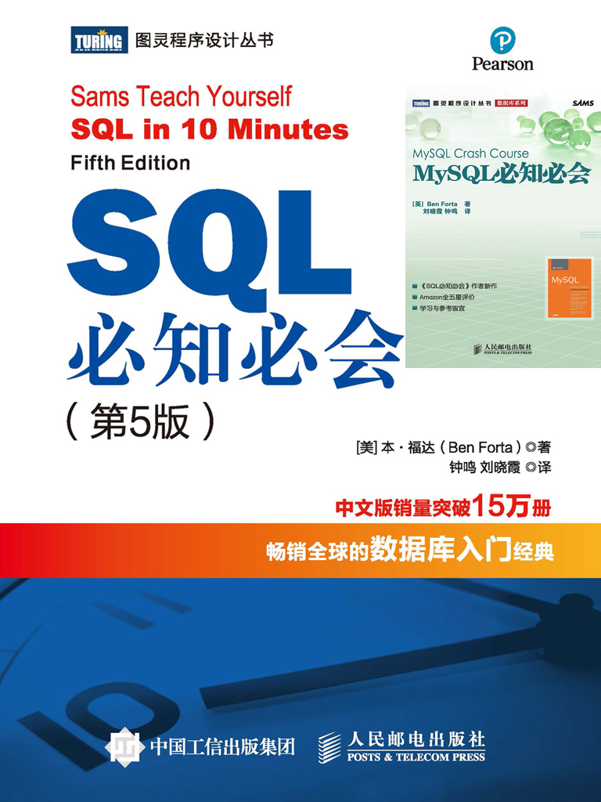

# 《SQL&MySQL必知必会》读书笔记



> 原创内容，转载请注明出处！

> DBMS 基于 MySQL 5.7

# 第1章 了解SQL

## 1.1 数据库基础

### 1.1.1 数据库

数据库（DATABASE）：一种容器，用于保存有组织的数据（通常是一个文件或一组文件）。

> 数据库 ≠ 数据库管理系统。

数据库管理系统（DBMS）：一种系统软件，用于创建和操纵数据库（DBMS 具体究竟是什么，形式如何，各种数据库都不一样）。

> 人们通常用数据库这个术语来代表他们所使用的数据库软件，这是不正确的。
>
> 我们不直接访问数据库，我们使用 DBMS，它替我们访问数据库。

### 1.1.2 表

表（TABLE）：某种特定类型数据的结构化清单（数据库中的文件）。

> 特定数据类型：一个表中所保存的数据必须是同一个类别。
>
> 重点提醒：决不应该将多个类别的数据合并存到同一个表中，这样做将使后期的检索和访问很困难。应该创建多个表，每个数据类别放在一个表中。

> 结构化清单：通俗的理解，结构化就是一张二维表（Excle）。

表名：表的名字，用于在同一数据库中唯一标识自己。

> 唯一性：在同一数据库中，每个表只有唯一一个名字标识自己。

> 表名的唯一性取决于多个因素，一般来说为：数据库名 + 表名，这也是为什么不同的数据库内允许相同表名的表存在且不冲突的原因。
>
> 很多人也习惯将表名取为：数据库名前缀_表名。

### 1.1.3 模式

模式（SCHEMA）：关于数据库和表的布局及特性的信息。

> 简单的理解模式：描述表的一组信息（模式可以用来描述数据库中特定的表以及整个数据库其中表之间的关系）。

> 模式的举例：数据在表中如何存储、表中可以存储什么样的数据、数据如何分解、各部分信息如何命名、表之间如何关联，等等。

> 模式和数据库的区别：大多数情况下，模式与数据库是同义词。在大多数 DBMS 中，创建数据库与创建模式是相同的效果。

### 1.1.4 列

列（COLUMN）：表由列组成，所有表都是由一个或多个列组成。

> 字段：列也称为字段。

> 分解数据：合理地将数据分解为多个列极为重要！
>
> 合理地把数据按类型分解为若干个列，才可能利用特定的列对数据进行排序和过滤。否则在后期会很麻烦，并且性能也会低下。

### 1.1.5 数据类型

数据类型（DATATYPE）：所容许的数据类型。每个表列都有相应的数据类型，它限制（或容许）该列中存储的数据。

> 数据类型的限制除了优化表的结构外，还帮助正确地排序数据（如果所有数据作为串处理，则1位于10之前，而10又位于2之前，即：串以字典顺序排序，从左边开始比较，一次一个字符），并在优化磁盘使用方面起重要的作用（可以用一种比文本串更简洁的格式存储数值和日期时间值）。
>
> 因此，在创建表时必须对数据类型给予特别的关注。

### 1.1.6 MySQL数据类型

> 注意：此处所列出的 MySQL 数据类型并不完整与全面，相关详细知识请查阅完整文档。

**（1）串数据类型**

两种基本的串类型：定长串、变长串。

- 定长串：接受长度固定的字符串，其长度是在创建表时指定的。
- 变长串：存储可变长度的文本，有些变长数据类型具有最大的定长（不管是哪一种，只有指定的数据得到保存，额外的数据不保存）。

> 既然变长数据类型这样灵活，为什么还要使用定长数据类型？
>
> 回答是因为性能。MySQL 处理定长列远比处理变长列快得多。此外，MySQL 不允许对变长列（或一个列的可变部分）进行索引。这也会极大地影响性能。

| 数据类型     | 说明                                                         |
| ------------ | ------------------------------------------------------------ |
| `CHAR`       | 1~255 个字符的定长串。它的长度必须在创建时指定，否则 MySQL 假定为 CHAR(1) |
| `ENUM`       | 接受最多 64K 个串组成的一个预定义集合的某个串                |
| `LONGTEXT`   | 与 TEXT 相同，但最大长度为 4GB                               |
| `MEDIUMTEXT` | 与 TEXT 相同，但最大长度为 16K                               |
| `SET`        | 接受最多 64 个串组成的一个预定义集合的零个或多个串           |
| `TEXT`       | 最大长度为 64K 的变长文本                                    |
| `TINYTEXT`   | 与 TEXT 相同，但最大长度为 255 字节                          |
| `VARCHAR`    | 长度可变，最多不超过 255 字节。如果在创建时指定为 VARCHAR(n)，则可存储 0 到 n 个字符的变长串（其中 n <= 255） |

> 使用引号：不管使用何种形式的串数据类型，串值都必须括在引号内（通常单引号更好）。

> 当数值不是数值时：我们应该将电话号码、邮政编码之类的数据存储到串中，而不是数据类型中。
>
> 原因有：
>
> 一、如果在数值字段中存储邮政编码 01234，则保存的将是 1234，实际上丢失了一位数字。
>
> 二、电话号码、邮政编码是固定的，不需要进行加减乘除等计算，保存为串类型更为安全合理。

**（2）数值数据类型**

两种基本的数值数据类型：有符号、无符号。

- 有符号：可以存储正或负的数值。
- 无符号：只能存储正数。

> 所有数值类型（除 BIT 和 BOOLEAN 外）都可以有符号或无符号。
>
> 默认情况为有符号，但如果你知道自己不需要存储负值，可以使用 `UNSIGNED` 关键字，这样做将允许你存储两倍大小的值。

| 数据类型            | 说明                                                         |
| ------------------- | ------------------------------------------------------------ |
| `BIT`               | 位字段，1~64 位（在 MySQL 5 之前，BIT 在功能上等价于 TINYINT）。 |
| `BIGINT`            | 整数值，支持 -9223372036854775808~9223372036854775807（如果是 UNSIGNED，为 0~18446744073709551615）的数。 |
| `BOOLEAN（或BOOL）` | 布尔标志，或者为 0，或者为 1，主要用于开/关（on/off）标志。  |
| `DECIMAL（或DEC）`  | 精度可变的浮点值。                                           |
| `DOUBLE`            | 双精度浮点值                                                 |
| `FLOAT`             | 单精度浮点值                                                 |
| `INT（或INTEGER）`  | 整数值，支持 -2147483648~2147483647（如果是 UNSIGNED，为 0~4294967295）的数 |
| `MEDIUMINT`         | 整数值，支持 -8388608~8388607（如果是 UNSIGNED，为 0~16777215）的数 |
| `REAL`              | 4 字节的浮点值                                               |
| `SMALLINT`          | 整数值，支持 -32768~32767（如果是 UNSIGNED，为 0~65535）的数 |
| `TINYINT`           | 整数值，支持 -128~127（如果为 UNSIGNED，为 0~255）的数       |

> 不使用引号：与串不一样，数值不应该括在引号内。

> 存储货币数据类型：MySQL 中没有专门存储货币的数据类型，一般情况下使用 DECIMAL(8, 2)。

**（3）日期和时间数据类型**

MySQL 使用专门的数据类型来存储日期和时间值。

| 数据类型    | 说明                                                         |
| ----------- | ------------------------------------------------------------ |
| `DATE`      | 表示 1000-01-01~9999-12-31 的日期，格式为 YYYY-MM-DD         |
| `DATETIME`  | DATE 和 TIME 的组合                                          |
| `TIMESTAMP` | 功能和 DATETIME 相同（但范围较小）                           |
| `TIME`      | 格式为 HH:MM:SS                                              |
| `YEAR`      | 用 2 位数字表示，范围是 70（1970年）~  69（2069年），用 4 位数字表示，范围是 1901 年~2155年 |

**（4）二进制数据类型**

 二进制数据类型可存储任何数据（甚至包括二进制信息），如图像、多媒体、字处理文档等。

| 数据类型     | 说明                     |
| ------------ | ------------------------ |
| `BLOB`       | Blob 最大长度为 64KB     |
| `MEDIUMBLOB` | Blob 最大长度为 16MB     |
| `LONGBLOB`   | Blob 最大长度为 4GB      |
| `TINYBLOB`   | Blob 最大长度为 255 字节 |

### 1.1.7 行

行（ROW）：表中的一个记录。

> 是记录（RECORD）还是行（ROW）？
>
> 在很大程度上，这两个术语是可以互相替代的，但从技术上说，行才是正确的术语。

### 1.1.8 主键

主键（PRIMARY KEY）：一列（或一组列），其值能够唯一区分表中每个行。

> 主码：主码就是主键。

没有主键，更新或删除表中特定行会很困难，因为没有安全的方法保证只涉及相关的行。

> 应该总是定义主键：虽然并不总是都需要主键，但大多数数据库设计人员都应该保证他们创建的每个表具有一个主键，以便于以后的数据操纵和管理。

表中的任何列都可以作为主键，只要它满足以下条件：

- 任何两行都不具有相同的主键值
- 每个行都必须具有一个主键值（主键列不允许 NULL 值）

> 主键值规则：这里列出的规则是 MySQL 本身强制实施的。

主键通常定义在表的一列上，但这并不是必需的，也可以一起使用多个列作为主键。在使用多列作为主键时，上述条件必须应用到构成主键的所有列，所有列值组合必须是唯一的（但单个列的值可以不唯一）。

> 主键的最好习惯：除 MySQL 强制实施的规则外，应该坚持的几个普遍认可的最好的习惯为：
>
> - 不更新主键列中的值
> - 不重用主键列的值
> - 不在主键列中使用可能会更改的值（例如：如果使用一个名字作为主键，那么名字在后期有需要更改的可能性）

### 1.1.9 外键

外键（FOREIGN KEY）：某个表中的一列，它包含另一个表的主键值，定义了两个表之间的关系。

> 外码：外码就是外键。

> 外键要么为 NULL，要么为关联表的主键值。

> 定义外键的优点：
>
> - 信息不重复，从而不浪费时间和空间
> - 如果相应的数据变动，只需要更新所关联表中的单个记录，本表中的数据不用改动
> - 由于数据无重复，显然数据是一致的，这使得处理数据更简单
>
> - 数据更安全，存储到外键字段中的数据必需依据于所关联表列的具体数据，可以有效避免非法数据的录入
> - 表更安全，相互关联的表之间，假如要删除一个表，需要先解除其中的相关性，这使得非法的表删除会被有效阻止，一定程度上保证了表的安全性

通过在表中指定主键和外键来维护引用完整性，可极大地提高数据库的可伸缩性！

引用完整性：参照完整性（Referential Integrity）引用完整性指被引用表中的主关键字和引用表中的外部主关键字之间的关系。

可伸缩性（SCALE）：能够适应不断增加的工作量而不失败。

### 1.1.10 数据完整性

> 以下内容来源于 CSDN 博主：moxiaomo0804

（1）域完整性

是指一个列的输入有效性，是否允许为空值。强制域完整性的方法有：限制类型（通过设定列的数据类型）、格式（通过 CHECK 约束和规则）或可能值的范围（通过 FOREIGN KEY 约束、CHECK 约束、DEFAULT 定义、NOT NULL 定义和规则）。如：学生的考试成绩必须在 0～100 之间，性别只能是 “男” 或 “女”。

（2）实体完整性

是指保证表中所有的行唯一。实体完整性要求表中的所有行都有一个唯一标识符。这个唯一标识符可能是一列，也可能是几列的组合，称为主键。也就是说，表中的主键在所有行上必须取唯一值。强制实体完整性的方法有：索引、UNIQUE 约束、PRIMARY KEY 约束或 IDENTITY 属性。如：student 表中 sno（学号）的取值必须唯一，它唯一标识了相应记录所代表的学生，学号重复是非法的。学生的姓名不能作为主键，因为完全可能存在两个学生同名同姓的情况。

（3）参照完整性

是指保证主关键字（被引用表）和外部关键字（引用表）之间的参照关系。它涉及两个或两个以上表数据的一致性维护。外键值将引用表中包含此外键的记录和被引用表中主键与外键相匹配的记录关联起来。在输入、更改或删除记录时，参照完整性保持表之间已定义的关系，确保键值在所有表中一致。这样的一致性要求确保不会引用不存在的值，如果键值更改了，那么在整个数据库中，对该键值的所有引用要进行一致的更改。参照完整性是基于外键与主键之间的关系。例如学生学习课程的课程号必须是有效的课程号，score 表（成绩表）的外键 cno（课程号）将参考 course 表（课程表）中主键 cno（课程号）以实现数据完整性。

域完整性、实体完整性及参照完整性分别在列、行、表上实施。数据完整性任何时候都可以实施，但对已有数据的表实施数据完整性时，系统要先检查表中的数据是否满足所实施的完整性，只有表中的数据满足了所实施的完整性，数据完整性才能实施成功。

## 1.2 什么是SQL

SQL：结构化查询语言（Structured Query Language）。

SQL 是一种专门用来与数据库通信的语言。

> SQL 的优点：
>
> - 几乎所有的 DBMS 都支持 SQL
> - SQL 简单易学
> - SQL 非常灵活，可以进行非常复杂和高级的数据库操作

> DBMS 专用的 SQL：
>
> SQL 不是一种专利语言，而是存在一个标准委员会（ANSI），他们试图定义可供所有 DBMS 使用的 SQL 语法，也称为：ANSI SQL。
>
> 所有主要的 DBMS，即使有自己的扩展，也都支持 ANSI SQL。
>
> 本文档是专门针对 MySQL 的，虽然大多数语法也适用于其他 DBMS，但不要认为这些 SQL 语法是完全可移植的。

# 第2章 MySQL简介

## 2.1 什么是MySQL

MySQL 是一种 DBMS，即它是一种数据库软件。

MySQL 目前得到广泛运用的原因：

- 成本：MySQL 是开源的，一般可以免费使用（甚至可以免费修改）
- 性能：MySQL 执行很快（非常快）
- 体积：MySQL 体积很小（非常小）
- 简单：MySQL 很容易安装和使用
- 可靠性：某些非常重要和声望很高的公司、站点使用 MySQL，这些公司和站点都用 MySQL 来处理自己的重要数据

### 2.1.1 客户机——服务器软件

DBMS 可分为两类：

**（一）基于共享文件系统的 DBMS**

用于桌面用途，通常不用于高端或更关键的应用。

例如：Microsoft Access 和 FileMaker。

**（二）基于客户机——服务器的 DBMS**

客户机——服务器应用分为两个不同的部分：

客户机部分是负责与用户打交道的软件。（这个部分运行在具体的用户计算机应用程序上）。

服务器部分是负责所有数据访问和处理的一个软件（这个软件运行在称为数据库服务器的计算机上）。

> 客户机和服务器软件可能安装在两台计算机或一台计算机上。不管它们在不在相同的计算机上，为进行所有数据库交互，客户机软件都要与服务器软件进行通信。

> 所有的活动对用户都是透明的（用户不必要在乎内部实现的细节）。
>
> 事实上，多数网络的建立使用户不具有对数据的访问权，甚至不具有对存储数据的驱动器的访问权。

> 因为使用了 MySQL，我们需要访问运行 MySQL 服务器软件的计算机和发布命令到 MySQL 的客户机软件的计算机。
>
> - 服务器软件为 MySQL DBMS。可以在本地安装的副本上运行，也可以连接到运行在具有访问权的远程服务器上的一个副本。
> - 客户机可以是 MySQL 提供的工具、脚本语言（如：Python）、Web 应用开发语言（如：PHP、Node.js)、程序设计语言（如：Java、Go、C++）等。

### 2.1.2 MySQL版本

本文档在 MySQL 5.7 版本下通过测试，同时该版本也是到目前为止实际开发中最为常见的版本。

## 2.2 MySQL工具

如前所述，MySQL 是一个客户机——服务器 DBMS，因此，为了使用 MySQL，需要有一个客户机，即你需要用来与 MySQL 打交道（给 MySQL 提供要执行命令）的一个应用。

### 2.2.1 MySQL命令行实用程序

每个 MySQL 安装都有一个名为 mysql 的简单命令行实用程序。这个实用程序没有下拉菜单、流行的用户界面、鼠标支持或任何类似的东西。

在操作系统命令提示符下输入 mysql 便会打开此实用程序。

> mysql 选项和参数：如果仅输入 mysql，可能会出现一个错误消息。因为可能需要安全证书，或者是因为 mysql 没有运行在本地或默认端口上（没有配置 path 环境变量）。mysql 接受你可以（和可能需要）使用的一组命令行参数。例如：为了指定用户登录名 ben，应该使用 mysql -u ben。为了给出用户名、主机名、端口号、用户名和口令，应该使用：mysql [-h localhost -P 3306] -u ben -p（对于本机可以省略 [] 中的内容）。
>
> 完整的命令行选项和参数列表可使用 mysql --help 获得。

当然，具体版本和连接信息可能不同，但都可以使用这个实用程序。请注意：

- 命令输入在 `mysql>` 之后
- 命令用 `;` 或 `\g` 结束，换句话说，仅按 <kbd>Enter</kbd> 不执行命令
- 输入 `help` 或 `\h` 获得帮助，也可以输入更多的文本获得特定命令的帮助（如：输入 help select 获得使用 SELECT 语句的帮助）
- 输入 `quit` 或 `exit` 退出命令行实用程序

> mysql 命令行实用程序是使用最多的实用程序之一，它对于快速测试和执行脚本非常有价值。
>
> 即使我们选择后面即将介绍的某款图形工具，也应该保证熟悉 mysql 命令行实用程序，因为它是可以安全地依靠的一个总是会被给出的客户机（因为它是核心 MySQL 安装的一部分）。

### 2.2.2 MySQL图形化交互程序

> 以下软件均为收费软件，请科学使用：)

- SQLyog：[官网地址](https://webyog.com/product/sqlyog)
- Navicat：[官网地址](http://www.navicat.com.cn/)
- DataGrip：[官网地址](https://www.jetbrains.com/zh-cn/datagrip/)

# 第3章 使用MySQL

## 3.1 连接

MySQL 在能执行命令之前必需要登录到 DBMS。

MySQL 在内部保存自己的用户列表，并且把每个用户与各种权限关联起来。

首先我们需要启动 MySQL 的服务：`net start mysql`。

在首次安装 MySQL 时，要求输入一个管理登录（通常为 root）和一个口令（通常默认为 空）。

> 假如密码不为空，那么可以打开 MySQL 安装目录：
>
> - 在安装包根目录下新建 `my.ini` MySQL 配置文件
> - 编辑 `my.ini` 文件，注意根据安装包位置替换路径
>
> ```ini
> CODE
> [mysqld]
> basedir=D:\Application\MySQL\mysql-5.7.24\
> datadir=D:\Application\MySQL\mysql-5.7.24\data\	
> port=3306
> skip-grant-tables	 #跳过密码验证
> ```

`mysql -u root -p`、回车、密码为空、回车。

（以上命令全写：`mysql -h localhost -P 3306 -u root -p`）

首次进入之后可以通过以下方法重设密码：

```mysql
update mysql.user set authentication_string=password('123456') where user='root' and Host='localhost';
```

最后输入 `flush privileges;` 刷新权限。

> 此处以 root 用户和 123456 密码为例。

> 有必要的情况下：
>
> - 删除 `my.ini` 文件最后一句 `skip-grant-tables`
> - 重启 MySQL 即可正常使用 `net stop mysql`、`net start mysql`

在实际团队开发中，管理登录受到密切保护（因为对它的访问授予了创建表、删除整个数据库、更改登录和口令等完全的权限）。

> 总结，为了连接到 MySQL，需要以下信息：
>
> - 主机名（计算机名）—— 如果连接到本地 MySQL 服务器，为 localhost;
> - 端口（如果使用的是默认端口 3306 之外的其他端口）
> - 一个合法的用户名
> - 用户口令（如果需要）

## 3.2 选择数据库

`USE 数据库名`：选择某个数据库。

例如：`USE course;`。

## 3.3 了解数据库和表

`SELECT VERSION();`：查看 MySQL 版本。

`SHOW DATABASES;`：列出并显示所有的数据库。

`SHOW TABLES;`：列出并显示一个数据库中所有的表。

`SHOW TABLES FROM 数据库名`：在不切换当前数据库的前提下，查看另一个数据库的表。

`SHOW COLUMNS FROM 表名`：显示一个表的详细信息（如：字段名、数据类型、是否允许 NULL、键信息、默认值以及其他信息）。例如：`SHOW COLUMNS FROM customers;`。

`DESCRIBE 表名`：在 MySQL 中提供的一种 “SHOW COLUMNS FROM 表名” 的快捷方式。

`DESC 表名`："DESCRIBE 表名" 的缩写。

`SELECT DATABASE();`：查看当前所在的数据库。

所支持的其他 SHOW 语句还有：

- `SHOW STATUS`：用于显示广泛的服务器状态相信
- `SHOW CREATE DATABASE` 和 `SHOW CREATE TABLE`：分别用来显示创建特定数据库或表的 MySQL 语句
- `SHOW GRANTS`：用来显示授予用户（所有用户或特定用户）的安全权限
- `SHOW ERRORS` 和 `SHOW WARNINGS`：用来显示服务器错误或警告消息

> 进一步了解 SHOW：请执行命令 `HELP SHOW;`。

# 附：SQL练习

```sql
-- 
-- 第2课 检索数据 SELECT FROM
-- 

SELECT prod_name
FROM products;

SELECT prod_id, prod_name, prod_price
FROM Products;

SELECT *
FROM Products;

SELECT DISTINCT vend_id
FROM Products;
-- 注意：DISTINCT 作用与后面的所有列

SELECT prod_name
FROM Products
LIMIT 5 OFFSET 5;
-- LIMIT 行数 OFFSET 起始行（0开始）

SELECT prod_name
FROM Products
LIMIT 3,4;
-- LIMIT 起始行，行数

-- 这个注释大家都支持
# 这个不一定啦
/* 这个大家也都支持 */ 


-- 
-- 第3课 排序检索数据 ORDER BY
-- 

SELECT prod_name
FROM Products
ORDER BY prod_name;
-- 以字母顺序排列数据，数字在前，字母在后
-- ORDER BY 子句必须放在 SELECT 语句的末尾
-- ORDER BY 也可以用于非显示列对其他列来排序
-- 如：SELECT prod_name
-- 		 FROM Products
-- 		 ORDER BY prod_price;

SELECT prod_id, prod_price, prod_name
FROM Products
ORDER BY prod_price, prod_name;
-- 对多个列排序，先按价格，再按名称
-- 注意：如果价格相同，才会按名称，否则排了价格之后就不考虑名称了

SELECT prod_id, prod_price, prod_name
FROM products
ORDER BY 2, 3;
-- 2, 3表示先按 prod_id, prod_price, prod_name 中的第二列来排序，再按照第三列来排序

SELECT prod_id, prod_price, prod_name
FROM products
ORDER BY prod_price DESC;
-- ORDER BY 默认：ASC升序，A到Z，可指定或不指定
-- DESC降序，Z到A，必须指定
-- DESC只对直接位于其前面的列名有用，如果想在多个列上进行降序排序，必须对每一列后指定DESC关键字


-- 
-- 第4课 过滤数据 WHERE
-- 

SELECT prod_name, prod_price
FROM Products
WHERE prod_price = 3.49;
 
-- = <> != < <= !< > >= !> BETWEEN IS NULL

SELECT prod_name, prod_price
FROM products
WHERE prod_price < 10;

SELECT prod_name, prod_price
FROM products
WHERE prod_price <= 10;

SELECT vend_id, prod_name
FROM products
WHERE vend_id <> 'DLL01';
-- ''用于限定字符串

SELECT prod_name, prod_price
FROM products
WHERE prod_price BETWEEN 5 AND 10;
-- 注意：[5,10]

SELECT prod_name
FROM products
WHERE prod_price IS NULL;

SELECT cust_name
FROM Customers
WHERE cust_email IS NULL;


-- 
-- 第5课 高级数据过滤 AND OR IN NOT
-- 

SELECT prod_id, prod_price, prod_name
FROM products
WHERE vend_id = 'DLL01' AND prod_price <= 4;
-- 注意：每一个条件都要加上 AND

SELECT prod_id, prod_price, prod_name
FROM products
WHERE vend_id = 'DLL01' OR vend_id = 'BRS01';

-- 注意：SQL在处理OR之前，优先处理AND操作符
-- 解决优先级，请多使用()

SELECT prod_name, prod_price
FROM Products
WHERE vend_id IN ('DLL01', 'BRS01')
ORDER BY prod_name;
-- IN 完成了与 OR 相同的效果，但 IN 更加直观
-- IN 后的列表一定要用()括起来
-- IN 比 OR 的性能要更好
-- IN 的最大的优势在于可以包含其他的 SELECT 语句

-- NOT 用来否定其后条件的关键字
SELECT prod_name
FROM products
WHERE NOT vend_id = 'DLL01'
ORDER BY prod_name;

SELECT prod_name
FROM products
WHERE NOT vend_id <> 'DLL01'
ORDER BY prod_name;
-- 此处<>与NOT的意义相同，但是在复杂的情况下NOT有许多的优势，比如与IN结合的时候


-- 
-- 第6课 用通配符进行过滤 LIKE % _
-- 

-- % 任何字符出现任何次数，注意：0次也可以！但是%不能匹配NULL
SELECT prod_id, prod_name
FROM products
WHERE prod_name LIKE 'Fish%';

SELECT prod_id, prod_name
FROM products
WHERE prod_name LIKE '%bean bag%';

SELECT prod_name
FROM products
WHERE prod_name LIKE 'F%y';

-- _ 匹配单个字符
SELECT prod_id, prod_name
FROM Products
WHERE prod_name LIKE '__ inch teddy bear';
-- 注意：与%可以匹配0个字符不同，_总是只能刚好匹配一个字符，不能多也不能少
-- 所以，8 inch teddy bear 就无法匹配


-- 
-- 第7课 创建计算字段 Concat
-- 
SELECT Concat(vend_name, ' (', vend_country, ')')
FROM vendors
ORDER BY vend_name;

-- RTRIM()去掉字符串右边的空格，LTRIM()去掉字符串左边的空格， TRIM()去掉字符串左右两边的空格


-- AS 用于设置别名
SELECT Concat(RTRIM(vend_name), ' (', RTRIM(vend_country), ')') AS vend_title
FROM vendors
ORDER BY vend_name;  

SELECT prod_id, quantity, item_price, quantity*item_price AS expande_price
FROM orderitems
WHERE order_num = 20008;


-- 
-- 第8课 使用函数处理数据
-- 

-- RTRIM()去掉字符串右边的空格，LTRIM()去掉字符串左边的空格， TRIM()去掉字符串左右两边的空格

SELECT vend_name, UPPER(vend_name) AS vend_name_upcase
FROM Vendors
ORDER BY vend_name;
-- UPPER()将字符串转换为大写

SELECT vend_name, LOWER(vend_name) AS vend_name_upcase
FROM Vendors
ORDER BY vend_name;
-- LOWER()将字符串转换为小写

SELECT vend_name, LENGTH(vend_name) AS vend_name_upcase
FROM Vendors
ORDER BY vend_name;
-- LENGTH()返回字符串的长度

SELECT vend_name, LEFT(vend_name,3) AS vend_name_upcase
FROM Vendors
ORDER BY vend_name;
-- LEFT(,n)返回字符串左边的n个字符

SELECT vend_name, RIGHT(vend_name,3) AS vend_name_upcase
FROM Vendors
ORDER BY vend_name;
-- RIGHT(,n)返回字符串右边的n个字符

SELECT vend_name, SUBSTRING(vend_name,3) AS vend_name_upcase
FROM Vendors
ORDER BY vend_name;

SELECT vend_name, SUBSTRING(vend_name,3,2) AS vend_name_upcase
FROM Vendors
ORDER BY vend_name;

-- SUBSTRING（被截取字段，从第几位开始截取）
-- SUBSTRING（被截取字段，从第几位开始截取，截取长度）
-- （注：如果位数是负数 如-5 则是从后倒数位数，到字符串结束或截取的长度）

SELECT order_date
FROM Orders
WHERE YEAR(order_date) = 2020;
-- YEAR()从日期中提取年份

SELECT order_date
FROM Orders
WHERE MONTH(order_date) = 2;
-- MONTH()从日期中提取月份

SELECT order_date
FROM Orders
WHERE DAY(order_date) = 3;
-- DAY()从日期中提取天份

-- ABS()绝对值
-- PI()圆周率
-- EXP()指数值
-- SQRT()平方根


-- 
-- 第9课 汇总函数 AVG() COUNT() MAX() MIN() SUM()
-- 

-- AVG() 平均值函数
SELECT AVG(prod_price) AS avg_price
FROM Products;

SELECT AVG(prod_price) AS avg_price
FROM Products
WHERE vend_id = 'DLL01';
-- AVG()只能用来确定特定数值列的平均值，而且列名必须作为函数参数给出
-- AVG()函数忽略列值为NULL的行

-- COUNT() 确定表中行的数目或符合特定条件的行的数目
SELECT COUNT(*) AS num_cust
FROM Customers;
-- 使用COUNT(*)对表中行的数目进行计数，不管表列中包含的是空值(NULL)还是非空值

SELECT COUNT(cust_email) AS num_cust
FROM customers;
-- 即：若指定列名，则COUNT()会忽略指定列的值为NULL的行，但如果COUNT()函数中用的是*，则不忽略

-- MAX()返回指定列中的最大值，要求必须指定列名
SELECT MAX(prod_price) AS max_price
FROM products;
-- 在用于文本数据时，MAX()返回按该列排序后的最后一行
-- MAX()函数忽略列值为NULL的行

-- MIN()返回指定列中的最小值，要求必须指定列名
SELECT MIN(prod_price) AS max_price
FROM products;
-- 在用于文本数据时，MIN()返回按该列排序后的最前一行
-- MIN()函数忽略列值为NULL的行

-- SUM()函数用来返回指定列值的和（总计）
SELECT SUM(quantity) AS items_ordered
FROM orderitems
WHERE order_num = 20005;

-- SUM()也可以用来合计计算值
SELECT SUM(item_price * quantity) AS total_price
FROM orderitems
WHERE order_num = 20005;
-- SUM()忽略列值为NULL的行

-- 聚集不同值
-- ALL默认，对所有行执行计算
-- DISTINCT，只包含不同的值
SELECT AVG(DISTINCT prod_price) AS avg_price
FROM products
WHERE vend_id = 'DLL01';
-- DISTINCT 不能用于 COUNT(*)

-- 组合聚集函数
SELECT COUNT(*) AS num_items,
	MIN(prod_price) AS price_min,
	MAX(prod_price) AS price_max,
	AVG(prod_price) AS price_avg
FROM products;
-- 使用SQL支持的函数很高效，其返回结果一般比在客服端程序中计算要快


-- 
-- 第10课 分组数据 GROUP BY
--
 
-- 分组可以将数据分为多个逻辑组，对每个组进行聚集计算
SELECT vend_id, COUNT(*) AS num_prods
FROM products
GROUP BY vend_id;
-- GROUP BY 子句必须出现在WHERE子句之后，ORDER BY子句之前
-- 一般来说，GROUP BY 后出现的列或表达式也是在 SELECT 后出现的，不出现也不会报错，但是不符合分组的逻辑
-- GROUP BY 子句可以包含任意数目的列，因而可以对分组进行嵌套，更细致地进行数据分组
-- 如果在 GROUP BY 子句中嵌套分组，数据将在最后指定的分组上进行汇总
-- GROUP BY 子句中列出的每一列都必须是检索列或有效的表达式（但不能是聚集函数）。如果在 SELECT 中使用表达式，则必须在 GROUP BY 子句中指定相同的表达式。不能使用别名
-- 如果分组列中包含具有 NULL 值的行，则 NULL 将作为一个分组返回。如果列中有多行 NULL 值，则 NULL 将作为一个分组返回。如果列中有多行 NULL 值，它们将分为一组

SELECT vend_id, COUNT(*) AS num_prods
FROM products
GROUP BY 1;
-- 可以根据SELECT列表中的位置指定GROUP BY的列

-- 对分组进行过滤不能使用WHERE，因为WHERE过滤的是指定的行而不是分组，所以对分组的过滤须要利用HAVING
-- 即：WHERE过滤行，HAVING过滤分组
SELECT cust_id, COUNT(*) AS orders
FROM orders
GROUP BY cust_id
HAVING COUNT(*) >= 2;
-- WHERE在数据分组前进行过滤，HAVING在数据分组后进行过滤

-- HAVING和WHERE也有同时存在的情况
SELECT vend_id, COUNT(*) AS num_prods
FROM products
WHERE prod_price >= 4
GROUP BY vend_id
HAVING COUNT(*) >= 2;

-- 注意：HAVING 和 WHERE 非常类似，如果不指定 GROUP BY，则大多数 DBMS 会同等对待他们。不过不建议这么做

-- GROUP BY 与 ORDER BY的使用
SELECT order_num, COUNT(*) AS items
FROM OrderItems
GROUP BY order_num
HAVING COUNT(*) >= 3
ORDER BY items, order_num;

-- SELECT子句的顺序：SELECT | FROM | WHERE | GROUP BY | HAVING | ORDER BY


-- 
-- 第11课 使用子查询
-- 

SELECT cust_name, cust_contact
FROM Customers
WHERE cust_id IN (SELECT cust_id
					FROM orders
					WHERE order_num IN (SELECT order_num
										FROM orderitems
										WHERE prod_id = 'RGAN01'));
-- 注意：子查询的性能并不高，所以最好不要嵌套3层以上的子查询
-- 作为子查询的 SELECT 语句只能查询单个列，企图检索多了列将返回错误

-- 作为计算字段使用子查询
SELECT cust_name, cust_state, (SELECT COUNT(*)
								FROM orders
								WHERE Orders.cust_id = Customers.cust_id) AS orders
FROM Customers
ORDER BY cust_name;
-- 其中：orders是一个计算字段
--  表.列 为完全限定名，使用完全限定名可以避免歧义


-- 
-- 第12课 联结表
-- 

-- 联结是一种机制，用来在一条SELECT语句中关联表
SELECT vend_name, prod_name, prod_price
FROM Vendors, Products
WHERE Vendors.vend_id = Products.vend_id;

-- WHERE在联结中是非常重要的，如果没有WHERE子句，那么多个表中的每一行都将一一配对，而不管它们在逻辑上是否能配在一起。
-- 没有联结条件的表关系返回的结果为笛卡尔积。检索出的行的数目将是第一个表中的行数乘以第二个表中的行数。
SELECT vend_name, prod_name, prod_price
FROM Vendors, Products;

-- 内联结(等值联结)的另一种写法
SELECT vend_name, prod_name, prod_price
FROM Vendors
INNER JOIN Products ON Vendors.vend_id = Products.vend_id;
-- 这里，两个表之间的关系是以 INNER JOIN 指定的部分 FROM 子句，在使用这种语法时，联结条件用特定的ON子句而不是WHERE子句给出，传递给ON的实际条件与传递给WHERE的相同

-- 联结多个表
SELECT prod_name, vend_name, prod_price, quantity
FROM orderitems, products, vendors
WHERE products.vend_id = vendors.vend_id
AND orderitems.prod_id = products.prod_id
AND order_num = 20007;
-- 注意联结是比较耗费资源的，不要联结不必要的表，联结的表越多，性能下降越厉害

SELECT cust_name, cust_contact
FROM Customers, Orders, orderitems
WHERE customers.cust_id = Orders.cust_id
AND orderitems.order_num = Orders.order_num
AND prod_id = 'RGAN01';


-- 
-- 第13课 创建高级联结
-- 

-- 使用表别名
SELECT cust_name, cust_contact
FROM customers AS C, orders AS O, orderitems AS OI
WHERE C.cust_id = O.cust_id
AND OI.order_num = O.order_num
AND prod_id = 'RGAN01';
-- 注意：表别名不但可以用于WHERE，还能用于SELECT、ORDER BY子句以及其他语言部分
-- 需要强调：表别名只在查询执行中使用，与列别名不一样，表别名不返回到客服端

-- 使用表别名的一个主要原因是能够在一条 SELECT 语句中不止一次引用相同的表
-- 查询Jim Jones同一个公司的所有顾客
SELECT c1.cust_id, c1.cust_name, c1.cust_contact
FROM customers AS c1, customers AS c2
WHERE c1.cust_name = c2.cust_name AND c2.cust_contact = 'Jim Jones';

-- 多用自然联结而不用子查询，因为前者的性能一般来说要更好

-- 标准的联结返回所有的数据，相同的列甚至多次出现；自然联结排除多次出现，使每一列只返回一次。

-- 一般通过对一个表使用通配符(SELECT *),而对其他表的列使用明确的子集来完成。
SELECT c.*, o.order_num, o.order_date
FROM customers AS C, orders AS O, orderitems AS OI
WHERE C.cust_id = O.cust_id
AND OI.order_num = O.order_num
AND prod_id = 'RGAN01';

-- 自然联结将多个表中相关的行相关联，但有时候需要包含没有关联行的那些行，此时就就需要利用到外连接

-- 检索所有顾客及其订单
SELECT customers.cust_id, Orders.order_num
FROM customers
INNER JOIN Orders ON Customers.cust_id = Orders.cust_id;
-- 1000000001	20005
-- 1000000001	20009
-- 1000000003	20006
-- 1000000004	20007
-- 1000000005	20008

-- 与内联结关联两个表中的行不同的是，外联结还包括没有关联的行的行。
-- 在使用 OUTER JOIN 语法时，必须使用 RIGHT 或 LEFT 关键字指定包括其所有行的表

-- 检索包括没有订单顾客在内的所有顾客
-- 左外联结(连customers)
SELECT customers.cust_id, orders.order_num
FROM customers
LEFT OUTER JOIN orders ON customers.cust_id = orders.cust_id;
-- 1000000001	20005
-- 1000000001	20009
-- 1000000002	
-- 1000000003	20006
-- 1000000004	20007
-- 1000000005	20008

-- 右外联结(orders)
SELECT customers.cust_id, orders.order_num
FROM customers
RIGHT OUTER JOIN orders ON customers.cust_id = orders.cust_id;
-- 1000000001	20005
-- 1000000001	20009
-- 1000000003	20006
-- 1000000004	20007
-- 1000000005	20008

-- 使用带聚集函数的联结
SELECT customers.cust_id, COUNT(orders.order_num) AS num_ord
FROM customers
INNER JOIN Orders ON customers.cust_id = Orders.cust_id
GROUP BY Customers.cust_id;

SELECT customers.cust_id, COUNT(Orders.order_num) AS num_ord
FROM customers
LEFT OUTER JOIN Orders ON customers.cust_id = Orders.cust_id
GROUP BY customers.cust_id;


-- 
-- 第14课 组合查询
-- 

-- SQL允许执行多个查询（多条SELECT语句），并将结果作为一个查询结果集返回
-- 这些组合查询通常称为 并 或 复合查询

-- 使用 UNION 很简单，所要做的只是给出每条 SELECT 语句，在各条语句之间放上关键字 UNION

SELECT cust_name, cust_contact, cust_email
FROM customers
WHERE cust_state IN ('IL', 'IN', 'MI')
UNION
SELECT cust_name, cust_contact, cust_email
FROM customers
WHERE cust_name = 'Fun4All';

-- 注意：UNION 必须由两条或两条以上的 SELECT 语句组成，语句之间都要用关键字 UNION 分隔 
-- UNION 中的每个查询都必须包含相同的列、表达式或聚集函数，不过各个列不需要以相同的次序列出
-- 列数据类型必须兼容，至少要可以隐含转换                                             
-- UNION 使用的SELECT语句遇到不同的列名，那么会一第一个为准，当然会有一个副作用，那就是排序也必须以这个列名

-- UNION 会默认合并重复的行，当然可以用 UNION ALL 来列出匹配的所有行
SELECT cust_name, cust_contact, cust_email
FROM customers
WHERE cust_state IN ('IL', 'IN', 'MI')
UNION ALL
SELECT cust_name, cust_contact, cust_email
FROM customers
WHERE cust_name = 'Fun4All';

-- 对组合查询结果排序
-- 在使用 UNION 组合查询时，只能使用一条 ORDER BY 子句，并且次语句只能放在最后一条SELECT语句之后
SELECT cust_name, cust_contact, cust_email
FROM customers
WHERE cust_state IN ('IL', 'IN', 'MI')
UNION
SELECT cust_name, cust_contact, cust_email
FROM customers
WHERE cust_name = 'Fun4All'
ORDER BY cust_name, cust_contact;
```

