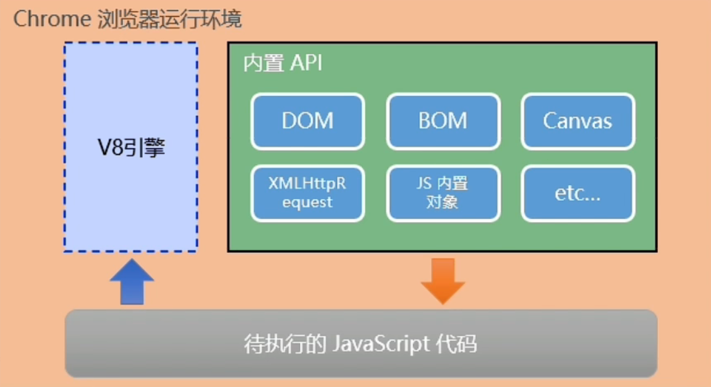
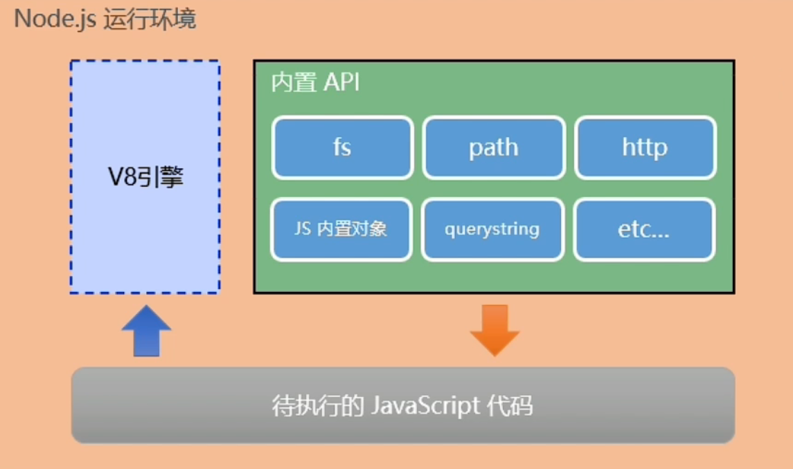

# 【初始 Node.js】

> 原创内容，转载请注明出处！

# 一、思考

思考：为什么 JavaScript 可以在浏览器中被执行？

答：依靠 JavaScript 解析引擎

- Chrome：V8

- Firefox：OdinMonkey（奥丁猴）
- Safari：JSCore
- IE：Chakra（IE 已经淘汰，微软最新的 Edge 浏览器使用 V8）

> Chrome 浏览器的 V8 解析引擎是目前世界上性能最好的 JS 解析引擎！

---

思考：为什么 JavaScript 可以操作 DOM 和 BOM？

答：每个浏览器都内置了 DOM、BOM 相关的 API 接口函数，因此，浏览器中的 JavaScript 才能调用它们。

---

思考：浏览器中的 JavaScript 的运行环境是什么？

> 运行环境：代码正常运行所需的必要条件。



- V8 引擎负责解析和执行 JavaScript 代码
- 内置 API 是由运行环境提供的特殊接口，只能在所属的运行环境中被调用

---

思考：JavaScript 是否能做后端开发？

答：JavaScript 代码可以依靠 Node.js 运行环境进行后端开发。

# 二、Node.js简介

## 2.1 什么是Node.js？

Node.js 是一个基于 Chrome V8 引擎的 JavaScript 运行环境。

> 注意：虽然 Chrome 浏览器以及 Node.js 都是基于 V8 引擎的，但是在浏览器中的 V8 是面向前端开发，而在 Node.js 中的 V8 是面向后端开发。

Node.js 的官网地址：https://nodejs.org/zh-cn/

Node.js 中文资料：http://nodejs.cn/

## 2.2 Node.js中的JavaScript运行环境



- 浏览器是 JavaScript 的前端运行环境
- Node.js 是 JavaScript 的后端运行环境
- Node.js 中无法调用 DOM、BOM 等浏览器内置的 API

## 2.3 Node.js可以做什么？

Node.js 作为一个独立于浏览器的 JS 运行环境，仅仅提供了基础的功能和 API。然而基于 Node.js 提供的这些基础，很多强大的工具和框架如雨后春笋，层出不穷，所以学会了 Node.js，可以让前端程序员具备全栈开发能力：

- 基于 Express/Koa 框架，可以快速构建 Web 应用
- 基于 Electron 框架，可以构建跨平台的桌面应用
- 基于 restify 框架，可以快速构建 RESTful 风格的 API 接口项目
- 读写和操作数据库
- 创建实用的命令行工具辅助前端开发（例如 Webpack Vite）
- ……

## 2.4 Node.js怎么学

浏览器中的 JavaScript 学习路径：

JavaScript 基础语法 + 浏览器内置 API（DOM + BOM）+ 第三方库（jQuery、art-template 等）

Node.js 的学习路径：

JavaScript 基础语法 + Node.js 内置 API 模块（fs、path、http 等）+ 第三方 API 模块（express、mysql 等）

## 2.5 Node.js优势

**对于前端生态的贡献：**

Node.js 是前端生态众多工具的基础，例如 Webpack、Vite 都是基于 Node.js 来打造的！所以 Node.js 对于前端工程化意义非凡！

**对于后端开发的优势：**

Node.js 是 JS 语言的运行时，而 JS 是一门单线程语言！并且 JS 利用 “事件循环+任务队列” 的方式，实现了：单线程下的异步编程！且该异步具有 “非阻塞” 的特点！简而言之，Node.js 开发的项目具有 “异步非阻塞” 的重大优势！不同于 Java 之类的多线程语言，它们实现异步编程的方式是通过创建多个线程从而实现 “多线程异步”，而 ”单线程异步“ 比 ”多线程异步“ 的优势在于：计算机不用考虑线程的切换和同步等问题，所以能利用更少的计算机硬件资源处理更多的任务！并且 ”非阻塞“ 的优势还能避免线程上任务耗时久带来的阻塞问题！也就是说，Node.js 开发的后端项目具有天生的 ”高并发“ 特点！

值得注意的是：Node.js 的 “单线程异步非阻塞” 也不是万能的，它比较适合 “IO密集型” 的项目，例如：API 接口项目（大部分时间都是在处理网络IO/文件IO/读写数据库等）。但是对于 “CPU密集型” 的项目，Node.js 就不行了，例如：涉及大量 图像/视频转码、加密解密 等功能的项目，原因是 JS 是单线程的，它只能调用单个线程来工作，而不能充分利用 CPU 空闲的资源，所以对于 CPU 计算密集的项目，Node.js 就 “吃不消”！相反的，像 C/C++ Java 这类多线程语言来说，CPU 密集型项目却是他们比较擅长的地方！当然，也不是说只要遇到 CPU 计算那么就不能用 Node.js，对于不是特别密集的 CPU 计算还是可以用 Node.js 的，并且 Node.js 可以通过子进程的方式去调用 CPU 的空闲能力，可以把 Node.js CPU 计算密集的代码部分单独开多个子进程来进行处理即可！或者，直接在一台服务器上运行多个 Node.js 项目，一个项目负责 IO，另外项目的负责 CPU，那么也能解决大部分的 CPU 计算密集型问题！当然，在实际项目中，单纯用 Node.js 来解决 IO+CPU 是比较少的情况，一般遇到涉及一定的 CPU 密集的项目，通常 IO 由 Node.js 来负责，而 CPU 计算用另外的语言（比如：C/C++ Java）来负责更为妥当！比如：网络请求过来后先进入 Node.js，然后遇到 CPU 计算的部分，Node.js 再请求用 C/C++ Java 编写的计算代码的接口，然后当计算结果出来后再返回给 Node.js，然后 Node.js 再返回给客户端/浏览器。

> 注意：JS 是单线程的！但是 Node.js 不是单线程的！Node.js 是 JS 的运行环境，与 JS 不是一个层面的东西！许多人之所以误解 Node.js 是单线程的，那是因为我们基于 Node.js 编写的 JS 代码是单线程运行的！所以会误以为 Node.js 也是单线程的！这里一定要注意！

# 三、Node.js环境的安装

Node.js 官网：https://nodejs.org/zh-cn/

点击绿色按钮进行下载，下载后打开安装包，默认下一步安装（对于这类基础环境推荐安装路径默认 C 盘）。


> 区分 LTS 版本和 Current 版本的不同
>
> - LTS 为长期稳定版，对于追求稳定性的企业级项目来说，推荐安装 LTS 版本的 Node.js
> - Current 为新特性尝鲜版，对于热衷于尝试新特性的用户来说，推荐安装 Current 版本的 Node.js。但是，Current 版本中可能存在隐藏的 Bug 或安全性漏洞，因此不推荐在企业级项目中使用 Current 版本的 Node.js

查看已安装的 Node.js 的版本号：终端中输入 `node -v`，如果命令能够成功识别就证明 Node.js 已经安装成功。

如果无法识别 `node` 命令，那么请在环境变量 Path 中添加 Node.js 安装包的根路径后再次尝试。

利用 Node.js 执行 JavaScript 脚本：

```javascript
// hello.js
console.log('Hello Node.js');
```

在 hello.js 文件所在路径下打开终端执行命令：`node hello.js`，控制台成功输出 **Hello Node.js** 即为成功。

> 如果 `.js` 文件不在终端所处的当前路径下，那么执行命令中需要带上文件路径：`node ..\code\hello.js`。

> 终端使用技巧：
>
> - 使用 `↑` 键，可以快速定位到上一次执行的命令
> - 使用 `tab` 键，能够快速补全路径
> - 使用 `esc` 键，能够快速清空当前已输入的命令（Linux、MacOS 中为：`ctrl + u`）
> - 输入 `cls` 命令，可以清空终端（Linux、MacOS 中为：`clear`）
