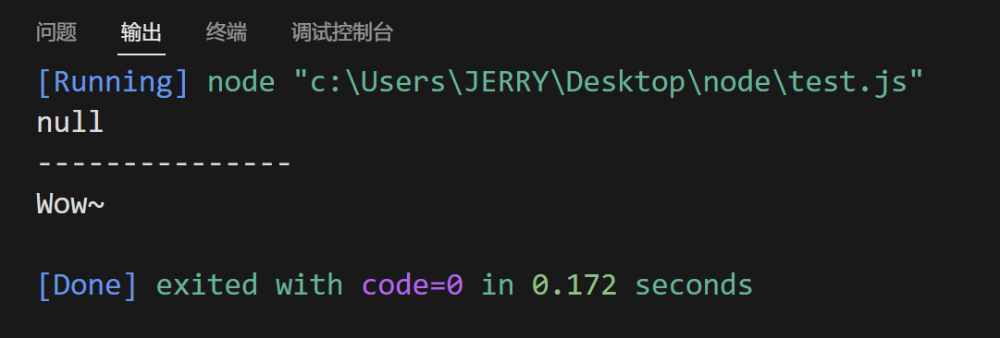
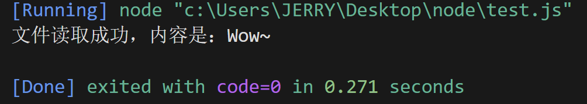
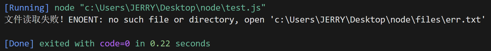
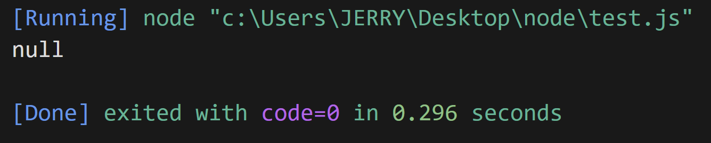
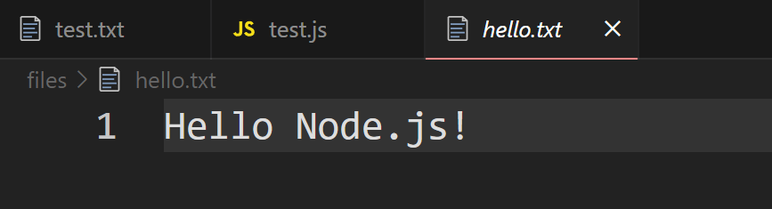
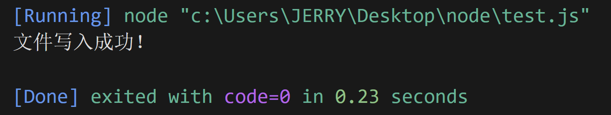
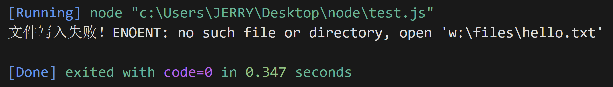
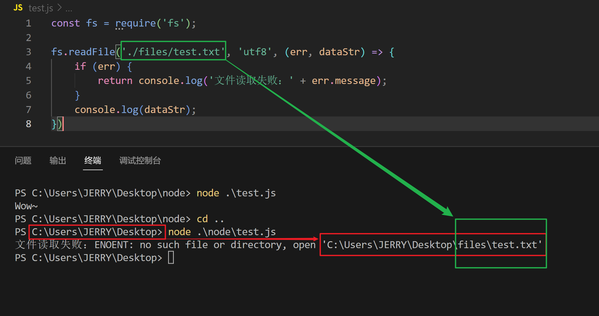
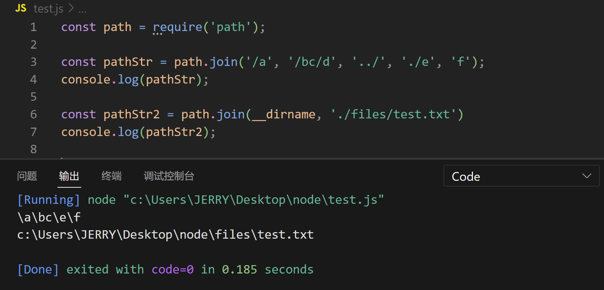
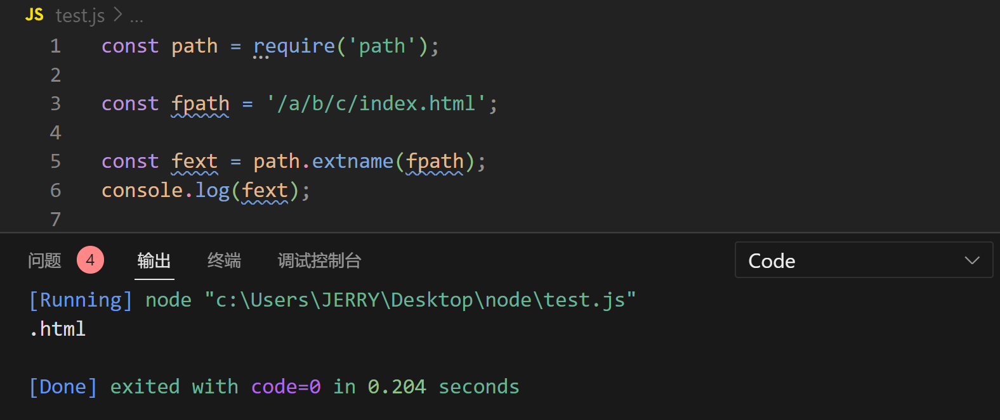

# 【fs文件系统模块】

> 原创内容，转载请注明出处！

# 一、什么是fs文件系统模块

fs 模块是 Node.js 官方提供的，用来操作文件的模块。它提供了一系列的方法和属性，用来满足用户对文件的操作需求。

例如：

- `fs.readFile()` 方法，用来读取指定文件中的内容
- `fs.writeFile()` 方法，用来向指定的文件中写入内容

如果要在 JavaScript 代码中，使用 fs 模块来操作文件，则需要使用如下的方式先导入它：

> 注意：Node.js 默认使用 CommonJS 模块化的方式，不过目前新版本的 Node.js 也提供了 ES6 模块化的方式。

```javascript
// fs 模块是 Node.js 自带的，无需下载，直接引入即可！
const fs = require('fs');
```

# 二、读取指定文件中的内容

## 2.1 fs.readFile()的语法格式

使用 `fs.readFile()` 方法，可以读取指定文件中的内容，语法格式如下：

```javascript
fs.readFile(path[, options], callback);
```

参数解读：

- 参数1：必选参数，字符串，表示文件的路径
- 参数2：可选参数，表示以什么样的编码格式来读取文件，默认值是 null（如果未指定字符编码，则返回原始的 buffer）
- 参数3：必选参数，文件读取完成后，通过回调函数拿到读取的结果并执行代码逻辑

## 2.2 fs.readFile()的示例代码

以 UTF-8 的编码格式为例，读取指定文件的内容，并打印 err 和 dataStr 的值：

```javascript
const fs = require('fs');

fs.readFile('文件路径', 'utf8', function(err, dataStr) {
    console.log(err);
    console.log('---------------');
    console.log(dataStr);
});
```

正式测试：

在 `./files/` 目录下有一个 `test.txt` 文件，内容为：`Wow~`。

代码：

```javascript
// 导入 fs 模块来操作文件
const fs = require('fs');

// 调用 fs.readFile() 方法读取文件
// 参数1：待读取文件的存放路径
// 参数2：读取文件时采用的编码格式，一般默认指定 utf8
// 参数3：回调函数，拿到读取失败和成功的结果 err dataStr
fs.readFile('./files/test.txt', 'utf8', (err, dataStr) => {
    // 如果读取成功，则 err 的值为 null
    // 如果读取失败，则 err 的值为错误对象，dataStr 的值为 undefined
    // 失败时，打印失败的结果：
    console.log(err);
    console.log('---------------');
    // 成功时，打印成功的结果：
    console.log(dataStr);
});
```

运行结果：



如果，我们将路径故意修改错误：`./files/err.txt`，再次运行：


err 不再是 `null`，而是错误信息：no such file or directory（没有这样的文件或目录）。

## 2.3 判断文件是否读取成功

方法：通过判断 err 对象是否为 `null`，从而判断文件是否读取成功。

```javascript
const fs = require('fs');

fs.readFile('./files/test.txt', 'utf8', (err, result) => {
    if (err) {
        return console.log('文件读取失败！' + err.message);
    }
    console.log('文件读取成功，内容是：' + result);
});
```

成功时：



失败时（err.txt 文件不存在）：



# 三、向指定的文件中写入内容

## 3.1 fs.writeFile()的语法格式

使用 `fs.writeFile()` 方法，可以向指定的文件中写入内容，语法格式如下：

```javascript
fs.writeFile(file, data[, options], callback);
```

参数解读：

- 参数1：必选参数，需要指定一个文件路径的字符串，表示文件的存放路径
- 参数2：必选参数，表示要写入的内容
- 参数3：可选参数，表示以什么编码格式写入文件内容，默认值是 utf8
- 参数4：必选参数，文件写入完成后的回调函数

> 注意：
>
> - `fs.writeFile()` 方法写入时可以创建文件，但不能凭空创建路径！
> - `fs.writeFile()` 方法多次对同一文件进行写入，后写入的会覆盖先写入的！

## 3.2 fs.writeFile()的实例代码

向指定的文件路径中，写入文件内容：

```javascript
const fs = require('fs');

fs.writeFile('文件路径', 'XXXXXXXXXX', function(err) {
    console.log(err);
});
```

向指定的文件路径中，写入 “Hello Node.js” 文件内容：

```javascript
const fs = require('fs');

fs.writeFile('./files/hello.txt', 'Hello Node.js!', err => {
    // 如果文件写入成功，则 err 的值为 null
    // 如果文件写入失败，则 err 的值为一个 错误对象
    console.log(err);
})
```

运行结果：





## 3.3 判断文件是否写入成功

方法：通过判断 err 对象是否为 `null`，从而判断文件是否写入成功。

```javascript
const fs = require('fs');

fs.writeFile('./files/hello.txt', 'Hello Node.js!', err => {
    if (err) {
        return console.log('文件写入失败！' + err.message);
    }
    console.log('文件写入成功！');
});
```

成功时：



失败时（路径不存在，电脑上没有 w 盘符）：



# 四、练习：考试成绩整理

要求：使用 fs 文件系统模块，将素材目录下 `成绩.txt` 文件中的考试数据，整理到 `成绩-ok.txt` 文件中。

整理前：

```txt
小红=99 小白=100 小黄=70 小黑=66 小绿=88
```

整理后：

```txt
小红：99
小白：100
小黄：70
小黑：66
小绿：88
```

实现步骤：

- 导入需要的 fs 文件系统模块
- 使用 fs.readFile() 方法，读取素材目录下的 成绩.txt 文件
- 判断文件是否读取失败
- 文件读取成功后，处理成绩数据
- 将处理完成的成绩数据，调用 fs.writeFile() 方法，写入到新文件 成绩-ok.txt 中
- 判断文件是否写入成功

实现代码：

```javascript
const fs = require('fs');

// 调用 fs.readFile() 方法，读取成绩数据
fs.readFile('./files/成绩.txt', 'utf8', (err, dataStr) => {
    if (err) {
        return console.log('文件读取失败：' + err.message);
    }

    // 将成绩数据按照空格进行分割
    const arrOld = dataStr.split(' ');

    // 循环分割后的数组，对每一项数据进行字符串的替换操作
    const arrNew = [];
    arrOld.forEach(item => {
        arrNew.push(item.replace('=', '：'));
    });

    // 把新数组中的每一项进行合并，得到一个新的字符串
    const newStr = arrNew.join('\r\n');

    // 调用 fs.writeFile() 方法，把处理完的成绩数据，写入到新文件中
    fs.writeFile('./files/成绩-ok.txt', newStr, err => {
        if (err) {
            return console.log('文件写入失败：' + err.message);
        }
        console.log('文件写入成功！');
    });
});
```

# 五、路径动态拼接问题

在使用 fs 模块操作文件时，如果提供的操作路径是以 `./` 或 `../` 开头的相对路径时，很容易出现路径动态拼接错误的问题。

原因：代码在运行的时候，会以执行 node 命令时所处的目录，动态拼接出被操作文件的完整路径。



解决方案：在使用 fs 模块操作文件时，直接提供完整的路径（绝对路径），从而防止路径动态拼接的问题，但是这样的解决方案存在非常大的缺陷，因为一但文件代码的路径发生变动，或者项目在文件结构不同的机器中进行了迁移，那么这个绝对路径就会立马失效，所以这不是一个好的解决办法。

Node.js 提供的解决方案：`__dirname`。

`__dirname`：总是指向被执行 js 文件的绝对路径（即：当前文件所处绝对路径）。

```javascript
const fs = require('fs');

fs.readFile(__dirname + '/files/test.txt', 'utf8', (err, dataStr) => {
    if (err) {
        return console.log('文件读取失败：' + err.message);
    }
    console.log(dataStr);
});
```

 # 六、path路径模块

## 6.1 什么是path路径模块

path 模块是 Node.js 官方提供的、用来处理路径的模块。它提供了一系列的方法和属性，用来满足用户对路径的处理需求。

例如：

- `path.join()` 方法，用来将多个路径片段拼接成一个完成的路径字符串
- `path.basename()` 方法，用来从路径字符串中，将文件名解析出来
- `path.extname()` 方法，用来从路径字符串中，将文件扩展名解析出来

如果要在 JavaScirpt 代码中，使用 path 模块来处理路径，则需要使用如下的方式先导入它：

```javascript
// path 模块是 Node.js 自带的，无需下载，即可引入使用！
const path = require('path');
```

## 6.2 路径拼接

`path.join()` 的语法格式：

使用 `path.join()` 方法，可以把多个路径片段拼接为完整的路径字符串，语法格式如下：

```javascript
path.join([...paths])
```

参数解读：

- ...paths：字符串，路径片段序列
- 返回值：字符串，合成路径

代码示例：

```javascript
const path = require('path');

const pathStr = path.join('/a', '/bc/d', '../', './e', 'f');
console.log(pathStr);

const pathStr2 = path.join(__dirname, './files/test.txt')
console.log(pathStr2);
```

运行结果：



> 注意：今后凡是涉及到路径拼接的操作，都应该使用 `path.join()` 方法进行处理，不要直接使用字符串拼接！

 ## 6.3 获取路径中的文件名

`path.basename()` 的语法格式：

使用 `path.basename()` 方法，可以获取路径中的最后一部分，经常通过这个方法获取路径中的文件名，语法格式如下：

```javascript
path.basename(path[, ext])
```

参数解读：

- path：字符串【必选参数】，表示一个路径的字符串
- ext：字符串【可选参数】，表示文件扩展名
- 返回值：字符串，表示路径中的最后一部分（通常是用来返回文件名）

代码示例：

```javascript
const path = require('path');

const fpath = '/a/b/c/index.html';

let fullName = path.basename(fpath);
console.log(fullName);

let nameWithoutExt = path.basename(fpath, '.html');
console.log(nameWithoutExt);
```

运行结果：


## 6.4 获取路径中的文件扩展名

`path.extname()` 的语法格式：

使用 `path.extname()` 方法，可以获取路径中的文件扩展名部分，语法格式如下：

```javascript
path.extname(path);
```

参数解读：

- path：字符串【必选参数】，表示一个路径的字符串
- 返回值：字符串，返回得到的扩展名字符串

代码示例：

```javascript
const path = require('path');

const fpath = '/a/b/c/index.html';

const fext = path.extname(fpath);
console.log(fext);
```

运行结果：



