# 【模块化】

> 原创内容，转载请注明出处！

# 一、模块化的基本概念

## 1.1 什么是模块化

模块化是指解决一个复杂问题时，自顶向下逐层把系统划分成若干模块的过程。对于整个系统来说，模块是可组合、分解和更换的单元。

## 1.2 编程领域中的模块化

编程领域中的模块化，就是遵守固定的规则，把一个大文件拆成独立并互相依赖的多个小模块。

把代码进行模块化拆分的好处：

- 提高了代码的复用性
- 提高了代码的可维护性
- 可以实现按需加载

## 1.3 模块化规范

模块化规范就是对代码进行模块化的拆分与组合时，需要遵守的那些规则。

例如：

- 使用什么样的语法格式来引用模块
- 在模块中使用什么样的语法格式向外暴露成员

模块化规范的好处：大家都遵守同样的模块化规范写代码，降低了沟通的成本，极大方便了各个模块之间的相互调用，利己利人。

# 二、Node.js中的模块化

> Node.js 默认采用 CommonJS 模块化，当然新版的 Node.js 也提供了 ES6 的模块化！

## 2.1 Node.js中模块的分类

Node.js 中根据模块来源不同，将模块分为了 3 大类，分别是：

- 内置模块（内置模块是由 Node.js 官方提供的，例如 fs、path、http 等）
- 自定义模块（用户创建的每个独立的 .js 文件，都可以看作是一个自定义模块）
- 第三方模块（由第三方开发出来的模块，并非官方提供的内置模块，也不是用户创建的自定义模块，使用前需要下载）

## 2.2 加载模块

使用强大的 `require()` 方法，可以加载需要的内置模块、用户自定义模块、第三方模块进行使用。

例如：

```javascript
// 加载内置的 fs 模块
const fs = require('fs');

// 加载用户自定义模块（需要带上路径，.js后缀可带可不带）
// const custom = require('./custom');
const custom = require('./custom.js');

// 加载第三方模块（关于第三方模块的下载和使用，会在后面进行专门的讲解）
const moment = require('moment');
```

注意：使用 `require()` 方法加载模块的一瞬间，会立即执行被加载模块中的代码！

## 2.3 Node.js中的模块作用域

**什么是模块作用域？**

和函数作用域类似，在自定义模块中定义的变量、方法等成员，只能在所在的模块内被访问，这种模块级别的访问限制，叫作模块作用域。

**模块作用域的好处：防止了全局变量污染的问题！**

## 2.4 向外共享模块作用域中的成员

**【module 对象】**

在每个自定义模块中都有一个 module 对象，它里面存储了和当前模块有关的信息，打印如下：

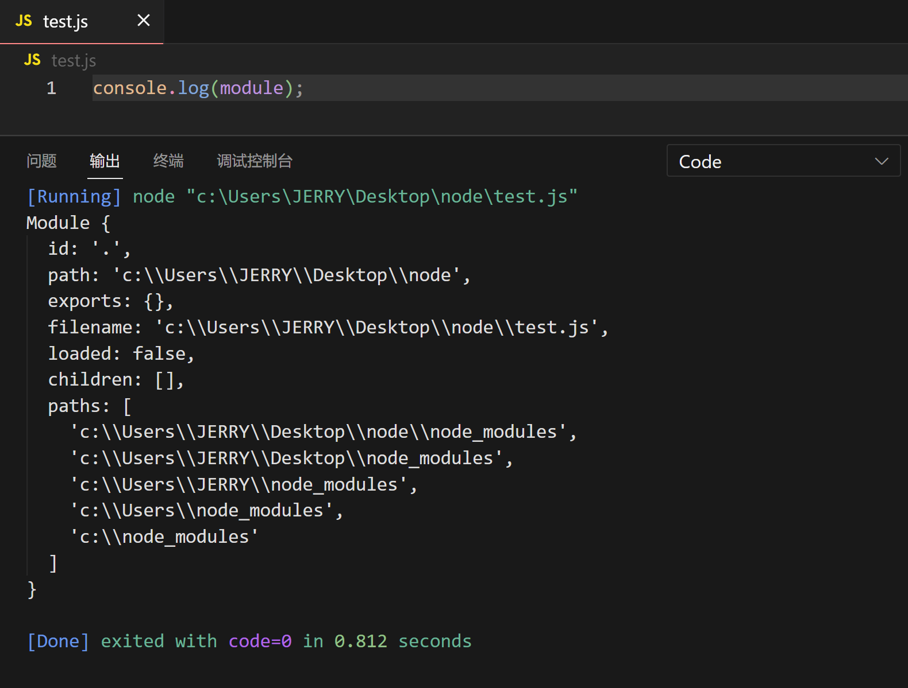

其中 module 对象中的 exports 默认是一个空对象`{}`。

**【module.exports 对象】**

外界用 `require()` 方法导入自定义模块时，得到的就是 module.exports 所指向的对象，默认为 `{}`。

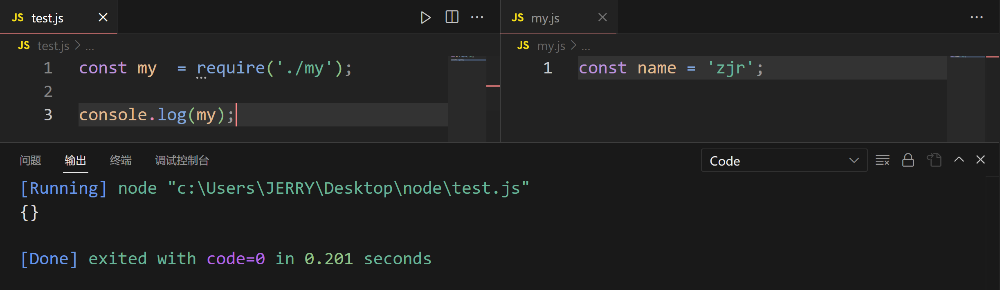

在自定义模块中，我们可以使用 `module.exports` 对象，将模块内的成员共享出去，供外界使用。

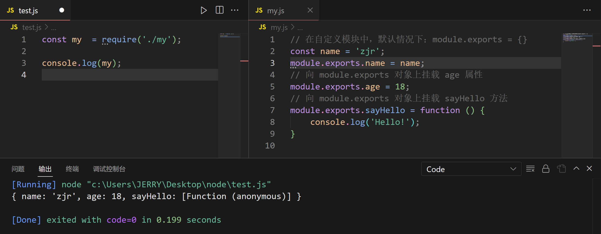

共享成员时的注意点：

使用 `require()` 方法导入模块时，导入的结果，永远以 module.exports 指向的对象为准！

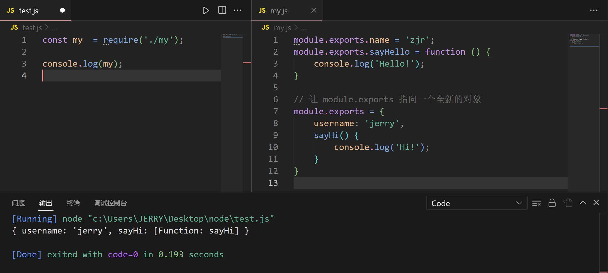

**【exports 对象】**

由于 module.exports 单词写起来比较复杂，为了简化向外共享成员的代码，Node 提供了 exports 对象。

默认情况下，exports 和 module.exports 指向同一个对象。最终共享的结果，还是以 module.exports 指向的对象为准。

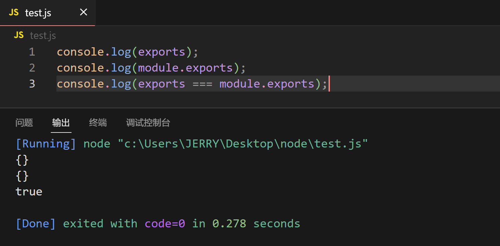

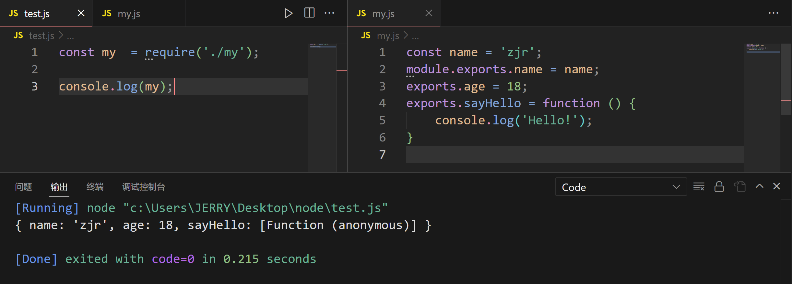

**【exports 和 module.exports 的使用注意】**

时刻谨记，`require()` 导入模块时，得到的永远是 module.exports 指向的对象：

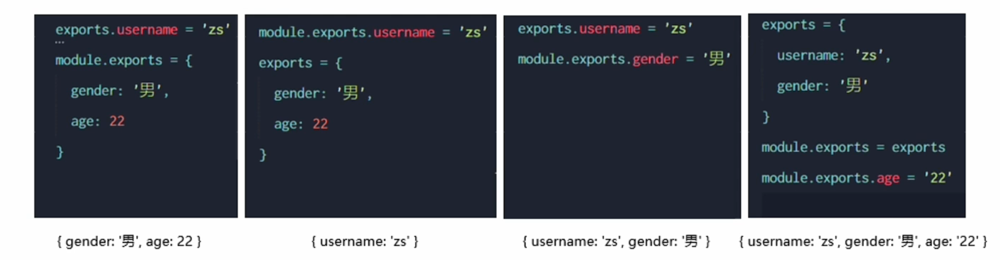

情况一：

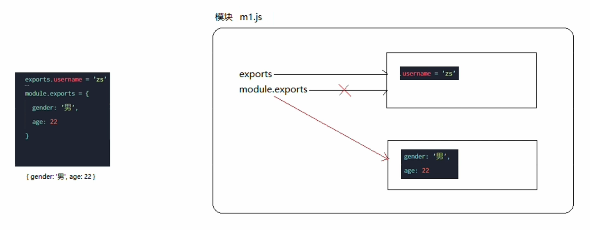

情况二：

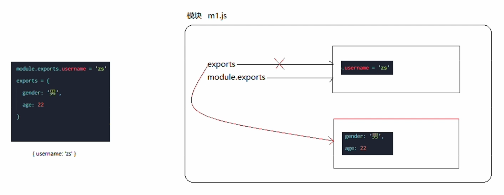

情况三：

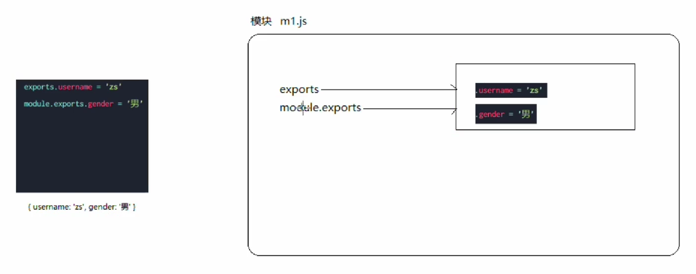

情况四：

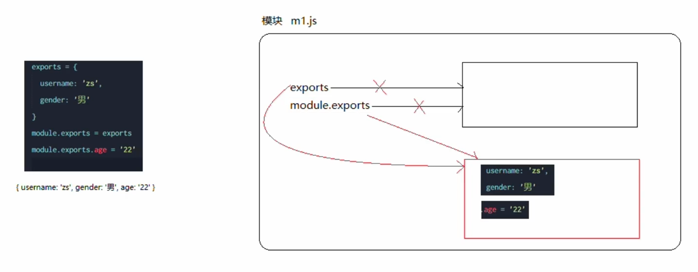

注意：为了防止混乱，建议不要在同一个模块中同时使用 exports 和 module.exports！

## 2.5 Node.js中的模块化规范

Node.js 遵循了 CommonJS 模块化规范，CommonJS 规定了模块的特性和各模块之间如何相互依赖。

CommonJS 规定：

1. 每个模块内部，module 变量代表当前模块
2. module 变量是一个对象，它的 exports 属性（即 module.exports）是对外的接口
3. 加载某个模块，其实是加载该模块的 module.exports 属性，require() 方法用于加载模块