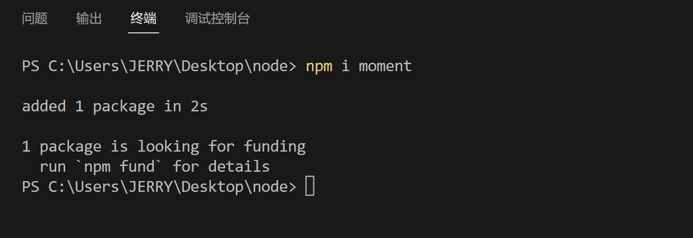
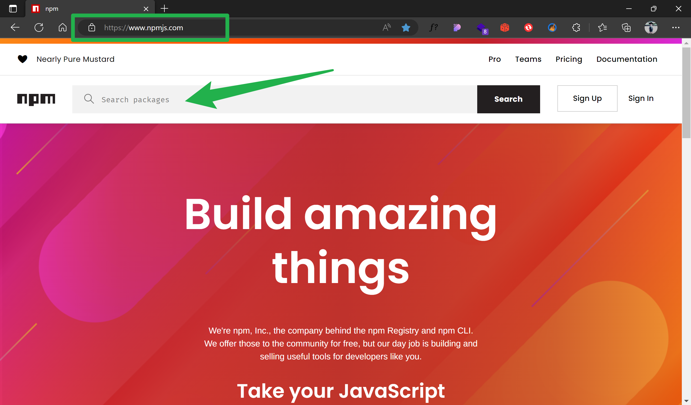
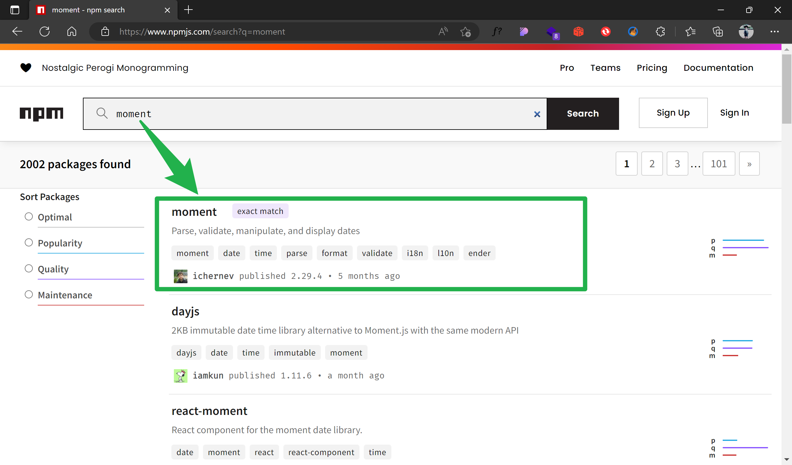
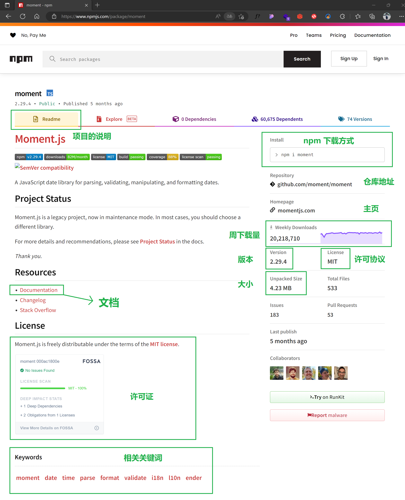
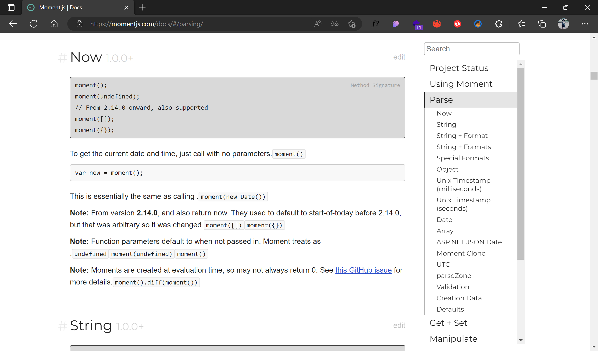
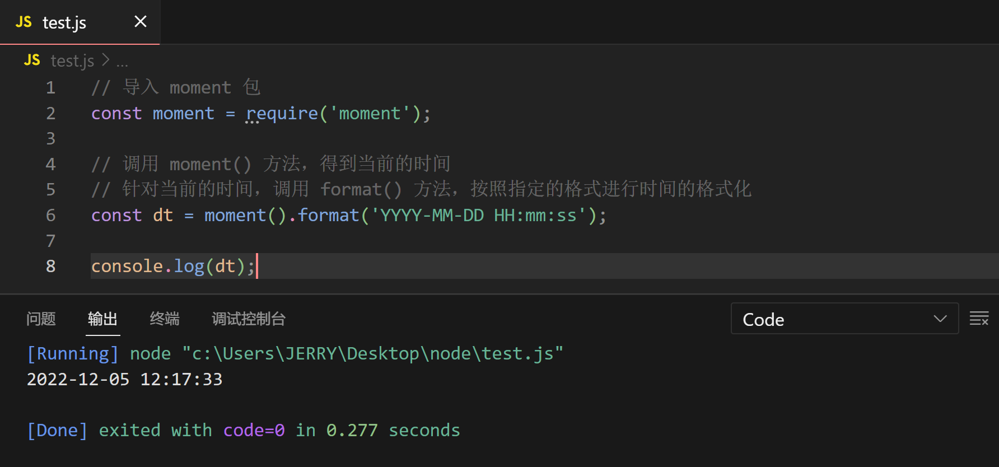

# npm与包

> 原创内容，转载请注明出处！

# 一、包

## 1.1 什么是包？

Node.js 中的第三方模块又叫作包。

> 就像电脑和计算机指的是相同的东西，第三方模块和包指的是同一个概念，只不过叫法不同。

## 1.2 包的来源

不同于 Node.js 中的内置模块与自定义模块，包是由第三方个人或团队开发出来的，免费供所有人使用。

注意：Node.js 中的包都是免费开源的，不需要付费即可免费下载使用。

## 1.3 为什么需要包？

由于 Node.js 的内置模块仅仅提供了一些底层基础性的 API，导致在基于内置模块进行项目的开发时，效率很低。

包是基于内置模块封装出来的，提供了更高级、更方便的 API，极大的提高了开发效率。

包和内置模块之间的关系，类似于 jQuery 和 浏览器内置 API 之间的关系。

## 1.4 从哪里下载包？

国外有一家 IT 公司，叫作【Npm, Inc.】这家公司旗下有一个非常著名的网站：https://www.npmjs.com/，它是全球最大的包共享平台，任何人可以从这个网站上搜索到任何你想要的包，只要你有足够的耐心！

到目前为止，全球约 1100 多万的开发人员，通过这个包共享平台，开发并共享了超过 120 多万个包供我们使用。

npm, Inc. 公司提供了一个地址为 https://registry.npmjs.org/ 的服务器，来对外共享所有的包，我们可以从这个服务器上下载自己所需要的包。

注意：

- 从 https://www.npmjs.com/ 网站上搜索自己所需要的包
- 从 https://registry.npmjs.org/ 服务器上下载自己所需要的包

## 1.5 如何下载包？

npm, Inc. 公司提供了一个包管理工具，我们可以使用这个包管理工具，从 https://registry.npmjs.org/ 服务器把需要的包下载到本地使用。

这个包管理工具的名字叫作 Node Package Manager（简称 npm 包管理工具），这个包管理工具随着 Node.js 的安装包一起被安装到了用户的电脑上。

大家可以在终端中执行 npm -v 命令，来查看自己电脑上所安装的 npm 包管理工具的版本号。

# 二、npm初体验

案例：格式化时间

1. 使用 npm 包管理工具，在项目中安装格式化时间的包 moment
2. 使用 require() 导入格式化时间的包
3. 参考 moment 官方 API 文档对时间进行格式化

**【在项目中安装包的命令】**

如果想在项目中安装指定名称的包，需要运行如下的命令：

```shell
npm install 包的完整名称
```

上述的装包命令，可以简写成如下格式：

```shell
npm i 包的完整名称
```



**【利用 moment 对时间进行格式化】**

首先我们打开 https://www.npmjs.com/，并在搜索框中搜索 moment。



在结果列表中，找到 moment 点击进入。



moment 主页的相关说明（其它包也大同小异）：



点击文档，即可查看使用说明：



> 目前绝大多数的开源项目都是英文文档，所以良好的英文听说读写能力是一个出色程序员的标配！

根据文档的指示，我们开始编写代码：

```javascript
// 导入 moment 包
const moment = require('moment');

// 调用 moment() 方法，得到当前的时间
// 针对当前的时间，调用 format() 方法，按照指定的格式进行时间的格式化
const dt = moment().format('YYYY-MM-DD HH:mm:ss');

console.log(dt);
```



**【初次装包后多了哪些文件】**

初次装包完成后，在项目文件夹下多一个叫作 node_modules 的文件夹和 package-lock.json 的配置文件（新版的 Node.js 还会自动添加 package.json 文件）。

其中：

- node_modules 文件夹用来存放所有已安装到项目中的包。require() 导入第三方包时，就是从这个目录中查找并加载包
- package-lock.json 配置文件用来记录 node_modules 目录下的每一个包的下载信息，例如包的名字、版本号、下载地址等

注意：程序员不要手动修改 node_modules 或 package-lock.json 文件中的任何代码，npm 包管理工具会自动维护它们。


**【安装指定版本的包】**

默认情况下，使用 npm install 命令安装包的时候，会自动安装最新版本的包。如果需要安装指定版本的包，可以在包名之后，通过 @ 符号指定具体的版本，例如：`npm i moment@2.29.4`。

**【包的语义化版本规范】**

包的版本号是以“点分十进制”形式进行定义的，总共有三位数字，例如：2.24.0

其中，每一位数字所代表的含义如下：

- 第一位数字：大版本号
- 第二位数字：功能版本号
- 第三位数字：Bug 修复版本号

版本号提升的规则：只要前面的版本号增长了，则后面的版本号归零。

# 三、包管理配置文件

npm 规定，在项目根目录中，必须提供一个叫作 package.json 的包管理配置文件，用来记录与项目有关的一些配置信息。例如：

- 项目的名称、版本号、描述等
- 项目中都用到了哪些包
- 哪些包只在开发期间会用到
- 哪些包在开发和部署时都需要用到

## 3.1 多人协作的问题


从我们之前创建的时间格式化项目文件夹就可以发现，真正的业务代码（test.js）只有 1 KB 的大小，而 node_modules 文件夹却有 4 MB 大小！这还只是一个非常小型的项目，对于中大型项目来说，一般业务代码只占整个项目大小的 1%！另外的 99% 大部分都是 node_modules 中的依赖包的大小！此时就会带来一个严重的问题：假如项目 1G 大小，而实际业务代码只有 10 MB，此时如果我们要将项目上传到云端或者发送给其他人，那么就需要发送 1G 的数据，这是非常耗费资源且耗时的！在实际团队合作的开发中，往往有一个统一的云端代码仓库实时同步各个程序员本地的代码，如果都不做任何处理直接上传和发送项目原始数据的话，根本不现实！ 

- 问题：第三方包体积过大，不方便共享项目源代码
- 解决思路：共享时剔除掉 node_modules 文件夹

## 3.2 如何记录项目中安装了哪些包

在项目根目录中，创建一个叫作 package.json 的配置文件，即可用来记录项目中安装了哪些包，从而方便剔除 node_modules 目录之后，在团队成员之间共享项目的源代码。

> 注意：今后如果使用 GitHub、Gitee 等来共享项目，那么一定要把 node_modules 文件夹添加到 Git 忽略文件 .gitignore 中。

## 3.3 快速创建package.json

npm 包管理工具提供了一个快捷命令，可以在执行命令时所处的目录中，快速创建 package.json 这个包管理配置文件：

```shell
npm init -y
```

> 注意：执行这个命令时项目应是空的，在还没有写代码之前！

> 新版本的 Node.js 在我们写了代码，用 npm 安装依赖包时，除了会创建 node_modules 文件夹及 package-lock.json 文件之外，还会同时创建 package.json 文件（前提是项目之前没有执行过 npm init -y ）。

注意：

- 上述命令只能在英文的目录下成功执行！所以，项目文件夹的名称一定要使用英文命名，不要使用中文，也不能出现空格！
- 往后，当我们用 npm install XXX 或 npm i XXX 命令安装依赖包时，npm 包管理工具会自动把包的名称和版本号，记录到 package.json 中！


可以发现，自动生成的 package.json 文件中自动记录了我们的项目名称（可以修改，默认使用文件夹名称），项目版本号，项目许可类型（默认 ISC）等信息。

## 3.4 dependencies节点

package.json 文件中，有一个 dependencies 节点，专门用来记录你使用 npm install 命令安装了哪些包。

实际演示：

- 未安装任何包前的 package.json 文件

```json
{
  "name": "nodestudy",
  "version": "1.0.0",
  "description": "",
  "main": "index.js",
  "scripts": {
    "test": "echo \"Error: no test specified\" && exit 1"
  },
  "keywords": [],
  "author": "",
  "license": "ISC"
}
```

- 执行 `npm i moment` 命令后的 package.json 文件

同时，项目还多了 node_modules 文件夹（里面存放了 moment 的相关代码和资源）和 package-lock.json 文件。


- 执行 `npm i jquery art-template` 命令后的 package.json 文件

 注：npm i 可以一次安装多个包，包与包之间用空格隔开。


## 3.5 一次性安装所有的依赖包

当我们拿到一个剔除了 node_modules 的项目后，需要先把所有的包下载到项目中，才能将项目运行起来。否则会报类似于下面的错误：

```shell
Error: Cannot find module 'moment'
```

可以运行 `npm install` 命令（或 `npm i`）一次性安装所有的依赖包（复原 node_modules 文件夹）：

```shell
# 执行 npm install 命令时，npm 包管理工具会先读取 package.json 中的 dependencies 节点
# 读取到记录的所有依赖包名称和版本号之后，npm 包管理工具会把这些依赖包一次性下载到项目中
npm install
```


## 3.6 卸载包

可以运行 `npm uninstall` 命令，来卸载指定的包：

```shell
# 使用 npm uninstall 具体的包名来卸载包
npm uninstall moment
```

npm uninstall 命令执行成功后，会把对应的包从 node_modules 文件夹中删除，同时自动从 package.json 的 dependencies 中移除掉相应的部分。

> 注意：npm uninstall 没有简写形式，npm uninstall 可以一次卸载多个包，包与包之间用空格隔开。


## 3.7 devDependencies节点

如果某些包只在项目开发阶段会用到，在项目上线之后不会用到，则建议把这些包记录到 devDependencies 节点中。

与之对应的，如果某些包在开发和项目上线之后都需要用到，则建议把这些包记录到 dependencies 节点中。

您可以使用如下的命令，将包记录到 devDependencies 节点中：

```shell
# 安装指定的包，并记录到 devDependencies 节点中
npm i 包名 -D
# 注意：上述命令是简写形式，等价于下面的完整写法
npm install 包名 --save-dev
```

例如：


> 注意：-D 或 --save-dev 后缀写到 npm install 或 包名 后面都可以。
>
> 即：npm i webpack -D 与 npm i -D webpack 是等同的。

说明：安装包需不需要指定 `-D`，一般来说在包的文档中都会说明。例如，我们去 npm 网站上搜索 webpack 进入其文档，就会发现有安装说明：


# 四、镜像源

## 4.1 为什么包下载速度慢

在使用 npm 下包的时候，默认从国外的 npm 官方服务器 https://registry.npmjs.org/ 进行下载，而目前国内的网络与外网是有“阻隔”的，因此下包速度会很慢。

## 4.2 淘宝npm镜像服务器


## 4.3 切换npm的下包镜像源

下包的镜像源，指的就是下包的服务器地址。

```shell
# 查看当前的下包服务器地址
npm config get registry
# 将下包的服务器地址切换为淘宝镜像源
npm config set registry=https://registry.npm.taobao.org/
# 检查镜像源是否切换成功
npm config get registry
```


> 注意：npm 淘宝镜像源地址已经更换了，新的地址是：https://registry.npmmirror.com/

## 4.4 nrm

为了更方便的切换下包的镜像源，我们可以安装 nrm 这个小工具，利用 nrm 提供的终端命令，可以快速查看和切换下包的镜像源。

```shell
# 通过 npm 包管理器，将 nrm 安装为全局可用的工具
npm i nrm -g
```


```shell
# 查看所有可用的镜像源
nrm ls
# 将下包的镜像源切换为 taobao 镜像
nrm use taobao
```


> 
>
> 新版的 Windows 系统中，nrm 默认使用不了，解决方法是：
>
> 1. 管理员方式打开终端执行：`set-ExecutionPolicy RemoteSigned`
> 2. 继续执行：`get-ExecutionPolicy`，如果输出为 `RemoteSigned ` 即为成功。
>
> 

# 五、包的分类

## 5.1 项目包

那些被安装到项目的 node_modules 目录中的包，都是项目包。

项目包又分为两类，分别是：

- 开发依赖包（被记录到 devDependencies 节点中的包，只在开发期间会用到）
- 核心依赖包（被记录到 dependencies 节点中的包，在开发期间和项目上线之后都会用到）

```shell
npm i 包名 -D	# 开发依赖包（会被记录到 devDependencies 节点下）
npm i 包名	# 核心依赖包（会被记录到 dependencies 节点下）
```

## 5.2 全局包

在执行 npm install 命令时，如果提供了 -g 参数，则会把包安装为全局包。

全局包会被安装到 C:\Users\用户目录\AppData\Roaming\npm\node_modules 目录下。


如图，在该目录下就能发现之前全局安装的 nrm 工具包。

```shell
npm i 包名 -g				# 全局安装指定的包
npm uninstall 包名 -g 	# 卸载全局安装的包
```

注意：

- 只有工具性质的包，才有全局安装的必要性。因为它们提供了好用的终端命令。
- 判断某个包是否需要全局安装后才能使用，可以参考官方提供的使用说明。

# 六、规范的包结构

在清楚了包的概念，以及如何下载和使用包之后，接下来，我们深入了解一下包的内部结构。

一个规范的包，它的组成结构，必须符合以下 3 点要求：

- 包必须以单独的目录而存在（例如：moment）
- 包的顶级目录下必须包含 package.json 这个包管理配置文件（moment 文件夹内包含 package.json）
- package.json 中必须包含 name、version、main 这三个属性，分别代表包的名字、版本号、包的入口


> main 属性：当我们加载对应包时，例如：const moment = require('moment')  那么程序就去找 moment 中的package.json 中的 main 属性，从而知道是要以 ./moment.js 为入口来加载该包。

# 七、开发与发布包

