# Express

> 原创内容，转载请注明出处！

# 一、初始Express

## 1.1 Express简介

**（1）什么是 Express？**

官方给出的概念：Express 是基于 Node.js 平台，快速、开放、极简的 Web 开发框架。

通俗的理解：Express 的作用和 Node.js 内置的 http 模块类似，是专门用来创建 Web 服务器的。

Express 的本质：就是一个 npm 上的第三方的包，提供了快速创建 Web 服务器的便捷方法。

Express 的中文官网：http://www.expressjs.com.cn/

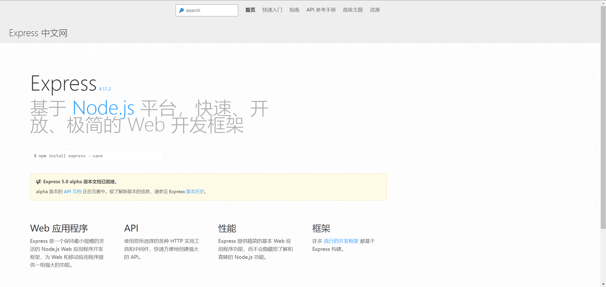

**（2）进一步理解 Express**

思考：不使用 Express 能否创建 Web 服务器？

答案：能，使用 Node.js 提供的原生 http 模块即可。

---

思考：既生瑜何生亮（有了 http 内置模块，为什么还有用 Express）？

答案：http 内置模块用起来很复杂，开发效率低；Express 是基于内置的 http 模块进一步封装出来的，能够极大的提高开发效率。

---

思考：http 内置模块与 Express 是什么关系？

答案：类似于浏览器中 Web API 和 jQuery 的关系。后者是基于前者进一步封装出来的。

**（3）Express 能做什么？**

对于前端程序员来说，最常见的两种服务器，分别是：

- Web 网站服务器：专门对外提供 Web 网页资源的服务器。
- API 接口服务器：专门对外提供 API 接口的服务器。

使用 Express，我们可以方便、快速的创建 Web 网站的服务器或 API 接口的服务器。

## 1.2 Express的基本使用

### 1.2.1 安装

在项目所处的目录中，运行如下命令，即可将 express 安装到项目中使用：

```shell
npm i express@4.17.1
# 这里统一使用 4.17.1 版本来做演示
```

### 1.2.2 创建基本的Web服务器

```javascript
// 导入 express
const express = require('express');

// 创建 web 服务器
const app = express();

// 启动 web 服务器
// app.listen(端口号, 启动成功后的回调函数)
app.listen(80, () => {
    console.log('express server running at http://127.0.0.1');
});
```

### 1.2.3 监听GET请求

通过 `app.get()` 方法，可以监听客户端的 GET 请求，具体的语法格式如下：

```javascript
// 参数1：客户端请求的 URL 地址
// 参数2：请求对应的处理函数
// 		req：请求对象（包含了与请求相关的属性与方法）
//		res：响应对象（包含了与响应相关的属性与方法）
app.get('请求URL', function (req, res) {
   // 处理     
});
```

### 1.2.4 监听POST请求

通过 `app.post()` 方法，可以监听客户端的 POST 请求，具体的语法格式如下：

```javascript
// 参数1：客户端请求的 URL 地址
// 参数2：请求对应的处理函数
// 		req：请求对象（包含了与请求相关的属性与方法）
//		res：响应对象（包含了与响应相关的属性与方法）
app.post('请求URL', funciton(req, res) {
   // 处理     
});
```

### 1.2.5 把内容响应给客户端

通过 `res.send()` 方法，可以把处理好的内容，发送给客户端：

```javascript
app.get('/user', (req, res) => {
    // 向客户端发送 JSON 对象
    res.send({ name: 'zjr', age: '18', gender: '男' });
});

app.post('/user', (req, res) => {
    // 向客户端发送文本内容
    res.send('请求成功');
});
```

---

测试：

```javascript
// 导入 express
const express = require('express');

// 创建 web 服务器
const app = express();

// 监听客户端的 GET 和 POST 请求，并向客户端响应具体的内容
app.get('/user', (req, res) => {
    // 向客户端发送 JSON 对象
    res.send({ name: 'zjr', age: '18', gender: '男' });
});

app.post('/user', (req, res) => {
    // 向客户端发送文本内容
    res.send('请求成功');
});

// 启动 web 服务器
// app.listen(端口号, 启动成功后的回调函数)
app.listen(80, () => {
    console.log('express server running at http://127.0.0.1');
});
```

运行：

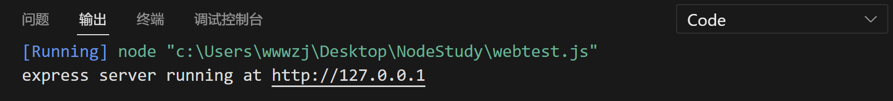

Apifox 测试：

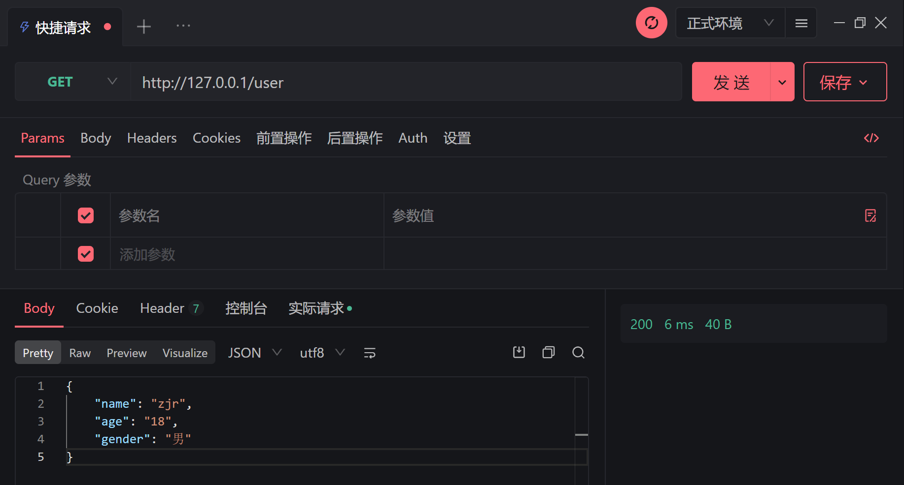

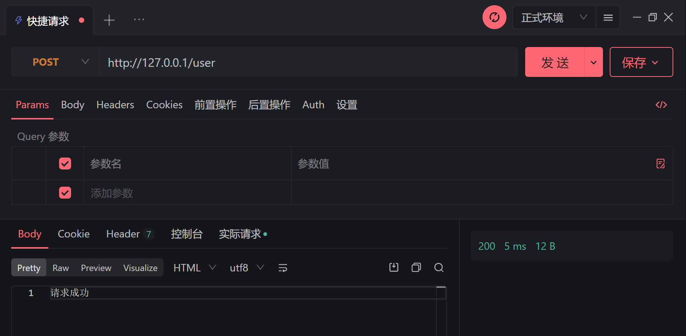

> 注意：对于一个请求，只能 `res.send()` 一次！

### 1.2.6 获取URL中携带的查询参数

通过 `req.query` 对象，可以访问到客户端通过查询字符串的形式，发送到服务器的参数。

```javascript
app.get('/', (req, res) => {
    // req.query 默认是一个空对象
    // 客户端使用 ?name=zjr&age=20 这种查询字符串的形式，发送到服务器的参数
    // 可以通过 req.query 对象访问到，例如：
	// req.query.name	req.query.age
    console.log(req.query);
});
```

### 1.2.7 获取URL中的动态参数

通过 `req.params` 对象，可以访问到 URL 中，通过 `:` 匹配到的动态参数。

```javascript
// URL 地址中，可以通过 :参数名 的形式，匹配动态参数值
app.get('/user/:id', (req, res) => {
    // req.params 默认是一个空对象
    // 里面存放着通过 : 动态匹配到的参数值
    // 例如：http://127.0.0.1/user/1010929843210，则服务器收到的 1010929843210 就被赋给了 id 参数
    console.log(req.params);
});
```

---

测试：

```javascript
// 导入 express
const express = require('express');

// 创建 web 服务器
const app = express();

// 监听客户端的 GET 和 POST 请求，并向客户端响应具体的内容
app.get('/user', (req, res) => {
    // 向客户端发送 JSON 对象
    res.send({ name: 'zjr', age: '18', gender: '男' });
});

app.post('/user', (req, res) => {
    // 向客户端发送文本内容
    res.send('请求成功');
});

app.get('/', (req, res) => {
    // req.query 默认是一个空对象
    // 客户端使用 ?name=zjr&age=20 这种查询字符串的形式，发送到服务器的参数
    // 可以通过 req.query 对象访问到，例如：
    // req.query.name	req.query.age
    res.send(req.query);
    res.send(req.query.name);
    res.send(req.query.age);
});

// URL 地址中，可以通过 :参数名 的形式，匹配动态参数值
app.get('/user/:id', (req, res) => {
    // req.params 默认是一个空对象
    // 里面存放着通过 : 动态匹配到的参数值
    res.send(req.params);
});

// 启动 web 服务器
// app.listen(端口号, 启动成功后的回调函数)
app.listen(80, () => {
    console.log('express server running at http://127.0.0.1');
});
```

Apifox 测试：

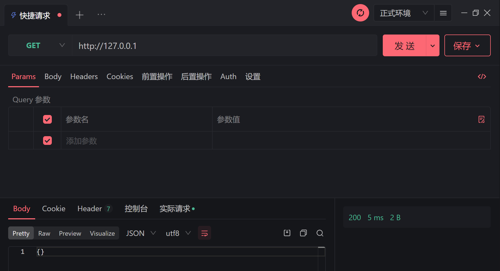

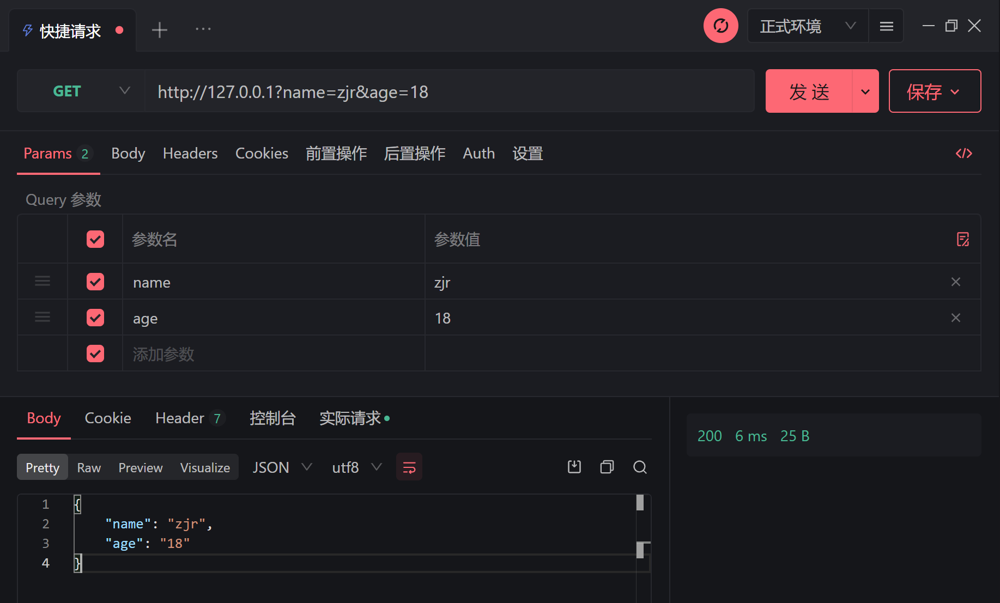

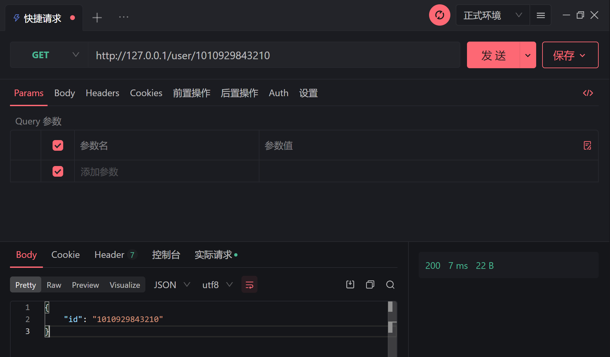

## 1.3 托管静态资源

### 1.3.1 express.static()

express 提供了一个非常好用的函数，叫做 `express.static()`，通过它，我们可以非常方便地创建一个静态资源服务器，例如，通过如下代码就可以将 public 目录下的图片、CSS 文件、JavaScript 文件对外开放访问了：

```javascript
app.use(express.static('public'))
```

现在，你就可以访问 public 目录中的所有文件了：

`http://localhost/images/bg.jpg`

`http://localhost/css/style.css`

`http://localhost/js/login.js`

**注意：**Express 在指定的静态目录中查找文件，并对外提供资源的访问路径，因此，存放静态文件的目录名（public）不会出现在 URL 中。

```javascript
const express = require('express');
const app = express();

app.use(express.static('./public'));

app.listen(80, () => {
    console.log('express server running at http://127.0.0.1');
})
```

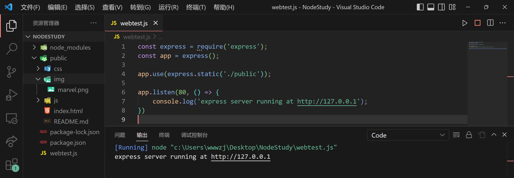


### 1.3.2 托管多个静态资源目录

如果要托管多个静态资源目录，请多次调用 `express.static()` 函数：

```javascript
app.use(express.static('public'));
app.use(express.static('files'));
```

访问静态资源文件时，`express.static()` 函数会根据目录的添加顺序查找所需的文件。

### 1.3.3 挂载路径前缀

如果希望在托管的静态资源访问路径之前，挂载路径前缀，则可以使用如下的方式：

```javascript
app.use('/public', express.static('public'))
```

现在，你就可以通过带有 /public 前缀地址来访问 public 目录中的文件了：

`http://localhost/public/images/kitten.jpg`

`http://localhost/public/css/style.css`

`http://localhost/public/js/app.js`

## 1.4 nodemon

**（1）为什么要使用 nodemon**

在编写调试 Node.js 项目的时候，如果修改了项目的代码，则需要频繁的手动 close 掉，然后再重新启动，非常繁琐。现在，我们可以使用 nodemon（https://www.npmjs.com/package/nodemon） 这个工具，它能够监听项目文件的变动，当代码被修改后，nodemon 会自动帮我们重启项目，极大方便了开发和调试。

**（2）安装 nodemon**

在终端中，运行如下命令，即可将 nodemon 安装为全局可用的工具：

```shell
npm install -g nodemon
```

**（3）使用 nodemon**

当基于 Node.js 编写了一个网站应用的时候，传统的方式，是运行 node app.js 命令，来启动项目。这样做的坏处是：代码被修改之后，需要手动重启项目。

现在，我们可以将 node 命令替换为 nodemon 命令，使用 nodemon app.js 来启动项目。这样做的好处是：代码被修改之后，会被 nodemon 监听到，从而实现自动重启项目的效果。

```shell
nodemon app.js
```

即：每一次修改代码并保存时，nodemon 会自动重启一次项目。

# 二、Express路由

## 2.1 路由的概念

### 2.1.1 什么是路由

广义上来讲，路由就是映射关系。

### 2.1.2 现实生活中的路由

在这里，路由是按键与服务之间的映射关系。

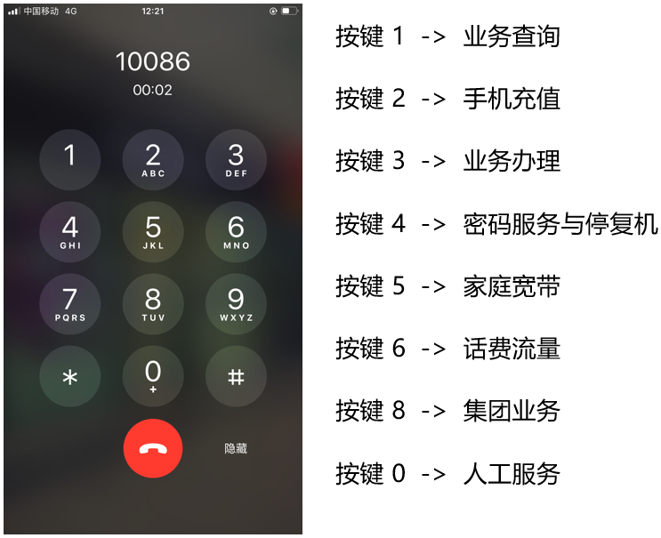

### 2.1.3 Express中的路由

在 Express 中，路由指的是**客户端的请求**与**服务端处理函数**之间的映射关系。

Express 中的路由分 3 部分组成，分别是：**请求的类型**、**请求的 URL 地址**、**处理函数**，格式如下：

```javascript
app.METHOD(PATH, HANDLER)
```

### 2.1.4 Express中的路由的例子

```javascript
// 匹配 GET 请求，且请求 URL 为 /
app.get('/', function (req, res) {
   res.send('Got a GET request');     
});

// 匹配 POST 请求，且请求为 URL 为 /
app.post('/', function (req, res) {
   res.send('Got a POST request');      
});
```

### 2.1.5 路由的匹配过程

每当一个请求到达服务器之后，需要先经过路由的匹配，只有匹配成功之后，才会调用对应的处理函数。

在匹配时，会按照路由的顺序进行匹配，如果请求类型和请求的 URL 同时匹配成功，则 Express 会将这次请求，转交给对应的 function 函数进行处理。

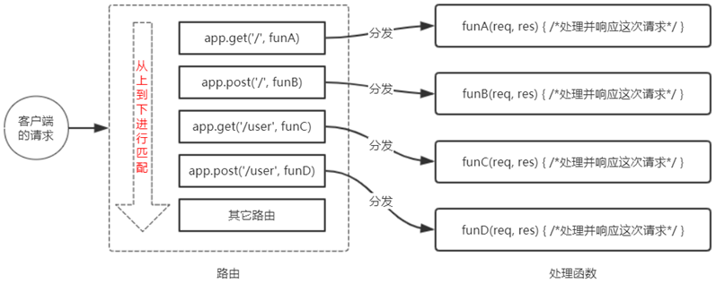

路由匹配的注意点：

- 按照定义的先后顺序进行匹配
- 请求类型和请求的 URL 同时匹配成功，才会调用对应的处理函数

## 2.2 路由的使用

### 2.2.1 最简单的用法

在 Express 中使用路由最简单的方式，就是把路由挂载到 app 上，示例代码如下：

```javascript
const express = require('express');

// 创建 Web 服务器，命名为 app
const app = express();

// 挂载路由
app.get('/', (req, res) => {
    res.send('Get Request.');
});

// 挂载路由
app.post('/', (req, res) => {
    res.send('Post Request.');
});

app.listen(80, () => {
    console.log('server running at http://127.0.0.1');
});
```

### 2.2.2 模块化路由

为了方便对路由进行模块化的管理，Express 不建议将路由直接挂载到 app 上，而是推荐将路由抽离为单独的模块。

将路由抽离为单独模块的步骤如下：

1. 创建路由模块对应的 .js 文件
2. 调用 `express.Router()` 函数创建路由对象
3. 向路由对象上挂载具体的路由
4. 使用 `module.exports` 向外共享路由对象
5. 使用 `app.use()` 函数注册路由模块

**（1）创建路由模块 router/user.js**

```javascript
// 导入 express
var express = require('express');
// 创建路由对象
var router = express.Router();		

// 挂载获取用户列表
router.get('/user/list', function (req, res) {
    res.send('Get user list.');
});

// 挂载添加用户的路由
router.post('/user/add', function (req, res) {
    res.send('Add new user.');
});

// 向外导出路由对象
module.exports = router;
```

**（2）注册路由模块**

```javascript
// 导入路由模块
const userRouter = require('./router/user.js');

// 使用 app.use() 注册路由模块
app.use(userRouter);
```

---

实例代码：

```javascript
// router/user.js

// 导入 express
var express = require('express');
// 创建路由对象
var router = express.Router();

// 挂载获取用户列表
router.get('/user/list', function (req, res) {
    res.send('Get user list.');
});

// 挂载添加用户的路由
router.post('/user/add', function (req, res) {
    res.send('Add new user.');
});

// 向外导出路由对象
module.exports = router;
```

```javascript
// webtest.js

// 导入 express
const express = require('express');
// 创建 web 服务器
const app = express();

// 导入路由模块
const userRouter = require('./router/user.js');

// 使用 app.use() 注册路由模块
app.use(userRouter);

app.listen(80, () => {
    console.log('http://127.0.0.1');
});
```

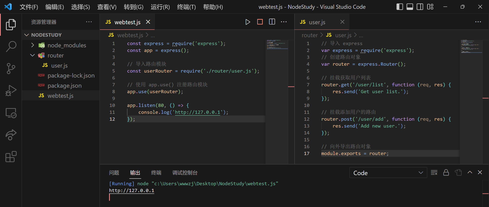

Apifox 测试：

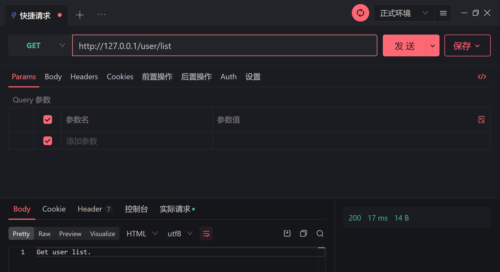

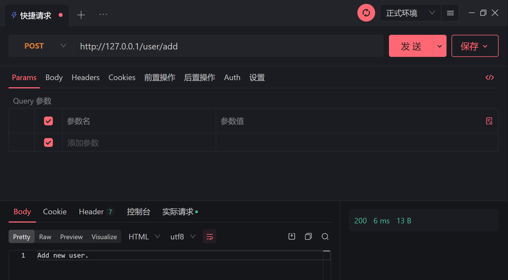

> 在注册路由模块时，我们使用到了 app.use() 函数，而在之前托管静态资源 app.use(express.static('public')) 时，也使用到了 app.use() 函数。
>
> 那 app.use() 函数到底是干什么的呢？
>
> 其实，app.use() 函数的作用，就是用来注册全局中间件！（中间件相关概念后面讲）

## 2.3 为路由模块添加前缀

类似于托管静态资源时，为静态资源统一挂载访问前缀一样，路由模块添加前缀的方式也非常简单：

```javascript
// 导入路由模块
const userRouter = require('./router/user.js');

// 使用 app.use() 注册路由模块，并统一添加访问前缀 /api
app.use('/api', userRouter);
```

例如：

```javascript
// 导入路由模块
const userRouter = require('./router/user.js');

// 使用 app.use() 注册路由模块
app.use('/api', userRouter);
```

`http://127.0.0.1/api/user/add`

`http://127.0.0.1/api/user/list`

# 三、Express中间件

## 3.1 中间件的概念

### 3.1.1 什么是中间件

中间件（Middleware），特指业务流程的中间处理环境。

特点：有输入，也有输出！

### 3.1.2 现实生活中的例子

在处理污水的时候，一般都要经过三个处理环节，从而保证处理过后的废水，达到排放的标准。

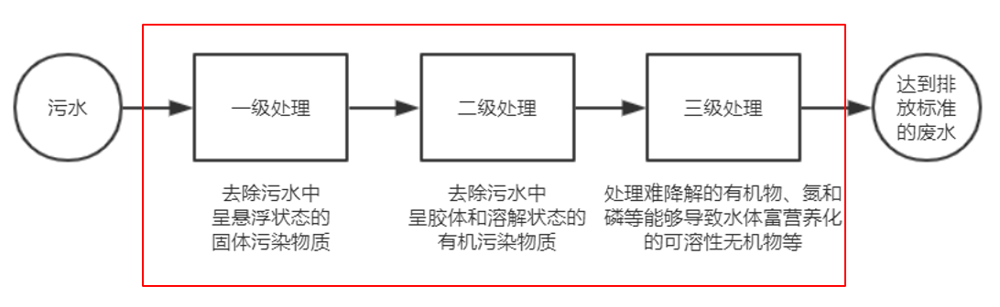

处理污水的这三个中间处理环节（上一级的输出是下一级的输入），就可以叫作中间件。

### 3.1.3 Express中间件的调用流程

当一个请求到达 Express 的服务器之后，可以连续调用多个中间件，从而对这次请求进行预处理。

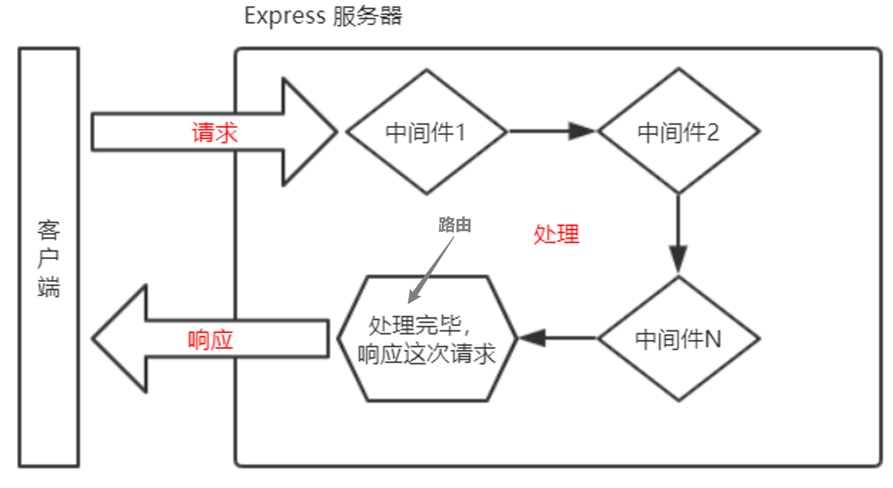

### 3.1.4 Express中间件的格式

Express 的中间件，本质上就是一个 **function** **处理函数**，Express 中间件的格式如下：

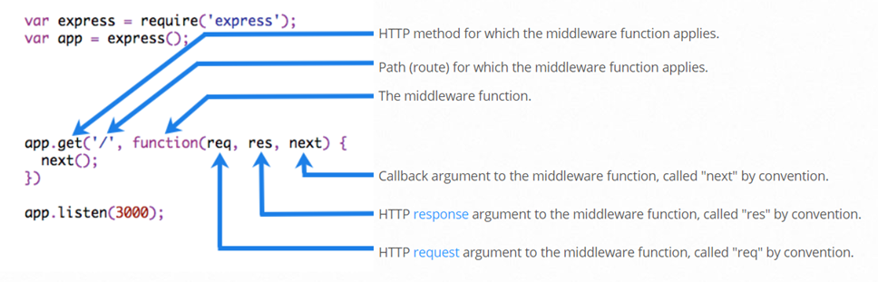

注意：中间件函数的形参列表中，**必须包含 next 参数**。而路由处理函数中只包含 req 和 res。

### 3.1.5 next函数的作用

**next** **函数**是实现多个中间件**连续调用**的关键，它表示把流转关系转交给**下一个中间件或路由**。


## 3.2 Express中间件的初体验

### 3.2.1 定义中间件函数

可以通过如下的方式，定义一个最简单的中间件函数：

```javascript
// 常量 mw 所指向的，就是一个中间件函数
const mw = function (req, res, next) {
    console.log('这是一个最简单的中间件函数');
    // 注意：在当前中间件的业务处理完毕后，必须调用 next() 函数
    // 表示把流转关系转交给下一个中间件或路由器
    next();
};
```

### 3.2.2 全局生效的中间件

客户端发起的任何请求，到达服务器之后，都会触发的中间件，叫作全局生效的中间件。

通过调用 `app.use(中间件函数)`，即可定义一个全局生效的中间件，示例代码如下：

```javascript
// 常量 mw 所指向的，就是一个中间件函数
const mw = function (req, res, next) {
    console.log('这是一个最简单的中间件函数');
    next();
};

// 全局生效的中间件
app.use(mw);
```

测试代码：

```javascript
const express = require('express');

const app = express();

// 定义一个最简单的中间件函数
const mw = function (req, res, next) {
    console.log('这是最简单的中间件函数');
    // 把流转关系，转交给下一个中间件或路由
    next();
};

// 将 mw 注册为全局生效的中间件
app.use(mw);

app.get('/', (req, res) => {
    res.send('Home page.');
});

app.get('/user', (req, res) => {
    res.send('User page.');
});

app.listen(80, () => {
    console.log('http://127.0.0.1');
});
```

Apifox 测试：

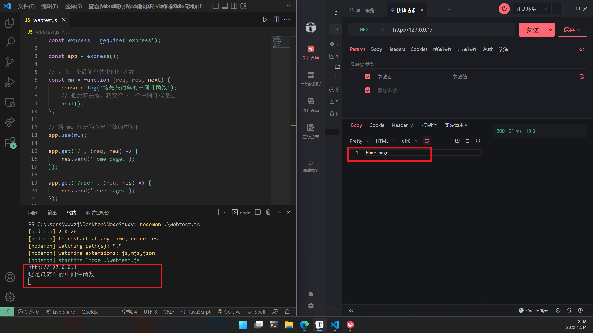

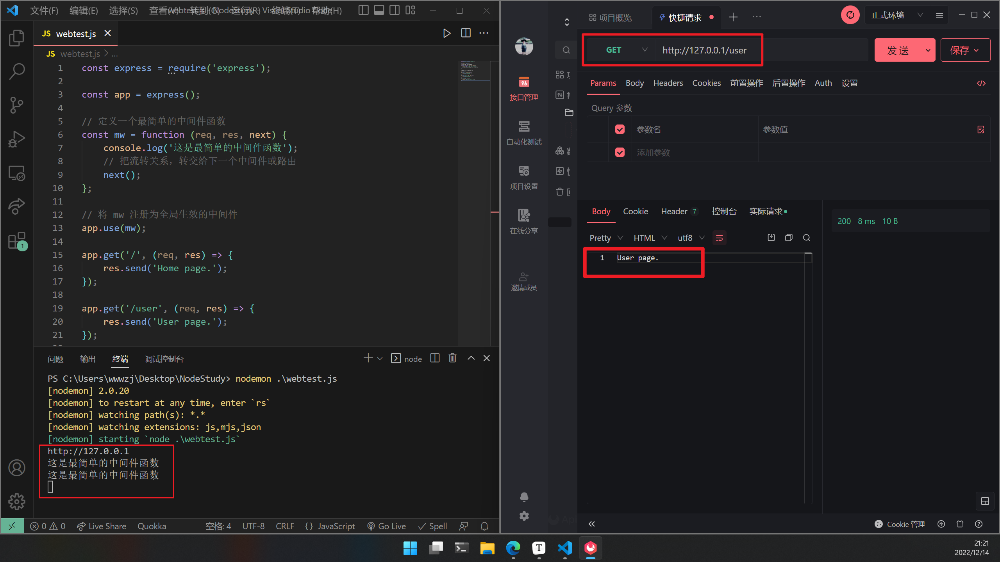

### 3.2.3 定义全局中间件的简化形式

```javascript
// 全局生效的中间件
app.use(function (req, res, next) {
	console.log('这是一个最简单的中间件函数');
	next();
});
```

代码示例：

```javascript
const express = require('express');

const app = express();

// 定义全局中间件的简化形式
app.use((req, res, next) => {
    console.log('这是最简单的中间件函数');
    // 把流转关系，转交给下一个中间件或路由
    next();
});

app.get('/', (req, res) => {
    res.send('Home page.');
});

app.get('/user', (req, res) => {
    res.send('User page.');
});

app.listen(80, () => {
    console.log('http://127.0.0.1');
});
```

> 注意：对于一个请求，如果在全局中间件中 `res.send()` 过一次，那么后续，无论是全局中间件内，还是其他中间件或路由中的 `res.send()` 都会报错！
>
> 即：一个请求，只对应一个 req 及 res ，也只能有一个 `res.send()`。

### 3.2.4 中间件的作用

多个中间件之间，**共享同一份** **req** **和** **res**。基于这样的特性，我们可以在上游的中间件中，统一为 req 或 res 对象添加自定义的属性或方法，供下游的中间件或路由进行使用。 

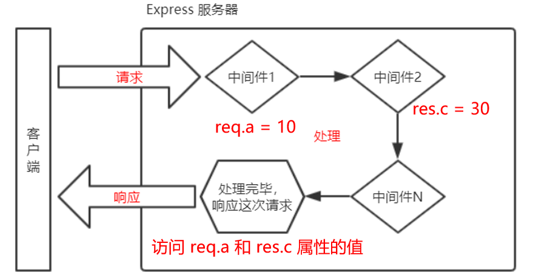

代码示例：

```javascript
const express = require('express');

const app = express();

// 定义全局中间件的简化形式
app.use((req, res, next) => {
    // 获取到请求服务器的时间
    const time = Date.now();
    // 为 req 对象，挂载自定义属性，从而把时间共享给后面的所有路由
    req.startTime = time;
    // 把流转关系，转交给下一个中间件或路由
    next();
});

app.get('/', (req, res) => {
    res.send('Home page. ' + req.startTime);
});

app.get('/user', (req, res) => {
    res.send('User page. ' + req.startTime);
});

app.listen(80, () => {
    console.log('http://127.0.0.1');
});
```

Apifox 测试：

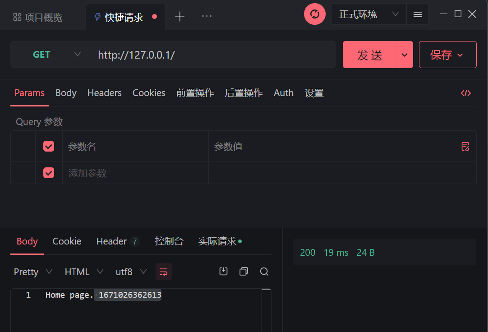

### 3.2.5 定义多个全局中间件

可以使用 `app.use()` 连续定义多个全局中间件。客户端请求到达服务器之后，会按照中间件定义的先后顺序依次进行调用，示例代码如下：

```javascript
// 第一个全局中间件
app.use(function (req, res, next) {
    console.log('调用了第1个全局中间件');
    next();
});

// 第2个全局中间件
app.use(function (req, res, next) {
    console.log('调用了第2个全局中间件');
    next();
});

// 请求这个路由，会依次触发上述两个全局中间件，然后再触发这个路由 
app.get('/user', (req, res) => {
    res.send('Home page.');
});
```

### 3.2.6 局部生效的中间件

不使用 `app.use()` 定义的中间件，叫做局部生效的中间件，示例代码如下：

```javascript
// 定义中间件函数 mw1
const mw1 = function (req, res, next) {
    console.log('这是中间件函数');
    next();
};

// mw1 这个中间件只在该路由中生效，这种用法属于“局部生效的中间件”
app.get('/', mw1, function (req, res) {
    res.send('Home page.');
});

// mw1 这个中间件不会影响下面这个路由
app.get('/user', function (req, res) {
    res.send('User page.');
});
```

代码示例：

```javascript
const express = require('express');

const app = express();

// 定义中间件函数 mw1
const mw1 = function (req, res, next) {
    console.log('这是中间件函数');
    next();
};

// mw1 这个中间件只在该路由中生效，这种用法属于“局部生效的中间件”
app.get('/', mw1, function (req, res) {
    res.send('Home page.');
});

// mw1 这个中间件不会影响下面这个路由
app.get('/user', function (req, res) {
    res.send('User page.');
});

app.listen(80, () => {
    console.log('http://127.0.0.1');
});
```

Apifox 测试：

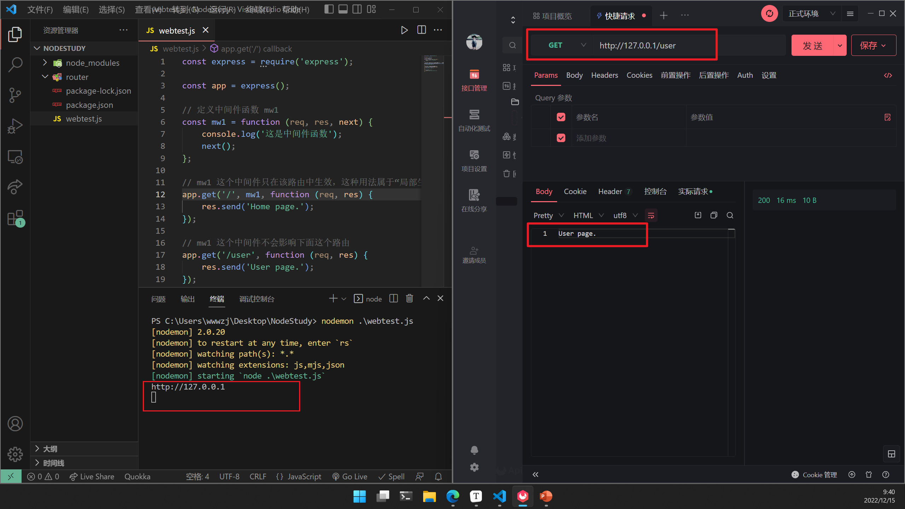

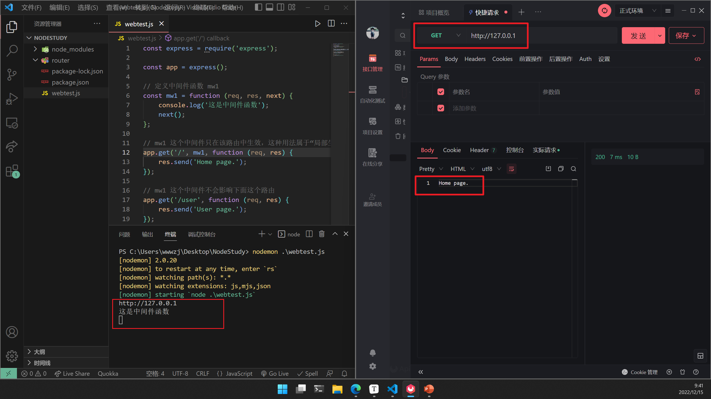

### 3.2.7 定义多个局部中间件

可以在路由中，通过如下两种等价的方式，使用多个局部中间件：

```javascript
// 以下两种写法是“完全等价”的，可根据自己的喜好，选择任意一种方式进行使用
app.get('/', mw1, mw2, (req, res) => {
    res.send('Home page.');
});

app.get('/', [mw1, mw2], (req, res) => {
    res.send('Home page.');
});
```

### 3.2.8 了解中间件的5个使用注意事项

1. **一定要在路由之前注册中间件！**
2. 客户端发送过来的请求，可以连续调用多个中间件进行处理
3. 执行完中间件的业务代码之后，不要忘记调用 next() 函数
4. 为了防止代码逻辑混乱，调用 next() 函数后不要再写额外的代码
5. 连续调用多个中间件时，多个中间件之间，共享 req 和 res 对象

## 3.3 中间件的分类

为了方便大家理解和记忆中间件的使用，Express 官方把常见的中间件用法，分成了 5 大类，分别是：

- 应用级别的中间件
- 路由级别的中间件
- 错误级别的中间件
- Express 内置的中间件
- 第三方的中间件

### 3.3.1 应用级别的中间件

通过 `app.use()` 或 `app.get()` 或 `app.post()`，绑定到 app 实例上的中间件，都叫做应用级别的中间件，代码示例如下：

```javascript
// 应用级别的中间件（全局中间件）
app.use((req, res, next) => {
    // ...
    next();
});

// 应用级别的中间件（局部中间件）
app.get('/', mw, (req, res) => {
    res.send('Home page.');
});
```

### 3.3.2 路由级别的中间件

绑定到 `express.Router()` 实例上的中间件，叫做路由级别的中间件。它的用法和应用级别中间件没有任何区别。只不过，应用级别中间件是绑定到 app 实例上，路由级别中间件绑定到 router 实例上，代码示例如下：

```javascript
var app = express();
var router = express.Router();

// 路由级别的中间件
router.use(function (req, res, next) {
    // ...
    next();
});

app.use('/', router);
```

### 3.3.3 错误级别的中间件

错误级别中间件的作用：专门用来捕获整个项目中发生的异常错误，从而防止项目异常崩溃的问题。

格式：错误级别中间件的 function 处理函数中，必须有 4 个形参，形参顺序从前到后，分别是 `err` 、`req`、 `res`、`next`。

```javascript
app.get('/', function (req, res) {				// 路由
    throw new Error('服务器内部发生了错误！');		 // 人为抛出一个自定义的错误  
    res.send('Home Page.');						
});

app.use(function (err, req, res, next) {		// 错误级别的中间件
    console.log('发生了错误：' + err.message);	// 在服务器打印错误消息
    res.send('Error!' + err.message);			// 向客户端响应错误相关的内容
});
```

> 注意：错误级别的中间件，必须注册在所有路由之后！同时，即便没有 next()，错误级别的中间件也会自动捕捉到错误后立马生效！

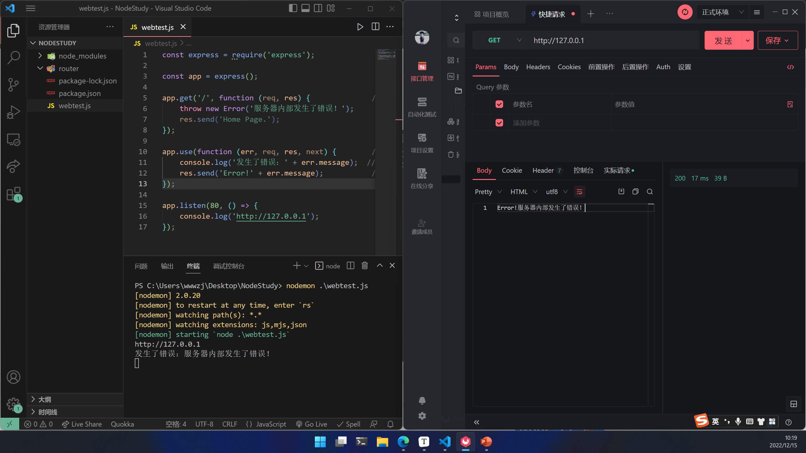

### 3.3.4 Express内置的中间件

自 Express 4.16.0 版本开始，Express 内置了 3 个常用的中间件，极大的提高了 Express 项目的开发效率和体验：

1. `express.static` 快速托管静态资源的内置中间件，例如：HTML 文件、图片、CSS 样式等（无兼容性）
2. `express.json` 解析 JSON 格式的请求体数据（有兼容性，仅在 4.16.0+ 版本中可用）
3. `express.urlencoded` 解析 URL-encoded 格式的请求体数据（有兼容性，仅在 4.16.0+ 版本中可用）

```javascript
// 配置解析 application/json 格式数据的内置中间件
app.use(express.json());
// 配置解析 application/x-www-form-urlencoded 格式数据的内置中间件
app.use(express.urlencoded({ extended: false }));
```

json 示例代码：

```javascript
const express = require('express');

const app = express();

// 注意：除了错误级别的中间件，其他的中间件，必须在路由之前进行配置
// 通过 express.json() 这个中间件，解析表单中的 JSON 格式的数据
app.use(express.json());

app.post('/user', (req, res) => {
    // 在服务器，可以使用 req.body 这个属性，来接受客服端发送过来的请求体数据
    // 默认情况下，如果不配置解析表单数据的中间件，则 req.body 默认为 undefined
    console.log(req.body);
    res.send('ok');
});

app.listen(80, () => {
    console.log('http://127.0.0.1');
});
```

Apifox 测试：

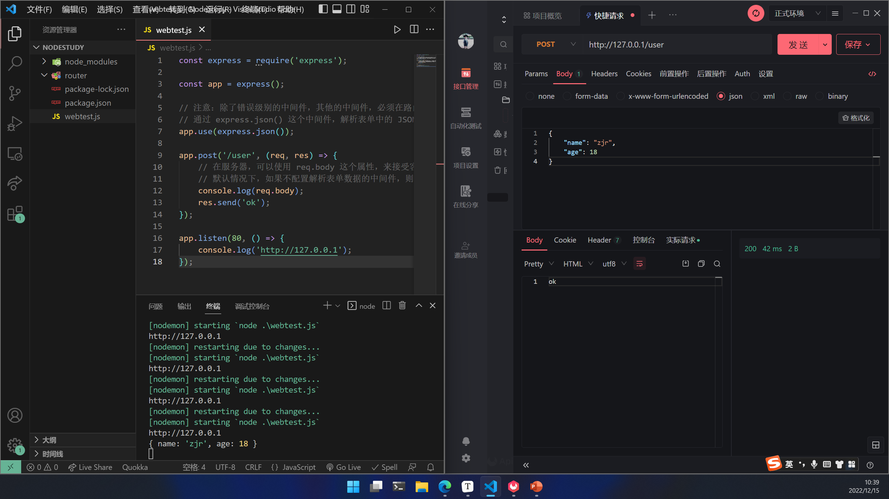

urlencoded 示例代码：

```javascript
const express = require('express');

const app = express();

// 注意：除了错误级别的中间件，其他的中间件，必须在路由之前进行配置
// 通过 express.urlencoded() 这个中间件，解析表单中的 x-www-form-urlencoded 格式的数据
app.use(express.urlencoded({ extended: false }));

app.post('/book', (req, res) => {
    // 在服务器，可以使用 req.body 这个属性，来接受客服端发送过来的请求体数据
    // 默认情况下，如果不配置解析表单数据的中间件，则 req.body 默认为 undefined
    console.log(req.body);
    res.send('ok');
});

app.listen(80, () => {
    console.log('http://127.0.0.1');
});
```

Apifox 测试：

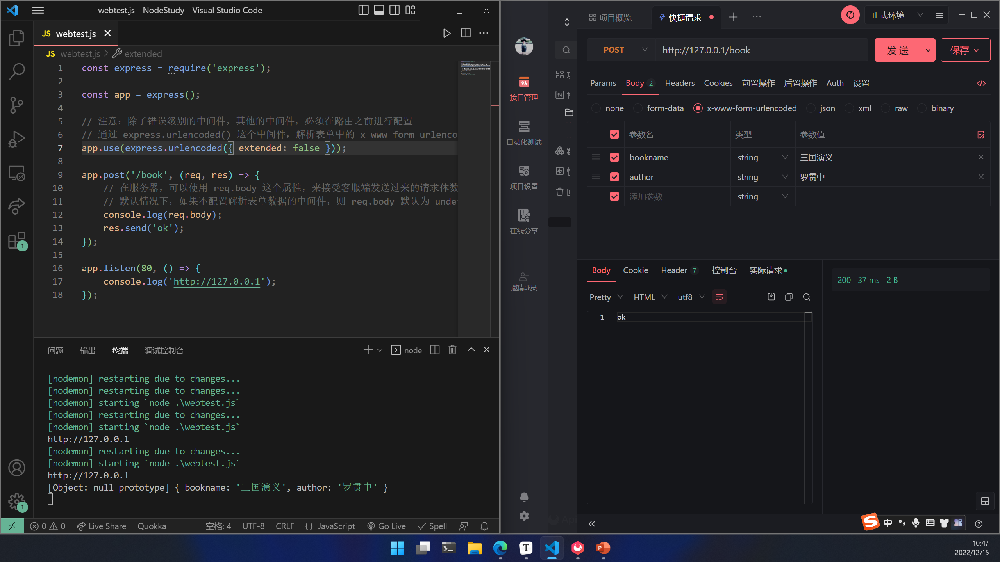

### 3.3.5 第三方的中间件

非 Express 官方内置的，而是由第三方开发出来的中间件，叫做第三方中间件。在项目中，大家可以按需下载并配置第三方中间件，从而提高项目的开发效率。

例如：在 express@4.16.0 之前的版本中，经常使用 body-parser 这个第三方中间件，来解析请求体数据。使用步骤如下：

- 运行 `npm install body-parser` 安装中间件
- 使用 `require` 导入中间件
- 调用 `app.use()` 注册并使用中间件

注意：Express 内置的 express.urlencoded 中间件，就是基于 body-parser 这个第三方中间件进一步封装出来的。

示例代码：

```javascript
const express = require('express');

const app = express();

// 导入解析表单数据的中间件 body-parser
const parser = require('body-parser');
// 使用 app.use() 注册中间件
app.use(parser.json());
app.use(parser.urlencoded({ extended: false }));

app.post('/book', (req, res) => {
    // 在服务器，可以使用 req.body 这个属性，来接受客服端发送过来的请求体数据
    // 默认情况下，如果不配置解析表单数据的中间件，则 req.body 默认为 undefined
    console.log(req.body);
    res.send('ok');
});

app.listen(80, () => {
    console.log('http://127.0.0.1');
});
```

Apifox 测试：

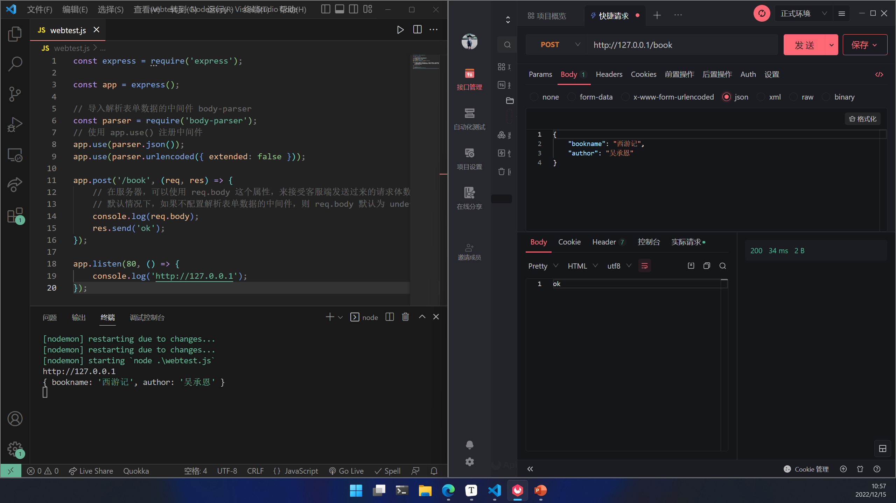

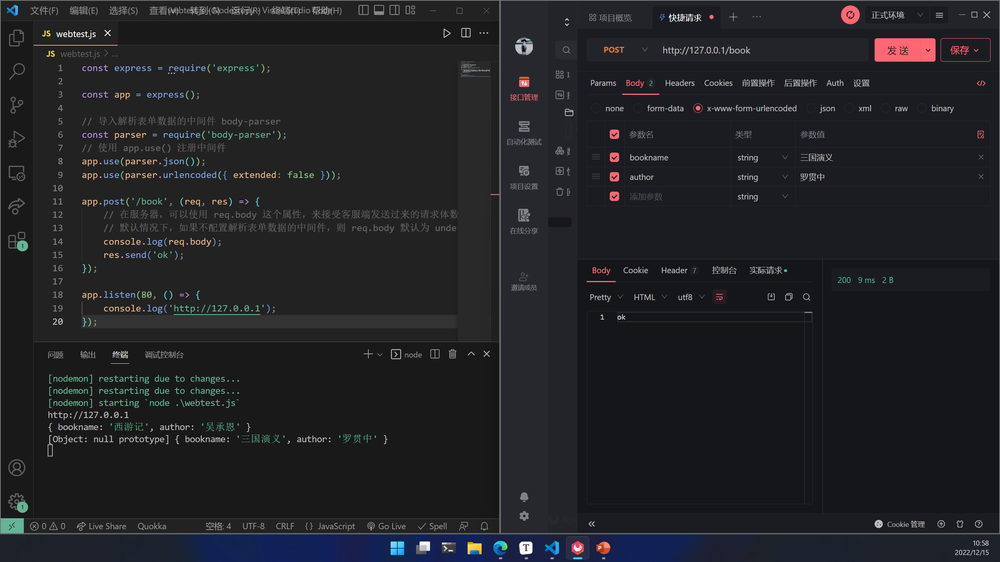

## 3.4 自定义中间件

### 3.4.1 需求描述与实现步骤

自己手动模拟一个类似于 express.urlencoded 这样的中间件，来解析 POST 提交到服务器的表单数据。

实现步骤：

- 定义中间件
- 监听 req 的 data 事件
- 监听 req 的 end 事件
- 使用 querystring 模块解析请求体数据
- 将解析出来的数据对象挂载为 req.body
- 将自定义中间件封装为模块

### 3.4.2 定义中间件

使用 `app.use()` 来定义全局生效的中间件，代码如下：

```javascript
app.use(function (req, res, next) {
    // 中间件的业务逻辑
});
```

### 3.4.3 监听req的data事件

在中间件中，需要监听 req 对象的 data 事件，来获取客户端发送到服务器的数据。

如果数据量比较大，无法一次性发送完毕，则客户端会把数据切割后，分批发送到服务器。所以 data 事件可能会触发多次，每一次触发 data 事件时，获取到数据只是完整数据的一部分，需要手动对接收到的数据进行拼接。

```javascript
// 定义变量，用来存储客户端发送过来的请求体数据
let str = '';
// 监听 req 对象的 data 事件（客户端发送过来的新的请求体数据）
req.on('data', (chunk) => {
    // 拼接请求体数据，隐式转换为字符串
    str += chunk;
});
```

### 3.4.4 监听req的end事件

当请求体数据接收完毕之后，会自动触发 req 的 end 事件。

因此，我们可以在 req 的 end 事件中，拿到并处理完整的请求体数据。示例代码如下：

```javascript
// 监听 req 对象的 end 事件（请求体发送完毕后自动触发）
req.on('end', () => {
    // 打印完整的请求体数据
    console.log(str);
    // 把字符串格式的请求体数据，解析成对象格式
});
```

### 3.4.5 使用querystring模块解析请求体数据

Node.js 内置了一个 querystring 模块，专门用来处理查询字符串。通过这个模块提供的 parse() 函数，可以轻松把查询字符串，解析成对象的格式。示例代码如下：

```javascript
// 导入处理 querystring 的 Node.js 内置模块
const qs = require('querystring');

// 调用 qs.parse() 方法，把查询字符串解析为对象
const body = qs.parse(str);
```

### 3.4.6 将解析出来的数据对象挂载为req.body

上游的中间件和下游的中间件及路由之间，**共享同一份** **req** **和** **res**。因此，我们可以将解析出来的数据，挂载为 req 的自定义属性，命名为 req.body，供下游使用。示例代码如下：

```javascript
req.on('end', () => {
    const body = qs.parse(str);	// 调用 qs.parse() 方法，把查询字符串解析为对象
    req.body = body;			// 将解析出来的请求体对象，挂载为 req.body 属性
    next();						// 最后，一定要调用 next() 函数，执行后续的业务逻辑
});
```

### 3.4.7 将自定义中间件封装为模块

为了优化代码的结构，我们可以把自定义的中间件函数，封装为独立的模块，示例代码如下：

```javascript
// custom-body-parser.js 模块中的代码
const qs = require('querystring');
function bodyParser(req, res, next) {
    // ...
}
module.exports = bodyParser;	// 向外导出解析请求体数据的中间件函数

// -------------------------------------------------------------

// 导入自定义的中间件模块
const myBodyParser = require('custom-body-parser');
// 注册自定义的中间件模块
app.use(myBodyParser);
```

---

代码示例：

```javascript
// custom-body-parser.js

// 导入 Node.js 内置的 querystring 模块
const qs = require('querystring');

const bodyParser = (req, res, next) => {
    // 定义中间件具体的业务逻辑
    // 定义一个 str 字符串，专门用来存储客户端发送过来的请求体数据
    let str = '';
    // 监听 req 的 data 事件
    req.on('data', (chunk) => {
        str += chunk;
    });
    // 监听 req 的 end 事件
    req.on('end', () => {
        // 在 str 中存放的是完整的请求体数据
        // console.log(str)
        // 把字符串格式的请求体数据，解析成对象格式
        const body = qs.parse(str);
        req.body = body;
        next();
    });
};

// 导出模块
module.exports = bodyParser;
```

```javascript
// webtest.js

// 导入 express 模块
const express = require('express');
// 创建 express 的服务器实例
const app = express();

// 导入自己封装的中间件模块
const customBodyParser = require('./custom-body-parser');
// 将自定义的中间件函数，注册为全局可用的中间件
app.use(customBodyParser);

app.post('/book', (req, res) => {
    res.send(req.body);
});

// 调用 app.listen 方法，指定端口号并启动 Web 服务器
app.listen(80, function () {
    console.log('Express server running at http://127.0.0.1');
});
```

Apifox 测试：

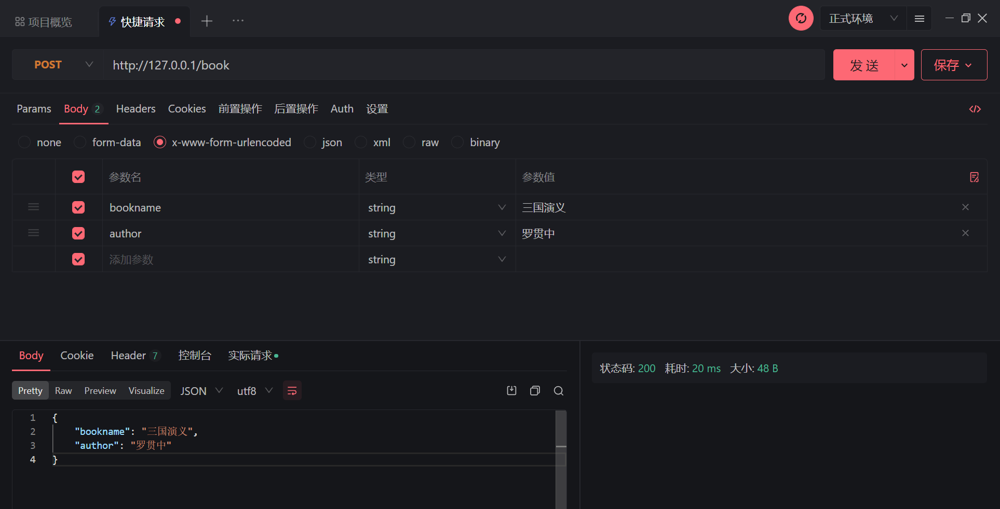

# 四、Express编写接口

## 4.1 创建基本的服务器

```javascript
// 导入 express 模块
const express = require('express');
// 创建 express 的服务器实例
const app = express();

// write your code here...

// 调用 app.listen 方法，指定端口号并启动 web 服务器
app.listen(80, function () {
    console.log('Express server running at http://127.0.0.1');
});
```

## 4.2 创建API路由模块

```javascript
// apiRouter.js【路由模块】
const express = require('express');
const apiRouter = express.Router();

// bind your router here...

module.exports = apiRouter;

// ------------------------------------------

// app.js【导入并注册路由模块】
const apiRouter = require('./apiRouter.js');
// 把路由模块，注册到 app 上
app.use('/api', apiRouter);
```

## 4.3 编写GET接口

```javascript
apiRouter.get('/get', (req, res) => {
    // 获取到客户端通过查询字符串，发送到服务器的数据
    const query = req.query;
    // 调用 res.send() 方法，把数据响应给客户端
    res.send({
        status: 0,				// 状态：0 表示成功，1 表示失败
        msg: 'GET请求成功！',	 // 状态描述
        data: query				// 需要响应给客户端的具体数据
    });
});
```

## 4.4 编写POST接口

```javascript
apiRouter.post('/post', (req, res) => {
    // 获取客户端通过请求体，发送到服务器的 URL-encoded 数据
    const body = req.body;
    // 调用 res.send() 方法，把数据响应给客户端
    res.send({
        status: 0,				// 状态：0 表示成功，1 表示失败
        msg: 'POST请求成功！',	 // 状态描述消息
        data: body				// 需要响应给客户端的具体数据
    });
});
```

注意：如果要获取 URL-encoded 格式的请求体数据，必须配置中间件 `app.use(express.urlencoded({ extended: false }))`。JSON 格式数据，同理。

---

代码示例：

```javascript
// apiRouter.js

const express = require('express');
const router = express.Router();

// 在这里挂载对应的路由
router.get('/get', (req, res) => {
  // 通过 req.query 获取客户端通过查询字符串，发送到服务器的数据
  const query = req.query;
  // 调用 res.send() 方法，向客户端响应处理的结果
  res.send({
    status: 0,				   // 0 表示处理成功，1 表示处理失败
    msg: 'GET 请求成功！',		// 状态的描述
    data: query                // 需要响应给客户端的数据
  });
});

// 定义 POST 接口
router.post('/post', (req, res) => {
  // 通过 req.body 获取请求体中包含的 url-encoded 格式的数据
  const body = req.body;
  // 调用 res.send() 方法，向客户端响应结果
  res.send({
    status: 0,
    msg: 'POST 请求成功！',
    data: body
  });
});

module.exports = router;
```

```javascript
// webtest.js

// 导入 express
const express = require('express');
// 创建服务器实例
const app = express();

// 配置解析表单数据的中间件
// 注册解析表单数据的中间件，必须放在注册路由模块前，否则就不生效了
app.use(express.urlencoded({ extended: false }));

// 导入 apiRouter 模块
const apiRouter = require('./router/apiRouter');
// 把路由模块，注册到 app 上
app.use('/api', apiRouter);

// 启动服务器
app.listen(80, () => {
    console.log('express server running at http://127.0.0.1');
});
```

Apifox 测试：

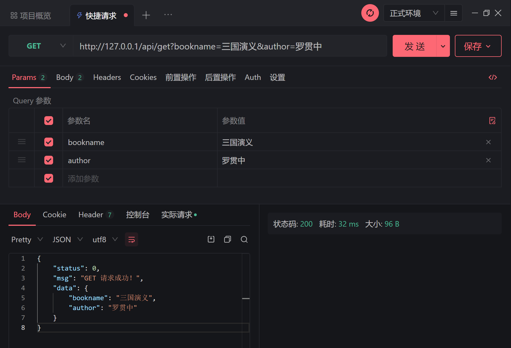

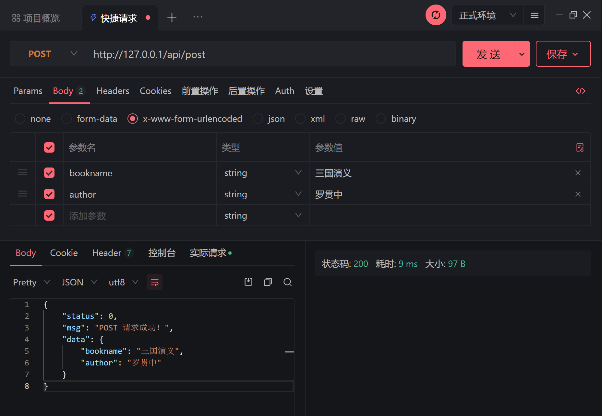

## 4.5 CORS跨域资源共享

### 4.5.1 接口的跨域问题

刚才编写的 GET 和 POST接口，存在一个很严重的问题：不支持跨域请求。

解决接口跨域问题的方案主要有两种：

- CORS（主流的解决方案，推荐使用）
- JSONP（有缺陷的解决方案：只支持 GET 请求）

### 4.5.2 使用cors中间件解决跨域问题

cors 是 Express 的一个第三方中间件。通过安装和配置 cors 中间件，可以很方便地解决跨域问题。

使用步骤分为如下 3 步：

- 运行 `npm install cors` 安装中间件
- 使用 `const cors = require('cors')` 导入中间件
- 在路由之前调用 `app.use(cors())` 配置中间件

### 4.5.3 什么是CORS

CORS （Cross-Origin Resource Sharing，跨域资源共享）由一系列 HTTP 响应头组成，这些 HTTP 响应头决定浏览器是否阻止前端 JS 代码跨域获取资源。

浏览器的同源安全策略默认会阻止网页“跨域”获取资源。但如果接口服务器配置了 CORS 相关的 HTTP 响应头，就可以解除浏览器端的跨域访问限制。

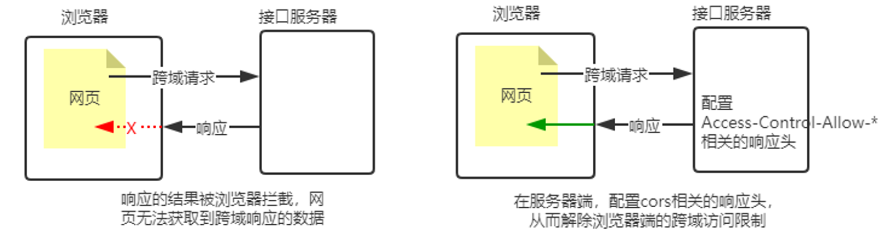

### 4.5.4 CORS的注意事项

- CORS 主要在服务器端进行配置。客户端浏览器无须做任何额外的配置，即可请求开启了 CORS 的接口。
- CORS 在浏览器中有兼容性。只有支持 XMLHttpRequest Level2 的浏览器，才能正常访问开启了 CORS 的服务端接口（例如：IE10+、Chrome4+、FireFox3.5+）。

### 4.5.5 CORS响应头部Access-Control-Allow-Origin

响应头部中可以携带一个 **Access-Control-Allow-Origin** 字段，其语法如下:

```javascript
Access-Control-Allow-Origin: <origin> | *
```

其中，origin 参数的值指定了允许访问该资源的外域 URL。

例如，下面的字段值将只允许来自 http://itcast.cn 的请求：

```javascript
res.setHeader('Access-Control-Allow-Origin', 'http://itcast.cn')
```

如果指定了 Access-Control-Allow-Origin 字段的值为通配符 `*`，表示允许来自任何域的请求，示例代码如下：

```javascript
res.setHeader('Access-Control-Allow-Origin', '*')
```

### 4.5.6 CORS响应头部Access-Control-Allow-Headers

默认情况下，CORS 仅支持客户端向服务器发送如下的 9 个请求头：

Accept、Accept-Language、Content-Language、DPR、Downlink、Save-Data、Viewport-Width、Width 、Content-Type （值仅限于 text/plain、multipart/form-data、application/x-www-form-urlencoded 三者之一）

如果客户端向服务器发送了额外的请求头信息，则需要在服务器端，通过 Access-Control-Allow-Headers 对额外的请求头进行声明，否则这次请求会失败！

```javascript
// 允许客户端额外向服务器发送 Content-Type 请求头和 X-Custom-Header 请求头
// 注意：多个请求头之间使用英文的逗号进行分割
res.setHeader('Access-Control-Allow-Headers', 'Content-Type, X-Custom-header')
```

### 4.5.7 CORS响应头部Access-Control-Allow-Methods

默认情况下，CORS 仅支持客户端发起 GET、POST、HEAD 请求。

如果客户端希望通过 PUT、DELETE 等方式请求服务器的资源，则需要在服务器端，通过 Access-Control-Alow-Methods 来指明实际请求所允许使用的 HTTP 方法。

示例代码如下：

```javascript
// 只允许 POST、GET、DELETE、HEAD 请求方法
res.setHeader('Access-Control-Alow-Methods', 'POST, GET, DELETE, HEAD')
// 允许所有的 HTTP 请求方法
res.setHeader('Access-Control-Alow-Methods', '*')
```

### 4.5.8 CORS请求的分类

客户端在请求 CORS 接口时，根据请求方式和请求头的不同，可以将 CORS 的请求分为两大类，分别是：

- 简单请求
- 预检请求

### 4.5.9 简单请求

同时满足以下两大条件的请求，就属于简单请求：

- 请求方式：GET、POST、HEAD 三者之一
- HTTP 头部信息不超过以下几种字段：无自定义头部字段、Accept、Accept-Language、Content-Language、DPR、Downlink、Save-Data、Viewport-Width、Width 、Content-Type（只有三个值 application/x-www-form-urlencoded、multipart/form-data、text/plain）

### 4.5.10 预检请求

只要符合以下任何一个条件的请求，都需要进行预检请求：

- 请求方式为 GET、POST、HEAD 之外的请求 Method 类型
- 请求头中包含自定义头部字段
- 向服务器发送了 application/json 格式的数据

在浏览器与服务器正式通信之前，浏览器会先发送 OPTION 请求进行预检，以获知服务器是否允许该实际请求，所以这一次的 OPTION 请求称为“预检请求”。服务器成功响应预检请求后，才会发送真正的请求，并且携带真实数据。

### 4.5.11 简单请求和预检请求的区别

**简单请求的特点：**客户端与服务器之间只会发生一次请求。

**预检请求的特点：**客户端与服务器之间会发生两次请求，OPTION 预检请求成功之后，才会发起真正的请求。

## 4.6 JSONP接口

### 4.6.1 回顾JSONP的概念与特点

概念：浏览器端通过 `<script>` 标签的 `src` 属性，请求服务器上的数据，同时，服务器返回一个函数的调用。这种请求数据的方式叫做 JSONP。

特点：

- JSONP 不属于真正的 Ajax 请求，因为它没有使用 XMLHttpRequest 这个对象
- JSONP 仅支持 GET 请求，不支持 POST、PUT、DELETE 等请求

### 4.6.2 创建JSONP接口的注意事项

如果项目中已经配置了 CORS 跨域资源共享，为了**防止冲突**，必须在配置 CORS 中间件之前声明 JSONP 的接口。否则 JSONP 接口会被处理成开启了 CORS 的接口。示例代码如下：

```javascript
// 优先创建 JSONP 接口【这个接口不会被处理成 CORS 接口】
app.get('/api/jsonp', (req, res) => { });

// 再配置 CORS 中间件【后续的所有接口，都会被处理成 CORS 接口】
app.use(cors());

// 这是一个开启了 CORS 的接口
app.get('/api/get', (req, res) => { });
```

### 4.6.3 实现JSONP接口的步骤

1. 获取客户端发送过来的回调函数的名字
2. 得到要通过 JSONP 形式发送给客户端的数据
3. 根据前两步得到的数据，拼接出一个函数调用的字符串
4. 把上一步拼接得到的字符串，响应给客户端的 `<script>` 标签进行解析执行

### 4.6.4 实现JSONP接口的具体代码

```javascript
app.get('/api/jsonp', (req, res) => {
    // 获取客户端发送过来的回调函数的名字
    const funcName = req.query.callback;
    // 得到要通过 JSONP 形式发送给客户端的数据
    const data = { name: 'zjr', age: 22};
    // 根据前两步得到的数据，拼接出一个函数调用的字符串
    const scriptStr = `${funcName}(${JSON.stringify(data)})`;
    // 把上一步拼接得到的字符串，响应给客户端的 <script> 标签进行解析执行
    res.send(scriptStr);
});
```

### 4.6.5 在网页中使用jQuery发起JSONP请求

调用 `$.ajax()` 函数，提供 JSONP 的配置选项，从而发起 JSONP 请求，示例代码如下：

```javascript
$('#btnJSONP').on('click', function () {
   $.ajax({
       method:'GET',
       url: 'http://127.0.0.1/api/jsonp',
       dataType: 'jsonp', 	// 表示要发起 JSONP 的请求
       success: function (res) {
           console.log(res);
       }
   });
});
```

