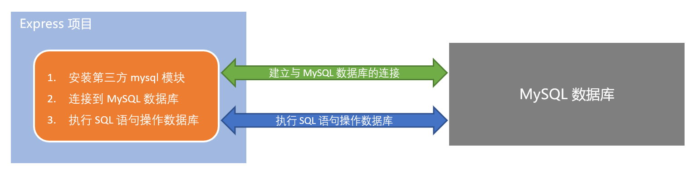
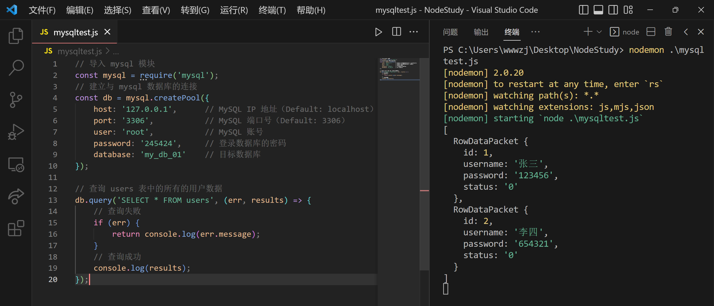
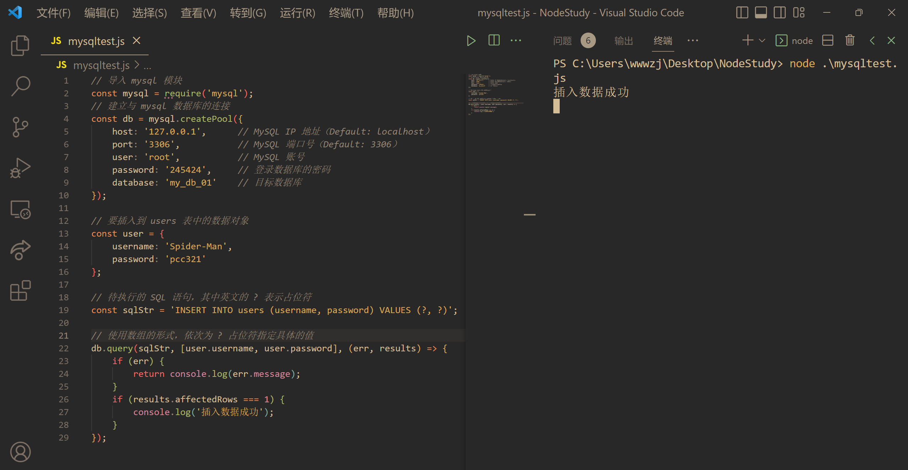
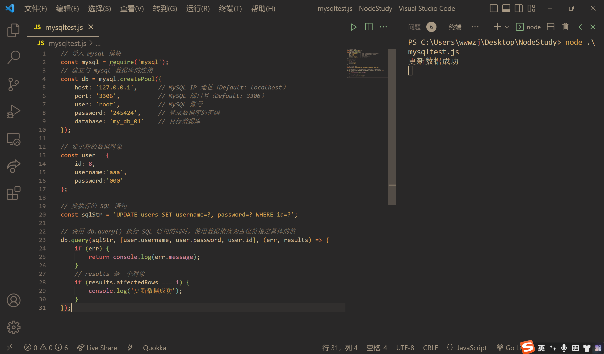
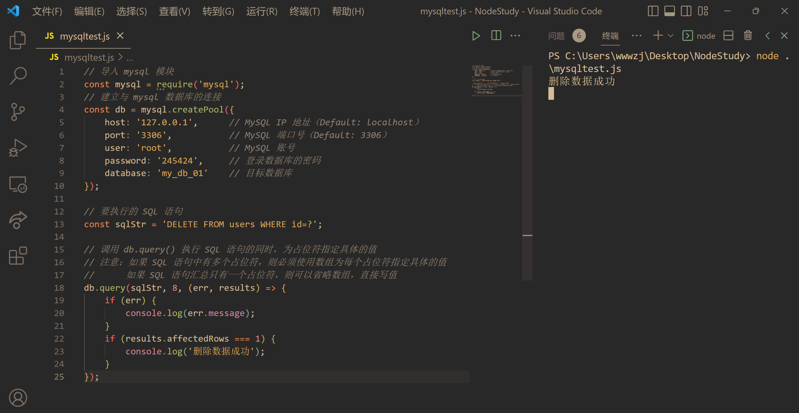
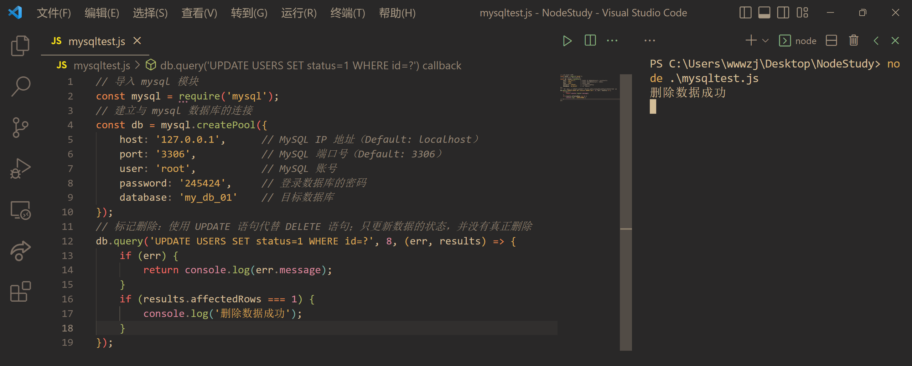

# 【MySQL模块】

> 原创内容，转载请注明出处！

# 一、在Node.js中操作MySQL

## 1.1 在项目中操作MySQL的步骤

- 安装操作 MySQL 数据库的第三方模块（mysql）
- 通过 mysql 模块连接到 MySQL 数据库
- 通过 mysql 模块执行 SQL 语句



## 1.2 安装与配置mysql模块

### 1.2.1 安装mysql模块

mysql 模块是托管于 npm 上的第三方模块。它提供了在 Node.js 项目中连接和操作 MySQL 数据库的能力。

想要在项目中使用它，需要先运行如下命令，将 mysql 安装为项目的依赖包：

```shell
npm install mysql
```

### 1.2.2 配置mysql模块

在使用 mysql 模块操作 MySQL 数据库之前，必须先对 mysql 模块进行必要的配置，主要的配置步骤如下：

```javascript
// 导入 mysql 模块
const mysql = require('mysql');
// 建立与 mysql 数据库的连接
const db = mysql.createPool({
    host: '127.0.0.1',		// MySQL IP 地址（Default: localhost）
    port: '3306',           // MySQL 端口号（Default: 3306）
    user: 'root',			// MySQL 账号
    password: '123456',		// 登录数据库的密码
    database: 'my_db_01'	// 目标数据库
});
```

### 1.2.3 测试mysql模块能否正常工作

调用 `db.query()` 函数，指定要执行的 SQL 语句，通过回调函数拿到执行的结果：

```javascript
// 检测 mysql 模块能否正常工作
db.query('SELECT 1', (err, results) => {
    // 判断 err 是否为 null
    if (err) {
        return console.log(err.message);
    }
    // 只要能打印出 [ RowDataPacket { '1':1 } ] 的结果，就证明数据库连接正常
    console.log(results);
});
```

## 1.3 使用mysql模块操作MySQL数据库

### 1.3.1 查询数据

查询 users 表中所有的数据：

```javascript
// 查询 users 表中的所有的用户数据
db.query('SELECT * FROM users', (err, results) => {
    // 查询失败
    if (err) {
        return console.log(err.message);
    }
    // SELECT 查询得到的 results 是一个数组
    // 查询成功
    console.log(results);
});
```



### 1.3.2 插入数据

向 users 表中新增数据， 其中 username 为 Spider-Man，password 为 pcc321。示例代码如下：

```javascript
// 要插入到 users 表中的数据对象
const user = {
    username: 'Spider-Man',
    password: 'pcc321'
};

// 待执行的 SQL 语句，其中英文的 ? 表示占位符
const sqlStr = 'INSERT INTO users (username, password) VALUES (?, ?)';

// 使用数组的形式，依次为 ? 占位符指定具体的值
db.query(sqlStr, [user.username, user.password], (err, results) => {
    if (err) {
        return console.log(err.message);
    }
    // 注意：如果执行的是 INSERT INTO 插入语句，则 results 是一个对象
    // 受到影响的行数 === 1
    if (results.affectedRows === 1) {
        console.log('插入数据成功');
    }
});
```



### 1.3.3 插入数据的便捷方式

向表中新增数据时，如果数据对象的每个属性和数据表的**字段一一对应**，则可以通过如下方式快速插入数据：

```javascript
// 要插入到 users 表中的数据对象
const user = {
    username: 'Super-Man', 
    password: 'pcc123'
};

// 待执行的 SQL 语句，其中英文的 ? 表示占位符
const sqlStr = 'INSERT INTO users SET ?';

// 直接将数据对象当作占位符的值
db.query(sqlStr, user, (err, results) => {
    if (err) {
        return console.log(err.message);
    }
    if (results.affectedRows === 1) {
        console.log('插入数据成功');
    }
});
```

### 1.3.4 更新数据

可以通过如下方式，更新表中的数据：

```javascript
// 要更新的数据对象
const user = {
    id: 7,
    username:'aaa',
    password:'000'
};

// 要执行的 SQL 语句
const sqlStr = 'UPDATE users SET username=?, password=? WHERE id=?';

// 调用 db.query() 执行 SQL 语句的同时，使用数据依次为占位符指定具体的值
db.query(sqlStr, [user.username, user.password, user.id], (err, results) => {
    if (err) {
        return console.log(err.message);
    }
    // results 是一个对象
    if (results.affectedRows === 1) {
        console.log('更新数据成功');
    }
});
```



### 1.3.5 更新数据的便捷方式

```javascript
// 要更新的数据对象
const user = {
    id: 8,
    username: 'aaaa', 
    password: '0000'
};

// 要执行的 SQL 语句
const sqlStr = 'UPDATE users SET ? WHERE id=?';

// 调用 db.query() 执行 SQL 语句的同时，使用数据依次为占位符指定具体的值
db.query(sqlStr, [user, user.id], (err, results) => {
    if (err) {
        console.log(err.message);
    }
    if (results.affectedRows === 1) {
        console.log('更新数据成功');
    }
});
```

### 1.3.6 删除数据

在删除数据时，推荐根据 id 这样的唯一标识，来删除对应的数据。实例如下：

```javascript
// 要执行的 SQL 语句
const sqlStr = 'DELETE FROM users WHERE id=?';

// 调用 db.query() 执行 SQL 语句的同时，为占位符指定具体的值
// 注意：如果 SQL 语句中有多个占位符，则必须使用数组为每个占位符指定具体的值
//      如果 SQL 语句汇总只有一个占位符，则可以省略数组，直接写值
db.query(sqlStr, 8, (err, results) => {
    if (err) {
        console.log(err.message);
    }
    if (results.affectedRows === 1) {
        console.log('删除数据成功');
    }
});
```



### 1.3.7 标记删除

使用 DELETE 语句，会把真正的把数据从表中删除掉。为了保险起见，推荐使用标记删除的形式，来模拟删除的动作。

所谓的标记删除，就是在表中设置类似于 status 这样的状态字段，来标记当前这条数据是否被删除。

当用户执行了删除的动作时，我们并没有执行 DELETE 语句把数据删除掉，而是执行了 UPDATE 语句，将这条数据对应的 status 字段标记为删除即可。

```javascript
// 标记删除：使用 UPDATE 语句代替 DELETE 语句；只更新数据的状态，并没有真正删除
db.query('UPDATE USERS SET status=1 WHERE id=?', 8, (err, results) => {
    if (err) {
        return console.log(err.message);
    }
    if (results.affectedRows === 1) {
        console.log('删除数据成功');
    }
});
```


