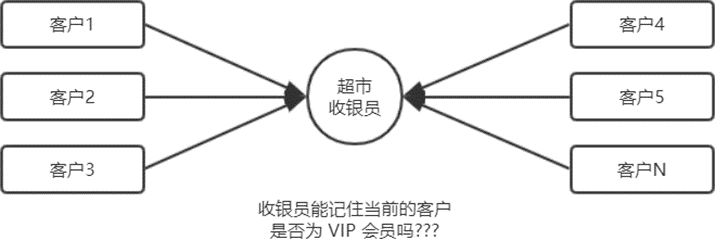
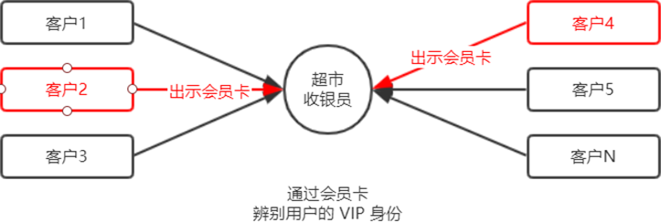
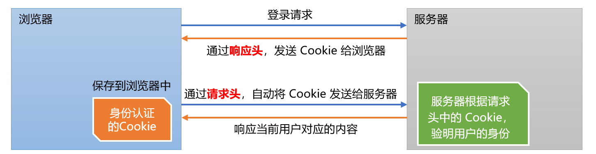
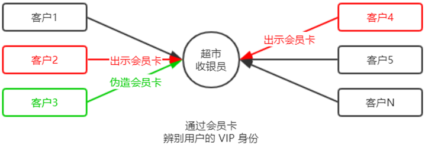
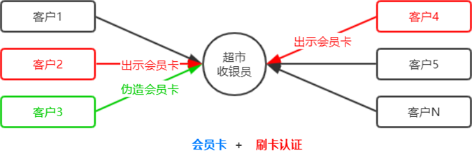
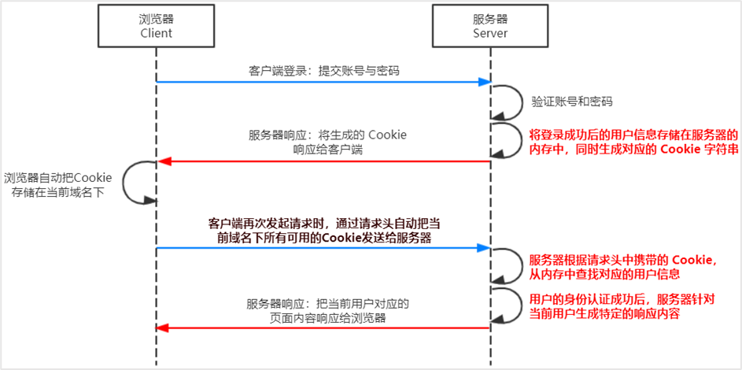
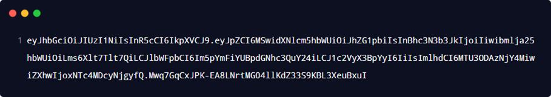
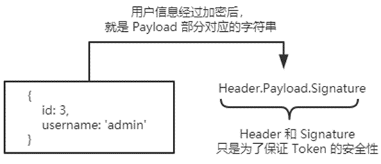

# 前后端身份认证

> 原创内容，转载请注明出处！

# 一、Web开发模式

目前主流的 Web 开发模式有两种，分别是：

- 基于服务端渲染的传统 Web 开发模式
- 基于前后端分离的新型 Web 开发模式

## 1.1 服务端渲染的Web开发模式

服务端渲染的概念：服务器发送给客户端的 HTML 页面，是在服务器通过字符串的拼接，动态生成的。因此，客户端不需要使用 Ajax 这样的技术额外请求页面的数据。代码示例如下：

```javascript
app.get('/index.html', (req, res) => {
    // 要渲染的数据
    const user = {
        name: 'zjr',
        age: 18
    };
    // 服务端通过字符串的拼接，动态生成 HTML 内容
    const html = `<h1>姓名：${user.name}，年龄：${user.age}</h1>`;
    // 把生成好的 HTML 页面响应给客户端
    res.send(html);
});
```

## 1.2 服务端渲染的优缺点

优点：

- **前端耗时少！**因为服务器端负责动态生成 HTML 内容，浏览器只需要直接渲染页面即可。
- **有利于 SEO！**因为服务器端响应的是完整的 HTML 页面内容，所以搜索引擎爬虫更容易爬取获得信息。

缺点：

- **占用服务器端资源！**由服务端完成 HTML 页面内容的生成，如果请求较多，会对服务器造成一定的访问压力。
- **开发效率低！**使用服务器端渲染，则无法进行分工合作，尤其对于前端复杂度高的项目，不利于项目高效开发。

## 1.3 前后端分离的Web开发模式

前后端分离的概念：前后端分离的开发模式，依赖于 Ajax 技术的广泛应用。简而言之，前后端分离的 Web 开发模式，就是后端只负责提供 API 接口，前端使用 Ajax 调用接口的开发模式。

## 1.4 前后端分离的优缺点

优点：

- **开发体验好！**前端专注于 UI 页面的开发，后端专注于 API 的开发，且前端有更多的选择性。
- **用户体验好！**Ajax 技术的广泛应用，极大的提高了用户的体验，可以轻松实现页面的局部刷新。
- **减轻了服务器端的渲染压力！**因为页面最终是在每个用户的浏览器中生成的。

缺点：

- **不利于 SEO！**。因为完整的 HTML 页面需要在客户端动态拼接完成，所以爬虫无法爬取页面的有效信息。（解决方案：利用 Vue、React 等前端框架的 SSR（server side render）技术能够很好的解决前后端分离下的 SEO 问题！）

> SEO：搜索引擎优化！
>
> 前后端分离不利于 SEO，为什么？
>
> 搜索引擎的基础爬虫的原理就是抓取你的 url，然后获取你的 html 源代码并解析。 当的页面采用了 vue 等 js 的数据绑定机制来展示页面数据，爬虫获取到的 html 是你的模型页面而不是最终数据的渲染页面，所以说用 js 来渲染数据对 seo 并不友好。

## 1.5 如何选择Web开发模式

不谈业务场景而盲目选择使用何种开发模式都是耍流氓。

- 比如企业级官网，主要功能是展示而没有复杂的交互，并且需要良好的 SEO，则这时我们就需要使用服务器端渲染。
- 而类似后台管理项目，交互性比较强，不需要考虑 SEO，那么就可以使用前后端分离的开发模式。

另外，具体使用何种开发模式并不是绝对的，为了同时兼顾首页的渲染速度和前后端分离的开发效率，一些网站采用了首屏服务端渲染 + 其他页面前后端分离的开发模式。

# 二、身份认证

## 2.1 什么是身份认证

身份认证（Authentication）又称“身份验证”、“鉴权”，是指通过一定的手段，完成对用户身份的确认。

- 日常生活中的身份认证随处可见，例如：高铁的验票乘车，手机的密码或指纹解锁，支付宝或微信的支付密码等。
- 在 Web 开发中，也涉及到用户身份的认证，例如：各大网站的手机验证码登录、邮箱密码登录、二维码登录等。

## 2.2 为什么需要身份认证

身份认证的目的，是为了确认当前所声称为某种身份的用户，确实是所声称的用户。例如，你去找快递员取快递，你要怎么证明这份快递是你的。

在互联网项目开发中，如何对用户的身份进行认证，是一个值得深入探讨的问题。

## 2.3 不同开发模式下的身份认证

对于服务端渲染和前后端分离这两种开发模式来说，分别有着不同的身份认证方案：

- 服务端渲染推荐使用 **Session** **认证机制**
- 前后端分离推荐使用 **JWT** **认证机制**

# 三、Session认证机制

## 3.1 HTTP协议的无状态性

了解 HTTP 协议的无状态性是进一步学习 Session 认证机制的必要前提。

HTTP 协议的无状态性，指的是客户端的每次 HTTP 请求都是独立的，连续多个请求之间没有直接的关系，服务器不会主动保留每次 HTTP 请求的状态。



## 3.2 如何突破HTTP无状态的限制

对于超市来说，为了方便收银员在进行结算时给 VIP 用户打折，超市可以为每个 VIP 用户发放会员卡。



注意：现实生活中的会员卡身份认证方式，在 Web 开发中的专业术语叫做 **Cookie**。

## 3.3 什么是Cookie

Cookie 是存储在用户浏览器中的一段不超过 4 KB 的字符串。它由一个名称（Name）、一个值（Value）和其它几个用于控制 Cookie 有效期、安全性、使用范围的可选属性组成。

不同域名下的 Cookie 各自独立，每当客户端发起请求时，会自动把**当前域名下**所有未过期的 Cookie 一同发送到服务器。

Cookie 的几大特性：

- 自动发送
- 域名独立
- 过期时限
- 4KB 限制

## 3.4 Cookie在算法认证中的作用

客户端第一次请求服务器的时候，服务器通过响应头的形式，向客户端发送一个身份认证的 Cookie，客户端会自动将 Cookie 保存在浏览器中。

随后，当客户端浏览器每次请求服务器的时候，浏览器会自动将身份认证相关的 Cookie，通过请求头的形式发送给服务器，服务器即可验明客户端的身份。



## 3.5 Cookie不具有安全性

由于 Cookie 是存储在浏览器中的，而且浏览器也提供了读写 Cookie 的 API，因此 Cookie 很容易被伪造，不具有安全性。因此不建议服务器将重要的隐私数据，通过 Cookie 的形式发送给浏览器。



注意：千万不要使用 Cookie 存储重要且隐私的数据！比如用户的身份信息、密码等。

## 3.6 提高身份认证的安全性

为了防止客户伪造会员卡，收银员在拿到客户出示的会员卡之后，可以在收银机上进行刷卡认证。只有收银机确认存在的会员卡，才能被正常使用。



这种“会员卡 + 刷卡认证”的设计理念，就是 Session 认证机制的精髓。

## 3.7 Session的工作原理



# 四、在Express中使用Session认证

## 4.1 安装express-session中间件

在 Express 项目中，只需要安装 express-session 中间件，即可在项目中使用 Session 认证：

```shell
npm install express-session
```

## 4.2 配置express-session中间件

express-session 中间件安装成功后，需要通过 app.use() 来注册 session 中间件，示例代码如下：

```javascript
// 导入 Session 中间件
const session = require('express-session');

// 配置 Session 中间件
app.use(session({
    secret: 'keyboard cat',		// secret 属性的值可以为任意字符串
    resave: false,				// 固定写法
    saveUninitialized: true		// 固定写法
}));
```

## 4.3 向session中存储数据

当 express-session 中间件配置成功后，即可通过 req.session 来访问和使用 session 对象，从而存储用户的关键信息：

```javascript
app.post('/api/login', (req, res) => {
    // 判断用户提交的登录信息是否正确
    if (req.body.username !== 'admin' || req.body.password !== '000000') {
        return res.send({
            status: 1, 
            msg: '登录失败'
        });
    }
    
    req.session.user = req.body;	// 将用户的信息，存储到 Session 中
    req.session.islogin = true;		// 将用户的登录状态，存储到 Session 中
    
    res.send({
        status: 0,
        msg: '登录成功'
    });
});
```

## 4.4 从session中取数据

可以直接从 req.session 对象上获取之前存储的数据，示例代码如下：

```javascript
// 获取用户姓名的接口
app.get('/api/username', (req, res) => {
    // 判断用户是否登录
    if (!req.session.islogin) {
        return res.send({
            status: 1,
            msg: 'fail'
        });
    }
    
    res.send({
        status: 0,
        msg: 'success',
        username: req.session.user.username
    });
});
```

## 4.5 清空session

调用 req.session.destroy() 函数，即可清空当前用户在服务器保存的 session 信息。

```javascript
// 退出登录的接口
app.post('/api/logout', (req, res) => {
    // 清空当前客户端对应的 session 信息
    req.session.destroy();
    res.send({
        status: 0,
        msg: '退出登录成功'
    });
});
```

# 五、JWT认证机制

## 5.1 了解Session认证的局限性

Session 认证机制需要配合 Cookie 才能实现。由于 Cookie 默认不支持跨域访问，所以，当涉及到前端跨域请求后端接口的时候，需要做很多额外的配置，才能实现跨域 Session 认证。

注意：

- 当前端请求后端接口不存在跨域问题的时候，推荐使用 Session 身份认证机制。
- 当前端需要跨域请求后端接口的时候，不推荐使用 Session 身份认证机制，推荐使用 JWT 认证机制。

## 5.2 什么是JWT

JWT（英文全称：JSON Web Token）是目前最流行的跨域认证解决方案。

## 5.3 JWT的工作原理


总结：用户的信息通过 Token 字符串的形式，保存在客户端浏览器中。服务器通过还原 Token 字符串的形式来认证用户的身份。

## 5.4 JWT的组成部分

JWT 通常由三部分组成，分别是 Header（头部）、Payload（有效荷载）、Signature（签名）。

三者之间使用英文的 `.` 分 隔，格式如下：

```javascript
Header.Payload.Signature
```

下面是 JWT 字符串的示例：



## 5.5 JWT三个部分各自的含义

JWT 的三个组成部分，从前到后分别是 Header、Payload、Signature。

其中：

- Payload 部分才是真正的用户信息，它是用户信息经过加密之后生成的字符串。
- Header 和 Signature 是安全性相关的部分，只是为了保证 Token 的安全性。



## 5.6 JWT的使用方式

客户端收到服务器返回的 JWT 之后，通常会将它储存在 localStorage 或 sessionStorage 中。

此后，客户端每次与服务器通信，都要带上这个 JWT 的字符串，从而进行身份认证。推荐的做法是把 JWT 放在 HTTP 请求头的 Authorization 字段中，格式如下：

```javascript
Authorization: Bearer <token>
```

# 六、在Express中使用JWT

## 6.1 安装JWT相关包

运行如下命令，安装如下两个 JWT 相关的包：

```shell
npm install jsonwebtoken express-jwt
```

其中：

- jsonwebtoken 用于生成 JWT 字符串
- express-jwt 用于将 JWT 字符串解析还原成 JSON 对象

## 6.2 导入JWT相关包

使用 require() 函数，分别导入 JWT 相关的两个包：

```javascript
// 导入用于生成 JWT 字符串的包
const jwt = require('jsonwebtoken');
// 导入用于将客户端发送过来的 JWT 字符串，解析还原成 JSON 对象的包
const expressJWT = require('express-jwt');
```

## 6.3 定义secret密钥

为了保证 JWT 字符串的安全性，防止 JWT 字符串在网络传输过程中被别人破解，我们需要专门定义一个用于加密和解密的 secret 密钥：

- 当生成 JWT 字符串的时候，需要使用 secret 密钥对用户的信息进行加密，最终得到加密好的 JWT 字符串
- 当把 JWT 字符串解析还原成 JSON 对象的时候，需要使用 secret 密钥进行解密

```javascript
// secret 密钥的本质：就是一个字符串
const secretKey = 'itheima No1 ^_^';
```

## 6.4 在登录成功后生成JWT字符串

调用 jsonwebtoken 包提供的 `sign()` 方法，将用户的信息加密成 JWT 字符串，响应给客户端：

```javascript
// 登录接口
app.post('/api/login', function (req, res) => {
         // ... 省略登录失败情况下的代码
         
         const tokenStr = jwt.sign({ username: userinfo.username }, secretKey, { expiresIn: '30s' });
         // 用户登录成功之后，生成 JWT 字符串，通过 token 属性响应给客户端
         res.send({
         	status: 200,
         	message: '登录成功！',
         	// 调用 jwt.sign() 生成 JWT 字符串，三个参数分别是：用户信息对象、加密密钥、配置对象
         	token: tokenStr;
         });
});
```

## 6.5 将JWT字符串还原为JSON对象

客户端每次在访问那些有权限接口的时候，都需要主动通过请求头中的 Authorization 字段，将 Token 字符串发送到服务器进行身份认证。

此时，服务器可以通过 express-jwt 这个中间件，自动将客户端发送过来的 Token 解析还原成 JSON 对象：

```javascript
// 使用 app.use() 来注册中间件
// expressJWT( { secret: secretKey } ) 就是用来解析 Token 的中间件
// .unless({ path: [/^\/api\//] }) 用来指定哪些接口不需要访问权限
app.use(expressJWT({ secret: secretKey }).unless({ path: [/^\/api\//] }));
```

## 6.6 使用req.user获取用户信息

当 express-jwt 这个中间件配置成功之后，即可在那些有权限的接口中，使用 req.user 对象，来访问从 JWT 字符串中解析出来的用户信息了，示例代码如下：

```javascript
// 这是一个有权限的 API 接口
app.get('/admin/getinfo', function(req, res) {
    // 只要配置成功了 express-jwt 这个中间件，就会把解析出来的用户信息，自动挂载到 req.user 属性上
    // 新版本 req.user 被替换为了 req.auth
    console.log(req.user);
    res.send({
        status: 200,
        message: '获取用户信息成功',
        data: req.user
    });
});
```

> 注意：千万不要把密码这种信息加密到 token 中！

## 6.7 捕获解析JWT失败后产生的错误

当使用 express-jwt 解析 Token 字符串时，如果客户端发送过来的 Token 字符串过期或不合法，会产生一个解析失败的错误，影响项目的正常运行。我们可以通过 Express 的错误中间件，捕获这个错误并进行相关的处理，示例代码如下：

```javascript
app.use((err, req, res, next) => {
    // token 解析失败导致的错误
    if (err.name === 'UnauthorizedError') {
        return res.send({ status: 401, message: '无效的token' });
    }
    // 其它原因导致的错误
    res.send({ status: 500, message: '未知错误' });
});
```

---

# 七、推荐视频

[【Cookie、Session、Token究竟区别在哪？如何进行身份认证，保持用户登录状态？】](https://www.bilibili.com/video/BV1ob4y1Y7Ep/?share_source=copy_web&vd_source=f142a37c45de7b8323eedf220d9dcdd1)
