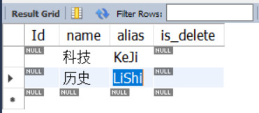
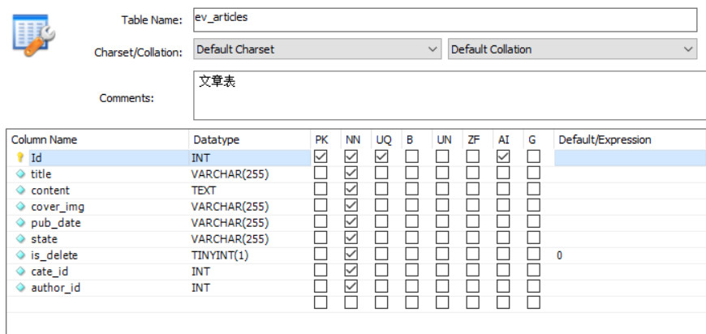

# 【api接口项目案例】

> 本项目的 API 文档：https://5fb05ilz4j.apifox.cn
>
> 提示：请配合 API 文档进行学习！

# 一、初始化

## 1.1 创建项目

1. 新建 `api_server` 文件夹作为项目根目录，并在项目根目录中运行如下的命令，初始化包管理配置文件：

```bash
npm init -y
```

2. 运行如下的命令，安装特定版本的 `express`：

```bash
npm i express@4.17.1
```

3. 在项目根目录中新建 `app.js` 作为整个项目的入口文件，并初始化如下的代码：

```js
// 导入 express 模块
const express = require('express');
// 创建 express 的服务器实例
const app = express();

// write your code here...

// 调用 app.listen 方法，指定端口号并启动 web 服务器
app.listen(8080, function () {
  console.log('api server running at http://127.0.0.1:8080');
});
```

## 1.2 配置cors跨域

1. 运行如下的命令，安装 `cors` 中间件：

```bash
npm i cors@2.8.5
```

2. 在 `app.js` 中导入并配置 `cors` 中间件：

```js
// 导入 cors 中间件
const cors = require('cors');
// 将 cors 注册为全局中间件
app.use(cors());
```

## 1.3 配置解析表单数据的中间件

通过如下的代码，配置解析 `application/x-www-form-urlencoded` 格式的表单数据的中间件：

```js
app.use(express.urlencoded({ extended: false }));
```

该项目中没有涉及对于 `application/json` 格式请求数据的处理，但是这也是非常重要的！如果你要使用，那么你应该在 app.js 中加上：

```js
app.use(express.json());

app.use((req, res, next) => {
    res.setHeader('Access-Control-Allow-Headers', 'Content-Type');
    next();
});
```

由于后续 JWT 的处理需要读取 Authorization 请求头，所以我们顺便把 Authorization 也加上：
```js
app.use(express.json());

app.use((req, res, next) => {
    res.setHeader('Access-Control-Allow-Headers', 'Content-Type,Authorization');
    next();
});
```

cors 包是支持配置的，我们可以直接对 cors 包进行配置，而不用去手动修改。

具体配置文档：[cors - npm (npmjs.com)](https://www.npmjs.com/package/cors)

例如：

```js
const corsOptions = {
    origin: '*',
    methods: 'GET,HEAD,PUT,PATCH,POST,DELETE',
    allowedHeaders: 'Content-Type,Authorization',
    preflightContinue: false,
    optionsSuccessStatus: 204
};

app.use(cors(corsOptions));
```

## 1.4 初始化路由相关的文件夹

1. 在项目根目录中，新建 `router` 文件夹，用来存放所有的 `路由模块`
   
   > 路由模块中，只存放客户端的请求与处理函数之间的映射关系
2. 在项目根目录中，新建 `router_handler` 文件夹，用来存放所有的 `路由处理函数模块`
   
   > 路由处理函数模块中，专门负责存放每个路由对应的处理函数

## 1.5 初始化用户路由模块

1. 在 `router` 文件夹中，新建 `user.js` 文件，作为用户的路由模块，并初始化代码如下：

```js
const express = require('express');
// 创建路由对象
const router = express.Router();

// 注册新用户
router.post('/reguser', (req, res) => {
  res.send('reguser OK');
});

// 登录
router.post('/login', (req, res) => {
  res.send('login OK');
});

// 将路由对象共享出去
module.exports = router;
```

2. 在 `app.js` 中，导入并使用用户路由模块：

```js
// 导入并注册用户路由模块
const userRouter = require('./router/user');
app.use('/api', userRouter);
```

## 1.6 抽离用户路由模块中的处理函数

> 目的：为了保证 `路由模块` 的纯粹性，所有的 `路由处理函数`，必须抽离到对应的 `路由处理函数模块` 中

1. 在 `/router_handler/user.js` 中，使用 `exports` 对象，分别向外共享如下两个 `路由处理函数` ：

```js
/**
 * 在这里定义和用户相关的路由处理函数，供 /router/user.js 模块进行调用
 */

// 注册用户的处理函数
exports.regUser = (req, res) => {
  res.send('reguser OK');
};

// 登录的处理函数
exports.login = (req, res) => {
  res.send('login OK');
};
```

2. 将 `/router/user.js` 中的代码修改为如下结构：

```js
const express = require('express');
const router = express.Router();

// 导入用户路由处理函数模块
const userHandler = require('../router_handler/user');

// 注册新用户
router.post('/reguser', userHandler.regUser);
// 登录
router.post('/login', userHandler.login);

module.exports = router;
```

# 二、登录注册

## 2.1 新建ev_users表

在 `api_server` 数据库中，新建 `ev_users` 表如下：


## 2.2 安装并配置mysql模块

> 在 API 接口项目中，需要安装并配置 `mysql` 这个第三方模块，来连接和操作 MySQL 数据库

1. 运行如下命令，安装 `mysql` 模块：

```bash
npm i mysql@2.18.1
```

2. 在项目根目录中新建 `/db/connect.js` 文件，在此自定义模块中创建数据库的连接对象：

```js
// 导入 mysql 模块
const mysql = require('mysql');

// 创建数据库连接对象
const db = mysql.createPool({
  host: '127.0.0.1',
  user: 'root',
  password: '123456',
  database: 'api_server',
});

// 向外共享 db 数据库连接对象
module.exports = db;
```

## 2.3 注册

### 2.3.1 实现步骤

1. 检测表单数据是否合法
2. 检测用户名是否被占用
3. 对密码进行加密处理
4. 插入新用户

### 2.3.2 检测表单数据是否合法

判断用户名和密码是否为空

```js
// 接收表单数据
const userinfo = req.body;
// 判断数据是否合法
if (!userinfo.username || !userinfo.password) {
  return res.send({ status: 'no', message: '用户名或密码不能为空！' });
}
```

### 2.3.3 检测用户名是否被占用

1. 导入数据库操作模块：

```js
const db = require('../db/connect');
```

2. 定义 SQL 语句：

```js
const sql = 'SELECT * FROM ev_users WHERE username=?';
```

3. 执行 SQL 语句并根据结果判断用户名是否被占用：

```js
db.query(sql, userinfo.username, function (err, results) {
  // 执行 SQL 语句失败
  if (err) {
    return res.send({ status: 'no', message: err.message });
  }
  // 用户名被占用
  if (results.length === 1) {
    return res.send({ status: 'no', message: '用户名被占用，请更换其他用户名！' });
  } else if (results.length !== 0) {
    return res.send({ status: 'no', message: '注册异常，请稍后再试！' });
  }
  // 用户名可用，继续后续流程...
});
```

### 2.3.4 对密码进行加密处理

> 为了保证密码的安全性，不建议在数据库以 `明文` 的形式保存用户密码，推荐对密码进行 `加密存储`

---

在当前项目中，使用 `bcryptjs` 对用户密码进行加密，优点：

- 加密之后的密码，无法被逆向破解
- 同一明文密码多次加密，得到的加密结果各不相同，保证了安全性

---

1. 运行如下命令，安装指定版本的 `bcryptjs` ：

```bash
npm i bcryptjs@2.4.3
```

2. 在 `/router_handler/user.js` 中，导入 `bcryptjs` ：

```js
const bcrypt = require('bcryptjs');
```

3. 在注册用户的处理函数中，确认用户名可用之后，调用 `bcrypt.hashSync(明文密码, 随机盐的长度)` 方法，对用户的密码进行加密处理：

```js
// 对用户的密码，进行 bcrypt 加密，返回值是加密之后的密码字符串
userinfo.password = bcrypt.hashSync(userinfo.password, 6);
```

### 2.3.5 插入新用户

1. 定义插入用户的 SQL 语句：

```js
const sql = 'INSERT INTO ev_users SET ?';
```

2. 调用 `db.query()` 执行 SQL 语句，插入新用户：

```js
db.query(sql, userinfo, (err, results) => {
  // 执行 SQL 语句失败
  if (err) {
      return res.send({ status: 'no', message: err.message });
  }
  // SQL 语句执行成功，但影响行数不为 1
  if (results.affectedRows !== 1) {
    return res.send({ status: 'no', message: '注册异常，请稍后再试！' });
  }
  // 注册成功
  res.send({ status: 'ok', message: '注册成功！' });
});
```

## 2.4 优化res.send()代码

> 在处理函数中，需要多次调用 `res.send()` 向客户端响应 `处理失败` 的结果，为了简化代码，可以手动封装一个 `res.fastSend()` 函数

在 `app.js` 中，所有路由之前，声明一个全局中间件，为 res 对象挂载一个 `res.fastSend()` 函数：

```js
// 快速响应状态中间件
app.use((req, res, next) => {
    // status = 'ok' 成功状态
    // status = 'no' 失败状态（默认）
    res.fastSend = (info, status = 'no') => {
        res.send({
            status,
            // 判断 info 是否为一个 Error 对象，如果是返回 Error.message，否则返回 info
            message: info instanceof Error ? info.message : info
        });
    };
    next();
});
```

将之前用 `res.send()` 返回状态及状态信息的方法都可以替换为 `res.fastSend()`：

- `res.fastSend('用户名已存在');`
- `res.fastSend(err);`
- `res.fastSend('注册成功', 'ok');`

## 2.5 优化表单数据验证

> 表单验证的原则：前端验证为辅，后端验证为主，后端**永远不要相信**前端提交过来的**任何内容**

在实际开发中，前后端都需要对表单的数据进行合法性的验证，而且**后端作为数据合法性验证的最后一个关口**，在拦截非法数据方面，起到了至关重要的作用。

单纯的使用 `if...else...` 的形式对数据合法性进行验证，效率低下、出错率高、维护性差。因此，推荐使用**第三方数据验证模块**，来降低出错率、提高验证的效率与可维护性，**让后端程序员把更多的精力放在核心业务逻辑的处理上**。

1. 安装 `joi` 包，为表单中携带的每个数据项，定义验证规则：

```bash
npm i joi@17.4.0
```

2. 安装 `@escook/express-joi` 中间件，来实现自动对表单数据进行验证的功能：

```bash
npm i @escook/express-joi
```

3. 新建 `/schema/user.js` 用户信息验证规则模块，并初始化代码如下：

```js
const joi = require('joi');

// string()         值必须是字符串
// alphanum()       值只能是包含 a-zA-Z0-9 的字符串
// min(length)      最小长度
// max(length)      最大长度
// required()       值是必填项，不能为 undefined
// pattern(RegExp)  值必须符合正则表达式的规则

// 用户名的验证规则
const username = joi.string().alphanum().min(1).max(10).required();
// 密码的验证规则（6-15位非空字符序列）
const password = joi
    .string()
    .pattern(/^[\S]{6,15}$/)
    .required();

// 注册和登录的验证规则对象
exports.reg_login_schema = {
    // 对 req.body 中的数据进行验证
    body: {
        username,
        password
    }
};
```

4. 修改 `/router/user.js` 中的代码如下：

```js
const express = require('express');
const router = express.Router();

// 导入用户路由处理函数模块
const userHandler = require('../router_handler/user');

// 导入验证表单数据的中间件
const expressJoi = require('@escook/express-joi');
// 导入需要的验证规则对象
const { reg_login_schema } = require('../schema/user');

// 注册新用户
// 在注册新用户的路由中，声明局部中间件，对当前请求中携带的数据进行验证
// 数据验证通过后，会把这次请求流转给后面的路由处理函数
// 数据验证失败后，终止后续代码的执行，并抛出一个全局的 Error 错误，进入全局错误级别中间件中进行处理
router.post('/reguser', expressJoi(reg_login_schema), userHandler.regUser);
// 用户登录
router.post('/login', userHandler.login);

module.exports = router;
```

5. 在 `app.js` 的全局错误级别中间件中，捕获验证失败的错误，并把验证失败的结果响应给客户端：

```js
const joi = require('joi');

// 放在最后
// 错误处理中间件
app.use(function (err, req, res, next) {
  // 数据验证失败
  if (err instanceof joi.ValidationError) return res.fastSend(err);
  // 未知错误
  res.fastSend(err);
});
```

## 2.6 登录

### 2.6.1 实现步骤

1. 检测表单数据是否合法
2. 根据用户名查询用户的数据
3. 判断用户输入的密码是否正确
4. 生成 JWT 的 Token 字符串

### 2.6.2 检测登录表单的数据是否合法

1. 将 `/router/user.js` 中 `登录` 的路由代码修改如下：

```js
// 登录的路由
router.post('/login', expressJoi(reg_login_schema), userHandler.login);
```

### 2.6.3 根据用户名查询用户的数据

1. 接收表单数据：

```js
const userinfo = req.body;
```

2. 定义 SQL 语句：

```js
const sql = 'SELECT * FROM ev_users WHERE username=?';
```

3. 执行 SQL 语句，查询用户的数据：

```js
db.query(sql, userinfo.username, function (err, results) {
  // 执行 SQL 语句失败
  if (err) {
      return res.fastSend(err);
  }
  // 执行 SQL 语句成功，但是查询到数据条数不等于 1
  if (results.length === 0) {
      return res.fastSend('用户名不存在！');
  } else if (results.length !== 1) {
      return res.fastSend('登录异常，请稍后再试！');
  }
  // 判断用户输入的登录密码是否和数据库中的密码一致
});
```

### 2.6.4 判断用户输入的密码是否正确

> 核心实现思路：调用 `bcrypt.compareSync(用户提交的密码, 数据库中的密码)` 方法比较密码是否一致

> 返回值是布尔值（true 一致、false 不一致）

具体的实现代码如下：

```js
// 拿着用户输入的密码,和数据库中存储的密码进行对比
const compareResult = bcrypt.compareSync(userinfo.password, results[0].password);

// 如果对比的结果等于 false, 则证明用户输入的密码错误
if (!compareResult) {
  return res.fastSend('密码错误！');
}

// 登录成功，生成 Token 字符串
```

### 2.6.5 生成JWT的Token字符串

> 核心注意点：在生成 Token 字符串的时候，一定要剔除 **密码** 和 **头像** 的值，Token 不能包含敏感信息和过长的无用信息。

1. 通过 ES6 的高级语法，快速剔除 `密码` 和 `头像` 的值：

```js
// 剔除完毕之后，user 中只保留了用户的 id, username, nickname, email 这四个属性的值
const user = { ...results[0], password: '', user_pic: '' };
```

2. 运行如下的命令，安装生成 Token 字符串的包：

```bash
npm i jsonwebtoken@8.5.1
```

3. 在 `/router_handler/user.js` 模块的头部区域，导入 `jsonwebtoken` 包：

```js
// 用这个包来生成 Token 字符串
const jwt = require('jsonwebtoken');
```

4. 创建 `config.js` 文件，并向外共享 **加密** 和 **还原** Token 的 `jwtSecretKey` 字符串：

```js
module.exports = {
  jwtSecretKey: 'I Love Node. ^_^',
};
```

5. 将用户信息对象加密成 Token 字符串：

```js
// 导入配置文件
const config = require('../config');

// 生成 Token 字符串
const tokenStr = jwt.sign(user, config.jwtSecretKey, {
  expiresIn: '10h', // token 有效期为 10 个小时
});
```

6. 将生成的 Token 字符串响应给客户端：

```js
res.send({
  status: 'ok',
  message: '登录成功！',
  // 为了方便客户端使用 Token，在服务器端直接拼接上 Bearer 的前缀
  // 客户端拿到 token 后直接保存到 Storage 中，下次请求时放在请求头中的 Authorization 字段中发送
  token: 'Bearer ' + tokenStr,
});
```

## 2.7 配置解析Token的中间件

1. 运行如下的命令，安装解析 Token 的中间件：

```js
npm i express-jwt@5.3.3
```

2. 在 `app.js` 中注册路由之前，配置解析 Token 的中间件：

```js
// 导入配置文件
const config = require('./config');

// 解析 token 的中间件
const expressJWT = require('express-jwt');

// 使用 .unless({ path: [/^\/api\//] }) 指定哪些接口不需要进行 Token 的身份认证
app.use(expressJWT({ secret: config.jwtSecretKey }).unless({ path: [/^\/api\//] }));
```

3. 在 `app.js` 中的 `错误级别中间件` 里面，捕获并处理 Token 认证失败后的错误：

```js
// 错误中间件
app.use(function (err, req, res, next) {
  // 省略其它代码...

  // 捕获身份认证失败的错误
  if (err.name === 'UnauthorizedError') return res.fastSend('身份认证失败！');

  // 未知错误...
});
```

# 三、个人中心

## 3.1 获取用户的基本信息

### 3.1.1 实现步骤

1. 初始化路由模块
2. 初始化路由处理函数模块
3. 获取用户的基本信息

### 3.1.2 初始化路由模块

1. 创建 `/router/userinfo.js` 路由模块，并初始化如下的代码结构：

```js
// 导入 express
const express = require('express');
// 创建路由对象
const router = express.Router();

// 获取用户的基本信息
router.get('/userinfo', (req, res) => {
  res.send('ok');
});

// 向外共享路由对象
module.exports = router;
```

2. 在 `app.js` 中导入并使用个人中心的路由模块：

```js
// 导入并使用用户信息路由模块
const userinfoRouter = require('./router/userinfo');
// 注意：以 /my 开头的接口，都是有权限的接口，需要进行 Token 身份认证
app.use('/my', userinfoRouter);
```

### 3.1.3 初始化路由处理函数模块

1. 创建 `/router_handler/userinfo.js` 路由处理函数模块，并初始化如下的代码结构：

```js
// 获取用户基本信息的处理函数
exports.getUserInfo = (req, res) => {
  res.send('ok');
};
```

2. 修改 `/router/userinfo.js` 中的代码如下：

```js
const express = require('express');
const router = express.Router();

// 导入用户信息的处理函数模块
const userinfo_handler = require('../router_handler/userinfo');

// 获取用户的基本信息
router.get('/userinfo', userinfo_handler.getUserInfo);

module.exports = router;
```

### 3.1.4 获取用户的基本信息

1. 在 `/router_handler/userinfo.js` 头部导入数据库操作模块：

```js
// 导入数据库操作模块
const db = require('../db/connect');
```

2. 定义 SQL 语句：

```js
// 根据用户的 id，查询用户的基本信息
// 注意：为了防止用户的密码泄露，需要排除 password 字段
const sql = 'SELECT id, username, nickname, email, user_pic FROM ev_users WHERE id=?';
```

3. 调用 `db.query()` 执行 SQL 语句：

```js
// 注意：req 对象上的 user 属性，是 Token 解析成功，express-jwt 中间件帮我们挂载上去的
// 附：最新的 express-jwt 中间件，Token 解析结果是挂载到 auth 属性上的
// Token 生成时包含了哪些数据，Token 解析后 user 属性中也就有那些数据
db.query(sql, req.user.id, (err, results) => {
  // 执行 SQL 语句失败
  if (err) {
      return res.fastSend(err);
  } 

  // 执行 SQL 语句成功，但是查询到的数据条数不等于 1
  if (results.length !== 1) {
      return res.fastSend('获取用户信息失败，请稍后再试！');
  } 

  // 将用户信息响应给客户端
  res.send({
    status: 'ok',
    message: '获取用户基本信息成功！',
    data: results[0],
  });
});
```

## 3.2 更新用户的基本信息

### 3.2.1 实现步骤

1. 定义路由和处理函数
2. 验证表单数据
3. 实现更新用户基本信息的功能

### 3.2.2 定义路由和处理函数

1. 在 `/router/userinfo.js` 模块中，新增 `更新用户基本信息` 的路由：

```js
// 更新用户的基本信息
router.post('/userinfo', userinfo_handler.updateUserInfo);
```

2. 在 `/router_handler/userinfo.js` 模块中，定义并向外共享 `更新用户基本信息` 的路由处理函数：

```js
// 更新用户基本信息的处理函数
exports.updateUserInfo = (req, res) => {
  res.send('ok');
};
```

### 3.2.3 验证表单数据

1. 在 `/schema/user.js` 验证规则模块中，定义 `id`，`nickname`，`email` 的验证规则如下：

```js
// 定义 id, nickname, email 的验证规则
const id = joi.number().integer().min(1).required();
const nickname = joi.string().required();
const email = joi.string().email();
```

2. 并使用 `exports` 向外共享如下的 `验证规则对象`：

```js
// 验证规则对象 - 更新用户基本信息
exports.update_userinfo_schema = {
  body: {
    id,
    nickname,
    email,
  },
};
```

3. 在 `/router/userinfo.js` 模块中，导入验证数据合法性的中间件：

```js
// 导入验证数据合法性的中间件
const expressJoi = require('@escook/express-joi');
```

4. 在 `/router/userinfo.js` 模块中，导入需要的验证规则对象：

```js
// 导入需要的验证规则对象
const { update_userinfo_schema } = require('../schema/user');
```

5. 在 `/router/userinfo.js` 模块中，修改 `更新用户的基本信息` 的路由如下：

```js
// 更新用户的基本信息
router.post('/userinfo', expressJoi(update_userinfo_schema), userinfo_handler.updateUserInfo);
```

### 3.2.4 实现更新用户基本信息的功能

1. 定义待执行的 SQL 语句：

```js
const sql = 'UPDATE ev_users SET ? WHERE id=?';
```

2. 调用 `db.query()` 执行 SQL 语句并传参：

```js
db.query(sql, [req.body, req.body.id], (err, results) => {
  // 执行 SQL 语句失败
  if (err) {
      return res.fastSend(err);
  }

  // 执行 SQL 语句成功，但影响行数不为 1
  if (results.affectedRows !== 1) {
      return res.fastSend('修改用户基本信息失败！');
  }

  // 修改用户信息成功
  res.fastSend('修改用户基本信息成功！', 'ok');
});
```

## 3.3 重置密码

### 3.3.1 实现步骤

1. 定义路由和处理函数
2. 验证表单数据
3. 实现重置密码的功能

### 3.3.2 定义路由和处理函数

1. 在 `/router/userinfo.js` 模块中，新增 `重置密码` 的路由：

```js
// 重置密码的路由
router.post('/updatepwd', userinfo_handler.updatePassword);
```

2. 在 `/router_handler/userinfo.js` 模块中，定义并向外共享 `重置密码` 的路由处理函数：

```js
// 重置密码的处理函数
exports.updatePassword = (req, res) => {
  res.send('ok');
};
```

### 3.3.3 验证表单数据

> 核心验证思路：旧密码与新密码，必须符合密码的验证规则，并且新密码不能与旧密码一致！

1. 在 `/schema/user.js` 模块中，使用 `exports` 向外共享如下的 `验证规则对象`：

```js
// 验证规则对象 - 重置密码
exports.update_password_schema = {
  body: {
    // 使用 password 这个规则，验证 req.body.oldPwd 的值
    oldPwd: password,
    // 使用 joi.not(joi.ref('oldPwd')).concat(password) 规则，验证 req.body.newPwd 的值
    // 解读：
    // joi.ref('oldPwd') 表示 newPwd 的值必须和 oldPwd 的值保持一致
    // joi.not(joi.ref('oldPwd')) 表示 newPwd 的值不能等于 oldPwd 的值
    // .concat() 用于合并 joi.not(joi.ref('oldPwd')) 和 password 这两条验证规则
    newPwd: joi.not(joi.ref('oldPwd')).concat(password),
  },
};
```

2. 在 `/router/userinfo.js` 模块中，导入需要的验证规则对象：

```js
// 导入需要的验证规则对象
const { update_password_schema } = require('../schema/user');
```

3. 并在 `重置密码的路由` 中，使用 `update_password_schema` 规则验证表单的数据，示例代码如下：

```js
router.post('/updatepwd', expressJoi(update_password_schema), userinfo_handler.updatePassword);
```

### 3.3.4 实现重置密码的功能

1. 根据 `id` 查询用户是否存在：

```js
// 定义根据 id 查询用户数据的 SQL 语句
const sql = 'SELECT * FROM ev_users WHERE id=?';;

// 执行 SQL 语句查询用户是否存在
db.query(sql, req.user.id, (err, results) => {
  // 执行 SQL 语句失败
  if (err) {
      return res.fastSend(err);
  } 

  // 检查指定 id 的用户是否存在
  if (results.length !== 1) {
      return res.fastSend('用户状态异常！');
  }

  // 判断提交的旧密码是否正确
});
```

2. 判断提交的旧密码是否正确：

```js
// 在头部区域导入 bcryptjs 后，
// 即可使用 bcrypt.compareSync(提交的密码，数据库中的密码) 方法验证密码是否正确
// compareSync() 函数的返回值为布尔值，true 表示密码正确，false 表示密码错误
const bcrypt = require('bcryptjs');

// 判断提交的旧密码是否正确
const compareResult = bcrypt.compareSync(req.body.oldPwd, results[0].password);
if (!compareResult) return res.fastSend('原密码错误！');
```

3. 对新密码进行 `bcrypt` 加密之后，更新到数据库中：

```js
// 定义更新用户密码的 SQL 语句
const sql2 = 'UPDATE ev_users SET password=? WHERE id=?';

// 对新密码进行 bcrypt 加密处理
const newPwd = bcrypt.hashSync(req.body.newPwd, 6);

// 执行 SQL 语句，根据 id 更新用户的密码
db.query(sql2, [newPwd, req.user.id], (err, results) => {
  // SQL 语句执行失败
  if (err) {
      return res.fastSend(err);
  }

  // SQL 语句执行成功，但是影响行数不等于 1
  if (results.affectedRows !== 1) {
      return res.fastSend('更新密码异常，请稍后再试！');
  }

  // 更新密码成功
  res.fastSend('更新密码成功！', 'ok');
});
```

## 3.4 更新用户头像

### 3.4.1 实现步骤

1. 定义路由和处理函数
2. 验证表单数据
3. 实现更新用户头像的功能

### 3.4.2 定义路由和处理函数

1. 在 `/router/userinfo.js` 模块中，新增 `更新用户头像` 的路由：

```js
// 更新用户头像的路由
router.post('/update/avatar', userinfo_handler.updateAvatar);
```

2. 在 `/router_handler/userinfo.js` 模块中，定义并向外共享 `更新用户头像` 的路由处理函数：

```js
// 更新用户头像的处理函数
exports.updateAvatar = (req, res) => {
  res.send('ok');
};
```

### 3.4.3 验证表单数据

1. 在 `/schema/user.js` 验证规则模块中，定义 `avatar` 的验证规则如下：

```js
// dataUri() 指的是如下格式的字符串数据：
// data:image/png;base64,VE9PTUFOWVNFQ1JFVFM=
const avatar = joi.string().dataUri().required();
```

2. 并使用 `exports` 向外共享如下的 `验证规则对象`：

```js
// 验证规则对象 - 更新头像
exports.update_avatar_schema = {
  body: {
    avatar,
  },
};
```

3. 在 `/router/userinfo.js` 模块中，导入需要的验证规则对象：

```js
const { update_avatar_schema } = require('../schema/user');
```

4. 在 `/router/userinfo.js` 模块中，修改 `更新用户头像` 的路由如下：

```js
router.post('/update/avatar', expressJoi(update_avatar_schema), userinfo_handler.updateAvatar);
```

### 3.4.4 实现更新用户头像的功能

1. 定义更新用户头像的 SQL 语句：

```js
const sql = 'UPDATE ev_users SET user_pic=? WHERE id=?';
```

2. 调用 `db.query()` 执行 SQL 语句，更新对应用户的头像：

```js
db.query(sql, [req.body.avatar, req.user.id], (err, results) => {
  // 执行 SQL 语句失败
  if (err) {
      return res.fastSend(err);
  }

  // 执行 SQL 语句成功，但是影响行数不等于 1
  if (results.affectedRows !== 1) {
      return res.fastSend('更新头像异常，请稍后再试！');
  }

  // 更新用户头像成功
  res.fastSend('更新头像成功！', 'ok');
});
```

# 四、文章分类管理

## 4.1 新建ev_article_cate表

### 4.1.1 创建表结构


### 4.1.2 新增两条初始数据



## 4.2 获取文章分类列表

### 4.2.1 实现步骤

1. 初始化路由模块
2. 初始化路由处理函数模块
3. 获取文章分类列表数据

### 4.2.2 初始化路由模块

1. 创建 `/router/artcate.js` 路由模块，并初始化如下的代码结构：

```js
// 导入 express
const express = require('express');
// 创建路由对象
const router = express.Router();

// 获取文章分类的列表数据
router.get('/cates', (req, res) => {
  res.send('ok');
});

// 向外共享路由对象
module.exports = router;
```

2. 在 `app.js` 中导入并使用文章分类的路由模块：

```js
// 导入并使用文章分类路由模块
const artCateRouter = require('./router/artcate');
// 为文章分类的路由挂载统一的访问前缀 /my/artcate
app.use('/my/artcate', artCateRouter);
```

### 4.2.3 初始化路由处理函数模块

1. 创建 `/router_handler/artcate.js` 路由处理函数模块，并初始化如下的代码结构：

```js
// 获取文章分类列表数据的处理函数
exports.getArticleCates = (req, res) => {
  res.send('ok');
};
```

2. 修改 `/router/artcate.js` 中的代码如下：

```js
const express = require('express');
const router = express.Router();

// 导入文章分类的路由处理函数模块
const artcate_handler = require('../router_handler/artcate');

// 获取文章分类的列表数据
router.get('/cates', artcate_handler.getArticleCates);

module.exports = router;
```

### 4.2.4 获取文章分类列表数据

1. 在 `/router_handler/artcate.js` 头部导入数据库操作模块：

```js
// 导入数据库操作模块
const db = require('../db/connect');
```

2. 定义 SQL 语句：

```js
// 根据分类的状态，获取所有未被删除的分类列表数据
// is_delete 为 0 表示没有被标记为删除的数据
const sql = 'SELECT * FROM ev_article_cate WHERE is_delete=0 ORDER BY id ASC';
```

3. 调用 `db.query()` 执行 SQL 语句：

```js
db.query(sql, (err, results) => {
  // 执行 SQL 语句失败
  if (err) {
      return res.fastSend(err);
  }

  // 执行 SQL 语句成功
  res.send({
    status: 'ok',
    message: '获取文章分类列表成功！',
    data: results,
  });
});
```

## 4.3 新增文章分类

### 4.3.1 实现步骤

1. 定义路由和处理函数
2. 验证表单数据
3. 查询 `分类名称` 与 `分类别名` 是否被占用
4. 实现新增文章分类的功能

### 4.3.2 定义路由和处理函数

1. 在 `/router/artcate.js` 模块中，添加 `新增文章分类` 的路由：

```js
// 新增文章分类的路由
router.post('/addcates', artcate_handler.addArticleCates);
```

2. 在 `/router_handler/artcate.js` 模块中，定义并向外共享 `新增文章分类` 的路由处理函数：

```js
// 新增文章分类的处理函数
exports.addArticleCates = (req, res) => {
  res.send('ok');
};
```

### 4.3.3 验证表单数据

1. 创建 `/schema/artcate.js` 文章分类数据验证模块，并定义如下的验证规则：

```js
// 导入定义验证规则的模块
const joi = require('joi');

// 定义 分类名称 和 分类别名 的校验规则
const name = joi.string().required();
const alias = joi.string().alphanum().required();

// 校验规则对象 - 添加分类
exports.add_cate_schema = {
  body: {
    name,
    alias,
  },
};
```

2. 在 `/router/artcate.js` 模块中，使用 `add_cate_schema` 对数据进行验证：

```js
// 导入验证数据的中间件
const expressJoi = require('@escook/express-joi');
// 导入文章分类的验证模块
const { add_cate_schema } = require('../schema/artcate');

// 新增文章分类的路由
router.post('/addcates', expressJoi(add_cate_schema), artcate_handler.addArticleCates);
```

### 4.3.4 查询分类名称与别名是否被占用

1. 定义查重的 SQL 语句：

```js
// 定义查询 分类名称 与 分类别名 是否被占用的 SQL 语句
const sql = 'SELECT * FROM ev_article_cate WHERE name=? OR alias=?';
```

2. 调用 `db.query()` 执行查重的操作：

```js
// 执行查重操作
db.query(sql, [req.body.name, req.body.alias], (err, results) => {
  // 执行 SQL 语句失败
  if (err) {
      return res.fastSend(err);
  }

  // 判断 分类名称 和 分类别名 是否被占用
  if (results.length === 2) {
      return res.fastSend('分类名称与别名被占用，请更换后重试！');
  }
  // 分别判断 分类名称 和 分类别名 是否被占用
  if (results.length === 1 && results[0].name === req.body.name) {
      return res.fastSend('分类名称均被占用，请更换后重试！');
  }
  if (results.length === 1 && results[0].alias === req.body.alias) {
      return res.fastSend('分类别名被占用，请更换后重试！');
  }

  // 新增文章分类
});
```

### 4.3.5 实现新增文章分类的功能

1. 定义新增文章分类的 SQL 语句：

```js
const sql = 'INSERT INTO ev_article_cate SET ?';
```

2. 调用 `db.query()` 执行新增文章分类的 SQL 语句：

```js
db.query(sql, req.body, (err, results) => {
  // SQL 语句执行失败
  if (err) {
      return res.fastSend(err);
  }

  // SQL 语句执行成功，但是影响行数不等于 1
  if (results.affectedRows !== 1) {
      return res.fastSend('新增文章分类异常，请稍后再试！');
  }

  // 新增文章分类成功
  res.fastSend('新增文章分类成功！', 'ok');
});
```

## 4.4 根据id删除文章分类

### 4.4.1 实现步骤

1. 定义路由和处理函数
2. 验证表单数据
3. 实现删除文章分类的功能

### 4.4.2 定义路由和处理函数

1. 在 `/router/artcate.js` 模块中，添加 `删除文章分类` 的路由：

```js
// 删除文章分类的路由
router.get('/deletecate/:id', artcate_handler.deleteCateById);
```

2. 在 `/router_handler/artcate.js` 模块中，定义并向外共享 `删除文章分类` 的路由处理函数：

```js
// 删除文章分类的处理函数
exports.deleteCateById = (req, res) => {
  res.send('ok');
};
```

### 4.4.3 验证表单数据

1. 在 `/schema/artcate.js` 验证规则模块中，定义 id 的验证规则如下：

```js
// 定义 分类Id 的校验规则
const id = joi.number().integer().min(1).required();
```

2. 并使用 `exports` 向外共享如下的 `验证规则对象`：

```js
// 校验规则对象 - 删除分类
exports.delete_cate_schema = {
  params: {
    id,
  },
};
```

3. 在 `/router/artcate.js` 模块中，导入需要的验证规则对象，并在路由中使用：

```js
// 导入删除分类的验证规则对象
const { delete_cate_schema } = require('../schema/artcate');

// 删除文章分类的路由
router.get('/deletecate/:id', expressJoi(delete_cate_schema), artcate_handler.deleteCateById);
```

### 4.4.4 实现删除文章分类的功能

1. 定义删除文章分类的 SQL 语句：

```js
const sql = 'UPDATE ev_article_cate SET is_delete=1 WHERE id=?';;
```

2. 调用 `db.query()` 执行删除文章分类的 SQL 语句：

```js
db.query(sql, req.params.id, (err, results) => {
  // 执行 SQL 语句失败
  if (err) {
      return res.fastSend(err);
  }

  // SQL 语句执行成功，但是影响行数不等于 1
  if (results.affectedRows !== 1) {
      return res.fastSend('删除文章分类失败，请稍后再试！');
  } else if (results.affectedRows !== 1) {
      return res.fastSend('删除文章分类异常，请稍后再试！');
  }

  // 删除文章分类成功
  res.fastSend('删除文章分类成功！', 'ok');
});
```

## 4.5 根据id获取文章分类数据

### 4.5.1 实现步骤

1. 定义路由和处理函数
2. 验证表单数据
3. 实现获取文章分类的功能

### 4.5.2 定义路由和处理函数

1. 在 `/router/artcate.js` 模块中，添加 `根据 Id 获取文章分类` 的路由：

```js
router.get('/cates/:id', artcate_handler.getArticleById);
```

2. 在 `/router_handler/artcate.js` 模块中，定义并向外共享 `根据 Id 获取文章分类` 的路由处理函数：

```js
// 根据 Id 获取文章分类的处理函数
exports.getArticleById = (req, res) => {
  res.send('ok');
};
```

### 4.5.3 验证表单数据

1. 在 `/schema/artcate.js` 验证规则模块中，使用 `exports` 向外共享如下的 `验证规则对象`：

```js
// 校验规则对象 - 根据 Id 获取分类
exports.get_cate_schema = {
  params: {
    id,
  },
};
```

2. 在 `/router/artcate.js` 模块中，导入需要的验证规则对象，并在路由中使用：

```js
// 导入根据 Id 获取分类的验证规则对象
const { get_cate_schema } = require('../schema/artcate');

// 根据 Id 获取文章分类的路由
router.get('/cates/:id', expressJoi(get_cate_schema), artcate_handler.getArticleById);
```

### 4.5.4 实现获取文章分类的功能

1. 定义根据 Id 获取文章分类的 SQL 语句：

```js
const sql = `select * from ev_article_cate where id=?`;
```

2. 调用 `db.query()` 执行 SQL 语句：

```js
db.query(sql, req.params.id, (err, results) => {
  // 执行 SQL 语句失败
  if (err) {
      return res.fastSend(err);
  }

  // SQL 语句执行成功，但是没有查询到任何数据
  if (results.length === 0) {
      return res.fastSend('文章分类不存在！');
  } else if (results.length !== 1) {
      return res.fastSend('获取文章分类数据异常，请稍后再试！');
  }

  // 把数据响应给客户端
  res.send({
    status: 'ok',
    message: '获取文章分类数据成功！',
    data: results[0],
  });
});
```

## 4.6 根据id更新文章分类数据

### 4.6.1 实现步骤

1. 定义路由和处理函数
2. 验证表单数据
3. 查询 `分类名称` 与 `分类别名` 是否被占用
4. 实现更新文章分类的功能

### 4.6.2 定义路由和处理函数

1. 在 `/router/artcate.js` 模块中，添加 `更新文章分类` 的路由：

```js
// 更新文章分类的路由
router.post('/updatecate', artcate_handler.updateCateById);
```

2. 在 `/router_handler/artcate.js` 模块中，定义并向外共享 `更新文章分类` 的路由处理函数：

```js
// 更新文章分类的处理函数
exports.updateCateById = (req, res) => {
  res.send('ok');
};
```

### 4.6.3 验证表单数据

1. 在 `/schema/artcate.js` 验证规则模块中，使用 `exports` 向外共享如下的 `验证规则对象`：

```js
// 校验规则对象 - 更新分类
exports.update_cate_schema = {
  body: {
    id,
    name,
    alias,
  },
};
```

2. 在 `/router/artcate.js` 模块中，导入需要的验证规则对象，并在路由中使用：

```js
// 导入更新文章分类的验证规则对象
const { update_cate_schema } = require('../schema/artcate');

// 更新文章分类的路由
router.post('/updatecate', expressJoi(update_cate_schema), artcate_handler.updateCateById);
```

### 4.5.4 查询分类名称与别名是否被占用

1. 定义查重的 SQL 语句：

```js
// 定义查询 分类名称 与 分类别名 是否被占用的 SQL 语句
const sql = `select * from ev_article_cate where id<>? and (name=? or alias=?)`;
```

2. 调用 `db.query()` 执行查重的操作：

```js
// 执行查重操作
db.query(sql, [req.body.id, req.body.name, req.body.alias], (err, results) => {
  // 执行 SQL 语句失败
  if (err) return res.fastSend(err);

  // 判断 分类名称 和 分类别名 是否被占用
  if (results.length === 2) {
      return res.fastSend('分类名称与别名被占用，请更换后重试！');
  }
  if (results.length === 1 && results[0].name === req.body.name) {
      return res.fastSend('分类名称被占用，请更换后重试！');
  }
  if (results.length === 1 && results[0].alias === req.body.alias) {
      return res.fastSend('分类别名被占用，请更换后重试！');
  }

  // 更新文章分类
});
```

### 4.5.5 实现更新文章分类的功能

1. 定义更新文章分类的 SQL 语句：

```js
const sql = `update ev_article_cate set ? where id=?`;
```

2. 调用 `db.query()` 执行 SQL 语句：

```js
db.query(sql, [req.body, req.body.id], (err, results) => {
  // 执行 SQL 语句失败
  if (err) return res.fastSend(err);

  // SQL 语句执行成功，但是影响行数不等于 1
  if (results.affectedRows !== 1) {
      return res.fastSend('更新文章分类异常，请稍后再试！');
  }

  // 更新文章分类成功
  res.fastSend('更新文章分类成功！', 'ok');
});
```

# 五、文章管理

## 5.1 新建ev_articles表



## 5.2 发布新文章

### 5.2.1 实现步骤

1. 初始化路由模块
2. 初始化路由处理函数模块
3. 使用 multer 解析表单数据
4. 验证表单数据
5. 实现发布文章的功能

### 5.2.2 初始化路由模块

1. 创建 `/router/article.js` 路由模块，并初始化如下的代码结构：

```js
// 导入 express
const express = require('express');
// 创建路由对象
const router = express.Router();

// 发布新文章
router.post('/add', (req, res) => {
  res.send('ok');
});

// 向外共享路由对象
module.exports = router;
```

2. 在 `app.js` 中导入并使用文章的路由模块：

```js
// 导入并使用文章路由模块
const articleRouter = require('./router/article');
// 为文章的路由挂载统一的访问前缀 /my/article
app.use('/my/article', articleRouter);
```

### 5.2.3 初始化路由处理函数模块

1. 创建 `/router_handler/article.js` 路由处理函数模块，并初始化如下的代码结构：

```js
// 发布新文章的处理函数
exports.addArticle = (req, res) => {
  res.send('ok');
};
```

2. 修改 `/router/article.js` 中的代码如下：

```js
const express = require('express');
const router = express.Router();

// 导入文章的路由处理函数模块
const article_handler = require('../router_handler/article');

// 发布新文章
router.post('/add', article_handler.addArticle);

module.exports = router;
```

### 5.2.4 使用multer解析表单数据

> 注意：使用 `express.urlencoded()` 中间件无法解析 `multipart/form-data` 格式的请求体数据。由于此接口涉及到文件上传的功能，因此提交的请求体，必须是 `FormData` 格式！

> 推荐使用 multer 来解析 `multipart/form-data` 格式的表单数据。
>
> multer：https://www.npmjs.com/package/multer

> Multer 是一个 node.js 中间件，用于处理 `multipart/form-data` 类型的表单数据，它主要用于上传文件。它是写在 [busboy](https://github.com/mscdex/busboy) 之上非常高效。
>
> **注意**: Multer 不会处理任何非 `multipart/form-data` 类型的表单数据！

1. 运行如下的终端命令，在项目中安装 `multer`：

```bash
npm i multer@1.4.2
```

2. 在 `/router_handler/article.js` 模块中导入并配置 `multer`：

```js
// 导入解析 formdata 格式表单数据的包
const multer = require('multer');
// 导入处理路径的核心模块
const path = require('path');
// 导入 uuid(v4) 库 npm i uuid
const { v4: uuidv4 } = require('uuid');

// multer 配置
var storage = multer.diskStorage({
    destination: function (req, file, cb) {
        // 图片存放路径
        cb(null, path.join(__dirname, '../uploads'));
    },
    filename: function (req, file, cb) {
        // 图片重命名：uuid值.png
        cb(null, uuidv4() + '.png');
    }
});

var upload = multer({ storage: storage });
```

3. 修改 `发布新文章` 的路由如下：

```js
// 发布新文章的路由
// upload.single() 是一个局部生效的中间件，用来解析 FormData 格式的表单数据
// 将文本类型的数据，解析并挂载到 req.body 属性中
// 将文件类型的数据，解析并挂载到 req.file 属性中
router.post('/add', upload.single('cover_img'), article_handler.addArticle);
```

4. 在 `/router_handler/article.js` 模块中的 `addArticle` 处理函数中，将 `multer` 解析出来的数据进行打印：

```js
// 发布新文章的处理函数
exports.addArticle = (req, res) => {
  console.log(req.body); // 文本类型的数据
  console.log('----------分割线----------');
  console.log(req.file); // 文件类型的数据

  res.send('ok');
};
```

### 5.2.5 验证表单数据

> 实现思路：通过 express-joi **自动验证** req.body 中的文本数据；通过 if 判断**手动验证** req.file 中的文件数据；

1. 创建 `/schema/article.js` 验证规则模块，并初始化如下的代码结构：

```js
// 导入定义验证规则的模块
const joi = require('joi');

// 定义 标题、分类Id、内容、发布状态 的验证规则
const title = joi.string().required();
const cate_id = joi.number().integer().min(1).required();
const content = joi.string().required().allow('');
const state = joi.string().valid('已发布', '草稿').required();

// 验证规则对象 - 发布文章
exports.add_article_schema = {
  body: {
    title,
    cate_id,
    content,
    state,
  },
};
```

2. 在 `/router/article.js` 模块中，导入需要的验证规则对象，并在路由中使用：

```js
// 导入验证数据的中间件
const expressJoi = require('@escook/express-joi');
// 导入文章的验证模块
const { add_article_schema } = require('../schema/article');

// 发布新文章的路由
// 注意：在当前的路由中，先后使用了两个中间件：
//       先使用 multer 解析表单数据
//       再使用 expressJoi 对解析的表单数据进行验证
router.post('/add', upload.single('cover_img'), expressJoi(add_article_schema), article_handler.addArticle);
```

3. 在 `/router_handler/article.js` 模块中的 `addArticle` 处理函数中，通过 `if` 判断客户端是否提交了 `封面图片`：

```js
// 发布新文章的处理函数
exports.addArticle = (req, res) => {
  // 手动判断是否上传了文章封面
  if (!req.file || req.file.fieldname !== 'cover_img') return res.fastSend('文章封面是必选参数！');

  // 表单数据合法，继续后面的处理流程...
});
```

### 5.2.6 实现发布文章的功能

1. 整理要插入数据库的文章信息对象：

```js
// 导入处理路径的 path 核心模块
const path = require('path');

const articleInfo = {
  // 标题、内容、状态、所属的分类Id
  ...req.body,
  // 文章封面在服务器端的存放路径
  cover_img: req.file.filename,
  // 文章发布时间
  pub_date: new Date(),
  // 文章作者的Id
  author_id: req.user.id,
};
```

2. 定义发布文章的 SQL 语句：

```js
const sql = 'INSERT INTO ev_articles SET ?';
```

3. 调用 `db.query()` 执行发布文章的 SQL 语句：

```js
// 导入数据库操作模块
const db = require('../db/connect');

// 执行 SQL 语句
db.query(sql, articleInfo, (err, results) => {
  // 执行 SQL 语句失败
  if (err) {
      return res.fastSend(err);
  }

  // 执行 SQL 语句成功，但是影响行数不等于 1
  if (results.affectedRows !== 1) {
      return res.fastSend('发布文章异常，请稍后再试！');
  }

  // 发布文章成功
  res.fastSend('发布文章成功', 'ok');
});
```

4. 在 `app.js` 中，使用 `express.static()` 中间件，将 `uploads` 目录中的图片托管为静态资源：

```js
// 托管静态资源文件
app.use('/uploads', express.static('./uploads'));
```

## 5.3 获取文章的列表数据

- schema\article.js

```js
// 每页显示条数、页码值 验证规则
const pagesize = joi.number().integer().min(1).required();
const pagenum = joi.number().integer().min(1).required();

// 获取文章列表数据验证规则对象
exports.article_list_schema = {
    query: {
        pagesize,
        pagenum,
        cate_id: joi.number().integer().min(1),
        state: joi.string().valid('已发布', '草稿')
    }
};
```

- router\article.js

```js
const { article_list_schema } = require('../schema/article');

// 获取文章的列表数据
router.get('/list', expressJoi(article_list_schema), article_handler.articleList);
```

- router_handler\article.js

```js
// 获取文章的列表数据处理函数
exports.articleList = (req, res) => {
    // 判断是否指定了文章分类
    if (req.query.cate_id) {
        // 指定了文章分类
        let artcate = {};
        let flag = true;
        // 查询文章分类是否可用
        const sql = 'SELECT * FROM ev_article_cate WHERE id=?';
        db.query(sql, req.query.cate_id, (err, results) => {
            if (err) {
                flag = false;
                return res.fastSend(err);
            }
            if (results.length === 0) {
                flag = false;
                return res.fastSend('文章分类不存在！');
            }
            if (results.length === 1) {
                if (results[0].is_delete === 1) {
                    flag = false;
                    return res.fastSend('文章分类不可用！');
                }
                artcate = results[0];
            } else {
                flag = false;
                return res.fastSend('处理异常，请稍后再试！');
            }
        });

        if (!flag) {
            return;
        }

        // 判断是否指定了文章发布状态
        if (req.query.state) {
            // 指定了文章发布状态
            if (req.query.state === '已发布') {
                // 分页查询目标类别已发布文章
                const sql1 = 'SELECT * FROM ev_articles WHERE cate_id=? AND state="已发布" ORDER BY pub_date ASC LIMIT ?,?';
                // 查询目标类别已发布文章总数
                const sql2 = 'SELECT COUNT(*) AS total FROM ev_articles WHERE cate_id=? AND state="已发布"';
                db.query(sql1, [req.query.cate_id, (req.query.pagenum - 1) * req.query.pagesize, req.query.pagesize], (err, results) => {
                    if (err) {
                        return res.fastSend(err);
                    }
                    const __results = results;
                    db.query(sql2, req.query.cate_id, (err, results) => {
                        if (err) {
                            return res.fastSend(err);
                        }
                        const data = [];
                        for (let i = 0; i < __results.length; i++) {
                            data.push({
                                id: __results[i].id,
                                title: __results[i].title,
                                pub_date: __results[i].pub_date,
                                state: __results[i].state,
                                cate_name: artcate.name,
                                cate_alias: artcate.alias
                            });
                        }
                        return res.send({
                            status: 'ok',
                            message: '获取文章列表成功！',
                            total: results[0].total,
                            data
                        });
                    });
                });
            } else if (req.query.state === '草稿') {
                // 分页查询目标类别草稿文章
                const sql1 = 'SELECT * FROM ev_articles WHERE cate_id=? AND state="草稿" ORDER BY pub_date ASC LIMIT ?,?';
                // 查询目标类别已发布文章总数
                const sql2 = 'SELECT COUNT(*) AS total FROM ev_articles WHERE cate_id=? AND state="草稿"';
                db.query(sql1, [req.query.cate_id, (req.query.pagenum - 1) * req.query.pagesize, req.query.pagesize], (err, results) => {
                    if (err) {
                        return res.fastSend(err);
                    }
                    const __results = results;
                    db.query(sql2, req.query.cate_id, (err, results) => {
                        if (err) {
                            return res.fastSend(err);
                        }
                        const data = [];
                        for (let i = 0; i < __results.length; i++) {
                            data.push({
                                id: __results[i].id,
                                title: __results[i].title,
                                pub_date: __results[i].pub_date,
                                state: __results[i].state,
                                cate_name: artcate.name,
                                cate_alias: artcate.alias
                            });
                        }
                        return res.send({
                            status: 'ok',
                            message: '获取文章列表成功！',
                            total: results[0].total,
                            data
                        });
                    });
                });
            } else {
                return res.fastSend('文章发布状态错误，请修改后重试！');
            }
        } else {
            // 未指定文章发布状态
            // 分页查询目标类别文章
            const sql1 = 'SELECT * FROM ev_articles WHERE cate_id=? ORDER BY pub_date ASC LIMIT ?,?';
            const sql2 = 'SELECT COUNT(*) AS total FROM ev_articles WHERE cate_id=?';
            db.query(sql1, [req.query.cate_id, (req.query.pagenum - 1) * req.query.pagesize, req.query.pagesize], (err, results) => {
                if (err) {
                    return res.fastSend(err);
                }
                const __results = results;
                db.query(sql2, req.query.cate_id, (err, results) => {
                    if (err) {
                        return res.fastSend(err);
                    }
                    const data = [];
                    for (let i = 0; i < __results.length; i++) {
                        data.push({
                            id: __results[i].id,
                            title: __results[i].title,
                            pub_date: __results[i].pub_date,
                            state: __results[i].state,
                            cate_name: artcate.name,
                            cate_alias: artcate.alias
                        });
                    }
                    return res.send({
                        status: 'ok',
                        message: '获取文章列表成功！',
                        total: results[0].total,
                        data
                    });
                });
            });
        }
    } else {
        // 未指定文章分类
        // 判断是否指定了文章发布状态
        if (req.query.state) {
            // 指定了文章发布状态
            if (req.query.state === '已发布') {
                const sql1 = 'SELECT * FROM ev_articles WHERE state="已发布" ORDER BY pub_date ASC LIMIT ?,?';
                const sql2 = 'SELECT COUNT(*) AS total FROM ev_articles WHERE state="已发布"';
                db.query(sql1, [(req.query.pagenum - 1) * req.query.pagesize, req.query.pagesize], (err, results) => {
                    if (err) {
                        return res.fastSend(err);
                    }
                    const __results = results;
                    db.query(sql2, req.query.cate_id, (err, results) => {
                        if (err) {
                            return res.fastSend(err);
                        }
                        const data = [];
                        for (let i = 0; i < __results.length; i++) {
                            data.push({
                                id: __results[i].id,
                                title: __results[i].title,
                                pub_date: __results[i].pub_date,
                                state: __results[i].state
                            });
                        }
                        return res.send({
                            status: 'ok',
                            message: '获取文章列表成功！',
                            total: results[0].total,
                            data
                        });
                    });
                });
            } else if (req.query.state === '草稿') {
                const sql1 = 'SELECT * FROM ev_articles WHERE state="草稿" ORDER BY pub_date ASC LIMIT ?,?';
                const sql2 = 'SELECT COUNT(*) AS total FROM ev_articles WHERE state="草稿"';
                db.query(sql1, [(req.query.pagenum - 1) * req.query.pagesize, req.query.pagesize], (err, results) => {
                    if (err) {
                        return res.fastSend(err);
                    }
                    const __results = results;
                    db.query(sql2, req.query.cate_id, (err, results) => {
                        if (err) {
                            return res.fastSend(err);
                        }
                        const data = [];
                        for (let i = 0; i < __results.length; i++) {
                            data.push({
                                id: __results[i].id,
                                title: __results[i].title,
                                pub_date: __results[i].pub_date,
                                state: __results[i].state
                            });
                        }
                        return res.send({
                            status: 'ok',
                            message: '获取文章列表成功！',
                            total: results[0].total,
                            data
                        });
                    });
                });
            } else {
                return res.fastSend('文章发布状态错误，请修改后重试！');
            }
        } else {
            // 未指定文章发布状态
            const sql1 = 'SELECT * FROM ev_articles ORDER BY pub_date ASC LIMIT ?,?';
            const sql2 = 'SELECT COUNT(*) AS total FROM ev_articles';
            db.query(sql1, [(req.query.pagenum - 1) * req.query.pagesize, req.query.pagesize], (err, results) => {
                if (err) {
                    return res.fastSend(err);
                }
                const __results = results;
                db.query(sql2, req.query.cate_id, (err, results) => {
                    if (err) {
                        return res.fastSend(err);
                    }
                    const data = [];
                    for (let i = 0; i < __results.length; i++) {
                        data.push({
                            id: __results[i].id,
                            title: __results[i].title,
                            pub_date: __results[i].pub_date,
                            state: __results[i].state
                        });
                    }
                    return res.send({
                        status: 'ok',
                        message: '获取文章列表成功！',
                        total: results[0].total,
                        data
                    });
                });
            });
        }
    }
};
```

## 5.4 根据id获取文章详情

- schema\article.js

```js
// 文章分类 id 校验规则
const id = joi.number().integer().min(1).required();

// 根据 id 获取分类校验规则对象
exports.get_article_schema = {
    params: {
        id
    }
};
```

- router\article.js

```js
const { get_article_schema } = require('../schema/article');
// 获取文章详情
router.get('/:id', expressJoi(get_article_schema), article_handler.getArticle);
```

- router_handler\article.js

```js
// 根据 id 获取文章详情处理函数
exports.getArticle = (req, res) => {
    const sql = 'SELECT * FROM ev_articles WHERE id=?';
    db.query(sql, req.params.id, (err, results) => {
        if (err) {
            res.fastSend(err);
        }
        if (results.length === 0) {
            res.fastSend('文章不存在！');
        } else if (results.length !== 1) {
            res.fastSend('处理异常，请稍后再试！');
        }

        return res.send({
            status: 'ok',
            message: '获取文章详情成功！',
            data: {
                id: results[0].id,
                title: results[0].title,
                content: results[0].content,
                cover_img: '/uploads/' + results[0].cover_img,
                pub_date: results[0].pub_date,
                state: results[0].state,
                is_delete: results[0].is_delete,
                cate_id: results[0].cate_id,
                author_id: results[0].author_id
            }
        });
    });
};
```

## 5.5 根据id更新文章信息

- schema\article.js

```js
// 根据 id 更新文章信息验证规则对象
exports.edit_article_schema = {
    body: {
        id,
        title,
        cate_id,
        content,
        state
    }
};
```

- router\article.js

```js
const { edit_article_schema } = require('../schema/article');
// 根据 id 更新文章信息
router.post('/edit', upload.single('cover_img'), expressJoi(edit_article_schema), article_handler.editArticle);
```

- router_handler\article.js

```js
const fs = require('fs');
// 根据 id 更新文章信息处理函数
exports.editArticle = (req, res) => {
    // 根据 id 获取原图片数据
    const sql = 'SELECT cover_img FROM ev_articles WHERE id=?';
    db.query(sql, req.body.id, (err, results) => {
        if (err) {
            return res.fastSend(err);
        }
        if (results.length === 0) {
            return res.fastSend('文章不存在！');
        }
        if (results.length !== 1) {
            return res.fastSend('处理异常，请稍后再试！');
        }

        // 是否处理图片
        let flag = false;
        let oldImg = '';
        // 判断是否上传了文章封面
        if (req.file && req.file.fieldname === 'cover_img') {
            flag = true;
            // 保存原图片文件名
            oldImg = results[0].cover_img;
        }

        // 更新文章信息
        const sql = 'UPDATE ev_articles SET ? WHERE id=?';
        if (flag === true) {
            const articleInfo = {
                // 标题、内容、状态、分类id
                ...req.body,
                // 文章封面在服务器端的存放路径
                cover_img: req.file.filename,
                // 文章发布时间
                pub_date: new Date()
            };
            db.query(sql, [articleInfo, req.body.id], (err, results) => {
                if (err) {
                    return res.fastSend(err);
                }
                if (results.affectedRows !== 1) {
                    return res.fastSend('处理异常，请稍后再试！----');
                }
                // 删除原图片
                const filepath = path.join(__dirname, '../uploads', oldImg);
                fs.unlink(filepath, err => {
                    if (err) {
                        return res.fastSend('处理异常，请稍后再试！');
                    }
                    return res.fastSend('文章更新成功！', 'ok');
                });
            });
        } else {
            const articleInfo = {
                // 标题、内容、状态、分类id
                ...req.body,
                // 文章发布时间
                pub_date: new Date()
            };
            db.query(sql, [articleInfo, req.body.id], (err, results) => {
                if (err) {
                    return res.fastSend(err);
                }
                if (results.affectedRows !== 1) {
                    return res.fastSend('处理异常，请稍后再试！');
                }
                return res.fastSend('文章更新成功！', 'ok');
            });
        }
    });
};
```

## 5.6 根据id删除文章数据

- schema\article.js

```js
// 根据 id 删除文章校验规则对象
exports.delete_article_schema = {
    params: {
        id
    }
};
```

- router\article.js

```js
const { delete_article_schema } = require('../schema/article');
// 获取文章详情
router.get('/delete/:id', expressJoi(delete_article_schema), article_handler.deleteArticle);
```

- router_handler\article.js

```js
// 根据 id 删除文章数据处理函数
exports.deleteArticle = (req, res) => {
    // 更新文章分类 is_delete 字段
    const sql = 'UPDATE ev_articles SET is_delete=1 WHERE id=?';
    db.query(sql, req.params.id, (err, results) => {
        if (err) {
            return res.fastSend(err);
        }
        if (results.affectedRows === 0) {
            return res.fastSend('文章不存在！');
        } else if (results.affectedRows !== 1) {
            return res.fastSend('删除文章异常，请稍后再试！');
        }

        res.fastSend('删除文章成功！', 'ok');
    });
};
```

